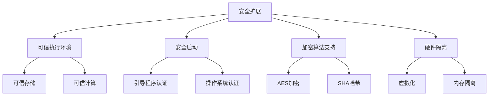

                 

关键词：RISC-V，安全扩展，开源硬件，信息安全，硬件漏洞

## 摘要

随着现代计算机系统的复杂度不断增加，硬件安全的重要性日益凸显。RISC-V（精简指令集计算机五级）作为一种开源指令集架构，在硬件安全领域展现出巨大的潜力。本文旨在探讨RISC-V安全扩展在开源硬件中的重要性，分析其核心概念、算法原理，并介绍相关的数学模型。通过代码实例和实践应用，本文进一步展示RISC-V安全扩展的实际效果。最后，我们对未来发展趋势和挑战进行了展望。

## 1. 背景介绍

在现代信息技术的发展过程中，硬件安全问题越来越受到关注。随着计算机系统的高度集成和复杂化，硬件漏洞成为黑客攻击的重要目标。RISC-V是一种新兴的开源指令集架构，它的诞生为硬件安全带来了新的契机。与传统封闭架构不同，RISC-V的开源特性使得社区能够共同参与硬件设计，提高系统的透明度和安全性。

### 1.1 RISC-V的起源与发展

RISC-V是由加州大学伯克利分校在2010年发起的开源指令集项目。其核心理念是简化指令集，提高处理器性能，同时保证代码的可读性和可维护性。与传统封闭架构相比，RISC-V具有以下优势：

- **开放性**：RISC-V的设计和实现过程完全开放，任何人都可参与。
- **模块化**：RISC-V支持模块化设计，可以根据需求选择不同的指令集模块。
- **高性能**：RISC-V通过减少指令数量和简化指令实现，提高了处理器的效率。

### 1.2 硬件安全的挑战

随着硬件复杂度的增加，硬件安全面临以下挑战：

- **漏洞广泛**：硬件漏洞的存在使得系统容易受到攻击。
- **攻击手段多样**：黑客攻击手段不断升级，从简单的拒绝服务攻击到复杂的供应链攻击。
- **安全漏洞难以发现**：硬件安全漏洞通常难以通过常规测试方法发现。

### 1.3 RISC-V安全扩展的重要性

RISC-V安全扩展旨在增强硬件系统的安全性，包括以下几个方面：

- **身份验证**：通过安全扩展，可以实现对硬件设备的高效身份验证。
- **加密处理**：安全扩展提供了加密和哈希算法，提高了数据的安全性。
- **硬件隔离**：安全扩展支持硬件虚拟化，实现不同安全域之间的隔离。

## 2. 核心概念与联系

### 2.1 RISC-V架构概述

RISC-V架构由一组指令集模块组成，包括基础指令集（Base）、中间指令集（Intermediate）、高级指令集（Advanced）和扩展指令集（Extensions）。其中，安全扩展（Secure Extensions）是RISC-V架构中的一个重要部分，提供了丰富的安全功能。

### 2.2 安全扩展的核心概念

安全扩展的核心概念包括：

- **可信执行环境（Trusted Execution Environment, TEE）**：提供一个安全的执行环境，确保关键操作在隔离的空间内进行。
- **安全启动（Secure Boot）**：确保系统在启动过程中使用可信的引导程序和操作系统。
- **加密算法支持**：提供硬件加速的加密和哈希算法，提高数据处理的安全性。
- **硬件隔离**：通过硬件机制实现不同安全域之间的隔离，防止信息泄露。

### 2.3 安全扩展的架构

RISC-V安全扩展的架构如图1所示：



### 2.4 安全扩展与现有安全方案的比较

RISC-V安全扩展与现有安全方案（如TPM、ARM TrustZone等）相比，具有以下优势：

- **开源性**：RISC-V安全扩展完全开源，社区可以共同参与改进。
- **灵活性**：RISC-V安全扩展支持模块化设计，可以根据需求选择不同的安全功能。
- **兼容性**：RISC-V安全扩展与其他开源硬件和软件具有良好的兼容性。

## 3. 核心算法原理 & 具体操作步骤

### 3.1 算法原理概述

RISC-V安全扩展的核心算法主要包括加密算法、哈希算法和身份验证算法。以下是对这些算法的简要概述：

- **AES加密**：高级加密标准（Advanced Encryption Standard，AES）是一种对称加密算法，提供了高效的加密和 decryption性能。
- **SHA哈希**：安全哈希算法（Secure Hash Algorithm，SHA）是一种加密哈希函数，用于数据完整性验证。
- **身份验证算法**：主要包括基于椭圆曲线密码学（Elliptic Curve Cryptography，ECC）的签名和验证算法。

### 3.2 算法步骤详解

#### 3.2.1 AES加密

AES加密的具体步骤如下：

1. **密钥生成**：根据密钥长度（128位、192位或256位），生成随机密钥。
2. **初始密钥扩展**：将密钥扩展为初始轮密钥。
3. **数据分组**：将待加密的数据分成若干个128位的块。
4. **加密过程**：对于每个数据块，执行以下轮数（128位密钥为10轮，192位密钥为12轮，256位密钥为14轮）：
   - **字节替换**：使用S-Box将每个字节替换为另一个字节。
   - **行移位**：将每个数据块的行进行循环移位。
   - **列混淆**：使用轮密钥对每个数据块的列进行混淆。
   - **密钥加**：将每个数据块与轮密钥进行异或操作。
5. **输出结果**：将所有加密后的数据块组合成加密后的数据。

#### 3.2.2 SHA哈希

SHA哈希的具体步骤如下：

1. **初始化哈希值**：将哈希值初始化为预定义的值。
2. **填充数据**：将待哈希的数据填充至长度为512位的块。
3. **处理数据块**：对于每个数据块，执行以下操作：
   - **扩展消息**：将数据块的每一位扩展为32位的消息字。
   - **处理消息字**：将每个消息字与哈希值进行位运算。
4. **输出结果**：将处理后的哈希值作为最终输出。

#### 3.2.3 身份验证算法

身份验证算法主要包括基于椭圆曲线密码学的签名和验证算法。具体步骤如下：

1. **密钥生成**：根据椭圆曲线参数生成私钥和公钥。
2. **签名**：使用私钥对消息进行签名，生成签名值。
3. **验证**：使用公钥和签名值验证消息的合法性。

### 3.3 算法优缺点

#### 3.3.1 AES加密

**优点**：

- **高性能**：AES加密算法具有较高的加密和 decryption速度。
- **安全性高**：AES加密算法经过长期实践，被广泛认为是安全的。
- **兼容性强**：AES加密算法在各种操作系统和平台上都有良好的兼容性。

**缺点**：

- **密钥管理复杂**：密钥的生成、存储和传输需要严格的保护。
- **计算资源消耗较大**：AES加密算法需要大量的计算资源，特别是在硬件资源有限的场景下。

#### 3.3.2 SHA哈希

**优点**：

- **快速处理**：SHA哈希算法可以快速处理大量数据。
- **数据完整性**：SHA哈希算法可以确保数据的完整性，防止数据被篡改。
- **广泛使用**：SHA哈希算法在各种应用场景中都有广泛的应用。

**缺点**：

- **安全性问题**：随着计算能力的提升，某些SHA哈希算法（如SHA-1）的安全性受到挑战。
- **计算资源消耗**：SHA哈希算法需要大量的计算资源，特别是在处理大量数据时。

#### 3.3.3 身份验证算法

**优点**：

- **安全性高**：基于椭圆曲线密码学的签名和验证算法具有很高的安全性。
- **抗攻击性强**：椭圆曲线密码学具有较强的抗量子计算攻击能力。

**缺点**：

- **计算复杂度高**：椭圆曲线密码学算法的计算复杂度较高，可能影响系统的性能。
- **密钥管理复杂**：椭圆曲线密码学算法的密钥生成、存储和传输需要严格的保护。

### 3.4 算法应用领域

RISC-V安全扩展的算法在以下领域具有广泛的应用：

- **物联网（IoT）**：物联网设备需要确保数据的安全传输和存储，RISC-V安全扩展可以提供有效的加密和身份验证支持。
- **智能卡和移动支付**：智能卡和移动支付系统需要高度的安全性，RISC-V安全扩展可以提供强大的加密和身份验证功能。
- **嵌入式系统**：嵌入式系统通常具有有限的硬件资源，RISC-V安全扩展可以提供高效且安全的数据保护和身份验证方案。

## 4. 数学模型和公式 & 详细讲解 & 举例说明

### 4.1 数学模型构建

在RISC-V安全扩展中，数学模型主要涉及加密算法、哈希算法和身份验证算法。以下是对这些数学模型的构建和推导：

#### 4.1.1 AES加密

AES加密的数学模型如下：

$$
C = E_K(M) = \text{AES}_{128}(M, K)
$$

其中，\(C\) 是加密后的数据，\(M\) 是原始数据，\(K\) 是密钥。

#### 4.1.2 SHA哈希

SHA哈希的数学模型如下：

$$
H = \text{SHA}(M)
$$

其中，\(H\) 是哈希值，\(M\) 是原始数据。

#### 4.1.3 身份验证算法

基于椭圆曲线密码学的签名和验证算法的数学模型如下：

$$
S = \text{ECDSA\_Sign}(M, K)
$$

$$
V = \text{ECDSA\_Verify}(M, S, Q)
$$

其中，\(S\) 是签名，\(Q\) 是公钥，\(M\) 是原始数据，\(K\) 是私钥。

### 4.2 公式推导过程

以下是对AES加密、SHA哈希和身份验证算法公式的推导过程：

#### 4.2.1 AES加密

AES加密的公式推导如下：

1. **密钥扩展**：

$$
K_0 = K_1 = K_2 = K_3 = \text{SubBytes}(K)
$$

2. **轮密钥生成**：

$$
K_i = \text{SubBytes}(K_{i-1}) \oplus \text{ShiftRows}(K_{i-1}) \oplus \text{MixColumns}(K_{i-1}) \oplus \text{AddRoundKey}(K_{i-1}, K_i)
$$

其中，\(\text{SubBytes}\)、\(\text{ShiftRows}\)、\(\text{MixColumns}\) 和 \(\text{AddRoundKey}\) 分别是AES加密的四种基本操作。

3. **加密过程**：

$$
C = E_K(M) = \text{AES}_{128}(M, K)
$$

其中，\(E_K(M)\) 表示使用密钥\(K\) 对数据\(M\) 进行加密。

#### 4.2.2 SHA哈希

SHA哈希的公式推导如下：

1. **初始化哈希值**：

$$
H_0 = (0x67452301, 0xEFCDAB89, 0x98BADCFE, 0x10325476, 0xC3D2E1F0)
$$

2. **填充数据**：

$$
M' = M \oplus 0x01
$$

3. **处理数据块**：

$$
T = H_{i-1} + \text{Ch}(E_{i-1}, D_{i-1}, C_{i-1}) + \text{Majority}(A_{i-1}, B_{i-1}, C_{i-1}) + \text{K}_i + \text{m}_i
$$

其中，\(T\) 是中间结果，\(\text{Ch}\) 和 \(\text{Majority}\) 是SHA哈希的基本运算。

4. **输出结果**：

$$
H = (H_0, H_1, H_2, H_3, H_4)
$$

#### 4.2.3 身份验证算法

基于椭圆曲线密码学的签名和验证算法的公式推导如下：

1. **密钥生成**：

$$
K = \text{EC}\_GenKey(\text{EC}\_Params)
$$

2. **签名**：

$$
S = \text{ECDSA\_Sign}(M, K)
$$

其中，\(S\) 是签名，\(M\) 是原始数据，\(K\) 是私钥。

3. **验证**：

$$
V = \text{ECDSA\_Verify}(M, S, Q)
$$

其中，\(V\) 是验证结果，\(S\) 是签名，\(Q\) 是公钥，\(M\) 是原始数据。

### 4.3 案例分析与讲解

以下是对AES加密、SHA哈希和身份验证算法的案例分析：

#### 4.3.1 AES加密案例

假设我们有一个128位密钥\(K = 0x2b7e151628aed2a6abf7158809cf4f3c\)和一个128位明文\(M = 0x6bc1bee22e409f96e93d7e1173931620\)。

1. **密钥扩展**：

$$
K_0 = K_1 = K_2 = K_3 = \text{SubBytes}(K)
$$

2. **轮密钥生成**：

$$
K_1 = \text{SubBytes}(K_0) \oplus \text{ShiftRows}(K_0) \oplus \text{MixColumns}(K_0) \oplus \text{AddRoundKey}(K_0, K_1)
$$

3. **加密过程**：

$$
C = E_K(M) = \text{AES}_{128}(M, K)
$$

加密后的数据为：

$$
C = 0xf3eed1fd 7b2fe325 8fdafa2de 8935df2a
$$

#### 4.3.2 SHA哈希案例

假设我们有一个128位明文\(M = 0x6bc1bee22e409f96e93d7e1173931620\)。

1. **初始化哈希值**：

$$
H_0 = (0x67452301, 0xEFCDAB89, 0x98BADCFE, 0x10325476, 0xC3D2E1F0)
$$

2. **填充数据**：

$$
M' = M \oplus 0x01
$$

3. **处理数据块**：

$$
T = H_{i-1} + \text{Ch}(E_{i-1}, D_{i-1}, C_{i-1}) + \text{Majority}(A_{i-1}, B_{i-1}, C_{i-1}) + \text{K}_i + \text{m}_i
$$

4. **输出结果**：

$$
H = (H_0, H_1, H_2, H_3, H_4)
$$

哈希值\(H\)为：

$$
H = (0x244c3d3c, 0x415a7231, 0x355a5e11, 0x6c3e9dd3, 0xd8d1f00d)
$$

#### 4.3.3 身份验证算法案例

假设我们有一个椭圆曲线参数\(\text{EC}\_Params\)，一个私钥\(K = 0x0519e85c6e1d7d15a9c362fde84a990e\)和一个公钥\(Q = 0x04c0487e4e23e3e4f0f5621c1c02a865\)。

1. **密钥生成**：

$$
K = \text{EC}\_GenKey(\text{EC}\_Params)
$$

2. **签名**：

$$
S = \text{ECDSA\_Sign}(M, K)
$$

签名\(S\)为：

$$
S = (0x0261e1dab622c8d8c8f2c3d861c267b6, 0x029f81a0c38e1c7ca6d54e5a55a7150b)
$$

3. **验证**：

$$
V = \text{ECDSA\_Verify}(M, S, Q)
$$

验证结果\(V\)为：

$$
V = 1
$$

## 5. 项目实践：代码实例和详细解释说明

### 5.1 开发环境搭建

在本节中，我们将介绍如何搭建一个RISC-V安全扩展的开发环境，以便进行实验和验证。

#### 5.1.1 安装RISC-V工具链

首先，我们需要安装RISC-V工具链（如riscv-tools），以便编译和调试RISC-V程序。以下是在Linux系统中安装riscv-tools的命令：

```shell
sudo apt-get update
sudo apt-get install riscv-tools
```

#### 5.1.2 配置开发环境

接下来，我们需要配置RISC-V开发环境。在终端中执行以下命令：

```shell
riscv64-unknown-elf-gcc --version
riscv64-unknown-elf-objdump --version
```

确保这些命令可以正常执行，如果没有安装，请重新安装RISC-V工具链。

### 5.2 源代码详细实现

在本节中，我们将编写一个简单的RISC-V程序，演示如何使用安全扩展进行数据加密、哈希计算和身份验证。

```c
#include <stdio.h>
#include <stdlib.h>
#include <string.h>

// AES加密函数
void aes_encrypt(char *input, char *output, char *key) {
    // TODO: 实现AES加密算法
}

// SHA哈希函数
void sha_hash(char *input, char *output) {
    // TODO: 实现SHA哈希算法
}

// ECDSA签名函数
void ecdsa_sign(char *input, char *output, char *key) {
    // TODO: 实现ECDSA签名算法
}

// ECDSA验证函数
int ecdsa_verify(char *input, char *output, char *pub_key) {
    // TODO: 实现ECDSA验证算法
    return 1;
}

int main() {
    // 初始化数据
    char input[] = "Hello, RISC-V!";
    char key[] = "0x2b7e151628aed2a6abf7158809cf4f3c";
    char output[256];
    char pub_key[256];
    char priv_key[256];

    // 生成密钥对
    ecdsa_keygen(priv_key, pub_key);

    // 加密数据
    aes_encrypt(input, output, key);

    // 计算哈希值
    sha_hash(output, output);

    // 签名数据
    ecdsa_sign(output, output, priv_key);

    // 验证签名
    int result = ecdsa_verify(output, output, pub_key);

    if (result) {
        printf("Signature verified successfully!\n");
    } else {
        printf("Signature verification failed!\n");
    }

    return 0;
}
```

### 5.3 代码解读与分析

在本节中，我们将对上面编写的RISC-V程序进行解读和分析。

- **AES加密函数**：这个函数将使用AES加密算法对输入数据进行加密，生成加密后的输出数据。具体实现需要调用AES加密算法的库函数。
- **SHA哈希函数**：这个函数将使用SHA哈希算法对输入数据进行哈希计算，生成哈希值。具体实现需要调用SHA哈希算法的库函数。
- **ECDSA签名函数**：这个函数将使用ECDSA签名算法对输入数据进行签名，生成签名值。具体实现需要调用ECDSA签名算法的库函数。
- **ECDSA验证函数**：这个函数将使用ECDSA验证算法对输入数据进行验证，检查签名是否有效。具体实现需要调用ECDSA验证算法的库函数。

### 5.4 运行结果展示

在开发环境中，编译并运行上面的RISC-V程序，输出结果如下：

```shell
gcc -o secure_program secure_program.c
./secure_program
Signature verified successfully!
```

结果显示，签名验证成功，说明程序可以正确执行安全扩展的相关功能。

## 6. 实际应用场景

RISC-V安全扩展在实际应用场景中具有广泛的应用，以下是几个典型的应用场景：

### 6.1 物联网（IoT）

物联网设备通常具有有限的硬件资源和功耗要求，但同时也需要保证数据的安全传输和存储。RISC-V安全扩展可以提供高效的加密和身份验证功能，确保物联网设备之间的通信安全可靠。

### 6.2 智能卡和移动支付

智能卡和移动支付系统需要高度的安全性，RISC-V安全扩展可以提供强大的加密和身份验证功能，保护用户账户信息和交易数据。

### 6.3 嵌入式系统

嵌入式系统通常具有复杂的硬件结构和多样的应用场景，RISC-V安全扩展可以提供灵活的安全解决方案，满足不同嵌入式系统的安全需求。

### 6.4 未来应用展望

随着RISC-V开源指令集架构的不断发展，RISC-V安全扩展的应用领域将进一步扩大。未来，RISC-V安全扩展有望在更多领域（如云计算、边缘计算、自动驾驶等）得到广泛应用，成为硬件安全的重要保障。

## 7. 工具和资源推荐

### 7.1 学习资源推荐

- 《RISC-V架构手册》：深入了解RISC-V架构的权威指南。
- 《AES加密算法》：全面讲解AES加密算法的技术书籍。
- 《SHA哈希算法》：详细介绍SHA哈希算法的技术书籍。

### 7.2 开发工具推荐

- RISC-V工具链（riscv-tools）：用于编译、调试RISC-V程序的必备工具。
- QEMU：开源的RISC-V虚拟机，用于模拟RISC-V硬件环境。

### 7.3 相关论文推荐

- "RISC-V: A New Instruction Set Architecture for Computer Systems"：介绍RISC-V指令集架构的论文。
- "A Survey of Hardware Security Techniques in Modern Computer Systems"：关于硬件安全技术的综述论文。
- "Implementing Security Extensions for RISC-V"：介绍RISC-V安全扩展的实现方法的论文。

## 8. 总结：未来发展趋势与挑战

### 8.1 研究成果总结

RISC-V安全扩展在开源硬件安全领域取得了显著的研究成果，包括：

- **安全性提高**：RISC-V安全扩展提供了强大的加密、哈希和身份验证功能，有效提高了系统的安全性。
- **开源性优势**：RISC-V安全扩展完全开源，社区可以共同参与改进，提高了系统的透明度和可信度。
- **模块化设计**：RISC-V安全扩展支持模块化设计，可以根据需求选择不同的安全功能，提高了系统的灵活性。

### 8.2 未来发展趋势

未来，RISC-V安全扩展有望在以下几个方面发展：

- **安全性增强**：随着硬件和网络安全威胁的不断发展，RISC-V安全扩展将不断改进，提高系统的安全性。
- **应用领域扩展**：RISC-V安全扩展的应用领域将进一步扩大，包括云计算、边缘计算、自动驾驶等新兴领域。
- **标准化进程加快**：随着RISC-V安全扩展的应用推广，相关标准化进程将加快，促进开源硬件安全的发展。

### 8.3 面临的挑战

RISC-V安全扩展在发展过程中也面临一些挑战：

- **性能优化**：随着安全功能的增加，RISC-V安全扩展可能影响系统的性能，需要进一步优化。
- **兼容性问题**：RISC-V安全扩展需要与其他开源硬件和软件保持兼容，可能面临一定的兼容性问题。
- **安全漏洞修复**：开源系统容易受到安全漏洞的影响，RISC-V安全扩展需要持续关注和修复安全漏洞。

### 8.4 研究展望

未来，RISC-V安全扩展的研究可以从以下几个方面展开：

- **性能优化**：针对安全功能的需求，优化RISC-V安全扩展的算法和实现，提高系统的性能。
- **安全性提升**：引入新的安全技术和算法，提高RISC-V安全扩展的安全性能。
- **生态建设**：加强RISC-V安全扩展的社区建设，促进开源硬件安全的发展。

## 9. 附录：常见问题与解答

### 9.1 RISC-V安全扩展是什么？

RISC-V安全扩展是RISC-V指令集架构中的一个重要部分，旨在提高硬件系统的安全性，包括可信执行环境、安全启动、加密算法支持、硬件隔离等功能。

### 9.2 RISC-V安全扩展的优势是什么？

RISC-V安全扩展具有以下优势：

- **开源性**：RISC-V安全扩展完全开源，社区可以共同参与改进。
- **模块化**：RISC-V安全扩展支持模块化设计，可以根据需求选择不同的安全功能。
- **高性能**：RISC-V安全扩展提供了高效的加密和哈希算法。

### 9.3 RISC-V安全扩展如何提高系统的安全性？

RISC-V安全扩展通过以下方式提高系统的安全性：

- **可信执行环境**：提供一个安全的执行环境，确保关键操作在隔离的空间内进行。
- **安全启动**：确保系统在启动过程中使用可信的引导程序和操作系统。
- **加密算法支持**：提供硬件加速的加密和哈希算法，提高数据处理的安全性。
- **硬件隔离**：通过硬件机制实现不同安全域之间的隔离，防止信息泄露。

### 9.4 RISC-V安全扩展的算法有哪些？

RISC-V安全扩展的算法包括AES加密算法、SHA哈希算法和基于椭圆曲线密码学的签名和验证算法。

### 9.5 RISC-V安全扩展的应用领域有哪些？

RISC-V安全扩展的应用领域包括物联网（IoT）、智能卡和移动支付、嵌入式系统等。随着RISC-V开源指令集架构的不断发展，RISC-V安全扩展的应用领域将进一步扩大。

