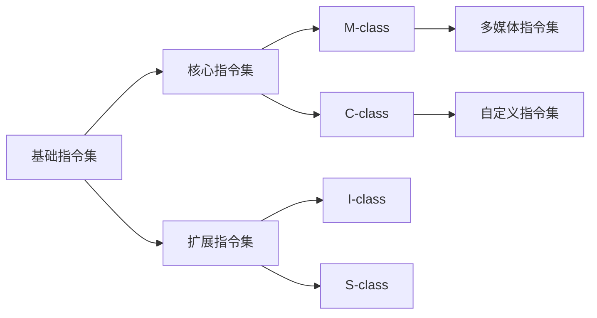

                 

## 1. 背景介绍

RISC-V（精简指令集计算机五级指令集）是一种开源指令集架构，起源于加州大学伯克利分校。它的诞生标志着计算机硬件设计领域的一次重要变革。RISC-V开源指令集的出现，旨在为硬件设计和软件开发提供一个灵活、可扩展的平台，促进创新和竞争。

RISC-V指令集的起源可以追溯到2005年，当时加州大学伯克利分校的研究人员提出了这个概念。最初的目的是为了研究开源指令集架构在计算机硬件设计中的应用。随着研究的深入，RISC-V逐渐成为了一个具有广泛影响力的项目，吸引了全球众多企业和研究机构的参与。

RISC-V的特点之一是高度模块化。这意味着开发者可以根据自己的需求，灵活地组合和定制指令集。这种灵活性使得RISC-V可以应用于各种不同的场景，从嵌入式系统到高性能计算，都可以找到合适的解决方案。此外，RISC-V还支持多种不同的存储和通信架构，使得它在硬件设计上具有很高的可扩展性。

RISC-V的另一大特点是开源。这意味着任何人都可以自由地使用、修改和分发RISC-V指令集和相关技术。这种开放性为硬件设计和软件开发带来了极大的便利，同时也促进了创新和竞争。在RISC-V的生态系统中，有许多企业和研究机构共同参与，共同推动RISC-V的发展。

RISC-V的应用领域非常广泛。目前，它已经被广泛应用于嵌入式系统、物联网、人工智能、云计算等多个领域。随着RISC-V的不断发展和完善，其应用范围还将进一步扩大。

总的来说，RISC-V作为一种开源指令集架构，具有高度模块化和开源的特点，为硬件设计和软件开发提供了极大的灵活性和便利性。随着其在各个领域的广泛应用，RISC-V有望成为未来计算机硬件设计的主流技术。

## 2. 核心概念与联系

### 2.1 RISC-V 指令集概述

RISC-V（精简指令集计算机五级指令集）是一种开源指令集架构，其核心概念基于精简指令集计算机（RISC）的原则。RISC-V的设计目标是提供一种高度模块化、灵活且易于扩展的指令集，以满足不同应用场景的需求。

RISC-V指令集的基本概念包括：

- **精简指令集**：RISC-V指令集的设计遵循RISC原则，即指令集简单、指令长度固定，以减少指令执行时间。RISC-V的指令集包括加载/存储指令、算术逻辑单元（ALU）指令、控制流指令和数据传输指令等。

- **扩展性**：RISC-V指令集支持多种不同的扩展指令集，如多媒体扩展（M-class）、自定义指令扩展（C-class）等。开发者可以根据自己的需求，选择合适的扩展指令集。

- **开源**：RISC-V是一种开源指令集架构，任何人都可以免费使用、修改和分发。这种开放性鼓励了创新和合作，使得RISC-V生态系统得以迅速发展。

- **指令集层次结构**：RISC-V指令集分为多个层次，包括基础指令集（I-class）、核心指令集（S-class）、扩展指令集（M-class、C-class等）。每个层次都有不同的指令集和功能，开发者可以根据项目需求选择合适的层次。

### 2.2 RISC-V 架构的 Mermaid 流程图

以下是 RISC-V 指令集架构的 Mermaid 流程图，展示了不同层次的指令集及其关系。



### 2.3 RISC-V 指令集与现有指令集的比较

RISC-V 指令集与现有的指令集（如 x86、ARM）在某些方面存在显著差异。以下是 RISC-V 与现有指令集的比较：

- **开源与封闭**：RISC-V 是一种开源指令集架构，任何人都可以免费使用、修改和分发。而现有的指令集（如 x86、ARM）通常是封闭的，由少数公司控制。

- **模块化与封闭**：RISC-V 指令集设计高度模块化，开发者可以根据需求选择合适的指令集。而现有的指令集通常较为封闭，难以修改和扩展。

- **指令集复杂度**：RISC-V 指令集设计相对简单，遵循精简指令集原则，以减少指令执行时间。而现有的指令集（如 x86）则较为复杂，包含大量指令和功能。

- **硬件生态**：RISC-V 的硬件生态正在快速发展，但相对于 x86 和 ARM，现有的硬件生态更为成熟。

总的来说，RISC-V 指令集在开源、模块化和简化指令集设计方面具有显著优势。然而，现有的指令集在硬件生态和成熟度方面仍然占据一定优势。

## 3. 核心算法原理 & 具体操作步骤

### 3.1 算法原理概述

RISC-V 的核心算法原理主要基于精简指令集计算机（RISC）的设计理念。RISC 的核心思想是将指令集设计得尽可能简单，减少指令的执行时间，从而提高计算机的运行效率。RISC-V 指令集采用固定长度的指令格式，以简化指令的解析和执行过程。

RISC-V 的核心算法原理包括以下几个方面：

1. **精简指令集**：RISC-V 指令集包含一系列简单、高效的指令，如加载/存储指令、算术逻辑单元（ALU）指令、控制流指令和数据传输指令等。这些指令旨在减少指令执行时间，提高计算机的运行效率。

2. **固定长度指令**：RISC-V 指令集采用固定长度的指令格式，以简化指令的解析和执行过程。这种指令格式有助于提高指令流水线的效率。

3. **指令级并行**：RISC-V 支持指令级并行（ILP），通过多个指令的并行执行来提高计算机的运行速度。RISC-V 指令集的简单性使得指令级并行更加高效。

4. **可扩展性**：RISC-V 指令集设计高度模块化，支持多种扩展指令集，如多媒体扩展（M-class）、自定义指令扩展（C-class）等。这种可扩展性使得 RISC-V 指令集可以适应不同的应用场景。

### 3.2 算法步骤详解

以下是 RISC-V 核心算法的具体操作步骤：

1. **指令解析**：计算机的控制器读取指令，将其解析为对应的操作码和操作数。

2. **指令执行**：控制器根据解析出的指令，执行相应的操作。例如，如果指令是加载/存储指令，则将数据从内存中读取到寄存器中；如果指令是算术逻辑单元（ALU）指令，则执行相应的算术或逻辑运算。

3. **指令流水线**：为了提高指令执行速度，RISC-V 采用指令流水线技术。指令流水线将指令执行过程分为多个阶段，每个阶段可以并行执行多个指令。常见的指令流水线阶段包括取指、解码、执行、写回等。

4. **中断处理**：RISC-V 支持中断处理，当有外部事件发生时，计算机可以暂停当前执行的指令，处理中断事件。

5. **异常处理**：RISC-V 支持异常处理，当出现异常情况时（如除以零、地址越界等），计算机可以暂停当前执行的指令，跳转到相应的异常处理程序进行处理。

6. **指令扩展**：RISC-V 支持多种扩展指令集，如多媒体扩展（M-class）、自定义指令扩展（C-class）等。开发者可以根据需求选择合适的扩展指令集，以实现特定的功能。

### 3.3 算法优缺点

RISC-V 核心算法具有以下优点：

- **高效性**：RISC-V 指令集采用精简指令集原则，减少指令执行时间，提高计算机的运行效率。

- **灵活性**：RISC-V 指令集设计高度模块化，支持多种扩展指令集，可以适应不同的应用场景。

- **可扩展性**：RISC-V 指令集可以灵活地扩展新的指令集，以满足不断变化的需求。

然而，RISC-V 核心算法也存在一些缺点：

- **性能瓶颈**：由于 RISC-V 指令集相对简单，可能在某些复杂运算上存在性能瓶颈。

- **生态成熟度**：相比于现有的指令集（如 x86、ARM），RISC-V 的硬件生态和软件生态尚不成熟。

### 3.4 算法应用领域

RISC-V 核心算法在以下领域具有广泛的应用：

- **嵌入式系统**：RISC-V 指令集的简单性和高效性使其非常适合用于嵌入式系统，如物联网设备、智能家居等。

- **人工智能**：RISC-V 指令集的支持多种扩展指令集的特点，使其非常适合用于人工智能领域的计算，如机器学习、图像处理等。

- **云计算**：RISC-V 指令集的可扩展性和灵活性使其适用于云计算场景，如分布式计算、大数据处理等。

- **高性能计算**：RISC-V 指令集的指令级并行能力使其适用于高性能计算场景，如科学计算、模拟仿真等。

## 4. 数学模型和公式 & 详细讲解 & 举例说明

### 4.1 数学模型构建

在讨论 RISC-V 指令集的性能评估时，我们可以构建一个简单的数学模型。这个模型将考虑指令集的复杂性、指令流水线的效率以及指令级并行的能力。

假设我们有一个简单的性能评估函数 P，用来衡量指令集的性能。该函数可以表示为：

\[ P = f(\text{指令集复杂性}, \text{指令流水线效率}, \text{指令级并行能力}) \]

其中：

- **指令集复杂性**：表示指令集的设计复杂度，可以用来衡量指令的数量和多样性。
- **指令流水线效率**：表示指令流水线的效率，可以用来衡量指令在流水线中的执行速度。
- **指令级并行能力**：表示指令集的并行执行能力，可以用来衡量多个指令是否可以同时执行。

### 4.2 公式推导过程

为了更具体地描述上述性能评估函数，我们可以对其进行进一步推导。首先，我们定义以下变量：

- \( C \)：指令集的复杂性，可以表示为指令的数量和多样性。
- \( E \)：指令流水线效率，可以表示为每条指令的平均执行时间。
- \( P \)：指令级并行能力，可以表示为并行执行的指令数量。

根据这些变量，我们可以推导出以下公式：

\[ P = f(C, E, P) = \frac{C}{E \cdot P} \]

这个公式的含义是，性能 \( P \) 等于指令集复杂性 \( C \) 除以指令流水线效率 \( E \) 和指令级并行能力 \( P \) 的乘积。

### 4.3 案例分析与讲解

为了更好地理解上述公式，我们可以通过一个简单的案例来进行说明。

假设我们有两个不同的指令集 A 和 B，它们各自的性能如下：

- **指令集 A**：有100条指令，每条指令的平均执行时间是 1 单位时间，支持4条指令的并行执行。
- **指令集 B**：有50条指令，每条指令的平均执行时间是 2 单位时间，支持2条指令的并行执行。

根据上述公式，我们可以计算出这两个指令集的性能：

- **指令集 A**：\( P_A = \frac{100}{1 \cdot 4} = 25 \)
- **指令集 B**：\( P_B = \frac{50}{2 \cdot 2} = 12.5 \)

从这个例子中，我们可以看出，尽管指令集 A 的指令数量更多，但它的性能却比指令集 B 更高。这是因为指令集 A 的指令执行时间较短，并且支持更多的指令级并行。

### 4.4 深入探讨

除了上述的简单性能评估函数，我们还可以进一步探讨 RISC-V 指令集的性能评估模型。例如，我们可以考虑以下因素：

- **指令缓存命中率**：指令缓存命中率可以影响指令的执行速度，从而影响整体性能。
- **数据缓存命中率**：数据缓存命中率可以影响数据的访问速度，从而影响整体性能。
- **功耗**：功耗是影响嵌入式系统性能的重要因素，特别是在电池供电的设备中。

通过对这些因素的综合考虑，我们可以构建一个更加全面的性能评估模型，从而更准确地评估 RISC-V 指令集的性能。

## 5. 项目实践：代码实例和详细解释说明

### 5.1 开发环境搭建

在开始编写 RISC-V 代码实例之前，我们需要搭建一个合适的开发环境。以下是搭建 RISC-V 开发环境的步骤：

1. **安装 RISC-V 工具链**：首先，我们需要安装 RISC-V 工具链，例如 RV32IMAC 工具链。我们可以在官网上下载相应的工具链，并按照说明进行安装。

2. **配置交叉编译工具**：由于我们将在主机上编译 RISC-V 代码，我们需要配置交叉编译工具。交叉编译工具允许我们在主机上编译运行在目标设备上的代码。例如，我们可以使用 `riscv64-unknown-elf-gcc` 作为交叉编译工具。

3. **搭建模拟器**：为了方便测试和调试 RISC-V 代码，我们可以使用 QEMU 模拟器。QEMU 模拟器可以模拟 RISC-V 处理器，使我们能够在主机上运行和调试 RISC-V 程序。

4. **编写 Makefile**：为了简化编译和调试过程，我们可以编写一个 Makefile，其中包含编译和调试命令。例如，我们可以使用以下 Makefile：

```makefile
CC=riscv64-unknown-elf-gcc
LD=riscv64-unknown-elf-ld
QEMU=qemu-system-riscv64

all: program.elf

program.elf: program.S
	$(CC) -o program.elf -T link.ld program.S

run: program.elf
	$(QEMU) -machine virt -nographic -S -drive format=raw,file=program.elf

clean:
	rm -f program.elf program.o
```

### 5.2 源代码详细实现

以下是一个简单的 RISC-V 源代码实例，用于演示 RISC-V 指令集的基本操作。

```assembly
.section .data
msg:
	.string "Hello, world!"

.section .text
.global _start

_start:
    # 打印 "Hello, world!"
    la a0, msg
    li a7, 64
    ecall

    # 退出程序
    li a7, 93
    li a0, 0
    ecall
```

这段代码包含以下关键部分：

1. **数据段**：定义了一个字符串常量 `msg`，用于存储 "Hello, world!"。

2. **代码段**：包含两个函数 `_start` 和 `exit`。

   - `_start` 函数：用于程序的入口点。它首先加载字符串地址到寄存器 `a0`，然后调用 `ecall` 系统调用打印字符串。

   - `exit` 函数：用于程序退出。它设置寄存器 `a7` 为 `93`（表示 `exit` 系统调用），然后调用 `ecall` 系统调用结束程序。

### 5.3 代码解读与分析

1. **数据段解析**：

```assembly
.section .data
msg:
	.string "Hello, world!"
```

这段代码定义了一个数据段，用于存储字符串常量 `msg`。`msg` 字符串存储了 "Hello, world!"。

2. **代码段解析**：

```assembly
.section .text
.global _start

_start:
    # 打印 "Hello, world!"
    la a0, msg
    li a7, 64
    ecall

    # 退出程序
    li a7, 93
    li a0, 0
    ecall
```

这段代码定义了一个代码段，包含两个函数 `_start` 和 `exit`。

- `_start` 函数：首先使用 `la` 指令将 `msg` 的地址加载到寄存器 `a0`。然后，将寄存器 `a7` 设置为 `64`（表示 `print_string` 系统调用），并使用 `ecall` 系统调用打印字符串。最后，将寄存器 `a7` 设置为 `93`（表示 `exit` 系统调用），将寄存器 `a0` 设置为 `0`（表示退出状态），并使用 `ecall` 系统调用结束程序。

- `exit` 函数：这个函数不需要在示例代码中实现，但它在实际应用中非常重要。它用于优雅地结束程序，并将退出状态传递给操作系统。

### 5.4 运行结果展示

在配置好开发环境后，我们可以使用以下命令运行示例代码：

```shell
make run
```

运行结果将在 QEMU 模拟器中输出 "Hello, world!"，并退出程序。

## 6. 实际应用场景

### 6.1 嵌入式系统

RISC-V 指令集在嵌入式系统中的应用非常广泛。由于其高效性和灵活性，RISC-V 成为了许多嵌入式系统的首选处理器架构。例如，在物联网设备、智能家居、工业自动化等领域，RISC-V 指令集提供了强大的支持。其开源特性使得开发者可以轻松地定制和优化处理器，以满足特定应用的需求。

### 6.2 物联网

随着物联网（IoT）技术的快速发展，RISC-V 指令集在物联网设备中的应用也越来越广泛。RISC-V 的低功耗、高效性和灵活性使其成为物联网设备处理器的理想选择。例如，RISC-V 指令集被广泛应用于智能传感器、智能门锁、智能灯泡等物联网设备中，为这些设备提供了强大的计算能力。

### 6.3 人工智能

人工智能（AI）领域的快速发展对处理器架构提出了更高的要求。RISC-V 指令集的支持多种扩展指令集的特点，使其在人工智能领域具有广泛的应用前景。例如，RISC-V 的多媒体扩展（M-class）和自定义指令扩展（C-class）可以为人工智能算法提供强大的支持。这使得 RISC-V 成为人工智能处理器架构的理想选择。

### 6.4 云计算

在云计算领域，RISC-V 指令集也具有很大的应用潜力。RISC-V 的可扩展性和灵活性使其能够适应不同规模和类型的云计算需求。例如，RISC-V 指令集可以用于云服务器、数据中心和边缘计算设备，为云计算提供高效的计算能力。

### 6.5 高性能计算

高性能计算（HPC）领域对处理器架构的要求极高。RISC-V 指令集的指令级并行能力和高效性使其在高性能计算领域具有广泛的应用前景。例如，RISC-V 指令集可以用于超级计算机、科学计算和模拟仿真等领域，为这些领域提供强大的计算能力。

## 7. 工具和资源推荐

### 7.1 学习资源推荐

1. **官方文档**：RISC-V 官方网站提供了丰富的文档和资源，包括指令集规范、工具链安装指南和开发教程等。访问 [RISC-V 官方网站](https://www.riscv.org/) 可以获取更多相关信息。

2. **书籍**：以下几本书籍是学习 RISC-V 的优秀资源：

   - 《RISC-V 手册》：这是一本详细介绍 RISC-V 指令集和架构的权威指南。
   - 《RISC-V 指令集架构》：这本书详细介绍了 RISC-V 的架构、指令集和编程模型。

3. **在线课程**：在 Coursera、edX 等在线教育平台上，有许多关于 RISC-V 和计算机硬件的课程，可以帮助您系统地学习相关知识。

### 7.2 开发工具推荐

1. **RISC-V 工具链**：RISC-V 工具链是开发 RISC-V 项目的必备工具，包括编译器、链接器、调试器等。常见的 RISC-V 工具链包括 GNU RISC-V 和 LLVM RISC-V 等。

2. **QEMU 模拟器**：QEMU 是一款功能强大的模拟器，可以用于模拟 RISC-V 处理器，帮助开发者测试和调试 RISC-V 代码。

3. **集成开发环境（IDE）**：一些 IDE 支持了 RISC-V 开发，例如 Eclipse、CLion 等。使用这些 IDE 可以提高开发效率和体验。

### 7.3 相关论文推荐

1. **“RISC-V: A New Instruction Set Architecture for Hardware-Software Co-Design”**：这是 RISC-V 的起源论文，详细介绍了 RISC-V 的设计理念、架构和优势。

2. **“RISC-V Instruction Set Architecture, Version 2.2”**：这是 RISC-V 指令集规范的最新版本，提供了 RISC-V 的详细技术规范。

3. **“A Survey of RISC-V Extensions”**：这篇文章综述了 RISC-V 的各种扩展指令集，包括多媒体扩展、自定义指令扩展等。

## 8. 总结：未来发展趋势与挑战

### 8.1 研究成果总结

RISC-V 开源指令集架构的发展取得了显著成果。首先，RISC-V 指令集的设计理念得到了广泛认可，其高效性、灵活性和可扩展性使其在多个领域具有广泛应用。其次，RISC-V 的生态系统正在迅速发展，吸引了全球众多企业和研究机构的参与。此外，RISC-V 指令集在嵌入式系统、物联网、人工智能、云计算等领域的实际应用案例越来越多，进一步验证了其技术优势和前景。

### 8.2 未来发展趋势

展望未来，RISC-V 指令集将继续保持快速发展，并在以下几个方面展现其潜力：

1. **生态建设**：随着 RISC-V 指令集的广泛应用，其生态建设将逐步完善。包括开发工具、软件库、开发板等资源的不断丰富，将进一步推动 RISC-V 的发展。

2. **技术创新**：RISC-V 指令集将继续推动技术创新，尤其是在高性能计算、人工智能等新兴领域。RISC-V 的扩展指令集和自定义指令集将为这些领域提供强大的支持。

3. **全球影响力**：随着 RISC-V 指令集在全球范围内的推广，其影响力将不断增大。RISC-V 指令集有望成为全球计算机硬件设计的主流技术。

### 8.3 面临的挑战

然而，RISC-V 指令集在发展过程中也面临着一些挑战：

1. **生态成熟度**：尽管 RISC-V 的生态系统正在迅速发展，但与现有的指令集（如 x86、ARM）相比，其生态成熟度仍有差距。需要进一步加强社区合作，推动生态建设。

2. **硬件兼容性**：RISC-V 指令集需要与现有的硬件兼容，尤其是在嵌入式系统和物联网领域。如何确保 RISC-V 指令集与现有硬件的兼容性是一个重要问题。

3. **性能提升**：虽然 RISC-V 指令集在性能方面具有优势，但在一些特定场景下，其性能仍需进一步提升。需要通过技术创新和优化，提高 RISC-V 指令集的性能。

### 8.4 研究展望

针对上述挑战，未来的研究可以从以下几个方面展开：

1. **生态建设**：加强社区合作，推动 RISC-V 生态建设。包括开发工具、软件库、开发板等资源的丰富和完善。

2. **兼容性研究**：研究如何确保 RISC-V 指令集与现有硬件的兼容性，为嵌入式系统和物联网领域提供更好的支持。

3. **性能优化**：通过技术创新和优化，提高 RISC-V 指令集的性能。包括指令集优化、处理器架构优化等。

4. **应用拓展**：探索 RISC-V 指令集在新兴领域（如人工智能、高性能计算）的应用，推动其在这些领域的普及和发展。

总之，RISC-V 开源指令集架构具有巨大的发展潜力，面临着诸多挑战。通过不断的技术创新和生态建设，RISC-V 指令集有望在未来取得更加辉煌的成就。

## 9. 附录：常见问题与解答

### 9.1 RISC-V 与 ARM 的区别

**问题**：RISC-V 和 ARM 的区别是什么？

**解答**：RISC-V 和 ARM 都是基于 RISC（精简指令集计算机）原则设计的指令集架构。但是，它们之间存在一些显著的区别：

1. **开源与封闭**：RISC-V 是一种开源指令集架构，任何人都可以自由地使用、修改和分发。而 ARM 指令集则是封闭的，由 ARM 公司控制。

2. **模块化与封闭**：RISC-V 指令集设计高度模块化，开发者可以根据需求选择合适的指令集。而 ARM 指令集则相对封闭，难以修改和扩展。

3. **指令集复杂度**：RISC-V 指令集设计相对简单，遵循精简指令集原则，以减少指令执行时间。而 ARM 指令集则较为复杂，包含大量指令和功能。

4. **硬件生态**：ARM 指令集在硬件生态方面具有明显优势，其芯片设计者和厂商众多，生态成熟度较高。而 RISC-V 的硬件生态正在快速发展，但相对 ARM 仍有一定差距。

### 9.2 如何在嵌入式系统中使用 RISC-V 指令集

**问题**：如何在嵌入式系统中使用 RISC-V 指令集？

**解答**：在嵌入式系统中使用 RISC-V 指令集，您可以按照以下步骤进行：

1. **选择合适的处理器**：首先，您需要选择一款支持 RISC-V 指令集的嵌入式处理器。目前，有许多厂商提供了支持 RISC-V 的嵌入式处理器，如 SiFive、Socionext 等。

2. **开发环境搭建**：搭建 RISC-V 开发环境，包括安装 RISC-V 工具链、配置交叉编译工具和模拟器等。

3. **编写代码**：使用 RISC-V 指令集编写嵌入式系统代码。您可以使用汇编语言或高级编程语言（如 C/C++）进行编程。

4. **编译和调试**：使用 RISC-V 工具链编译代码，并在模拟器或真实硬件上调试。

5. **硬件测试**：在真实硬件上进行测试，确保代码的正确性和性能。

### 9.3 RISC-V 指令集的优缺点

**问题**：RISC-V 指令集有哪些优缺点？

**解答**：RISC-V 指令集具有以下优点：

1. **开源**：RISC-V 是一种开源指令集架构，任何人都可以自由地使用、修改和分发。

2. **模块化**：RISC-V 指令集设计高度模块化，开发者可以根据需求选择合适的指令集。

3. **可扩展性**：RISC-V 指令集支持多种扩展指令集，如多媒体扩展（M-class）和自定义指令扩展（C-class）。

然而，RISC-V 指令集也存在一些缺点：

1. **生态成熟度**：相对于 ARM 等现有的指令集，RISC-V 的生态成熟度仍有差距。

2. **性能瓶颈**：由于 RISC-V 指令集相对简单，可能在某些复杂运算上存在性能瓶颈。

3. **硬件兼容性**：RISC-V 指令集需要与现有硬件兼容，尤其是在嵌入式系统和物联网领域。

### 9.4 RISC-V 指令集的发展前景

**问题**：RISC-V 指令集的发展前景如何？

**解答**：RISC-V 指令集具有广阔的发展前景：

1. **生态建设**：随着 RISC-V 指令集的广泛应用，其生态建设将逐步完善。包括开发工具、软件库、开发板等资源的不断丰富，将进一步推动 RISC-V 的发展。

2. **技术创新**：RISC-V 指令集将继续推动技术创新，尤其是在高性能计算、人工智能等新兴领域。RISC-V 的扩展指令集和自定义指令集将为这些领域提供强大的支持。

3. **全球影响力**：随着 RISC-V 指令集在全球范围内的推广，其影响力将不断增大。RISC-V 指令集有望成为全球计算机硬件设计的主流技术。

### 9.5 RISC-V 指令集的适用场景

**问题**：RISC-V 指令集适用于哪些场景？

**解答**：RISC-V 指令集适用于多种场景，包括：

1. **嵌入式系统**：由于 RISC-V 指令集的低功耗和高效性，它非常适合用于嵌入式系统，如物联网设备、智能家居等。

2. **人工智能**：RISC-V 指令集的支持多种扩展指令集的特点，使其非常适合用于人工智能领域的计算，如机器学习、图像处理等。

3. **云计算**：RISC-V 指令集的可扩展性和灵活性使其适用于云计算场景，如分布式计算、大数据处理等。

4. **高性能计算**：RISC-V 指令集的指令级并行能力使其适用于高性能计算场景，如科学计算、模拟仿真等。

