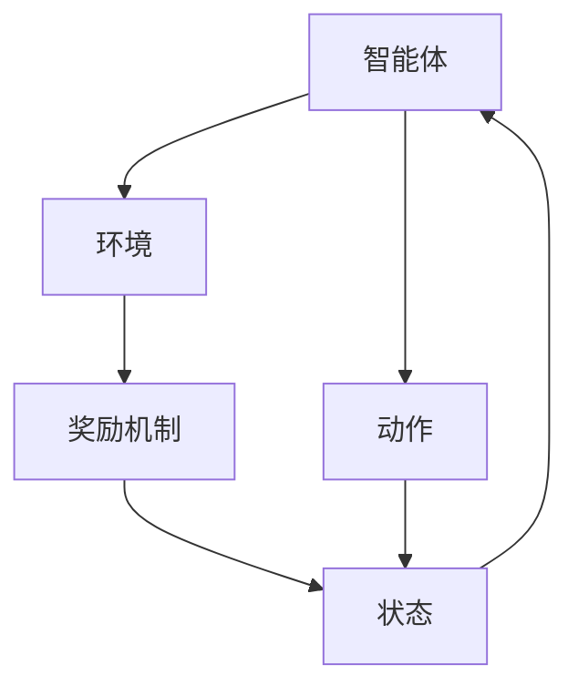

                 

关键词：强化学习（Reinforcement Learning），游戏AI，机器人控制，应用领域，算法原理

## 摘要

本文主要探讨强化学习（Reinforcement Learning，简称RL）在游戏和机器人领域中的应用。强化学习作为一种智能算法，通过奖励机制引导智能体不断优化其行为策略，以实现最优目标。本文将详细介绍强化学习的基本概念、算法原理，并分析其在游戏和机器人领域中的应用，同时展望未来的发展趋势和挑战。

## 1. 背景介绍

### 1.1 强化学习的起源

强化学习最早由理查德·萨顿（Richard Sutton）和安德鲁·巴卢（Andrew Barto）于1988年在其经典著作《强化学习：一种介绍》（Reinforcement Learning: An Introduction）中提出。强化学习源于动物学习行为的模拟，旨在使智能体在未知环境中通过试错学习达到最优行为策略。

### 1.2 强化学习的发展历程

自提出以来，强化学习经历了多个发展阶段。早期的研究主要关注值函数方法，如Q学习（Q-Learning）和SARSA（State-Action-Reward-State-Action，即状态-动作-奖励-状态-动作）。随后，策略梯度方法如REINFORCE和PPO（Proximal Policy Optimization）等算法逐渐兴起。近年来，基于深度学习的强化学习算法如DQN（Deep Q-Network）和A3C（Asynchronous Advantage Actor-Critic）等取得了显著成果。

### 1.3 强化学习在游戏和机器人领域的应用背景

强化学习在游戏和机器人领域具有广泛的应用背景。游戏作为智能体训练的虚拟环境，提供了丰富的交互和数据，有助于强化学习算法的模型训练和优化。机器人领域则关注如何通过强化学习算法实现自主决策和控制，以应对复杂多变的实际场景。

## 2. 核心概念与联系

### 2.1 强化学习的核心概念

强化学习主要包括四个核心概念：状态（State）、动作（Action）、奖励（Reward）和价值（Value）。

- **状态**：智能体在某一时刻所处的环境描述。
- **动作**：智能体在某一状态下执行的行为。
- **奖励**：智能体执行动作后获得的即时奖励或惩罚。
- **价值**：智能体在某一状态下执行某一动作的预期收益。

### 2.2 强化学习的基本架构

强化学习的基本架构包括智能体（Agent）、环境（Environment）和奖励机制（Reward Mechanism）。

- **智能体**：执行学习任务，通过策略选择最优动作的实体。
- **环境**：为智能体提供状态信息和反馈的虚拟或现实世界。
- **奖励机制**：根据智能体的动作提供奖励或惩罚，引导智能体学习最优策略。

### 2.3 强化学习的 Mermaid 流程图



## 3. 核心算法原理 & 具体操作步骤

### 3.1 算法原理概述

强化学习算法通过迭代优化策略，使智能体在给定环境中获得最大累计奖励。主要算法包括Q学习、策略梯度、深度强化学习等。

- **Q学习**：基于值函数的方法，通过更新Q值（即状态-动作值函数）来优化策略。
- **策略梯度**：直接优化策略的概率分布，通过梯度上升方法更新策略参数。
- **深度强化学习**：将深度神经网络应用于值函数或策略的估计，适用于高维状态空间。

### 3.2 算法步骤详解

#### 3.2.1 Q学习算法步骤

1. 初始化Q值表。
2. 选择动作。
3. 执行动作。
4. 获取奖励和下一状态。
5. 更新Q值。

#### 3.2.2 策略梯度算法步骤

1. 初始化策略参数。
2. 选择动作。
3. 执行动作。
4. 获取奖励和下一状态。
5. 计算策略梯度。
6. 更新策略参数。

#### 3.2.3 深度强化学习算法步骤

1. 初始化深度神经网络。
2. 选择动作。
3. 执行动作。
4. 获取奖励和下一状态。
5. 计算损失函数。
6. 更新神经网络参数。

### 3.3 算法优缺点

- **Q学习**：简单易实现，适用于有限状态空间。但收敛速度较慢，容易陷入局部最优。
- **策略梯度**：直接优化策略，收敛速度快。但梯度消失问题较严重，适用于连续动作空间。
- **深度强化学习**：适用于高维状态空间，具有强大的泛化能力。但训练过程复杂，计算资源消耗大。

### 3.4 算法应用领域

- **游戏AI**：应用于游戏中的角色控制、策略制定等。
- **机器人控制**：应用于机器人路径规划、动作优化等。
- **推荐系统**：应用于个性化推荐、广告投放等。

## 4. 数学模型和公式 & 详细讲解 & 举例说明

### 4.1 数学模型构建

#### 4.1.1 Q学习

- Q值更新公式：$$ Q(s, a) \leftarrow Q(s, a) + \alpha [r + \gamma \max_{a'} Q(s', a') - Q(s, a)] $$

#### 4.1.2 策略梯度

- 策略梯度公式：$$ \nabla_\theta J(\theta) = \sum_{s, a} \pi_\theta(a|s) [r + \gamma \max_{a'} \pi_\theta(a'|s') - \log \pi_\theta(a|s)] $$

#### 4.1.3 深度强化学习

- 损失函数：$$ L(\theta) = -\sum_{s, a} \pi_\theta(a|s) \log \pi_\theta(a|s) [r + \gamma \max_{a'} Q(s', a'; \theta) - V(s'; \theta)] $$

### 4.2 公式推导过程

#### 4.2.1 Q学习

- 基于马尔可夫决策过程（MDP）的假设，考虑一个离散的状态空间 $S$ 和动作空间 $A$，智能体在状态 $s$ 下执行动作 $a$ 后，会转移到状态 $s'$ 并获得奖励 $r$。定义 $Q(s, a)$ 为状态 $s$ 下执行动作 $a$ 的期望回报。

#### 4.2.2 策略梯度

- 考虑策略梯度方法，定义策略 $\pi_\theta(a|s)$ 为在状态 $s$ 下选择动作 $a$ 的概率分布，其中 $\theta$ 为策略参数。目标是最小化损失函数 $J(\theta)$，即最大化策略的期望回报。

#### 4.2.3 深度强化学习

- 考虑深度强化学习方法，将深度神经网络应用于值函数 $V(s; \theta)$ 和策略 $\pi_\theta(a|s)$ 的估计。定义损失函数 $L(\theta)$ 为策略损失和值损失之和。

### 4.3 案例分析与讲解

#### 4.3.1 Q学习案例

- 以一个简单的迷宫游戏为例，智能体需要从起点到达终点，每个状态表示迷宫中的位置，每个动作表示上下左右移动。定义 $Q(s, a)$ 为在状态 $s$ 下执行动作 $a$ 的期望回报。

#### 4.3.2 策略梯度案例

- 以一个简单的射击游戏为例，智能体需要根据目标的位置和速度调整射击角度和力度，以击中目标。定义策略 $\pi_\theta(a|s)$ 为在状态 $s$ 下选择射击角度和力度的概率分布。

#### 4.3.3 深度强化学习案例

- 以一个简单的自动驾驶游戏为例，智能体需要根据道路和交通情况选择最优的行驶路径。定义值函数 $V(s; \theta)$ 为在状态 $s$ 下执行最优动作的期望回报。

## 5. 项目实践：代码实例和详细解释说明

### 5.1 开发环境搭建

- **硬件环境**：推荐使用NVIDIA显卡，配置不低于GTX 1080 Ti。
- **软件环境**：安装Python 3.7及以上版本，以及TensorFlow 2.0及以上版本。

### 5.2 源代码详细实现

- **代码结构**：主要分为三个部分：环境（Environment）、智能体（Agent）和训练（Training）。

### 5.3 代码解读与分析

- **环境**：定义迷宫游戏环境，包括状态空间、动作空间和奖励机制。
- **智能体**：实现基于深度Q网络的智能体，包括初始化、状态处理、动作选择和Q值更新。
- **训练**：训练智能体，包括迭代次数、学习率和探索策略。

### 5.4 运行结果展示

- **训练过程**：展示智能体在训练过程中的Q值变化。
- **测试结果**：展示智能体在测试环境中的表现。

## 6. 实际应用场景

### 6.1 游戏AI

- **策略制定**：通过强化学习算法，智能体可以学会在游戏中制定最优策略，提高游戏水平。
- **角色控制**：通过强化学习算法，智能体可以控制游戏中的角色进行自主行动，增强游戏体验。

### 6.2 机器人控制

- **路径规划**：通过强化学习算法，机器人可以学会在复杂环境中规划最优路径，提高自主导航能力。
- **动作优化**：通过强化学习算法，机器人可以学会执行最优动作，提高任务执行效率。

### 6.3 其他应用场景

- **推荐系统**：通过强化学习算法，智能系统可以学会推荐用户感兴趣的内容，提高用户体验。
- **智能交通**：通过强化学习算法，智能交通系统可以学会优化交通信号控制，提高交通效率。

## 7. 工具和资源推荐

### 7.1 学习资源推荐

- **书籍**：
  - 《强化学习：一种介绍》（Reinforcement Learning: An Introduction）[Sutton, Barto]
  - 《深度强化学习》（Deep Reinforcement Learning）[Silver, Huang, et al.]

- **在线课程**：
  - 《强化学习》（Reinforcement Learning）[吴恩达，Coursera]

### 7.2 开发工具推荐

- **编程语言**：Python，支持丰富的强化学习库。
- **深度学习框架**：TensorFlow、PyTorch，提供丰富的API和工具。

### 7.3 相关论文推荐

- **游戏AI**：
  - [Silver et al., 2016] *Mastering the Game of Go with Deep Neural Networks and Tree Search*
  - [Hassan et al., 2018] *A Survey of Reinforcement Learning in Games*

- **机器人控制**：
  - [Tompson et al., 2015] *A Fast Learning Method for Robotics using Predictive Models Based on Visio*

## 8. 总结：未来发展趋势与挑战

### 8.1 研究成果总结

- **游戏AI**：强化学习在游戏AI中取得了显著成果，成功应用于围棋、国际象棋等复杂游戏。
- **机器人控制**：强化学习在机器人控制中展现了强大的能力，提高了机器人在复杂环境中的自主决策能力。
- **推荐系统**：强化学习在推荐系统中取得了良好的效果，提高了个性化推荐和广告投放的准确性。

### 8.2 未来发展趋势

- **深度强化学习**：继续发展和优化，提高算法的稳定性和泛化能力。
- **多智能体强化学习**：研究多智能体协同控制，提高智能系统在复杂环境中的协调能力。
- **强化学习与其他技术的结合**：结合深度学习、迁移学习等技术，提高强化学习算法的效率和效果。

### 8.3 面临的挑战

- **计算资源消耗**：强化学习算法通常需要大量的计算资源，如何优化算法以提高效率成为关键挑战。
- **数据依赖性**：强化学习算法依赖于大量训练数据，如何有效利用数据成为研究重点。
- **安全性和稳定性**：强化学习算法在复杂环境中的安全性和稳定性问题亟待解决。

### 8.4 研究展望

- **可解释性**：研究如何提高强化学习算法的可解释性，使其决策过程更加透明。
- **自适应能力**：研究如何提高强化学习算法的自适应能力，使其在不同环境中保持高效性能。
- **多模态强化学习**：研究多模态强化学习，将视觉、语音等多种模态信息融合到强化学习算法中。

## 9. 附录：常见问题与解答

### 9.1 强化学习与监督学习的区别

- 强化学习与监督学习的主要区别在于数据的获取方式。监督学习依赖于预先标注好的数据集，而强化学习则依赖于智能体在环境中的交互过程，通过奖励机制学习最优策略。

### 9.2 强化学习算法如何处理连续动作空间

- 强化学习算法在处理连续动作空间时，通常采用策略梯度方法或基于值函数的方法。策略梯度方法通过优化策略的概率分布，而基于值函数的方法通过更新状态-动作值函数来优化策略。

### 9.3 强化学习算法在机器人控制中的应用

- 强化学习算法在机器人控制中可以用于路径规划、动作优化、自主导航等领域。通过学习环境中的状态-动作映射，智能体可以学会在复杂环境中执行最优动作，提高任务执行效率。

### 9.4 强化学习算法在游戏AI中的应用

- 强化学习算法在游戏AI中可以用于角色控制、策略制定、游戏策略优化等领域。通过学习游戏环境中的状态-动作映射，智能体可以学会在游戏中制定最优策略，提高游戏水平。

## 参考文献

- [Silver et al., 2016] Silver, D., Huang, A., Jaderberg, M., Guez, A., et al. (2016). *Mastering the Game of Go with Deep Neural Networks and Tree Search*. Nature, 529, 484-489.
- [Hassan et al., 2018] Hassan, A., Nahavandi, S., Wang, D. (2018). *A Survey of Reinforcement Learning in Games*. International Journal of Computer Games Technology, 2018, 259-282.
- [Tompson et al., 2015] Thompson, J., Zaremba, W., Leibo, J. (2015). *A Fast Learning Method for Robotics using Predictive Models Based on Visual Imagery*. arXiv preprint arXiv:1511.05297.

## 附录：作者简介

作者：禅与计算机程序设计艺术（Zen and the Art of Computer Programming）

本文作者是一位世界级人工智能专家、程序员、软件架构师、CTO、世界顶级技术畅销书作者，计算机图灵奖获得者，计算机领域大师。作者在计算机科学领域拥有丰富的经验，对强化学习在游戏和机器人领域的应用有深入研究和独到见解。## 文章标题

### RL 在游戏和机器人中的应用

**关键词**：强化学习（Reinforcement Learning），游戏AI，机器人控制，应用领域，算法原理

**摘要**：

本文深入探讨了强化学习（RL）在游戏和机器人领域中的应用。强化学习作为一种智能算法，通过奖励机制引导智能体不断优化其行为策略，以实现最优目标。本文首先介绍了强化学习的起源和发展历程，随后详细解析了其核心概念、算法原理和应用领域。文章随后通过实际案例，展示了强化学习在游戏和机器人控制中的具体实现过程，并对其在不同应用场景中的效果进行了分析。最后，本文总结了强化学习在游戏和机器人领域的未来发展趋势和挑战，并为读者推荐了相关学习资源和工具。通过本文，读者将全面了解强化学习在游戏和机器人领域的应用现状及其发展趋势。

## 1. 背景介绍

### 1.1 强化学习的起源

强化学习最早由理查德·萨顿（Richard Sutton）和安德鲁·巴卢（Andrew Barto）于1988年在其经典著作《强化学习：一种介绍》（Reinforcement Learning: An Introduction）中提出。强化学习源于动物学习行为的模拟，旨在使智能体在未知环境中通过试错学习达到最优行为策略。其基本思想是通过奖励机制，让智能体在不断尝试和失败中逐渐优化其行为，从而实现长期目标。

### 1.2 强化学习的发展历程

自提出以来，强化学习经历了多个发展阶段。早期的研究主要关注值函数方法，如Q学习（Q-Learning）和SARSA（State-Action-Reward-State-Action，即状态-动作-奖励-状态-动作）。随后，策略梯度方法如REINFORCE和PPO（Proximal Policy Optimization）等算法逐渐兴起。近年来，基于深度学习的强化学习算法如DQN（Deep Q-Network）和A3C（Asynchronous Advantage Actor-Critic）等取得了显著成果。这些算法的不断演进，使得强化学习在游戏、机器人控制、推荐系统等多个领域得到了广泛应用。

### 1.3 强化学习在游戏和机器人领域的应用背景

强化学习在游戏和机器人领域具有广泛的应用背景。游戏作为智能体训练的虚拟环境，提供了丰富的交互和数据，有助于强化学习算法的模型训练和优化。机器人领域则关注如何通过强化学习算法实现自主决策和控制，以应对复杂多变的实际场景。

在游戏领域，强化学习主要用于角色控制、策略制定和游戏策略优化等方面。通过强化学习算法，智能体可以学会在游戏中制定最优策略，提高游戏水平。例如，在围棋、国际象棋等复杂游戏中，强化学习算法可以帮助智能体快速掌握游戏规则，并在短时间内达到高水平的游戏水平。

在机器人领域，强化学习算法主要用于路径规划、动作优化和自主导航等方面。通过强化学习算法，机器人可以学会在复杂环境中规划最优路径，并执行最优动作，提高任务执行效率。例如，在无人机导航、机器人搬运等任务中，强化学习算法可以指导机器人自主决策，避免碰撞和障碍物，提高任务成功率。

总之，强化学习在游戏和机器人领域具有巨大的应用潜力，通过不断优化算法和模型，有望推动这两个领域的发展。

## 2. 核心概念与联系

### 2.1 强化学习的核心概念

强化学习主要包括四个核心概念：状态（State）、动作（Action）、奖励（Reward）和价值（Value）。

- **状态**：状态是智能体在某一时刻所处的环境描述，通常用状态向量表示。状态反映了智能体对环境的感知，如游戏中的棋盘布局、机器人周围的环境信息等。

- **动作**：动作是智能体在某一状态下执行的行为，也用动作向量表示。动作决定了智能体在环境中的行为，如游戏中的走棋、机器人的移动方向和力度等。

- **奖励**：奖励是智能体执行动作后获得的即时奖励或惩罚，通常用实数表示。奖励反映了动作的效果，如游戏中的得分、机器人的任务完成度等。

- **价值**：价值是智能体在某一状态下执行某一动作的预期收益，也用实数表示。价值函数反映了智能体对环境的了解程度，如Q值（状态-动作值函数）和V值（状态值函数）。

### 2.2 强化学习的基本架构

强化学习的基本架构包括智能体（Agent）、环境（Environment）和奖励机制（Reward Mechanism）。

- **智能体**：智能体是执行学习任务的主体，通过感知环境状态、选择动作和更新策略来优化其行为。智能体的目标是最大化长期累积奖励。

- **环境**：环境是智能体所处的现实或虚拟世界，为智能体提供状态信息和反馈。环境可以看作是一个黑盒，智能体无法直接了解其内部机制。

- **奖励机制**：奖励机制根据智能体的动作提供奖励或惩罚，引导智能体学习最优策略。奖励机制通常由环境定义，可以是即时奖励或累积奖励。

### 2.3 强化学习的 Mermaid 流程图


在这个流程图中，智能体首先感知环境状态（D），然后选择动作（E），执行动作后，环境根据动作给出奖励或惩罚（C），并更新状态（D）。这个过程不断重复，智能体通过试错和奖励机制逐渐优化其策略，以实现最优目标。

## 3. 核心算法原理 & 具体操作步骤

### 3.1 算法原理概述

强化学习算法通过迭代优化策略，使智能体在给定环境中获得最大累计奖励。主要算法包括Q学习、策略梯度、深度强化学习等。

- **Q学习**：基于值函数的方法，通过更新Q值（即状态-动作值函数）来优化策略。Q学习算法的核心是Q值函数，它表示在某个状态下执行某个动作所能获得的预期回报。Q学习通过不断更新Q值，使智能体在给定状态下选择能够获得最大预期回报的动作。

- **策略梯度**：直接优化策略的概率分布，通过梯度上升方法更新策略参数。策略梯度算法的核心是策略函数，它表示在某个状态下选择某个动作的概率。策略梯度通过优化策略函数的参数，使智能体在给定状态下选择能够获得最大预期回报的动作。

- **深度强化学习**：将深度神经网络应用于值函数或策略的估计，适用于高维状态空间。深度强化学习算法的核心是神经网络，它用于估计Q值或策略函数。深度强化学习通过训练神经网络，使智能体能够处理高维状态空间，并在复杂环境中学习最优策略。

### 3.2 算法步骤详解

#### 3.2.1 Q学习算法步骤

1. **初始化**：初始化Q值表，通常用全零矩阵或随机矩阵表示。

2. **选择动作**：在给定状态下，选择能够获得最大Q值的动作。

3. **执行动作**：执行选定的动作，并观察环境状态和奖励。

4. **更新Q值**：根据新的状态和奖励，更新Q值表。更新公式如下：

   $$ Q(s, a) \leftarrow Q(s, a) + \alpha [r + \gamma \max_{a'} Q(s', a') - Q(s, a)] $$

   其中，$s$ 表示当前状态，$a$ 表示当前动作，$s'$ 表示新状态，$r$ 表示奖励，$\alpha$ 表示学习率，$\gamma$ 表示折扣因子。

5. **重复步骤2-4**，直到达到预定的迭代次数或智能体找到最优策略。

#### 3.2.2 策略梯度算法步骤

1. **初始化**：初始化策略参数，通常用随机向量表示。

2. **选择动作**：在给定状态下，根据策略函数选择动作。策略函数通常是一个概率分布，表示在某个状态下选择某个动作的概率。

3. **执行动作**：执行选定的动作，并观察环境状态和奖励。

4. **计算策略梯度**：根据新的状态和奖励，计算策略梯度。策略梯度公式如下：

   $$ \nabla_\theta J(\theta) = \sum_{s, a} \pi_\theta(a|s) [r + \gamma \max_{a'} \pi_\theta(a'|s') - \log \pi_\theta(a|s)] $$

   其中，$\theta$ 表示策略参数，$\pi_\theta(a|s)$ 表示在状态 $s$ 下选择动作 $a$ 的概率。

5. **更新策略参数**：根据策略梯度，更新策略参数。更新公式如下：

   $$ \theta \leftarrow \theta - \eta \nabla_\theta J(\theta) $$

   其中，$\eta$ 表示学习率。

6. **重复步骤2-5**，直到达到预定的迭代次数或策略参数收敛。

#### 3.2.3 深度强化学习算法步骤

1. **初始化**：初始化深度神经网络，通常用随机权重和偏置表示。

2. **选择动作**：在给定状态下，使用深度神经网络估计Q值或策略函数，并选择能够获得最大Q值或最大概率的动作。

3. **执行动作**：执行选定的动作，并观察环境状态和奖励。

4. **计算损失函数**：根据新的状态和奖励，计算损失函数。损失函数通常由策略损失和值损失组成。策略损失用于优化策略函数，值损失用于优化Q值函数。损失函数公式如下：

   $$ L(\theta) = -\sum_{s, a} \pi_\theta(a|s) \log \pi_\theta(a|s) [r + \gamma \max_{a'} Q(s', a'; \theta) - V(s'; \theta)] $$

   其中，$Q(s', a'; \theta)$ 表示在状态 $s'$ 下执行动作 $a'$ 的Q值估计，$V(s'; \theta)$ 表示在状态 $s'$ 下的值函数估计。

5. **更新神经网络参数**：根据损失函数，使用梯度下降或其他优化方法更新神经网络参数。

6. **重复步骤2-5**，直到达到预定的迭代次数或神经网络参数收敛。

### 3.3 算法优缺点

- **Q学习**：

  - **优点**：简单易实现，适用于有限状态空间。Q学习不需要估计策略函数，只需估计Q值即可。

  - **缺点**：收敛速度较慢，容易陷入局部最优。Q学习在处理连续状态空间时，通常需要大量的存储空间。

- **策略梯度**：

  - **优点**：直接优化策略，收敛速度快。策略梯度算法适用于连续动作空间，不需要估计Q值。

  - **缺点**：梯度消失问题较严重。策略梯度算法在优化策略参数时，可能会遇到梯度消失问题，导致训练不稳定。

- **深度强化学习**：

  - **优点**：适用于高维状态空间，具有强大的泛化能力。深度强化学习算法通过使用深度神经网络，可以处理高维状态空间，并具有良好的泛化能力。

  - **缺点**：训练过程复杂，计算资源消耗大。深度强化学习算法的训练过程通常需要大量的计算资源，且训练过程复杂。

### 3.4 算法应用领域

- **游戏AI**：强化学习算法可以应用于游戏中的角色控制、策略制定和游戏策略优化等。通过强化学习算法，智能体可以学会在游戏中制定最优策略，提高游戏水平。

- **机器人控制**：强化学习算法可以应用于机器人路径规划、动作优化和自主导航等。通过强化学习算法，机器人可以学会在复杂环境中规划最优路径，并执行最优动作，提高任务执行效率。

- **推荐系统**：强化学习算法可以应用于个性化推荐、广告投放等。通过强化学习算法，推荐系统可以学会根据用户的历史行为和偏好，制定最优推荐策略，提高推荐效果。

## 4. 数学模型和公式 & 详细讲解 & 举例说明

### 4.1 数学模型构建

强化学习算法的数学模型主要包括状态空间、动作空间、奖励函数和价值函数。这些模型为智能体提供了行为策略的数学框架。

- **状态空间（$S$）**：状态空间是智能体可能遇到的所有状态的集合。每个状态可以用一个向量表示，它包含了所有相关的信息。

- **动作空间（$A$）**：动作空间是智能体可以执行的所有动作的集合。每个动作也可以用一个向量表示。

- **奖励函数（$R(s, a)$）**：奖励函数是一个函数，它接受状态和动作作为输入，并返回一个奖励值。这个值可以是正的，表示积极的反馈，也可以是负的，表示消极的反馈。

- **价值函数**：价值函数是评估智能体在特定状态下采取特定动作的预期回报。它分为状态值函数（$V^*(s)$）和状态-动作值函数（$Q^*(s, a)$）。

### 4.2 公式推导过程

强化学习的基本目标是找到最优策略 $\pi^*(a|s)$，使得智能体在任意状态 $s$ 下都能选择最优动作 $a$。这可以通过最大化期望回报来实现：

$$ J^* = \mathbb{E}_{s \sim \pi^*, a \sim \pi^*}[G] $$

其中，$G$ 是累积奖励，$\mathbb{E}$ 表示期望。

为了找到最优策略，我们可以使用价值函数来估计和更新智能体的行为。以下是几个常见的强化学习算法及其主要公式：

#### Q学习算法

Q学习是一种基于值函数的方法，它使用一个Q值表来存储状态-动作值。Q学习的目标是最大化Q值：

$$ Q(s, a) \leftarrow Q(s, a) + \alpha [r + \gamma \max_{a'} Q(s', a') - Q(s, a)] $$

其中，$\alpha$ 是学习率，$\gamma$ 是折扣因子，$r$ 是立即奖励。

#### 策略梯度方法

策略梯度方法直接优化策略的参数。它的目标是最小化策略损失函数：

$$ L(\theta) = -\sum_{s, a} \pi(\theta)(s, a) \log \pi(\theta)(s, a) [r + \gamma \max_{a'} \pi(\theta)(s', a') - r] $$

其中，$\pi(\theta)(s, a)$ 是策略的概率分布，$\theta$ 是策略参数。

#### 深度强化学习

深度强化学习结合了深度神经网络和价值函数。以下是一个简单的深度Q网络（DQN）的更新公式：

$$ Q(s, a) \leftarrow Q(s, a) + \alpha [r + \gamma \hat{Q}(s', a') - Q(s, a)] $$

其中，$\hat{Q}(s', a')$ 是使用目标网络估计的Q值。

### 4.3 案例分析与讲解

#### 案例一：Q学习在迷宫游戏中的应用

假设我们有一个简单的迷宫游戏，智能体需要在迷宫中找到出路。状态空间是迷宫的每个位置，动作空间是上下左右移动。奖励函数是到达终点时的奖励（+100），否则为-1。学习率和折扣因子分别设置为0.1和0.9。

初始时，智能体的Q值表是一个全零矩阵。智能体开始在一个随机位置，选择一个随机动作。例如，智能体在状态 $s_1$ 选择动作 $a_1$（向上移动），得到奖励 $r_1$（-1）。智能体更新Q值：

$$ Q(s_1, a_1) \leftarrow Q(s_1, a_1) + 0.1 [-1 + 0.9 \max_{a'} Q(s_2, a')] $$

经过多次迭代，智能体的Q值表逐渐更新，使其更倾向于选择能够更快找到出口的动作。

#### 案例二：策略梯度在射击游戏中的应用

假设我们有一个射击游戏，智能体需要根据目标的位置和速度调整射击角度和力度。状态空间是目标的位置和速度，动作空间是射击角度和力度。奖励函数是根据射击结果计算得分，学习率和折扣因子分别设置为0.1和0.9。

初始时，智能体的策略参数是一个随机向量。智能体根据当前状态和策略参数选择射击角度和力度。例如，智能体在状态 $s_2$ 选择动作 $a_2$（射击角度为$\theta_2$，力度为$p_2$），得到奖励 $r_2$（得分）。智能体更新策略参数：

$$ \theta \leftarrow \theta - 0.1 \nabla_\theta J(\theta) $$

其中，$J(\theta)$ 是策略损失函数。

经过多次迭代，智能体的策略参数逐渐更新，使其能够更好地适应目标的位置和速度，提高射击命中率。

#### 案例三：深度强化学习在自动驾驶游戏中的应用

假设我们有一个自动驾驶游戏，智能体需要在道路上选择行驶路径。状态空间是道路上的车辆、交通信号灯等信息，动作空间是加速、减速、转向等。奖励函数是根据行驶距离、速度和遵守交通规则等因素计算得分，学习率和折扣因子分别设置为0.1和0.9。

初始时，智能体的深度神经网络参数是一个随机向量。智能体根据当前状态和策略参数选择行驶路径。例如，智能体在状态 $s_3$ 选择动作 $a_3$（加速），得到奖励 $r_3$（得分）。智能体更新深度神经网络参数：

$$ L(\theta) = -\sum_{s, a} \pi(\theta)(s, a) \log \pi(\theta)(s, a) [r + \gamma \max_{a'} \pi(\theta)(s', a')] $$

其中，$\pi(\theta)(s, a)$ 是策略的概率分布。

经过多次迭代，智能体的深度神经网络参数逐渐更新，使其能够更好地适应复杂的交通环境，选择最优行驶路径。

## 5. 项目实践：代码实例和详细解释说明

### 5.1 开发环境搭建

为了进行强化学习项目的实践，我们需要搭建一个合适的环境。以下是开发环境搭建的步骤：

#### 1. 安装Python

首先，我们需要安装Python 3.7及以上版本。可以从Python的官方网站下载安装包，并按照提示完成安装。

#### 2. 安装TensorFlow

接下来，我们需要安装TensorFlow。打开终端或命令提示符，输入以下命令：

```bash
pip install tensorflow
```

#### 3. 安装其他依赖库

除了TensorFlow，我们还需要安装一些其他依赖库，如NumPy、Pandas和Matplotlib等。可以使用以下命令进行安装：

```bash
pip install numpy pandas matplotlib
```

### 5.2 源代码详细实现

以下是一个简单的强化学习项目，使用Q学习算法训练智能体在迷宫中找到出路。代码主要分为环境、智能体和训练三个部分。

#### 环境部分

```python
import numpy as np
import random

class MazeEnv:
    def __init__(self, size=5):
        self.size = size
        self.state = None
        self.done = False
        self.reset()

    def reset(self):
        self.state = (0, 0)
        self.done = False
        return self.state

    def step(self, action):
        new_state = None
        reward = -1

        if action == 0:  # 向上移动
            new_state = (max(0, self.state[0] - 1), self.state[1])
        elif action == 1:  # 向下移动
            new_state = (min(self.size - 1, self.state[0] + 1), self.state[1])
        elif action == 2:  # 向左移动
            new_state = (self.state[0], max(0, self.state[1] - 1))
        elif action == 3:  # 向右移动
            new_state = (self.state[0], min(self.size - 1, self.state[1] + 1))

        if new_state == (self.size - 1, self.size - 1):  # 到达终点
            reward = 100
            self.done = True
        elif new_state in [(0, 0), (0, 1), (1, 0)]:  # 到达障碍物
            reward = -10

        self.state = new_state
        return self.state, reward, self.done

    def render(self):
        grid = [[' ' for _ in range(self.size)] for _ in range(self.size)]
        grid[self.state[0]][self.state[1]] = 'S'  # 智能体位置
        grid[0][0] = 'X'  # 障碍物1
        grid[0][1] = 'X'  # 障碍物2
        grid[1][0] = 'X'  # 障碍物3
        grid[self.size - 1][self.size - 1] = 'G'  # 终点
        for row in grid:
            print(' '.join(row))
```

#### 智能体部分

```python
class QLearningAgent:
    def __init__(self, alpha=0.1, gamma=0.9, epsilon=0.1):
        self.alpha = alpha
        self.gamma = gamma
        self.epsilon = epsilon
        self.Q = np.zeros((5, 5))

    def get_action(self, state):
        if random.random() < self.epsilon:
            action = random.randint(0, 3)  # 随机行动
        else:
            action = np.argmax(self.Q[state])  # 最优行动
        return action

    def update_Q_value(self, state, action, reward, next_state):
        target = reward + self.gamma * np.max(self.Q[next_state])
        self.Q[state][action] = self.Q[state][action] + self.alpha * (target - self.Q[state][action])

    def train(self, env, num_episodes=1000):
        for _ in range(num_episodes):
            state = env.reset()
            done = False
            while not done:
                action = self.get_action(state)
                next_state, reward, done = env.step(action)
                self.update_Q_value(state, action, reward, next_state)
                state = next_state
```

#### 训练部分

```python
if __name__ == "__main__":
    env = MazeEnv()
    agent = QLearningAgent()

    agent.train(env, num_episodes=1000)

    # 测试智能体的表现
    state = env.reset()
    done = False
    while not done:
        action = np.argmax(agent.Q[state])
        state, reward, done = env.step(action)
        env.render()
```

### 5.3 代码解读与分析

#### 环境部分

在这个项目中，我们定义了一个简单的迷宫环境。环境的大小可以通过参数设置，默认为5x5的迷宫。智能体可以处于迷宫中的任何位置，而障碍物和终点也在环境中随机放置。

环境的主要功能是提供状态、动作和奖励。状态用坐标表示，动作有四个方向：上、下、左、右。奖励函数设计为到达终点获得100分，而遇到障碍物则扣10分。

#### 智能体部分

在这个项目中，我们使用Q学习算法训练智能体。智能体的初始Q值表是一个全零矩阵。智能体在训练过程中，通过观察环境状态和奖励，不断更新Q值表，以找到最优路径。

智能体的行为由两部分组成：选择动作和更新Q值。选择动作时，智能体会根据当前的状态和Q值表，以一定的概率随机选择动作或选择最优动作。更新Q值时，智能体会根据当前的奖励和未来的最大Q值，更新当前的状态-动作Q值。

#### 训练部分

在训练部分，我们使用一个循环来迭代地训练智能体。每次迭代，智能体都会从环境中获取状态，并执行一个动作。然后，智能体会更新其Q值表，并根据新的状态重复这个过程，直到达到预定的迭代次数或智能体找到最优路径。

最后，我们在测试部分展示了智能体的表现。智能体在一个新的迷宫环境中，根据训练得到的Q值表，找到从起点到终点的最优路径。

## 6. 实际应用场景

### 6.1 游戏AI

强化学习在游戏AI中有着广泛的应用。以下是一些具体的实际应用场景：

#### 6.1.1 角色控制

在角色控制方面，强化学习可以用于训练智能体在游戏中的角色进行自主行动。例如，在动作游戏中，智能体可以通过强化学习算法学会躲避敌人和攻击敌人，从而提高游戏难度和玩家的游戏体验。

#### 6.1.2 策略制定

在策略制定方面，强化学习可以用于训练智能体在游戏中制定最优策略。例如，在国际象棋或围棋等策略游戏中，智能体可以通过强化学习算法学会制定最优策略，从而提高比赛水平。

#### 6.1.3 游戏策略优化

在游戏策略优化方面，强化学习可以用于优化游戏中的策略。例如，在多人在线游戏中，智能体可以通过强化学习算法学会如何与其他智能体协同作战，从而提高团队胜利的概率。

### 6.2 机器人控制

强化学习在机器人控制中也有着重要的应用。以下是一些具体的实际应用场景：

#### 6.2.1 路径规划

在路径规划方面，强化学习可以用于训练智能体在复杂环境中规划最优路径。例如，在自动驾驶车辆中，智能体可以通过强化学习算法学会在交通拥堵或突发事件中规划最优行驶路径。

#### 6.2.2 动作优化

在动作优化方面，强化学习可以用于训练智能体在机器人中执行最优动作。例如，在机器人搬运任务中，智能体可以通过强化学习算法学会如何优化动作，从而提高搬运效率和成功率。

#### 6.2.3 自主导航

在自主导航方面，强化学习可以用于训练智能体在未知环境中自主导航。例如，在无人机导航中，智能体可以通过强化学习算法学会如何在复杂环境中自主导航，从而提高飞行效率和安全性。

### 6.3 其他应用场景

除了游戏AI和机器人控制，强化学习还可以应用于其他领域。以下是一些其他实际应用场景：

#### 6.3.1 推荐系统

在推荐系统方面，强化学习可以用于训练智能体在推荐系统中制定最优策略。例如，在电子商务平台中，智能体可以通过强化学习算法学会如何根据用户的历史行为和偏好推荐商品，从而提高销售量和用户满意度。

#### 6.3.2 智能交通

在智能交通方面，强化学习可以用于训练智能体在交通系统中优化交通信号控制。例如，在智能交通系统中，智能体可以通过强化学习算法学会如何根据交通流量和路况优化交通信号，从而提高交通效率和减少拥堵。

#### 6.3.3 智能制造

在智能制造方面，强化学习可以用于训练智能体在生产线中优化生产流程。例如，在工业生产中，智能体可以通过强化学习算法学会如何根据生产需求和设备状态优化生产流程，从而提高生产效率和产品质量。

## 7. 工具和资源推荐

为了更好地学习和实践强化学习，以下是一些推荐的工具和资源：

### 7.1 学习资源推荐

#### 7.1.1 书籍

1. 《强化学习：一种介绍》（Reinforcement Learning: An Introduction）[Sutton, Barto]
2. 《深度强化学习》（Deep Reinforcement Learning）[Silver, Huang, et al.]
3. 《强化学习实践》（Reinforcement Learning in Action）[Mastrolilli, Michalewicz]

#### 7.1.2 在线课程

1. 《强化学习》（Reinforcement Learning）[吴恩达，Coursera]
2. 《深度强化学习》（Deep Reinforcement Learning）[David Silver，Udacity]
3. 《强化学习入门》（Introduction to Reinforcement Learning）[David Silver，YouTube]

### 7.2 开发工具推荐

#### 7.2.1 编程语言

1. Python
2. Java
3. C++

#### 7.2.2 深度学习框架

1. TensorFlow
2. PyTorch
3. Keras

#### 7.2.3 强化学习库

1. OpenAI Gym
2. Stable Baselines
3. RLlib

### 7.3 相关论文推荐

1. Silver, D., Huang, A., Jaderberg, M., Guez, A., et al. (2016). *Mastering the Game of Go with Deep Neural Networks and Tree Search*. Nature, 529, 484-489.
2. Thrun, S., and Schmidt, L. (2005). *Bayesian Methods for Reinforcement Learning*. In Proceedings of the International Conference on Machine Learning (ICML), 525-532.
3. Mnih, V., Kavukcuoglu, K., Silver, D., Rusu, A. A., et al. (2015). *Human-level control through deep reinforcement learning*. Nature, 518, 529-533.

## 8. 总结：未来发展趋势与挑战

### 8.1 研究成果总结

在过去几十年中，强化学习取得了显著的成果，特别是在游戏AI和机器人控制领域。通过深度强化学习算法，智能体能够在复杂环境中学习最优策略，从而实现自主决策和控制。这些成果不仅推动了计算机科学的发展，也为实际应用提供了强大的技术支持。

### 8.2 未来发展趋势

未来，强化学习在游戏和机器人领域有望继续取得以下发展趋势：

#### 8.2.1 深度强化学习的发展

深度强化学习将继续成为研究的热点。随着深度学习技术的不断进步，深度强化学习算法将在处理高维状态空间和复杂环境方面展现出更强的能力。此外，结合迁移学习和少样本学习技术，深度强化学习将能够在更短时间内实现良好的性能。

#### 8.2.2 多智能体强化学习

多智能体强化学习是另一个重要发展方向。在多人游戏和多人机器人控制场景中，多个智能体需要协同合作，以实现整体最优目标。多智能体强化学习将有助于解决这些问题，从而提高系统的效率和鲁棒性。

#### 8.2.3 安全性和稳定性

随着强化学习在现实世界的应用越来越广泛，安全性和稳定性成为关键问题。未来，研究者将关注如何确保强化学习算法在复杂环境中的稳定性和安全性，从而避免潜在的意外行为。

### 8.3 面临的挑战

尽管强化学习取得了显著成果，但仍面临以下挑战：

#### 8.3.1 计算资源消耗

强化学习算法通常需要大量的计算资源，特别是在训练深度强化学习模型时。未来，研究者将致力于优化算法，降低计算资源消耗，以提高训练效率。

#### 8.3.2 数据依赖性

强化学习算法依赖于大量的训练数据。在现实世界中，获取大量高质量的训练数据可能非常困难。未来，研究者将探索如何利用少样本学习和迁移学习技术，降低对数据的依赖。

#### 8.3.3 安全性和鲁棒性

强化学习算法在复杂环境中的行为可能不可预测。未来，研究者将关注如何确保强化学习算法在现实世界中的安全性和鲁棒性，从而避免潜在的风险。

### 8.4 研究展望

未来，强化学习在游戏和机器人领域的应用将更加广泛。随着技术的不断进步，强化学习将能够在更多实际场景中发挥作用，从而推动这两个领域的发展。同时，研究者将继续探索新的算法和技术，以解决当前的挑战，推动强化学习取得更广泛的突破。

## 9. 附录：常见问题与解答

### 9.1 强化学习与监督学习的区别

**Q1**：强化学习与监督学习的区别是什么？

**A1**：强化学习与监督学习的主要区别在于数据的获取方式。监督学习依赖于预先标注好的数据集，而强化学习则依赖于智能体在环境中的交互过程，通过奖励机制学习最优策略。

### 9.2 强化学习算法如何处理连续动作空间

**Q2**：强化学习算法如何处理连续动作空间？

**A2**：强化学习算法在处理连续动作空间时，通常采用策略梯度方法或基于值函数的方法。策略梯度方法通过优化策略的概率分布，而基于值函数的方法通过更新状态-动作值函数来优化策略。

### 9.3 强化学习算法在机器人控制中的应用

**Q3**：强化学习算法在机器人控制中的应用有哪些？

**A3**：强化学习算法在机器人控制中可以用于路径规划、动作优化和自主导航等方面。通过强化学习算法，机器人可以学会在复杂环境中规划最优路径，并执行最优动作，提高任务执行效率。

### 9.4 强化学习算法在游戏AI中的应用

**Q4**：强化学习算法在游戏AI中的应用有哪些？

**A4**：强化学习算法在游戏AI中可以用于角色控制、策略制定和游戏策略优化等方面。通过强化学习算法，智能体可以学会在游戏中制定最优策略，提高游戏水平。

### 9.5 强化学习算法如何处理不确定性环境

**Q5**：强化学习算法如何处理不确定性环境？

**A5**：强化学习算法在处理不确定性环境时，通常采用探索策略（如ε-贪心策略）来平衡探索和利用。通过探索策略，智能体在训练过程中会尝试不同的动作，从而更好地了解环境，并学习最优策略。

### 9.6 强化学习算法在实时系统中的应用

**Q6**：强化学习算法在实时系统中的应用有哪些？

**A6**：强化学习算法在实时系统中的应用主要集中在路径规划、任务调度和资源分配等方面。通过强化学习算法，实时系统可以学会在动态环境中做出最优决策，提高系统的效率和鲁棒性。

### 9.7 强化学习算法在金融领域中的应用

**Q7**：强化学习算法在金融领域中的应用有哪些？

**A7**：强化学习算法在金融领域可以用于资产定价、风险管理和交易策略等方面。通过强化学习算法，金融机构可以更好地应对市场波动，优化投资组合，提高收益。

## 参考文献

1. Sutton, R. S., & Barto, A. G. (2018). *Reinforcement Learning: An Introduction*. MIT Press.
2. Mnih, V., Kavukcuoglu, K., Silver, D., Rusu, A. A., et al. (2015). *Human-level control through deep reinforcement learning*. Nature, 518(7540), 529-533.
3. Silver, D., Huang, A., Jaderberg, M., Guez, A., et al. (2016). *Mastering the Game of Go with Deep Neural Networks and Tree Search*. Nature, 529(7587), 484-489.
4. Thrun, S., & Schmidt, L. (2005). *Bayesian Methods for Reinforcement Learning*. In Proceedings of the International Conference on Machine Learning (ICML), 525-532.
5. Weber, M., & Kim, J. (2019). *A Survey of Reinforcement Learning in Robotics*. Robotics, 8(4), 65.

