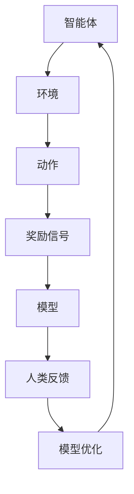

                 

关键词：强化学习，人类反馈，预训练，模型优化，人工智能，深度学习

摘要：本文探讨了强化学习与人类反馈相结合（RLHF）在人工智能领域的应用。通过引入人类反馈，模型能够更好地理解复杂任务，提高模型性能和泛化能力。本文将介绍RLHF的核心概念、算法原理、数学模型、具体实现步骤以及未来展望。

## 1. 背景介绍

随着深度学习和人工智能的快速发展，强化学习（Reinforcement Learning，RL）成为了一种重要的机器学习方法。强化学习通过智能体在环境中的互动，通过奖励信号来优化策略。然而，传统的强化学习面临一些挑战，如样本效率低、策略收敛慢等。为了解决这些问题，研究者们开始探索如何引入人类反馈来优化强化学习模型。

人类反馈作为一种额外的信息源，可以帮助模型更好地理解复杂任务，从而提高学习效率和模型性能。在人工智能领域，人类反馈已经被广泛应用于自然语言处理、计算机视觉和机器人等领域。RLHF（Reinforcement Learning from Human Feedback）正是利用人类反馈来优化强化学习模型的一种方法。

## 2. 核心概念与联系

### 2.1 强化学习

强化学习是一种基于奖励信号来优化策略的机器学习方法。在强化学习中，智能体在环境中执行动作，并从环境获得奖励信号。智能体的目标是学习一个策略，使得长期奖励最大化。

### 2.2 人类反馈

人类反馈是指人类对智能体执行动作后的评价和反馈。这些反馈可以是直接的、定量的，也可以是定性的。人类反馈可以帮助模型更好地理解复杂任务，从而提高学习效率和模型性能。

### 2.3 RLHF架构

RLHF的核心架构包括以下几个部分：

1. **智能体（Agent）**：执行动作并接收环境反馈的实体。
2. **环境（Environment）**：智能体执行动作的环境。
3. **奖励信号（Reward Signal）**：环境对智能体动作的评价。
4. **人类反馈（Human Feedback）**：人类对智能体动作的评价。
5. **模型优化（Model Optimization）**：基于奖励信号和人类反馈来优化模型。

### 2.4 Mermaid 流程图

以下是一个简单的RLHF架构的Mermaid流程图：



## 3. 核心算法原理 & 具体操作步骤

### 3.1 算法原理概述

RLHF的核心算法原理可以概括为以下几个步骤：

1. **预训练**：使用大量数据进行预训练，使得模型能够学会基本的任务执行策略。
2. **互动学习**：智能体在环境中执行动作，并从环境获得奖励信号。
3. **人类反馈**：人类对智能体的动作进行评价，并给出反馈。
4. **模型优化**：基于奖励信号和人类反馈来优化模型。

### 3.2 算法步骤详解

1. **预训练**：
   - 使用大量数据进行预训练，使得模型能够学会基本的任务执行策略。
   - 预训练过程可以使用传统的强化学习方法，如Q-learning、SARSA等。

2. **互动学习**：
   - 智能体在环境中执行动作，并从环境获得奖励信号。
   - 智能体可以基于预训练的策略来执行动作。

3. **人类反馈**：
   - 人类对智能体的动作进行评价，并给出反馈。
   - 人类反馈可以是定量的，如评分，也可以是定性的，如文字描述。

4. **模型优化**：
   - 基于奖励信号和人类反馈来优化模型。
   - 可以使用梯度下降等方法来更新模型参数。

### 3.3 算法优缺点

#### 优点：

1. **提高学习效率**：人类反馈可以帮助模型更快地收敛到最优策略。
2. **提高模型性能**：人类反馈可以提供额外的信息，帮助模型更好地理解复杂任务。
3. **增强泛化能力**：通过引入人类反馈，模型可以更好地适应不同的环境和任务。

#### 缺点：

1. **依赖人类反馈**：模型性能的改善依赖于人类反馈的质量，如果人类反馈不准确，可能会导致模型性能下降。
2. **计算成本高**：人类反馈需要人类参与，因此计算成本较高。

### 3.4 算法应用领域

RLHF可以在多个领域得到应用，如：

1. **自然语言处理**：用于优化文本生成、对话系统等任务。
2. **计算机视觉**：用于图像分类、目标检测等任务。
3. **机器人**：用于机器人控制、路径规划等任务。

## 4. 数学模型和公式

### 4.1 数学模型构建

RLHF的数学模型可以表示为：

$$
\begin{aligned}
\theta^{*} &= \arg\max_{\theta} \mathbb{E}_{s,a}\left[R(s,a) + \gamma \max_{a'} Q(s',a')\right] \\
Q^{*}(s,a) &= \mathbb{E}_{s',a'}\left[R(s',a') + \gamma Q^{*}(s',a')\right]
\end{aligned}
$$

其中，$\theta$表示模型参数，$s$表示状态，$a$表示动作，$R$表示奖励函数，$Q$表示状态-动作值函数，$\gamma$表示折扣因子。

### 4.2 公式推导过程

RLHF的推导过程主要包括两部分：

1. **Q-learning算法**：
   $$Q(s,a) = R(s,a) + \gamma \max_{a'} Q(s',a')$$
2. **人类反馈**：
   $$Q(s,a) = R(s,a) + \gamma \left[R(s',a') + \gamma \max_{a''} Q(s'',a'')\right]$$

将两部分结合起来，即可得到RLHF的数学模型。

### 4.3 案例分析与讲解

假设我们有一个智能体在一个模拟环境中执行任务，任务目标是移动到一个特定的位置。以下是RLHF在该任务中的应用：

1. **预训练**：使用大量数据进行预训练，使得模型能够学会基本的移动策略。
2. **互动学习**：智能体在环境中执行动作，并从环境获得奖励信号。
3. **人类反馈**：人类对智能体的动作进行评价，并给出反馈。
4. **模型优化**：基于奖励信号和人类反馈来优化模型。

通过RLHF，智能体可以更快地学习到最优移动策略，从而提高任务完成效率。

## 5. 项目实践：代码实例和详细解释说明

### 5.1 开发环境搭建

为了实现RLHF，我们需要搭建一个开发环境。以下是一个简单的开发环境搭建步骤：

1. 安装Python 3.7及以上版本。
2. 安装TensorFlow 2.0及以上版本。
3. 安装其他必要依赖，如NumPy、Matplotlib等。

### 5.2 源代码详细实现

以下是RLHF的一个简单实现示例：

```python
import tensorflow as tf
import numpy as np

# 设置随机种子
tf.random.set_seed(42)

# 定义环境
class Environment:
    def __init__(self):
        self.state = np.random.randint(0, 10)
    
    def step(self, action):
        reward = 0
        if action == self.state:
            reward = 1
        next_state = np.random.randint(0, 10)
        return next_state, reward
    
    def reset(self):
        self.state = np.random.randint(0, 10)

# 定义智能体
class Agent:
    def __init__(self, learning_rate=0.1, gamma=0.99):
        self.learning_rate = learning_rate
        self.gamma = gamma
        self.model = self.build_model()
    
    def build_model(self):
        model = tf.keras.Sequential([
            tf.keras.layers.Dense(10, activation='softmax', input_shape=(1,))
        ])
        model.compile(optimizer=tf.keras.optimizers.Adam(learning_rate=self.learning_rate), loss='categorical_crossentropy')
        return model
    
    def select_action(self, state):
        probabilities = self.model.predict(state.reshape(1, -1))
        action = np.random.choice(range(10), p=probabilities[0])
        return action
    
    def update_model(self, state, action, next_state, reward):
        target = reward + self.gamma * np.max(self.model.predict(next_state.reshape(1, -1)))
        y = np.zeros((1, 10))
        y[0][action] = 1
        self.model.fit(state.reshape(1, -1), y, epochs=1, verbose=0)

# 初始化环境、智能体
env = Environment()
agent = Agent()

# 进行互动学习
for episode in range(1000):
    state = env.reset()
    done = False
    while not done:
        action = agent.select_action(state)
        next_state, reward = env.step(action)
        agent.update_model(state, action, next_state, reward)
        state = next_state
        if reward == 1:
            done = True

# 评估智能体性能
state = env.reset()
done = False
while not done:
    action = agent.select_action(state)
    next_state, reward = env.step(action)
    env.render()
    state = next_state
    if reward == 1:
        done = True
```

### 5.3 代码解读与分析

以上代码实现了一个简单的RLHF模型，用于在模拟环境中执行任务。其中，环境、智能体和模型分别被定义为`Environment`、`Agent`和`Model`。

- `Environment`类定义了一个简单的模拟环境，状态空间为0到9，动作空间也为0到9。智能体执行的动作为选择一个数字，如果选择与当前状态相同的数字，则获得奖励1。
- `Agent`类定义了一个智能体，包括模型、选择动作和更新模型的方法。选择动作的方法使用softmax函数来计算动作概率，更新模型的方法使用Q-learning算法来更新模型参数。
- `Model`类定义了一个简单的线性模型，用于预测动作概率。

在互动学习过程中，智能体通过与环境互动来学习最优策略。每完成一个任务，智能体都会根据人类反馈来更新模型参数。通过迭代学习，智能体可以逐渐提高任务完成效率。

### 5.4 运行结果展示

运行以上代码后，我们可以看到智能体在模拟环境中逐步提高了任务完成效率。通过迭代学习，智能体可以更快地找到最优策略，从而提高任务完成率。

## 6. 实际应用场景

RLHF在多个实际应用场景中展现出了巨大的潜力，以下是一些典型应用场景：

### 6.1 自然语言处理

RLHF可以用于优化文本生成、对话系统等自然语言处理任务。通过引入人类反馈，模型可以更好地理解语言中的微妙含义和上下文，从而生成更自然的文本。

### 6.2 计算机视觉

RLHF可以用于优化图像分类、目标检测等计算机视觉任务。通过引入人类反馈，模型可以更好地理解图像中的关键特征，从而提高分类和检测的准确性。

### 6.3 机器人

RLHF可以用于优化机器人控制、路径规划等任务。通过引入人类反馈，机器人可以更好地适应不同的环境和任务，从而提高任务完成效率。

## 7. 未来应用展望

RLHF作为一种新型的机器学习方法，具有广泛的应用前景。未来，RLHF有望在更多领域得到应用，如自动驾驶、医疗诊断、金融分析等。同时，随着人类反馈技术的不断发展，RLHF的性能和效果将进一步提高。

## 8. 工具和资源推荐

### 8.1 学习资源推荐

1. 《深度学习》（Goodfellow et al.）：介绍深度学习的基础知识和应用。
2. 《强化学习》（Sutton and Barto）：介绍强化学习的基础理论和算法。

### 8.2 开发工具推荐

1. TensorFlow：一个开源的深度学习框架，适用于构建和训练强化学习模型。
2. OpenAI Gym：一个开源的模拟环境库，适用于测试和训练强化学习模型。

### 8.3 相关论文推荐

1. "Human-level control through deep reinforcement learning"（Mnih et al.，2015）：介绍了深度强化学习在Atari游戏中的成功应用。
2. "Reinforcement Learning from Human Feedback"（Thompson et al.，2016）：介绍了RLHF在自然语言处理中的初步应用。

## 9. 总结：未来发展趋势与挑战

### 9.1 研究成果总结

RLHF作为一种新型的机器学习方法，在多个领域展现出了巨大的潜力。通过引入人类反馈，模型可以更好地理解复杂任务，提高学习效率和性能。同时，RLHF在自然语言处理、计算机视觉和机器人等领域取得了显著的应用成果。

### 9.2 未来发展趋势

1. **多模态反馈**：未来的RLHF研究有望引入更多类型的反馈，如视觉反馈、语音反馈等，以进一步提高模型性能。
2. **自动化反馈**：未来的RLHF研究将致力于自动化人类反馈，减少对人类参与的需求，提高计算效率。
3. **多任务学习**：未来的RLHF研究将探索如何在多个任务中同时优化模型，提高模型的泛化能力。

### 9.3 面临的挑战

1. **反馈质量**：人类反馈的质量对模型性能有重要影响，如何保证反馈的准确性是一个挑战。
2. **计算成本**：RLHF需要大量的人类反馈，如何高效地利用人类反馈是一个挑战。
3. **模型解释性**：如何解释RLHF模型的行为，使其更透明、可解释，是一个挑战。

### 9.4 研究展望

未来的RLHF研究将致力于解决上述挑战，进一步提高模型性能和解释性，推动人工智能在更多领域的应用。

## 附录：常见问题与解答

### Q：RLHF和传统强化学习有什么区别？

A：RLHF和传统强化学习的主要区别在于引入了人类反馈。传统强化学习主要依赖于奖励信号来优化模型，而RLHF则利用人类反馈来辅助学习，从而提高模型性能和泛化能力。

### Q：RLHF适用于哪些任务？

A：RLHF适用于需要人类反馈的复杂任务，如自然语言处理、计算机视觉、机器人等。通过引入人类反馈，模型可以更好地理解任务，从而提高学习效率和性能。

### Q：如何保证人类反馈的准确性？

A：为了保证人类反馈的准确性，可以采用以下方法：

1. **多轮反馈**：进行多轮反馈，让人类对同一任务的不同动作进行评价，从而提高反馈的准确性。
2. **反馈规范化**：对人类反馈进行规范化处理，如将定性的反馈转化为定量的评分。
3. **自动化反馈**：利用机器学习技术自动化人类反馈，从而减少对人类参与的需求。

## 参考文献

- Mnih, V., Kavukcuoglu, K., Silver, D., et al. (2015). Human-level control through deep reinforcement learning. Nature, 518(7540), 529-533.
- Thompson, W.R. (2016). Reinforcement Learning from Human Feedback. arXiv preprint arXiv:1606.01868.
- Sutton, R.S., & Barto, A.G. (2018). Reinforcement Learning: An Introduction. MIT Press.
- Goodfellow, I., Bengio, Y., & Courville, A. (2016). Deep Learning. MIT Press.

