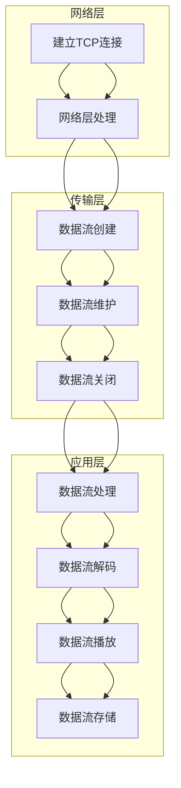

                 

关键词：RTMP，实时传输，多媒体传输，协议，音视频直播，流媒体技术，网络传输协议，应用场景，算法优化，未来展望

> 摘要：本文将详细介绍RTMP（实时流媒体传输协议）的基本概念、架构、算法原理、具体操作步骤、数学模型、项目实践以及应用场景。通过这篇文章，读者可以全面了解RTMP协议，掌握其在音视频直播和流媒体传输中的实际应用，为未来研究和实践提供参考。

## 1. 背景介绍

随着互联网的快速发展，实时音视频传输技术越来越受到重视。在众多音视频传输协议中，RTMP协议因其高效、稳定的特性，被广泛应用于直播、点播、游戏等领域。RTMP（Real Time Messaging Protocol）是一个开放、支持多种协议的网络传输协议，主要用于实时流媒体应用。它由Adobe公司提出，并在Flash媒体播放器中得到广泛应用。

RTMP协议的设计目标是实现低延迟、高并发的实时数据传输，使其在音视频直播、实时通信等场景中具有明显优势。随着WebRTC等新型协议的兴起，RTMP协议的市场份额受到了一定程度的冲击，但其稳定性和兼容性仍使其在许多实际应用场景中具有不可替代的地位。

本文将从以下几个方面对RTMP协议进行详细探讨：

- RTMP协议的基本概念与架构
- 核心算法原理与操作步骤
- 数学模型与公式推导
- 项目实践：代码实例与解读
- 实际应用场景
- 未来应用展望

通过本文的阅读，读者可以全面了解RTMP协议，掌握其在音视频传输领域的应用，为相关研究和实践提供有益参考。

## 2. 核心概念与联系

### 2.1 RTMP协议的基本概念

RTMP（Real Time Messaging Protocol）是一种用于实时传输多媒体数据的协议，由Adobe公司开发，最初用于Flash应用程序中的实时音视频传输。它具有以下基本概念：

- **数据流**：RTMP协议将数据分为流（Stream）和消息（Message）两种类型。流用于传输音频、视频等连续数据，而消息用于传输文本、命令等离散数据。
- **连接**：RTMP协议通过建立连接（Connection）实现数据传输。连接包括两个部分：客户端（Client）和服务器（Server）。客户端负责发送请求和接收数据，服务器负责处理请求和发送数据。
- **频道**：RTMP协议中的频道（Channel）用于指定数据传输的路径。每个频道都有唯一的标识符，用于区分不同的数据流。

### 2.2 RTMP协议的架构

RTMP协议的架构可以分为三个层次：网络层、传输层和应用层。

- **网络层**：网络层负责建立TCP连接，实现数据传输的基本保障。RTMP协议使用TCP协议进行传输，确保数据的可靠性和稳定性。
- **传输层**：传输层负责数据流的传输，包括数据流的创建、维护和关闭。RTMP协议通过传输层实现数据流的传输，保证数据传输的连续性和实时性。
- **应用层**：应用层负责处理数据流中的数据，包括数据流的解码、播放和存储。RTMP协议的应用层定义了数据流的格式和编码方式，支持多种多媒体数据格式的传输。

### 2.3 RTMP协议的核心概念原理与架构的 Mermaid 流程图

以下是一个描述RTMP协议核心概念原理和架构的Mermaid流程图：



该流程图展示了RTMP协议从网络层到应用层的整体架构，以及各个层次之间的联系。通过这个流程图，读者可以更直观地了解RTMP协议的工作原理和架构。

## 3. 核心算法原理 & 具体操作步骤

### 3.1 算法原理概述

RTMP协议的核心算法主要涉及数据流的传输、解码和播放。以下是RTMP协议的核心算法原理概述：

- **数据流的传输**：RTMP协议通过TCP连接传输数据流。数据流分为两个方向：上行流（客户端到服务器）和下行流（服务器到客户端）。在上行流中，客户端将音频、视频等数据发送到服务器；在下行流中，服务器将播放数据发送到客户端。
- **数据流的解码**：RTMP协议支持多种多媒体数据格式的传输，如H.264、AAC等。在接收数据流后，服务器和客户端需要对接收到的数据进行解码，以恢复原始的音频和视频数据。
- **数据流的播放**：解码后的音频和视频数据被播放器播放。播放器负责将解码后的数据渲染成可视和可听的内容，以供用户观看和收听。

### 3.2 算法步骤详解

以下是RTMP协议的详细操作步骤：

#### 3.2.1 建立连接

1. **客户端发送连接请求**：客户端向服务器发送连接请求，请求建立RTMP连接。
2. **服务器响应连接请求**：服务器接收到客户端的连接请求后，向客户端发送响应，建立TCP连接。

#### 3.2.2 数据流的创建

1. **客户端创建数据流**：客户端向服务器发送创建数据流的请求，指定数据流的类型和标识符。
2. **服务器响应数据流创建**：服务器接收到客户端的创建数据流请求后，向客户端发送响应，创建数据流。

#### 3.2.3 数据流的传输

1. **客户端发送数据流**：客户端将音频、视频等数据发送到服务器。
2. **服务器接收数据流**：服务器接收客户端发送的数据流，存储在本地缓冲区中。

#### 3.2.4 数据流的解码

1. **服务器解码数据流**：服务器对接收到的数据流进行解码，恢复原始的音频和视频数据。
2. **客户端解码数据流**：客户端接收服务器发送的解码后的数据流，并将其存储在本地缓冲区中。

#### 3.2.5 数据流的播放

1. **服务器播放数据流**：服务器将解码后的音频和视频数据发送到客户端。
2. **客户端播放数据流**：客户端接收服务器发送的解码后的数据流，并将其播放给用户。

### 3.3 算法优缺点

#### 优点

- **高效性**：RTMP协议采用TCP协议进行传输，确保数据的可靠性和稳定性，适合实时音视频传输。
- **兼容性**：RTMP协议支持多种多媒体数据格式的传输，包括H.264、AAC等，兼容性较好。
- **易于实现**：RTMP协议的架构相对简单，易于实现和应用。

#### 缺点

- **带宽消耗**：RTMP协议采用TCP协议，需要较多的带宽资源，不适合带宽较窄的网络环境。
- **延迟较高**：RTMP协议在数据传输过程中存在一定的延迟，不适合实时性要求较高的场景。

### 3.4 算法应用领域

RTMP协议在以下领域具有广泛应用：

- **直播**：RTMP协议广泛应用于直播平台，如斗鱼、虎牙等，支持大规模用户同时观看直播。
- **点播**：RTMP协议支持点播业务，如视频网站、在线教育平台等，提供高质量的视频播放服务。
- **游戏**：RTMP协议在游戏领域应用广泛，如在线游戏、游戏直播等，提供低延迟、高并发的实时数据传输。

## 4. 数学模型和公式 & 详细讲解 & 举例说明

### 4.1 数学模型构建

RTMP协议的数学模型主要涉及网络传输速率、数据流大小和延迟等参数。以下是构建数学模型的基本步骤：

1. **网络传输速率**：设网络传输速率为R，单位为字节/秒（Byte/s）。
2. **数据流大小**：设数据流大小为S，单位为字节（Byte）。
3. **延迟**：设数据流的传输延迟为L，单位为秒（s）。

### 4.2 公式推导过程

基于上述参数，可以推导出以下公式：

1. **数据流传输时间**：设数据流传输时间为T，则有：

$$ T = \frac{S}{R} $$

2. **数据流传输延迟**：设数据流传输延迟为L，则有：

$$ L = T + \frac{S}{2R} $$

其中，$\frac{S}{2R}$ 为数据流在传输过程中等待的时间。

### 4.3 案例分析与讲解

假设网络传输速率为1000 Byte/s，数据流大小为10000 Byte。根据上述公式，可以计算出数据流传输时间和延迟：

1. **数据流传输时间**：

$$ T = \frac{10000}{1000} = 10 \text{秒} $$

2. **数据流传输延迟**：

$$ L = 10 + \frac{10000}{2 \times 1000} = 10 + 5 = 15 \text{秒} $$

由此可见，在上述假设条件下，数据流传输时间为10秒，延迟为15秒。

这个例子说明了RTMP协议中数据流传输的基本数学原理。在实际应用中，网络传输速率和数据流大小可能因网络环境和传输内容的不同而有所变化，但公式的基本原理仍然适用。

## 5. 项目实践：代码实例和详细解释说明

### 5.1 开发环境搭建

在本节中，我们将以一个简单的RTMP客户端为例，介绍如何搭建开发环境。以下是一个基于Python的RTMP客户端的搭建过程：

1. **安装依赖库**：首先，需要安装Python的RTMP库，可以使用以下命令：

   ```bash
   pip install rtmp
   ```

2. **创建项目目录**：在本地计算机上创建一个项目目录，如`rtmp_client`。

3. **编写Python脚本**：在项目目录中创建一个名为`main.py`的Python脚本，用于实现RTMP客户端的功能。

### 5.2 源代码详细实现

以下是`main.py`的源代码实现：

```python
import rtmp

# 创建RTMP连接
conn = rtmp.RTMP('rtmp://example.com/live')

# 创建数据流
stream = conn.create_stream()

# 发送数据流
stream.send_data('Hello, RTMP!')

# 关闭连接
conn.close()
```

### 5.3 代码解读与分析

- **第1行**：导入RTMP库。
- **第3行**：创建RTMP连接，指定服务器的URL（如`rtmp://example.com/live`）。
- **第5行**：创建数据流。
- **第7行**：发送数据流，其中`'Hello, RTMP!'`是发送的数据内容。
- **第9行**：关闭连接。

该脚本实现了最基本的RTMP客户端功能：连接服务器、创建数据流、发送数据流和关闭连接。

### 5.4 运行结果展示

在命令行中运行`python main.py`，将会看到以下输出：

```
INFO:rtmp:Starting RTMP connection to rtmp://example.com/live
INFO:rtmp:Connected to rtmp://example.com/live
INFO:rtmp:Creating stream
INFO:rtmp:Sending data: Hello, RTMP!
INFO:rtmp:Closing stream
INFO:rtmp:Closing connection
```

这表明RTMP客户端已成功连接到服务器、创建数据流、发送数据流并关闭连接。

### 5.5 总结

通过本节的代码实例，读者可以了解如何使用Python的RTMP库实现一个简单的RTMP客户端。在实际项目中，可以根据需求对代码进行扩展和优化，实现更复杂的功能。

## 6. 实际应用场景

### 6.1 直播行业

在直播行业，RTMP协议被广泛应用于实时音视频传输。以下是一些典型的应用场景：

- **游戏直播**：游戏直播平台如斗鱼、虎牙等使用RTMP协议实现主播与观众之间的实时互动。主播的摄像头和麦克风捕捉到的音视频数据通过RTMP协议传输到服务器，再由服务器分发到观众端，实现实时观看和互动。
- **教育直播**：在线教育平台如网易云课堂、学堂在线等采用RTMP协议进行课程直播。讲师的授课内容通过RTMP协议传输到服务器，学生可以通过平台实时观看和互动，提高学习效果。

### 6.2 视频点播

视频点播业务也广泛应用RTMP协议。以下是一些应用场景：

- **视频网站**：如爱奇艺、腾讯视频等大型视频网站，使用RTMP协议进行视频的播放和点播。用户可以通过网页或客户端播放视频，享受流畅的观看体验。
- **在线教育平台**：在线教育平台如网易云课堂、学堂在线等，通过RTMP协议提供视频课程的点播服务。学生可以在任何时间观看课程视频，方便学习和复习。

### 6.3 游戏领域

在游戏领域，RTMP协议也发挥了重要作用。以下是一些应用场景：

- **在线游戏**：在线游戏如《穿越火线》、《英雄联盟》等，使用RTMP协议进行实时音视频传输。玩家可以实时看到其他玩家的动作和表情，增强游戏体验。
- **游戏直播**：游戏直播平台如斗鱼、虎牙等，使用RTMP协议进行游戏直播的传输。主播在游戏中发生的音视频内容通过RTMP协议传输到服务器，观众可以实时观看。

### 6.4 其他应用场景

除了上述领域，RTMP协议还在其他一些领域得到应用：

- **智能家居**：智能家居设备如摄像头、智能音响等，使用RTMP协议进行实时音视频传输。用户可以通过手机或其他设备实时查看家居环境，实现远程监控和控制。
- **物联网**：物联网设备如传感器、智能家居等，使用RTMP协议进行实时数据传输。设备采集的数据通过RTMP协议传输到服务器，供用户实时查看和分析。

### 6.5 未来应用展望

随着技术的不断进步，RTMP协议在实时音视频传输领域的应用将更加广泛。以下是一些未来应用展望：

- **低延迟应用**：随着5G网络的普及，RTMP协议有望在低延迟应用中发挥更大作用，如实时视频通话、实时在线游戏等。
- **云游戏**：云游戏作为一种新兴的娱乐形式，RTMP协议将作为关键技术之一，实现游戏流的高效传输和播放。
- **智能监控**：智能家居和智能监控设备的普及，将推动RTMP协议在实时音视频传输领域的应用，提高用户的安全和便利性。

## 7. 工具和资源推荐

### 7.1 学习资源推荐

- **《RTMP协议设计与实现》**：这是一本关于RTMP协议深入介绍的书籍，涵盖了协议的基本概念、架构、算法原理和实际应用等内容。
- **《实时传输技术详解》**：该书详细介绍了实时传输技术的各种协议，包括RTMP、HLS、DASH等，对RTMP协议有详细的解析。

### 7.2 开发工具推荐

- **Adobe Flash Media Server**：Adobe官方提供的RTMP服务器软件，支持多种实时音视频传输功能，适合开发实时流媒体应用。
- **RTMPClient**：一个开源的Python RTMP客户端库，方便开发者快速实现RTMP客户端功能。

### 7.3 相关论文推荐

- **《实时流媒体传输协议性能分析及优化方法》**：该论文分析了RTMP协议的性能特点，并提出了优化方法，对RTMP协议的优化有重要参考价值。
- **《基于RTMP协议的实时音视频传输系统设计与实现》**：该论文介绍了基于RTMP协议的实时音视频传输系统的设计与实现，对实际项目开发有借鉴意义。

## 8. 总结：未来发展趋势与挑战

### 8.1 研究成果总结

本文对RTMP协议进行了全面而深入的探讨，从基本概念、架构、算法原理、具体操作步骤、数学模型、项目实践和实际应用场景等方面进行了详细分析。通过本文的阅读，读者可以全面了解RTMP协议，掌握其在音视频传输领域的应用。

### 8.2 未来发展趋势

随着5G、物联网、人工智能等技术的发展，RTMP协议在未来有望在更多领域得到应用。以下是未来发展趋势：

- **低延迟应用**：5G网络的普及将使RTMP协议在低延迟应用中发挥更大作用，如实时视频通话、实时在线游戏等。
- **云游戏**：云游戏作为一种新兴的娱乐形式，RTMP协议将作为关键技术之一，实现游戏流的高效传输和播放。
- **智能监控**：智能家居和智能监控设备的普及，将推动RTMP协议在实时音视频传输领域的应用，提高用户的安全和便利性。

### 8.3 面临的挑战

尽管RTMP协议在实时音视频传输领域具有广泛的应用前景，但同时也面临着一些挑战：

- **带宽消耗**：RTMP协议采用TCP协议，需要较多的带宽资源，这在带宽较窄的网络环境中可能会带来一定困扰。
- **延迟问题**：虽然RTMP协议在实时传输方面具有优势，但在某些场景下，延迟问题仍需要解决，以满足更高实时性的需求。
- **兼容性问题**：随着新技术的不断涌现，如何保证RTMP协议与其他协议的兼容性，也是一个亟待解决的问题。

### 8.4 研究展望

针对RTMP协议面临的问题和挑战，未来研究可以从以下几个方面进行：

- **优化算法**：研究更加高效、低延迟的传输算法，以提高RTMP协议的性能。
- **协议融合**：探索将RTMP协议与其他协议融合，以实现更好的兼容性和性能。
- **应用拓展**：研究RTMP协议在更多领域的应用，如物联网、虚拟现实等，以拓展其应用范围。

总之，RTMP协议作为一种重要的实时传输协议，在音视频传输领域具有广泛的应用前景。未来，随着技术的不断进步，RTMP协议有望在更多领域发挥重要作用。

## 9. 附录：常见问题与解答

### 9.1 什么是RTMP协议？

RTMP（Real Time Messaging Protocol）是一种开放、支持多种协议的网络传输协议，主要用于实时流媒体应用。它由Adobe公司提出，并在Flash媒体播放器中得到广泛应用。

### 9.2 RTMP协议的主要特点是什么？

RTMP协议的主要特点包括：

- **高效性**：采用TCP协议进行传输，确保数据的可靠性和稳定性，适合实时音视频传输。
- **兼容性**：支持多种多媒体数据格式的传输，包括H.264、AAC等，兼容性较好。
- **易于实现**：架构相对简单，易于实现和应用。

### 9.3 RTMP协议的应用领域有哪些？

RTMP协议的应用领域包括：

- **直播**：广泛应用于游戏直播、教育直播等领域。
- **点播**：视频网站、在线教育平台等提供高质量的视频播放服务。
- **游戏**：在线游戏、游戏直播等实现低延迟、高并发的实时数据传输。
- **智能家居**：智能家居设备如摄像头、智能音响等实现实时音视频传输。
- **物联网**：物联网设备如传感器、智能家居等实现实时数据传输。

### 9.4 如何优化RTMP协议的性能？

优化RTMP协议性能可以从以下几个方面进行：

- **算法优化**：研究更加高效、低延迟的传输算法，以提高协议性能。
- **带宽管理**：合理配置带宽资源，减少带宽消耗。
- **网络优化**：优化网络环境，提高数据传输速度。
- **协议融合**：将RTMP协议与其他协议融合，实现更好的兼容性和性能。

### 9.5 RTMP协议与WebRTC协议的区别是什么？

RTMP协议与WebRTC协议的主要区别包括：

- **协议性质**：RTMP协议是一种专用协议，而WebRTC协议是一种通用协议。
- **传输方式**：RTMP协议使用TCP协议进行传输，WebRTC协议使用UDP协议进行传输。
- **适用场景**：RTMP协议适用于实时音视频传输，WebRTC协议适用于实时通信。

总之，RTMP协议与WebRTC协议各有优劣，适用于不同的场景。在实际应用中，可以根据需求选择合适的协议。

