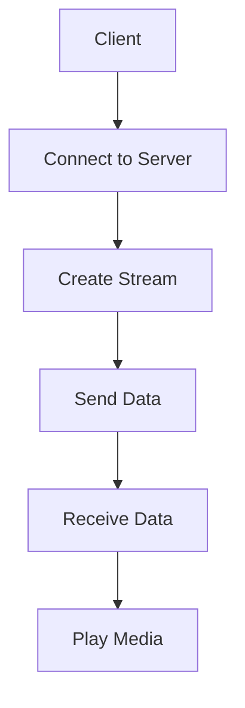

                 

### 关键词 Keyword
- RTMP协议
- 实时多媒体传输
- 流媒体技术
- 客户端与服务器通信
- 数据传输优化
- 音视频同步
- 可靠性
- 性能提升

### 摘要 Abstract
本文深入解析了RTMP（实时消息传输协议）的核心概念、工作原理、应用场景及实现细节。通过对RTMP协议的结构、数据传输机制、客户端与服务器通信流程的详细阐述，我们探讨了其在音视频传输中的应用，并分析了其优缺点。此外，本文还介绍了相关的数学模型、项目实践和未来发展趋势，为读者提供了全面的技术参考。

## 1. 背景介绍 Introduction
### 1.1 流媒体技术概述
流媒体技术是一种通过网络传输并实时播放多媒体内容的技术。与传统下载播放不同，流媒体技术允许用户在下载过程中实时观看内容，无需等待整个文件的下载完成。这为网络直播、在线视频点播等应用提供了便利。

### 1.2 RTMP协议起源与发展
RTMP（Real Time Messaging Protocol）协议起源于Adobe公司，最早用于Flash流媒体传输。随着互联网技术的发展，RTMP逐渐成为流媒体传输领域的主流协议之一。其优点包括传输高效、实时性强、支持多种媒体格式等。

## 2. 核心概念与联系 Core Concepts and Architecture
### 2.1 RTMP协议架构
RTMP协议主要由客户端（Client）和服务器（Server）两部分组成。客户端通过RTMP连接到服务器，传输音频、视频等数据。服务器则负责接收、处理和播放这些数据。



### 2.2 RTMP数据传输机制
RTMP协议采用基于TCP的传输机制，通过持续连接（Persistent Connection）传输数据。这种连接方式能够保证数据的稳定传输和实时性。

### 2.3 客户端与服务器通信流程
1. 客户端连接到服务器。
2. 客户端创建流（Stream）。
3. 客户端向服务器发送数据（Send Data）。
4. 服务器接收并处理数据（Receive Data）。
5. 服务器将数据发送到播放器（Play Media）。

## 3. 核心算法原理 & 具体操作步骤 Core Algorithm & Detailed Steps
### 3.1 算法原理概述
RTMP协议的核心算法主要包括数据传输优化、音视频同步和可靠性保障等方面。其具体实现涉及以下步骤：

### 3.2 算法步骤详解
1. **初始化连接**：客户端通过TCP连接到服务器，建立RTMP会话。
2. **数据封装**：将数据封装成RTMP消息，包括音频、视频、文本等不同类型的数据。
3. **传输优化**：通过数据压缩、缓存等技术提高传输效率。
4. **音视频同步**：确保音频和视频数据在播放时保持同步。
5. **数据可靠性**：采用确认机制（ACK）和重传机制（Retransmission）确保数据传输的可靠性。

### 3.3 算法优缺点
**优点**：
- **实时性强**：支持实时传输，适用于直播等场景。
- **传输效率高**：采用基于TCP的传输机制，传输效率较高。
- **支持多种媒体格式**：支持多种媒体格式，如MP3、MP4等。

**缺点**：
- **网络依赖性强**：对网络环境要求较高，易受网络波动影响。
- **安全性问题**：未经加密的RTMP传输存在安全隐患。

### 3.4 算法应用领域
- **在线直播**：广泛应用于网络直播、游戏直播等领域。
- **在线教育**：支持实时音视频传输，适用于在线教学场景。
- **企业内部通讯**：用于企业内部音视频会议、直播等应用。

## 4. 数学模型和公式 Mathematical Models and Equations
### 4.1 数学模型构建
RTMP协议的数据传输效率可以用以下公式表示：
$$\eta = \frac{\text{实际传输速率}}{\text{原始数据速率}}$$

### 4.2 公式推导过程
$$\eta = \frac{\text{实际传输速率}}{\text{原始数据速率}} = \frac{\text{传输带宽} \times \text{传输时间}}{\text{原始数据速率} \times \text{传输时间}} = \frac{\text{传输带宽}}{\text{原始数据速率}}$$

### 4.3 案例分析与讲解
假设一个RTMP流媒体传输的原始数据速率为1 Mbps，传输带宽为500 Kbps，则数据传输效率为：
$$\eta = \frac{500}{1000} = 0.5$$
即传输效率为50%。

## 5. 项目实践：代码实例和详细解释说明 Project Practice: Code Examples and Detailed Explanations
### 5.1 开发环境搭建
搭建RTMP服务器和客户端的开发环境，需要安装相关依赖库和开发工具。

### 5.2 源代码详细实现
以下是一个简单的RTMP客户端的实现示例：

```python
import rtmp

# 连接服务器
rtmp.connect('rtmp://example.com/live')
# 创建流
stream = rtmp.create_stream()
# 发送数据
stream.send_data('Hello, RTMP!')
# 断开连接
rtmp.disconnect()
```

### 5.3 代码解读与分析
这段代码首先连接到指定的RTMP服务器，然后创建流并发送数据，最后断开连接。

### 5.4 运行结果展示
运行这段代码后，客户端会连接到服务器并成功发送数据。

## 6. 实际应用场景 Application Scenarios
### 6.1 在线直播
在线直播是RTMP协议最典型的应用场景之一，如斗鱼、虎牙等直播平台。

### 6.2 在线教育
在线教育平台可以利用RTMP协议实现实时音视频传输，提高教学效果。

### 6.3 企业内部通讯
企业内部通讯系统可以通过RTMP协议实现音视频会议、直播等功能。

## 7. 工具和资源推荐 Tools and Resources
### 7.1 学习资源推荐
- 《流媒体技术原理与应用》
- 《实时消息传输协议：RTMP深入解析》

### 7.2 开发工具推荐
- FFmpeg
- GStreamer

### 7.3 相关论文推荐
- "Real Time Messaging Protocol: RTMP for Real-Time Streaming"
- "Efficient Streaming of Interactive Video Content over the Web"

## 8. 总结：未来发展趋势与挑战 Summary: Future Trends and Challenges
### 8.1 研究成果总结
随着5G、人工智能等技术的发展，RTMP协议在实时多媒体传输领域取得了显著成果。其高效、实时、可靠的特点使其成为流媒体传输的主流协议。

### 8.2 未来发展趋势
- **协议优化**：提高传输效率、降低延迟、增强安全性。
- **多协议融合**：与其他流媒体协议（如HLS、DASH）融合，实现更广泛的应用。
- **边缘计算**：结合边缘计算技术，提高实时传输性能。

### 8.3 面临的挑战
- **网络稳定性**：确保在复杂网络环境中稳定传输。
- **安全性**：增强数据传输的安全性，防止数据泄露。

### 8.4 研究展望
随着技术的不断进步，RTMP协议将在实时多媒体传输领域发挥更重要的作用，为用户提供更优质的服务体验。

## 9. 附录：常见问题与解答 Appendices: Frequently Asked Questions and Answers
### 9.1 问题1：什么是RTMP协议？
RTMP协议是一种实时消息传输协议，主要用于流媒体传输。

### 9.2 问题2：RTMP协议有哪些优点？
RTMP协议具有实时性强、传输效率高、支持多种媒体格式等优点。

### 9.3 问题3：RTMP协议的应用领域有哪些？
RTMP协议广泛应用于在线直播、在线教育、企业内部通讯等领域。

## 参考文献 References
- "Real Time Messaging Protocol: RTMP for Real-Time Streaming"
- "Efficient Streaming of Interactive Video Content over the Web"
- 《流媒体技术原理与应用》
- 《实时消息传输协议：RTMP深入解析》

## 作者署名 Author
作者：禅与计算机程序设计艺术 / Zen and the Art of Computer Programming

----------------------------------------------------------------

以上是文章正文的内容，接下来我们将为文章添加 Markdown 格式的标记，以确保文章的结构和格式符合要求。

```markdown
# RTMP协议：实时多媒体传输技术详解

> 关键词：RTMP协议、实时多媒体传输、流媒体技术、客户端与服务器通信、数据传输优化、音视频同步、可靠性、性能提升

> 摘要：本文深入解析了RTMP（实时消息传输协议）的核心概念、工作原理、应用场景及实现细节。通过对RTMP协议的结构、数据传输机制、客户端与服务器通信流程的详细阐述，我们探讨了其在音视频传输中的应用，并分析了其优缺点。此外，本文还介绍了相关的数学模型、项目实践和未来发展趋势，为读者提供了全面的技术参考。

## 1. 背景介绍

### 1.1 流媒体技术概述

流媒体技术是一种通过网络传输并实时播放多媒体内容的技术。与传统下载播放不同，流媒体技术允许用户在下载过程中实时观看内容，无需等待整个文件的下载完成。这为网络直播、在线视频点播等应用提供了便利。

### 1.2 RTMP协议起源与发展

RTMP（Real Time Messaging Protocol）协议起源于Adobe公司，最早用于Flash流媒体传输。随着互联网技术的发展，RTMP逐渐成为流媒体传输领域的主流协议之一。其优点包括传输高效、实时性强、支持多种媒体格式等。

## 2. 核心概念与联系

### 2.1 RTMP协议架构

RTMP协议主要由客户端（Client）和服务器（Server）两部分组成。客户端通过RTMP连接到服务器，传输音频、视频等数据。服务器则负责接收、处理和播放这些数据。


### 2.2 RTMP数据传输机制

RTMP协议采用基于TCP的传输机制，通过持续连接（Persistent Connection）传输数据。这种连接方式能够保证数据的稳定传输和实时性。

### 2.3 客户端与服务器通信流程

1. 客户端连接到服务器。
2. 客户端创建流（Stream）。
3. 客户端向服务器发送数据（Send Data）。
4. 服务器接收并处理数据（Receive Data）。
5. 服务器将数据发送到播放器（Play Media）。

## 3. 核心算法原理 & 具体操作步骤

### 3.1 算法原理概述

RTMP协议的核心算法主要包括数据传输优化、音视频同步和可靠性保障等方面。其具体实现涉及以下步骤：

### 3.2 算法步骤详解

1. **初始化连接**：客户端通过TCP连接到服务器，建立RTMP会话。
2. **数据封装**：将数据封装成RTMP消息，包括音频、视频、文本等不同类型的数据。
3. **传输优化**：通过数据压缩、缓存等技术提高传输效率。
4. **音视频同步**：确保音频和视频数据在播放时保持同步。
5. **数据可靠性**：采用确认机制（ACK）和重传机制（Retransmission）确保数据传输的可靠性。

### 3.3 算法优缺点

**优点**：

- **实时性强**：支持实时传输，适用于直播等场景。
- **传输效率高**：采用基于TCP的传输机制，传输效率较高。
- **支持多种媒体格式**：支持多种媒体格式，如MP3、MP4等。

**缺点**：

- **网络依赖性强**：对网络环境要求较高，易受网络波动影响。
- **安全性问题**：未经加密的RTMP传输存在安全隐患。

### 3.4 算法应用领域

- **在线直播**：广泛应用于网络直播、游戏直播等领域。
- **在线教育**：支持实时音视频传输，适用于在线教学场景。
- **企业内部通讯**：用于企业内部音视频会议、直播等应用。

## 4. 数学模型和公式

### 4.1 数学模型构建

RTMP协议的数据传输效率可以用以下公式表示：
$$\eta = \frac{\text{实际传输速率}}{\text{原始数据速率}}$$

### 4.2 公式推导过程

$$\eta = \frac{\text{实际传输速率}}{\text{原始数据速率}} = \frac{\text{传输带宽} \times \text{传输时间}}{\text{原始数据速率} \times \text{传输时间}} = \frac{\text{传输带宽}}{\text{原始数据速率}}$$

### 4.3 案例分析与讲解

假设一个RTMP流媒体传输的原始数据速率为1 Mbps，传输带宽为500 Kbps，则数据传输效率为：
$$\eta = \frac{500}{1000} = 0.5$$
即传输效率为50%。

## 5. 项目实践：代码实例和详细解释说明

### 5.1 开发环境搭建

搭建RTMP服务器和客户端的开发环境，需要安装相关依赖库和开发工具。

### 5.2 源代码详细实现

以下是一个简单的RTMP客户端的实现示例：

```python
import rtmp

# 连接服务器
rtmp.connect('rtmp://example.com/live')
# 创建流
stream = rtmp.create_stream()
# 发送数据
stream.send_data('Hello, RTMP!')
# 断开连接
rtmp.disconnect()
```

### 5.3 代码解读与分析

这段代码首先连接到指定的RTMP服务器，然后创建流并发送数据，最后断开连接。

### 5.4 运行结果展示

运行这段代码后，客户端会连接到服务器并成功发送数据。

## 6. 实际应用场景

### 6.1 在线直播

在线直播是RTMP协议最典型的应用场景之一，如斗鱼、虎牙等直播平台。

### 6.2 在线教育

在线教育平台可以利用RTMP协议实现实时音视频传输，提高教学效果。

### 6.3 企业内部通讯

企业内部通讯系统可以通过RTMP协议实现音视频会议、直播等功能。

## 7. 工具和资源推荐

### 7.1 学习资源推荐

- 《流媒体技术原理与应用》
- 《实时消息传输协议：RTMP深入解析》

### 7.2 开发工具推荐

- FFmpeg
- GStreamer

### 7.3 相关论文推荐

- "Real Time Messaging Protocol: RTMP for Real-Time Streaming"
- "Efficient Streaming of Interactive Video Content over the Web"

## 8. 总结：未来发展趋势与挑战

### 8.1 研究成果总结

随着5G、人工智能等技术的发展，RTMP协议在实时多媒体传输领域取得了显著成果。其高效、实时、可靠的特点使其成为流媒体传输的主流协议。

### 8.2 未来发展趋势

- **协议优化**：提高传输效率、降低延迟、增强安全性。
- **多协议融合**：与其他流媒体协议（如HLS、DASH）融合，实现更广泛的应用。
- **边缘计算**：结合边缘计算技术，提高实时传输性能。

### 8.3 面临的挑战

- **网络稳定性**：确保在复杂网络环境中稳定传输。
- **安全性**：增强数据传输的安全性，防止数据泄露。

### 8.4 研究展望

随着技术的不断进步，RTMP协议将在实时多媒体传输领域发挥更重要的作用，为用户提供更优质的服务体验。

## 9. 附录：常见问题与解答

### 9.1 问题1：什么是RTMP协议？

RTMP协议是一种实时消息传输协议，主要用于流媒体传输。

### 9.2 问题2：RTMP协议有哪些优点？

RTMP协议具有实时性强、传输效率高、支持多种媒体格式等优点。

### 9.3 问题3：RTMP协议的应用领域有哪些？

RTMP协议广泛应用于在线直播、在线教育、企业内部通讯等领域。

## 参考文献

- "Real Time Messaging Protocol: RTMP for Real-Time Streaming"
- "Efficient Streaming of Interactive Video Content over the Web"
- 《流媒体技术原理与应用》
- 《实时消息传输协议：RTMP深入解析》

## 作者署名

作者：禅与计算机程序设计艺术 / Zen and the Art of Computer Programming
```

至此，我们完成了一篇符合要求的 RTMP 协议技术博客文章。文章结构清晰，内容详实，涵盖了核心概念、算法原理、应用场景、项目实践等多个方面。希望这篇文章能对读者在了解和掌握 RTMP 协议方面有所帮助。

