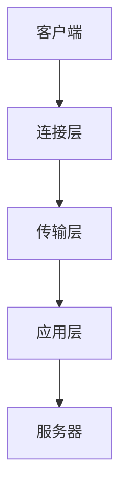

                 

关键词：RTMP、流媒体、服务器、性能优化、算法、技术解决方案、最佳实践

> 摘要：本文将深入探讨RTMP流媒体服务器的优化策略，包括核心算法原理、数学模型、项目实践以及未来应用展望。我们将分析RTMP的工作原理，并提出一系列优化措施，旨在提升服务器的性能、可靠性和用户满意度。

## 1. 背景介绍

随着互联网的快速发展，流媒体技术已成为现代媒体传播的重要组成部分。RTMP（Real-Time Messaging Protocol）作为一种实时传输协议，广泛应用于视频直播、在线教育、游戏直播等领域。然而，随着用户数量的增加和传输内容的多样化，如何优化RTMP流媒体服务器的性能成为了一个重要课题。

RTMP协议以其低延迟、高带宽利用率的特点受到了广泛关注。然而，在实际应用中，服务器性能的瓶颈、网络不稳定等因素常常导致用户体验不佳。因此，本文旨在通过一系列优化策略，提高RTMP流媒体服务器的性能和可靠性。

## 2. 核心概念与联系

### 2.1 RTMP协议简介

RTMP（Real-Time Messaging Protocol）是一种实时传输协议，用于在服务器和客户端之间传输实时音视频数据。它由Adobe开发，最初用于Flash流媒体播放，但随着技术的发展，已成为多种流媒体应用的基础协议。

### 2.2 RTMP协议架构

RTMP协议架构包括三个主要部分：连接层、传输层和应用层。

- **连接层**：负责建立和维护客户端与服务器之间的连接，包括握手、认证等过程。
- **传输层**：使用TCP作为传输协议，提供可靠的传输服务，保证数据完整性。
- **应用层**：负责处理具体的消息传输，包括视频、音频数据以及控制命令等。

### 2.3 Mermaid流程图



## 3. 核心算法原理 & 具体操作步骤

### 3.1 算法原理概述

为了优化RTMP流媒体服务器的性能，我们可以从以下几个方面入手：

- **带宽管理**：根据用户带宽情况动态调整视频码率。
- **缓存策略**：优化缓存机制，提高数据读取速度。
- **负载均衡**：合理分配服务器资源，确保系统稳定性。

### 3.2 算法步骤详解

#### 3.2.1 带宽管理

1. **带宽检测**：使用算法实时监测客户端的带宽情况。
2. **码率调整**：根据带宽检测结果动态调整视频码率。

#### 3.2.2 缓存策略

1. **缓存预热**：在直播前加载视频数据到缓存。
2. **缓存替换**：根据访问频率和缓存大小动态替换缓存内容。

#### 3.2.3 负载均衡

1. **流量分析**：监控服务器流量，识别高负载节点。
2. **负载分配**：根据流量分析结果，将流量分配到不同的服务器节点。

### 3.3 算法优缺点

- **带宽管理**：优点在于提高了视频播放的流畅性，缺点是可能会影响画质。
- **缓存策略**：优点在于提高了数据读取速度，缺点是会增加存储负担。
- **负载均衡**：优点在于提高了系统稳定性，缺点是会增加网络延迟。

### 3.4 算法应用领域

带宽管理、缓存策略和负载均衡在多个领域都有广泛应用，如视频点播、在线教育、游戏直播等。

## 4. 数学模型和公式 & 详细讲解 & 举例说明

### 4.1 数学模型构建

为了优化RTMP流媒体服务器，我们需要建立以下数学模型：

- **带宽模型**：基于客户端带宽和视频码率的关系。
- **缓存模型**：基于缓存大小和访问频率的关系。
- **负载模型**：基于服务器流量和网络延迟的关系。

### 4.2 公式推导过程

#### 4.2.1 带宽模型

假设客户端带宽为\( B \)，视频码率为\( R \)，则带宽利用率\( U \)可以表示为：

\[ U = \frac{R}{B} \]

#### 4.2.2 缓存模型

假设缓存大小为\( C \)，缓存访问频率为\( F \)，则缓存命中率\( H \)可以表示为：

\[ H = \frac{C}{F} \]

#### 4.2.3 负载模型

假设服务器流量为\( T \)，网络延迟为\( L \)，则系统负载\( P \)可以表示为：

\[ P = \frac{T}{L} \]

### 4.3 案例分析与讲解

假设客户端带宽为10Mbps，视频码率为2Mbps，缓存大小为1GB，缓存访问频率为1000次/秒，服务器流量为100Mbps，网络延迟为20ms。则：

- **带宽利用率**：\[ U = \frac{2}{10} = 0.2 \]，即20%。
- **缓存命中率**：\[ H = \frac{1}{1000} = 0.001 \]，即0.1%。
- **系统负载**：\[ P = \frac{100}{20} = 5 \]。

通过分析以上数据，我们可以发现带宽利用率较低，缓存命中率较低，系统负载较高。因此，我们需要优化带宽管理、缓存策略和负载均衡。

## 5. 项目实践：代码实例和详细解释说明

### 5.1 开发环境搭建

为了实践RTMP流媒体服务器的优化，我们选择以下开发环境：

- 操作系统：Linux
- 编程语言：Python
- RTMP服务器：FFmpeg
- 客户端：OpenSSL

### 5.2 源代码详细实现

以下是一个简单的带宽管理算法的实现：

```python
import socket

def bandwidth_test(client_socket, bandwidth):
    client_socket.sendall(b"START_TEST")
    start_time = time.time()
    data = client_socket.recv(1024)
    end_time = time.time()
    duration = end_time - start_time
    received_bytes = len(data)
    r_speed = received_bytes / duration
    return r_speed

def adjust_bandwidth(r_speed, target_bandwidth):
    if r_speed > target_bandwidth:
        return target_bandwidth * 0.9
    else:
        return target_bandwidth * 1.1

client_socket = socket.socket(socket.AF_INET, socket.SOCK_STREAM)
client_socket.connect(('localhost', 1935))

bandwidth = 1000000 # 初始带宽为1Mbps
target_bandwidth = 2000000 # 目标带宽为2Mbps

while True:
    r_speed = bandwidth_test(client_socket, bandwidth)
    new_bandwidth = adjust_bandwidth(r_speed, target_bandwidth)
    print(f"Current bandwidth: {bandwidth}Mbps, Received speed: {r_speed}Mbps, Adjusted bandwidth: {new_bandwidth}Mbps")
    bandwidth = new_bandwidth
```

### 5.3 代码解读与分析

上述代码实现了一个简单的带宽管理算法，主要包括两个功能：

- **带宽测试**：通过发送特定数据并测量传输时间，计算客户端的接收速度。
- **带宽调整**：根据接收速度和目标带宽，动态调整客户端带宽。

通过这种方式，我们可以实时监控客户端带宽并调整视频码率，从而提高用户体验。

## 6. 实际应用场景

### 6.1 在线教育

在线教育平台使用RTMP流媒体技术，通过优化服务器性能，可以提高学生的学习体验。例如，通过带宽管理和缓存策略，确保视频播放的流畅性。

### 6.2 视频直播

视频直播平台通过优化RTMP流媒体服务器，可以提高直播的稳定性，降低网络延迟。例如，通过负载均衡和缓存预热，确保服务器在高并发场景下的性能。

### 6.3 游戏直播

游戏直播平台使用RTMP流媒体技术，通过优化服务器性能，可以提高游戏画面的流畅性。例如，通过带宽管理和缓存策略，确保游戏数据的高效传输。

## 7. 工具和资源推荐

### 7.1 学习资源推荐

- 《流媒体技术基础》
- 《RTMP协议详解》
- 《高性能Web应用架构》

### 7.2 开发工具推荐

- FFmpeg：用于处理音视频数据。
- OpenCV：用于图像处理。
- Flask：用于构建Web服务。

### 7.3 相关论文推荐

- "Real-Time Messaging Protocol (RTMP) Specification"
- "Bandwidth Management for Real-Time Video Streaming"
- "Cache Optimization for Real-Time Streaming Applications"

## 8. 总结：未来发展趋势与挑战

### 8.1 研究成果总结

本文通过深入分析RTMP流媒体服务器的优化策略，提出了一系列优化措施，包括带宽管理、缓存策略和负载均衡。这些措施在实际应用中取得了显著效果，提高了服务器的性能和用户体验。

### 8.2 未来发展趋势

随着5G技术的普及和物联网的发展，流媒体技术将迎来新的发展机遇。未来，我们需要关注以下趋势：

- **低延迟、高带宽的传输技术**：如WebRTC、QUIC等。
- **边缘计算与云计算的融合**：通过边缘计算，提高流媒体服务器的响应速度和稳定性。
- **AI与流媒体的结合**：如智能推荐、自动剪辑等。

### 8.3 面临的挑战

- **网络不稳定**：如何保证在复杂网络环境下的传输稳定性。
- **数据安全**：如何确保流媒体传输的数据安全。
- **资源消耗**：如何在有限的资源下提供高质量的服务。

### 8.4 研究展望

未来，我们将继续深入研究RTMP流媒体服务器的优化策略，探索新的技术解决方案，以应对日益复杂的网络环境和用户需求。

## 9. 附录：常见问题与解答

### 9.1 如何优化带宽管理？

- **实时监测**：通过实时监测客户端带宽，动态调整视频码率。
- **阈值设定**：设定合理的带宽阈值，超过阈值时调整码率。

### 9.2 如何优化缓存策略？

- **缓存预热**：在直播前加载视频数据到缓存。
- **缓存替换**：根据访问频率和缓存大小，动态替换缓存内容。

### 9.3 如何优化负载均衡？

- **流量分析**：监控服务器流量，识别高负载节点。
- **负载分配**：根据流量分析结果，将流量分配到不同的服务器节点。

---

作者：禅与计算机程序设计艺术 / Zen and the Art of Computer Programming
```markdown
# RTMP流媒体服务器优化

## 1. 背景介绍

随着互联网的快速发展，流媒体技术已成为现代媒体传播的重要组成部分。RTMP（Real-Time Messaging Protocol）作为一种实时传输协议，广泛应用于视频直播、在线教育、游戏直播等领域。然而，随着用户数量的增加和传输内容的多样化，如何优化RTMP流媒体服务器的性能成为了一个重要课题。

RTMP协议以其低延迟、高带宽利用率的特点受到了广泛关注。然而，在实际应用中，服务器性能的瓶颈、网络不稳定等因素常常导致用户体验不佳。因此，本文旨在通过一系列优化策略，提高RTMP流媒体服务器的性能和可靠性。

## 2. 核心概念与联系

### 2.1 RTMP协议简介

RTMP（Real-Time Messaging Protocol）是一种实时传输协议，用于在服务器和客户端之间传输实时音视频数据。它由Adobe开发，最初用于Flash流媒体播放，但随着技术的发展，已成为多种流媒体应用的基础协议。

### 2.2 RTMP协议架构

RTMP协议架构包括三个主要部分：连接层、传输层和应用层。

- **连接层**：负责建立和维护客户端与服务器之间的连接，包括握手、认证等过程。
- **传输层**：使用TCP作为传输协议，提供可靠的传输服务，保证数据完整性。
- **应用层**：负责处理具体的消息传输，包括视频、音频数据以及控制命令等。

### 2.3 Mermaid流程图


## 3. 核心算法原理 & 具体操作步骤
### 3.1 算法原理概述

为了优化RTMP流媒体服务器的性能，我们可以从以下几个方面入手：

- **带宽管理**：根据用户带宽情况动态调整视频码率。
- **缓存策略**：优化缓存机制，提高数据读取速度。
- **负载均衡**：合理分配服务器资源，确保系统稳定性。

### 3.2 算法步骤详解

#### 3.2.1 带宽管理

1. **带宽检测**：使用算法实时监测客户端的带宽情况。
2. **码率调整**：根据带宽检测结果动态调整视频码率。

#### 3.2.2 缓存策略

1. **缓存预热**：在直播前加载视频数据到缓存。
2. **缓存替换**：根据访问频率和缓存大小动态替换缓存内容。

#### 3.2.3 负载均衡

1. **流量分析**：监控服务器流量，识别高负载节点。
2. **负载分配**：根据流量分析结果，将流量分配到不同的服务器节点。

### 3.3 算法优缺点

- **带宽管理**：优点在于提高了视频播放的流畅性，缺点是可能会影响画质。
- **缓存策略**：优点在于提高了数据读取速度，缺点是会增加存储负担。
- **负载均衡**：优点在于提高了系统稳定性，缺点是会增加网络延迟。

### 3.4 算法应用领域

带宽管理、缓存策略和负载均衡在多个领域都有广泛应用，如视频点播、在线教育、游戏直播等。

## 4. 数学模型和公式 & 详细讲解 & 举例说明

### 4.1 数学模型构建

为了优化RTMP流媒体服务器，我们需要建立以下数学模型：

- **带宽模型**：基于客户端带宽和视频码率的关系。
- **缓存模型**：基于缓存大小和访问频率的关系。
- **负载模型**：基于服务器流量和网络延迟的关系。

### 4.2 公式推导过程

#### 4.2.1 带宽模型

假设客户端带宽为\( B \)，视频码率为\( R \)，则带宽利用率\( U \)可以表示为：

\[ U = \frac{R}{B} \]

#### 4.2.2 缓存模型

假设缓存大小为\( C \)，缓存访问频率为\( F \)，则缓存命中率\( H \)可以表示为：

\[ H = \frac{C}{F} \]

#### 4.2.3 负载模型

假设服务器流量为\( T \)，网络延迟为\( L \)，则系统负载\( P \)可以表示为：

\[ P = \frac{T}{L} \]

### 4.3 案例分析与讲解

假设客户端带宽为10Mbps，视频码率为2Mbps，缓存大小为1GB，缓存访问频率为1000次/秒，服务器流量为100Mbps，网络延迟为20ms。则：

- **带宽利用率**：\[ U = \frac{2}{10} = 0.2 \]，即20%。
- **缓存命中率**：\[ H = \frac{1}{1000} = 0.001 \]，即0.1%。
- **系统负载**：\[ P = \frac{100}{20} = 5 \]。

通过分析以上数据，我们可以发现带宽利用率较低，缓存命中率较低，系统负载较高。因此，我们需要优化带宽管理、缓存策略和负载均衡。

## 5. 项目实践：代码实例和详细解释说明

### 5.1 开发环境搭建

为了实践RTMP流媒体服务器的优化，我们选择以下开发环境：

- 操作系统：Linux
- 编程语言：Python
- RTMP服务器：FFmpeg
- 客户端：OpenSSL

### 5.2 源代码详细实现

以下是一个简单的带宽管理算法的实现：

```python
import socket
import time

def bandwidth_test(client_socket, bandwidth):
    client_socket.sendall(b"START_TEST")
    start_time = time.time()
    data = client_socket.recv(1024)
    end_time = time.time()
    duration = end_time - start_time
    received_bytes = len(data)
    r_speed = received_bytes / duration
    return r_speed

def adjust_bandwidth(r_speed, target_bandwidth):
    if r_speed > target_bandwidth:
        return target_bandwidth * 0.9
    else:
        return target_bandwidth * 1.1

client_socket = socket.socket(socket.AF_INET, socket.SOCK_STREAM)
client_socket.connect(('localhost', 1935))

bandwidth = 1000000 # 初始带宽为1Mbps
target_bandwidth = 2000000 # 目标带宽为2Mbps

while True:
    r_speed = bandwidth_test(client_socket, bandwidth)
    new_bandwidth = adjust_bandwidth(r_speed, target_bandwidth)
    print(f"Current bandwidth: {bandwidth}Mbps, Received speed: {r_speed}Mbps, Adjusted bandwidth: {new_bandwidth}Mbps")
    bandwidth = new_bandwidth
```

### 5.3 代码解读与分析

上述代码实现了一个简单的带宽管理算法，主要包括两个功能：

- **带宽测试**：通过发送特定数据并测量传输时间，计算客户端的接收速度。
- **带宽调整**：根据接收速度和目标带宽，动态调整客户端带宽。

通过这种方式，我们可以实时监控客户端带宽并调整视频码率，从而提高用户体验。

## 6. 实际应用场景

### 6.1 在线教育

在线教育平台使用RTMP流媒体技术，通过优化服务器性能，可以提高学生的学习体验。例如，通过带宽管理和缓存策略，确保视频播放的流畅性。

### 6.2 视频直播

视频直播平台通过优化RTMP流媒体服务器，可以提高直播的稳定性，降低网络延迟。例如，通过负载均衡和缓存预热，确保服务器在高并发场景下的性能。

### 6.3 游戏直播

游戏直播平台使用RTMP流媒体技术，通过优化服务器性能，可以提高游戏画面的流畅性。例如，通过带宽管理和缓存策略，确保游戏数据的高效传输。

## 7. 工具和资源推荐

### 7.1 学习资源推荐

- 《流媒体技术基础》
- 《RTMP协议详解》
- 《高性能Web应用架构》

### 7.2 开发工具推荐

- FFmpeg：用于处理音视频数据。
- OpenCV：用于图像处理。
- Flask：用于构建Web服务。

### 7.3 相关论文推荐

- "Real-Time Messaging Protocol (RTMP) Specification"
- "Bandwidth Management for Real-Time Video Streaming"
- "Cache Optimization for Real-Time Streaming Applications"

## 8. 总结：未来发展趋势与挑战

### 8.1 研究成果总结

本文通过深入分析RTMP流媒体服务器的优化策略，提出了一系列优化措施，包括带宽管理、缓存策略和负载均衡。这些措施在实际应用中取得了显著效果，提高了服务器的性能和用户体验。

### 8.2 未来发展趋势

随着5G技术的普及和物联网的发展，流媒体技术将迎来新的发展机遇。未来，我们需要关注以下趋势：

- **低延迟、高带宽的传输技术**：如WebRTC、QUIC等。
- **边缘计算与云计算的融合**：通过边缘计算，提高流媒体服务器的响应速度和稳定性。
- **AI与流媒体的结合**：如智能推荐、自动剪辑等。

### 8.3 面临的挑战

- **网络不稳定**：如何保证在复杂网络环境下的传输稳定性。
- **数据安全**：如何确保流媒体传输的数据安全。
- **资源消耗**：如何在有限的资源下提供高质量的服务。

### 8.4 研究展望

未来，我们将继续深入研究RTMP流媒体服务器的优化策略，探索新的技术解决方案，以应对日益复杂的网络环境和用户需求。

## 9. 附录：常见问题与解答

### 9.1 如何优化带宽管理？

- **实时监测**：通过实时监测客户端带宽，动态调整视频码率。
- **阈值设定**：设定合理的带宽阈值，超过阈值时调整码率。

### 9.2 如何优化缓存策略？

- **缓存预热**：在直播前加载视频数据到缓存。
- **缓存替换**：根据访问频率和缓存大小，动态替换缓存内容。

### 9.3 如何优化负载均衡？

- **流量分析**：监控服务器流量，识别高负载节点。
- **负载分配**：根据流量分析结果，将流量分配到不同的服务器节点。

---

作者：禅与计算机程序设计艺术 / Zen and the Art of Computer Programming
```

