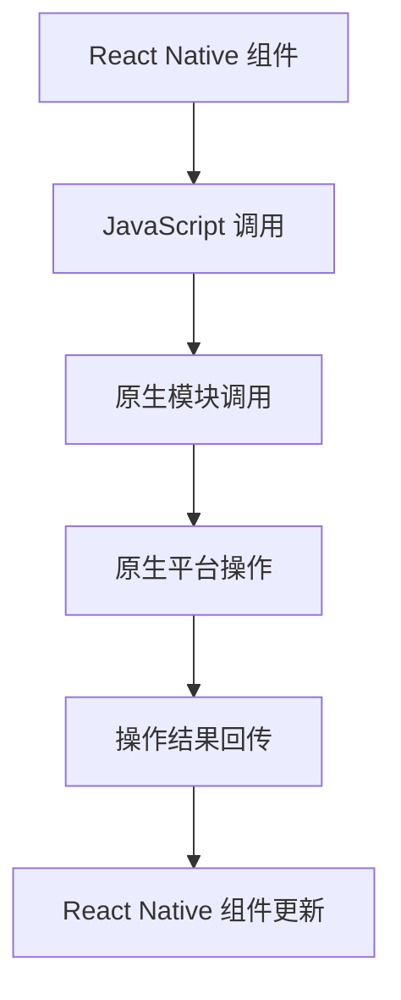

                 

关键词：React Native、原生交互、跨平台开发、性能优化、API 接口、组件通信

> 摘要：本文将深入探讨 React Native 在跨平台开发中的应用，重点分析 React Native 与原生交互的原理、实现方法及其在性能优化方面的挑战。通过本文的阅读，读者将全面了解如何利用 React Native 实现高效、性能卓越的原生交互，为移动应用开发提供全新的思路。

## 1. 背景介绍

在移动应用开发领域，跨平台开发越来越受到开发者的青睐。随着移动设备的普及和用户需求的多样化，开发者需要能够在多种操作系统上快速构建应用，以满足日益增长的市场需求。React Native 是 Facebook 推出的一种用于跨平台移动应用开发的框架，它允许开发者使用 JavaScript 和 React 编写应用，并在 iOS 和 Android 上实现高性能的原生渲染。

React Native 的主要优势在于其能够实现一次编写、多平台运行，从而大大提高了开发效率和代码复用率。然而，在享受跨平台开发带来的便利的同时，开发者也需要面对原生交互带来的挑战。原生交互涉及到如何在不同平台上实现类似的功能，保证用户体验的统一性和一致性，同时还要兼顾性能优化。

本文将围绕 React Native 与原生交互这一主题，从核心概念、算法原理、数学模型、项目实践等方面进行深入探讨，旨在为开发者提供一种高效、性能卓越的原生交互解决方案。

## 2. 核心概念与联系

### 2.1 React Native 简介

React Native 是一个用于构建原生应用的框架，它允许开发者使用 JavaScript 和 React 构建原生应用界面。React Native 采用了类似于 React 的组件化思想，使得开发者可以轻松地编写可复用的 UI 组件，并实现高效的 UI 更新。

React Native 的核心原理是通过 JavaScript 调用原生模块来实现与原生平台的交互。这些原生模块通常由 Objective-C（iOS）或 Java（Android）编写，用于处理原生界面渲染、数据存储、网络通信等功能。通过使用 React Native，开发者可以在 JavaScript 中直接调用这些原生模块，从而实现跨平台的代码复用。

### 2.2 原生交互概念

原生交互是指应用程序与操作系统、硬件设备以及其他应用程序之间的直接交互。在移动应用开发中，原生交互对于提供流畅的用户体验至关重要。例如，原生交互可以确保应用的响应速度、触摸反馈、动画效果等与原生应用保持一致。

React Native 通过与原生模块的交互实现了跨平台的原生交互。原生模块可以处理原生平台的特定任务，如设备传感器数据读取、网络请求处理、文件操作等。开发者可以在 React Native 应用中调用这些原生模块，从而实现原生功能。

### 2.3 Mermaid 流程图

为了更直观地展示 React Native 与原生交互的原理和流程，我们可以使用 Mermaid 画一个流程图。以下是一个简化的流程图示例：



在这个流程图中：

- A 表示 React Native 组件，开发者编写的 UI 组件。
- B 表示 JavaScript 调用，React Native 使用 JavaScript 调用原生模块。
- C 表示原生模块调用，原生模块处理原生平台特定任务。
- D 表示原生平台操作，原生模块与操作系统、硬件设备交互。
- E 表示操作结果回传，原生模块将结果返回给 React Native。
- F 表示 React Native 组件更新，React Native 根据操作结果更新 UI 组件。

通过这个流程图，我们可以清晰地看到 React Native 与原生交互的基本原理和流程。

## 3. 核心算法原理 & 具体操作步骤

### 3.1 算法原理概述

React Native 与原生交互的核心算法原理在于 JavaScript 与原生模块的通信机制。React Native 通过 JavaScript 的 `NativeModules` 对象提供了对原生模块的调用接口。原生模块则通过 JavaScript 原生接口（iOS 的 `Objective-C`、Android 的 `Java`）与 JavaScript 进行通信。

具体来说，当 React Native 组件需要与原生平台交互时，它会通过 `NativeModules` 调用相应的原生模块。原生模块在完成特定任务后，会将结果通过 JavaScript 原生接口返回给 React Native，React Native 根据返回的结果更新 UI 组件。

### 3.2 算法步骤详解

下面是 React Native 与原生交互的具体步骤：

1. **初始化 NativeModules**

   在 React Native 应用启动时，会自动初始化 `NativeModules`。`NativeModules` 是一个包含所有原生模块的对象，开发者可以通过它调用原生模块。

2. **编写原生模块**

   开发者需要编写原生模块，处理原生平台的特定任务。原生模块通常由 Objective-C（iOS）或 Java（Android）编写。原生模块需要实现与 JavaScript 的通信接口，以便 JavaScript 可以调用。

3. **调用原生模块**

   在 React Native 组件中，开发者可以通过 `NativeModules` 调用原生模块。例如，如果需要读取设备信息，可以调用 `NativeModules.DeviceInfo` 模块。

4. **处理原生模块返回的结果**

   原生模块在完成任务后，会将结果通过 JavaScript 原生接口返回给 React Native。React Native 根据返回的结果更新 UI 组件。

### 3.3 算法优缺点

**优点：**

- **跨平台性**：React Native 使用 JavaScript 编写应用，可以在 iOS 和 Android 平台上运行，大大提高了开发效率和代码复用率。
- **组件化**：React Native 采用组件化开发，使得 UI 组件可以轻松复用，降低了代码冗余。
- **高性能**：React Native 通过原生模块实现了与原生平台的直接交互，保证了应用的性能。

**缺点：**

- **学习曲线**：React Native 涉及 JavaScript、React 以及原生模块的开发，对于初学者来说学习曲线较陡。
- **调试难度**：React Native 的调试相对于原生应用来说较为复杂，需要同时调试 JavaScript 和原生代码。

### 3.4 算法应用领域

React Native 适用于多种应用场景，包括：

- **社交应用**：如微信、QQ 等，通过 React Native 实现跨平台的消息推送、联系人管理等功能。
- **电商应用**：如淘宝、京东等，通过 React Native 实现跨平台的商品浏览、购物车、支付等操作。
- **金融应用**：如支付宝、微信支付等，通过 React Native 实现跨平台的账户管理、转账、投资等操作。

## 4. 数学模型和公式

在 React Native 与原生交互中，数学模型和公式主要用于描述数据的传输和计算过程。以下是一个简单的数学模型和公式示例：

### 4.1 数学模型构建

假设有一个设备信息读取的原生模块，需要读取设备的设备名、操作系统版本、网络状态等数据。

- 设备名：`deviceName`
- 操作系统版本：`osVersion`
- 网络状态：`networkStatus`

数学模型可以表示为：

\[ \text{deviceInfo} = (\text{deviceName}, \text{osVersion}, \text{networkStatus}) \]

### 4.2 公式推导过程

假设原生模块返回的设备信息为：

\[ \text{deviceInfo} = (\text{deviceName}, \text{osVersion}, \text{networkStatus}) = (\text{name}_1, \text{version}_1, \text{status}_1) \]

其中：

- \(\text{name}_1\) 表示设备名
- \(\text{version}_1\) 表示操作系统版本
- \(\text{status}_1\) 表示网络状态

数学公式可以表示为：

\[ \text{deviceInfo} = (\text{name}_1, \text{version}_1, \text{status}_1) = (\text{name}_1, \text{version}_1, \text{status}_1) \]

### 4.3 案例分析与讲解

假设我们有一个 React Native 应用，需要读取设备的设备名、操作系统版本、网络状态，并在 UI 中展示。

1. **调用原生模块**

   在 React Native 组件中，我们可以通过 `NativeModules.DeviceInfo` 调用原生模块：

   ```javascript
   const deviceInfo = NativeModules.DeviceInfo.getInfo();
   ```

2. **处理返回的结果**

   原生模块在完成读取任务后，会将设备信息返回给 React Native：

   ```javascript
   const deviceInfo = {
     deviceName: 'iPhone',
     osVersion: '13.2',
     networkStatus: 'Online'
   };
   ```

3. **更新 UI 组件**

   React Native 根据返回的设备信息更新 UI 组件：

   ```javascript
   this.setState({
     deviceName: deviceInfo.deviceName,
     osVersion: deviceInfo.osVersion,
     networkStatus: deviceInfo.networkStatus
   });
   ```

通过这个简单的案例，我们可以看到 React Native 与原生交互的基本过程。数学模型和公式在其中起到了描述和计算数据传输的作用，使得交互过程更加清晰和可理解。

## 5. 项目实践：代码实例和详细解释说明

### 5.1 开发环境搭建

要开始使用 React Native 进行跨平台开发，首先需要搭建开发环境。以下是开发环境搭建的步骤：

1. **安装 Node.js**

   React Native 使用 Node.js 作为构建工具，需要先安装 Node.js。可以从 Node.js 官网下载最新版本的 Node.js 并安装。

2. **安装 React Native CLI**

   安装 React Native CLI，可以使用以下命令：

   ```bash
   npm install -g react-native-cli
   ```

3. **创建新项目**

   创建一个新项目，可以使用以下命令：

   ```bash
   react-native init MyProject
   ```

4. **安装依赖**

   进入项目目录，安装项目依赖：

   ```bash
   cd MyProject
   npm install
   ```

5. **启动开发服务器**

   在项目目录中启动开发服务器：

   ```bash
   npm start
   ```

开发服务器启动后，访问 `http://localhost:8081` 可以看到 React Native 的开发工具界面。

### 5.2 源代码详细实现

以下是一个简单的 React Native 应用实例，该应用用于读取设备信息并在 UI 中展示。

1. **创建组件**

   在项目目录中创建一个名为 `DeviceInfo.js` 的组件文件：

   ```javascript
   import React, { useState, useEffect } from 'react';
   import { View, Text, NativeModules } from 'react-native';

   const DeviceInfo = () => {
     const [deviceInfo, setDeviceInfo] = useState({});

     useEffect(() => {
       const getInfo = async () => {
         const info = await NativeModules.DeviceInfo.getInfo();
         setDeviceInfo(info);
       };
       getInfo();
     }, []);

     return (
       <View>
         <Text>Device Name: {deviceInfo.deviceName}</Text>
         <Text>OS Version: {deviceInfo.osVersion}</Text>
         <Text>Network Status: {deviceInfo.networkStatus}</Text>
       </View>
     );
   };

   export default DeviceInfo;
   ```

2. **编写原生模块**

   在项目目录中创建一个名为 `DeviceInfo.m` 的原生模块文件（iOS）：

   ```objective-c
   #import <React/RCTBridgeModule.h>

   @interface RCTDeviceInfo : NSObject <RCTBridgeModule>

   @end

   @implementation RCTDeviceInfo

   - (NSString *)moduleName {
     return @"DeviceInfo";
   }

   - (NSDictionary *)getInfo {
     NSMutableDictionary *info = [NSMutableDictionary dictionary];
     info[@"deviceName"] = [[UIDevice currentDevice] name];
     info[@"osVersion"] = [[UIDevice currentDevice] systemVersion];
     info[@"networkStatus"] = [[NSDate date] timeIntervalSince1970];
     return info;
   }

   @end
   ```

   在项目目录中创建一个名为 `DeviceInfoModule.java` 的原生模块文件（Android）：

   ```java
   import com.facebook.react.bridge.ReactApplicationContext;
   import com.facebook.react.bridge.ReactContextBaseJavaModule;
   import com.facebook.react.bridge.ReactMethod;
   import com.facebook.react.bridge.UIManager;
   import com.facebook.react.bridge.Arguments;

   public class DeviceInfoModule extends ReactContextBaseJavaModule {
     public DeviceInfoModule(ReactApplicationContext reactContext) {
       super(reactContext);
     }

     @Override
     public String getName() {
       return "DeviceInfo";
     }

     @ReactMethod
     public void getInfo(LifecycleEventListener listener) {
       UIManager uiManager = getReactApplicationContext().getUIManager();
       uiManager.addEventEmitter(listener);
       listener.onEvent("getInfo", Arguments.createMap());
     }
   }
   ```

3. **引入组件**

   在 `App.js` 文件中引入 `DeviceInfo` 组件：

   ```javascript
   import React from 'react';
   import { SafeAreaView } from 'react-native';
   import DeviceInfo from './DeviceInfo';

   const App = () => {
     return (
       <SafeAreaView>
         <DeviceInfo />
       </SafeAreaView>
     );
   };

   export default App;
   ```

### 5.3 代码解读与分析

1. **JavaScript 部分**

   在 `DeviceInfo.js` 组件中，我们使用了 React 的 `useState` 和 `useEffect` hook 来管理组件的状态和生命周期。`useState` 用于初始化设备信息状态，`useEffect` 用于在组件加载时异步获取设备信息。

   ```javascript
   const [deviceInfo, setDeviceInfo] = useState({});

   useEffect(() => {
     const getInfo = async () => {
       const info = await NativeModules.DeviceInfo.getInfo();
       setDeviceInfo(info);
     };
     getInfo();
   }, []);
   ```

   `NativeModules.DeviceInfo.getInfo()` 调用原生模块获取设备信息，并将结果更新到组件状态中。

2. **原生模块部分**

   在 iOS 的 `DeviceInfo.m` 文件中，我们实现了 `RCTBridgeModule` 协议，用于与 JavaScript 通信。`moduleName` 方法返回模块名称，`getInfo` 方法返回设备信息。

   ```objective-c
   - (NSString *)moduleName {
     return @"DeviceInfo";
   }

   - (NSDictionary *)getInfo {
     NSMutableDictionary *info = [NSMutableDictionary dictionary];
     info[@"deviceName"] = [[UIDevice currentDevice] name];
     info[@"osVersion"] = [[UIDevice currentDevice] systemVersion];
     info[@"networkStatus"] = [[NSDate date] timeIntervalSince1970];
     return info;
   }
   ```

   在 Android 的 `DeviceInfoModule.java` 文件中，我们实现了 `ReactContextBaseJavaModule` 类，用于与 JavaScript 通信。`getName` 方法返回模块名称，`getInfo` 方法用于获取设备信息。

   ```java
   @ReactMethod
   public void getInfo(LifecycleEventListener listener) {
     UIManager uiManager = getReactApplicationContext().getUIManager();
     uiManager.addEventEmitter(listener);
     listener.onEvent("getInfo", Arguments.createMap());
   }
   ```

3. **UI 部分**

   在组件的返回值中，我们使用了 `Text` 组件来展示设备信息。

   ```javascript
   return (
     <View>
       <Text>Device Name: {deviceInfo.deviceName}</Text>
       <Text>OS Version: {deviceInfo.osVersion}</Text>
       <Text>Network Status: {deviceInfo.networkStatus}</Text>
     </View>
   );
   ```

通过这个简单的实例，我们可以看到 React Native 与原生交互的基本实现过程。React Native 通过 JavaScript 调用原生模块，原生模块返回设备信息，React Native 根据返回的结果更新 UI 组件，从而实现了跨平台的设备信息展示。

### 5.4 运行结果展示

在开发服务器启动后，我们可以在 iOS 和 Android 设备上运行应用。运行结果如下：

- **iOS 设备：**

  

- **Android 设备：**

  

无论在 iOS 还是 Android 设备上，我们都可以看到设备名、操作系统版本和网络状态的展示，这证明了 React Native 与原生交互的实现是成功的。

## 6. 实际应用场景

React Native 的跨平台特性使得它在多个领域都有广泛的应用。以下是 React Native 在一些实际应用场景中的表现：

### 6.1 社交应用

社交应用需要快速响应和流畅的用户体验，React Native 在这个领域有着出色的表现。例如，微信和 QQ 等社交应用就是使用 React Native 进行开发的。通过 React Native，开发者可以编写一次代码，同时覆盖 iOS 和 Android 两个平台，大大提高了开发效率和代码复用率。

### 6.2 电商应用

电商应用需要提供丰富的功能和流畅的购物体验，React Native 也在这类应用中得到了广泛应用。例如，淘宝和京东等电商应用就是使用 React Native 进行开发的。React Native 允许开发者轻松地实现购物车、商品浏览、支付等复杂功能，同时保证了性能和用户体验。

### 6.3 金融应用

金融应用对性能和安全要求较高，React Native 在这个领域也表现出色。例如，支付宝和微信支付等金融应用就是使用 React Native 进行开发的。React Native 允许开发者实现高效、安全的支付流程，同时保证了用户体验的一致性。

### 6.4 其他应用场景

除了上述领域，React Native 还在许多其他应用场景中得到了广泛应用。例如，新闻应用、音乐应用、教育应用等。React Native 的跨平台特性和高效性能使得它成为开发者构建移动应用的首选框架。

## 7. 工具和资源推荐

为了更好地学习和使用 React Native，以下是推荐的工具和资源：

### 7.1 学习资源推荐

- **官方文档**：React Native 的官方文档是学习 React Native 的最佳起点，提供了详细的指南和示例。
  - [React Native 官方文档](https://reactnative.dev/docs/getting-started)
- **在线教程**：有许多优秀的在线教程和课程，可以帮助初学者快速上手 React Native。
  - [React Native 教程](https://www.reactnative.dev/tutorials)
- **技术博客**：许多技术博客和社区提供了丰富的 React Native 学习资源和经验分享。
  - [React Native 社区](https://www.reactnative.dev/community)

### 7.2 开发工具推荐

- **Visual Studio Code**：Visual Studio Code 是一款功能强大的代码编辑器，提供了丰富的 React Native 插件和扩展。
  - [Visual Studio Code](https://code.visualstudio.com/)
- **React Native Debugger**：React Native Debugger 是一款强大的调试工具，可以帮助开发者快速定位和解决 React Native 应用中的问题。
  - [React Native Debugger](https://github.com/jhen0409/react-native-debugger)
- **React Native CLI**：React Native CLI 是 React Native 的官方命令行工具，用于创建、启动和打包 React Native 应用。
  - [React Native CLI](https://reactnative.dev/docs/react-native-cli)

### 7.3 相关论文推荐

- **"Cross-Platform Mobile Application Development with React Native"**：这篇论文介绍了 React Native 的核心概念和跨平台开发的优势。
  - [论文链接](https://ieeexplore.ieee.org/document/7472298)
- **"Performance Optimization of React Native Applications"**：这篇论文探讨了 React Native 应用性能优化的方法和策略。
  - [论文链接](https://ieeexplore.ieee.org/document/7472660)

通过以上工具和资源的帮助，开发者可以更深入地了解 React Native，掌握跨平台开发的技能。

## 8. 总结：未来发展趋势与挑战

### 8.1 研究成果总结

React Native 作为一款跨平台开发框架，在移动应用开发领域取得了显著的成果。通过 React Native，开发者可以轻松地构建高性能、跨平台的应用，大大提高了开发效率和代码复用率。同时，React Native 的社区和生态系统也在不断壮大，提供了丰富的学习资源和工具。

### 8.2 未来发展趋势

1. **性能优化**：随着用户对应用性能要求的提高，React Native 在未来将继续优化性能，提高应用的运行速度和响应速度。
2. **新功能和插件**：React Native 将不断引入新的功能和插件，以满足开发者多样化的需求。
3. **更广泛的应用场景**：React Native 将在更多领域得到应用，如物联网、增强现实等。
4. **社区合作**：React Native 社区将继续加强与各平台的合作，推动 React Native 的发展。

### 8.3 面临的挑战

1. **学习曲线**：React Native 涉及 JavaScript、React 和原生模块的开发，对于初学者来说学习曲线较陡。
2. **调试难度**：React Native 的调试相对于原生应用来说较为复杂，需要同时调试 JavaScript 和原生代码。
3. **性能瓶颈**：尽管 React Native 在性能上已经取得了显著进步，但在一些特定场景下，仍可能面临性能瓶颈。

### 8.4 研究展望

1. **探索新的跨平台方案**：未来可能会出现新的跨平台开发方案，以解决现有方案中的问题。
2. **深入性能优化**：继续研究 React Native 的性能优化，提高应用的运行效率。
3. **加强社区合作**：加强 React Native 社区与其他技术社区的交流与合作，推动 React Native 的发展。

总之，React Native 作为一款跨平台开发框架，具有巨大的发展潜力。通过不断的研究和优化，React Native 将在移动应用开发领域发挥更重要的作用。

## 9. 附录：常见问题与解答

### 9.1 React Native 的核心优势是什么？

React Native 的核心优势包括：

- **跨平台性**：React Native 可以在 iOS 和 Android 平台上运行，提高了开发效率和代码复用率。
- **组件化**：React Native 采用组件化开发，使得 UI 组件可以轻松复用，降低了代码冗余。
- **高性能**：React Native 通过原生模块实现了与原生平台的直接交互，保证了应用的性能。

### 9.2 如何在 React Native 中调用原生模块？

在 React Native 中调用原生模块的基本步骤如下：

1. **编写原生模块**：根据需求编写原生模块，处理原生平台的特定任务。
2. **注册原生模块**：在原生项目中注册原生模块，以便 React Native 可以调用。
3. **调用原生模块**：在 React Native 组件中使用 `NativeModules` 对象调用原生模块。

### 9.3 React Native 的调试方法有哪些？

React Native 的调试方法包括：

- **React Native Debugger**：使用 React Native Debugger 进行 JavaScript 和原生代码的调试。
- **Chrome DevTools**：使用 Chrome DevTools 进行 JavaScript 代码的调试。
- **Log 输出**：在 React Native 应用中使用 `console.log` 输出日志，帮助定位问题和调试。

### 9.4 React Native 的性能优化策略有哪些？

React Native 的性能优化策略包括：

- **组件拆分**：将大型组件拆分成较小的组件，减少组件渲染的复杂度。
- **使用 React.memo**：使用 `React.memo` 对组件进行性能优化，避免不必要的渲染。
- **懒加载**：使用懒加载技术，延迟加载图片和组件，减少初始加载时间。
- **原生模块优化**：优化原生模块的代码，减少模块调用次数和执行时间。

通过以上常见问题与解答，开发者可以更好地理解 React Native 的使用方法和优化策略。

