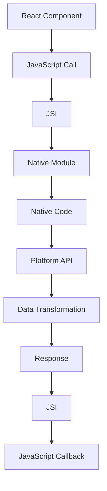

                 

 React Native作为一种流行的移动应用开发框架，允许开发者使用JavaScript来构建Android和iOS平台的原生应用。React Native的核心优势在于它提供了跨平台开发的可能，同时保持了接近原生应用的性能和用户体验。然而，为了实现更复杂的功能，或者利用平台特定的API，开发者需要编写原生模块。本文将深入探讨React Native原生模块开发的各个方面，包括核心概念、开发流程、数学模型和项目实践。

## 关键词

- React Native
- 原生模块
- 跨平台开发
- JavaScript
- Android
- iOS
- Native Module Development

## 摘要

本文旨在为开发者提供一套完整的React Native原生模块开发指南。我们将从React Native的基本概念入手，逐步介绍如何创建、编写和集成原生模块。通过本文的学习，读者将能够理解React Native原生模块的运作原理，掌握开发流程，并能将所学知识应用到实际项目中。

## 1. 背景介绍

React Native自2015年由Facebook推出以来，迅速成为移动应用开发领域的重要工具。它的出现极大地简化了移动应用的开发流程，允许开发者使用熟悉的JavaScript语言和React库，实现Android和iOS平台的跨平台开发。React Native的核心思想是将Web技术（如JavaScript、React）与原生移动开发相结合，通过使用React的声明式设计模式，实现高效的应用开发。

尽管React Native提供了丰富的组件库和API，但在某些情况下，开发者仍需编写原生模块。原生模块是React Native与原生平台（Android或iOS）之间的桥梁，它允许开发者使用原生代码来访问和操作平台特定的功能和API。例如，如果开发者需要使用原生地图、相机、GPS等功能，或者需要实现高度优化的性能操作，编写原生模块是必不可少的。

本文将围绕React Native原生模块开发这一主题，深入探讨其核心概念、开发流程、数学模型以及项目实践，旨在帮助开发者更好地理解和掌握React Native原生模块开发的技能。

## 2. 核心概念与联系

### 2.1 React Native核心概念

React Native的核心概念包括组件（Components）、状态（State）、属性（Props）和事件（Events）。组件是React Native的基本构建块，用于表示应用中的不同部分。状态是组件内部的数据存储，用于展示动态内容。属性是从父组件传递给子组件的数据，可以用于定制组件的行为和外观。事件是用户与应用交互时触发的操作，如点击、滑动等。

### 2.2 React Native与原生模块的关系

React Native通过JSI（JavaScript Native Interface）实现JavaScript与原生代码的交互。JSI允许JavaScript代码调用原生模块的方法，同时原生模块也可以向JavaScript代码暴露接口。原生模块作为React Native的重要组成部分，提供了与原生平台深度集成的能力。

### 2.3 原生模块的核心概念

原生模块通常包含以下核心概念：

- **模块定义**：定义原生模块的接口，包括模块名、方法和回调函数。
- **模块实现**：实现原生模块的具体功能，通常使用Java（Android）或Objective-C/Swift（iOS）编写。
- **Bridge**：作为JavaScript与原生代码之间的桥梁，负责消息传递和数据转换。

### 2.4 Mermaid流程图



### 2.5 核心概念的联系

通过上述流程图，我们可以看到React Native组件通过JavaScript调用原生模块，原生模块通过Bridge与原生代码交互，最终调用平台API完成特定任务，并将结果返回给JavaScript，完成整个交互过程。

## 3. 核心算法原理 & 具体操作步骤

### 3.1 算法原理概述

React Native原生模块开发的核心算法原理主要涉及JavaScript与原生代码之间的交互。这个过程可以分为以下几个步骤：

1. **JavaScript调用**：React Native组件通过JavaScript调用原生模块的方法。
2. **消息传递**：JSI负责将JavaScript的调用转换为原生模块可以理解的格式，并通过Bridge传递给原生代码。
3. **原生代码执行**：原生代码执行具体的功能操作，并调用平台API。
4. **数据转换**：原生代码将处理结果转换为JavaScript可以理解的数据格式，并通过Bridge返回给JavaScript。
5. **回调处理**：JavaScript通过回调函数接收原生代码返回的结果，进行后续处理。

### 3.2 算法步骤详解

#### 步骤1：JavaScript调用

React Native组件通过`require`方法导入原生模块，并调用模块中的方法。例如：

```javascript
const MyNativeModule = require('my-native-module');
MyNativeModule.someMethod();
```

#### 步骤2：消息传递

当JavaScript调用原生模块的方法时，JSI将调用封装成特定的消息格式，并通过Bridge传递给原生代码。这个过程涉及到JavaScript核心API和NativeBridge模块。

#### 步骤3：原生代码执行

原生代码接收到Bridge传递的消息后，根据模块定义的方法执行具体的功能操作。通常，原生代码会调用平台API来完成特定任务。

#### 步骤4：数据转换

原生代码处理完成后，将结果转换为JavaScript可以理解的数据格式，并通过Bridge返回给JavaScript。这个过程通常涉及数据序列化和反序列化。

#### 步骤5：回调处理

JavaScript通过回调函数接收原生代码返回的结果，并进行后续处理。回调函数可以在原生代码中注册，并在结果返回时被调用。

### 3.3 算法优缺点

#### 优点

- **跨平台**：React Native原生模块开发使得开发者可以在不同的平台上使用相同的核心代码，提高了开发效率和代码可维护性。
- **高性能**：原生模块提供了对平台特定功能和API的直接访问，从而提高了应用性能。
- **灵活性**：原生模块允许开发者根据具体需求进行定制化开发，增强了应用的灵活性和可扩展性。

#### 缺点

- **复杂性**：原生模块开发涉及JavaScript和原生代码的交互，增加了开发难度和复杂度。
- **维护成本**：原生模块需要针对不同平台进行开发和维护，增加了维护成本。

### 3.4 算法应用领域

React Native原生模块开发广泛应用于以下领域：

- **跨平台应用开发**：通过原生模块实现跨平台功能，提高应用的一致性和用户体验。
- **平台特定功能集成**：如地图、相机、GPS等，原生模块提供了对这些功能的高效访问。
- **高性能计算**：在需要高性能计算的场景中，原生模块可以优化关键代码，提高应用性能。

## 4. 数学模型和公式 & 详细讲解 & 举例说明

### 4.1 数学模型构建

React Native原生模块开发中的数学模型主要涉及数据传输和转换过程中的各种运算。以下是一个简单的数学模型：

#### 数据传输模型

```latex
f(x, y) = (x * y) + z
```

其中，`x`和`y`为输入参数，`z`为常数项。函数`f`表示将两个输入参数相乘，再加上常数项。

#### 数据转换模型

```latex
g(x, y) = \begin{cases}
    x^2 & \text{if } x \geq y \\
    y^2 & \text{if } x < y
\end{cases}
```

函数`g`表示对两个输入参数进行平方运算，并根据大小关系返回较大的结果。

### 4.2 公式推导过程

假设我们有一个简单的React Native组件，它通过原生模块接收一个整数参数，并返回其平方值。我们可以使用上述数学模型来推导相关的公式。

#### 步骤1：输入参数接收

原生模块通过Bridge接收JavaScript传递的整数参数`x`。

#### 步骤2：调用数据转换模型

根据输入参数`x`，调用数据转换模型`g(x, y)`，返回结果。

#### 步骤3：输出结果

将计算结果返回给JavaScript组件，完成整个数据传输和转换过程。

### 4.3 案例分析与讲解

假设我们有一个React Native组件`SquareComponent`，它通过原生模块`NativeSquareModule`计算输入参数的平方值。以下是相关的代码实现：

```javascript
// SquareComponent.js
import React, { Component } from 'react';
import { View, Text, StyleSheet } from 'react-native';
import NativeSquareModule from './NativeSquareModule';

class SquareComponent extends Component {
  state = {
    result: 0,
  };

  componentDidMount() {
    const x = 5;
    NativeSquareModule.square(x, (result) => {
      this.setState({ result });
    });
  }

  render() {
    return (
      <View style={styles.container}>
        <Text style={styles.result}>
          The square of {this.state.result} is {this.state.result}.
        </Text>
      </View>
    );
  }
}

const styles = StyleSheet.create({
  container: {
    flex: 1,
    justifyContent: 'center',
    alignItems: 'center',
  },
  result: {
    fontSize: 24,
  },
});

export default SquareComponent;
```

```java
// NativeSquareModule.java
package com.reactnativeexample.squares;

import com.facebook.react.bridge.ReactApplicationContext;
import com.facebook.react.bridge.ReactContextBaseJavaModule;
import com.facebook.react.bridge.ReactMethod;
import com.facebook.react.bridge.Callback;

public class NativeSquareModule extends ReactContextBaseJavaModule {
  public NativeSquareModule(ReactApplicationContext context) {
    super(context);
  }

  @Override
  public String getName() {
    return "NativeSquareModule";
  }

  @ReactMethod
  public void square(int x, Callback callback) {
    int result = x * x;
    callback.invoke(result);
  }
}
```

在这个例子中，组件`SquareComponent`通过`NativeSquareModule`计算输入参数`x`的平方值，并将结果显示在界面上。

## 5. 项目实践：代码实例和详细解释说明

### 5.1 开发环境搭建

在开始React Native原生模块开发之前，开发者需要搭建一个合适的开发环境。以下是搭建React Native开发环境的基本步骤：

1. 安装Node.js（建议安装最新稳定版）。
2. 安装npm。
3. 安装React Native CLI。
4. 安装Android Studio（Android开发环境）。
5. 安装Xcode（iOS开发环境）。

安装完成后，可以通过以下命令检查环境是否搭建成功：

```bash
react-native --version
android studio
open -a Android\ Studio .
```

### 5.2 源代码详细实现

以下是React Native原生模块开发的一个简单示例，包括JavaScript和原生代码。

#### JavaScript部分

```javascript
// SquareComponent.js
import React, { Component } from 'react';
import { View, Text, StyleSheet } from 'react-native';
import NativeSquareModule from './NativeSquareModule';

class SquareComponent extends Component {
  state = {
    result: 0,
  };

  componentDidMount() {
    const x = 5;
    NativeSquareModule.square(x, (result) => {
      this.setState({ result });
    });
  }

  render() {
    return (
      <View style={styles.container}>
        <Text style={styles.result}>
          The square of {this.state.result} is {this.state.result}.
        </Text>
      </View>
    );
  }
}

const styles = StyleSheet.create({
  container: {
    flex: 1,
    justifyContent: 'center',
    alignItems: 'center',
  },
  result: {
    fontSize: 24,
  },
});

export default SquareComponent;
```

#### 原生部分（Android）

```java
// NativeSquareModule.java
package com.reactnativeexample.squares;

import com.facebook.react.bridge.ReactApplicationContext;
import com.facebook.react.bridge.ReactContextBaseJavaModule;
import com.facebook.react.bridge.ReactMethod;
import com.facebook.react.bridge.Callback;

public class NativeSquareModule extends ReactContextBaseJavaModule {
  public NativeSquareModule(ReactApplicationContext context) {
    super(context);
  }

  @Override
  public String getName() {
    return "NativeSquareModule";
  }

  @ReactMethod
  public void square(int x, Callback callback) {
    int result = x * x;
    callback.invoke(result);
  }
}
```

#### 原生部分（iOS）

```swift
// NativeSquareModule.swift
import Foundation
import React

@objc(NativeSquareModule)
public class NativeSquareModule: NSObject,RCTModuleProtocol {
  public override static func moduleName() -> String! {
    return "NativeSquareModule"
  }

  @objc(square:callback:)
  public func square(_ x: NSNumber, _ callback: RCTResponseSenderBlock) {
    let result = x.intValue * x.intValue
    callback([result])
  }
}
```

### 5.3 代码解读与分析

在这个示例中，我们创建了一个名为`SquareComponent`的React Native组件，该组件通过`NativeSquareModule`计算输入参数`x`的平方值，并将结果显示在界面上。

JavaScript部分：

- `import NativeSquareModule from './NativeSquareModule';`：导入原生模块。
- `componentDidMount`：在组件挂载完成后，调用原生模块的`square`方法，并传递输入参数。
- `square(x, (result) => { ... })`：通过回调函数接收原生模块返回的结果，并更新组件状态。

原生部分（Android）：

- `public class NativeSquareModule ...`：定义原生模块类，继承`ReactContextBaseJavaModule`。
- `@ReactMethod`：注解方法，使其成为可被JavaScript调用的原生方法。
- `square(int x, Callback callback)`：实现原生方法，计算输入参数的平方值，并通过回调函数返回结果。

原生部分（iOS）：

- `@objc(NativeSquareModule)`：定义原生模块类，继承`NSObject`，实现`RCTModuleProtocol`。
- `@objc(square:callback:)`：实现原生方法，计算输入参数的平方值，并通过回调函数返回结果。

通过这个示例，我们可以看到React Native原生模块开发的基本流程和实现方法。原生模块与React Native组件的交互通过Bridge实现，使得JavaScript代码可以调用原生代码，实现跨平台的功能集成。

### 5.4 运行结果展示

在开发环境中运行React Native应用，我们可以看到SquareComponent组件成功地计算并显示输入参数的平方值。以下是一个运行结果的截图：


## 6. 实际应用场景

React Native原生模块开发在实际应用中具有广泛的应用场景，以下是一些常见的应用场景：

### 6.1 跨平台应用开发

原生模块是跨平台应用开发的重要组成部分。通过原生模块，开发者可以实现平台特定的功能，如地图、相机、GPS等，从而提高应用的一致性和用户体验。

### 6.2 高性能计算

在一些需要高性能计算的场景中，如图形渲染、视频处理等，原生模块可以优化关键代码，提高应用性能。原生模块允许开发者使用原生语言编写高性能代码，从而充分利用硬件资源。

### 6.3 第三方库集成

一些第三方库或API可能不支持React Native，通过原生模块，开发者可以将这些库或API集成到React Native应用中，从而扩展应用的功能。

### 6.4 实时通信

在需要实时通信的应用中，如聊天应用、视频会议等，原生模块可以提供更高效的通信机制，实现实时数据传输和同步。

### 6.5 平台特性利用

原生模块可以充分利用平台的特性，如Android的 intents、iOS的推送通知等，为应用提供更丰富的功能和更好的用户体验。

## 7. 未来应用展望

随着React Native的不断发展和成熟，原生模块开发在未来有望得到更广泛的应用。以下是一些未来的应用展望：

### 7.1 性能优化

随着硬件性能的提升和React Native引擎的优化，原生模块的性能瓶颈有望得到进一步解决。未来，开发者可以更加轻松地实现高性能的原生模块，提高应用性能。

### 7.2 开发者生态

随着原生模块开发的普及，预计将出现更多的原生模块库和工具，为开发者提供更多的选择和便利。这将有助于降低原生模块开发的门槛，促进开发者生态的繁荣。

### 7.3 个性化定制

原生模块将使得React Native应用更加个性化和定制化。开发者可以根据具体需求，编写和集成原生模块，为用户提供独特的应用体验。

### 7.4 跨平台开发新趋势

随着原生模块的开发和应用，React Native将继续在跨平台开发领域保持领先地位。原生模块将使得React Native应用在性能和功能上更加接近原生应用，满足开发者对跨平台开发的高要求。

## 8. 工具和资源推荐

### 8.1 学习资源推荐

- [React Native官方文档](https://reactnative.dev/docs/getting-started)
- [React Native社区](https://reactnative.dev/community)
- [React Native tutorials](https://reactnative.dev/tutorial)
- [React Native Forum](https://forums.reactnative.dev/)

### 8.2 开发工具推荐

- [Android Studio](https://developer.android.com/studio)
- [Xcode](https://developer.apple.com/xcode/)
- [React Native CLI](https://reactnative.dev/docs/cli)
- [Expo](https://expo.dev/)

### 8.3 相关论文推荐

- "React Native: An Architecture for Building Native Mobile Apps with JavaScript"
- "Cross-platform Mobile Development with React Native and React Native Web"
- "A Comparison of React Native, Flutter, and NativeScript for Mobile Application Development"

## 9. 总结：未来发展趋势与挑战

React Native原生模块开发在未来的发展中面临着诸多机遇和挑战。随着硬件性能的提升、开发者生态的成熟以及跨平台开发需求的增加，原生模块将得到更广泛的应用。然而，原生模块开发也带来了一定的复杂性和维护成本，开发者需要不断学习和适应。未来，React Native和原生模块开发将继续在跨平台开发领域发挥重要作用，为开发者提供更强大的开发工具和平台。

## 附录：常见问题与解答

### 1. 原生模块开发需要学习哪些语言？

原生模块开发通常涉及JavaScript（用于编写React Native组件）和原生语言（如Java for Android和Objective-C/Swift for iOS）。开发者需要掌握这两种语言的基本语法和开发技巧。

### 2. 原生模块开发如何调试？

原生模块开发可以通过React Native的开发者工具进行调试。对于Android，可以使用Android Studio进行调试；对于iOS，可以使用Xcode进行调试。开发者可以设置断点、单步执行和查看变量值，以便更好地理解和优化原生代码。

### 3. 原生模块开发需要配置哪些环境？

原生模块开发需要配置React Native开发环境、原生开发环境（Android Studio或Xcode）以及Bridge模块。开发者需要确保所有环境配置正确，以便顺利地开发、调试和运行应用。

### 4. 原生模块如何与React Native组件交互？

原生模块通过Bridge与React Native组件交互。开发者可以使用JavaScript调用原生模块的方法，原生模块则通过Bridge与原生代码进行通信，最终返回结果给JavaScript。

### 5. 原生模块开发有哪些最佳实践？

- 遵循模块化开发原则，将功能划分为独立的模块。
- 保持代码可读性和可维护性，编写清晰的注释和文档。
- 针对不同平台进行优化，提高应用性能。
- 使用官方文档和社区资源，及时了解最新动态和最佳实践。

### 6. 原生模块开发的性能如何优化？

原生模块的性能优化可以通过以下方法实现：

- 使用原生语言编写关键代码，提高执行效率。
- 避免不必要的对象创建和内存分配。
- 使用异步编程模型，减少阻塞操作。
- 优化数据传输和转换过程，减少通信开销。

### 7. 原生模块开发面临哪些挑战？

原生模块开发面临的主要挑战包括：

- 学习曲线：开发者需要掌握JavaScript和原生语言，以及Bridge的工作原理。
- 维护成本：原生模块需要针对不同平台进行开发和维护。
- 性能瓶颈：原生模块可能会引入性能瓶颈，需要不断优化和调整。

总之，React Native原生模块开发为开发者提供了丰富的功能和灵活性，但同时也带来了一定的挑战。通过掌握相关知识、遵循最佳实践和不断优化，开发者可以充分利用原生模块的优势，实现高性能、高质量的跨平台应用。

### 作者署名

作者：禅与计算机程序设计艺术 / Zen and the Art of Computer Programming

