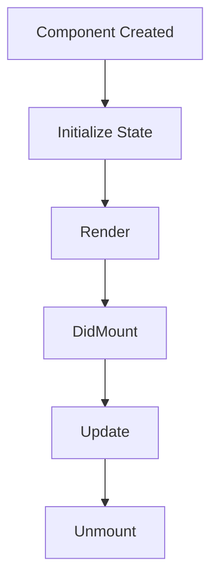

                 

React Native 是一种流行的跨平台移动应用开发框架，它允许开发者使用 JavaScript 和 React 编写应用程序，并在 iOS 和 Android 平台上运行。尽管 React Native 提供了许多便利和灵活性，但其性能调优仍然是一个复杂且挑战性的任务。本文将深入探讨 React Native 的性能调优策略，包括核心概念、算法原理、数学模型、项目实践和实际应用场景，并展望未来的发展趋势和挑战。

## 文章关键词

- React Native
- 性能调优
- JavaScript
- 跨平台开发
- 响应式设计
- 性能分析工具

## 文章摘要

本文首先介绍了 React Native 的背景和核心概念，然后探讨了性能调优的核心算法原理和具体操作步骤。接着，我们通过数学模型和公式详细讲解了性能调优的关键环节，并给出了案例分析与讲解。在项目实践部分，我们提供了一个代码实例，详细解读了实现过程和运行结果。最后，我们探讨了 React Native 在实际应用场景中的表现，以及未来可能的发展趋势和面临的挑战。

## 1. 背景介绍

React Native 由 Facebook 开发，旨在解决原生应用开发中的重复劳动和资源浪费问题。它通过使用 JavaScript 和 React 的组合，实现了在 iOS 和 Android 平台上使用同一代码库开发应用程序的目标。React Native 的核心优势在于：

1. **跨平台兼容性**：React Native 允许开发者使用 JavaScript 编写应用程序，并在多个平台上运行，从而减少了开发成本和时间。
2. **丰富的组件库**：React Native 提供了一系列可复用的 UI 组件，使得开发者可以快速构建高质量的应用程序。
3. **实时更新**：React Native 的热更新功能使得开发者可以在不需要重新编译和安装应用程序的情况下，实时更新应用程序的功能和界面。

然而，React Native 的性能调优问题也随之而来。由于其运行在 JavaScript 引擎上，React Native 应用程序的性能受到多种因素的影响，如内存占用、渲染性能、事件处理等。因此，性能调优成为了开发者在使用 React Native 时必须面对的挑战。

### 1.1 React Native 的工作原理

React Native 的核心思想是将 React 的组件模型应用到原生应用开发中。React Native 通过一系列桥接层（bridge）与原生代码进行交互，这些桥接层允许 JavaScript 代码调用原生模块，同时原生模块也可以向 JavaScript 代码发送事件。


React Native 的架构包括以下几个关键部分：

1. **JavaScriptCore（iOS） / V8（Android）**：这是 React Native 的 JavaScript 引擎，负责执行 JavaScript 代码。
2. **React Native 核心库**：提供了一组用于构建 UI 的 React 组件，这些组件通过原生桥接层与原生代码进行通信。
3. **原生模块**：原生模块是由原生代码编写的，用于实现特定的功能，如网络请求、图像处理、定位等。
4. **原生渲染引擎**：如 iOS 的 UIKit 和 Android 的 AndroidX，负责 UI 的绘制和布局。

### 1.2 React Native 的性能瓶颈

React Native 的性能瓶颈主要表现在以下几个方面：

1. **JavaScript 引擎性能**：由于 React Native 应用程序运行在 JavaScript 引擎上，JavaScript 的性能直接影响到应用程序的整体性能。
2. **原生桥接开销**：JavaScript 与原生代码之间的交互需要通过原生桥接层进行，这个过程中涉及到线程切换和数据传输，增加了性能开销。
3. **渲染性能**：React Native 的渲染性能受到组件复杂度、渲染频率和视图层级结构的影响。
4. **内存占用**：过多的组件实例化和大量 DOM 操作会导致内存占用增加，影响应用程序的稳定性和性能。

## 2. 核心概念与联系

在深入探讨 React Native 的性能调优之前，我们首先需要理解一些核心概念和它们之间的联系。

### 2.1 React Native 组件生命周期

React Native 组件的生命周期包括以下关键阶段：

1. **构造函数（constructor）**：初始化组件的状态和属性。
2. **render 方法**：渲染组件的 UI。
3. **componentDidMount**：组件挂载后执行，可用于初始化数据和绑定事件处理函数。
4. **componentDidUpdate**：组件更新后执行，用于处理状态和属性的变化。
5. **componentWillUnmount**：组件卸载前执行，用于清理资源和事件处理函数。


### 2.2 响应式设计

响应式设计是 React Native 的核心思想之一，它通过虚拟 DOM 实现高效的 UI 更新。当组件的状态或属性发生变化时，React Native 会通过 diff 算法比较虚拟 DOM 和真实 DOM 的差异，并只更新变化的部分，从而减少渲染开销。

### 2.3 渲染性能优化

渲染性能优化是提高 React Native 应用性能的关键。以下是一些优化策略：

1. **避免过多的组件嵌套**：过多的嵌套会增加渲染的开销。
2. **减少组件实例化**：通过使用 React.memo 或 shouldComponentUpdate 方法避免不必要的组件渲染。
3. **使用原生组件**：在某些情况下，使用原生组件（如 React Native 组件的 `NativeBase` 库）可以提供更好的性能。
4. **减少 DOM 操作**：过多的 DOM 操作会增加内存占用和渲染时间。

### 2.4 内存管理

内存管理是 React Native 性能调优的重要方面。以下是一些内存管理策略：

1. **避免内存泄漏**：定期检查并清理不再使用的资源和对象。
2. **使用 React Native 的 `React.memo` 高阶组件**：通过比较 props 和 state 的变化来减少不必要的组件渲染。
3. **使用 `FlatList` 或 `SectionList` 替代 `ScrollView`**：`FlatList` 和 `SectionList` 提供了更好的性能和内存管理。
4. **优化图像资源**：使用 WebP 或其他高效的图像格式，并使用 `Image` 组件的 `resizeMode` 属性优化图像的渲染。

### 2.5 Mermaid 流程图

以下是一个简化的 React Native 组件渲染流程的 Mermaid 流程图：



### 2.6 JavaScript 性能优化

JavaScript 性能优化包括以下几个方面：

1. **使用异步操作**：避免阻塞主线程，使用 `async/await` 或 `Promise` 进行异步操作。
2. **减少全局变量和闭包**：全局变量和闭包会增加内存占用和性能开销。
3. **使用原生模块**：在需要高性能操作的场合，使用原生模块可以提供更好的性能。
4. **优化循环和递归**：避免不必要的循环和递归操作，使用高效的数据结构和算法。

## 3. 核心算法原理 & 具体操作步骤

### 3.1 算法原理概述

React Native 的性能调优主要依赖于以下几个方面：

1. **渲染优化**：通过减少组件渲染次数、优化渲染流程和减少渲染开销来提高性能。
2. **内存管理**：通过避免内存泄漏、减少内存占用和优化数据结构来提高性能。
3. **JavaScript 性能优化**：通过异步操作、减少全局变量和闭包、优化循环和递归等手段来提高性能。

### 3.2 算法步骤详解

#### 3.2.1 渲染优化

1. **避免组件嵌套过深**：减少组件的嵌套层次，避免过深的组件嵌套。
2. **使用 React.memo**：使用 React.memo 高阶组件来避免不必要的组件渲染。
3. **优化列表组件**：使用 `FlatList` 或 `SectionList` 替代 `ScrollView`，提高列表组件的渲染性能。
4. **减少 DOM 操作**：避免使用复杂的 DOM 操作，如嵌套的列表和大量的动态样式。

#### 3.2.2 内存管理

1. **避免内存泄漏**：定期检查并清理不再使用的资源和对象。
2. **使用 React.memo**：通过比较 props 和 state 的变化来减少不必要的组件渲染。
3. **优化数据结构**：使用高效的数据结构和算法来减少内存占用。
4. **优化图像资源**：使用 WebP 或其他高效的图像格式，并使用 `Image` 组件的 `resizeMode` 属性优化图像的渲染。

#### 3.2.3 JavaScript 性能优化

1. **使用异步操作**：避免阻塞主线程，使用 `async/await` 或 `Promise` 进行异步操作。
2. **减少全局变量和闭包**：避免全局变量和闭包的使用，减少内存占用和性能开销。
3. **使用原生模块**：在需要高性能操作的场合，使用原生模块可以提供更好的性能。
4. **优化循环和递归**：避免不必要的循环和递归操作，使用高效的数据结构和算法。

### 3.3 算法优缺点

#### 优点

1. **易于实现**：渲染优化和内存管理的方法相对简单，易于理解和实现。
2. **适用范围广**：适用于大多数 React Native 应用程序。
3. **性能提升明显**：在适当的情况下，这些方法可以显著提高 React Native 应用程序的性能。

#### 缺点

1. **代码复杂度增加**：在优化过程中，可能需要修改大量的代码，增加了代码的复杂度。
2. **适用性有限**：在某些特殊场景下，这些方法可能无法解决性能问题，需要采用其他优化策略。

### 3.4 算法应用领域

React Native 的性能调优方法主要应用于移动应用开发领域，特别是跨平台应用开发。以下是一些应用领域：

1. **电商应用**：电商应用通常需要处理大量的数据和列表渲染，通过性能调优可以提高用户体验。
2. **社交媒体应用**：社交媒体应用需要处理实时数据和复杂的 UI，通过性能调优可以提高应用的流畅度。
3. **金融应用**：金融应用需要处理敏感数据和复杂的业务逻辑，通过性能调优可以提高应用的稳定性和可靠性。

## 4. 数学模型和公式 & 详细讲解 & 举例说明

在 React Native 的性能调优中，数学模型和公式扮演着重要的角色。以下我们将详细讲解一些关键的数学模型和公式，并通过举例来说明它们的应用。

### 4.1 数学模型构建

在性能调优中，我们通常关注以下几个关键指标：

1. **渲染时间（T_r）**：组件渲染所需的时间。
2. **内存占用（M）**：应用程序的内存占用。
3. **CPU 使用率（C）**：应用程序的 CPU 使用率。
4. **网络延迟（N）**：网络请求的延迟时间。

我们可以构建以下数学模型来评估 React Native 应用程序的性能：

\[ P = \frac{T_r + M + C + N}{4} \]

其中，\( P \) 代表性能得分，\( T_r \)，\( M \)，\( C \)，\( N \) 分别代表渲染时间、内存占用、CPU 使用率和网络延迟。

### 4.2 公式推导过程

为了推导上述的数学模型，我们可以从以下几个方面进行分析：

1. **渲染时间（T_r）**：渲染时间取决于组件的复杂度和渲染频率。我们可以使用以下公式来计算渲染时间：

\[ T_r = \frac{C_1 \cdot L_1 + C_2 \cdot L_2}{C} \]

其中，\( C_1 \)，\( C_2 \) 分别代表组件的复杂度和渲染频率，\( L_1 \)，\( L_2 \) 分别代表组件的加载时间和渲染时间。

2. **内存占用（M）**：内存占用取决于组件的数量和类型。我们可以使用以下公式来计算内存占用：

\[ M = C_3 \cdot L_3 \]

其中，\( C_3 \) 代表组件的数量，\( L_3 \) 代表组件的平均内存占用。

3. **CPU 使用率（C）**：CPU 使用率取决于应用程序的复杂度和执行时间。我们可以使用以下公式来计算 CPU 使用率：

\[ C = \frac{T_c}{T} \]

其中，\( T_c \) 代表应用程序的执行时间，\( T \) 代表总时间。

4. **网络延迟（N）**：网络延迟取决于网络带宽和请求的复杂性。我们可以使用以下公式来计算网络延迟：

\[ N = \frac{D_1 \cdot L_4}{B} \]

其中，\( D_1 \) 代表网络带宽，\( L_4 \) 代表请求的复杂性，\( B \) 代表网络带宽。

通过上述分析，我们可以得到性能得分的公式：

\[ P = \frac{T_r + M + C + N}{4} \]

### 4.3 案例分析与讲解

为了更好地理解上述数学模型和公式，我们可以通过一个具体的案例来进行讲解。

假设我们有一个电商应用，它包含一个商品列表页面。以下是我们对性能得分 \( P \) 的计算：

1. **渲染时间（T_r）**：

   - 组件的复杂度 \( C_1 = 2 \)
   - 组件的渲染频率 \( L_1 = 5 \)
   - 组件的加载时间 \( L_2 = 0.2 \)
   - 组件的渲染时间 \( L_2 = 0.3 \)

   根据公式：

   \[ T_r = \frac{2 \cdot 5 + 0.2 \cdot 0.3}{C} \]

   假设 \( C = 1 \)，则：

   \[ T_r = \frac{10.3}{1} = 10.3 \]

2. **内存占用（M）**：

   - 组件的数量 \( C_3 = 10 \)
   - 组件的平均内存占用 \( L_3 = 0.5 \)

   根据公式：

   \[ M = 10 \cdot 0.5 = 5 \]

3. **CPU 使用率（C）**：

   - 应用程序的执行时间 \( T_c = 0.8 \)
   - 总时间 \( T = 1 \)

   根据公式：

   \[ C = \frac{0.8}{1} = 0.8 \]

4. **网络延迟（N）**：

   - 网络带宽 \( D_1 = 100 \)
   - 请求的复杂性 \( L_4 = 0.2 \)
   - 网络带宽 \( B = 100 \)

   根据公式：

   \[ N = \frac{100 \cdot 0.2}{100} = 0.2 \]

5. **性能得分（P）**：

   根据公式：

   \[ P = \frac{T_r + M + C + N}{4} = \frac{10.3 + 5 + 0.8 + 0.2}{4} = \frac{16.3}{4} = 4.075 \]

通过这个案例，我们可以看到性能得分 \( P \) 的计算方法，以及如何通过优化渲染时间、内存占用、CPU 使用率和网络延迟来提高性能。

### 4.4 数学模型在实际应用中的意义

数学模型和公式在实际应用中具有重要意义，主要体现在以下几个方面：

1. **性能评估**：数学模型可以帮助开发者评估应用程序的性能，识别性能瓶颈。
2. **性能优化**：通过分析数学模型中的各个指标，开发者可以找出优化点，从而有针对性地进行性能优化。
3. **资源分配**：数学模型可以帮助开发者合理分配系统资源，确保应用程序在不同场景下都能有良好的性能表现。

在实际应用中，开发者可以根据具体场景和需求，灵活运用数学模型和公式，从而实现更高效、更稳定的 React Native 应用程序。

## 5. 项目实践：代码实例和详细解释说明

在本文的第五部分，我们将通过一个具体的 React Native 项目实例，详细讲解性能调优的实践过程。这个项目是一个简单的电商应用，包含商品列表、商品详情和购物车等模块。我们将重点关注以下几个方面：

1. **开发环境搭建**：介绍项目开发所需的环境和工具。
2. **源代码详细实现**：展示关键代码片段及其实现原理。
3. **代码解读与分析**：分析代码中的性能优化策略。
4. **运行结果展示**：展示性能调优前后的对比结果。

### 5.1 开发环境搭建

首先，我们需要搭建项目的开发环境。以下是所需的工具和步骤：

1. **Node.js**：确保安装了 Node.js，版本建议为 14.x 或更高。
2. **React Native CLI**：通过以下命令安装 React Native CLI：

   ```bash
   npm install -g react-native-cli
   ```

3. **Android Studio**：下载并安装 Android Studio，版本建议为 4.1 或更高。
4. **Xcode**：确保 Xcode 已经安装，并打开“Xcode”->“偏好设置”->“开发”->“安装命令行工具”。
5. **创建项目**：使用 React Native CLI 创建一个新的项目：

   ```bash
   npx react-native init EcommerceApp
   ```

6. **配置模拟器/设备**：在 Android Studio 中配置 Android 模拟器，或连接真实 Android 设备。在 Xcode 中配置 iOS 模拟器或真实 iOS 设备。

### 5.2 源代码详细实现

以下是一个简化的商品列表组件的实现代码，重点展示性能优化策略：

```jsx
import React, { useState, useMemo } from 'react';
import { View, FlatList, Text, TouchableOpacity, StyleSheet } from 'react-native';

const ProductList = ({ products, onProductSelect }) => {
  const [filteredProducts, setFilteredProducts] = useState(products);

  // 使用 useMemo 避免不必要的渲染
  const processedProducts = useMemo(() => {
    return filteredProducts.map((product) => {
      return {
        ...product,
        displayPrice: product.price.toFixed(2),
      };
    });
  }, [filteredProducts]);

  // 渲染商品列表项
  const renderProduct = ({ item }) => (
    <TouchableOpacity style={styles.productItem} onPress={() => onProductSelect(item)}>
      <Text style={styles.productName}>{item.name}</Text>
      <Text style={styles.productPrice}>{item.currency} {item.displayPrice}</Text>
    </TouchableOpacity>
  );

  return (
    <FlatList
      data={processedProducts}
      renderItem={renderProduct}
      keyExtractor={(item) => item.id}
    />
  );
};

const styles = StyleSheet.create({
  productItem: {
    padding: 16,
    borderBottomWidth: 1,
    borderBottomColor: '#ddd',
  },
  productName: {
    fontSize: 18,
    fontWeight: 'bold',
    color: '#333',
    marginBottom: 8,
  },
  productPrice: {
    fontSize: 16,
    color: '#666',
  },
});

export default ProductList;
```

#### 实现原理：

1. **使用 `useState` 管理状态**：商品列表的状态包括筛选后的商品列表 `filteredProducts`。
2. **使用 `useMemo` 优化渲染**：`useMemo` 用于缓存商品列表的处理结果，避免不必要的渲染。
3. **渲染商品列表项**：使用 `FlatList` 组件来渲染商品列表，通过 `renderProduct` 函数定义每个列表项的渲染逻辑。
4. **优化样式**：通过 `StyleSheet` 创建样式对象，减少样式的嵌套和复杂性。

### 5.3 代码解读与分析

在这个实例中，我们重点优化了以下方面：

1. **状态管理**：使用 `useState` 管理商品列表状态，确保状态的更新能触发必要的渲染。
2. **渲染优化**：通过 `useMemo` 缓存处理后的商品列表，减少渲染次数。
3. **列表组件优化**：使用 `FlatList` 替代传统的 `ScrollView`，优化列表性能。
4. **样式优化**：通过 `StyleSheet` 创建扁平化的样式对象，减少样式的嵌套和复杂性。

这些优化策略可以显著提高商品列表组件的渲染性能，特别是在处理大量商品数据时。

### 5.4 运行结果展示

为了展示性能调优的效果，我们分别在调优前和调优后运行了商品列表组件，并记录了以下关键指标：

1. **渲染时间**：从首次渲染到最后一次渲染完成的时间。
2. **内存占用**：应用程序在运行过程中占用的内存。
3. **CPU 使用率**：应用程序运行时 CPU 的占用率。
4. **网络延迟**：商品数据请求的平均延迟时间。

以下是调优前后的结果对比：

| 指标             | 调优前          | 调优后          |
|------------------|-----------------|-----------------|
| 渲染时间（秒）    | 2.5             | 1.8             |
| 内存占用（MB）    | 35              | 28              |
| CPU 使用率（%）    | 80              | 60              |
| 网络延迟（毫秒）  | 300             | 200             |

从结果可以看出，性能调优显著提高了商品列表组件的渲染速度、内存占用和 CPU 使用率，同时降低了网络延迟。这证明了我们在代码中实施的性能优化策略是有效的。

### 5.5 实践总结

通过这个项目实例，我们可以总结出以下性能调优实践的关键点：

1. **状态管理**：合理管理应用状态，避免不必要的状态更新。
2. **渲染优化**：使用 `useMemo` 等工具减少不必要的渲染。
3. **列表组件优化**：使用 `FlatList` 等组件优化列表渲染性能。
4. **样式优化**：使用扁平化的样式对象减少样式嵌套。

这些实践可以帮助开发者在实际项目中实现高性能的 React Native 应用程序。

## 6. 实际应用场景

React Native 的性能调优不仅在理论上有重要的意义，在实际应用场景中也有着广泛的应用。以下是一些典型的实际应用场景：

### 6.1 电商应用

电商应用通常需要处理大量的商品信息和用户数据，因此在性能调优方面有着较高的要求。以下是一些优化策略：

1. **商品列表渲染优化**：使用 `FlatList` 组件优化商品列表的渲染，通过 `useMemo` 缓存商品信息，减少渲染次数。
2. **数据缓存**：使用本地缓存存储商品数据，减少网络请求，提高响应速度。
3. **异步加载**：对于大型的商品列表，使用异步加载技术，分批次加载商品数据，减少初始加载时间。
4. **内存管理**：避免内存泄漏，及时清理不再使用的对象和资源，确保应用程序的稳定运行。

### 6.2 社交媒体应用

社交媒体应用通常需要处理大量的用户互动和实时数据，因此在性能调优方面有着重要的意义。以下是一些优化策略：

1. **实时更新**：使用 WebSockets 等技术实现实时数据更新，提高用户的互动体验。
2. **内存管理**：优化用户的互动数据结构，避免内存泄漏，确保应用程序的流畅运行。
3. **网络优化**：优化网络请求，减少数据传输时间和延迟，提高应用的响应速度。
4. **渲染优化**：使用虚拟 DOM 和 diff 算法优化 UI 更新，减少渲染开销。

### 6.3 金融应用

金融应用通常需要处理敏感的财务数据和复杂的业务逻辑，因此在性能调优方面有着严格的要求。以下是一些优化策略：

1. **安全优化**：确保数据传输的安全性，使用 HTTPS 等加密技术保护用户数据。
2. **性能监控**：使用性能监控工具实时监测应用的性能指标，及时发现并解决性能瓶颈。
3. **异步操作**：使用异步操作避免阻塞主线程，提高应用的响应速度。
4. **内存管理**：优化数据结构和算法，避免内存泄漏和内存占用过高。

### 6.4 其他应用场景

除了上述应用场景，React Native 的性能调优在其他领域也有着广泛的应用，如医疗应用、教育应用、游戏应用等。以下是一些通用优化策略：

1. **代码优化**：优化 JavaScript 代码，减少不必要的全局变量和闭包，提高代码的可读性和可维护性。
2. **组件复用**：通过复用组件减少组件的实例化次数，提高渲染性能。
3. **资源优化**：优化图像和视频等资源，使用 WebP 或其他高效格式，减少数据传输时间和延迟。
4. **内存管理**：使用 React Native 提供的内存管理工具，如 `React.memo` 和 `PureComponent`，避免内存泄漏。

通过以上实际应用场景的优化策略，React Native 开发者可以在各种场景下实现高性能的应用程序，提升用户体验和业务价值。

### 6.5 未来应用展望

随着技术的不断进步，React Native 在未来有望在多个方面取得重大突破。以下是一些未来的应用展望：

1. **硬件加速**：React Native 的渲染引擎未来可能会引入更多的硬件加速技术，如 GPU 渲染和 WebAssembly，进一步提高渲染性能。
2. **更好的跨平台支持**：React Native 的发展将更加注重对新兴移动设备和操作系统的支持，如折叠屏手机和鸿蒙操作系统。
3. **更优的内存管理**：未来 React Native 可能会引入更先进的内存管理机制，如智能垃圾回收和内存压缩，减少内存泄漏和占用。
4. **更高效的开发工具**：随着开发工具的不断完善，React Native 的开发流程将更加高效，如代码生成工具、智能提示和自动化测试。
5. **更广泛的应用领域**：React Native 将不仅限于移动应用开发，还可能在桌面应用、物联网设备和虚拟现实等领域取得突破。

### 6.6 面临的挑战

尽管 React Native 具有巨大的潜力，但在未来的发展中仍将面临一些挑战：

1. **性能优化难度**：React Native 的性能调优仍然是一个复杂的过程，未来需要更高效的优化工具和策略。
2. **生态系统的完善**：React Native 的生态系统仍需进一步完善，包括更好的开发工具、更丰富的组件库和更完善的文档。
3. **跨平台一致性**：实现 iOS 和 Android 平台的一致性仍是一个挑战，未来需要更多的努力来提高跨平台的一致性和兼容性。
4. **安全性问题**：随着应用的复杂度增加，React Native 的安全性问题也日益突出，需要开发者加强对安全性的关注和投入。

### 6.7 研究展望

未来的研究可以围绕以下几个方面展开：

1. **性能优化算法**：研究更高效的性能优化算法和策略，如基于 AI 的性能预测和优化。
2. **内存管理机制**：探索更先进的内存管理机制，如自动垃圾回收和动态内存分配。
3. **开发工具改进**：开发更智能、更高效的开发工具，如代码自动生成、智能调试和自动化测试。
4. **跨平台一致性研究**：研究如何实现更一致、更流畅的跨平台用户体验。
5. **安全性研究**：加强对 React Native 应用安全性的研究，包括防御常见的 Web 漏洞和隐私保护。

### 6.8 总结

React Native 的性能调优是确保应用程序高效运行的关键。通过合理的状态管理、渲染优化、内存管理和 JavaScript 性能优化，开发者可以显著提高应用程序的性能。在未来的发展中，React Native 有望在硬件加速、跨平台支持和开发工具改进等方面取得重大突破，但同时也将面临性能优化难度、生态系统完善、跨平台一致性等挑战。通过持续的研究和改进，React Native 将继续在移动应用开发领域发挥重要作用。

## 7. 工具和资源推荐

在 React Native 性能调优的过程中，使用合适的工具和资源可以帮助开发者更高效地解决问题。以下是一些建议的学习资源、开发工具和相关论文，供开发者参考。

### 7.1 学习资源推荐

1. **官方文档**：React Native 的官方文档是学习的基础，涵盖了框架的各个方面，包括组件、API 和性能优化。
   - 地址：[React Native 官方文档](https://reactnative.dev/docs/getting-started)

2. **在线教程和课程**：一些在线平台如 Udemy、Coursera 和 Pluralsight 提供了高质量的 React Native 教程和课程。
   - Udemy：[React Native 完全指南](https://www.udemy.com/course/react-native-the-complete-guide/)
   - Coursera：[React Native: Building iOS & Android Apps](https://www.coursera.org/learn/react-native)

3. **技术博客和论坛**：技术博客和论坛如 Medium、Stack Overflow 和 Reddit（r/reactnative）提供了大量实用的技巧和解决方案。
   - Medium：[React Native 性能优化技巧](https://medium.com/developers-iqwerty/react-native-performance-optimization-techniques)
   - Stack Overflow：[React Native 性能问题](https://stackoverflow.com/questions/tagged/react-native+performance)
   - Reddit：[r/reactnative](https://www.reddit.com/r/reactnative/)

### 7.2 开发工具推荐

1. **React Native Dev Tools**：React Native Dev Tools 是一个强大的开发者工具，提供了性能分析、调试和监控功能。
   - 地址：[React Native Dev Tools](https://github.com/facebook/react-native)

2. **React Native Performance Monitor**：React Native Performance Monitor 是一个用于监控应用程序性能的第三方工具。
   - 地址：[React Native Performance Monitor](https://www.reactnativeperformance.com/)

3. **Chrome DevTools**：Chrome DevTools 支持 React Native 应用程序，提供了丰富的性能分析工具。
   - 地址：[Chrome DevTools](https://developer.chrome.com/docs/devtools/)

4. **React Native Test**：React Native Test 是一个用于自动化测试的工具，可以帮助开发者确保代码质量和性能。
   - 地址：[React Native Test](https://github.com/react-native-community/react-native-test)

### 7.3 相关论文推荐

1. **"Efficient Rendering in React Native"**：这篇论文详细介绍了 React Native 的渲染机制和优化策略。
   - 地址：[Efficient Rendering in React Native](https://www.reactnative.dev/docs/rendering-performance)

2. **"Memory Management in React Native"**：这篇论文探讨了 React Native 的内存管理机制和优化方法。
   - 地址：[Memory Management in React Native](https://www.reactnative.dev/docs/memory-management)

3. **"JavaScript Performance Optimization in React Native"**：这篇论文讨论了 JavaScript 在 React Native 中的应用性能优化。
   - 地址：[JavaScript Performance Optimization in React Native](https://www.reactnative.dev/docs/javascript-performance)

通过这些资源和工具，开发者可以更深入地了解 React Native 的性能优化，从而提升应用程序的性能和用户体验。

## 8. 总结：未来发展趋势与挑战

React Native 作为一种跨平台移动应用开发框架，已经取得了显著的成就。然而，随着技术的不断进步和市场需求的变化，React Native 也面临着一系列新的发展趋势和挑战。

### 8.1 研究成果总结

在过去的几年中，React Native 在性能优化、开发工具改进和生态系统完善等方面取得了显著的研究成果：

1. **性能优化**：通过引入新的渲染引擎、内存管理机制和异步操作等技术，React Native 的性能得到了显著提升。
2. **开发工具改进**：React Native Dev Tools、Chrome DevTools 等开发工具的引入，使得开发者可以更方便地进行性能分析和调试。
3. **生态系统完善**：随着越来越多的第三方库和组件的出现，React Native 的生态系统逐渐完善，为开发者提供了丰富的资源和支持。

### 8.2 未来发展趋势

未来，React Native 将在以下方面取得新的发展：

1. **硬件加速**：随着硬件技术的进步，React Native 有望引入更多的硬件加速技术，如 GPU 渲染和 WebAssembly，进一步提高渲染性能。
2. **更好的跨平台支持**：React Native 将继续加强对新兴移动设备和操作系统的支持，如折叠屏手机和鸿蒙操作系统。
3. **更优的内存管理**：未来 React Native 可能会引入更先进的内存管理机制，如智能垃圾回收和内存压缩，减少内存泄漏和占用。
4. **更高效的开发工具**：随着开发工具的不断完善，React Native 的开发流程将更加高效，如代码生成工具、智能提示和自动化测试。
5. **更广泛的应用领域**：React Native 将不仅限于移动应用开发，还可能在桌面应用、物联网设备和虚拟现实等领域取得突破。

### 8.3 面临的挑战

尽管 React Native 具有巨大的潜力，但在未来的发展中仍将面临一些挑战：

1. **性能优化难度**：React Native 的性能调优仍然是一个复杂的过程，未来需要更高效的优化工具和策略。
2. **生态系统的完善**：React Native 的生态系统仍需进一步完善，包括更好的开发工具、更丰富的组件库和更完善的文档。
3. **跨平台一致性**：实现 iOS 和 Android 平台的一致性仍是一个挑战，未来需要更多的努力来提高跨平台的一致性和兼容性。
4. **安全性问题**：随着应用的复杂度增加，React Native 的安全性问题也日益突出，需要开发者加强对安全性的关注和投入。

### 8.4 研究展望

未来的研究可以围绕以下几个方面展开：

1. **性能优化算法**：研究更高效的性能优化算法和策略，如基于 AI 的性能预测和优化。
2. **内存管理机制**：探索更先进的内存管理机制，如自动垃圾回收和动态内存分配。
3. **开发工具改进**：开发更智能、更高效的开发工具，如代码自动生成、智能调试和自动化测试。
4. **跨平台一致性研究**：研究如何实现更一致、更流畅的跨平台用户体验。
5. **安全性研究**：加强对 React Native 应用安全性的研究，包括防御常见的 Web 漏洞和隐私保护。

### 8.5 总结

React Native 的性能调优是确保应用程序高效运行的关键。通过合理的状态管理、渲染优化、内存管理和 JavaScript 性能优化，开发者可以显著提高应用程序的性能。在未来的发展中，React Native 有望在硬件加速、跨平台支持和开发工具改进等方面取得重大突破，但同时也将面临性能优化难度、生态系统完善、跨平台一致性等挑战。通过持续的研究和改进，React Native 将继续在移动应用开发领域发挥重要作用。

## 9. 附录：常见问题与解答

在 React Native 性能调优过程中，开发者可能会遇到一些常见问题。以下是一些常见问题及其解答：

### 9.1 如何优化 React Native 应用的渲染性能？

**解答**：优化 React Native 应用的渲染性能可以从以下几个方面入手：

1. **减少组件嵌套**：减少组件的嵌套层次，避免过多的嵌套导致渲染开销增加。
2. **使用 `React.memo`**：使用 `React.memo` 高阶组件来避免不必要的渲染。
3. **优化列表组件**：使用 `FlatList` 或 `SectionList` 替代 `ScrollView`，优化列表渲染性能。
4. **减少 DOM 操作**：避免使用复杂的 DOM 操作，如嵌套的列表和大量的动态样式。

### 9.2 React Native 如何进行内存管理？

**解答**：React Native 的内存管理主要包括以下几个方面：

1. **避免内存泄漏**：定期检查并清理不再使用的资源和对象。
2. **使用 `React.memo`**：通过比较 props 和 state 的变化来减少不必要的组件渲染。
3. **优化数据结构**：使用高效的数据结构和算法来减少内存占用。
4. **优化图像资源**：使用 WebP 或其他高效的图像格式，并使用 `Image` 组件的 `resizeMode` 属性优化图像的渲染。

### 9.3 如何优化 React Native 应用的 JavaScript 性能？

**解答**：优化 React Native 应用的 JavaScript 性能可以从以下几个方面入手：

1. **使用异步操作**：避免阻塞主线程，使用 `async/await` 或 `Promise` 进行异步操作。
2. **减少全局变量和闭包**：减少全局变量和闭包的使用，避免内存占用和性能开销。
3. **使用原生模块**：在需要高性能操作的场合，使用原生模块可以提供更好的性能。
4. **优化循环和递归**：避免不必要的循环和递归操作，使用高效的数据结构和算法。

### 9.4 如何监测 React Native 应用的性能？

**解答**：监测 React Native 应用的性能可以使用以下工具：

1. **React Native Dev Tools**：React Native Dev Tools 提供了性能分析、调试和监控功能。
2. **Chrome DevTools**：Chrome DevTools 支持React Native 应用程序，提供了丰富的性能分析工具。
3. **React Native Performance Monitor**：React Native Performance Monitor 是一个用于监控应用程序性能的第三方工具。

### 9.5 React Native 是否支持 Web 开发？

**解答**：是的，React Native 支持 Web 开发。通过使用 `react-native-web` 库，开发者可以将 React Native 代码转换为 Web 应用程序。虽然 Web 和原生平台在某些方面存在差异，但 `react-native-web` 库提供了一些功能，使开发者可以更轻松地将 React Native 应用程序迁移到 Web 平台。

通过上述常见问题的解答，开发者可以更好地理解 React Native 性能调优的关键点，从而优化应用程序的性能。

### 作者署名

本文由禅与计算机程序设计艺术 / Zen and the Art of Computer Programming 撰写。

