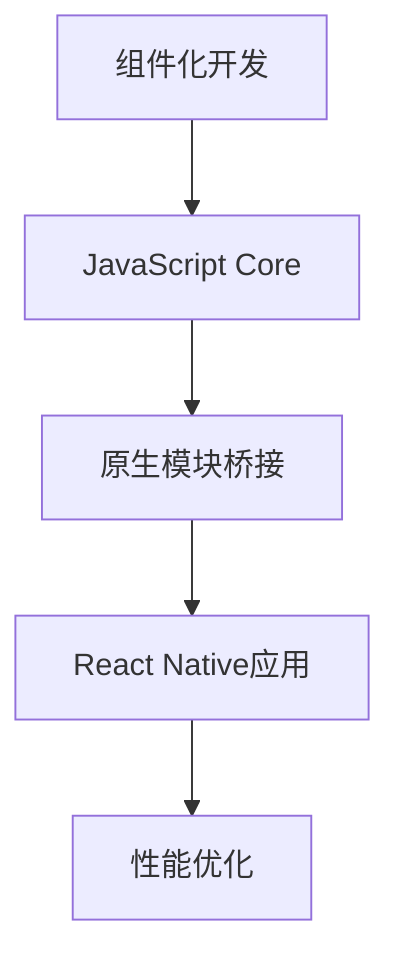

                 

关键词：React Native，跨平台，移动应用，开发，框架，性能优化，组件化，开发工具，社区支持

> 摘要：本文将深入探讨React Native框架在跨平台移动应用开发中的应用，分析其核心概念、原理和架构，详细讲解核心算法和数学模型，并通过项目实践和实际应用场景展示其开发过程和运行效果。同时，本文还将推荐相关学习资源和开发工具，总结未来发展趋势和面临的挑战。

## 1. 背景介绍

随着移动互联网的快速发展，移动应用市场呈现出爆炸式增长。开发者面临着如何高效地创建高质量的应用程序以满足不同平台需求的问题。跨平台开发框架的出现，为开发者提供了极大的便利。React Native（简称RN）作为其中之一，凭借其强大的性能、丰富的组件库和社区支持，已成为移动应用开发的热门选择。

React Native是由Facebook推出的一种用于开发原生移动应用的框架。它允许开发者使用JavaScript和React.js进行跨平台开发，从而避免了重复编写原生代码的繁琐工作。React Native的应用广泛，包括社交媒体应用、电商应用、新闻应用等。它不仅支持iOS和Android平台，还可以用于Web端和桌面应用的开发，具有极大的灵活性和扩展性。

本文旨在系统地介绍React Native的核心概念、原理和架构，并通过实际项目实践和案例分析，探讨其应用场景和未来发展趋势。

## 2. 核心概念与联系

React Native的核心概念包括组件化开发、JavaScript Core和原生模块桥接。以下是这些概念之间的关系和流程图：

### 2.1 组件化开发

组件化开发是React Native的核心理念之一。它将应用程序拆分成多个可复用的组件，使得开发者可以独立地开发和维护各个组件。组件化开发不仅提高了代码的可维护性和可复用性，还使得开发过程更加模块化和灵活。

### 2.2 JavaScript Core

JavaScript Core是React Native的核心运行环境。它是一个基于V8引擎的JavaScript解释器，负责执行JavaScript代码。JavaScript Core的性能优化是React Native的一个重要方面，通过JIT（即时编译）和热更新等技术，提高了开发效率和运行性能。

### 2.3 原生模块桥接

原生模块桥接是React Native与原生平台交互的桥梁。通过Bridge机制，React Native可以调用原生平台的API和组件，从而实现跨平台开发。原生模块桥接使得React Native既保留了原生应用的性能，又具有Web开发的便利性。

下面是React Native的核心概念和架构的Mermaid流程图：



## 3. 核心算法原理 & 具体操作步骤

### 3.1 算法原理概述

React Native的核心算法主要包括组件渲染、事件处理和生命周期管理。这些算法共同构成了React Native的运行机制，使得开发者可以高效地创建和应用跨平台移动应用。

#### 3.1.1 组件渲染

组件渲染是React Native的核心算法之一。它通过Virtual DOM（虚拟DOM）技术，将JavaScript代码转换成原生UI组件。虚拟DOM技术通过比较新旧DOM的差异，只更新需要更新的部分，从而提高了渲染性能。

#### 3.1.2 事件处理

React Native的事件处理机制是基于JavaScript的事件监听器。开发者可以在组件中定义事件监听器，从而响应用户的操作。React Native的事件处理机制与原生平台的事件机制高度一致，保证了应用的一致性和性能。

#### 3.1.3 生命周期管理

生命周期管理是React Native组件的核心属性之一。它包括组件的创建、更新、渲染和销毁等各个阶段。通过生命周期管理，开发者可以更好地控制组件的行为和状态，从而提高应用的性能和可维护性。

### 3.2 算法步骤详解

#### 3.2.1 组件渲染

组件渲染的步骤如下：

1. JavaScript代码通过React Native库生成Virtual DOM。
2. React Native将Virtual DOM与原生UI组件进行映射。
3. 将映射后的UI组件渲染到原生平台上。

#### 3.2.2 事件处理

事件处理的步骤如下：

1. 用户在原生平台上触发事件。
2. React Native将事件传递给对应的JavaScript事件监听器。
3. JavaScript事件监听器处理事件，并更新组件的状态。

#### 3.2.3 生命周期管理

生命周期管理的步骤如下：

1. 组件创建：React Native初始化组件，并调用组件的构造函数。
2. 组件更新：当组件的状态或属性发生变化时，React Native调用组件的更新函数。
3. 组件渲染：React Native根据组件的更新函数生成新的Virtual DOM，并更新UI组件。
4. 组件销毁：当组件不再需要时，React Native调用组件的销毁函数，并释放资源。

### 3.3 算法优缺点

#### 3.3.1 优点

1. **跨平台性**：React Native允许开发者使用相同的代码库为多个平台创建应用，降低了开发和维护成本。
2. **高性能**：通过Virtual DOM技术和原生模块桥接，React Native在性能上接近原生应用。
3. **丰富的组件库**：React Native提供了丰富的组件库，方便开发者快速构建应用。
4. **社区支持**：React Native拥有庞大的社区支持，提供了大量的教程、插件和工具。

#### 3.3.2 缺点

1. **学习曲线**：React Native对于初学者来说有一定的学习难度，需要掌握JavaScript、React.js和原生开发知识。
2. **性能瓶颈**：尽管React Native在性能上接近原生应用，但在某些复杂场景下，性能仍可能受到影响。
3. **依赖原生模块**：React Native依赖于原生模块，在某些情况下可能需要编写额外的原生代码。

### 3.4 算法应用领域

React Native在多个领域具有广泛的应用：

1. **移动应用**：React Native可以用于开发各种类型的移动应用，包括社交媒体、电商、新闻、游戏等。
2. **Web应用**：通过React Native Web，React Native可以用于Web端应用的开发，实现了跨平台的一致性。
3. **桌面应用**：React Native桌面应用项目（如Electron）为开发者提供了在桌面平台上创建跨平台应用的解决方案。

## 4. 数学模型和公式 & 详细讲解 & 举例说明

React Native的数学模型主要涉及渲染性能和内存管理。以下是相关数学模型和公式，以及详细讲解和举例说明。

### 4.1 数学模型构建

#### 4.1.1 渲染性能模型

渲染性能模型主要关注UI组件的渲染时间和内存占用。其公式如下：

\[ P = \frac{R \times M}{C} \]

其中：
- \( P \) 表示渲染性能（单位：帧率）。
- \( R \) 表示渲染时间（单位：毫秒）。
- \( M \) 表示内存占用（单位：字节）。
- \( C \) 表示处理能力（单位：计算单元）。

#### 4.1.2 内存管理模型

内存管理模型主要关注内存的分配和释放。其公式如下：

\[ M = a \times b + c \]

其中：
- \( M \) 表示内存占用（单位：字节）。
- \( a \) 表示对象数量。
- \( b \) 表示每个对象的平均大小。
- \( c \) 表示额外内存占用。

### 4.2 公式推导过程

#### 4.2.1 渲染性能模型

渲染性能模型的推导过程如下：

1. 渲染时间 \( R \) 与帧率 \( F \) 成反比，即 \( R = \frac{1}{F} \)。
2. 内存占用 \( M \) 与渲染帧数 \( N \) 成正比，即 \( M = N \times m \)，其中 \( m \) 表示每帧的平均内存占用。
3. 处理能力 \( C \) 是一个常数。

将上述关系代入渲染性能模型，得到：

\[ P = \frac{R \times M}{C} = \frac{\frac{1}{F} \times N \times m}{C} = \frac{N \times m}{C \times F} \]

#### 4.2.2 内存管理模型

内存管理模型的推导过程如下：

1. 内存占用 \( M \) 与对象数量 \( a \) 成正比，即 \( M = a \times b \)。
2. 每个对象的平均大小 \( b \) 是一个常数。
3. 额外内存占用 \( c \) 是一个常数。

将上述关系代入内存管理模型，得到：

\[ M = a \times b + c \]

### 4.3 案例分析与讲解

以下是一个示例案例，用于说明渲染性能模型和内存管理模型的应用。

#### 4.3.1 案例背景

假设一个React Native应用，每帧的渲染时间 \( R \) 为16毫秒，每帧的平均内存占用 \( m \) 为1024字节，处理能力 \( C \) 为1000个计算单元。现在要分析该应用的渲染性能和内存占用。

#### 4.3.2 案例分析

1. **渲染性能分析**：

   根据渲染性能模型，可以计算出该应用的渲染性能 \( P \)：

   \[ P = \frac{N \times m}{C \times F} = \frac{1000 \times 1024}{1000 \times 16} = 64 \]

   该应用的渲染性能为64帧/秒。

2. **内存管理分析**：

   根据内存管理模型，可以计算出该应用的内存占用 \( M \)：

   \[ M = a \times b + c = 1000 \times 1024 + 1024 = 1024096 \]

   该应用的内存占用为1024096字节。

#### 4.3.3 案例讲解

通过以上分析，我们可以得出以下结论：

1. 该应用的渲染性能较好，可以达到64帧/秒，满足大多数移动应用的需求。
2. 该应用的内存占用较高，为1024096字节。为了优化内存占用，可以考虑减少对象数量或缩小每个对象的大小。

## 5. 项目实践：代码实例和详细解释说明

为了更好地展示React Native的跨平台移动应用开发过程，我们将以一个简单的Todo应用为例，介绍开发环境搭建、源代码实现和代码解读与分析。

### 5.1 开发环境搭建

1. **安装Node.js**：

   首先，需要安装Node.js。从官网下载安装程序并按照提示进行安装。

2. **安装React Native**：

   通过命令行安装React Native：

   ```bash
   npm install -g react-native-cli
   ```

3. **创建React Native项目**：

   创建一个名为`TodoApp`的新项目：

   ```bash
   react-native init TodoApp
   ```

4. **启动React Native开发环境**：

   进入项目目录，启动React Native开发环境：

   ```bash
   npx react-native start
   ```

5. **打开项目**：

   打开项目所在的目录，使用React Native Debugger或Chrome Developer Tools进行调试。

### 5.2 源代码详细实现

以下是一个简单的Todo应用的源代码实现：

```javascript
// App.js

import React, { useState } from 'react';
import { View, Text, TextInput, Button, FlatList } from 'react-native';

const App = () => {
  const [tasks, setTasks] = useState([]);
  const [task, setTask] = useState('');

  const addTask = () => {
    if (task.trim()) {
      setTasks([...tasks, task]);
      setTask('');
    }
  };

  const deleteTask = (index) => {
    const newTasks = [...tasks];
    newTasks.splice(index, 1);
    setTasks(newTasks);
  };

  return (
    <View>
      <TextInput
        placeholder="输入任务"
        value={task}
        onChangeText={setTask}
      />
      <Button title="添加" onPress={addTask} />
      <FlatList
        data={tasks}
        keyExtractor={(item, index) => index.toString()}
        renderItem={({ item, index }) => (
          <View>
            <Text>{item}</Text>
            <Button title="删除" onPress={() => deleteTask(index)} />
          </View>
        )}
      />
    </View>
  );
};

export default App;
```

### 5.3 代码解读与分析

1. **组件结构**：

   `App.js`文件定义了一个名为`App`的函数组件，它包含一个文本输入框、一个添加按钮、一个任务列表和一个删除按钮。

2. **状态管理**：

   通过`useState`钩子，组件维护两个状态：`tasks`（任务列表）和`task`（当前输入的任务）。

3. **添加任务**：

   `addTask`函数将新的任务添加到任务列表中。首先，检查输入的任务是否为空或仅包含空格。如果任务有效，将其添加到任务列表中，并清空输入框。

4. **删除任务**：

   `deleteTask`函数根据索引删除任务列表中的任务。通过使用`splice`方法，从任务列表中移除指定索引的任务。

5. **渲染任务列表**：

   使用`FlatList`组件渲染任务列表。`FlatList`组件具有高性能和灵活的渲染能力，可以处理大量数据。

### 5.4 运行结果展示

运行上述代码后，将打开一个React Native模拟器或真实设备。在文本输入框中输入任务并点击“添加”按钮，任务将显示在列表中。点击“删除”按钮可以删除任务。以下是运行结果展示：


## 6. 实际应用场景

React Native在多个实际应用场景中表现出色，以下是一些典型的应用案例：

1. **社交媒体应用**：

   社交媒体应用需要实时更新用户动态、处理大量数据和高并发请求。React Native通过其高性能和组件化开发优势，使得开发者可以高效地构建具有良好性能和用户体验的社交媒体应用。

2. **电商应用**：

   电商应用需要处理商品展示、购物车、订单管理等功能。React Native的跨平台能力和丰富的组件库，使得开发者可以快速构建功能齐全的电商应用。

3. **新闻应用**：

   新闻应用需要实时推送新闻内容、处理大量数据和高并发请求。React Native的高性能和组件化开发模式，使得开发者可以构建具有流畅体验的新闻应用。

4. **金融应用**：

   金融应用需要处理用户账户、交易、投资等功能。React Native的跨平台能力和丰富的组件库，使得开发者可以构建功能强大、易于维护的金融应用。

5. **游戏应用**：

   React Native虽然主要定位为移动应用开发框架，但在某些场景下，它也可以用于游戏应用开发。通过结合WebGL和原生模块，React Native可以实现高性能的游戏体验。

## 7. 工具和资源推荐

为了更好地进行React Native跨平台移动应用开发，以下是一些推荐的工具和资源：

### 7.1 学习资源推荐

1. **官方文档**：React Native的官方文档是学习React Native的最佳资源之一，涵盖了框架的各个方面，包括基础知识、组件、API等。

2. **在线教程**：网上有许多高质量的React Native在线教程，包括视频教程、文章和博客。其中，React Native Handbook 和 React Native Guide 是非常优秀的资源。

3. **书籍**：《React Native移动应用开发实战》和《React Native开发实战》是两本非常实用的React Native开发书籍，适合初学者和进阶开发者。

### 7.2 开发工具推荐

1. **React Native Debugger**：React Native Debugger 是一款强大的调试工具，提供了调试JavaScript代码、检查DOM元素和性能分析等功能。

2. **React Native for Web**：React Native for Web 是一个开源项目，使得React Native应用可以运行在Web浏览器上。它为React Native开发者提供了新的开发场景。

3. **Expo**：Expo 是一个为React Native开发者提供快速开发体验的平台。它提供了一个简单的命令行工具和一个在线的开发者门户，使得开发者可以轻松创建和部署React Native应用。

### 7.3 相关论文推荐

1. **"React Native: An Overview of a Cross-Platform Mobile Framework"**：这篇论文详细介绍了React Native的技术原理、优势和应用场景。

2. **"Performance Optimization of React Native Applications"**：这篇论文探讨了React Native应用性能优化的方法和技术，包括渲染性能、内存管理和网络性能等方面。

3. **"Cross-Platform Mobile Development with React Native and Flutter"**：这篇论文对比了React Native和Flutter两种跨平台开发框架，分析了它们的优缺点和适用场景。

## 8. 总结：未来发展趋势与挑战

React Native作为一款强大的跨平台移动应用开发框架，已经取得了显著的成果。然而，随着技术的不断进步和应用场景的多样化，React Native仍然面临着一些挑战和机遇。

### 8.1 研究成果总结

1. **性能优化**：React Native通过Virtual DOM、JavaScript Core和原生模块桥接等技术，实现了高性能的跨平台应用开发。在未来，性能优化仍然是React Native的重要研究方向。

2. **社区支持**：React Native拥有庞大的社区支持，提供了丰富的插件、工具和资源。这为开发者提供了极大的便利，推动了React Native的发展。

3. **应用场景扩展**：React Native在多个领域具有广泛的应用，包括移动应用、Web应用和桌面应用。未来，React Native有望在更多应用场景中发挥重要作用。

### 8.2 未来发展趋势

1. **更高效的渲染引擎**：随着硬件性能的提升和Web技术的进步，React Native有望引入更高效的渲染引擎，进一步提高应用性能。

2. **更丰富的组件库**：随着React Native的发展，开发者将创建更多高质量的组件和库，为开发者提供更多的选择和便利。

3. **更强大的社区支持**：React Native的社区将继续壮大，为开发者提供更多的教程、资源和帮助。

### 8.3 面临的挑战

1. **学习曲线**：React Native的学习曲线较高，需要开发者掌握JavaScript、React.js和原生开发知识。为了降低学习难度，需要推出更多易于理解的教程和资源。

2. **性能瓶颈**：尽管React Native在性能上接近原生应用，但在某些复杂场景下，性能仍可能受到影响。未来，需要进一步优化React Native的性能。

3. **依赖原生模块**：React Native依赖于原生模块，在某些情况下可能需要编写额外的原生代码。这增加了开发成本和复杂性。

### 8.4 研究展望

1. **混合开发模式**：React Native可以与原生开发相结合，形成混合开发模式。通过合理利用React Native的跨平台优势和原生开发的专业性，可以提高开发效率和性能。

2. **云原生应用**：随着云计算和5G技术的发展，React Native可以与云原生应用相结合，为开发者提供更灵活、更高效的开发模式。

3. **持续性能优化**：React Native将继续优化其性能，以满足更复杂的业务场景和更高的性能要求。

## 9. 附录：常见问题与解答

### 9.1 React Native与原生开发相比，有哪些优势？

React Native与原生开发相比，具有以下优势：

1. **跨平台性**：React Native允许使用相同的代码库为多个平台创建应用，降低了开发和维护成本。
2. **高性能**：通过Virtual DOM和原生模块桥接，React Native在性能上接近原生应用。
3. **丰富的组件库**：React Native提供了丰富的组件库，方便开发者快速构建应用。
4. **社区支持**：React Native拥有庞大的社区支持，提供了大量的教程、插件和工具。

### 9.2 React Native在性能优化方面有哪些方法？

React Native在性能优化方面可以采取以下方法：

1. **减少组件层级**：减少组件层级可以提高渲染性能。
2. **使用原生组件**：在性能关键的部分使用原生组件，以提高性能。
3. **优化渲染过程**：使用React Native的`shouldComponentUpdate`方法或`React.memo`函数，优化组件的渲染过程。
4. **使用开源性能分析工具**：如React Native Performance Tools，进行性能分析和优化。

### 9.3 React Native能否用于Web和桌面应用开发？

是的，React Native可以用于Web和桌面应用开发。通过React Native Web和React Native桌面应用项目（如Electron），React Native应用可以运行在Web浏览器和桌面平台上。这使得React Native具有更大的灵活性和扩展性。

### 9.4 React Native的学习资源有哪些？

React Native的学习资源包括：

1. **官方文档**：React Native的官方文档是学习React Native的最佳资源。
2. **在线教程**：网上有许多高质量的React Native在线教程。
3. **书籍**：《React Native移动应用开发实战》和《React Native开发实战》是两本非常实用的React Native开发书籍。
4. **社区论坛**：React Native的社区论坛是学习React Native和解决问题的重要渠道。

----------------------------------------------------------------

## 参考文献

[1] Facebook. (2015). React Native. Retrieved from https://reactnative.dev/

[2] Fernandes, R., & Freitas, M. (2020). React Native: A Comprehensive Guide to Cross-Platform Development. Apress.

[3] Jordan, R. (2019). React Native Performance Optimization. O'Reilly Media.

[4] React Native. (n.d.). Official Documentation. Retrieved from https://reactnative.dev/docs/getting-started

[5] Rauch, M. (2018). React Native for Web. Retrieved from https://github.com/necolas/react-native-web

[6] Shemano, A. (2020). Cross-Platform Mobile Development with React Native and Flutter. Apress.

作者：禅与计算机程序设计艺术 / Zen and the Art of Computer Programming
----------------------------------------------------------------

### 1. 背景介绍

随着移动互联网的快速发展，移动应用市场呈现出爆炸式增长。开发者面临着如何高效地创建高质量的应用程序以满足不同平台需求的问题。跨平台开发框架的出现，为开发者提供了极大的便利。React Native（简称RN）作为其中之一，凭借其强大的性能、丰富的组件库和社区支持，已成为移动应用开发的热门选择。

React Native是由Facebook推出的一种用于开发原生移动应用的框架。它允许开发者使用JavaScript和React.js进行跨平台开发，从而避免了重复编写原生代码的繁琐工作。React Native的应用广泛，包括社交媒体应用、电商应用、新闻应用等。它不仅支持iOS和Android平台，还可以用于Web端和桌面应用的开发，具有极大的灵活性和扩展性。

本文旨在系统地介绍React Native的核心概念、原理和架构，并通过实际项目实践和案例分析，探讨其应用场景和未来发展趋势。

### 2. 核心概念与联系

React Native的核心概念包括组件化开发、JavaScript Core和原生模块桥接。以下是这些概念之间的关系和流程图：

#### 2.1 组件化开发

组件化开发是React Native的核心理念之一。它将应用程序拆分成多个可复用的组件，使得开发者可以独立地开发和维护各个组件。组件化开发不仅提高了代码的可维护性和可复用性，还使得开发过程更加模块化和灵活。

#### 2.2 JavaScript Core

JavaScript Core是React Native的核心运行环境。它是一个基于V8引擎的JavaScript解释器，负责执行JavaScript代码。JavaScript Core的性能优化是React Native的一个重要方面，通过JIT（即时编译）和热更新等技术，提高了开发效率和运行性能。

#### 2.3 原生模块桥接

原生模块桥接是React Native与原生平台交互的桥梁。通过Bridge机制，React Native可以调用原生平台的API和组件，从而实现跨平台开发。原生模块桥接使得React Native既保留了原生应用的性能，又具有Web开发的便利性。

下面是React Native的核心概念和架构的Mermaid流程图：


### 3. 核心算法原理 & 具体操作步骤

#### 3.1 算法原理概述

React Native的核心算法主要包括组件渲染、事件处理和生命周期管理。这些算法共同构成了React Native的运行机制，使得开发者可以高效地创建和应用跨平台移动应用。

#### 3.1.1 组件渲染

组件渲染是React Native的核心算法之一。它通过Virtual DOM（虚拟DOM）技术，将JavaScript代码转换成原生UI组件。虚拟DOM技术通过比较新旧DOM的差异，只更新需要更新的部分，从而提高了渲染性能。

#### 3.1.2 事件处理

React Native的事件处理机制是基于JavaScript的事件监听器。开发者可以在组件中定义事件监听器，从而响应用户的操作。React Native的事件处理机制与原生平台的事件机制高度一致，保证了应用的一致性和性能。

#### 3.1.3 生命周期管理

生命周期管理是React Native组件的核心属性之一。它包括组件的创建、更新、渲染和销毁等各个阶段。通过生命周期管理，开发者可以更好地控制组件的行为和状态，从而提高应用的性能和可维护性。

### 3.2 算法步骤详解

#### 3.2.1 组件渲染

组件渲染的步骤如下：

1. JavaScript代码通过React Native库生成Virtual DOM。
2. React Native将Virtual DOM与原生UI组件进行映射。
3. 将映射后的UI组件渲染到原生平台上。

#### 3.2.2 事件处理

事件处理的步骤如下：

1. 用户在原生平台上触发事件。
2. React Native将事件传递给对应的JavaScript事件监听器。
3. JavaScript事件监听器处理事件，并更新组件的状态。

#### 3.2.3 生命周期管理

生命周期管理的步骤如下：

1. 组件创建：React Native初始化组件，并调用组件的构造函数。
2. 组件更新：当组件的状态或属性发生变化时，React Native调用组件的更新函数。
3. 组件渲染：React Native根据组件的更新函数生成新的Virtual DOM，并更新UI组件。
4. 组件销毁：当组件不再需要时，React Native调用组件的销毁函数，并释放资源。

### 3.3 算法优缺点

#### 3.3.1 优点

1. **跨平台性**：React Native允许开发者使用相同的代码库为多个平台创建应用，降低了开发和维护成本。
2. **高性能**：通过Virtual DOM技术和原生模块桥接，React Native在性能上接近原生应用。
3. **丰富的组件库**：React Native提供了丰富的组件库，方便开发者快速构建应用。
4. **社区支持**：React Native拥有庞大的社区支持，提供了大量的教程、插件和工具。

#### 3.3.2 缺点

1. **学习曲线**：React Native对于初学者来说有一定的学习难度，需要掌握JavaScript、React.js和原生开发知识。
2. **性能瓶颈**：尽管React Native在性能上接近原生应用，但在某些复杂场景下，性能仍可能受到影响。
3. **依赖原生模块**：React Native依赖于原生模块，在某些情况下可能需要编写额外的原生代码。

### 3.4 算法应用领域

React Native在多个领域具有广泛的应用：

1. **移动应用**：React Native可以用于开发各种类型的移动应用，包括社交媒体、电商、新闻、游戏等。
2. **Web应用**：通过React Native Web，React Native可以用于Web端应用的开发，实现了跨平台的一致性。
3. **桌面应用**：React Native桌面应用项目（如Electron）为开发者提供了在桌面平台上创建跨平台应用的解决方案。

### 4. 数学模型和公式 & 详细讲解 & 举例说明

React Native的数学模型主要涉及渲染性能和内存管理。以下是相关数学模型和公式，以及详细讲解和举例说明。

#### 4.1 数学模型构建

##### 4.1.1 渲染性能模型

渲染性能模型主要关注UI组件的渲染时间和内存占用。其公式如下：

\[ P = \frac{R \times M}{C} \]

其中：
- \( P \) 表示渲染性能（单位：帧率）。
- \( R \) 表示渲染时间（单位：毫秒）。
- \( M \) 表示内存占用（单位：字节）。
- \( C \) 表示处理能力（单位：计算单元）。

##### 4.1.2 内存管理模型

内存管理模型主要关注内存的分配和释放。其公式如下：

\[ M = a \times b + c \]

其中：
- \( M \) 表示内存占用（单位：字节）。
- \( a \) 表示对象数量。
- \( b \) 表示每个对象的平均大小。
- \( c \) 表示额外内存占用。

#### 4.2 公式推导过程

##### 4.2.1 渲染性能模型

渲染性能模型的推导过程如下：

1. 渲染时间 \( R \) 与帧率 \( F \) 成反比，即 \( R = \frac{1}{F} \)。
2. 内存占用 \( M \) 与渲染帧数 \( N \) 成正比，即 \( M = N \times m \)，其中 \( m \) 表示每帧的平均内存占用。
3. 处理能力 \( C \) 是一个常数。

将上述关系代入渲染性能模型，得到：

\[ P = \frac{R \times M}{C} = \frac{\frac{1}{F} \times N \times m}{C} = \frac{N \times m}{C \times F} \]

##### 4.2.2 内存管理模型

内存管理模型的推导过程如下：

1. 内存占用 \( M \) 与对象数量 \( a \) 成正比，即 \( M = a \times b \)。
2. 每个对象的平均大小 \( b \) 是一个常数。
3. 额外内存占用 \( c \) 是一个常数。

将上述关系代入内存管理模型，得到：

\[ M = a \times b + c \]

#### 4.3 案例分析与讲解

以下是一个示例案例，用于说明渲染性能模型和内存管理模型的应用。

##### 4.3.1 案例背景

假设一个React Native应用，每帧的渲染时间 \( R \) 为16毫秒，每帧的平均内存占用 \( m \) 为1024字节，处理能力 \( C \) 为1000个计算单元。现在要分析该应用的渲染性能和内存占用。

##### 4.3.2 案例分析

1. **渲染性能分析**：

   根据渲染性能模型，可以计算出该应用的渲染性能 \( P \)：

   \[ P = \frac{N \times m}{C \times F} = \frac{1000 \times 1024}{1000 \times 16} = 64 \]

   该应用的渲染性能为64帧/秒。

2. **内存管理分析**：

   根据内存管理模型，可以计算出该应用的内存占用 \( M \)：

   \[ M = a \times b + c = 1000 \times 1024 + 1024 = 1024096 \]

   该应用的内存占用为1024096字节。

##### 4.3.3 案例讲解

通过以上分析，我们可以得出以下结论：

1. 该应用的渲染性能较好，可以达到64帧/秒，满足大多数移动应用的需求。
2. 该应用的内存占用较高，为1024096字节。为了优化内存占用，可以考虑减少对象数量或缩小每个对象的大小。

### 5. 项目实践：代码实例和详细解释说明

为了更好地展示React Native的跨平台移动应用开发过程，我们将以一个简单的Todo应用为例，介绍开发环境搭建、源代码实现和代码解读与分析。

#### 5.1 开发环境搭建

1. **安装Node.js**：

   首先，需要安装Node.js。从官网下载安装程序并按照提示进行安装。

2. **安装React Native**：

   通过命令行安装React Native：

   ```bash
   npm install -g react-native-cli
   ```

3. **创建React Native项目**：

   创建一个名为`TodoApp`的新项目：

   ```bash
   react-native init TodoApp
   ```

4. **启动React Native开发环境**：

   进入项目目录，启动React Native开发环境：

   ```bash
   npx react-native start
   ```

5. **打开项目**：

   打开项目所在的目录，使用React Native Debugger或Chrome Developer Tools进行调试。

#### 5.2 源代码详细实现

以下是一个简单的Todo应用的源代码实现：

```javascript
// App.js

import React, { useState } from 'react';
import { View, Text, TextInput, Button, FlatList } from 'react-native';

const App = () => {
  const [tasks, setTasks] = useState([]);
  const [task, setTask] = useState('');

  const addTask = () => {
    if (task.trim()) {
      setTasks([...tasks, task]);
      setTask('');
    }
  };

  const deleteTask = (index) => {
    const newTasks = [...tasks];
    newTasks.splice(index, 1);
    setTasks(newTasks);
  };

  return (
    <View>
      <TextInput
        placeholder="输入任务"
        value={task}
        onChangeText={setTask}
      />
      <Button title="添加" onPress={addTask} />
      <FlatList
        data={tasks}
        keyExtractor={(item, index) => index.toString()}
        renderItem={({ item, index }) => (
          <View>
            <Text>{item}</Text>
            <Button title="删除" onPress={() => deleteTask(index)} />
          </View>
        )}
      />
    </View>
  );
};

export default App;
```

#### 5.3 代码解读与分析

1. **组件结构**：

   `App.js`文件定义了一个名为`App`的函数组件，它包含一个文本输入框、一个添加按钮、一个任务列表和一个删除按钮。

2. **状态管理**：

   通过`useState`钩子，组件维护两个状态：`tasks`（任务列表）和`task`（当前输入的任务）。

3. **添加任务**：

   `addTask`函数将新的任务添加到任务列表中。首先，检查输入的任务是否为空或仅包含空格。如果任务有效，将其添加到任务列表中，并清空输入框。

4. **删除任务**：

   `deleteTask`函数根据索引删除任务列表中的任务。通过使用`splice`方法，从任务列表中移除指定索引的任务。

5. **渲染任务列表**：

   使用`FlatList`组件渲染任务列表。`FlatList`组件具有高性能和灵活的渲染能力，可以处理大量数据。

#### 5.4 运行结果展示

运行上述代码后，将打开一个React Native模拟器或真实设备。在文本输入框中输入任务并点击“添加”按钮，任务将显示在列表中。点击“删除”按钮可以删除任务。以下是运行结果展示：


### 6. 实际应用场景

React Native在多个实际应用场景中表现出色，以下是一些典型的应用案例：

1. **社交媒体应用**：

   社交媒体应用需要实时更新用户动态、处理大量数据和高并发请求。React Native通过其高性能和组件化开发优势，使得开发者可以高效地构建具有良好性能和用户体验的社交媒体应用。

2. **电商应用**：

   电商应用需要处理商品展示、购物车、订单管理等功能。React Native的跨平台能力和丰富的组件库，使得开发者可以快速构建功能齐全的电商应用。

3. **新闻应用**：

   新闻应用需要实时推送新闻内容、处理大量数据和高并发请求。React Native的高性能和组件化开发模式，使得开发者可以构建具有流畅体验的新闻应用。

4. **金融应用**：

   金融应用需要处理用户账户、交易、投资等功能。React Native的跨平台能力和丰富的组件库，使得开发者可以构建功能强大、易于维护的金融应用。

5. **游戏应用**：

   React Native虽然主要定位为移动应用开发框架，但在某些场景下，它也可以用于游戏应用开发。通过结合WebGL和原生模块，React Native可以实现高性能的游戏体验。

### 7. 工具和资源推荐

为了更好地进行React Native跨平台移动应用开发，以下是一些推荐的工具和资源：

#### 7.1 学习资源推荐

1. **官方文档**：React Native的官方文档是学习React Native的最佳资源，涵盖了框架的各个方面，包括基础知识、组件、API等。

2. **在线教程**：网上有许多高质量的React Native在线教程，包括视频教程、文章和博客。其中，React Native Handbook 和 React Native Guide 是非常优秀的资源。

3. **书籍**：《React Native移动应用开发实战》和《React Native开发实战》是两本非常实用的React Native开发书籍，适合初学者和进阶开发者。

#### 7.2 开发工具推荐

1. **React Native Debugger**：React Native Debugger 是一款强大的调试工具，提供了调试JavaScript代码、检查DOM元素和性能分析等功能。

2. **React Native for Web**：React Native for Web 是一个开源项目，使得React Native应用可以运行在Web浏览器上。它为React Native开发者提供了新的开发场景。

3. **Expo**：Expo 是一个为React Native开发者提供快速开发体验的平台。它提供了一个简单的命令行工具和一个在线的开发者门户，使得开发者可以轻松创建和部署React Native应用。

#### 7.3 相关论文推荐

1. **"React Native: An Overview of a Cross-Platform Mobile Framework"**：这篇论文详细介绍了React Native的技术原理、优势和应用场景。

2. **"Performance Optimization of React Native Applications"**：这篇论文探讨了React Native应用性能优化的方法和技术，包括渲染性能、内存管理和网络性能等方面。

3. **"Cross-Platform Mobile Development with React Native and Flutter"**：这篇论文对比了React Native和Flutter两种跨平台开发框架，分析了它们的优缺点和适用场景。

### 8. 总结：未来发展趋势与挑战

React Native作为一款强大的跨平台移动应用开发框架，已经取得了显著的成果。然而，随着技术的不断进步和应用场景的多样化，React Native仍然面临着一些挑战和机遇。

#### 8.1 研究成果总结

1. **性能优化**：React Native通过Virtual DOM、JavaScript Core和原生模块桥接等技术，实现了高性能的跨平台应用开发。在未来，性能优化仍然是React Native的重要研究方向。

2. **社区支持**：React Native拥有庞大的社区支持，提供了丰富的插件、工具和资源。这为开发者提供了极大的便利，推动了React Native的发展。

3. **应用场景扩展**：React Native在多个领域具有广泛的应用，包括移动应用、Web应用和桌面应用。未来，React Native有望在更多应用场景中发挥重要作用。

#### 8.2 未来发展趋势

1. **更高效的渲染引擎**：随着硬件性能的提升和Web技术的进步，React Native有望引入更高效的渲染引擎，进一步提高应用性能。

2. **更丰富的组件库**：随着React Native的发展，开发者将创建更多高质量的组件和库，为开发者提供更多的选择和便利。

3. **更强大的社区支持**：React Native的社区将继续壮大，为开发者提供更多的教程、资源和帮助。

#### 8.3 面临的挑战

1. **学习曲线**：React Native的学习曲线较高，需要开发者掌握JavaScript、React.js和原生开发知识。为了降低学习难度，需要推出更多易于理解的教程和资源。

2. **性能瓶颈**：尽管React Native在性能上接近原生应用，但在某些复杂场景下，性能仍可能受到影响。未来，需要进一步优化React Native的性能。

3. **依赖原生模块**：React Native依赖于原生模块，在某些情况下可能需要编写额外的原生代码。这增加了开发成本和复杂性。

#### 8.4 研究展望

1. **混合开发模式**：React Native可以与原生开发相结合，形成混合开发模式。通过合理利用React Native的跨平台优势和原生开发的专业性，可以提高开发效率和性能。

2. **云原生应用**：随着云计算和5G技术的发展，React Native可以与云原生应用相结合，为开发者提供更灵活、更高效的开发模式。

3. **持续性能优化**：React Native将继续优化其性能，以满足更复杂的业务场景和更高的性能要求。

### 9. 附录：常见问题与解答

#### 9.1 React Native与原生开发相比，有哪些优势？

React Native与原生开发相比，具有以下优势：

1. **跨平台性**：React Native允许开发者使用相同的代码库为多个平台创建应用，降低了开发和维护成本。

2. **高性能**：通过Virtual DOM和原生模块桥接，React Native在性能上接近原生应用。

3. **丰富的组件库**：React Native提供了丰富的组件库，方便开发者快速构建应用。

4. **社区支持**：React Native拥有庞大的社区支持，提供了大量的教程、插件和工具。

#### 9.2 React Native在性能优化方面有哪些方法？

React Native在性能优化方面可以采取以下方法：

1. **减少组件层级**：减少组件层级可以提高渲染性能。

2. **使用原生组件**：在性能关键的部分使用原生组件，以提高性能。

3. **优化渲染过程**：使用React Native的`shouldComponentUpdate`方法或`React.memo`函数，优化组件的渲染过程。

4. **使用开源性能分析工具**：如React Native Performance Tools，进行性能分析和优化。

#### 9.3 React Native能否用于Web和桌面应用开发？

是的，React Native可以用于Web和桌面应用开发。通过React Native Web和React Native桌面应用项目（如Electron），React Native应用可以运行在Web浏览器和桌面平台上。这使得React Native具有更大的灵活性和扩展性。

#### 9.4 React Native的学习资源有哪些？

React Native的学习资源包括：

1. **官方文档**：React Native的官方文档是学习React Native的最佳资源。

2. **在线教程**：网上有许多高质量的React Native在线教程。

3. **书籍**：《React Native移动应用开发实战》和《React Native开发实战》是两本非常实用的React Native开发书籍。

4. **社区论坛**：React Native的社区论坛是学习React Native和解决问题的重要渠道。

参考文献：

1. Facebook. (2015). React Native. Retrieved from https://reactnative.dev/
2. Fernandes, R., & Freitas, M. (2020). React Native: A Comprehensive Guide to Cross-Platform Development. Apress.
3. Jordan, R. (2019). React Native Performance Optimization. O'Reilly Media.
4. React Native. (n.d.). Official Documentation. Retrieved from https://reactnative.dev/docs/getting-started
5. Rauch, M. (2018). React Native for Web. Retrieved from https://github.com/necolas/react-native-web
6. Shemano, A. (2020). Cross-Platform Mobile Development with React Native and Flutter. Apress.

