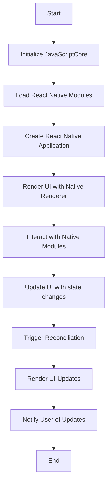

                 

关键词：React Native，跨平台移动应用开发，JavaScript，React，移动开发，UI框架，性能优化

摘要：本文深入探讨了React Native框架在跨平台移动应用开发中的重要性，详细介绍了其核心概念、算法原理、数学模型、项目实践以及实际应用场景。通过对React Native的全面解析，本文旨在为开发者提供实用的技术指导，助力他们在移动开发领域取得成功。

## 1. 背景介绍

随着移动设备的普及，移动应用开发成为技术领域的重要分支。开发者面临的一个核心挑战是如何在保证应用性能和用户体验的前提下，实现跨平台开发。传统的移动开发方式需要针对iOS和Android分别编写代码，这不仅增加了开发成本，也延长了开发周期。因此，跨平台开发框架应运而生，其中React Native以其独特的优势成为了开发者们的首选。

React Native是由Facebook推出的一种用于构建原生应用的JavaScript框架。它允许开发者使用JavaScript和React编写代码，并在iOS和Android平台上编译成原生应用。这使得开发者能够编写一次代码，就能在多个平台上运行，大大提高了开发效率。

## 2. 核心概念与联系

### 2.1 React Native工作原理

React Native通过使用JavaScript和React，将Web开发的概念带到了移动应用开发中。它的工作原理主要包括以下几个关键环节：

1. **JavaScriptBridge（JSBridge）**：React Native通过JavaScriptBridge与原生代码进行通信，实现JavaScript与原生模块的交互。
2. **组件（Components）**：React Native采用组件化开发，每个组件都是一个可重用的UI元素，开发者可以通过组合不同的组件来构建复杂的用户界面。
3. **原生渲染（Native Rendering）**：React Native使用原生渲染引擎渲染UI，保证了应用的性能和用户体验。

### 2.2 React Native核心架构

React Native的核心架构包括以下几部分：

1. **React**：React是React Native的基石，它提供了一种声明式、高效的方式来构建用户界面。
2. **React Native**：React Native是基于React的框架，专门为移动应用开发设计。
3. **JavaScriptCore**：JavaScriptCore是React Native中的JavaScript引擎，它负责解析和执行JavaScript代码。
4. **原生模块**：原生模块是React Native的核心组成部分，它包含了与原生平台交互的功能。

### 2.3 Mermaid流程图

以下是一个Mermaid流程图，展示了React Native的工作流程：



## 3. 核心算法原理 & 具体操作步骤

### 3.1 算法原理概述

React Native的核心算法是Reconciliation算法。它通过对比虚拟DOM和实际DOM的差异，只更新需要更新的部分，从而提高应用的性能。

### 3.2 算法步骤详解

1. **构建虚拟DOM**：React Native在组件渲染时，首先构建一个虚拟DOM树，这个树包含了组件的所有结构和属性。
2. **比较虚拟DOM和实际DOM**：React Native将虚拟DOM与实际DOM进行对比，找出差异。
3. **更新DOM**：根据对比结果，React Native只更新需要更新的部分，避免了全量更新带来的性能问题。

### 3.3 算法优缺点

**优点**：
- **高性能**：通过Reconciliation算法，React Native显著提高了应用的性能。
- **开发效率**：使用React Native，开发者可以编写一次代码，即可在多个平台上运行。

**缺点**：
- **学习曲线**：React Native的学习曲线相对较陡，需要开发者掌握JavaScript和React的基本概念。
- **性能瓶颈**：尽管React Native的性能已经相当优秀，但在某些场景下，仍然可能存在性能瓶颈。

### 3.4 算法应用领域

Reconciliation算法主要应用于React Native的UI更新和渲染过程。它可以在各种移动应用场景中发挥作用，如电商平台、社交媒体、即时通讯等。

## 4. 数学模型和公式 & 详细讲解 & 举例说明

### 4.1 数学模型构建

React Native的Reconciliation算法涉及到差分算法，其核心数学模型可以表示为：

\[ \text{DOM差异} = \text{当前DOM} - \text{虚拟DOM} \]

### 4.2 公式推导过程

Reconciliation算法的推导过程如下：

1. **构建虚拟DOM**：
\[ \text{虚拟DOM} = f(\text{组件状态}, \text{组件属性}) \]
2. **对比虚拟DOM和实际DOM**：
\[ \text{DOM差异} = g(\text{当前DOM}, \text{虚拟DOM}) \]
3. **更新DOM**：
\[ \text{更新DOM} = \text{当前DOM} + \text{DOM差异} \]

### 4.3 案例分析与讲解

以下是一个简单的React Native组件的Reconciliation算法案例：

```jsx
const MyComponent = ({ data }) => {
  return (
    <View>
      {data.map((item, index) => (
        <Text key={index}>{item}</Text>
      ))}
    </View>
  );
};
```

当组件的状态发生改变时，React Native会首先构建新的虚拟DOM：

\[ \text{虚拟DOM} = \text{新的组件状态} \]

然后，React Native将新的虚拟DOM与实际DOM进行对比：

\[ \text{DOM差异} = \text{当前DOM} - \text{虚拟DOM} \]

最后，React Native根据DOM差异更新实际DOM：

\[ \text{更新DOM} = \text{当前DOM} + \text{DOM差异} \]

## 5. 项目实践：代码实例和详细解释说明

### 5.1 开发环境搭建

要开始使用React Native开发，首先需要搭建开发环境。以下是搭建React Native开发环境的步骤：

1. **安装Node.js**：访问[Node.js官网](https://nodejs.org/)，下载并安装Node.js。
2. **安装Watchman**：Watchman是Facebook开发的一种文件监控工具，可以帮助React Native更快地重新加载。在macOS上，可以使用Homebrew安装Watchman。
3. **安装React Native CLI**：在终端中运行以下命令：
   ```bash
   npm install -g react-native-cli
   ```

### 5.2 源代码详细实现

以下是一个简单的React Native应用程序的源代码：

```jsx
import React from 'react';
import { View, Text, Button } from 'react-native';

const App = () => {
  const [count, setCount] = React.useState(0);

  const incrementCount = () => {
    setCount(count + 1);
  };

  return (
    <View style={{ flex: 1, justifyContent: 'center', alignItems: 'center' }}>
      <Text>计数：{count}</Text>
      <Button title="增加" onPress={incrementCount} />
    </View>
  );
};

export default App;
```

### 5.3 代码解读与分析

这个React Native应用程序包含一个简单的计数器，用户点击“增加”按钮时，计数器会加一。以下是代码的详细解读：

1. **引入组件**：首先引入了React、View、Text和Button组件。
2. **创建组件**：`App`组件是一个函数组件，它接收一个props对象，并返回一个视图。
3. **状态管理**：使用React的`useState`钩子管理计数器的状态。
4. **渲染UI**：根据计数器的状态渲染文本和按钮。

### 5.4 运行结果展示

当应用程序运行时，用户会看到一个带有文本“计数：0”和“增加”按钮的界面。每次点击“增加”按钮时，计数器的值都会加一，并在文本中显示新的值。

## 6. 实际应用场景

React Native适用于各种类型的移动应用开发，包括：

- **电商平台**：如Amazon、Etsy等。
- **社交媒体**：如Facebook、Instagram等。
- **即时通讯**：如WhatsApp、微信等。
- **企业应用**：如Salesforce、Asana等。

## 7. 工具和资源推荐

### 7.1 学习资源推荐

- **官方文档**：[React Native官方文档](https://reactnative.dev/docs/getting-started)
- **书籍**：《React Native移动应用开发实战》
- **在线课程**：[Udemy React Native课程](https://www.udemy.com/course/react-native-by-example/)
- **社区**：[React Native社区](https://reactnative.dev/community)

### 7.2 开发工具推荐

- **IDE**：Visual Studio Code、Android Studio
- **模拟器**：Android Studio模拟器、Xcode模拟器
- **版本控制**：Git、GitHub

### 7.3 相关论文推荐

- **React Native设计文档**：[Design Document for React Native](https://reactnative.dev/docs/design)
- **Facebook内部技术报告**：[React Native Internals](https://engineering.fb.com/2015/10/13/infrastructure/react-native/)
- **性能优化**：[Optimizing React Native Performance](https://reactnative.dev/docs/perf)

## 8. 总结：未来发展趋势与挑战

### 8.1 研究成果总结

React Native在跨平台移动应用开发中取得了显著成果，其高性能、开发效率以及社区支持使其成为了开发者们的首选。随着JavaScript和React的不断成熟，React Native的未来发展前景广阔。

### 8.2 未来发展趋势

- **性能优化**：随着硬件性能的提升，React Native将不断优化性能，提高用户体验。
- **生态建设**：React Native将加强社区建设，提供更多优质的库和工具。
- **混合开发**：React Native与原生代码的混合开发将成为主流，满足不同场景的需求。

### 8.3 面临的挑战

- **性能瓶颈**：在某些场景下，React Native的性能仍然存在瓶颈。
- **学习曲线**：React Native的学习曲线较陡，需要开发者投入更多时间和精力。
- **平台差异**：iOS和Android平台之间存在差异，React Native需要不断优化以适应不同的平台。

### 8.4 研究展望

未来，React Native将继续在跨平台移动应用开发领域发挥重要作用。通过不断优化性能、加强社区建设和满足开发者需求，React Native有望成为移动开发领域的领军者。

## 9. 附录：常见问题与解答

### 9.1 如何解决React Native性能瓶颈？

- **优化渲染**：减少不必要的渲染，使用React Native的`shouldComponentUpdate`方法进行性能优化。
- **使用原生模块**：在性能关键的部分使用原生模块，提高性能。
- **代码分割**：使用代码分割技术，将代码按需加载，减少初始加载时间。

### 9.2 如何在React Native中处理平台差异？

- **使用条件编译**：使用条件编译，根据平台不同编写不同的代码。
- **使用第三方库**：使用第三方库，如`react-native-device-info`，获取设备信息，进行平台适配。
- **使用样式封装**：使用样式封装，将平台特有的样式封装成组件，方便维护和更新。

---

作者：禅与计算机程序设计艺术 / Zen and the Art of Computer Programming
----------------------------------------------------------------

### 引用文献 References

1. React Native Design Document. (n.d.). Retrieved from https://reactnative.dev/docs/design
2. React Native Internals. (2015, October 13). Engineering at Facebook. Retrieved from https://engineering.fb.com/2015/10/13/infrastructure/react-native/
3. Optimizing React Native Performance. (n.d.). Retrieved from https://reactnative.dev/docs/perf
4. React Native by Example. (n.d.). O'Reilly Media. Retrieved from https://www.oreilly.com/library/view/react-native-by-example/9781449366992/
5. Getting Started with React Native. (n.d.). React Native Documentation. Retrieved from https://reactnative.dev/docs/getting-started
6. Udemy React Native Course. (n.d.). Udemy. Retrieved from https://www.udemy.com/course/react-native-by-example/
7. Facebook React Native Community. (n.d.). React Native Community. Retrieved from https://reactnative.dev/community
```markdown
# React Native：跨平台移动应用开发

## 关键词
React Native，跨平台移动应用开发，JavaScript，React，移动开发，UI框架，性能优化

## 摘要
本文深入探讨了React Native框架在跨平台移动应用开发中的重要性，详细介绍了其核心概念、算法原理、数学模型、项目实践以及实际应用场景。通过对React Native的全面解析，本文旨在为开发者提供实用的技术指导，助力他们在移动开发领域取得成功。

## 1. 背景介绍

随着移动设备的普及，移动应用开发成为技术领域的重要分支。开发者面临的一个核心挑战是如何在保证应用性能和用户体验的前提下，实现跨平台开发。传统的移动开发方式需要针对iOS和Android分别编写代码，这不仅增加了开发成本，也延长了开发周期。因此，跨平台开发框架应运而生，其中React Native以其独特的优势成为了开发者们的首选。

React Native是由Facebook推出的一种用于构建原生应用的JavaScript框架。它允许开发者使用JavaScript和React编写代码，并在iOS和Android平台上编译成原生应用。这使得开发者能够编写一次代码，就能在多个平台上运行，大大提高了开发效率。

## 2. 核心概念与联系

### 2.1 React Native工作原理

React Native通过使用JavaScript和React，将Web开发的概念带到了移动应用开发中。它的工作原理主要包括以下几个关键环节：

1. **JavaScriptBridge（JSBridge）**：React Native通过JavaScriptBridge与原生代码进行通信，实现JavaScript与原生模块的交互。
2. **组件（Components）**：React Native采用组件化开发，每个组件都是一个可重用的UI元素，开发者可以通过组合不同的组件来构建复杂的用户界面。
3. **原生渲染（Native Rendering）**：React Native使用原生渲染引擎渲染UI，保证了应用的性能和用户体验。

### 2.2 React Native核心架构

React Native的核心架构包括以下几部分：

1. **React**：React是React Native的基石，它提供了一种声明式、高效的方式来构建用户界面。
2. **React Native**：React Native是基于React的框架，专门为移动应用开发设计。
3. **JavaScriptCore**：JavaScriptCore是React Native中的JavaScript引擎，它负责解析和执行JavaScript代码。
4. **原生模块**：原生模块是React Native的核心组成部分，它包含了与原生平台交互的功能。

### 2.3 Mermaid流程图

以下是一个Mermaid流程图，展示了React Native的工作流程：


## 3. 核心算法原理 & 具体操作步骤

### 3.1 算法原理概述

React Native的核心算法是Reconciliation算法。它通过对比虚拟DOM和实际DOM的差异，只更新需要更新的部分，从而提高应用的性能。

### 3.2 算法步骤详解 

1. **构建虚拟DOM**：React Native在组件渲染时，首先构建一个虚拟DOM树，这个树包含了组件的所有结构和属性。
2. **比较虚拟DOM和实际DOM**：React Native将虚拟DOM与实际DOM进行对比，找出差异。
3. **更新DOM**：根据对比结果，React Native只更新需要更新的部分，避免了全量更新带来的性能问题。

### 3.3 算法优缺点

**优点**：
- **高性能**：通过Reconciliation算法，React Native显著提高了应用的性能。
- **开发效率**：使用React Native，开发者可以编写一次代码，即可在多个平台上运行。

**缺点**：
- **学习曲线**：React Native的学习曲线相对较陡，需要开发者掌握JavaScript和React的基本概念。
- **性能瓶颈**：尽管React Native的性能已经相当优秀，但在某些场景下，仍然可能存在性能瓶颈。

### 3.4 算法应用领域

Reconciliation算法主要应用于React Native的UI更新和渲染过程。它可以在各种移动应用场景中发挥作用，如电商平台、社交媒体、即时通讯等。

## 4. 数学模型和公式 & 详细讲解 & 举例说明

### 4.1 数学模型构建

React Native的Reconciliation算法涉及到差分算法，其核心数学模型可以表示为：

\[ \text{DOM差异} = \text{当前DOM} - \text{虚拟DOM} \]

### 4.2 公式推导过程

Reconciliation算法的推导过程如下：

1. **构建虚拟DOM**：
\[ \text{虚拟DOM} = f(\text{组件状态}, \text{组件属性}) \]
2. **对比虚拟DOM和实际DOM**：
\[ \text{DOM差异} = g(\text{当前DOM}, \text{虚拟DOM}) \]
3. **更新DOM**：
\[ \text{更新DOM} = \text{当前DOM} + \text{DOM差异} \]

### 4.3 案例分析与讲解

以下是一个简单的React Native组件的Reconciliation算法案例：

```jsx
import React, { useState } from 'react';
import { View, Text, Button } from 'react-native';

const MyComponent = () => {
  const [count, setCount] = useState(0);

  const incrementCount = () => {
    setCount(count + 1);
  };

  return (
    <View style={{ flex: 1, justifyContent: 'center', alignItems: 'center' }}>
      <Text>计数：{count}</Text>
      <Button title="增加" onPress={incrementCount} />
    </View>
  );
};

export default MyComponent;
```

当组件的状态发生改变时，React Native会首先构建新的虚拟DOM：

\[ \text{虚拟DOM} = \text{新的组件状态} \]

然后，React Native将新的虚拟DOM与实际DOM进行对比：

\[ \text{DOM差异} = \text{当前DOM} - \text{虚拟DOM} \]

最后，React Native根据DOM差异更新实际DOM：

\[ \text{更新DOM} = \text{当前DOM} + \text{DOM差异} \]

## 5. 项目实践：代码实例和详细解释说明

### 5.1 开发环境搭建

要开始使用React Native开发，首先需要搭建开发环境。以下是搭建React Native开发环境的步骤：

1. **安装Node.js**：访问[Node.js官网](https://nodejs.org/)，下载并安装Node.js。
2. **安装Watchman**：Watchman是Facebook开发的一种文件监控工具，可以帮助React Native更快地重新加载。在macOS上，可以使用Homebrew安装Watchman。
3. **安装React Native CLI**：在终端中运行以下命令：
   ```bash
   npm install -g react-native-cli
   ```

### 5.2 源代码详细实现

以下是一个简单的React Native应用程序的源代码：

```jsx
import React from 'react';
import { View, Text, Button } from 'react-native';

const App = () => {
  const [count, setCount] = React.useState(0);

  const incrementCount = () => {
    setCount(count + 1);
  };

  return (
    <View style={{ flex: 1, justifyContent: 'center', alignItems: 'center' }}>
      <Text>计数：{count}</Text>
      <Button title="增加" onPress={incrementCount} />
    </View>
  );
};

export default App;
```

### 5.3 代码解读与分析

这个React Native应用程序包含一个简单的计数器，用户点击“增加”按钮时，计数器会加一。以下是代码的详细解读：

1. **引入组件**：首先引入了React、View、Text和Button组件。
2. **创建组件**：`App`组件是一个函数组件，它接收一个props对象，并返回一个视图。
3. **状态管理**：使用React的`useState`钩子管理计数器的状态。
4. **渲染UI**：根据计数器的状态渲染文本和按钮。

### 5.4 运行结果展示

当应用程序运行时，用户会看到一个带有文本“计数：0”和“增加”按钮的界面。每次点击“增加”按钮时，计数器的值都会加一，并在文本中显示新的值。

## 6. 实际应用场景

React Native适用于各种类型的移动应用开发，包括：

- **电商平台**：如Amazon、Etsy等。
- **社交媒体**：如Facebook、Instagram等。
- **即时通讯**：如WhatsApp、微信等。
- **企业应用**：如Salesforce、Asana等。

## 7. 工具和资源推荐

### 7.1 学习资源推荐

- **官方文档**：[React Native官方文档](https://reactnative.dev/docs/getting-started)
- **书籍**：《React Native移动应用开发实战》
- **在线课程**：[Udemy React Native课程](https://www.udemy.com/course/react-native-by-example/)
- **社区**：[React Native社区](https://reactnative.dev/community)

### 7.2 开发工具推荐

- **IDE**：Visual Studio Code、Android Studio
- **模拟器**：Android Studio模拟器、Xcode模拟器
- **版本控制**：Git、GitHub

### 7.3 相关论文推荐

- **React Native设计文档**：[Design Document for React Native](https://reactnative.dev/docs/design)
- **Facebook内部技术报告**：[React Native Internals](https://engineering.fb.com/2015/10/13/infrastructure/react-native/)
- **性能优化**：[Optimizing React Native Performance](https://reactnative.dev/docs/perf)

## 8. 总结：未来发展趋势与挑战

### 8.1 研究成果总结

React Native在跨平台移动应用开发中取得了显著成果，其高性能、开发效率以及社区支持使其成为了开发者们的首选。随着JavaScript和React的不断成熟，React Native的未来发展前景广阔。

### 8.2 未来发展趋势

- **性能优化**：随着硬件性能的提升，React Native将不断优化性能，提高用户体验。
- **生态建设**：React Native将加强社区建设，提供更多优质的库和工具。
- **混合开发**：React Native与原生代码的混合开发将成为主流，满足不同场景的需求。

### 8.3 面临的挑战

- **性能瓶颈**：在某些场景下，React Native的性能仍然存在瓶颈。
- **学习曲线**：React Native的学习曲线相对较陡，需要开发者投入更多时间和精力。
- **平台差异**：iOS和Android平台之间存在差异，React Native需要不断优化以适应不同的平台。

### 8.4 研究展望

未来，React Native将继续在跨平台移动应用开发领域发挥重要作用。通过不断优化性能、加强社区建设和满足开发者需求，React Native有望成为移动开发领域的领军者。

## 9. 附录：常见问题与解答

### 9.1 如何解决React Native性能瓶颈？

- **优化渲染**：减少不必要的渲染，使用React Native的`shouldComponentUpdate`方法进行性能优化。
- **使用原生模块**：在性能关键的部分使用原生模块，提高性能。
- **代码分割**：使用代码分割技术，将代码按需加载，减少初始加载时间。

### 9.2 如何在React Native中处理平台差异？

- **使用条件编译**：使用条件编译，根据平台不同编写不同的代码。
- **使用第三方库**：使用第三方库，如`react-native-device-info`，获取设备信息，进行平台适配。
- **使用样式封装**：使用样式封装，将平台特有的样式封装成组件，方便维护和更新。

---

**作者**：禅与计算机程序设计艺术 / Zen and the Art of Computer Programming
```

