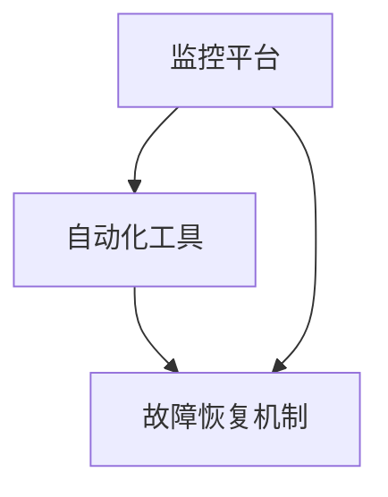

                 

关键词：SRE，自动化运维，DevOps，持续交付，监控，故障恢复

摘要：本文将深入探讨SRE（Site Reliability Engineering）在自动化运维领域的重要性，分析其核心概念、算法原理，并结合实际项目案例，详细介绍SRE自动化运维的最佳实践，旨在为从事运维工作的读者提供有价值的参考和指导。

## 1. 背景介绍

在现代企业中，随着云计算、容器化、微服务架构的广泛应用，系统运维的复杂度急剧增加。传统的运维方式已经无法满足快速迭代和高效管理的需求。SRE（Site Reliability Engineering）作为一种新兴的运维理念，应运而生。

SRE起源于Google，其核心目标是确保系统的稳定运行，同时追求高效开发和部署。SRE将运维活动看作是软件开发的一部分，强调自动化、监控、故障恢复等手段，从而实现运维的DevOps转型。

本文将围绕SRE的自动化运维最佳实践展开，探讨其核心概念、算法原理、数学模型以及实际应用。希望读者能够通过本文，更好地理解和应用SRE自动化运维的理念，提升运维工作的高效性和稳定性。

## 2. 核心概念与联系

### 2.1 SRE的核心概念

SRE的核心概念包括：

- **服务可靠性**：确保系统在特定时间内以特定质量运行。
- **自动化**：通过脚本、工具和平台实现重复性任务的自动化。
- **监控**：实时监控系统状态，及时发现并处理问题。
- **故障恢复**：快速响应故障，将系统恢复正常状态。

### 2.2 DevOps与SRE的联系

DevOps是一种将软件开发和运维紧密结合的实践方法，旨在缩短产品的发布周期、提高协作效率和提升产品质量。SRE是DevOps的重要组成部分，二者相辅相成。

- **持续交付**：DevOps的核心目标之一，通过自动化流程实现快速、可靠的软件交付。
- **基础设施即代码**：将基础设施的配置和管理代码化，实现自动化部署和管理。
- **监控与反馈**：DevOps强调实时监控和反馈机制，SRE在此基础上，进一步关注故障恢复和系统稳定性。

### 2.3 SRE架构

SRE架构的核心包括：

- **监控平台**：用于实时监控系统状态，及时发现并处理问题。
- **自动化工具**：用于自动化执行重复性任务，减少人工干预。
- **故障恢复机制**：在故障发生时，快速响应并恢复系统。

下面是一个简单的SRE架构Mermaid流程图：



## 3. 核心算法原理 & 具体操作步骤

### 3.1 算法原理概述

SRE中的核心算法主要包括：

- **监控算法**：用于实时监测系统状态，如CPU利用率、内存占用、网络流量等。
- **故障检测算法**：通过监控数据，自动识别系统异常。
- **故障恢复算法**：在故障发生时，自动执行一系列操作，恢复系统正常状态。

### 3.2 算法步骤详解

#### 3.2.1 监控算法

监控算法的主要步骤包括：

1. **数据采集**：从系统各个组件中采集性能数据。
2. **数据处理**：对采集到的数据进行处理，如去除噪声、平滑处理等。
3. **阈值设置**：根据历史数据，设置合理的监控阈值。
4. **异常检测**：实时监测系统状态，当某项指标超过阈值时，触发告警。

#### 3.2.2 故障检测算法

故障检测算法的主要步骤包括：

1. **监控数据接入**：将监控数据接入故障检测系统。
2. **模式识别**：通过机器学习等方法，对监控数据进行分析，识别异常模式。
3. **告警触发**：当检测到异常模式时，触发告警通知相关人员。

#### 3.2.3 故障恢复算法

故障恢复算法的主要步骤包括：

1. **故障定位**：根据告警信息，定位故障发生的位置。
2. **自动执行恢复操作**：根据预设的故障恢复策略，自动执行一系列恢复操作，如重启服务、调整配置等。
3. **验证恢复效果**：执行恢复操作后，验证系统状态是否恢复正常。

### 3.3 算法优缺点

#### 3.3.1 监控算法

优点：

- 实时性强：可以及时发现系统异常。
- 自动化：减少人工干预，提高效率。

缺点：

- 阈值设置难度大：需要根据业务特点和历史数据，设置合理的监控阈值。
- 数据处理复杂：需要处理大量的监控数据，保证数据处理效率和准确性。

#### 3.3.2 故障检测算法

优点：

- 高准确性：通过机器学习等方法，提高故障检测的准确性。
- 自动化：减少人工干预，提高效率。

缺点：

- 需要大量数据：故障检测算法的训练需要大量历史数据。
- 训练复杂：需要投入大量时间和资源进行算法训练。

#### 3.3.3 故障恢复算法

优点：

- 快速恢复：可以在故障发生时，快速响应并恢复系统。
- 自动化：减少人工干预，提高效率。

缺点：

- 可能导致误操作：故障恢复策略需要根据实际情况调整，避免误操作。
- 难以覆盖所有故障：部分故障可能需要人工干预。

### 3.4 算法应用领域

SRE算法广泛应用于互联网公司，如电商、社交、金融等领域。以下是一些典型的应用场景：

- **电商**：实时监控交易系统的性能，确保交易过程的稳定和安全。
- **社交**：监控社交平台的用户活跃度，及时发现并处理异常情况。
- **金融**：监控金融交易系统，确保交易数据的准确性和安全性。

## 4. 数学模型和公式 & 详细讲解 & 举例说明

### 4.1 数学模型构建

在SRE自动化运维中，常见的数学模型包括：

- **性能模型**：用于预测系统的性能，如响应时间、吞吐量等。
- **故障模型**：用于预测系统的故障率，如MTTF（平均无故障时间）、MTTR（平均修复时间）等。
- **可靠性模型**：用于评估系统的可靠性，如RNN（可靠性度）、FMECA（故障模式、影响及危害分析）等。

### 4.2 公式推导过程

以下是一个简单的可靠性模型公式的推导：

$$
R(t) = \prod_{i=1}^{n} (1 - F_i(t))
$$

其中，$R(t)$表示在时间$t$内系统的可靠性，$F_i(t)$表示第$i$个组件在时间$t$内的故障率。

### 4.3 案例分析与讲解

假设我们有一个由三个组件组成的系统，组件1的故障率为$0.01$，组件2的故障率为$0.02$，组件3的故障率为$0.03$。我们希望计算在时间$t=100$小时内，系统的可靠性。

根据可靠性模型公式，我们有：

$$
R(100) = (1 - 0.01) \times (1 - 0.02) \times (1 - 0.03) \approx 0.954
$$

因此，在$t=100$小时内，系统的可靠性约为$95.4\%$。

## 5. 项目实践：代码实例和详细解释说明

### 5.1 开发环境搭建

在本项目实践中，我们将使用Python编写一个简单的SRE自动化运维脚本。首先，确保你的系统中已经安装了Python环境。接下来，安装以下依赖库：

```bash
pip install requests pandas matplotlib
```

### 5.2 源代码详细实现

以下是一个简单的SRE自动化运维脚本示例：

```python
import requests
import pandas as pd
import matplotlib.pyplot as plt

# 监控API地址
API_URL = "http://your-monitoring-api.com/data"

# 采集监控数据
def collect_data():
    response = requests.get(API_URL)
    data = response.json()
    return data

# 处理监控数据
def process_data(data):
    df = pd.DataFrame(data)
    df['timestamp'] = pd.to_datetime(df['timestamp'])
    df.set_index('timestamp', inplace=True)
    return df

# 绘制监控数据
def plot_data(df):
    df.plot()
    plt.show()

# 主函数
def main():
    data = collect_data()
    df = process_data(data)
    plot_data(df)

if __name__ == "__main__":
    main()
```

### 5.3 代码解读与分析

- **collect_data()**：该函数用于从监控API采集监控数据。
- **process_data(data)**：该函数用于处理采集到的监控数据，包括数据格式转换和日期时间设置。
- **plot_data(df)**：该函数用于绘制处理后的监控数据，便于分析和监控。
- **main()**：主函数，调用上述三个函数，实现监控数据的采集、处理和展示。

### 5.4 运行结果展示

运行上述脚本后，你将看到一张展示监控数据的折线图。通过这张图，你可以实时监控系统的性能指标，如CPU利用率、内存占用、网络流量等。当某项指标异常时，可以及时进行处理，确保系统的稳定运行。

## 6. 实际应用场景

### 6.1 电商系统

在电商系统中，SRE自动化运维主要用于监控交易系统的性能和稳定性。例如，通过实时监控CPU利用率、内存占用等指标，及时发现并处理系统瓶颈，确保交易过程的流畅和安全。

### 6.2 社交平台

在社交平台上，SRE自动化运维主要用于监控用户活跃度和数据安全。通过实时监控服务器负载、数据库性能等指标，确保平台的高可用性和数据一致性。

### 6.3 金融系统

在金融系统中，SRE自动化运维主要用于监控交易系统和风险控制。通过实时监控交易量、风险指标等，确保交易过程的合规性和安全性。

## 7. 工具和资源推荐

### 7.1 学习资源推荐

- 《Site Reliability Engineering: How Google Runs Production Systems》：这是一本关于SRE的经典著作，详细介绍了SRE的理念和实践。
- 《DevOps Handbook》：介绍了DevOps的核心概念和实践方法，与SRE密切相关。

### 7.2 开发工具推荐

- Prometheus：一款开源的监控解决方案，适用于大规模分布式系统。
- Grafana：一款开源的数据可视化工具，可以与Prometheus等监控系统集成，实现数据监控和告警。
- Terraform：一款基础设施即代码的工具，用于自动化部署和管理基础设施。

### 7.3 相关论文推荐

- "Google's SRE Manifesto"：介绍了Google SRE的核心原则和实践。
- "A Research View of DevOps"：探讨了DevOps与SRE的关系及其在学术领域的应用。

## 8. 总结：未来发展趋势与挑战

### 8.1 研究成果总结

SRE作为DevOps的重要组成部分，已经在许多互联网公司中得到广泛应用。通过自动化、监控和故障恢复等手段，SRE有效提升了系统的稳定性和运维效率。

### 8.2 未来发展趋势

未来，SRE将继续向更智能化、自动化和高效化发展。随着人工智能技术的不断进步，SRE有望实现更加精准的故障预测和自动恢复。

### 8.3 面临的挑战

- **数据安全**：自动化运维过程中，数据安全至关重要。如何确保数据的安全性，是SRE面临的一个重要挑战。
- **人才短缺**：SRE对运维人员的要求较高，需要具备编程、算法、系统等方面的知识。如何培养和吸引更多SRE人才，是当前面临的一个问题。

### 8.4 研究展望

未来，SRE的研究将继续深入，探索更加高效、智能的运维方法。同时，随着云计算、大数据、物联网等新技术的不断发展，SRE的应用场景将越来越广泛。

## 9. 附录：常见问题与解答

### 9.1 SRE与DevOps的区别是什么？

SRE是DevOps的一部分，但两者有所不同。DevOps是一种将软件开发和运维紧密结合的实践方法，强调快速迭代、持续交付和协作。而SRE则专注于确保系统的稳定性和可靠性，通过自动化、监控和故障恢复等手段实现这一目标。

### 9.2 如何搭建SRE架构？

搭建SRE架构主要包括以下步骤：

1. **确定监控指标**：根据业务需求，确定需要监控的指标。
2. **搭建监控平台**：选择合适的监控工具，搭建监控平台。
3. **实施自动化**：通过脚本、工具和平台实现运维任务的自动化。
4. **建立故障恢复机制**：设计并实现故障恢复策略，确保系统在故障发生时能够快速恢复。

### 9.3 SRE与传统的运维有什么不同？

SRE与传统运维的主要区别在于：

1. **自动化**：SRE强调自动化，通过脚本、工具和平台实现重复性任务的自动化。
2. **可靠性**：SRE专注于系统的稳定性和可靠性，确保系统在特定时间内以特定质量运行。
3. **流程整合**：SRE将运维活动看作是软件开发的一部分，与开发团队紧密合作，实现流程整合。

---

作者：禅与计算机程序设计艺术 / Zen and the Art of Computer Programming

---

[End of the article]
----------------------------------------------------------------

