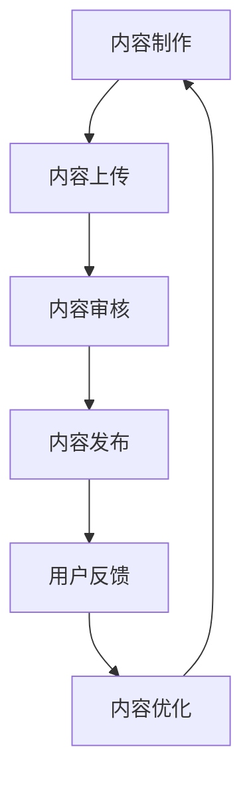

                 

关键词：SteamVR、内容发布、VR 体验、Steam 平台、推广策略、技术细节、用户互动

> 摘要：本文将探讨如何在 Steam 平台上成功发布和推广虚拟现实（VR）体验。通过分析 SteamVR 的特性、内容发布流程、优化策略以及与用户的互动，我们将提供一套全面的内容发布指南，帮助开发者提高其 VR 产品的可见度和市场表现。

## 1. 背景介绍

虚拟现实（VR）技术正迅速发展，成为游戏、教育培训、医疗健康、建筑设计等多个领域的热门应用。Steam 平台，作为全球最大的 PC 游戏数字发行平台，拥有庞大的用户基础和高度活跃的社区。对于 VR 内容创作者和开发者来说，Steam 平台提供了极佳的展示和销售 VR 体验的机会。

本文的目标是帮助 VR 内容创作者了解 SteamVR 平台的运作机制，掌握内容发布技巧，优化内容呈现，从而在 Steam 平台上取得成功。

## 2. 核心概念与联系

在探讨如何发布 VR 内容之前，我们先来了解几个核心概念：

### 2.1 VR 内容制作

VR 内容制作涉及多个方面，包括 3D 模型设计、场景搭建、交互设计等。这些内容需要高度精细和创意，以提供沉浸式的用户体验。

### 2.2 SteamVR 平台架构

SteamVR 是 Steam 平台针对 VR 应用的一套工具和接口，开发者可以通过 SteamVR API 开发 VR 游戏、应用和体验。

### 2.3 虚拟现实技术

虚拟现实技术包括 VR 头戴设备（如 Oculus Rift、HTC Vive）、位置追踪技术、音频增强技术等，这些技术共同构建了虚拟现实体验的基础。

以下是一个简化的 Mermaid 流程图，展示了 VR 内容从制作到发布的流程：



## 3. 核心算法原理 & 具体操作步骤

### 3.1 算法原理概述

VR 内容发布涉及一系列算法和优化技术，包括：

- **内容适配算法**：确保 VR 内容在不同设备和分辨率下都能良好运行。
- **用户体验优化算法**：通过分析用户行为数据，优化内容呈现，提高用户满意度。
- **推荐算法**：基于用户偏好和内容特点，提供个性化推荐。

### 3.2 算法步骤详解

#### 3.2.1 内容适配

1. **硬件检测**：通过 SteamVR API 获取用户设备信息，如分辨率、追踪能力等。
2. **内容调整**：根据设备信息调整 VR 内容的分辨率、帧率等参数，确保最佳体验。

#### 3.2.2 用户体验优化

1. **用户行为分析**：通过分析用户在 VR 体验中的行为，了解用户喜好和痛点。
2. **内容迭代**：根据分析结果，对 VR 内容进行迭代和优化，提高用户满意度。

#### 3.2.3 推荐算法

1. **用户特征提取**：提取用户的基本信息和偏好，如游戏类型、硬件配置等。
2. **内容特征提取**：提取 VR 内容的相关特征，如主题、难度、时长等。
3. **推荐模型训练**：使用机器学习算法，训练推荐模型，实现个性化推荐。

### 3.3 算法优缺点

#### 优点

- **提高内容适配性**：通过适配算法，确保 VR 内容在不同设备上运行良好。
- **提升用户体验**：通过优化算法，提高用户满意度和参与度。
- **个性化推荐**：推荐算法能够根据用户偏好推荐合适的内容，提高用户粘性。

#### 缺点

- **开发成本高**：算法开发和优化需要大量资源和时间。
- **数据隐私问题**：用户行为数据的收集和处理可能引发隐私争议。

### 3.4 算法应用领域

- **VR 游戏**：优化游戏内容，提高游戏体验。
- **教育培训**：通过个性化推荐，提高学习效果。
- **医疗健康**：提供定制化的治疗和康复体验。

## 4. 数学模型和公式 & 详细讲解 & 举例说明

### 4.1 数学模型构建

VR 内容发布涉及多个数学模型，包括：

- **适配模型**：用于计算 VR 内容在不同设备上的适配参数。
- **优化模型**：用于优化 VR 内容的呈现效果。
- **推荐模型**：用于个性化推荐 VR 内容。

### 4.2 公式推导过程

#### 4.2.1 适配模型

假设 VR 内容的原始分辨率为 \(R_o\)，设备分辨率为 \(R_d\)，适配后的分辨率为 \(R_a\)，则适配模型可以表示为：

$$ R_a = R_o \times \frac{R_d}{100} $$

#### 4.2.2 优化模型

假设 VR 内容的原始帧率为 \(F_o\)，设备帧率为 \(F_d\)，优化后的帧率为 \(F_a\)，则优化模型可以表示为：

$$ F_a = \frac{F_o + F_d}{2} $$

#### 4.2.3 推荐模型

假设用户 \(U_i\) 对 VR 内容 \(C_j\) 的偏好为 \(P_{ij}\)，则推荐模型可以表示为：

$$ P_{ij} = \frac{w_1 \times D_{ij} + w_2 \times S_{ij}}{w_1 + w_2} $$

其中，\(D_{ij}\) 为用户 \(U_i\) 和 VR 内容 \(C_j\) 的相似度，\(S_{ij}\) 为 VR 内容 \(C_j\) 的评分。

### 4.3 案例分析与讲解

假设我们有一个 VR 游戏开发团队，他们希望将其游戏在 Steam 平台上发布。以下是一个简单的案例分析：

#### 4.3.1 适配模型应用

该游戏的原分辨率 \(R_o\) 为 1920x1080，Steam 平台上目标设备的分辨率 \(R_d\) 为 1440x1080。根据适配模型，适配后的分辨率 \(R_a\) 为：

$$ R_a = 1920x1080 \times \frac{1440x1080}{100} = 2592x1440 $$

这意味着游戏在目标设备上将以 2592x1440 的分辨率运行。

#### 4.3.2 优化模型应用

该游戏的原始帧率 \(F_o\) 为 60 FPS，目标设备的帧率 \(F_d\) 为 75 FPS。根据优化模型，优化后的帧率 \(F_a\) 为：

$$ F_a = \frac{60 + 75}{2} = 67.5 $$

这意味着游戏在目标设备上将以 67.5 FPS 的帧率运行。

#### 4.3.3 推荐模型应用

假设我们有一个用户 \(U_1\)，他喜欢冒险类的 VR 游戏，且对这款游戏的评分 \(S_{11}\) 为 4.5。根据推荐模型，该用户对该游戏的偏好 \(P_{11}\) 为：

$$ P_{11} = \frac{w_1 \times D_{11} + w_2 \times S_{11}}{w_1 + w_2} $$

其中，\(D_{11}\) 为用户 \(U_1\) 和该游戏的相似度，\(w_1\) 和 \(w_2\) 为权重参数。

通过这个例子，我们可以看到数学模型在 VR 内容发布中的应用，帮助我们优化游戏内容和提升用户体验。

## 5. 项目实践：代码实例和详细解释说明

### 5.1 开发环境搭建

要在 Steam 平台上发布 VR 内容，我们需要搭建一个开发环境。以下是一个简化的步骤：

1. 安装 SteamVR SDK。
2. 设置开发环境，包括编译器、调试器和相关库。
3. 创建一个 VR 项目，并配置项目设置。

### 5.2 源代码详细实现

以下是一个简单的 VR 游戏代码实例，展示了如何使用 SteamVR SDK 开发一个基本 VR 游戏的框架：

```csharp
using SteamVR;
using UnityEngine;

public class VRGame : MonoBehaviour
{
    private SteamVR_RenderModel renderModel;

    void Start()
    {
        // 初始化 SteamVR SDK
        renderModel = new SteamVR_RenderModel();
        renderModel.Initialize();
    }

    void Update()
    {
        // 更新 VR 游戏逻辑
        renderModel.Update();
    }

    void OnDestroy()
    {
        // 释放资源
        renderModel.Dispose();
    }
}
```

### 5.3 代码解读与分析

这段代码展示了如何使用 Unity 游戏引擎和 SteamVR SDK 开发 VR 游戏的基本框架。它主要涉及以下三个方面：

- **初始化 SteamVR SDK**：在 `Start` 方法中，使用 `SteamVR_RenderModel` 类的 `Initialize` 方法初始化 SDK。
- **更新 VR 游戏逻辑**：在 `Update` 方法中，调用 `SteamVR_RenderModel` 类的 `Update` 方法，实现 VR 游戏的更新逻辑。
- **释放资源**：在 `OnDestroy` 方法中，调用 `SteamVR_RenderModel` 类的 `Dispose` 方法，释放资源。

### 5.4 运行结果展示

运行这段代码后，我们将在 Unity 编辑器中看到 VR 游戏的预览。通过 SteamVR 头戴设备，我们可以进入虚拟现实环境，体验游戏的交互。

## 6. 实际应用场景

### 6.1 游戏开发

VR 游戏是 SteamVR 平台上最常见的内容之一。通过发布高质量的 VR 游戏，开发者可以吸引大量用户，提高产品的市场表现。

### 6.2 教育培训

VR 技术在教育领域的应用日益广泛，通过 SteamVR 平台，教育机构可以发布虚拟课堂、实训课程等教学内容，提供更生动的学习体验。

### 6.3 医疗健康

VR 技术在医疗健康领域的应用包括虚拟手术训练、心理治疗等。通过 SteamVR 平台，医疗机构可以提供个性化的治疗和康复体验。

### 6.4 未来应用展望

随着 VR 技术的不断发展，SteamVR 平台的应用领域将更加广泛。未来，我们可以预见到 VR 技术在教育、医疗、娱乐等多个领域的深入应用，为用户提供更多样化、更高质量的 VR 体验。

## 7. 工具和资源推荐

### 7.1 学习资源推荐

- 《Virtual Reality Programming Guide》
- 《Unity VR Cookbook》
- 《HTC Vive Developer Guide》

### 7.2 开发工具推荐

- Unity 游戏引擎
- Unreal Engine 游戏引擎
- SteamVR SDK

### 7.3 相关论文推荐

- "Virtual Reality Applications in Education: A Review"
- "VR in Healthcare: A Review of Current Applications and Future Directions"
- "A Survey of VR Technologies and Applications in Entertainment"

## 8. 总结：未来发展趋势与挑战

### 8.1 研究成果总结

本文探讨了在 SteamVR 平台上发布 VR 内容的策略和方法。通过分析 VR 内容制作、SteamVR 平台架构、虚拟现实技术等核心概念，我们提出了一系列优化策略，包括内容适配、用户体验优化和推荐算法。

### 8.2 未来发展趋势

随着 VR 技术的不断发展，SteamVR 平台的应用前景将更加广阔。未来，我们可以预见到 VR 技术在教育、医疗、娱乐等多个领域的深入应用，为用户提供更多样化、更高质量的 VR 体验。

### 8.3 面临的挑战

虽然 VR 技术有着广泛的应用前景，但也面临着一系列挑战，包括开发成本高、数据隐私问题、内容质量不均等。

### 8.4 研究展望

未来的研究应重点关注 VR 内容的个性化推荐、用户体验优化和跨平台兼容性等方面，以提升 VR 技术的整体应用水平。

## 9. 附录：常见问题与解答

### 9.1 如何在 SteamVR 中添加新内容？

在 SteamVR 中添加新内容通常涉及以下几个步骤：

1. **创建内容项目**：在 SteamVR 中创建一个新的内容项目。
2. **上传内容**：将制作好的 VR 内容文件上传到 SteamVR。
3. **设置内容属性**：为内容设置名称、描述、分类等属性。
4. **发布内容**：提交内容审核，通过后即可在 SteamVR 中展示。

### 9.2 如何优化 VR 内容的适配性？

优化 VR 内容的适配性可以通过以下方法实现：

1. **硬件检测**：使用 SteamVR API 获取用户设备信息。
2. **内容调整**：根据设备信息调整 VR 内容的分辨率、帧率等参数。
3. **性能测试**：在多种设备上测试 VR 内容，确保运行稳定。

### 9.3 如何提高用户满意度？

提高用户满意度可以从以下几个方面入手：

1. **用户体验优化**：通过分析用户行为数据，优化 VR 内容的交互设计。
2. **内容迭代**：根据用户反馈，持续优化 VR 内容。
3. **个性化推荐**：使用推荐算法，为用户推荐合适的 VR 内容。

通过以上问题和解答，开发者可以更好地理解 VR 内容发布的流程和技术细节，从而在 SteamVR 平台上取得更好的成绩。

作者：禅与计算机程序设计艺术 / Zen and the Art of Computer Programming
----------------------------------------------------------------


