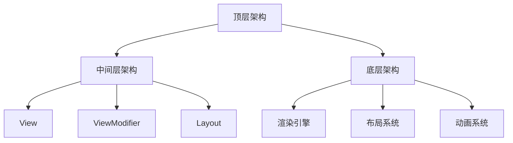

                 

关键词：SwiftUI，声明式 UI，框架设计，苹果，UI 编程，iOS 开发，Swift 语言

## 摘要

SwiftUI 是苹果公司推出的一种新的声明式 UI 编程框架，旨在简化 iOS、macOS、watchOS 和 tvOS 应用程序的开发。本文将深入探讨 SwiftUI 的设计理念、核心概念、算法原理，并通过具体的实例代码和实践经验，详细解析 SwiftUI 的框架设计。文章还将介绍数学模型和公式，分析其在实际应用场景中的表现，以及推荐相关的学习资源和开发工具。最后，本文将对 SwiftUI 的未来发展趋势与挑战进行展望。

## 1. 背景介绍

随着移动设备的普及，用户对应用程序的界面和交互体验有了更高的要求。传统的 UI 编程方式往往需要开发者手动编写大量代码来管理 UI 状态、布局和动画，这不仅增加了开发难度，也降低了开发效率。为了解决这一问题，苹果公司推出了 SwiftUI，这是一种全新的声明式 UI 编程框架。

SwiftUI 基于Swift语言，支持全平台的应用开发，包括 iOS、macOS、watchOS 和 tvOS。它采用了一种基于数据驱动的编程范式，允许开发者通过声明式的代码来描述 UI 界面，从而大大简化了 UI 编程的复杂性。

SwiftUI 的设计理念是“一次编写，处处运行”，这意味着开发者可以在一个代码库中编写 UI 界面，然后将其部署到不同的平台上，无需进行大量的平台特定代码编写。这种跨平台的特性使得 SwiftUI 成为了现代 UI 开发的一个重要趋势。

## 2. 核心概念与联系

### 2.1 SwiftUI 的核心概念

SwiftUI 的核心概念包括 View、State、Binding、Environment 和 Modifier 等。

- **View**：View 是 SwiftUI 的基本构建块，代表了 UI 界面上的一个可渲染的对象。每个 View 都有一个相应的模型，用于描述其外观和行为。
- **State**：State 用于表示 UI 界面上的可变状态。通过修改 State 的值，可以更新 View 的显示效果。
- **Binding**：Binding 是一个特殊的 State，它允许开发者通过闭包的方式将 UI 状态与模型中的状态关联起来。
- **Environment**：Environment 是一个全局的容器，用于传递上下文信息，如字体大小、颜色等。
- **Modifier**：Modifier 是用于修改 View 属性的代码块，可以添加样式、布局、动画等效果。

### 2.2 SwiftUI 的架构

SwiftUI 的架构采用了一种层次化的设计，包括以下几个层次：

- **顶层架构**：顶层架构定义了 SwiftUI 的入口点和基本组件，如 `@main` 标记和 `Scene` 构建块。
- **中间层架构**：中间层架构包括 View、ViewModifier 和 Layout 实现了 SwiftUI 的核心功能。
- **底层架构**：底层架构提供了与平台相关的实现，如渲染引擎、布局系统和动画系统。

### 2.3 SwiftUI 的 Mermaid 流程图



## 3. 核心算法原理 & 具体操作步骤

### 3.1 算法原理概述

SwiftUI 的核心算法原理是基于数据驱动的 UI 编程范式。开发者通过声明式的代码来描述 UI 界面，SwiftUI 会自动处理视图的渲染、布局和动画等过程。其核心算法包括：

- **数据绑定**：通过 Binding 实现模型与视图之间的双向数据绑定。
- **响应式布局**：根据 View 的状态和尺寸自动调整布局。
- **动画系统**：基于时间驱动的动画系统，实现视图的过渡和动画效果。

### 3.2 算法步骤详解

1. **定义 View**：创建一个 View 类型的结构体，用于描述 UI 界面的布局和样式。
2. **绑定状态**：使用 `@State` 和 `@Binding` 属性修饰符定义 UI 界面的状态变量。
3. **应用 Modifier**：使用 Modifier 对 View 进行修饰，如添加样式、布局和动画等效果。
4. **构建 UI**：通过组合不同的 View 和 Modifier，构建出完整的 UI 界面。

### 3.3 算法优缺点

**优点**：

- 简化了 UI 编程的复杂性，提高了开发效率。
- 响应式布局和动画系统，提高了 UI 的交互体验。
- 跨平台支持，一次编写，处处运行。

**缺点**：

- 对部分传统 UI 编程开发者来说，学习曲线较陡峭。
- 部分高级功能和性能需求可能需要使用平台特定的代码。

### 3.4 算法应用领域

SwiftUI 适用于多种应用领域，包括：

- 移动应用开发（iOS、watchOS、tvOS）
- 桌面应用开发（macOS）
- 前端 UI 开发（Web）
- 命令行界面（CLI）

## 4. 数学模型和公式 & 详细讲解 & 举例说明

### 4.1 数学模型构建

SwiftUI 的布局系统基于弹性布局（Flexbox）和网格布局（Grid），其数学模型可以表示为：

\[ \text{布局} = f(\text{尺寸}, \text{约束}, \text{优先级}) \]

其中：

- 尺寸（Size）：表示 View 的宽度、高度和尺寸因子。
- 约束（Constraint）：表示 View 之间的相对位置关系。
- 优先级（Priority）：表示 View 在布局中的优先级。

### 4.2 公式推导过程

以弹性布局为例，其公式推导过程如下：

\[ \text{布局尺寸} = \text{最小尺寸} + \text{弹性因子} \times (\text{最大尺寸} - \text{最小尺寸}) \]

其中：

- 最小尺寸（Min Size）：View 的最小可用尺寸。
- 最大尺寸（Max Size）：View 的最大可用尺寸。
- 弹性因子（Flex Factor）：View 的弹性系数，用于调整布局的弹性。

### 4.3 案例分析与讲解

假设有一个按钮 View，其最小尺寸为 100 x 50 像素，最大尺寸为 200 x 100 像素，弹性因子为 1.5。在宽度方向上，屏幕宽度为 320 像素，在高度方向上，屏幕高度为 568 像素。根据弹性布局公式，按钮的布局尺寸为：

\[ \text{宽度} = 100 + 1.5 \times (200 - 100) = 250 \text{像素} \]
\[ \text{高度} = 50 + 1.5 \times (100 - 50) = 125 \text{像素} \]

这意味着按钮在屏幕上的宽度为 250 像素，高度为 125 像素。如果屏幕尺寸发生变化，按钮的布局尺寸也会根据弹性布局公式自动调整。

## 5. 项目实践：代码实例和详细解释说明

### 5.1 开发环境搭建

要开始使用 SwiftUI 进行开发，需要安装以下工具：

- Xcode：苹果官方的开发工具，用于创建和测试 iOS 应用程序。
- Swift：苹果推出的编程语言，用于编写 SwiftUI 代码。
- SwiftUI：苹果推出的声明式 UI 编程框架。

安装完成后，可以通过 Xcode 创建一个新的 SwiftUI 项目，并开始编写代码。

### 5.2 源代码详细实现

以下是一个简单的 SwiftUI 应用程序的源代码示例：

```swift
import SwiftUI

struct ContentView: View {
    @State private var count = 0
    
    var body: some View {
        VStack {
            Text("计数：\(count)")
                .font(.largeTitle)
            
            Button("增加") {
                count += 1
            }
            .padding()
            .background(Color.blue)
            .foregroundColor(.white)
            .cornerRadius(10)
        }
    }
}

struct ContentView_Previews: PreviewProvider {
    static var previews: some View {
        ContentView()
    }
}
```

这段代码定义了一个名为 `ContentView` 的 View 结构体，其中包含一个 `@State` 属性用于存储计数器的值。`body` 属性中定义了一个垂直布局的 `VStack`，包含一个显示计数器文本的 `Text` View 和一个用于增加计数的 `Button` View。

### 5.3 代码解读与分析

**1. 结构体定义**

```swift
struct ContentView: View {
    ...
}
```

这行代码定义了一个名为 `ContentView` 的结构体，它遵循 `View` 协议，表示这是一个 View 类型的结构体。

**2. 状态绑定**

```swift
@State private var count = 0
```

这行代码使用 `@State` 属性修饰符定义了一个名为 `count` 的可变状态变量，其初始值为 0。通过修改 `count` 的值，可以更新 UI 界面的显示效果。

**3. View 的布局**

```swift
var body: some View {
    VStack {
        ...
    }
}
```

这行代码定义了一个垂直布局的 `VStack`，用于包含子 View。`VStack` 中的子 View 将按照垂直方向依次排列。

**4. Button 视图**

```swift
Button("增加") {
    count += 1
}
```

这行代码定义了一个按钮视图，其文本为“增加”，点击按钮将触发闭包中的代码，将 `count` 的值增加 1。

**5. 样式设置**

```swift
.padding()
.background(Color.blue)
.foregroundColor(.white)
.cornerRadius(10)
```

这行代码使用 Modifier 对 `Button` 视图进行了样式设置，包括填充、背景颜色、文字颜色和圆角。

### 5.4 运行结果展示

在 Xcode 中运行上述代码，将显示一个包含一个文本标签和一个按钮的界面。文本标签显示当前的计数器值，按钮文本为“增加”。点击按钮，计数器的值将增加 1，并实时更新文本标签。

## 6. 实际应用场景

SwiftUI 适用于多种实际应用场景，以下是一些常见的使用场景：

**1. 移动应用开发**

SwiftUI 是 iOS 应用程序开发的最佳选择，它提供了丰富的 UI 组件和动画效果，使得开发人员可以快速构建出美观、高效的移动应用。

**2. 桌面应用开发**

SwiftUI 也适用于 macOS 应用程序的开发，通过使用 `.mac` 和 `.tv` 预处理器，可以针对不同的平台进行定制。

**3. 命令行界面（CLI）**

SwiftUI 可以用于构建命令行界面的应用程序，通过使用 `.console` 预处理器，可以生成简洁、易用的 CLI 界面。

**4. 前端 UI 开发**

SwiftUI 的跨平台特性使得它也可以用于前端 UI 开发，通过将 SwiftUI 应用程序部署到 Web 上，可以实现一次编写，处处运行的效果。

### 6.4 未来应用展望

随着 SwiftUI 的不断发展和完善，未来它在 UI 开发领域的应用前景将更加广阔。以下是一些可能的未来应用展望：

**1. 更多的平台支持**

SwiftUI 可能会扩展到更多的平台，如 Android、Windows 等，实现更广泛的跨平台应用开发。

**2. 更丰富的 UI 组件**

SwiftUI 可能会引入更多的 UI 组件和功能，满足开发者多样化的需求，提高开发效率。

**3. 更强大的响应式布局**

SwiftUI 可能会改进其响应式布局系统，提供更灵活、更高效的布局方案，满足各种复杂场景的需求。

**4. 更强大的动画系统**

SwiftUI 可能会引入更强大的动画系统，提供更丰富的动画效果和更灵活的动画控制，提高 UI 的交互体验。

## 7. 工具和资源推荐

### 7.1 学习资源推荐

- **官方文档**：SwiftUI 的官方文档是学习 SwiftUI 的最佳资源，包含了详细的 API 文档、教程和示例代码。
- **SwiftUI 教程**：在官方文档的基础上，有许多优秀的第三方教程，适合不同层次的开发者学习。
- **SwiftUI 论坛**：SwiftUI 的论坛是一个交流学习的好地方，开发者可以在这里提问、分享经验和学习资源。

### 7.2 开发工具推荐

- **Xcode**：Xcode 是苹果官方的开发工具，用于创建和测试 SwiftUI 应用程序。
- **SwiftUI Playgrounds**：SwiftUI Playgrounds 是一个在线的交互式学习平台，可以实时预览 SwiftUI 代码的效果。

### 7.3 相关论文推荐

- **"SwiftUI: A Modern UI Framework for the Apple Ecosystem"**：这是一篇介绍 SwiftUI 设计理念和实现原理的论文，对理解 SwiftUI 的架构和算法原理有很大帮助。

## 8. 总结：未来发展趋势与挑战

### 8.1 研究成果总结

SwiftUI 的推出为 UI 开发带来了革命性的变化，其声明式编程范式和跨平台特性受到了开发者的广泛认可。通过本文的探讨，我们了解了 SwiftUI 的设计理念、核心概念、算法原理和应用场景。

### 8.2 未来发展趋势

未来，SwiftUI 有望在以下方面取得进一步发展：

- 扩展到更多的平台，实现更广泛的跨平台应用开发。
- 引入更多丰富的 UI 组件和功能，提高开发效率。
- 改进响应式布局和动画系统，提供更灵活、更高效的 UI 开发方案。
- 推出更多的学习资源和教程，降低学习曲线。

### 8.3 面临的挑战

SwiftUI 在未来的发展中也将面临以下挑战：

- 需要不断优化性能，以应对复杂场景下的高负载需求。
- 需要完善生态系统，包括工具、库和框架，以满足开发者多样化的需求。
- 需要持续改进文档和教程，降低学习曲线，提高开发者的上手速度。

### 8.4 研究展望

SwiftUI 作为一种新兴的 UI 开发框架，其未来的发展潜力巨大。我们期待它在 UI 开发领域带来更多的创新和变革，为开发者带来更高效、更便捷的开发体验。

## 9. 附录：常见问题与解答

### 9.1 SwiftUI 和 UIKit 的区别是什么？

SwiftUI 是一种全新的声明式 UI 编程框架，旨在简化 UI 开发，而 UIKit 是传统的基于命令式的 UI 编程框架。SwiftUI 基于数据驱动，支持跨平台，而 UIKit 则更适用于单个平台的开发。SwiftUI 提供了丰富的 UI 组件和动画效果，而 UIKit 则提供了更多的底层控制和灵活性。

### 9.2 我应该如何学习 SwiftUI？

学习 SwiftUI 可以从以下几个方面入手：

- 阅读官方文档，了解 SwiftUI 的设计理念和基本用法。
- 完成一些在线教程和示例代码，实际操作来加深理解。
- 参与社区交流，提问、分享经验和学习资源。
- 尝试自己动手实现一些小项目，积累实际经验。

### 9.3 SwiftUI 的性能如何？

SwiftUI 的性能表现良好，特别是在简单和中等复杂度的应用程序中。然而，对于需要高性能的应用程序，如游戏和视频处理，可能需要使用传统的 UI 框架或自定义渲染代码来满足性能需求。SwiftUI 的性能优化也在不断进行，未来有望在性能方面取得更好的表现。

