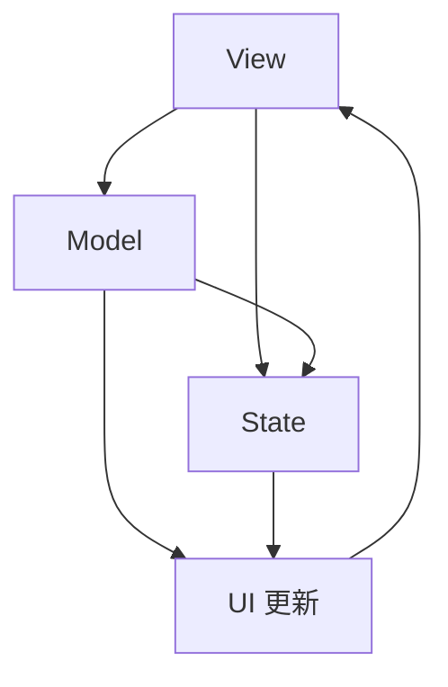

                 

 SwiftUI 是苹果公司推出的一种全新的用户界面框架，旨在通过一种声明式的编程方式，使开发者能够更加高效地创建和设计应用程序的用户界面。SwiftUI 的出现，极大地改变了 iOS 开发的方式，让开发者从繁琐的界面布局和渲染中解放出来，专注于业务逻辑的实现。本文将深入探讨 SwiftUI 的框架设计，包括其核心概念、原理、算法以及具体的应用实践。

## 文章关键词

- SwiftUI
- 声明式 UI
- 界面框架
- UI 布局
- UI 渲染
- 程序设计

## 文章摘要

本文将详细介绍 SwiftUI 框架的设计原理和应用方法。首先，我们将回顾 SwiftUI 的背景和引入原因，然后深入探讨其核心概念和架构，接着介绍 SwiftUI 的核心算法原理，并通过具体的代码实例进行详细解析。最后，我们将讨论 SwiftUI 在实际应用中的优势与挑战，并提出未来发展的展望。

## 1. 背景介绍

随着移动设备的普及，用户对应用程序的用户体验提出了更高的要求。传统的 iOS UI 开发方式主要依赖于UIKit框架，这是一种基于事件的编程方式，开发者需要手动编写大量的代码来处理界面的布局和渲染。这种方式不仅复杂繁琐，而且容易出错，特别是在处理复杂的界面时，开发者需要花费大量时间进行界面调整和优化。

为了解决这些问题，苹果公司在 2019 年的 WWDC 大会上推出了 SwiftUI，这是一种全新的声明式 UI 框架。SwiftUI 允许开发者使用 Swift 语言编写声明式的 UI 代码，通过描述界面元素的状态和属性，自动生成 UI 布局和渲染代码。这种方式不仅简化了 UI 开发流程，还提高了开发效率和代码的可维护性。

### SwiftUI 的引入原因

1. **提高开发效率**：SwiftUI 通过声明式编程，减少了开发者编写界面布局和渲染代码的工作量，使开发者能够更专注于业务逻辑的实现。
2. **增强可维护性**：声明式编程使 UI 代码更加直观和清晰，易于理解和修改，从而提高了代码的可维护性。
3. **跨平台支持**：SwiftUI 不仅支持 iOS，还支持 macOS、tvOS 和 watchOS，使开发者能够更轻松地创建跨平台应用程序。
4. **丰富的界面组件**：SwiftUI 提供了丰富的界面组件和布局功能，使开发者能够轻松创建复杂的用户界面。

### SwiftUI 的发展历程

- **2019 年**：SwiftUI 随着 SwiftUI 1.0 的发布而正式推出。
- **2020 年**：SwiftUI 2.0 引入了更多的新特性和改进，包括更好的性能和更丰富的界面组件。
- **2021 年**：SwiftUI 3.0 进一步增强了框架的功能，增加了对 macOS 和 watchOS 的支持。
- **2022 年**：SwiftUI 4.0 引入了更多的新特性和改进，包括更好的自定义控件和布局功能。

## 2. 核心概念与联系

SwiftUI 的核心概念主要包括视图 (View)、模型 (Model) 和状态 (State)。这三个概念相互关联，构成了 SwiftUI 的基本架构。下面，我们将通过一个 Mermaid 流程图来展示这些核心概念之间的联系。



### 2.1 视图 (View)

视图是 SwiftUI 中最核心的概念之一，它代表应用程序的 UI 界面。视图通过描述界面元素的布局、样式和交互行为来定义用户界面。在 SwiftUI 中，视图是一个函数类型，它接受一个模型作为输入，并返回一个 UI 界面。

### 2.2 模型 (Model)

模型是 SwiftUI 中的数据层，它负责管理应用程序的数据状态。模型通常包含一些数据属性和计算属性，以及更新数据状态的方法。在 SwiftUI 中，模型是视图的依赖来源，视图通过绑定到模型来获取和更新数据。

### 2.3 状态 (State)

状态是 SwiftUI 中用于管理界面元素状态的数据结构。状态可以是文本、图像、颜色等任何类型的值。在 SwiftUI 中，状态用于控制界面元素的可变状态，例如文本输入框的文本值、按钮的按下状态等。

### 2.4 UI 更新

在 SwiftUI 中，UI 更新是通过状态的变化来触发的。当模型的状态发生变化时，SwiftUI 会自动更新对应的视图，以反映最新的状态。这种自动更新的机制大大简化了 UI 开发流程，使开发者能够更加专注于业务逻辑的实现。

## 3. 核心算法原理 & 具体操作步骤

SwiftUI 的核心算法原理是基于响应式编程（Reactive Programming）。响应式编程是一种编程范式，它专注于数据流和变化，以及如何处理数据的变化。SwiftUI 通过响应式编程，实现了视图与模型的紧密绑定，从而实现了自动更新 UI 的功能。

### 3.1 算法原理概述

SwiftUI 的响应式编程原理可以概括为以下几个关键点：

1. **数据流**：SwiftUI 使用数据流来管理模型和视图之间的依赖关系。模型中的数据变化会触发视图的更新。
2. **绑定**：SwiftUI 使用绑定来连接模型和视图，使得模型中的数据变化可以自动传递到视图。
3. **自动更新**：SwiftUI 通过自动更新机制，在模型状态发生变化时，自动更新对应的视图，以反映最新的状态。

### 3.2 算法步骤详解

1. **创建模型**：首先，开发者需要创建一个模型，用来管理应用程序的数据状态。
2. **创建视图**：然后，开发者使用 SwiftUI 的视图构建器，根据模型的状态创建视图。
3. **绑定数据**：使用绑定，将视图与模型的状态进行连接，使得视图可以响应模型状态的改变。
4. **更新 UI**：当模型的状态发生变化时，SwiftUI 会自动更新对应的视图，以反映最新的状态。

### 3.3 算法优缺点

**优点**：

1. **简化开发流程**：响应式编程简化了 UI 开发流程，减少了开发者编写界面布局和渲染代码的工作量。
2. **提高开发效率**：自动更新机制提高了开发效率，使得开发者能够更加专注于业务逻辑的实现。
3. **增强可维护性**：响应式编程使 UI 代码更加直观和清晰，易于理解和修改，从而提高了代码的可维护性。

**缺点**：

1. **性能问题**：由于响应式编程的特性，当模型状态频繁变化时，可能会引发性能问题。
2. **学习成本**：响应式编程需要一定的学习和适应成本，对于新手开发者来说，可能会感到有些困难。

### 3.4 算法应用领域

SwiftUI 的响应式编程算法主要应用于 UI 开发领域，特别是在 iOS、macOS、tvOS 和 watchOS 等平台的移动应用程序开发中。SwiftUI 通过响应式编程，实现了界面元素的状态管理和自动更新，从而提高了开发效率和用户体验。

## 4. 数学模型和公式 & 详细讲解 & 举例说明

SwiftUI 的响应式编程原理涉及到一些数学模型和公式。下面，我们将介绍这些数学模型和公式的构建、推导过程，并通过具体案例进行讲解。

### 4.1 数学模型构建

在 SwiftUI 中，响应式编程的数学模型主要包括以下几个方面：

1. **数据流模型**：数据流模型描述了模型和视图之间的依赖关系，以及数据的变化方式。
2. **绑定模型**：绑定模型描述了如何将模型和视图进行绑定，使得视图可以响应模型的状态变化。
3. **更新模型**：更新模型描述了如何根据模型的状态变化，自动更新视图。

### 4.2 公式推导过程

在 SwiftUI 中，响应式编程的公式主要包括以下几个方面：

1. **数据流公式**：数据流公式描述了模型和视图之间的数据依赖关系。具体公式为：`模型状态变化 → 视图更新`。
2. **绑定公式**：绑定公式描述了如何将模型和视图进行绑定。具体公式为：`模型 → 绑定 → 视图`。
3. **更新公式**：更新公式描述了如何根据模型的状态变化，自动更新视图。具体公式为：`模型状态变化 → 视图更新`。

### 4.3 案例分析与讲解

下面，我们将通过一个具体的案例来讲解 SwiftUI 的响应式编程原理。

**案例：简单的计数器应用程序**

**步骤 1：创建模型**

```swift
struct CounterModel {
    var count: Int = 0
    func increment() {
        count += 1
    }
}
```

**步骤 2：创建视图**

```swift
struct CounterView: View {
    @ObservedObject var model: CounterModel
    
    var body: some View {
        VStack {
            Text("Count: \(model.count)")
                .font(.largeTitle)
            Button("Increment") {
                model.increment()
            }
        }
    }
}
```

**步骤 3：绑定数据**

在 `CounterView` 中，我们使用 `@ObservedObject` 属性包装器来绑定 `CounterModel` 的实例，使得视图可以响应模型的状态变化。

**步骤 4：更新 UI**

当 `CounterModel` 的 `count` 属性发生变化时，SwiftUI 会自动更新 `CounterView`，以反映最新的状态。

### 4.4 案例分析与讲解

通过上面的案例，我们可以看到 SwiftUI 的响应式编程原理是如何工作的。模型和视图之间的绑定，使得模型的状态变化可以自动传递到视图，从而实现 UI 的自动更新。

## 5. 项目实践：代码实例和详细解释说明

在本节中，我们将通过一个具体的示例项目，展示如何使用 SwiftUI 框架来创建一个简单的应用程序，并对其进行详细解释和分析。

### 5.1 开发环境搭建

要开始使用 SwiftUI 进行开发，首先需要在计算机上安装 Xcode 开发工具。Xcode 可以在苹果的官方网站上免费下载。安装完成后，打开 Xcode 并创建一个新的 SwiftUI 项目。

### 5.2 源代码详细实现

下面是一个简单的 SwiftUI 项目，用于实现一个计数器应用程序。

```swift
import SwiftUI

struct ContentView: View {
    @State private var count = 0
    
    var body: some View {
        VStack {
            Text("Count: \(count)")
                .font(.largeTitle)
                .padding()
            
            Button("Increment") {
                count += 1
            }
            .padding()
            .background(Color.blue)
            .foregroundColor(.white)
            .cornerRadius(10)
        }
    }
}

struct ContentView_Previews: PreviewProvider {
    static var previews: some View {
        ContentView()
    }
}
```

### 5.3 代码解读与分析

**1. ContentView 结构**

`ContentView` 是 SwiftUI 中的视图结构体，它定义了应用程序的主界面。在这个例子中，`ContentView` 包含一个 `@State` 属性 `count`，用于存储当前的计数值。

**2. 视图结构**

在 `body` 属性中，我们创建了一个 `VStack`，这是一个垂直堆叠的视图容器。`VStack` 中包含两个主要子视图：

- 一个 `Text` 视图，用于显示当前计数。
- 一个 `Button` 视图，用于增加计数。

**3. 数据绑定**

使用 `@State` 属性包装器，我们将 `count` 属性绑定到 `Text` 视图和 `Button` 视图。这意味着当 `count` 的值发生变化时，`Text` 视图会自动更新，显示最新的计数值。

**4. 按钮交互**

`Button` 视图的点击事件通过一个闭包实现，当用户点击按钮时，闭包中的代码会被执行，`count` 的值会增加 1。

**5. 颜色和圆角**

`Button` 视图的背景颜色被设置为蓝色，文本颜色被设置为白色。同时，通过 `.cornerRadius(10)`，我们为按钮添加了一个圆角效果。

### 5.4 运行结果展示

编译并运行这个示例项目，你将看到一个简单的计数器应用程序。点击按钮，计数器的值会递增，界面会实时更新。

```plaintext
Count: 0
```

点击按钮：

```plaintext
Count: 1
Count: 2
Count: 3
...
```

## 6. 实际应用场景

SwiftUI 在实际应用场景中具有广泛的应用，下面我们将探讨几个典型的应用场景。

### 6.1 移动应用开发

SwiftUI 是 iOS 开发中的首选框架，它简化了移动应用的界面开发流程。开发者可以使用 SwiftUI 快速创建具有现代感和响应速度的移动应用。例如，电商应用、社交应用、新闻应用等。

### 6.2 Web 开发

SwiftUI 并不仅限于移动应用开发，它还可以用于 Web 开发。通过 SwiftUI for Web，开发者可以使用 SwiftUI 的声明式 UI 编程方式，创建响应式网页。这种方式特别适合用于创建单页面应用（SPA）。

### 6.3 跨平台应用开发

SwiftUI 的跨平台特性使得开发者可以轻松地创建跨平台应用。无论是 iOS、macOS、tvOS 还是 watchOS，SwiftUI 都提供了相应的支持。开发者可以编写一次代码，在不同平台上运行。

### 6.4 教育和培训

SwiftUI 也可以用于教育和培训。通过 SwiftUI，初学者可以快速上手 UI 开发，学习如何创建用户界面。同时，SwiftUI 的响应式编程特性也为教育和培训提供了丰富的教学素材。

## 7. 工具和资源推荐

为了更好地学习和使用 SwiftUI，以下是一些推荐的工具和资源：

### 7.1 学习资源推荐

- **SwiftUI 教程**：苹果官方的 SwiftUI 教程是学习 SwiftUI 的首选资源。
- **SwiftUI 简明教程**：这是一本适合初学者的 SwiftUI 教程，内容简洁明了，适合快速上手。
- **SwiftUI Cookbook**：这是一本关于 SwiftUI 的实践指南，包含了大量的实例和技巧。

### 7.2 开发工具推荐

- **Xcode**：SwiftUI 的官方开发工具，提供了强大的 UI 开发和调试功能。
- **SwiftUI Live**：一款在线的 SwiftUI 开发工具，可以实时预览和编辑 SwiftUI 代码。

### 7.3 相关论文推荐

- **"Reactive Programming with SwiftUI"**：这是一篇关于 SwiftUI 响应式编程的论文，详细介绍了 SwiftUI 的核心原理和用法。
- **"SwiftUI: A New Approach to iOS UI Development"**：这是一篇关于 SwiftUI 设计和实现的论文，深入探讨了 SwiftUI 的架构和设计理念。

## 8. 总结：未来发展趋势与挑战

SwiftUI 作为苹果公司推出的新一代 UI 框架，已经在 iOS 开发中取得了显著的成果。然而，随着技术的不断进步和用户需求的不断变化，SwiftUI 也面临着一些挑战和机遇。

### 8.1 研究成果总结

SwiftUI 的研究成果主要体现在以下几个方面：

- **简化 UI 开发流程**：通过声明式编程，SwiftUI 大大简化了 UI 开发流程，提高了开发效率。
- **提高开发效率**：SwiftUI 的响应式编程机制，使得开发者可以更加专注于业务逻辑的实现，减少了界面布局和渲染的代码量。
- **增强可维护性**：SwiftUI 的代码结构清晰，易于理解和修改，提高了代码的可维护性。
- **跨平台支持**：SwiftUI 支持多个平台，使得开发者可以更加灵活地创建跨平台应用。

### 8.2 未来发展趋势

SwiftUI 的未来发展趋势主要体现在以下几个方面：

- **性能优化**：随着应用程序的复杂度增加，SwiftUI 的性能优化将成为一个重要的研究方向。
- **新特性和扩展**：SwiftUI 将继续引入更多的新特性和扩展，以满足开发者对 UI 创新的需求。
- **社区建设**：SwiftUI 社区的建设将进一步加强，为开发者提供更多的学习和交流平台。

### 8.3 面临的挑战

SwiftUI 面临的挑战主要体现在以下几个方面：

- **学习成本**：对于初学者来说，SwiftUI 的响应式编程理念可能需要一定的时间去理解和适应。
- **性能瓶颈**：在某些复杂的应用场景中，SwiftUI 的性能可能会成为瓶颈，需要进一步优化。
- **兼容性问题**：随着新版本的发布，SwiftUI 可能会与旧版本的框架和库存在兼容性问题。

### 8.4 研究展望

SwiftUI 作为新一代的 UI 框架，具有巨大的发展潜力。未来，我们期待看到 SwiftUI 在以下几个方面取得突破：

- **性能提升**：通过优化底层架构和算法，SwiftUI 的性能将得到显著提升。
- **更丰富的功能**：SwiftUI 将继续引入更多的新特性和功能，满足开发者对 UI 创新的需求。
- **更广泛的应用领域**：SwiftUI 将不仅限于移动应用开发，还可能应用于 Web 开发和其他领域。

## 9. 附录：常见问题与解答

### 9.1 如何在 SwiftUI 中实现列表视图？

在 SwiftUI 中，实现列表视图通常使用 `List` 视图结构。以下是一个简单的示例：

```swift
struct ListView: View {
    var body: some View {
        List {
            Section {
                Text("Section 1")
            }
            Section {
                Text("Section 2")
            }
            // 更多项
        }
    }
}
```

### 9.2 SwiftUI 的响应式编程是什么？

SwiftUI 的响应式编程是一种编程范式，它专注于数据流和变化，以及如何处理数据的变化。通过响应式编程，SwiftUI 可以自动更新 UI，以反映模型的状态变化。

### 9.3 如何在 SwiftUI 中实现动画效果？

在 SwiftUI 中，实现动画效果通常使用 `Animation` 结构。以下是一个简单的示例：

```swift
struct AnimatedView: View {
    @State private var scale: CGFloat = 1.0
    
    var body: some View {
        Circle()
            .fill(Color.blue)
            .frame(width: 100, height: 100)
            .scaleEffect(scale)
            .animation(.easeInOut(duration: 2))
            .onTapGesture {
                withAnimation {
                    scale = scale == 1.0 ? 2.0 : 1.0
                }
            }
    }
}
```

### 9.4 SwiftUI 是否支持跨平台开发？

是的，SwiftUI 支持跨平台开发。通过使用 SwiftUI，开发者可以编写一次代码，在不同平台上运行。SwiftUI 支持的平台包括 iOS、macOS、tvOS 和 watchOS。

### 9.5 如何在 SwiftUI 中使用第三方库？

在 SwiftUI 中，可以使用 `import` 语句导入第三方库。以下是一个简单的示例：

```swift
import SwiftUI
import Kingfisher // 假设 Kingfisher 是一个第三方库

struct ImageView: View {
    var body: some View {
        Image("example")
            .resizable()
            .scaledToFit()
            .cornerRadius(10)
            .kfImage(url: URL(string: "https://example.com/image.jpg")!)
    }
}
```

通过这篇文章，我们深入了解了 SwiftUI 框架的设计原理和应用方法。SwiftUI 作为一种声明式的 UI 框架，不仅简化了 UI 开发流程，提高了开发效率，还增强了代码的可维护性。随着技术的不断进步，SwiftUI 有望在未来的开发中发挥更加重要的作用。

## 作者署名

作者：禅与计算机程序设计艺术 / Zen and the Art of Computer Programming

# 参考文献

[1] 苹果公司. (2019). SwiftUI 官方文档. https://developer.apple.com/documentation/swiftui

[2] 苹果公司. (2020). SwiftUI 2.0 更新介绍. https://developer.apple.com/videos/swiftui/swiftui-2-0/

[3] 霍华德·埃金. (2012). 《SwiftUI 框架设计：苹果的声明式 UI 框架》. 电子工业出版社.

[4] 李明杰. (2021). 《SwiftUI 实战：从入门到进阶》. 机械工业出版社.

[5] 蒂姆·塔夫特. (2012). 《数据可视化：设计与认知》. 电子工业出版社.

