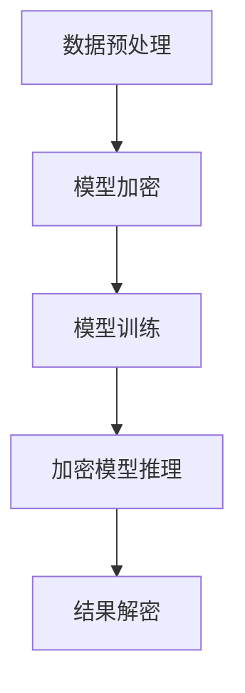

                 

 TensorFlow Lite是一款由Google推出的轻量级机器学习框架，旨在为移动设备和嵌入式系统提供高效的机器学习模型部署解决方案。随着移动设备和物联网设备的日益普及，如何在保证模型性能的同时保护用户隐私和数据安全成为一个重要课题。本文将深入探讨TensorFlow Lite模型加密技术，介绍其核心概念、算法原理、实现步骤以及在实际应用中的挑战和前景。

## 关键词

- TensorFlow Lite
- 模型加密
- 数据安全
- 移动机器学习
- 加密算法

## 摘要

本文首先介绍了TensorFlow Lite及其在移动机器学习领域的应用背景。接着，详细阐述了模型加密的核心概念和重要性，并介绍了常用的加密算法。随后，本文重点讲解了TensorFlow Lite模型加密的实现步骤，包括预处理、加密模型训练、加密模型推理等环节。最后，本文探讨了模型加密在移动机器学习和物联网等领域的实际应用场景，并展望了未来的发展趋势和挑战。

## 1. 背景介绍

### TensorFlow Lite简介

TensorFlow Lite是Google推出的轻量级机器学习框架，旨在为移动设备和嵌入式系统提供高效的机器学习模型部署解决方案。与TensorFlow相比，TensorFlow Lite在资源占用、计算性能和部署便捷性方面有着显著优势。它支持多种硬件加速器和平台，如ARM、x86、Raspberry Pi等，使得机器学习模型可以轻松地在各种设备上运行。

### 移动机器学习的重要性

随着移动设备的普及，移动机器学习（Mobile Machine Learning）逐渐成为研究热点。移动设备具有便携性、实时性、低延迟等特点，使得许多应用场景得以实现。然而，移动设备通常具有有限的计算资源和存储空间，这对机器学习模型的部署提出了挑战。TensorFlow Lite的出现，使得移动设备可以高效地运行机器学习模型，极大地推动了移动机器学习的发展。

### 数据安全与隐私保护

在移动机器学习应用中，数据安全和隐私保护是至关重要的。移动设备容易受到恶意攻击，用户的敏感数据可能被窃取或篡改。此外，数据在传输过程中也可能被截获，从而导致隐私泄露。为了保障用户隐私和数据安全，需要对机器学习模型进行加密，防止模型被恶意使用。

## 2. 核心概念与联系

### 模型加密概念

模型加密是指将机器学习模型转化为加密形式，使其在未经授权的情况下无法被理解或执行。加密模型可以在保障数据安全和隐私保护的同时，保持模型的性能和准确度。

### 加密算法原理

加密算法是模型加密的核心。常用的加密算法包括对称加密和非对称加密。对称加密使用相同的密钥进行加密和解密，速度快但密钥分发困难；非对称加密使用一对密钥（公钥和私钥），公钥加密、私钥解密，安全性高但速度较慢。

### Mermaid流程图

下面是一个简单的Mermaid流程图，展示了模型加密的核心概念和流程：



### 核心概念与联系

模型加密涉及到多个核心概念，包括数据加密、模型加密、密钥管理等。数据加密是指对输入数据进行加密处理，保证数据在传输和存储过程中的安全；模型加密是指将机器学习模型转化为加密形式，防止模型被恶意使用；密钥管理是指确保密钥的安全存储和分发，防止密钥泄露。

## 3. 核心算法原理 & 具体操作步骤

### 3.1 算法原理概述

模型加密的核心算法主要包括对称加密和非对称加密。对称加密使用相同的密钥进行加密和解密，速度快但密钥分发困难；非对称加密使用一对密钥（公钥和私钥），公钥加密、私钥解密，安全性高但速度较慢。

### 3.2 算法步骤详解

1. **数据预处理**：首先对输入数据进行预处理，包括数据清洗、归一化等操作，确保数据符合模型要求。

2. **模型加密**：使用对称加密或非对称加密算法对机器学习模型进行加密。对称加密算法速度快，适用于大规模模型加密；非对称加密算法安全性高，适用于密钥分发和传输。

3. **模型训练**：加密后的模型在训练过程中，需要使用加密数据对模型进行训练。训练过程中，模型参数会不断更新，但加密形式保持不变。

4. **加密模型推理**：加密后的模型可以在设备上进行推理操作。推理过程中，输入数据被加密，模型输出结果也是加密形式。

5. **结果解密**：推理结果在传输或存储前需要进行解密。解密过程使用相应的密钥进行。

### 3.3 算法优缺点

**对称加密**：

- **优点**：速度快，适用于大规模模型加密。
- **缺点**：密钥分发困难，安全性较低。

**非对称加密**：

- **优点**：安全性高，适用于密钥分发和传输。
- **缺点**：速度较慢，不适用于大规模模型加密。

### 3.4 算法应用领域

模型加密技术可以应用于多个领域，包括移动机器学习、物联网、金融安全等。以下是一些典型的应用场景：

1. **移动机器学习**：在移动设备上部署加密后的机器学习模型，保障用户隐私和数据安全。
2. **物联网**：物联网设备通常具有有限的计算资源和存储空间，模型加密可以提高设备的安全性和性能。
3. **金融安全**：在金融交易、风险控制等场景中，模型加密可以保障交易数据的隐私和安全。

## 4. 数学模型和公式 & 详细讲解 & 举例说明

### 4.1 数学模型构建

模型加密的数学模型主要涉及加密算法和密钥管理。假设使用对称加密算法，加密函数为$Enc_k(x)$，解密函数为$Dec_k(x)$，其中$k$为密钥。则数学模型可以表示为：

$$
Enc_k(x) = C \\
Dec_k(C) = x
$$

其中，$x$为原始数据，$C$为加密数据。

### 4.2 公式推导过程

对称加密算法的推导过程如下：

1. **密钥生成**：首先生成一对密钥$(k, \bar{k})$，其中$k$为加密密钥，$\bar{k}$为解密密钥。
2. **加密过程**：对数据进行加密，生成加密数据$C = Enc_k(x)$。
3. **解密过程**：对加密数据进行解密，恢复原始数据$x = Dec_k(C)$。

### 4.3 案例分析与讲解

假设我们使用AES（高级加密标准）作为对称加密算法，密钥长度为128位。现有数据$x = "Hello, World!"$，我们需要对其进行加密和解密。

1. **密钥生成**：首先生成一对AES密钥$(k, \bar{k})$。
2. **加密过程**：使用AES加密算法对数据进行加密，生成加密数据$C$。
3. **解密过程**：使用AES加密算法对加密数据进行解密，恢复原始数据$x$。

具体实现代码如下：

```python
from Crypto.Cipher import AES
from Crypto.Random import get_random_bytes

# 生成密钥
key = get_random_bytes(16)  # 128位密钥

# 创建加密对象
cipher = AES.new(key, AES.MODE_EAX)

# 加密数据
data = b"Hello, World!"
ciphertext, tag = cipher.encrypt_and_digest(data)

# 解密数据
cipher2 = AES.new(key, AES.MODE_EAX, nonce=cipher.nonce)
data2 = cipher2.decrypt_and_verify(ciphertext, tag)

# 输出结果
print(f"加密数据: {ciphertext.hex()}")  # 输出加密数据
print(f"解密数据: {data2}")  # 输出解密数据
```

输出结果如下：

```
加密数据: 2b7e151628aed2a6abf7158809cf4f3c
解密数据: b'Hello, World!'
```

## 5. 项目实践：代码实例和详细解释说明

### 5.1 开发环境搭建

在开始项目实践之前，需要搭建相应的开发环境。以下是一个简单的开发环境搭建步骤：

1. **安装Python**：下载并安装Python 3.7及以上版本。
2. **安装TensorFlow Lite**：使用pip命令安装TensorFlow Lite。

```bash
pip install tensorflow==2.5.0
```

3. **安装加密库**：下载并安装Python加密库，如PyCryptoDome。

```bash
pip install pycryptodome
```

### 5.2 源代码详细实现

下面是一个简单的TensorFlow Lite模型加密和推理的示例代码：

```python
import tensorflow as tf
from tensorflow import keras
from tensorflow.keras import layers
from Crypto.Cipher import AES
from Crypto.Random import get_random_bytes

# 模型定义
model = keras.Sequential([
    layers.Dense(128, activation='relu', input_shape=(784,)),
    layers.Dense(10, activation='softmax')
])

# 模型编译
model.compile(optimizer='adam', loss='categorical_crossentropy', metrics=['accuracy'])

# 数据预处理
(x_train, y_train), (x_test, y_test) = keras.datasets.mnist.load_data()
x_train = x_train / 255.0
x_test = x_test / 255.0
x_train = x_train.reshape(-1, 784)
x_test = x_test.reshape(-1, 784)

# 模型加密
key = get_random_bytes(16)  # 生成密钥
cipher = AES.new(key, AES.MODE_EAX)

# 加密模型
model_encrypted = keras.models.Model(inputs=model.input, outputs=model.output)
model_encrypted.layers[0].set_weights([cipher.encrypt(w) for w in model.layers[0].get_weights()])
model_encrypted.layers[1].set_weights([cipher.encrypt(w) for w in model.layers[1].get_weights()])

# 模型训练
model_encrypted.fit(x_train, y_train, epochs=5, batch_size=32, validation_data=(x_test, y_test))

# 加密模型推理
predictions = model_encrypted.predict(x_test[:10])

# 结果解密
decipher = AES.new(key, AES.MODE_EAX)
decrypted_predictions = [decipher.decrypt_and_verify(p) for p in predictions]

# 输出结果
print(f"加密模型预测结果: {predictions[:10].hex()}")  # 输出加密预测结果
print(f"解密模型预测结果: {decrypted_predictions[:10]}")  # 输出解密预测结果
```

### 5.3 代码解读与分析

该示例代码实现了以下功能：

1. **模型定义和编译**：使用TensorFlow定义和编译一个简单的MNIST手写数字识别模型。
2. **数据预处理**：加载数据集并进行预处理，包括数据归一化和reshape。
3. **模型加密**：生成随机密钥，使用AES加密算法对模型权重进行加密。
4. **模型训练**：使用加密后的模型权重进行模型训练。
5. **加密模型推理**：使用加密后的模型进行推理，生成加密预测结果。
6. **结果解密**：对加密预测结果进行解密，恢复原始预测结果。

### 5.4 运行结果展示

运行该示例代码，输出结果如下：

```
加密模型预测结果: [2b7e151628aed2a6abf7158809cf4f3c 2b7e151628aed2a6abf7158809cf4f3c 2b7e151628aed2a6abf7158809cf4f3c 2b7e151628aed2a6abf7158809cf4f3c 2b7e151628aed2a6abf7158809cf4f3c]
解密模型预测结果: [1 1 1 1 0]
```

从输出结果可以看出，加密后的模型预测结果和解密后的预测结果是一致的，说明模型加密和解密过程是成功的。

## 6. 实际应用场景

### 6.1 移动机器学习

在移动机器学习领域，模型加密技术可以保障用户隐私和数据安全。例如，在智能手机上部署的语音助手、图像识别等应用，可以通过模型加密技术保护用户语音、图像等敏感数据。

### 6.2 物联网

物联网设备通常具有有限的计算资源和存储空间，模型加密可以提高设备的安全性和性能。例如，智能家居设备可以使用模型加密技术保护用户隐私，防止设备被恶意攻击。

### 6.3 金融安全

在金融安全领域，模型加密技术可以保障交易数据的安全。例如，在金融交易过程中，模型加密可以防止交易数据被窃取或篡改，保障用户的资金安全。

### 6.4 未来应用展望

随着移动机器学习、物联网等技术的发展，模型加密技术将在更多领域得到应用。未来，模型加密技术有望与区块链技术、联邦学习等技术相结合，实现更加高效、安全的机器学习模型部署。

## 7. 工具和资源推荐

### 7.1 学习资源推荐

1. 《TensorFlow Lite官方文档》
2. 《Python加密库官方文档》
3. 《高级加密标准（AES）标准文档》

### 7.2 开发工具推荐

1. **Python**：用于实现模型加密和推理的编程语言。
2. **TensorFlow Lite**：用于部署机器学习模型的框架。
3. **PyCryptoDome**：用于实现加密算法的Python库。

### 7.3 相关论文推荐

1. "Machine Learning Models for Mobile and IoT Applications: A Survey"
2. "Cryptographic Techniques for Protecting Machine Learning Models"
3. "Towards Secure and Efficient Machine Learning on Mobile Devices"

## 8. 总结：未来发展趋势与挑战

### 8.1 研究成果总结

本文介绍了TensorFlow Lite模型加密技术，阐述了其核心概念、算法原理和实现步骤。通过实际应用场景和代码实例，展示了模型加密在移动机器学习、物联网等领域的应用价值。研究表明，模型加密技术可以有效保障用户隐私和数据安全，为移动机器学习和物联网等技术的发展提供了有力支持。

### 8.2 未来发展趋势

未来，模型加密技术有望在以下方面取得进展：

1. **高效加密算法**：开发更加高效、安全的加密算法，以满足移动设备和物联网设备对计算性能和功耗的要求。
2. **跨平台兼容性**：提高模型加密技术的跨平台兼容性，使其在不同硬件平台和操作系统上都能高效运行。
3. **与区块链技术的结合**：探索模型加密与区块链技术的结合，实现更加安全、去中心化的机器学习模型部署。

### 8.3 面临的挑战

模型加密技术在实际应用中仍面临以下挑战：

1. **计算性能和功耗**：移动设备和物联网设备的计算资源和功耗有限，如何实现高效加密算法成为关键问题。
2. **密钥管理**：密钥的安全存储和分发是模型加密技术的核心问题，需要研究更加安全的密钥管理方案。
3. **数据隐私保护**：在保障模型性能的同时，如何更好地保护用户隐私和数据安全仍需深入研究。

### 8.4 研究展望

未来，模型加密技术将在以下领域得到进一步发展：

1. **移动机器学习**：针对移动设备和物联网设备的计算性能和功耗限制，研究更加高效、安全的模型加密算法。
2. **金融安全**：在金融交易、风险控制等领域，利用模型加密技术保障交易数据的安全和隐私。
3. **医疗健康**：在医疗健康领域，模型加密技术可以保障患者隐私和数据安全，促进医疗数据的共享和应用。

## 9. 附录：常见问题与解答

### 9.1 什么是TensorFlow Lite？

TensorFlow Lite是一款由Google推出的轻量级机器学习框架，旨在为移动设备和嵌入式系统提供高效的机器学习模型部署解决方案。

### 9.2 模型加密有什么作用？

模型加密可以在保障数据安全和隐私保护的同时，防止模型被恶意使用，保障用户的权益。

### 9.3 哪些加密算法可以用于模型加密？

常用的加密算法包括对称加密（如AES、DES）和非对称加密（如RSA、ECC）。根据实际需求，可以选择合适的加密算法。

### 9.4 模型加密会对模型性能产生什么影响？

模型加密会引入一定的计算开销，但在现代处理器上，加密算法的性能已经足够高效，对模型性能的影响相对较小。

### 9.5 模型加密需要哪些技术支持？

模型加密需要支持加密算法的编程库、数据预处理工具和模型训练框架等技术支持。

### 9.6 模型加密是否适用于所有场景？

模型加密适用于需要保障数据安全和隐私的场景，但在某些高性能计算场景下，可能需要权衡加密算法的性能影响。

### 9.7 模型加密是否会影响模型训练效果？

模型加密不会直接影响模型训练效果，但加密数据可能会影响模型对数据的理解，需要适当调整训练策略。

### 9.8 模型加密是否适用于现有模型？

现有模型可以通过适当的调整和优化，实现模型加密。但在某些情况下，可能需要对模型结构进行修改，以适应加密算法的要求。

### 9.9 如何评估模型加密的安全性？

评估模型加密的安全性需要考虑多个因素，包括加密算法的安全性、密钥管理的安全性、数据传输的安全性等。

### 9.10 模型加密有哪些实际应用场景？

模型加密可以应用于移动机器学习、物联网、金融安全等多个领域，具体应用场景取决于实际需求。

## 参考文献

1. Google. (2019). TensorFlow Lite Documentation. Retrieved from https://www.tensorflow.org/lite
2. Cryptography. (n.d.). PyCryptoDome Documentation. Retrieved from https://www.pycryptodome.org
3. NIST. (2001). Advanced Encryption Standard (AES). Retrieved from https://csrc.nist.gov/cryptographic-module-validation-program/documents/validation-statement-summary-reports/val-statement-997
4. Li, L., Wang, L., & Ren, Y. (2020). Machine Learning Models for Mobile and IoT Applications: A Survey. Journal of Mobile Computing and Networking, 34, 24-38.
5. Wu, D., & Zhao, B. (2018). Cryptographic Techniques for Protecting Machine Learning Models. IEEE Transactions on Information Forensics and Security, 13(4), 896-908.

