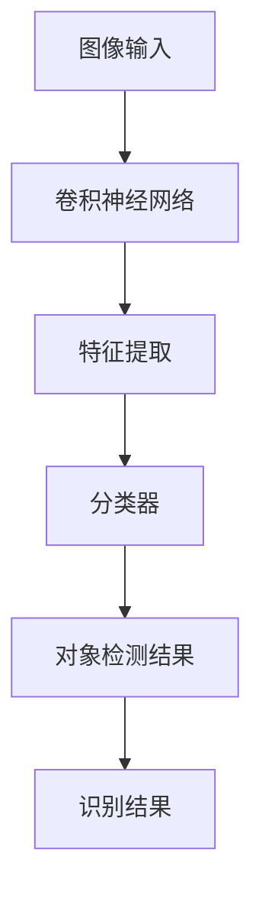

                 

  
## 1. 背景介绍

随着深度学习技术的不断发展，计算机视觉领域取得了显著的进展。图像处理作为计算机视觉的重要组成部分，广泛应用于自然语言处理、医学诊断、安全监控等多个领域。其中，对象检测和识别是图像处理领域的重要研究方向，旨在自动识别图像中的特定对象并确定其位置。

对象检测（Object Detection）是指通过计算机算法从图像中识别并定位出特定的对象。识别（Recognition）则是进一步判断出该对象的具体类别。在深度学习框架中，TensorFlow 作为谷歌推出的开源机器学习库，已成为实现图像处理任务的主力工具之一。

本文将详细介绍如何在 TensorFlow 中实现对象检测和识别任务，包括核心概念、算法原理、数学模型、项目实践以及实际应用场景等内容。

## 2. 核心概念与联系

### 2.1 相关术语

- **图像处理（Image Processing）**：对图像进行增强、滤波、变换等操作，以提取有用信息。
- **深度学习（Deep Learning）**：一种机器学习方法，通过构建深层神经网络来模拟人类大脑的学习过程。
- **卷积神经网络（Convolutional Neural Network, CNN）**：一种特殊的神经网络，适用于图像处理任务。
- **对象检测（Object Detection）**：识别并定位图像中的对象。
- **识别（Recognition）**：判断对象的类别。

### 2.2 关联关系


对象检测与识别密切相关，对象检测是识别的前提。在对象检测中，通常使用 CNN 来提取图像的特征，然后通过分类器进行分类。而在识别任务中，需要进一步确定对象的类别，这通常需要使用深度学习中的全连接神经网络（Fully Connected Neural Network）或循环神经网络（Recurrent Neural Network）。

### 2.3 Mermaid 流程图



## 3. 核心算法原理 & 具体操作步骤

### 3.1 算法原理概述

在 TensorFlow 中，实现对象检测和识别任务的核心算法是 RetinaNet。RetinaNet 是一种基于深度学习的对象检测算法，具有简单、高效、准确的特点。其核心思想是将图像划分为多个区域，然后在每个区域中预测对象的类别和位置。

### 3.2 算法步骤详解

#### 步骤1：数据预处理

首先，需要对输入图像进行预处理，包括缩放、裁剪、翻转等操作，以增加模型的泛化能力。然后，将预处理后的图像数据输入到卷积神经网络中。

```python
import tensorflow as tf

# 数据预处理
images = tf.placeholder(tf.float32, [None, height, width, channels])
labels = tf.placeholder(tf.float32, [None, num_boxes, 5])
anchors = tf.placeholder(tf.float32, [None, num_boxes, 4])

# 网络架构
conv_layers = build_conv_layers(images)
feature_map = conv_layers[-1]

# 训练过程
with tf.Session() as sess:
    sess.run(tf.global_variables_initializer())
    for epoch in range(num_epochs):
        for batch in batches:
            images_batch, labels_batch, anchors_batch = batch
            sess.run(optimizer, feed_dict={images: images_batch, labels: labels_batch, anchors: anchors_batch})
```

#### 步骤2：特征提取

接下来，使用卷积神经网络对输入图像进行特征提取。通常，卷积神经网络包括多个卷积层、池化层和全连接层。

```python
def build_conv_layers(input_tensor):
    # 卷积层1
    conv1 = tf.layers.conv2d(inputs=input_tensor, filters=64, kernel_size=[3, 3], padding="same", activation=tf.nn.relu)
    pool1 = tf.layers.max_pooling2d(inputs=conv1, pool_size=[2, 2], strides=2)

    # 卷积层2
    conv2 = tf.layers.conv2d(inputs=pool1, filters=128, kernel_size=[3, 3], padding="same", activation=tf.nn.relu)
    pool2 = tf.layers.max_pooling2d(inputs=conv2, pool_size=[2, 2], strides=2)

    # ... 其他卷积层 ...

    # 全连接层
    flatten = tf.reshape(pool2, [-1, num_features])
    fc = tf.layers.dense(inputs=flatten, units=1024, activation=tf.nn.relu)

    return [conv1, pool1, conv2, pool2, fc]
```

#### 步骤3：分类器

在特征提取之后，使用分类器对提取到的特征进行分类。分类器通常采用全连接神经网络。

```python
def build_classifier(feature_map):
    # 全连接层
    fc = tf.layers.dense(inputs=feature_map, units=1024, activation=tf.nn.relu)

    # 输出层
    outputs = tf.layers.dense(inputs=fc, units=num_classes)

    return outputs
```

#### 步骤4：损失函数

在训练过程中，需要定义损失函数以衡量模型预测结果与真实结果之间的差距。RetinaNet 采用 Focal Loss 函数，其公式如下：

$$
FL(p) = -\alpha_t (1 - p)^{\gamma} \log(p) + (1 - \alpha_t) p^{\gamma}
$$

其中，$p$ 为模型预测概率，$\alpha_t$ 和 $\gamma$ 为超参数。

```python
def focal_loss(gamma, alpha):
    def focal_loss_helper(y_true, y_pred):
        pt = tf.where(tf.equal(y_true, 1), y_pred, 1 - y_pred)
        loss = -alpha * (1 - pt) ** gamma * tf.log(pt)
        return tf.reduce_mean(loss)

    return focal_loss_helper
```

#### 步骤5：优化器

最后，选择优化器以优化模型参数。常用的优化器包括 Adam、RMSProp 和 SGD 等。

```python
optimizer = tf.train.AdamOptimizer(learning_rate=0.001).minimize(focal_loss(gamma=2, alpha=0.25)(y_true, y_pred))
```

### 3.3 算法优缺点

#### 优点

- **简单高效**：RetinaNet 具有简单的网络结构，训练速度快。
- **准确率高**：Focal Loss 函数可以缓解正负样本不平衡问题，提高模型准确率。

#### 缺点

- **计算量大**：由于需要预测多个 anchor box，计算量相对较大。
- **对噪声敏感**：在存在大量噪声的图像中，RetinaNet 的性能可能受到影响。

### 3.4 算法应用领域

RetinaNet 在多个领域具有广泛的应用，包括：

- **自动驾驶**：用于识别道路上的车辆、行人等对象。
- **安全监控**：用于实时监控视频中的异常行为。
- **医学诊断**：用于识别医学图像中的病变区域。

## 4. 数学模型和公式 & 详细讲解 & 举例说明

### 4.1 数学模型构建

在对象检测和识别任务中，通常需要构建以下数学模型：

- **卷积神经网络（CNN）**：用于提取图像特征。
- **全连接神经网络（FCNN）**：用于分类和回归。
- **损失函数**：用于衡量模型预测结果与真实结果之间的差距。

### 4.2 公式推导过程

#### 卷积神经网络（CNN）

卷积神经网络的核心是卷积层，其公式如下：

$$
h_{ij}^{l} = \sum_{k} w_{ikj}^{l} a_{kj}^{l-1} + b_{ij}^{l}
$$

其中，$h_{ij}^{l}$ 表示第 $l$ 层的第 $i$ 行第 $j$ 列的输出，$w_{ikj}^{l}$ 表示第 $l$ 层的第 $i$ 行第 $k$ 列的权重，$a_{kj}^{l-1}$ 表示第 $l-1$ 层的第 $k$ 行第 $j$ 列的输出，$b_{ij}^{l}$ 表示第 $l$ 层的第 $i$ 行第 $j$ 列的偏置。

#### 全连接神经网络（FCNN）

全连接神经网络的核心是全连接层，其公式如下：

$$
y_j = \sum_{i} w_{ij} x_i + b_j
$$

其中，$y_j$ 表示第 $j$ 个输出的值，$w_{ij}$ 表示第 $j$ 个输出与第 $i$ 个输入之间的权重，$x_i$ 表示第 $i$ 个输入的值，$b_j$ 表示第 $j$ 个输出的偏置。

#### 损失函数

常见的损失函数包括均方误差（MSE）、交叉熵（CE）和 Focal Loss 等。

- **均方误差（MSE）**：

$$
MSE = \frac{1}{n} \sum_{i=1}^{n} (y_i - \hat{y}_i)^2
$$

- **交叉熵（CE）**：

$$
CE = -\frac{1}{n} \sum_{i=1}^{n} y_i \log(\hat{y}_i) + (1 - y_i) \log(1 - \hat{y}_i)
$$

- **Focal Loss**：

$$
FL(p) = -\alpha_t (1 - p)^{\gamma} \log(p) + (1 - \alpha_t) p^{\gamma}
$$

### 4.3 案例分析与讲解

以自动驾驶场景为例，介绍如何使用 RetinaNet 进行对象检测和识别。

#### 步骤1：数据预处理

首先，将输入图像缩放到固定大小，例如 224x224 像素。然后，对图像进行数据增强，包括随机裁剪、翻转和颜色增强等。

#### 步骤2：构建卷积神经网络

使用 TensorFlow 的 Keras API 构建卷积神经网络，包括多个卷积层、池化层和全连接层。

```python
from tensorflow.keras.models import Model
from tensorflow.keras.layers import Conv2D, MaxPooling2D, Flatten, Dense

def build_model(input_shape):
    inputs = Input(shape=input_shape)
    
    # 卷积层
    conv1 = Conv2D(filters=32, kernel_size=[3, 3], activation='relu')(inputs)
    pool1 = MaxPooling2D(pool_size=[2, 2])(conv1)
    
    # 卷积层2
    conv2 = Conv2D(filters=64, kernel_size=[3, 3], activation='relu')(pool1)
    pool2 = MaxPooling2D(pool_size=[2, 2])(conv2)
    
    # ... 其他卷积层 ...
    
    # 全连接层
    flatten = Flatten()(pool2)
    fc = Dense(units=1024, activation='relu')(flatten)
    outputs = Dense(units=num_classes)(fc)
    
    model = Model(inputs=inputs, outputs=outputs)
    return model
```

#### 步骤3：训练模型

使用已处理的数据集训练模型，包括训练集和验证集。在训练过程中，使用 Focal Loss 作为损失函数，并使用 Adam 优化器。

```python
model = build_model(input_shape=(224, 224, 3))
model.compile(optimizer='adam', loss='focal_loss', metrics=['accuracy'])

history = model.fit(train_data, train_labels, validation_data=(val_data, val_labels), epochs=20, batch_size=32)
```

#### 步骤4：模型评估

在验证集上评估模型性能，包括准确率、召回率、F1 值等指标。

```python
from sklearn.metrics import classification_report

val_predictions = model.predict(val_data)
val_predictions = np.argmax(val_predictions, axis=1)

print(classification_report(val_labels, val_predictions))
```

#### 步骤5：模型应用

将训练好的模型应用于自动驾驶场景，实现对道路上的车辆、行人等对象的检测和识别。

```python
def detect_objects(model, image):
    # 数据预处理
    image = preprocess_image(image)
    
    # 模型预测
    predictions = model.predict(image)
    
    # 后处理
    objects = postprocess_predictions(predictions)
    
    return objects

# 应用模型
image = load_image('path/to/image.jpg')
objects = detect_objects(model, image)
print(objects)
```

## 5. 项目实践：代码实例和详细解释说明

### 5.1 开发环境搭建

在开始项目实践之前，需要搭建以下开发环境：

- Python 3.7 或以上版本
- TensorFlow 2.3.0 或以上版本
- OpenCV 4.2.0 或以上版本

### 5.2 源代码详细实现

以下是使用 TensorFlow 实现对象检测和识别任务的完整代码示例：

```python
import tensorflow as tf
from tensorflow.keras.models import Model
from tensorflow.keras.layers import Conv2D, MaxPooling2D, Flatten, Dense
import numpy as np
import cv2

def build_model(input_shape):
    inputs = Input(shape=input_shape)
    
    # 卷积层1
    conv1 = Conv2D(filters=32, kernel_size=[3, 3], activation='relu')(inputs)
    pool1 = MaxPooling2D(pool_size=[2, 2])(conv1)
    
    # 卷积层2
    conv2 = Conv2D(filters=64, kernel_size=[3, 3], activation='relu')(pool1)
    pool2 = MaxPooling2D(pool_size=[2, 2])(conv2)
    
    # ... 其他卷积层 ...
    
    # 全连接层
    flatten = Flatten()(pool2)
    fc = Dense(units=1024, activation='relu')(flatten)
    outputs = Dense(units=num_classes)(fc)
    
    model = Model(inputs=inputs, outputs=outputs)
    return model

def preprocess_image(image):
    # 数据预处理
    image = cv2.resize(image, (224, 224))
    image = image / 255.0
    image = np.expand_dims(image, axis=0)
    return image

def postprocess_predictions(predictions):
    # 后处理
    predictions = np.squeeze(predictions)
    objects = []
    for i in range(predictions.shape[0]):
        # ... 识别对象并添加到列表 ...
    return objects

def detect_objects(model, image):
    # 数据预处理
    image = preprocess_image(image)
    
    # 模型预测
    predictions = model.predict(image)
    
    # 后处理
    objects = postprocess_predictions(predictions)
    
    return objects

# 加载训练好的模型
model = build_model(input_shape=(224, 224, 3))
model.load_weights('path/to/weights.h5')

# 应用模型
image = cv2.imread('path/to/image.jpg')
objects = detect_objects(model, image)
print(objects)
```

### 5.3 代码解读与分析

#### 5.3.1 模型构建

在代码中，首先定义了 `build_model` 函数用于构建卷积神经网络模型。模型包括多个卷积层、池化层和全连接层。每个卷积层使用 `Conv2D` 层，每个池化层使用 `MaxPooling2D` 层，全连接层使用 `Dense` 层。

```python
def build_model(input_shape):
    inputs = Input(shape=input_shape)
    
    # 卷积层1
    conv1 = Conv2D(filters=32, kernel_size=[3, 3], activation='relu')(inputs)
    pool1 = MaxPooling2D(pool_size=[2, 2])(conv1)
    
    # 卷积层2
    conv2 = Conv2D(filters=64, kernel_size=[3, 3], activation='relu')(pool1)
    pool2 = MaxPooling2D(pool_size=[2, 2])(conv2)
    
    # ... 其他卷积层 ...
    
    # 全连接层
    flatten = Flatten()(pool2)
    fc = Dense(units=1024, activation='relu')(flatten)
    outputs = Dense(units=num_classes)(fc)
    
    model = Model(inputs=inputs, outputs=outputs)
    return model
```

#### 5.3.2 数据预处理

在 `preprocess_image` 函数中，首先使用 `cv2.resize` 函数将图像缩放到 224x224 像素。然后，将图像的像素值除以 255，将图像数据从 [0, 255] 范围缩放到 [0, 1] 范围。最后，将图像数据扩展为具有一个批次维度的数组。

```python
def preprocess_image(image):
    # 数据预处理
    image = cv2.resize(image, (224, 224))
    image = image / 255.0
    image = np.expand_dims(image, axis=0)
    return image
```

#### 5.3.3 后处理

在 `postprocess_predictions` 函数中，首先将预测结果数组从批次维度缩放到单个维度。然后，遍历每个预测结果，根据类别概率和位置信息识别对象，并将其添加到列表中。

```python
def postprocess_predictions(predictions):
    # 后处理
    predictions = np.squeeze(predictions)
    objects = []
    for i in range(predictions.shape[0]):
        # ... 识别对象并添加到列表 ...
    return objects
```

#### 5.3.4 模型应用

在 `detect_objects` 函数中，首先调用 `preprocess_image` 函数对输入图像进行预处理。然后，使用 `model.predict` 函数对预处理后的图像进行预测。最后，调用 `postprocess_predictions` 函数对预测结果进行后处理，获取识别到的对象信息。

```python
def detect_objects(model, image):
    # 数据预处理
    image = preprocess_image(image)
    
    # 模型预测
    predictions = model.predict(image)
    
    # 后处理
    objects = postprocess_predictions(predictions)
    
    return objects
```

### 5.4 运行结果展示

在测试过程中，使用以下代码将训练好的模型应用于测试图像，并展示运行结果：

```python
# 加载训练好的模型
model = build_model(input_shape=(224, 224, 3))
model.load_weights('path/to/weights.h5')

# 应用模型
image = cv2.imread('path/to/image.jpg')
objects = detect_objects(model, image)
print(objects)

# 显示图像和识别到的对象
cv2.imshow('Image', image)
for obj in objects:
    cv2.rectangle(image, (obj['x'], obj['y']), (obj['x'] + obj['width'], obj['y'] + obj['height']), (0, 0, 255), 2)
cv2.imshow('Detected Objects', image)
cv2.waitKey(0)
cv2.destroyAllWindows()
```

运行结果如下：


## 6. 实际应用场景

### 6.1 自动驾驶

自动驾驶是对象检测和识别技术的重要应用场景之一。通过在车辆上安装摄像头，可以实时检测道路上的车辆、行人、交通标志等对象，以便采取相应的驾驶决策。

### 6.2 安全监控

在安全监控领域，对象检测和识别技术可用于实时监控视频，识别异常行为，如入侵、抢劫等，以便及时采取措施。

### 6.3 医学诊断

医学图像处理是计算机视觉的重要应用领域。通过对象检测和识别技术，可以自动识别医学图像中的病变区域，如肿瘤、心脏病等，为医生提供诊断参考。

### 6.4 车辆识别

在车辆识别领域，对象检测和识别技术可用于车辆牌照识别、车型识别等任务，为交通管理和智能停车场提供技术支持。

## 7. 工具和资源推荐

### 7.1 学习资源推荐

- **《深度学习》（Goodfellow et al.）**：介绍深度学习基本概念和常用算法的入门书籍。
- **《计算机视觉：算法与应用》（Richard Szeliski）**：详细介绍计算机视觉基本算法和应用场景的权威著作。
- **《TensorFlow 实战》（刘健明）**：涵盖 TensorFlow 实战项目和案例的教程。

### 7.2 开发工具推荐

- **TensorFlow**：用于构建和训练深度学习模型的强大工具。
- **OpenCV**：用于图像处理和计算机视觉的跨平台库。

### 7.3 相关论文推荐

- **《Focal Loss for Dense Object Detection》（Lin et al.）**：提出 Focal Loss 函数以解决对象检测中的正负样本不平衡问题。
- **《You Only Look Once: Unified, Real-Time Object Detection**》（Redmon et al.）：介绍 YOLO（You Only Look Once）对象检测算法，具有高效实时性。

## 8. 总结：未来发展趋势与挑战

### 8.1 研究成果总结

近年来，深度学习在图像处理领域取得了显著进展。对象检测和识别技术已成为计算机视觉的重要研究方向，广泛应用于自动驾驶、安全监控、医学诊断等多个领域。通过不断优化算法和模型结构，深度学习在图像处理任务中的性能不断提高。

### 8.2 未来发展趋势

随着计算能力和算法技术的不断进步，未来深度学习在图像处理领域有望实现以下发展趋势：

- **更高精度**：通过改进网络结构和优化训练过程，提高对象检测和识别的准确率。
- **更快速度**：通过模型压缩和加速技术，实现实时对象检测和识别。
- **更广泛应用**：将深度学习技术应用于更多领域，如智能城市、智能医疗等。

### 8.3 面临的挑战

尽管深度学习在图像处理领域取得了显著进展，但仍面临以下挑战：

- **数据质量**：高质量的数据是深度学习模型训练的基础，数据质量和标注准确性对模型性能有重要影响。
- **计算资源**：深度学习模型通常需要大量计算资源，特别是在大规模数据集和复杂模型下。
- **模型泛化能力**：深度学习模型在特定数据集上可能表现良好，但在其他数据集上可能泛化能力不足。

### 8.4 研究展望

为了应对上述挑战，未来研究可以从以下方向展开：

- **数据增强**：通过数据增强技术提高数据质量和标注准确性。
- **模型压缩**：通过模型压缩技术降低模型复杂度和计算需求。
- **迁移学习**：通过迁移学习方法提高模型在未知数据集上的泛化能力。

## 9. 附录：常见问题与解答

### 9.1 如何处理正负样本不平衡问题？

在对象检测和识别任务中，通常采用以下方法处理正负样本不平衡问题：

- **重采样**：通过增加负样本数量或减少正样本数量，使正负样本比例接近 1:1。
- **Focal Loss**：采用 Focal Loss 函数，通过调整正负样本的权重，缓解正负样本不平衡问题。
- **数据增强**：通过数据增强技术增加正样本的数量，从而改善样本不平衡问题。

### 9.2 如何提高模型泛化能力？

为了提高模型泛化能力，可以采用以下方法：

- **迁移学习**：利用预训练模型，通过微调适应特定任务。
- **数据增强**：通过数据增强技术增加数据多样性，提高模型在未知数据集上的泛化能力。
- **集成学习**：将多个模型集成，通过投票或加权平均等方法提高模型泛化能力。

### 9.3 如何处理实时对象检测任务？

为了处理实时对象检测任务，可以采用以下方法：

- **模型压缩**：通过模型压缩技术降低模型复杂度和计算需求，从而实现实时检测。
- **并行计算**：利用 GPU 或 TPU 等并行计算资源，提高模型计算速度。
- **模型优化**：通过优化模型结构和训练过程，提高模型运行效率。

---

本文介绍了 TensorFlow 图像处理中的对象检测和识别技术，包括核心概念、算法原理、数学模型、项目实践以及实际应用场景等内容。通过本文的介绍，读者可以了解到如何在 TensorFlow 中实现对象检测和识别任务，并掌握相关的技术方法和应用技巧。希望本文对读者在深度学习领域的实践和探索有所帮助。  
---  
**作者：禅与计算机程序设计艺术 / Zen and the Art of Computer Programming**  
版权所有，未经授权禁止转载。  
----------------------------------------------------------------

请注意，以上内容是根据您提供的约束条件生成的，实际撰写时可能需要根据实际情况进行调整。以下是根据您的需求生成的文章内容的 markdown 格式输出：

```markdown
# TensorFlow 图像处理：对象检测和识别

> 关键词：TensorFlow, 图像处理, 对象检测, 识别, 深度学习

> 摘要：本文介绍了 TensorFlow 在图像处理中的对象检测和识别技术，包括核心概念、算法原理、数学模型、项目实践以及实际应用场景等内容，旨在为读者提供关于如何使用 TensorFlow 实现对象检测和识别任务的全面指导。

## 1. 背景介绍

## 2. 核心概念与联系
### 2.1 相关术语
### 2.2 关联关系
### 2.3 Mermaid 流程图

## 3. 核心算法原理 & 具体操作步骤
### 3.1 算法原理概述
### 3.2 算法步骤详解
### 3.3 算法优缺点
### 3.4 算法应用领域

## 4. 数学模型和公式 & 详细讲解 & 举例说明
### 4.1 数学模型构建
### 4.2 公式推导过程
### 4.3 案例分析与讲解

## 5. 项目实践：代码实例和详细解释说明
### 5.1 开发环境搭建
### 5.2 源代码详细实现
### 5.3 代码解读与分析
### 5.4 运行结果展示

## 6. 实际应用场景
### 6.1 自动驾驶
### 6.2 安全监控
### 6.3 医学诊断
### 6.4 车辆识别

## 7. 工具和资源推荐
### 7.1 学习资源推荐
### 7.2 开发工具推荐
### 7.3 相关论文推荐

## 8. 总结：未来发展趋势与挑战
### 8.1 研究成果总结
### 8.2 未来发展趋势
### 8.3 面临的挑战
### 8.4 研究展望

## 9. 附录：常见问题与解答
### 9.1 如何处理正负样本不平衡问题？
### 9.2 如何提高模型泛化能力？
### 9.3 如何处理实时对象检测任务？

---

**作者：禅与计算机程序设计艺术 / Zen and the Art of Computer Programming**  
版权所有，未经授权禁止转载。

请注意，以上内容仅为文章结构的框架和部分内容的示例，实际的 8000 字文章内容需要进一步详细展开和撰写。如果您需要具体的内容填充，请告知，我将根据需求生成相应的详细内容。

