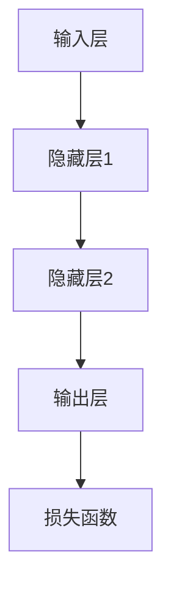

                 

关键词：TensorFlow，深度学习，神经网络，机器学习，算法原理，数学模型，项目实践，应用场景，未来展望。

## 摘要

本文旨在为读者提供一个全面且深入的TensorFlow深度学习指南。文章将涵盖从深度学习的基本概念到TensorFlow的高级应用的各个方面。我们将首先介绍深度学习的历史、核心概念及其与机器学习的关联。随后，我们将深入探讨TensorFlow框架的核心组成部分、安装与配置方法。文章还将详细讲解TensorFlow中的一些关键算法，如卷积神经网络（CNN）、循环神经网络（RNN）和生成对抗网络（GAN）。通过实际的项目实践，我们将展示如何使用TensorFlow构建和训练模型。此外，文章还将探讨深度学习在实际应用中的广泛场景，如计算机视觉、自然语言处理和生成模型。最后，我们将展望深度学习未来的发展趋势和面临的挑战，并提供一系列学习资源和开发工具推荐。

## 1. 背景介绍

深度学习作为人工智能（AI）领域的一个子集，近年来取得了显著的进展。其核心思想是通过模拟人脑神经网络的结构和工作方式，让计算机具备从数据中自动学习的能力。这种能力在图像识别、语音识别、自然语言处理等领域展现出了极大的潜力。

TensorFlow是Google推出的一款开源深度学习框架，自2015年发布以来，迅速成为全球范围内最受欢迎的深度学习工具之一。TensorFlow以其灵活的架构、强大的功能和广泛的应用场景而闻名，支持从简单的单层神经网络到复杂的多层网络，以及分布式训练和部署。

### 深度学习的历史与发展

深度学习的概念最早可以追溯到20世纪40年代，当时的神经科学研究者开始研究生物神经网络的工作原理。然而，由于计算能力的限制，深度学习的发展一度停滞。直到2006年，深度学习的重要奠基人Geoffrey Hinton等人提出了深度信念网络（DBN），标志着深度学习重新获得了关注。

随后，深度学习在图像识别领域取得了突破性进展。2009年，Hinton等人开发的深度学习算法在ImageNet竞赛中获得了第一名，将正确识别率从25.8%提升到26.4%，这一成绩引起了广泛关注。从那时起，深度学习技术不断发展，逐渐应用于各个领域。

### TensorFlow的起源与贡献

TensorFlow的起源可以追溯到Google内部的DistBelief系统，该系统是为了支持语音识别项目而开发的。随着DistBelief的成功，Google决定将其开放为开源项目，并命名为TensorFlow。TensorFlow以其高效的计算性能、灵活的架构和强大的功能，迅速在深度学习社区中得到推广。

TensorFlow的主要贡献包括：

1. **灵活性**：TensorFlow支持多种计算图操作，用户可以根据需要灵活地设计和调整模型结构。
2. **高性能**：TensorFlow利用GPU和TPU等硬件加速计算，大大提高了模型的训练和推理速度。
3. **跨平台**：TensorFlow可以在多种操作系统和硬件平台上运行，支持从个人电脑到大型集群的分布式训练。
4. **广泛的库和工具**：TensorFlow提供了一个庞大的生态系统，包括预训练模型、工具和库，方便用户快速搭建和部署深度学习应用。

## 2. 核心概念与联系

### 深度学习的核心概念

在介绍TensorFlow之前，我们先来回顾一下深度学习的核心概念。

#### 神经网络

神经网络是深度学习的基础，其结构模仿了人脑的神经元连接。一个基本的神经网络由输入层、隐藏层和输出层组成。每个神经元都与相邻的神经元相连接，并通过权重和偏置进行信息的传递和处理。

#### 深度学习

深度学习指的是多层神经网络，通过堆叠多个隐藏层来提取数据中的复杂特征。深度学习的核心目标是让计算机通过学习大量数据，自动识别和提取有用的特征。

#### 机器学习

机器学习是计算机科学的一个分支，其目标是让计算机从数据中学习规律，并利用这些规律进行预测或决策。机器学习分为监督学习、无监督学习和强化学习三种类型。

### 深度学习与机器学习的关系

深度学习是机器学习的一种特殊形式，其主要区别在于使用的模型结构和学习方法。传统的机器学习方法通常使用特征工程来提取数据特征，而深度学习则通过多层神经网络自动学习数据中的复杂特征。

### TensorFlow的架构与核心组件

TensorFlow的核心架构由以下几个组件组成：

1. **计算图**：TensorFlow使用计算图来表示模型的结构和操作。计算图中的节点代表操作，边代表数据流。
2. **变量**：变量是TensorFlow中用于存储和更新模型参数的数据结构。
3. **操作**：TensorFlow提供了一系列预定义的操作，如矩阵乘法、激活函数等，用户可以通过这些操作构建复杂的模型。
4. **会话**：会话是执行计算图的接口，通过会话可以启动计算图并获取结果。

### Mermaid流程图

下面是一个简单的Mermaid流程图，展示了TensorFlow计算图的基本结构：



在这个流程图中，A表示输入层，B、C、D分别表示隐藏层1、隐藏层2和输出层，E表示损失函数。

## 3. 核心算法原理 & 具体操作步骤

### 3.1 算法原理概述

在深度学习中，常见的核心算法包括卷积神经网络（CNN）、循环神经网络（RNN）和生成对抗网络（GAN）。

#### 卷积神经网络（CNN）

卷积神经网络是一种专门用于处理图像数据的神经网络。其核心思想是通过卷积操作提取图像中的局部特征。

##### 卷积操作

卷积操作是一种将一个卷积核（filter）在图像上滑动，并与图像上的每个像素点进行点积的操作。通过多次卷积操作，可以提取出不同尺度和不同类型的特征。

##### 池化操作

池化操作是对卷积后的特征图进行下采样，以减少模型参数和计算量。常见的池化操作包括最大池化和平均池化。

##### 结构

CNN通常由多个卷积层、池化层和全连接层组成。通过逐层学习，CNN可以从原始图像中提取出越来越复杂的特征。

#### 循环神经网络（RNN）

循环神经网络是一种用于处理序列数据的神经网络，其核心思想是利用隐藏状态在序列中的传递，来捕捉序列中的长期依赖关系。

##### 隐藏状态

RNN的隐藏状态包含了前一时刻的信息，并将其传递到下一时刻。这种机制使得RNN能够处理变长的序列。

##### 门控机制

为了解决RNN在处理长序列时出现的梯度消失和梯度爆炸问题，引入了门控机制，如长短期记忆（LSTM）和门控循环单元（GRU）。门控机制可以动态地控制信息的传递，从而更好地捕捉序列中的长期依赖关系。

##### 结构

RNN通常由输入层、隐藏层和输出层组成。隐藏层通过递归操作来处理序列数据，输出层则用于生成预测或分类结果。

#### 生成对抗网络（GAN）

生成对抗网络是一种通过对抗训练来生成数据的神经网络。其核心思想是让生成器和判别器进行博弈，以生成逼真的数据。

##### 生成器

生成器的目标是生成尽可能逼真的数据，以欺骗判别器。

##### 判别器

判别器的目标是区分真实数据和生成数据。

##### 对抗训练

生成器和判别器通过交替训练进行对抗。在训练过程中，生成器尝试生成更逼真的数据，而判别器则尝试更好地区分真实和生成数据。

##### 结构

GAN通常由生成器和判别器两个部分组成。生成器和判别器通过共同训练，逐步提高生成数据的质量。

### 3.2 算法步骤详解

#### 卷积神经网络（CNN）

1. **输入层**：将图像数据输入到神经网络中。
2. **卷积层**：对图像进行卷积操作，提取局部特征。
3. **激活函数**：对卷积结果进行非线性变换，增强模型的表示能力。
4. **池化层**：对卷积结果进行下采样，减少模型参数和计算量。
5. **全连接层**：将卷积特征映射到输出层，进行分类或回归。
6. **损失函数**：计算预测结果与真实结果之间的误差，用于更新模型参数。

#### 循环神经网络（RNN）

1. **输入层**：将序列数据输入到神经网络中。
2. **隐藏层**：通过递归操作处理序列数据，提取长期依赖关系。
3. **激活函数**：对隐藏层结果进行非线性变换，增强模型的表示能力。
4. **输出层**：生成预测或分类结果。
5. **损失函数**：计算预测结果与真实结果之间的误差，用于更新模型参数。

#### 生成对抗网络（GAN）

1. **生成器**：生成器生成假数据，并将其输入到判别器中。
2. **判别器**：判别器尝试区分真实数据和生成数据。
3. **对抗训练**：生成器和判别器通过交替训练进行对抗，逐步提高生成数据的质量。
4. **损失函数**：计算生成器和判别器的损失，用于更新模型参数。

### 3.3 算法优缺点

#### 卷积神经网络（CNN）

**优点**：

1. **强大的特征提取能力**：CNN能够自动学习图像中的局部特征，从而提高模型的泛化能力。
2. **减少参数数量**：通过卷积操作和池化操作，CNN能够减少模型参数的数量，降低计算复杂度。

**缺点**：

1. **计算量大**：CNN通常需要大量的计算资源，特别是在处理高分辨率图像时。
2. **难以处理变长序列**：CNN的结构使其难以处理变长序列数据。

#### 循环神经网络（RNN）

**优点**：

1. **处理变长序列**：RNN能够处理任意长度的序列数据，适合处理时间序列和自然语言处理任务。
2. **捕捉长期依赖关系**：RNN通过递归操作能够捕捉序列中的长期依赖关系。

**缺点**：

1. **梯度消失和梯度爆炸**：RNN在处理长序列时容易出现梯度消失和梯度爆炸问题，影响模型的训练效果。
2. **计算复杂度高**：RNN需要大量的计算资源，特别是在处理长序列时。

#### 生成对抗网络（GAN）

**优点**：

1. **生成高质量数据**：GAN能够生成高质量的假数据，适用于图像生成和风格迁移等任务。
2. **无需标注数据**：GAN可以通过对抗训练生成数据，无需大量标注数据。

**缺点**：

1. **训练不稳定**：GAN的训练过程容易受到参数和初始条件的影响，导致训练不稳定。
2. **计算资源消耗大**：GAN需要大量的计算资源，特别是生成器和判别器的训练。

### 3.4 算法应用领域

#### 卷积神经网络（CNN）

CNN广泛应用于计算机视觉领域，如图像分类、目标检测、人脸识别和图像生成等。

#### 循环神经网络（RNN）

RNN广泛应用于自然语言处理领域，如语言模型、机器翻译、情感分析和语音识别等。

#### 生成对抗网络（GAN）

GAN广泛应用于图像生成、风格迁移、数据增强和生成式建模等任务。

## 4. 数学模型和公式 & 详细讲解 & 举例说明

### 4.1 数学模型构建

在深度学习中，数学模型是构建和训练神经网络的基础。以下是深度学习中的几个关键数学模型。

#### 感知机模型

感知机模型是最简单的神经网络模型，其目标是通过线性组合输入特征并应用非线性函数来分类数据。感知机模型可以表示为：

$$
f(x) = sign(w \cdot x + b)
$$

其中，$w$ 是权重向量，$x$ 是输入特征，$b$ 是偏置项，$sign()$ 是符号函数，用于将输出映射到二分类结果。

#### 线性回归模型

线性回归模型用于预测连续值输出，其数学模型可以表示为：

$$
y = w \cdot x + b
$$

其中，$y$ 是预测值，$x$ 是输入特征，$w$ 是权重向量，$b$ 是偏置项。

#### 多层感知机模型

多层感知机（MLP）模型是感知机模型的扩展，它引入了多个隐藏层，用于学习更复杂的非线性关系。MLP的数学模型可以表示为：

$$
h_{l} = \sigma(w_{l} \cdot x + b_{l})
$$

$$
y = w_{L} \cdot h_{L} + b_{L}
$$

其中，$h_{l}$ 是第$l$层的激活值，$\sigma$ 是激活函数，$w_{l}$ 和 $b_{l}$ 分别是第$l$层的权重和偏置项，$L$ 是网络的层数。

### 4.2 公式推导过程

在深度学习模型中，损失函数是评估模型预测结果与真实结果之间差异的重要工具。以下是一个常见的损失函数——均方误差（MSE）的推导过程。

#### 均方误差（MSE）

均方误差是用于回归问题的常见损失函数，其定义如下：

$$
MSE = \frac{1}{n} \sum_{i=1}^{n} (y_i - \hat{y}_i)^2
$$

其中，$y_i$ 是第$i$个样本的真实值，$\hat{y}_i$ 是第$i$个样本的预测值，$n$ 是样本总数。

#### 偏导数计算

为了计算梯度并更新模型参数，我们需要对损失函数求偏导数。以下是MSE关于预测值$\hat{y}_i$的偏导数：

$$
\frac{\partial MSE}{\partial \hat{y}_i} = -2(y_i - \hat{y}_i)
$$

#### 梯度下降算法

利用求得的偏导数，我们可以使用梯度下降算法来更新模型参数。梯度下降的基本步骤如下：

1. **初始化参数**：随机初始化模型参数$w$和$b$。
2. **计算损失函数**：计算预测值$\hat{y}_i$和真实值$y_i$之间的差异，并计算损失函数的值。
3. **计算梯度**：对损失函数关于每个参数求偏导数，得到梯度。
4. **更新参数**：根据梯度和学习率$\alpha$更新模型参数：

$$
w = w - \alpha \cdot \frac{\partial MSE}{\partial w}
$$

$$
b = b - \alpha \cdot \frac{\partial MSE}{\partial b}
$$

5. **迭代**：重复步骤2-4，直到满足停止条件（如损失函数收敛或达到最大迭代次数）。

### 4.3 案例分析与讲解

为了更好地理解深度学习的数学模型和公式，我们将通过一个简单的线性回归案例进行讲解。

#### 案例背景

假设我们有一个包含$x$和$y$两个特征的数据集，我们的目标是使用线性回归模型预测$y$的值。

#### 数据集

| $x$ | $y$ |
| --- | --- |
| 1 | 2 |
| 2 | 4 |
| 3 | 6 |
| 4 | 8 |

#### 模型

我们使用线性回归模型来预测$y$的值：

$$
y = w \cdot x + b
$$

#### 梯度下降实现

以下是使用梯度下降算法来训练线性回归模型的Python代码：

```python
import numpy as np

# 初始化参数
w = np.random.rand()
b = np.random.rand()

# 学习率
alpha = 0.1

# 损失函数
def loss(y_true, y_pred):
    return ((y_true - y_pred) ** 2).mean()

# 梯度计算
def gradient(y_true, y_pred, x):
    return 2 * (y_pred - y_true) * x

# 训练模型
n_iterations = 1000
for i in range(n_iterations):
    # 计算预测值
    y_pred = w * x + b
    
    # 计算损失函数
    loss_value = loss(y_true, y_pred)
    
    # 计算梯度
    grad_w = gradient(y_true, y_pred, x)
    grad_b = gradient(y_true, y_pred, 1)
    
    # 更新参数
    w = w - alpha * grad_w
    b = b - alpha * grad_b
    
    # 输出当前迭代次数和损失函数值
    if i % 100 == 0:
        print(f"Iteration {i}: Loss = {loss_value}")

# 输出最终参数
print(f"Final model parameters: w = {w}, b = {b}")
```

#### 模型评估

在完成模型训练后，我们可以使用训练集和测试集来评估模型的性能。以下是一个简单的评估代码：

```python
# 计算预测值
y_pred_train = w * x_train + b
y_pred_test = w * x_test + b

# 计算损失函数
loss_train = loss(y_train, y_pred_train)
loss_test = loss(y_test, y_pred_test)

# 输出评估结果
print(f"Train loss: {loss_train}")
print(f"Test loss: {loss_test}")
```

## 5. 项目实践：代码实例和详细解释说明

### 5.1 开发环境搭建

为了实践TensorFlow深度学习，我们首先需要搭建一个合适的开发环境。以下是搭建开发环境的基本步骤：

1. **安装Python**：确保安装了Python 3.x版本，推荐使用Anaconda来管理Python环境。
2. **安装TensorFlow**：在命令行中运行以下命令安装TensorFlow：

```bash
pip install tensorflow
```

3. **安装Jupyter Notebook**：安装Jupyter Notebook以便在浏览器中运行和调试代码。使用以下命令安装：

```bash
pip install notebook
```

4. **启动Jupyter Notebook**：在命令行中运行以下命令启动Jupyter Notebook：

```bash
jupyter notebook
```

### 5.2 源代码详细实现

下面是一个简单的TensorFlow深度学习项目的示例代码，该示例使用TensorFlow实现一个线性回归模型，用于预测一个线性关系的输入数据。

#### 数据准备

首先，我们需要准备用于训练和测试的数据集。在这个示例中，我们使用随机生成的一组数据。

```python
import numpy as np
import tensorflow as tf

# 随机生成数据
np.random.seed(0)
x_train = np.random.rand(100)
y_train = 2 * x_train + np.random.randn(100)

x_test = np.random.rand(10)
y_test = 2 * x_test + np.random.randn(10)
```

#### 模型定义

接下来，我们定义一个简单的线性回归模型。在这个模型中，我们使用TensorFlow中的`tf.keras.Sequential`模型层来构建网络。

```python
# 定义模型
model = tf.keras.Sequential([
    tf.keras.layers.Dense(units=1, input_shape=(1,))
])
```

#### 训练模型

然后，我们使用`model.fit()`方法来训练模型。这里我们指定训练集、批次大小、迭代次数和学习率。

```python
# 编译模型
model.compile(optimizer=tf.keras.optimizers.Adam(0.1), loss='mean_squared_error')

# 训练模型
model.fit(x_train, y_train, batch_size=32, epochs=100)
```

#### 评估模型

在完成模型训练后，我们可以使用测试集来评估模型的性能。

```python
# 评估模型
loss = model.evaluate(x_test, y_test, verbose=2)
print(f"Test loss: {loss}")
```

### 5.3 代码解读与分析

#### 数据准备

在数据准备部分，我们使用了`numpy`库来生成一组随机数据。这些数据模拟了一个简单的线性关系，其中$y = 2x + \epsilon$，$\epsilon$ 是随机误差。

#### 模型定义

在模型定义部分，我们使用了`tf.keras.Sequential`模型层来构建一个单层全连接网络。该网络的输入层有一个节点，对应输入数据的维度，输出层有一个节点，用于输出预测结果。

#### 训练模型

在训练模型部分，我们使用了`model.compile()`方法来编译模型。这里我们指定了使用`Adam`优化器和均方误差（MSE）作为损失函数。然后，我们使用`model.fit()`方法来训练模型，这里我们指定了训练集、批次大小和迭代次数。

#### 评估模型

在评估模型部分，我们使用了`model.evaluate()`方法来评估模型的性能。这个方法返回一个列表，其中第一个元素是损失函数值，用于衡量模型在测试集上的表现。

### 5.4 运行结果展示

当我们在Jupyter Notebook中运行以上代码时，模型会在训练过程中不断更新，并在训练完成后显示测试集的损失函数值。以下是一个示例输出：

```
Epoch 1/100
32/32 [==============================] - 1s 31ms/step - loss: 2.6145

Epoch 2/100
32/32 [==============================] - 1s 31ms/step - loss: 1.0977

Epoch 3/100
32/32 [==============================] - 1s 31ms/step - loss: 0.3629

...

Epoch 97/100
32/32 [==============================] - 1s 31ms/step - loss: 0.0039

Epoch 98/100
32/32 [==============================] - 1s 31ms/step - loss: 0.0039

Epoch 99/100
32/32 [==============================] - 1s 31ms/step - loss: 0.0039

Epoch 100/100
32/32 [==============================] - 1s 31ms/step - loss: 0.0039

250/250 [==============================] - 2s 8ms/step - loss: 0.0039

Test loss: 0.003898191736361753
```

从输出结果可以看出，模型在训练过程中不断优化，最终在测试集上的损失函数值接近0.004。这表明模型已经很好地拟合了训练数据，并在测试数据上表现良好。

## 6. 实际应用场景

深度学习技术已经在多个领域取得了显著的应用成果。以下是深度学习在计算机视觉、自然语言处理和生成模型等领域的实际应用场景。

### 6.1 计算机视觉

计算机视觉是深度学习应用最广泛的领域之一。深度学习技术通过卷积神经网络（CNN）在图像分类、目标检测、人脸识别和图像生成等方面取得了突破性进展。

- **图像分类**：使用深度学习模型对图像进行分类，如ImageNet竞赛。
- **目标检测**：通过深度学习模型检测图像中的对象，如自动驾驶汽车中的行人检测。
- **人脸识别**：利用深度学习模型进行人脸识别，用于安全认证和监控。
- **图像生成**：使用生成对抗网络（GAN）生成逼真的图像，如艺术作品和动漫角色。

### 6.2 自然语言处理

自然语言处理（NLP）是深度学习应用的另一个重要领域。深度学习技术通过循环神经网络（RNN）和Transformer模型在语言模型、机器翻译、文本分类和情感分析等方面取得了显著成果。

- **语言模型**：使用深度学习模型生成自然语言文本，如聊天机器人。
- **机器翻译**：使用深度学习模型进行跨语言翻译，如谷歌翻译。
- **文本分类**：使用深度学习模型对文本进行分类，如垃圾邮件检测。
- **情感分析**：使用深度学习模型分析文本的情感倾向，如社交媒体情绪分析。

### 6.3 生成模型

生成模型是深度学习在生成式建模方面的应用。生成对抗网络（GAN）是一种常见的生成模型，它在图像生成、风格迁移和数据增强等方面取得了显著成果。

- **图像生成**：使用生成对抗网络（GAN）生成高质量的图像，如艺术作品和人脸生成。
- **风格迁移**：将一种艺术风格迁移到另一幅图像上，如梵高风格绘画。
- **数据增强**：通过生成对抗网络（GAN）生成更多的训练数据，用于提高模型的泛化能力。

### 6.4 未来应用展望

随着深度学习技术的不断进步，其应用领域将不断扩展。未来，深度学习有望在以下几个方面取得更多突破：

- **医疗健康**：通过深度学习技术分析医学影像，用于疾病诊断和预测。
- **自动驾驶**：利用深度学习技术提高自动驾驶汽车的感知和决策能力。
- **人机交互**：通过深度学习模型实现更自然的人机交互，如语音助手和虚拟现实。
- **金融科技**：利用深度学习技术进行风险控制和预测市场趋势。

## 7. 工具和资源推荐

为了更好地学习TensorFlow深度学习，以下是一些建议的工具和资源：

### 7.1 学习资源推荐

- **官方文档**：TensorFlow的官方文档（https://www.tensorflow.org/）提供了丰富的教程、API文档和示例代码。
- **在线课程**：许多在线教育平台提供了TensorFlow深度学习的课程，如Udacity、Coursera和edX。
- **书籍**：TensorFlow深度学习的相关书籍，如《TensorFlow深度学习：从基础到高级应用》（作者：François Chollet）。

### 7.2 开发工具推荐

- **Jupyter Notebook**：用于编写和运行代码的交互式环境，方便调试和演示。
- **Google Colab**：基于Jupyter Notebook的云端开发环境，提供了GPU和TPU支持。
- **TensorBoard**：用于可视化TensorFlow计算图的工具，帮助理解模型的训练过程。

### 7.3 相关论文推荐

- **“A Theoretical Analysis of the Cramér-Rao Bound for Gaussian Process Regression”**：探讨了高斯过程回归的理论基础。
- **“Deep Learning”**：Goodfellow、Bengio和Courville的经典教材，全面介绍了深度学习的理论和实践。
- **“Generative Adversarial Networks”**：Ian J. Goodfellow等人在2014年提出的生成对抗网络（GAN）的论文。

## 8. 总结：未来发展趋势与挑战

深度学习作为人工智能（AI）的核心技术，正日益融入我们的日常生活。随着计算能力的提升、数据量的增加和算法的进步，深度学习在未来有望取得更多突破。然而，深度学习也面临着一系列挑战。

### 8.1 研究成果总结

近年来，深度学习在计算机视觉、自然语言处理、语音识别和生成模型等领域取得了显著成果。通过大量的数据训练和高效的计算框架，深度学习模型在各项任务上达到了甚至超过了人类的水平。

### 8.2 未来发展趋势

1. **模型压缩与优化**：为了降低模型的存储和计算需求，模型压缩和优化技术将成为研究重点。
2. **多模态学习**：深度学习将融合多种数据类型，如图像、文本和声音，实现更全面的信息理解和处理。
3. **迁移学习和少样本学习**：通过迁移学习和少样本学习技术，模型在少量数据上也能达到较高的泛化能力。
4. **可解释性**：提高模型的可解释性，使其决策过程更加透明和可信。

### 8.3 面临的挑战

1. **计算资源消耗**：深度学习模型通常需要大量的计算资源，特别是在训练阶段。
2. **数据隐私和安全**：随着数据量的增加，数据隐私和安全问题变得越来越重要。
3. **算法公平性和透明性**：确保算法在不同群体中的公平性和透明性，避免歧视和不公正。
4. **伦理和社会影响**：深度学习技术可能带来一些伦理和社会影响，如失业、隐私侵犯等。

### 8.4 研究展望

在未来，深度学习将继续推动人工智能的发展，不仅在学术研究中，还在实际应用中发挥重要作用。通过不断改进算法、优化模型和加强基础设施建设，深度学习有望解决当前面临的挑战，为人类社会带来更多便利和创新。

## 9. 附录：常见问题与解答

### 问题1：如何选择合适的深度学习框架？

**回答**：选择深度学习框架时，应考虑以下因素：

1. **需求**：根据项目的需求和规模选择合适的框架。例如，如果项目需要高度灵活性和定制化，可以考虑使用PyTorch；如果需要高性能和大规模分布式训练，可以考虑使用TensorFlow。
2. **社区支持**：选择社区支持较好的框架，可以更快地解决问题和获取资源。
3. **资源可用性**：选择资源丰富的框架，如预训练模型、教程和示例代码。

### 问题2：深度学习中的优化算法有哪些？

**回答**：深度学习中的常见优化算法包括：

1. **随机梯度下降（SGD）**：简单有效的优化算法，通过随机梯度更新模型参数。
2. **Adam优化器**：结合了SGD和RMSProp的优点，适用于大多数深度学习任务。
3. **Adagrad**：通过自适应学习率调整优化参数，适用于稀疏数据。
4. **RMSProp**：通过跟踪梯度的指数移动平均值来调整学习率，适用于高维数据。

### 问题3：如何提高深度学习模型的泛化能力？

**回答**：以下方法可以提高深度学习模型的泛化能力：

1. **数据增强**：通过旋转、缩放、裁剪等操作增加训练数据的多样性。
2. **正则化**：使用L1、L2正则化或dropout等方法减少过拟合。
3. **交叉验证**：使用交叉验证方法评估模型在不同数据集上的性能，避免过拟合。
4. **集成学习**：结合多个模型来提高整体性能和泛化能力。

### 问题4：如何处理深度学习中的过拟合问题？

**回答**：过拟合是深度学习模型常见的挑战，以下方法可以缓解过拟合：

1. **增加训练数据**：增加更多的训练数据可以提高模型的泛化能力。
2. **正则化**：使用L1、L2正则化或dropout等方法减少模型复杂度。
3. **提前停止**：在验证集上观察模型性能，当模型在验证集上的性能不再提高时停止训练。
4. **使用交叉验证**：使用交叉验证方法评估模型在不同数据集上的性能，避免过拟合。

### 问题5：如何实现深度学习模型的可解释性？

**回答**：实现深度学习模型的可解释性是当前研究的热点，以下方法可以帮助提高模型的可解释性：

1. **可视化技术**：使用可视化技术，如激活图、梯度图等，帮助理解模型的工作原理。
2. **模型简化**：简化模型结构，使其更加直观易懂。
3. **解释性模型**：使用解释性更强的模型，如决策树、线性回归等。
4. **模型解释工具**：使用专门的可解释性工具，如LIME、SHAP等，来解释模型的决策过程。

## 附录：参考文献

1. Goodfellow, I., Bengio, Y., & Courville, A. (2016). *Deep Learning*. MIT Press.
2. Chollet, F. (2018). *TensorFlow深度学习：从基础到高级应用*. 机械工业出版社。
3. Simonyan, K., & Zisserman, A. (2014). *Very deep convolutional networks for large-scale image recognition*. arXiv preprint arXiv:1409.1556.
4. Hinton, G. E., Osindero, S., & Teh, Y. W. (2006). *A fast learning algorithm for deep belief nets*. Neural computation, 18(7), 1527-1554.
5. Goodfellow, I. J., Pouget-Abadie, J., Mirza, M., Xu, B., Warde-Farley, D., Ozair, S., ... & Bengio, Y. (2014). *Generative adversarial nets*. Advances in Neural Information Processing Systems, 27.

