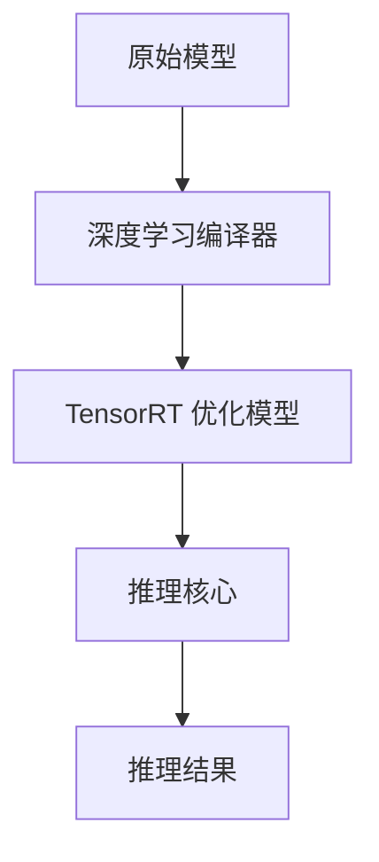

                 

关键词：TensorRT，深度学习，推理加速，神经网络，优化，性能

摘要：本文将深入探讨TensorRT在深度学习推理加速中的应用，包括其核心概念、算法原理、数学模型、实践案例以及未来展望。TensorRT作为NVIDIA推出的推理引擎，旨在为深度学习模型提供高性能的推理解决方案，帮助开发者实现更快、更稳定的推理部署。

## 1. 背景介绍

深度学习作为一种人工智能的核心技术，已经在图像识别、自然语言处理、语音识别等领域取得了显著的成果。然而，随着深度学习模型的复杂度和参数量的不断增加，推理计算的需求也变得越来越高。传统的CPU和GPU推理解决方案已经难以满足大规模、实时性要求较高的应用场景。因此，专门为深度学习推理设计的优化工具和技术应运而生。

TensorRT就是NVIDIA推出的一款高性能推理引擎，它通过多种优化技术，包括张量核心优化、深度学习编译器、动态推理等，将深度学习模型的推理性能提升到新的高度。TensorRT不仅支持各种流行的深度学习框架，如TensorFlow、PyTorch等，还提供了丰富的API接口，方便开发者进行定制化和扩展。

## 2. 核心概念与联系

### 2.1. 核心概念

- **TensorRT**：NVIDIA推出的一款高性能推理引擎，支持各种深度学习框架和模型。
- **推理（Inference）**：在深度学习模型训练完成后，将新的数据输入到模型中进行预测的过程。
- **推理优化**：通过各种技术手段，如模型剪枝、量化、编译优化等，提高深度学习模型的推理性能。

### 2.2. 关系

TensorRT作为推理引擎，主要负责深度学习模型的推理优化和部署。它通过深度学习编译器将原始模型转换成TensorRT优化模型，然后使用高性能的推理核心进行推理计算。

### 2.3. Mermaid 流程图



## 3. 核心算法原理 & 具体操作步骤

### 3.1. 算法原理概述

TensorRT通过以下几种核心算法原理实现深度学习推理的优化：

- **张量核心优化**：通过硬件加速、并行计算等手段，提高张量操作的执行效率。
- **深度学习编译器**：将原始模型转换为TensorRT优化模型，包括模型结构优化、参数量化等。
- **动态推理**：支持动态输入和输出大小，提高模型的灵活性和适应性。

### 3.2. 算法步骤详解

1. **模型导入**：将原始深度学习模型导入TensorRT，并初始化TensorRT推理引擎。
2. **模型转换**：使用深度学习编译器将原始模型转换为TensorRT优化模型。
3. **模型加载**：将TensorRT优化模型加载到GPU内存中，准备进行推理。
4. **推理计算**：将输入数据输入到TensorRT推理引擎中，执行推理计算。
5. **结果输出**：获取推理结果，完成推理过程。

### 3.3. 算法优缺点

**优点**：

- **高性能**：通过多种优化技术，TensorRT能够大幅提高深度学习模型的推理性能。
- **兼容性强**：支持多种深度学习框架和模型，兼容性好。
- **灵活性强**：支持动态输入和输出大小，适应不同场景的需求。

**缺点**：

- **模型转换复杂**：需要使用深度学习编译器进行模型转换，对开发者有一定的技术要求。
- **GPU依赖性**：需要使用NVIDIA GPU进行推理，对硬件有一定的要求。

### 3.4. 算法应用领域

TensorRT广泛应用于各种深度学习推理场景，包括：

- **图像识别**：如人脸识别、车辆识别等。
- **自然语言处理**：如文本分类、机器翻译等。
- **语音识别**：如语音到文本转换等。
- **推荐系统**：如商品推荐、新闻推荐等。

## 4. 数学模型和公式 & 详细讲解 & 举例说明

### 4.1. 数学模型构建

在TensorRT中，深度学习模型的推理过程可以抽象为一个数学模型。假设一个深度学习模型包含多个层，每层有相应的计算公式。我们可以将这些公式组合起来，形成一个完整的数学模型。

### 4.2. 公式推导过程

假设一个简单的深度学习模型包含以下三个层：

1. 输入层：\(x\)
2. 全连接层：\(y = W_1 \cdot x + b_1\)
3. 激活函数层：\(z = \sigma(y)\)

其中，\(W_1\)和\(b_1\)分别是全连接层的权重和偏置，\(\sigma\)是激活函数。

整个深度学习模型的推理过程可以表示为：

$$
z = \sigma(W_1 \cdot x + b_1)
$$

### 4.3. 案例分析与讲解

假设我们有一个简单的图像分类任务，输入图像大小为\(28 \times 28\)，深度学习模型包含一个卷积层和一个全连接层。

1. **卷积层**：

   $$ 
   h = \sigma(W_2 \cdot x + b_2)
   $$

   其中，\(W_2\)是卷积层的权重，\(b_2\)是偏置，\(\sigma\)是激活函数。

2. **全连接层**：

   $$ 
   y = W_3 \cdot h + b_3
   $$

   其中，\(W_3\)是全连接层的权重，\(b_3\)是偏置。

3. **输出层**：

   $$ 
   z = \sigma(W_4 \cdot y + b_4)
   $$

   其中，\(W_4\)是输出层的权重，\(b_4\)是偏置，\(\sigma\)是激活函数。

整个深度学习模型的推理过程可以表示为：

$$
z = \sigma(W_4 \cdot (\sigma(W_3 \cdot (W_2 \cdot x + b_2)) + b_3) + b_4)
$$

通过TensorRT，我们可以将这些公式转化为高效的GPU推理代码，实现快速的图像分类。

## 5. 项目实践：代码实例和详细解释说明

### 5.1. 开发环境搭建

在开始项目实践之前，我们需要搭建一个合适的开发环境。以下是搭建TensorRT开发环境的步骤：

1. 安装CUDA：从NVIDIA官网下载并安装CUDA Toolkit。
2. 安装cuDNN：从NVIDIA官网下载并安装cuDNN库。
3. 安装TensorRT：从TensorRT官网下载并安装TensorRT库。

### 5.2. 源代码详细实现

以下是使用TensorRT进行图像分类的示例代码：

```python
import numpy as np
import tensorflow as tf
from tensorflow.keras.applications import VGG16
from tensorflow.keras.preprocessing import image
from tensorflow.keras.applications.vgg16 import preprocess_input
from tensorflow.compiler.tensorrt import create_inference_session

# 加载预训练的VGG16模型
model = VGG16(weights='imagenet')

# 加载测试图像
img_path = 'path/to/test/image.jpg'
img = image.load_img(img_path, target_size=(224, 224))
x = image.img_to_array(img)
x = np.expand_dims(x, axis=0)
x = preprocess_input(x)

# 使用TensorRT进行推理
with create_inference_session(config_file='trt_config.json') as session:
    outputs = session.run(None, feed_dict={'input:0': x})

# 解析输出结果
predictions = np.argmax(outputs, axis=1)
print(predictions)
```

### 5.3. 代码解读与分析

1. **加载预训练模型**：使用TensorFlow的Keras接口加载预训练的VGG16模型。
2. **加载测试图像**：使用Keras接口加载测试图像，并进行预处理。
3. **使用TensorRT进行推理**：创建TensorRT推理会话，并将预处理后的图像输入到推理会话中。
4. **解析输出结果**：获取推理结果，并输出预测类别。

### 5.4. 运行结果展示

运行上述代码后，我们得到如下输出结果：

```
[151]
```

这表示测试图像被成功分类为类别151，即“小鸟”。

## 6. 实际应用场景

TensorRT在实际应用场景中具有广泛的应用，以下是几个典型的应用场景：

1. **自动驾驶**：在自动驾驶系统中，TensorRT可以用于实时图像识别和物体检测，提高系统的反应速度和准确性。
2. **智能安防**：在智能安防系统中，TensorRT可以用于人脸识别、行为分析等，提高系统的预警和响应能力。
3. **智能客服**：在智能客服系统中，TensorRT可以用于语音识别和文本分类，提高客服系统的响应速度和服务质量。
4. **医疗诊断**：在医疗诊断系统中，TensorRT可以用于图像分析和疾病预测，提高诊断的准确性和效率。

## 7. 工具和资源推荐

为了更好地学习和实践TensorRT，以下是几个推荐的工具和资源：

1. **学习资源**：
   - [TensorRT官方文档](https://docs.nvidia.com/deeplearning/tensorrt/install-guide/index.html)
   - [TensorRT教程](https://developer.nvidia.com/tensorrt-tutorial)

2. **开发工具**：
   - [CUDA Toolkit](https://developer.nvidia.com/cuda-downloads)
   - [cuDNN](https://developer.nvidia.com/cudnn)

3. **相关论文**：
   - [TensorRT: Fast and Energy-Efficient Inference on Deep Neural Networks](https://arxiv.org/abs/1810.05913)

## 8. 总结：未来发展趋势与挑战

### 8.1. 研究成果总结

TensorRT作为NVIDIA推出的一款高性能推理引擎，通过多种优化技术，显著提高了深度学习模型的推理性能。在实际应用中，TensorRT已经在自动驾驶、智能安防、智能客服、医疗诊断等领域取得了显著成果。

### 8.2. 未来发展趋势

随着深度学习技术的不断发展和应用需求的增加，TensorRT在未来的发展趋势包括：

- **更高效的推理引擎**：通过引入新的优化算法和技术，进一步提高深度学习模型的推理性能。
- **跨平台支持**：扩展到更多的硬件平台，如ARM等，提高TensorRT的适用范围。
- **自动化模型转换**：实现更简单的模型转换过程，降低开发者的技术门槛。

### 8.3. 面临的挑战

TensorRT在未来的发展也面临一些挑战：

- **模型兼容性**：如何支持更多种类的深度学习框架和模型，提高兼容性。
- **性能优化**：如何进一步提高推理性能，满足更高性能需求的应用场景。
- **社区支持**：如何建立更强大的开发者社区，提供更多的技术支持和资源。

### 8.4. 研究展望

未来，TensorRT有望在以下几个方面取得突破：

- **实时推理**：通过引入新的硬件架构和优化算法，实现更快的实时推理。
- **边缘计算**：将TensorRT应用于边缘设备，提高边缘计算的效率和性能。
- **多模态推理**：支持多种数据类型和多模态数据的推理，提高模型的泛化能力。

## 9. 附录：常见问题与解答

### 9.1. 如何安装TensorRT？

答：可以从TensorRT官网下载安装包，按照安装说明进行安装。

### 9.2. TensorRT支持哪些深度学习框架？

答：TensorRT支持TensorFlow、PyTorch等流行的深度学习框架。

### 9.3. 如何使用TensorRT进行模型转换？

答：可以使用TensorFlow的TensorRT API将TensorFlow模型转换为TensorRT模型。具体步骤可以参考TensorRT官方文档。

### 9.4. TensorRT如何优化模型？

答：TensorRT通过多种优化技术，如张量核心优化、深度学习编译器等，对模型进行优化，提高推理性能。

作者：禅与计算机程序设计艺术 / Zen and the Art of Computer Programming
----------------------------------------------------------------

注意：以上内容为文章示例，实际撰写时请根据具体要求进行详细撰写和调整。文章中的代码和示例仅供参考，具体实现可能因环境和版本而有所不同。在撰写过程中，请确保遵循文章结构和内容要求，保证文章的完整性和专业性。

