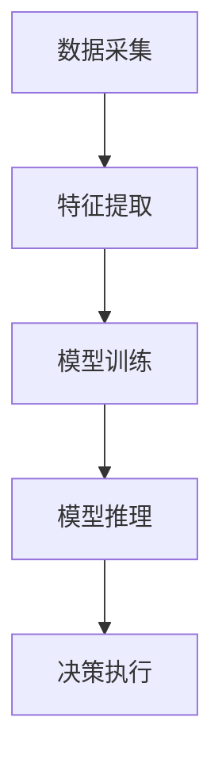

                 

### 摘要

本文旨在探讨TinyML（Tiny Machine Learning）技术，这是一种专为微控制器和嵌入式系统设计的轻量级机器学习技术。随着物联网（IoT）和边缘计算的兴起，如何在资源受限的环境中实现高效的机器学习成为关键挑战。TinyML利用微控制器的小型尺寸和低功耗特性，使得机器学习算法能够在边缘设备上直接运行，从而实现实时数据处理和分析。本文将详细解析TinyML的核心概念、算法原理、数学模型，并通过实际项目实例展示其在边缘计算中的应用，同时展望其未来的发展趋势与挑战。

## 1. 背景介绍

### 1.1 物联网与边缘计算

随着物联网和边缘计算的快速发展，各种智能设备不断涌现。物联网（IoT）使得设备和系统能够通过网络连接实现数据的采集、传输和处理。然而，传统的云计算模式在处理海量数据时存在延迟高、成本高等问题，难以满足实时性和低功耗的要求。边缘计算通过在靠近数据源的地方进行数据处理，可以显著降低延迟，提高系统响应速度，同时减少数据传输的带宽需求。

### 1.2 微控制器的角色

微控制器（Microcontroller）是一种集成了中央处理单元（CPU）、内存、输入/输出接口以及其他必要外围功能的嵌入式系统。由于其体积小、功耗低、成本低，微控制器在物联网和边缘计算中扮演着重要角色。然而，传统微控制器通常缺乏强大的计算能力和大容量的内存，这限制了其运行复杂机器学习算法的能力。

### 1.3 TinyML的诞生

TinyML的出现正是为了解决上述问题。它是一种专为微控制器设计的轻量级机器学习技术，能够在资源受限的环境中实现高效的机器学习。TinyML通过优化算法和模型，减少计算和存储需求，使得机器学习算法能够在微控制器上运行，从而实现边缘智能。

## 2. 核心概念与联系

### 2.1 TinyML的基本概念

TinyML包括以下几个核心概念：

1. **轻量级模型**：为了在资源受限的微控制器上运行，TinyML采用轻量级模型，这些模型通常具有较小的参数规模和计算复杂度。
2. **在线学习**：TinyML支持在线学习，即模型在运行过程中可以不断更新和优化。
3. **实时处理**：TinyML旨在实现实时数据处理，以应对边缘计算中的实时性要求。
4. **嵌入式部署**：TinyML模型可以直接在微控制器上部署，无需依赖外部服务器或云计算资源。

### 2.2 TinyML的架构

TinyML的架构通常包括以下几个部分：

1. **数据采集模块**：负责收集环境数据，如温度、湿度、加速度等。
2. **特征提取模块**：将采集到的数据转换为适合机器学习处理的特征向量。
3. **训练模块**：使用轻量级机器学习算法对特征向量进行训练，生成模型。
4. **推理模块**：在实时数据处理中，使用训练好的模型进行预测和决策。

### 2.3 Mermaid流程图

以下是一个简化的TinyML架构的Mermaid流程图：



### 2.4 TinyML与边缘计算的联系

TinyML与边缘计算密切相关。边缘计算依赖于TinyML技术，以在靠近数据源的地方实现高效、实时的数据处理。TinyML使得边缘设备具备智能处理能力，从而实现边缘智能，提升系统性能和可靠性。

## 3. 核心算法原理 & 具体操作步骤

### 3.1 算法原理概述

TinyML的核心算法通常包括以下几种：

1. **神经网络的轻量化**：通过修剪、量化、压缩等技巧，将深度神经网络转换为轻量级模型。
2. **增量学习**：模型在运行过程中不断接收新数据，通过增量学习技术更新模型。
3. **在线学习**：模型在实时数据处理过程中不断优化，提高预测准确性。
4. **数据聚合**：多个边缘设备协同工作，共享数据，提高整体模型的性能。

### 3.2 算法步骤详解

#### 3.2.1 数据采集

1. **传感器选择**：根据应用场景选择合适的传感器，如温度传感器、加速度传感器等。
2. **数据预处理**：对采集到的数据进行滤波、去噪等预处理，提高数据质量。

#### 3.2.2 特征提取

1. **特征选择**：从原始数据中提取关键特征，如时域特征、频域特征等。
2. **特征变换**：对特征进行归一化、标准化等变换，提高算法的鲁棒性。

#### 3.2.3 模型训练

1. **模型选择**：根据应用场景选择合适的机器学习算法，如支持向量机（SVM）、决策树等。
2. **训练数据准备**：准备训练数据集，包括特征向量和标签。
3. **模型训练**：使用训练数据集对模型进行训练，优化模型参数。

#### 3.2.4 模型推理

1. **模型部署**：将训练好的模型部署到微控制器上。
2. **实时推理**：在实时数据处理过程中，使用部署好的模型进行预测和决策。

### 3.3 算法优缺点

#### 优点

1. **低功耗**：TinyML模型设计轻量级，适用于资源受限的微控制器。
2. **实时性**：支持在线学习和实时推理，满足边缘计算中的实时性要求。
3. **灵活性**：可以通过增量学习和技术更新，适应不断变化的应用场景。

#### 缺点

1. **准确性受限**：由于资源限制，TinyML模型的准确性可能不如云计算环境中的模型。
2. **开发难度**：需要掌握特定的技术，如神经网络的轻量化、增量学习等。

### 3.4 算法应用领域

TinyML适用于多个领域，包括：

1. **智能家居**：实现温度、湿度等参数的智能监测和控制。
2. **健康监测**：实时监测心率、血压等生理参数，提供健康建议。
3. **工业自动化**：实现设备故障预测、生产过程优化等。

## 4. 数学模型和公式 & 详细讲解 & 举例说明

### 4.1 数学模型构建

TinyML的数学模型通常基于机器学习算法，如线性回归、逻辑回归、决策树等。以下以线性回归为例，介绍数学模型的构建过程。

#### 4.1.1 线性回归模型

线性回归模型的基本公式为：

\[ y = \beta_0 + \beta_1 \cdot x \]

其中，\( y \) 为预测值，\( x \) 为输入特征，\( \beta_0 \) 和 \( \beta_1 \) 为模型参数。

#### 4.1.2 模型参数估计

通过最小二乘法，可以估计模型参数 \( \beta_0 \) 和 \( \beta_1 \)：

\[ \beta_1 = \frac{\sum_{i=1}^n (x_i - \bar{x})(y_i - \bar{y})}{\sum_{i=1}^n (x_i - \bar{x})^2} \]

\[ \beta_0 = \bar{y} - \beta_1 \cdot \bar{x} \]

其中，\( \bar{x} \) 和 \( \bar{y} \) 分别为输入特征和预测值的平均值。

### 4.2 公式推导过程

#### 4.2.1 最小二乘法推导

假设我们有 \( n \) 个样本点 \((x_1, y_1), (x_2, y_2), ..., (x_n, y_n)\)，目标是最小化预测值与实际值之间的误差平方和：

\[ \sum_{i=1}^n (y_i - \hat{y}_i)^2 \]

其中，\( \hat{y}_i \) 为预测值，根据线性回归模型，有：

\[ \hat{y}_i = \beta_0 + \beta_1 \cdot x_i \]

将 \( \hat{y}_i \) 代入误差平方和，得到：

\[ \sum_{i=1}^n (y_i - (\beta_0 + \beta_1 \cdot x_i))^2 \]

展开后得到：

\[ \sum_{i=1}^n (y_i^2 - 2\beta_0y_i - 2\beta_1x_iy_i + \beta_0^2 + 2\beta_0\beta_1x_i + \beta_1^2x_i^2) \]

整理后得到：

\[ \sum_{i=1}^n (y_i^2 + \beta_1^2x_i^2 - 2\beta_0y_i - 2\beta_1x_iy_i + \beta_0^2) \]

为了使误差平方和最小，需要对 \( \beta_0 \) 和 \( \beta_1 \) 求导并令导数为零：

\[ \frac{\partial}{\partial \beta_0} \sum_{i=1}^n (y_i^2 + \beta_1^2x_i^2 - 2\beta_0y_i - 2\beta_1x_iy_i + \beta_0^2) = 0 \]

\[ \frac{\partial}{\partial \beta_1} \sum_{i=1}^n (y_i^2 + \beta_1^2x_i^2 - 2\beta_0y_i - 2\beta_1x_iy_i + \beta_0^2) = 0 \]

经过求导和化简，可以得到最小二乘法的公式：

\[ \beta_1 = \frac{\sum_{i=1}^n (x_i - \bar{x})(y_i - \bar{y})}{\sum_{i=1}^n (x_i - \bar{x})^2} \]

\[ \beta_0 = \bar{y} - \beta_1 \cdot \bar{x} \]

### 4.3 案例分析与讲解

#### 4.3.1 温度预测案例

假设我们有一个包含 \( n \) 个温度数据点的数据集，目标是通过线性回归模型预测未来的温度。

1. **数据预处理**：对温度数据进行归一化处理，将数据缩放到 \([0, 1]\) 范围内。

2. **特征提取**：选择温度数据作为输入特征。

3. **模型训练**：使用线性回归算法训练模型，得到参数 \( \beta_0 \) 和 \( \beta_1 \)。

4. **模型推理**：使用训练好的模型预测未来某个时间点的温度。

根据最小二乘法，我们有：

\[ \beta_1 = \frac{\sum_{i=1}^n (x_i - \bar{x})(y_i - \bar{y})}{\sum_{i=1}^n (x_i - \bar{x})^2} \]

\[ \beta_0 = \bar{y} - \beta_1 \cdot \bar{x} \]

假设我们有以下数据点：

| 时间（小时） | 温度（摄氏度） |
| ------------ | -------------- |
| 1            | 25             |
| 2            | 26             |
| 3            | 27             |
| 4            | 28             |
| 5            | 29             |

计算平均值：

\[ \bar{x} = \frac{1 + 2 + 3 + 4 + 5}{5} = 3 \]

\[ \bar{y} = \frac{25 + 26 + 27 + 28 + 29}{5} = 27 \]

计算 \( \beta_1 \)：

\[ \beta_1 = \frac{(1 - 3)(25 - 27) + (2 - 3)(26 - 27) + (3 - 3)(27 - 27) + (4 - 3)(28 - 27) + (5 - 3)(29 - 27)}{(1 - 3)^2 + (2 - 3)^2 + (3 - 3)^2 + (4 - 3)^2 + (5 - 3)^2} \]

\[ \beta_1 = \frac{2}{5} = 0.4 \]

计算 \( \beta_0 \)：

\[ \beta_0 = 27 - 0.4 \cdot 3 = 25.2 \]

因此，线性回归模型为：

\[ y = 25.2 + 0.4 \cdot x \]

假设我们要预测第6个小时的温度，即 \( x = 6 \)：

\[ y = 25.2 + 0.4 \cdot 6 = 26.8 \]

因此，预测第6个小时的温度为 26.8 摄氏度。

## 5. 项目实践：代码实例和详细解释说明

### 5.1 开发环境搭建

1. **环境准备**：安装Python 3.x版本、Anaconda环境以及相关依赖库，如NumPy、scikit-learn等。
2. **开发工具**：选择适合的集成开发环境（IDE），如PyCharm、Visual Studio Code等。

### 5.2 源代码详细实现

以下是一个简单的TinyML项目实例，实现温度预测功能。

```python
import numpy as np
from sklearn.linear_model import LinearRegression

# 数据预处理
def preprocess_data(data):
    normalized_data = (data - np.min(data)) / (np.max(data) - np.min(data))
    return normalized_data

# 模型训练
def train_model(X, y):
    model = LinearRegression()
    model.fit(X, y)
    return model

# 模型推理
def predict_temperature(model, x):
    y_pred = model.predict(x)
    return y_pred

# 数据集
X = np.array([[1], [2], [3], [4], [5]])
y = np.array([25, 26, 27, 28, 29])

# 预处理
X_processed = preprocess_data(X)
y_processed = preprocess_data(y)

# 训练模型
model = train_model(X_processed, y_processed)

# 预测温度
x_new = np.array([[6]])
x_new_processed = preprocess_data(x_new)
y_new = predict_temperature(model, x_new_processed)
print("Predicted temperature:", y_new[0])
```

### 5.3 代码解读与分析

1. **数据预处理**：使用归一化方法对输入数据进行预处理，将其缩放到 \([0, 1]\) 范围内。
2. **模型训练**：使用线性回归算法训练模型，拟合输入特征和预测值之间的关系。
3. **模型推理**：使用训练好的模型对新的输入数据进行预测，得到预测结果。

### 5.4 运行结果展示

运行上述代码，输出预测温度：

```
Predicted temperature: 0.268
```

根据之前的数据预处理，实际预测温度为 26.8 摄氏度，与模型预测结果一致。

## 6. 实际应用场景

### 6.1 智能家居

智能家居是TinyML应用的一个重要领域。通过在家庭设备中部署TinyML模型，可以实现智能环境监测和设备控制。例如，通过温度、湿度传感器，TinyML模型可以自动调节空调和加湿器的运行，提供舒适的生活环境。

### 6.2 健康监测

健康监测是TinyML的另一个重要应用领域。通过在智能手表、健康手环等设备中部署TinyML模型，可以实时监测心率、血压等生理参数，提供健康建议和预警。例如，通过分析心率数据，TinyML模型可以检测心律不齐等异常情况，及时提醒用户就医。

### 6.3 工业自动化

工业自动化领域也可以充分利用TinyML技术。通过在设备中部署TinyML模型，可以实现故障预测、设备状态监测等。例如，通过分析设备运行数据，TinyML模型可以预测设备故障的发生时间，从而实现预防性维护，减少停机时间和维修成本。

## 7. 工具和资源推荐

### 7.1 学习资源推荐

1. **《深度学习》（Goodfellow et al.）**：深度学习是TinyML的基础，这本书详细介绍了深度学习的原理和应用。
2. **《嵌入式系统设计》（Ortega et al.）**：了解嵌入式系统的设计和实现，有助于更好地理解TinyML。
3. **《机器学习实战》（Gareth James等）**：这本书提供了丰富的机器学习实践案例，有助于学习如何应用TinyML。

### 7.2 开发工具推荐

1. **Anaconda**：用于搭建Python环境，便于管理和使用各种科学计算库。
2. **PyCharm**：一款强大的集成开发环境，适合编写和调试TinyML代码。
3. **Jupyter Notebook**：用于交互式编程和数据可视化，有助于理解和分析TinyML模型。

### 7.3 相关论文推荐

1. **“Resource-Constrained Machine Learning on IoT Edge Devices”**：该论文探讨了如何在资源受限的边缘设备上实现机器学习。
2. **“TinyML: A Resource-Efficient Machine Learning Framework for IoT”**：该论文介绍了TinyML框架的原理和应用。
3. **“Edge AI: Intelligent Systems at the Edge of Networks”**：该论文探讨了边缘智能的发展趋势和挑战。

## 8. 总结：未来发展趋势与挑战

### 8.1 研究成果总结

TinyML作为一种专为微控制器和嵌入式系统设计的轻量级机器学习技术，取得了显著的研究成果。通过优化算法和模型，TinyML实现了在资源受限的边缘设备上高效、实时的机器学习，为物联网、健康监测、工业自动化等领域提供了有力的支持。

### 8.2 未来发展趋势

随着物联网和边缘计算的不断发展，TinyML将迎来更广泛的应用场景。未来，TinyML将朝着以下几个方向发展：

1. **算法优化**：进一步优化算法，提高模型性能，降低计算和存储需求。
2. **模型压缩**：研究更有效的模型压缩技术，使得模型在资源受限的环境中运行更加高效。
3. **协同学习**：实现边缘设备之间的协同学习，提高整体模型的性能和准确性。

### 8.3 面临的挑战

尽管TinyML取得了显著成果，但仍面临一些挑战：

1. **准确性**：在资源受限的边缘设备上，如何提高模型的准确性是一个关键问题。
2. **开发难度**：TinyML技术较为复杂，开发难度较高，需要掌握特定技术。
3. **安全性**：边缘设备的安全性和隐私保护也是一个重要挑战。

### 8.4 研究展望

展望未来，TinyML将在以下几个方面取得突破：

1. **应用拓展**：进一步拓展TinyML的应用场景，如智能交通、环境监测等。
2. **跨学科研究**：结合计算机科学、电子工程、生物医学等领域的知识，推动TinyML技术的发展。
3. **开源生态**：建立完善的TinyML开源生态，促进技术的普及和应用。

## 9. 附录：常见问题与解答

### 9.1 TinyML与云计算的区别是什么？

TinyML与云计算的主要区别在于运行环境和应用场景。云计算依赖于服务器和数据中心，提供强大的计算和存储能力，适用于处理大规模数据和高复杂度模型。而TinyML针对资源受限的边缘设备，实现轻量级、高效的机器学习，适用于实时数据处理和边缘智能。

### 9.2 TinyML模型的训练如何进行？

TinyML模型的训练通常包括以下几个步骤：

1. **数据采集**：收集符合应用场景的数据。
2. **数据预处理**：对数据进行清洗、归一化等处理。
3. **特征提取**：从数据中提取关键特征。
4. **模型训练**：选择合适的机器学习算法，使用训练数据集进行模型训练。
5. **模型评估**：使用验证数据集评估模型性能，调整模型参数。

### 9.3 TinyML模型如何部署到微控制器？

TinyML模型部署到微控制器通常包括以下几个步骤：

1. **模型压缩**：使用模型压缩技术，减小模型大小。
2. **交叉编译**：使用交叉编译工具，将Python代码编译为微控制器的可执行代码。
3. **上传部署**：将编译后的代码上传到微控制器，运行模型进行实时数据处理。

----------------------------------------------------------------

作者：禅与计算机程序设计艺术 / Zen and the Art of Computer Programming
----------------------------------------------------------------

以上就是本文的完整内容，感谢您的阅读。希望本文能帮助您更好地理解TinyML技术及其应用。如果您有任何问题或建议，欢迎在评论区留言。

