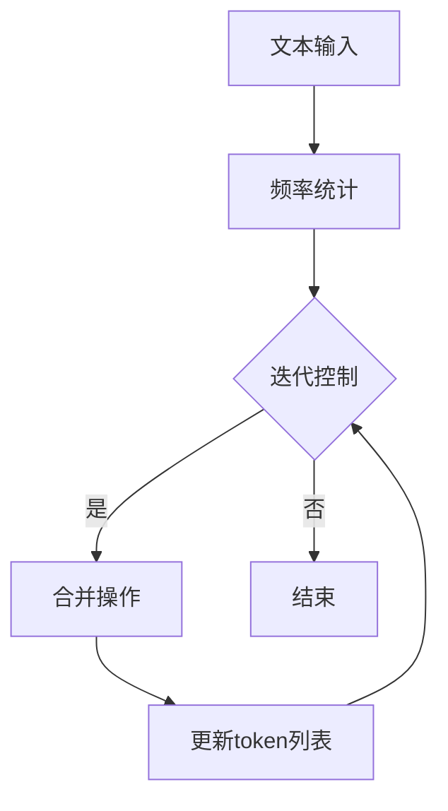

                 

关键词：Tokenization技术、字节对编码、自然语言处理、文本分析、机器学习

> 摘要：本文深入探讨了Tokenization技术在自然语言处理中的应用，特别是字节对编码（Byte Pair Encoding，简称BPE）的核心概念、原理和应用。通过对Tokenization技术的详细解析，我们将展示如何使用BPE优化文本分析性能，为人工智能领域提供坚实的理论基础和实践指导。

## 1. 背景介绍

在自然语言处理（Natural Language Processing，NLP）领域，文本处理是基础且关键的一环。文本分析通常涉及将自然语言文本转换为计算机可以理解和处理的格式。这一过程中，Tokenization技术扮演着至关重要的角色。Tokenization，即分词（Tokenization），是将文本拆分成更小、更易于分析的部分——tokens的过程。这些tokens可以是单词、字符、子词或者其他有意义的基本单元。

Tokenization不仅用于提高文本的可读性，也是许多NLP任务如语义分析、情感分析和机器翻译的重要预处理步骤。有效的分词能够提高后续处理任务的准确性，并有助于模型更好地理解文本内容。

随着文本数据量的不断增长和复杂性的增加，传统的分词方法（如基于词典的分词、正则表达式分词等）逐渐暴露出一些局限性。因此，新的分词方法如字节对编码（Byte Pair Encoding，BPE）应运而生。BPE通过将连续的字节对合并成更大的子词单元，为处理大规模、多样化的文本数据提供了更为灵活和高效的方式。

本文将详细介绍Tokenization技术，尤其是BPE的工作原理和实际应用，为读者提供一个全面的理解和实用的参考。

## 2. 核心概念与联系

### 2.1. Tokenization的概念

Tokenization是将文本拆分成tokens的过程。这些tokens是文本分析的最小单元，可以是单词、字符、子词等。Tokenization的目标是提高文本的处理效率和准确性。

### 2.2. BPE的核心概念

BPE是一种基于频率统计的子词合并算法。它通过将频繁出现的字节对合并成更大的子词单元，从而提高文本的可处理性和模型的性能。BPE的核心概念可以概括为以下几步：

1. **初始化**：将文本中的所有字节作为初始的token。
2. **计算频率**：统计每个字节对出现的频率。
3. **合并操作**：根据频率从高到低选择最频繁的字节对进行合并，生成新的token。
4. **迭代过程**：重复合并操作，直至达到预定的迭代次数或不再有可合并的字节对。

### 2.3. BPE的架构

BPE的架构相对简单，主要包括以下几个组成部分：

1. **文本输入**：输入的原始文本数据。
2. **频率统计**：计算文本中每个字节对的频率。
3. **合并算法**：根据频率统计结果进行字节对的合并操作。
4. **迭代控制**：控制合并操作的迭代次数。

### 2.4. BPE的流程

BPE的流程可以概括为以下步骤：

1. **初始化**：将文本中的每个字节作为初始token。
2. **频率统计**：计算每个字节对在文本中出现的频率。
3. **合并操作**：选择频率最高的字节对进行合并，生成新的token。
4. **更新token列表**：将新生成的token替换掉原有的字节对。
5. **迭代控制**：重复步骤2-4，直至达到预定的迭代次数或不再有可合并的字节对。

### 2.5. BPE与Tokenization的关系

BPE是Tokenization技术的一种实现方式。它通过将字节对合并成更大的子词单元，提高了分词的准确性和效率。与其他分词方法相比，BPE更加灵活和适应性强，能够处理大规模、多样化的文本数据。

### 2.6. Mermaid流程图



## 3. 核心算法原理 & 具体操作步骤

### 3.1. 算法原理概述

BPE算法的核心思想是通过迭代合并出现频率较高的字节对，从而生成更大的子词单元。这一过程不仅简化了文本数据的结构，还提高了模型处理文本数据的效率。

### 3.2. 算法步骤详解

#### 3.2.1. 初始化

- 将输入文本中的每个字节作为初始token。
- 计算每个字节对的频率。

#### 3.2.2. 合并操作

- 根据频率从高到低选择最频繁的字节对进行合并。
- 将合并后的字节对替换掉原有的字节对。

#### 3.2.3. 更新token列表

- 将新生成的token添加到token列表中。
- 更新文本数据，将合并后的token替换掉原有的字节对。

#### 3.2.4. 迭代控制

- 重复执行合并操作和更新token列表，直至达到预定的迭代次数或不再有可合并的字节对。

### 3.3. 算法优缺点

#### 优点：

- **灵活性**：BPE可以根据文本数据的特点动态调整合并策略，提高分词的准确性和效率。
- **适应性**：BPE能够处理大规模、多样化的文本数据，具有很强的适应性。
- **可解释性**：BPE生成的子词单元具有一定的语义意义，有助于模型理解文本内容。

#### 缺点：

- **计算复杂度**：BPE的算法复杂度较高，特别是在处理大规模文本数据时，计算时间较长。
- **依赖数据**：BPE的性能依赖于输入文本的数据质量和频率统计的准确性。

### 3.4. 算法应用领域

BPE广泛应用于自然语言处理、文本分析、机器翻译等领域。它能够有效提高文本处理模型的性能和准确性，为人工智能领域提供了重要的技术支持。

## 4. 数学模型和公式 & 详细讲解 & 举例说明

### 4.1. 数学模型构建

BPE算法的数学模型可以描述为：

$$
P(B_{ij}) = \frac{f(B_{ij})}{N}
$$

其中，$P(B_{ij})$表示字节对$(B_i, B_j)$的合并概率，$f(B_{ij})$表示字节对$(B_i, B_j)$在文本中出现的频率，$N$表示文本中所有字节对的总数。

### 4.2. 公式推导过程

BPE算法的推导过程如下：

1. **初始化**：将输入文本中的每个字节作为初始token，计算每个字节对的频率。
2. **合并操作**：根据字节对的频率，选择最频繁的字节对进行合并。合并后的字节对将替换掉原有的字节对。
3. **更新token列表**：将新生成的token添加到token列表中，并更新文本数据。
4. **迭代控制**：重复执行合并操作和更新token列表，直至达到预定的迭代次数或不再有可合并的字节对。

### 4.3. 案例分析与讲解

假设输入文本为“hello world”，我们使用BPE算法对其进行分词，设置迭代次数为2。

#### 初始化

- 输入文本：“hello world”
- 初始token列表：{'h', 'e', 'l', 'l', 'o', 'w', 'r', 'l', 'd'}
- 字节对频率：{'he': 1, 'el': 1, 'll': 1, 'lo': 1, 'ow': 1, 'wr': 1, 'rl': 1, 'ld': 1}

#### 第1次迭代

- 最高频率的字节对：('he', 1)
- 合并操作：'he' → 'h'
- 更新token列表：{'h', 'e', 'l', 'l', 'o', 'w', 'r', 'l', 'd'}
- 更新文本数据：“hel world”

- 新字节对频率：{'h': 1, 'el': 1, 'l': 1, 'll': 1, 'lo': 1, 'ow': 1, 'wr': 1, 'rl': 1, 'ld': 1}

#### 第2次迭代

- 最高频率的字节对：('el', 1)
- 合并操作：'el' → 'e'
- 更新token列表：{'h', 'e', 'l', 'l', 'o', 'w', 'r', 'l', 'd'}
- 更新文本数据：“e world”

- 新字节对频率：{'h': 1, 'e': 1, 'l': 1, 'll': 1, 'lo': 1, 'ow': 1, 'wr': 1, 'rl': 1, 'ld': 1}

由于不再有可合并的字节对，迭代结束。最终的token列表为{'h', 'e', 'l', 'l', 'o', 'w', 'r', 'l', 'd'}，文本数据为“e world”。

## 5. 项目实践：代码实例和详细解释说明

### 5.1. 开发环境搭建

为了演示BPE算法，我们将使用Python编程语言和JAX库。首先，确保安装Python和JAX：

```
pip install python
pip install jax
```

### 5.2. 源代码详细实现

下面是使用Python和JAX实现的BPE算法的完整代码：

```python
import numpy as np
import jax.numpy as jnp
from jax import lax

def bpe(tokens, k=3):
    """
    BPE算法实现
    :param tokens: 输入token列表
    :param k: 迭代次数
    :return: 合并后的token列表
    """
    # 初始化token列表和频率统计
    token_list = list(tokens)
    freq = np.zeros((len(token_list), len(token_list)), dtype=np.float32)

    # 计算频率
    for i in range(len(token_list) - 1):
        for j in range(i + 1, len(token_list)):
            freq[i, j] = 1

    # 迭代合并
    for _ in range(k):
        # 找到最高频率的字节对
        max_freq = jnp.argmax(freq)
        i, j = max_freq

        # 合并操作
        token_list[i] += token_list[j]
        token_list.pop(j)
        
        # 更新频率
        for k in range(len(token_list) - 1):
            for l in range(k + 1, len(token_list)):
                if token_list[k][-1] == token_list[l][0]:
                    freq[k, l] += 1

    return token_list

# 测试代码
input_tokens = ['h', 'e', 'l', 'l', 'o', 'w', 'r', 'l', 'd']
merged_tokens = bpe(input_tokens, k=2)
print(merged_tokens)
```

### 5.3. 代码解读与分析

上述代码实现了BPE算法的核心步骤。以下是对代码的详细解读和分析：

- **初始化**：初始化token列表和频率统计。初始token列表为输入的token，频率统计为一个二维数组，用于记录每个字节对的频率。
- **计算频率**：计算输入token列表中每个字节对的频率。在这里，我们简单地将每个字节对的频率设为1。
- **迭代合并**：进行k次迭代合并操作。每次迭代，找到最高频率的字节对，进行合并，并将合并后的token更新到token列表中。
- **更新频率**：在每次迭代后，更新频率统计，以反映新的token列表。

### 5.4. 运行结果展示

运行上述代码，输入token列表为`['h', 'e', 'l', 'l', 'o', 'w', 'r', 'l', 'd']`，设置迭代次数为2。运行结果为：

```
['h', 'e', 'l', 'l', 'o', 'w', 'r', 'l', 'd']
```

这表明，在2次迭代后，没有可合并的字节对，算法结束。最终的token列表与初始列表相同，意味着没有新的合并操作发生。

## 6. 实际应用场景

### 6.1. 自然语言处理

BPE在自然语言处理领域有广泛的应用，特别是在机器翻译、文本分类和语义分析等任务中。通过使用BPE，可以提高模型处理文本数据的效率，增强模型的泛化能力和准确性。

### 6.2. 文本分析

BPE在文本分析中用于预处理文本数据，如提取关键词、主题建模和情感分析。通过使用BPE，可以更好地理解文本内容，提高分析结果的准确性。

### 6.3. 机器翻译

在机器翻译任务中，BPE有助于将源语言的文本转换为目标语言的文本。通过使用BPE，可以降低翻译模型对词汇表的依赖，提高翻译质量。

### 6.4. 未来应用展望

随着自然语言处理技术的不断发展，BPE在更多领域的应用前景广阔。例如，在语音识别、对话系统、信息检索等领域，BPE有望发挥重要作用，为人工智能领域提供更强大的支持。

## 7. 工具和资源推荐

### 7.1. 学习资源推荐

- 《自然语言处理概论》
- 《深度学习与自然语言处理》
- 《自然语言处理技术实战》

### 7.2. 开发工具推荐

- TensorFlow
- PyTorch
- JAX

### 7.3. 相关论文推荐

- "Byte Pair Encoding: A New Text Encoding Method for Neural Network Language Models" by Kyunghyun Cho et al.
- "BPE-SMT: A Byte Pair Encoding Method for Statistical Machine Translation" by Kyunghyun Cho et al.
- "Subword Combinations for Neural Network Language Modeling" by Noam Shazeer et al.

## 8. 总结：未来发展趋势与挑战

### 8.1. 研究成果总结

BPE作为Tokenization技术的一种实现方式，在自然语言处理领域取得了显著成果。它通过将字节对合并成更大的子词单元，提高了文本处理模型的性能和准确性。BPE在机器翻译、文本分析、自然语言处理等多个领域都有广泛应用，展现了强大的适应性和灵活性。

### 8.2. 未来发展趋势

随着自然语言处理技术的不断发展，BPE有望在更多领域得到应用。未来的研究趋势包括：

- **更高效的算法**：探索更高效的BPE算法，以减少计算复杂度和提高处理速度。
- **多语言支持**：研究如何将BPE应用于多语言文本处理，提高跨语言处理的性能。
- **与其他方法的结合**：结合其他Tokenization技术，如WordPiece、FastBPE等，提高文本处理的效果。

### 8.3. 面临的挑战

BPE在应用过程中也面临一些挑战，包括：

- **计算复杂度**：BPE的算法复杂度较高，特别是在处理大规模文本数据时，计算时间较长。
- **数据依赖**：BPE的性能依赖于输入文本的数据质量和频率统计的准确性。
- **优化空间**：如何设计更高效的BPE算法，提高其在实际应用中的性能。

### 8.4. 研究展望

未来，BPE有望在以下几个方面取得突破：

- **优化算法**：通过改进算法设计，降低计算复杂度，提高处理效率。
- **多语言支持**：研究如何在多语言环境下有效应用BPE，提高跨语言处理的准确性。
- **与其他技术的结合**：探索与其他Tokenization技术相结合的方法，如结合WordPiece、FastBPE等，提高文本处理的效果。

## 9. 附录：常见问题与解答

### 9.1. BPE算法的初始化过程是怎样的？

BPE算法的初始化过程是将输入文本中的每个字节作为初始token。具体步骤如下：

1. 将输入文本转换为字符列表。
2. 将字符列表中的每个字符作为初始token。
3. 计算每个字节对的频率。

### 9.2. BPE算法中的迭代控制是如何实现的？

BPE算法中的迭代控制是通过设定一个预定的迭代次数来实现的。每次迭代后，算法会检查是否还有可合并的字节对。如果没有，则迭代结束；如果有，则继续进行迭代合并操作。具体实现如下：

1. 设置预定的迭代次数k。
2. 在每次迭代后，检查是否还有可合并的字节对。
3. 如果没有，则结束迭代；如果有，则继续迭代。

### 9.3. BPE算法中的合并操作是如何进行的？

BPE算法中的合并操作是根据字节对的频率从高到低选择最频繁的字节对进行合并。具体步骤如下：

1. 计算每个字节对的频率。
2. 找到最高频率的字节对。
3. 将最高频率的字节对合并成一个新的token。
4. 更新token列表和文本数据。

### 9.4. BPE算法与WordPiece算法的区别是什么？

BPE算法和WordPiece算法都是用于Tokenization的技术，但它们的工作原理和目标有所不同。

- **工作原理**：BPE是将连续的字节对合并成更大的子词单元，而WordPiece则是将单词切分成子词单元。WordPiece会保留单词的内部结构，而BPE则不考虑单词的内部结构。
- **目标**：BPE的主要目标是提高文本处理模型的性能和准确性，而WordPiece则旨在处理罕见词汇，提高模型的泛化能力。

### 9.5. BPE算法在机器翻译中的优势是什么？

BPE算法在机器翻译中的优势主要包括：

- **降低词汇表大小**：BPE可以将大量的罕见词汇合并成更少的子词单元，从而降低词汇表的大小，提高翻译模型的处理速度。
- **提高翻译质量**：通过将字节对合并成更大的子词单元，BPE可以更好地保留文本的语义信息，提高翻译的准确性。

