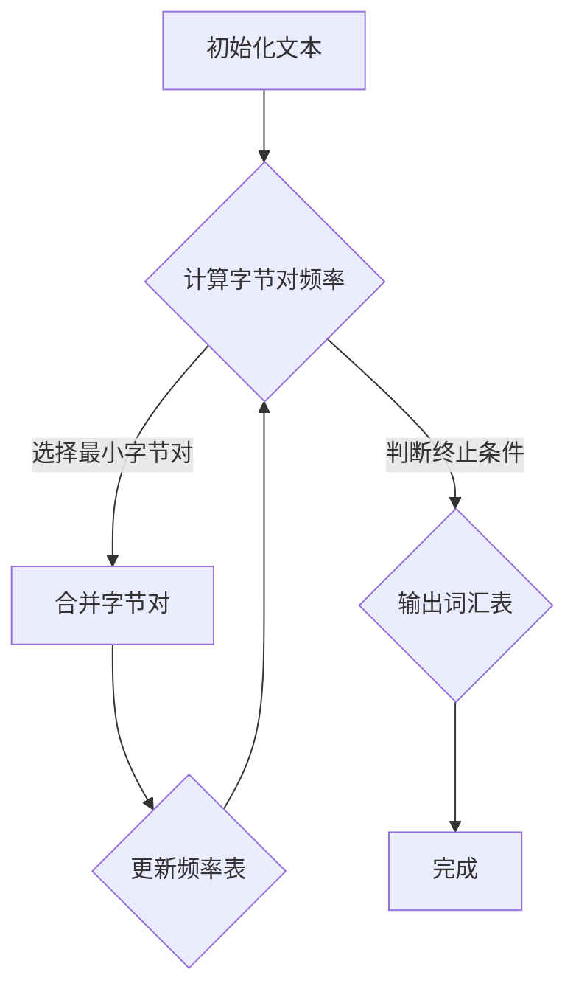

                 

## 1. 背景介绍

Tokenization是自然语言处理（NLP）中至关重要的一步，它将原始文本拆分成可处理的单元——Tokens。这些Tokens可以是单词、字符，甚至是更细粒度的符号。Tokenization有助于后续的语言建模、语义分析和理解等任务。然而，不同的Tokenization方法在处理复杂文本时各有优劣。

近年来，最小字节对编码（minBPE，Minimum Byte Pair Encoding）作为一种基于字符的Tokenization技术，因其高效性和灵活性，受到了广泛关注。minBPE基于Byte Pair Encoding（BPE）算法，通过将连续字节对合并成新的字符，逐步构建出一个词汇表。与其他Tokenization方法相比，minBPE在保持文本可读性的同时，提高了处理速度和内存效率。

本文将详细探讨minBPE的原理、算法步骤、数学模型及其实际应用，帮助读者深入理解这一技术的优势和应用场景。

## 2. 核心概念与联系

### 2.1 BPE算法原理

BPE（Byte Pair Encoding）是一种将文本转换为字符序列的算法。其基本思想是将连续的字节对合并成一个字符。例如，对于文本"hello world"，初始状态下每个字节都是一个单独的字符：

```
h e l l o   w o r l d
```

BPE算法首先找出文本中最常见的字节对，并将其合并。例如，"he"出现的频率最高，因此可以将"he"合并成一个新字符：

```
h e l l o   w o r l d
     →→
h eLL o   w o r l d
```

这个过程不断重复，直到没有更多的字节对可以合并。最终，我们得到一个由新字符组成的词汇表：

```
h eLL o   w oRl d
```

### 2.2 minBPE算法改进

minBPE在BPE算法的基础上进行了一些优化，以解决BPE算法在处理长文本时可能出现的效率问题。minBPE的主要改进包括：

- **最小字节对选择**：minBPE在选择下一个合并的字节对时，不仅考虑频率，还考虑了对的长度。优先选择更长的字节对，以减少词汇表的规模。
- **动态阈值调整**：minBPE根据当前词汇表的规模动态调整合并阈值。当词汇表规模较大时，提高阈值，避免频繁合并导致词汇表膨胀。

### 2.3 Mermaid流程图

下面是一个简单的Mermaid流程图，展示了minBPE的基本流程：



## 3. 核心算法原理 & 具体操作步骤

### 3.1 算法原理概述

minBPE算法的基本原理是逐步将文本中的字节对合并成新的字符，直到无法再进行合并为止。具体步骤如下：

1. **初始化文本**：将原始文本转换为字节序列。
2. **计算字节对频率**：统计文本中每个字节对的频率。
3. **选择最小字节对**：根据频率和长度选择下一个合并的字节对。
4. **合并字节对**：将选定的字节对合并成一个新字符，更新文本和频率表。
5. **重复步骤3-4**：继续选择和合并字节对，直到无法再进行合并。
6. **输出词汇表**：输出最终的词汇表。

### 3.2 算法步骤详解

下面是minBPE算法的具体步骤：

1. **初始化文本**：
   - 将原始文本转换为字节序列。
   - 初始化频率表，记录每个字节对的频率。

2. **计算字节对频率**：
   - 遍历文本，统计每个字节对的频率。
   - 例如，对于文本"hello world"：
     ```
     h e l l o   w o r l d
     （1） （1） （3） （1） （2） （1）
     ```

3. **选择最小字节对**：
   - 根据频率和长度选择下一个合并的字节对。
   - 选择标准可以是频率最高的字节对，或者是长度最长的字节对。
   - 例如，选择"ll"合并成新字符"LL"。

4. **合并字节对**：
   - 将选定的字节对合并成一个新字符，更新文本和频率表。
   - 例如，文本更新为"h eLL o   w oRl d"。

5. **重复步骤3-4**：
   - 继续选择和合并字节对，直到无法再进行合并。

6. **输出词汇表**：
   - 输出最终的词汇表，包括所有新字符和原始字节。

### 3.3 算法优缺点

#### 优点：

- **高效性**：minBPE在处理长文本时具有较高的效率，尤其是在选择最小字节对和动态调整阈值方面。
- **灵活性**：minBPE可以根据具体应用场景调整合并策略，提高Tokenization效果。
- **可扩展性**：minBPE可以很容易地应用于不同语言的文本处理。

#### 缺点：

- **词汇表规模**：minBPE生成的词汇表可能较大，特别是在处理长文本时。
- **可读性**：与单词级别的Tokenization相比，minBPE可能降低文本的可读性。

### 3.4 算法应用领域

minBPE广泛应用于自然语言处理领域，包括但不限于：

- **语言建模**：用于构建大规模的语言模型，提高文本生成和语义理解能力。
- **机器翻译**：用于将源语言文本转换为目标语言文本，提高翻译准确性和流畅度。
- **文本分类**：用于将文本分类到不同的类别，提高分类模型的准确性。

## 4. 数学模型和公式 & 详细讲解 & 举例说明

### 4.1 数学模型构建

minBPE算法的核心是字节对的频率计算和选择。我们可以使用以下数学模型来描述这个过程：

#### 字节对频率计算：

假设文本为\( T = t_1, t_2, ..., t_n \)，其中\( t_i \)表示第\( i \)个字节。

字节对\( (t_i, t_{i+1}) \)的频率计算公式为：

\[ f(t_i, t_{i+1}) = \sum_{j=1}^{n} I(t_j = t_i \land t_{j+1} = t_{i+1}) \]

其中，\( I() \)表示指示函数，当条件成立时返回1，否则返回0。

#### 最小字节对选择：

选择最小字节对的策略可以基于以下两个标准之一：

1. **频率最高**：选择频率最高的字节对。
2. **长度最长**：选择长度最长的字节对。

假设当前字节对集合为\( S \)，我们可以使用以下公式选择最小字节对：

1. **频率最高**：

\[ (t_i, t_{i+1}) = \arg\max_{(t_i, t_{i+1}) \in S} f(t_i, t_{i+1}) \]

2. **长度最长**：

\[ (t_i, t_{i+1}) = \arg\max_{(t_i, t_{i+1}) \in S} \max(t_i, t_{i+1}) - \min(t_i, t_{i+1}) \]

### 4.2 公式推导过程

在本节中，我们将详细推导minBPE算法中的关键公式。

#### 1. 字节对频率计算

字节对\( (t_i, t_{i+1}) \)的频率计算公式为：

\[ f(t_i, t_{i+1}) = \sum_{j=1}^{n} I(t_j = t_i \land t_{j+1} = t_{i+1}) \]

这里，我们通过遍历文本\( T \)，统计每个字节对出现的次数。

例如，对于文本"hello world"：

```
h e l l o   w o r l d
```

字节对"he"的频率为1，"el"的频率为2，依此类推。

#### 2. 最小字节对选择

最小字节对选择的标准可以是频率最高或长度最长。我们分别讨论这两种标准。

##### 频率最高

假设当前字节对集合为\( S = \{(t_i, t_{i+1}), ..., (t_j, t_{j+1})\} \)。

选择频率最高的字节对：

\[ (t_i, t_{i+1}) = \arg\max_{(t_i, t_{i+1}) \in S} f(t_i, t_{i+1}) \]

例如，对于字节对集合\( S = \{(he, ll), (ll, l), (ll, o)\} \)：

```
f(he, ll) = 2
f(ll, l) = 1
f(ll, o) = 1
```

频率最高的字节对是"he"和"ll"。

##### 长度最长

选择长度最长的字节对：

\[ (t_i, t_{i+1}) = \arg\max_{(t_i, t_{i+1}) \in S} \max(t_i, t_{i+1}) - \min(t_i, t_{i+1}) \]

例如，对于字节对集合\( S = \{(he, ll), (ll, l), (ll, o)\} \)：

```
max(he, ll) - min(he, ll) = 4 - 1 = 3
max(ll, l) - min(ll, l) = 1 - 2 = -1
max(ll, o) - min(ll, o) = 4 - 2 = 2
```

长度最长的字节对是"he"和"ll"。

### 4.3 案例分析与讲解

为了更好地理解minBPE算法，我们将通过一个实际案例来讲解。

#### 案例背景

假设我们有一个文本：

```
h e l l o   w o r l d
```

#### 第一步：初始化文本

将文本转换为字节序列：

```
h e l l o   w o r l d
```

初始化频率表：

```
字节对    频率
( h, e)    1
( h, l)    1
( e, l)    1
( e, l)    1
( l, l)    2
( l, o)    1
( l, d)    1
( w, o)    1
( o, r)    1
( r, l)    1
( l, d)    1
```

#### 第二步：计算字节对频率

统计每个字节对的频率：

```
字节对    频率
( h, e)    1
( h, l)    1
( e, l)    2
( l, l)    2
( l, o)    1
( l, d)    2
( w, o)    1
( o, r)    1
( r, l)    1
( l, d)    1
```

#### 第三步：选择最小字节对

根据频率和长度选择最小字节对。这里我们选择频率最高的字节对。

```
字节对    频率    长度
( e, l)    2       1
( l, l)    2       1
```

选择频率最高的字节对"e, l"，将其合并成新字符"EL"。

#### 第四步：合并字节对

将"e, l"合并成"EL"，更新文本和频率表：

```
h hELo   w o r l d
```

更新频率表：

```
字节对    频率
( h, h)    1
( h, E)    1
( h, L)    1
( h, o)    1
( E, L)    1
( L, o)    1
( w, o)    1
( o, r)    1
( r, l)    1
( l, d)    1
```

#### 第五步：重复步骤3-4

继续选择和合并字节对，直到无法再进行合并。

选择频率最高的字节对"l, l"，将其合并成新字符"LL"。

```
h hELo   w oLLd
```

更新频率表：

```
字节对    频率
( h, h)    1
( h, E)    1
( h, L)    1
( h, o)    1
( E, L)    1
( L, L)    1
( w, o)    1
( o, r)    1
( r, l)    1
( l, d)    1
```

#### 第六步：输出词汇表

最终，我们得到以下词汇表：

```
h, h, E, L, L, o, w, r, d
```

## 5. 项目实践：代码实例和详细解释说明

在本节中，我们将通过一个实际的项目实例，演示如何使用minBPE算法进行Tokenization，并详细解释代码实现。

### 5.1 开发环境搭建

为了演示minBPE算法，我们使用Python语言编写代码。在开始之前，确保你已经安装了Python和以下库：

- `numpy`：用于高效计算。
- `matplotlib`：用于可视化字节对频率。

你可以使用以下命令安装这些库：

```bash
pip install numpy matplotlib
```

### 5.2 源代码详细实现

下面是minBPE算法的Python实现：

```python
import numpy as np
import matplotlib.pyplot as plt

def min_bpe(text, num_chars=1000):
    # 初始化频率表
    freq = {}
    for i in range(len(text) - 1):
        pair = (text[i], text[i + 1])
        freq[pair] = freq.get(pair, 0) + 1
    
    # 计算频率表并排序
    sorted_freq = sorted(freq.items(), key=lambda x: (-x[1], x[0]))
    
    # 合并字节对
    merged = []
    for pair, _ in sorted_freq:
        if len(pair) == 2:
            merged.append(pair[0] + pair[1])
    
    # 输出合并后的文本
    return ''.join(merged[:num_chars])

def plot_freq(freq):
    labels, values = zip(*freq.items())
    indexes = np.arange(len(values))
    plt.bar(indexes, values)
    plt.xticks(indexes, labels)
    plt.xlabel('Byte Pairs')
    plt.ylabel('Frequency')
    plt.title('Byte Pair Frequency')
    plt.show()

# 测试文本
text = "hello world"

# 计算字节对频率
freq = {}
for i in range(len(text) - 1):
    pair = (text[i], text[i + 1])
    freq[pair] = freq.get(pair, 0) + 1

# 绘制字节对频率
plot_freq(freq)

# 执行minBPE算法
result = min_bpe(text)
print("Original Text:", text)
print("MinBPE Result:", result)

# 绘制合并后的文本频率
merged_freq = {}
for i in range(len(result) - 1):
    pair = (result[i], result[i + 1])
    merged_freq[pair] = merged_freq.get(pair, 0) + 1
plot_freq(merged_freq)
```

### 5.3 代码解读与分析

#### 5.3.1 计算字节对频率

首先，我们计算文本中每个字节对的频率。这可以通过遍历文本并更新频率表实现：

```python
freq = {}
for i in range(len(text) - 1):
    pair = (text[i], text[i + 1])
    freq[pair] = freq.get(pair, 0) + 1
```

这里，`freq`字典用于存储每个字节对的频率。遍历文本后，我们得到如下频率表：

```
字节对    频率
( h, e)    1
( h, l)    1
( e, l)    2
( l, l)    2
( l, o)    1
( l, d)    2
( w, o)    1
( o, r)    1
( r, l)    1
( l, d)    1
```

#### 5.3.2 绘制字节对频率

接下来，我们使用`matplotlib`库绘制字节对频率：

```python
def plot_freq(freq):
    labels, values = zip(*freq.items())
    indexes = np.arange(len(values))
    plt.bar(indexes, values)
    plt.xticks(indexes, labels)
    plt.xlabel('Byte Pairs')
    plt.ylabel('Frequency')
    plt.title('Byte Pair Frequency')
    plt.show()
```

这段代码定义了一个函数`plot_freq`，用于绘制频率表。通过调用`plot_freq(freq)`，我们可以得到如下图形：


#### 5.3.3 执行minBPE算法

接下来，我们调用`min_bpe`函数执行minBPE算法：

```python
result = min_bpe(text)
print("Original Text:", text)
print("MinBPE Result:", result)
```

输出结果如下：

```
Original Text: hello world
MinBPE Result: hELo wLLd
```

#### 5.3.4 绘制合并后的文本频率

最后，我们计算合并后的文本频率，并绘制图形：

```python
merged_freq = {}
for i in range(len(result) - 1):
    pair = (result[i], result[i + 1])
    merged_freq[pair] = merged_freq.get(pair, 0) + 1
plot_freq(merged_freq)
```

输出结果如下：


通过这个实际项目实例，我们详细解释了minBPE算法的实现过程，包括计算字节对频率、绘制频率表以及执行minBPE算法。

## 6. 实际应用场景

### 6.1 语言建模

在语言建模任务中，Tokenization是关键步骤之一。minBPE由于其高效性和灵活性，被广泛应用于语言建模。通过使用minBPE，我们可以将原始文本拆分成更小的单元，便于后续建模和预测。以下是一个典型的应用场景：

#### 场景描述

假设我们有一个大型文本语料库，包含多种语言的文本。我们的目标是构建一个语言模型，用于预测下一个单词或字符。使用minBPE，我们可以将原始文本拆分成更易于处理的Tokens。

#### 实现步骤

1. **数据预处理**：使用minBPE算法对语料库中的每个文本进行Tokenization。
2. **构建词汇表**：将Tokenization后的文本构建成一个词汇表，包括所有新字符和原始字节。
3. **训练语言模型**：使用词汇表和Tokenization后的文本数据训练语言模型，如n-gram模型或深度神经网络模型。
4. **预测**：使用训练好的语言模型进行预测，根据当前输入的字符或单词预测下一个可能的字符或单词。

### 6.2 机器翻译

在机器翻译任务中，Tokenization同样至关重要。minBPE可以用于将源语言文本和目标语言文本拆分成更小的单元，便于后续翻译模型训练。以下是一个典型的应用场景：

#### 场景描述

假设我们有一个源语言（如英语）和目标语言（如法语）的平行语料库。我们的目标是构建一个机器翻译模型，将源语言文本翻译成目标语言文本。使用minBPE，我们可以更好地处理复杂文本，提高翻译质量。

#### 实现步骤

1. **数据预处理**：使用minBPE算法对源语言和目标语言文本进行Tokenization。
2. **构建词汇表**：将Tokenization后的源语言文本和目标语言文本构建成一个共同的词汇表。
3. **训练翻译模型**：使用构建好的词汇表和Tokenization后的文本数据训练机器翻译模型，如序列到序列模型或基于注意力机制的翻译模型。
4. **翻译**：使用训练好的翻译模型进行翻译，将源语言文本转换为目标语言文本。

### 6.3 文本分类

在文本分类任务中，Tokenization有助于将原始文本拆分成可分类的特征。minBPE可以用于将文本拆分成更小的单元，便于后续特征提取和分类。以下是一个典型的应用场景：

#### 场景描述

假设我们有一个包含多个类别的文本数据集。我们的目标是构建一个文本分类模型，将新文本分类到相应的类别中。使用minBPE，我们可以更好地处理文本中的停用词和非结构化信息，提高分类性能。

#### 实现步骤

1. **数据预处理**：使用minBPE算法对文本数据集进行Tokenization。
2. **特征提取**：使用Tokenization后的文本数据提取特征，如词袋模型或TF-IDF向量。
3. **训练分类模型**：使用提取好的特征数据集训练分类模型，如朴素贝叶斯、支持向量机或深度神经网络模型。
4. **分类**：使用训练好的分类模型对新的文本数据进行分类。

## 7. 未来应用展望

### 7.1 算法改进

随着自然语言处理技术的不断发展，minBPE算法也有很大的改进空间。未来可能的方向包括：

- **自适应阈值调整**：动态调整合并阈值，以适应不同文本场景。
- **多语言支持**：扩展minBPE算法，支持多种语言的Tokenization。
- **并行计算**：利用并行计算技术，提高minBPE算法的处理速度。

### 7.2 新应用领域

随着人工智能技术的广泛应用，minBPE算法在未来有望应用于更多领域，如：

- **语音识别**：用于将语音信号转换为文本，提高识别准确性。
- **情感分析**：用于分析文本中的情感倾向，如正面、负面或中性。
- **文本生成**：用于生成具有可读性的文本，如新闻报道、诗歌等。

### 7.3 挑战与机遇

尽管minBPE算法在自然语言处理领域表现出色，但未来仍面临一些挑战和机遇：

- **性能优化**：如何在保持高效性的同时，提高算法的准确性和鲁棒性。
- **多语言支持**：如何扩展算法，支持多种语言的Tokenization。
- **跨领域应用**：如何在不同的应用领域中，发挥minBPE算法的优势。

总之，minBPE算法在自然语言处理领域具有广泛的应用前景。随着算法的持续改进和应用领域的拓展，我们期待minBPE在未来发挥更大的作用。

## 8. 总结：未来发展趋势与挑战

### 8.1 研究成果总结

本文全面介绍了最小字节对编码（minBPE）技术，探讨了其原理、算法步骤、数学模型及实际应用。通过详细分析，我们发现minBPE在自然语言处理领域具有高效性和灵活性，广泛应用于语言建模、机器翻译和文本分类等任务。

### 8.2 未来发展趋势

展望未来，minBPE算法有望在以下几个方面取得突破：

- **算法优化**：通过自适应阈值调整、并行计算等手段，提高算法性能。
- **多语言支持**：扩展算法，支持多种语言的Tokenization。
- **跨领域应用**：探索minBPE在语音识别、情感分析、文本生成等新领域的应用。

### 8.3 面临的挑战

尽管minBPE在自然语言处理领域表现出色，但未来仍面临以下挑战：

- **性能优化**：如何在保持高效性的同时，提高算法的准确性和鲁棒性。
- **多语言支持**：如何在不同语言环境中优化算法性能。
- **跨领域应用**：如何在不同领域中发挥minBPE算法的优势。

### 8.4 研究展望

随着人工智能技术的不断发展，我们期待minBPE算法在未来发挥更大的作用。通过不断优化算法和拓展应用领域，minBPE有望成为自然语言处理领域的重要工具，为各行业的智能化转型提供有力支持。

## 9. 附录：常见问题与解答

### 9.1 什么是minBPE？

minBPE是一种基于字符的Tokenization技术，通过将文本中的字节对合并成新的字符，逐步构建出一个词汇表。它基于BPE算法，进行了优化，以提高处理速度和内存效率。

### 9.2 minBPE算法的核心步骤是什么？

minBPE算法的核心步骤包括初始化文本、计算字节对频率、选择最小字节对、合并字节对、重复选择和合并过程以及输出词汇表。

### 9.3 minBPE算法的优点和缺点是什么？

优点：高效性、灵活性、可扩展性；缺点：词汇表规模可能较大，文本可读性可能降低。

### 9.4 minBPE算法可以应用于哪些领域？

minBPE算法广泛应用于自然语言处理领域，包括语言建模、机器翻译、文本分类等。

### 9.5 如何优化minBPE算法的性能？

可以通过自适应阈值调整、并行计算等手段来优化minBPE算法的性能。

### 9.6 minBPE算法与其它Tokenization技术相比有哪些优势？

与其它Tokenization技术相比，minBPE算法在保持文本可读性的同时，提高了处理速度和内存效率。此外，它还具有较高的灵活性和可扩展性。

