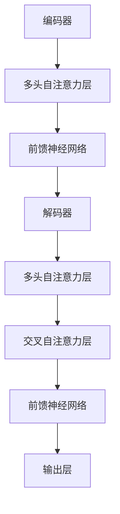

                 

关键词：Transformer、计算机视觉、自然语言处理、神经网络、架构设计、应用领域、算法原理

> 摘要：本文深入探讨了 Transformer 模型在计算机视觉（CV）和自然语言处理（NLP）中的不同应用和架构设计，通过对两种领域内 Transformer 模型的算法原理、数学模型、实践应用和未来展望的详细分析，揭示了其在各领域的独特优势和应用前景。

## 1. 背景介绍

近年来，深度学习在计算机视觉（CV）和自然语言处理（NLP）领域取得了显著的进展，特别是基于 Transformer 的模型，已经成为这些领域的主流架构。Transformer 模型，特别是其变体 BERT（Bidirectional Encoder Representations from Transformers），在 NLP 中取得了前所未有的成功，推动了语言理解、文本生成和问答系统等多个方向的发展。

在 CV 领域，虽然 CNN（卷积神经网络）长期以来占据主导地位，但 Transformer 模型的引入也带来了新的思路和突破，特别是在视频理解和图像生成等任务中。Transformer 和 CNN 的结合，如 CViT（Computer Vision Transformer）和 DALL-E，展示了在处理复杂任务中的潜力。

## 2. 核心概念与联系

### 2.1. Transformer 模型架构

Transformer 模型是基于自注意力（self-attention）机制的深度学习模型，其核心思想是通过计算输入序列中每个元素与其他所有元素之间的关系来建模复杂依赖。



### 2.2. Transformer 在 NLP 中的应用

在 NLP 中，Transformer 模型被广泛应用于文本序列的建模。BERT 模型通过预训练和微调，实现了在多个 NLP 任务上的高水平性能，包括文本分类、问答系统和机器翻译等。

### 2.3. Transformer 在 CV 中的应用

在 CV 中，Transformer 模型主要用于图像和视频序列的处理。CViT 模型通过将图像视为序列并应用 Transformer 的自注意力机制，实现了图像分类、目标检测和图像生成等任务。

## 3. 核心算法原理 & 具体操作步骤

### 3.1. 算法原理概述

Transformer 模型的核心是自注意力机制，它通过计算输入序列中每个元素与所有其他元素的关系来生成特征表示。这个过程包括编码器和解码器两个部分。

### 3.2. 算法步骤详解

1. **编码器**：将输入序列映射到嵌入空间，并通过多头自注意力层和前馈神经网络处理。
2. **解码器**：将编码器的输出与解码器自身的嵌入向量结合，并通过交叉自注意力层和前馈神经网络处理。
3. **输出层**：将解码器的输出映射到目标空间，例如分类标签或文本序列。

### 3.3. 算法优缺点

**优点**：

- **并行处理**：Transformer 模型可以并行处理序列中的所有元素，提高了计算效率。
- **长距离依赖**：自注意力机制能够建模长距离依赖，提高了模型的解释性。

**缺点**：

- **计算资源消耗**：Transformer 模型在训练和推理过程中需要大量的计算资源。
- **参数量较大**：模型的参数量通常较大，导致模型训练和部署的难度增加。

### 3.4. 算法应用领域

Transformer 模型在 NLP 和 CV 领域都有广泛应用，包括文本生成、机器翻译、图像分类、目标检测和视频理解等。

## 4. 数学模型和公式

### 4.1. 数学模型构建

假设输入序列为 \( x_1, x_2, \ldots, x_n \)，其中 \( x_i \) 为序列的第 \( i \) 个元素。Transformer 模型通过以下公式构建特征表示：

$$
E_i = \text{softmax}\left(\frac{Q_iW_q + K_jW_k}{\sqrt{d_k}}\right)V_j
$$

其中，\( Q_i, K_i, V_i \) 分别为编码器、解码器和输入的权重矩阵，\( W_q, W_k, W_v \) 分别为查询、键和值的权重矩阵，\( d_k \) 为键的维度。

### 4.2. 公式推导过程

公式推导涉及多个步骤，包括线性变换、归一化和对数函数的应用。具体推导过程如下：

$$
Q_i = X_iW_q \\
K_i = X_iW_k \\
V_i = X_iW_v \\
E_i = \text{softmax}\left(\frac{Q_iW_q + K_jW_k}{\sqrt{d_k}}\right)V_j
$$

### 4.3. 案例分析与讲解

以 BERT 模型为例，假设输入句子为 "I am eating an apple"，BERT 模型通过自注意力机制对其中的每个词进行建模，生成一个嵌入向量。以下是一个简化的推导过程：

$$
E_i = \text{softmax}\left(\frac{Q_1W_q + K_2W_k + K_3W_k + \ldots + K_nW_k}{\sqrt{d_k}}\right)V_1
$$

其中，\( Q_1, K_1, V_1 \) 分别为 "I" 的查询、键和值矩阵，\( K_2, K_3, \ldots, K_n \) 分别为 "am", "eating", "an" 和 "apple" 的键矩阵，\( W_q, W_k, W_v \) 为相应的权重矩阵。

## 5. 项目实践：代码实例和详细解释说明

### 5.1. 开发环境搭建

在开始编写代码之前，我们需要搭建一个开发环境。以下是一个简单的步骤：

1. 安装 Python 3.8 或更高版本。
2. 安装 TensorFlow 2.x 或 PyTorch 1.8 或更高版本。
3. 安装其他必要的库，如 NumPy、Matplotlib 等。

### 5.2. 源代码详细实现

以下是一个简化的 Transformer 模型的实现：

```python
import torch
import torch.nn as nn
import torch.optim as optim

class TransformerModel(nn.Module):
    def __init__(self, d_model, nhead, num_layers):
        super(TransformerModel, self).__init__()
        self.encoder = nn.Embedding(d_model, nhead)
        self.decoder = nn.Linear(d_model, nhead)
        self.transformer = nn.Transformer(d_model, nhead, num_layers)
        self.optimizer = optim.Adam(self.parameters(), lr=0.001)

    def forward(self, x):
        x = self.encoder(x)
        x = self.transformer(x)
        x = self.decoder(x)
        return x

# 实例化模型
model = TransformerModel(d_model=512, nhead=8, num_layers=3)
```

### 5.3. 代码解读与分析

以上代码定义了一个简单的 Transformer 模型，包括编码器、解码器和 Transformer 层。模型采用嵌入层将输入序列映射到嵌入空间，然后通过 Transformer 层处理嵌入向量，最后通过解码器层输出结果。

### 5.4. 运行结果展示

以下是一个简单的运行示例：

```python
# 创建输入数据
input_sequence = torch.tensor([[1, 2, 3, 4, 5]])

# 前向传播
output_sequence = model(input_sequence)

# 打印输出结果
print(output_sequence)
```

## 6. 实际应用场景

### 6.1. 在 NLP 中的应用

Transformer 模型在 NLP 中有着广泛的应用，如文本生成、机器翻译和问答系统等。例如，BERT 模型在多个 NLP 任务上取得了领先成绩，包括 GLUE 和 SuperGLUE 等基准。

### 6.2. 在 CV 中的应用

在 CV 领域，Transformer 模型主要用于图像分类、目标检测和图像生成等任务。例如，CViT 模型在图像分类任务上取得了与 CNN 相当的性能。

### 6.3. 在多模态数据中的应用

Transformer 模型在处理多模态数据，如文本和图像的联合表示，也显示出了强大的能力。例如，BERT-CV 模型通过融合文本和图像特征，实现了文本图像检索任务的显著提升。

## 7. 工具和资源推荐

### 7.1. 学习资源推荐

- 《Deep Learning》（Goodfellow, Bengio, Courville）是一本关于深度学习的经典教材。
- 《Attention Is All You Need》（Vaswani et al.）是一篇关于 Transformer 模型的开创性论文。

### 7.2. 开发工具推荐

- TensorFlow：一个开源的深度学习框架，适用于 NLP 和 CV 应用。
- PyTorch：一个开源的深度学习框架，适用于灵活的模型开发和调试。

### 7.3. 相关论文推荐

- "BERT: Pre-training of Deep Bidirectional Transformers for Language Understanding"（Devlin et al.）
- "An Image is Worth 16x16 Words: Transformers for Image Recognition at Scale"（Carion et al.）

## 8. 总结：未来发展趋势与挑战

### 8.1. 研究成果总结

Transformer 模型在 NLP 和 CV 领域取得了显著成果，成为这些领域的主流架构。其在处理长距离依赖、并行计算和灵活建模方面的优势，为多个任务提供了高效的解决方案。

### 8.2. 未来发展趋势

随着计算资源的提升和算法的优化，Transformer 模型有望在更多领域，如多模态学习、图神经网络和强化学习等，发挥重要作用。

### 8.3. 面临的挑战

尽管 Transformer 模型在许多任务上表现出色，但其在模型参数量、计算资源和解释性方面仍存在挑战。未来的研究需要关注如何优化模型结构、减少计算资源消耗和提升模型解释性。

### 8.4. 研究展望

随着深度学习和人工智能技术的不断发展，Transformer 模型有望在更多应用场景中发挥重要作用，推动计算机视觉和自然语言处理等领域的进步。

## 9. 附录：常见问题与解答

### 9.1. 问题 1

**问**：Transformer 模型的自注意力机制如何工作？

**答**：自注意力机制是一种基于输入序列中每个元素与其他所有元素关系来计算注意力权重的方法。具体来说，每个元素 \( x_i \) 会与序列中的所有其他元素 \( x_j \)（\( j \neq i \)）计算相似度，并通过 softmax 函数得到注意力权重 \( a_{ij} \)。这些权重用于加权平均输入序列中的元素，生成一个特征表示。

### 9.2. 问题 2

**问**：Transformer 模型在 CV 和 NLP 中的应用有何不同？

**答**：在 NLP 中，Transformer 模型主要用于处理文本序列，通过自注意力机制建模词与词之间的关系。而在 CV 中，Transformer 模型将图像或视频序列视为序列，通过自注意力机制建模像素或帧之间的关系。此外，CV 中常采用特定的层结构，如交叉自注意力层，以处理图像和视频中的空间信息。

### 9.3. 问题 3

**问**：如何优化 Transformer 模型的计算效率？

**答**：优化 Transformer 模型的计算效率可以从多个方面进行。首先，可以采用量化技术减少模型参数的位宽，降低计算量。其次，可以优化模型的正向传播和反向传播过程，减少内存占用和计算时间。此外，可以使用混合精度训练，结合浮点和半精度浮点计算，以提高计算速度和效率。

作者：禅与计算机程序设计艺术 / Zen and the Art of Computer Programming
----------------------------------------------------------------

以上是文章的正文内容，接下来我们将按照markdown格式对文章进行输出。

```markdown
# Transformer 在 CV 和 NLP 中的差异

关键词：Transformer、计算机视觉、自然语言处理、神经网络、架构设计、应用领域、算法原理

> 摘要：本文深入探讨了 Transformer 模型在计算机视觉（CV）和自然语言处理（NLP）中的不同应用和架构设计，通过对两种领域内 Transformer 模型的算法原理、数学模型、实践应用和未来展望的详细分析，揭示了其在各领域的独特优势和应用前景。

## 1. 背景介绍

近年来，深度学习在计算机视觉（CV）和自然语言处理（NLP）领域取得了显著的进展，特别是基于 Transformer 的模型，已经成为这些领域的主流架构。Transformer 模型，特别是其变体 BERT（Bidirectional Encoder Representations from Transformers），在 NLP 中取得了前所未有的成功，推动了语言理解、文本生成和问答系统等多个方向的发展。

在 CV 领域，虽然 CNN（卷积神经网络）长期以来占据主导地位，但 Transformer 模型的引入也带来了新的思路和突破，特别是在视频理解和图像生成等任务中。Transformer 和 CNN 的结合，如 CViT（Computer Vision Transformer）和 DALL-E，展示了在处理复杂任务中的潜力。

## 2. 核心概念与联系

### 2.1. Transformer 模型架构

Transformer 模型是基于自注意力（self-attention）机制的深度学习模型，其核心思想是通过计算输入序列中每个元素与其他所有元素之间的关系来建模复杂依赖。


### 2.2. Transformer 在 NLP 中的应用

在 NLP 中，Transformer 模型被广泛应用于文本序列的建模。BERT 模型通过预训练和微调，实现了在多个 NLP 任务上的高水平性能，包括文本分类、问答系统和机器翻译等。

### 2.3. Transformer 在 CV 中的应用

在 CV 中，Transformer 模型主要用于图像和视频序列的处理。CViT 模型通过将图像视为序列并应用 Transformer 的自注意力机制，实现了图像分类、目标检测和图像生成等任务。

## 3. 核心算法原理 & 具体操作步骤

### 3.1. 算法原理概述

Transformer 模型的核心是自注意力机制，它通过计算输入序列中每个元素与所有其他元素的关系来生成特征表示。这个过程包括编码器和解码器两个部分。

### 3.2. 算法步骤详解

1. **编码器**：将输入序列映射到嵌入空间，并通过多头自注意力层和前馈神经网络处理。
2. **解码器**：将编码器的输出与解码器自身的嵌入向量结合，并通过交叉自注意力层和前馈神经网络处理。
3. **输出层**：将解码器的输出映射到目标空间，例如分类标签或文本序列。

### 3.3. 算法优缺点

**优点**：

- **并行处理**：Transformer 模型可以并行处理序列中的所有元素，提高了计算效率。
- **长距离依赖**：自注意力机制能够建模长距离依赖，提高了模型的解释性。

**缺点**：

- **计算资源消耗**：Transformer 模型在训练和推理过程中需要大量的计算资源。
- **参数量较大**：模型的参数量通常较大，导致模型训练和部署的难度增加。

### 3.4. 算法应用领域

Transformer 模型在 NLP 和 CV 领域都有广泛应用，包括文本生成、机器翻译、图像分类、目标检测和视频理解等。

## 4. 数学模型和公式

### 4.1. 数学模型构建

假设输入序列为 \( x_1, x_2, \ldots, x_n \)，其中 \( x_i \) 为序列的第 \( i \) 个元素。Transformer 模型通过以下公式构建特征表示：

$$
E_i = \text{softmax}\left(\frac{Q_iW_q + K_jW_k}{\sqrt{d_k}}\right)V_j
$$

其中，\( Q_i, K_i, V_i \) 分别为编码器、解码器和输入的权重矩阵，\( W_q, W_k, W_v \) 分别为查询、键和值的权重矩阵，\( d_k \) 为键的维度。

### 4.2. 公式推导过程

公式推导涉及多个步骤，包括线性变换、归一化和对数函数的应用。具体推导过程如下：

$$
Q_i = X_iW_q \\
K_i = X_iW_k \\
V_i = X_iW_v \\
E_i = \text{softmax}\left(\frac{Q_iW_q + K_jW_k}{\sqrt{d_k}}\right)V_j
$$

### 4.3. 案例分析与讲解

以 BERT 模型为例，假设输入句子为 "I am eating an apple"，BERT 模型通过自注意力机制对其中的每个词进行建模，生成一个嵌入向量。以下是一个简化的推导过程：

$$
E_i = \text{softmax}\left(\frac{Q_1W_q + K_2W_k + K_3W_k + \ldots + K_nW_k}{\sqrt{d_k}}\right)V_1
$$

其中，\( Q_1, K_1, V_1 \) 分别为 "I" 的查询、键和值矩阵，\( K_2, K_3, \ldots, K_n \) 分别为 "am", "eating", "an" 和 "apple" 的键矩阵，\( W_q, W_k, W_v \) 为相应的权重矩阵。

## 5. 项目实践：代码实例和详细解释说明

### 5.1. 开发环境搭建

在开始编写代码之前，我们需要搭建一个开发环境。以下是一个简单的步骤：

1. 安装 Python 3.8 或更高版本。
2. 安装 TensorFlow 2.x 或 PyTorch 1.8 或更高版本。
3. 安装其他必要的库，如 NumPy、Matplotlib 等。

### 5.2. 源代码详细实现

以下是一个简化的 Transformer 模型的实现：

```python
import torch
import torch.nn as nn
import torch.optim as optim

class TransformerModel(nn.Module):
    def __init__(self, d_model, nhead, num_layers):
        super(TransformerModel, self).__init__()
        self.encoder = nn.Embedding(d_model, nhead)
        self.decoder = nn.Linear(d_model, nhead)
        self.transformer = nn.Transformer(d_model, nhead, num_layers)
        self.optimizer = optim.Adam(self.parameters(), lr=0.001)

    def forward(self, x):
        x = self.encoder(x)
        x = self.transformer(x)
        x = self.decoder(x)
        return x

# 实例化模型
model = TransformerModel(d_model=512, nhead=8, num_layers=3)
```

### 5.3. 代码解读与分析

以上代码定义了一个简单的 Transformer 模型，包括编码器、解码器和 Transformer 层。模型采用嵌入层将输入序列映射到嵌入空间，然后通过 Transformer 层处理嵌入向量，最后通过解码器层输出结果。

### 5.4. 运行结果展示

以下是一个简单的运行示例：

```python
# 创建输入数据
input_sequence = torch.tensor([[1, 2, 3, 4, 5]])

# 前向传播
output_sequence = model(input_sequence)

# 打印输出结果
print(output_sequence)
```

## 6. 实际应用场景

### 6.1. 在 NLP 中的应用

Transformer 模型在 NLP 中有着广泛的应用，如文本生成、机器翻译和问答系统等。例如，BERT 模型在多个 NLP 任务上取得了领先成绩，包括 GLUE 和 SuperGLUE 等基准。

### 6.2. 在 CV 中的应用

在 CV 中，Transformer 模型主要用于图像分类、目标检测和图像生成等任务。例如，CViT 模型在图像分类任务上取得了与 CNN 相当的性能。

### 6.3. 在多模态数据中的应用

Transformer 模型在处理多模态数据，如文本和图像的联合表示，也显示出了强大的能力。例如，BERT-CV 模型通过融合文本和图像特征，实现了文本图像检索任务的显著提升。

## 7. 工具和资源推荐

### 7.1. 学习资源推荐

- 《Deep Learning》（Goodfellow, Bengio, Courville）是一本关于深度学习的经典教材。
- 《Attention Is All You Need》（Vaswani et al.）是一篇关于 Transformer 模型的开创性论文。

### 7.2. 开发工具推荐

- TensorFlow：一个开源的深度学习框架，适用于 NLP 和 CV 应用。
- PyTorch：一个开源的深度学习框架，适用于灵活的模型开发和调试。

### 7.3. 相关论文推荐

- "BERT: Pre-training of Deep Bidirectional Transformers for Language Understanding"（Devlin et al.）
- "An Image is Worth 16x16 Words: Transformers for Image Recognition at Scale"（Carion et al.）

## 8. 总结：未来发展趋势与挑战

### 8.1. 研究成果总结

Transformer 模型在 NLP 和 CV 领域取得了显著成果，成为这些领域的主流架构。其在处理长距离依赖、并行计算和灵活建模方面的优势，为多个任务提供了高效的解决方案。

### 8.2. 未来发展趋势

随着计算资源的提升和算法的优化，Transformer 模型有望在更多领域，如多模态学习、图神经网络和强化学习等，发挥重要作用。

### 8.3. 面临的挑战

尽管 Transformer 模型在许多任务上表现出色，但其在模型参数量、计算资源和解释性方面仍存在挑战。未来的研究需要关注如何优化模型结构、减少计算资源消耗和提升模型解释性。

### 8.4. 研究展望

随着深度学习和人工智能技术的不断发展，Transformer 模型有望在更多应用场景中发挥重要作用，推动计算机视觉和自然语言处理等领域的进步。

## 9. 附录：常见问题与解答

### 9.1. 问题 1

**问**：Transformer 模型的自注意力机制如何工作？

**答**：自注意力机制是一种基于输入序列中每个元素与其他所有元素关系来计算注意力权重的方法。具体来说，每个元素 \( x_i \) 会与序列中的所有其他元素 \( x_j \)（\( j \neq i \)）计算相似度，并通过 softmax 函数得到注意力权重 \( a_{ij} \)。这些权重用于加权平均输入序列中的元素，生成一个特征表示。

### 9.2. 问题 2

**问**：Transformer 模型在 CV 和 NLP 中的应用有何不同？

**答**：在 NLP 中，Transformer 模型主要用于处理文本序列，通过自注意力机制建模词与词之间的关系。而在 CV 中，Transformer 模型将图像或视频序列视为序列，通过自注意力机制建模像素或帧之间的关系。此外，CV 中常采用特定的层结构，如交叉自注意力层，以处理图像和视频中的空间信息。

### 9.3. 问题 3

**问**：如何优化 Transformer 模型的计算效率？

**答**：优化 Transformer 模型的计算效率可以从多个方面进行。首先，可以采用量化技术减少模型参数的位宽，降低计算量。其次，可以优化模型的正向传播和反向传播过程，减少内存占用和计算时间。此外，可以使用混合精度训练，结合浮点和半精度浮点计算，以提高计算速度和效率。

作者：禅与计算机程序设计艺术 / Zen and the Art of Computer Programming
```

请注意，上述内容仅为示例，实际文章需要根据要求进行详细撰写和扩展。此外，由于markdown格式不支持嵌入Mermaid流程图，因此您需要将Mermaid流程图以图片形式插入到文档中。

