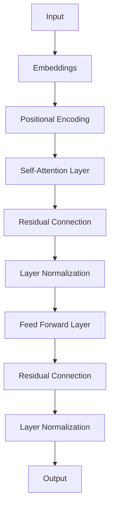
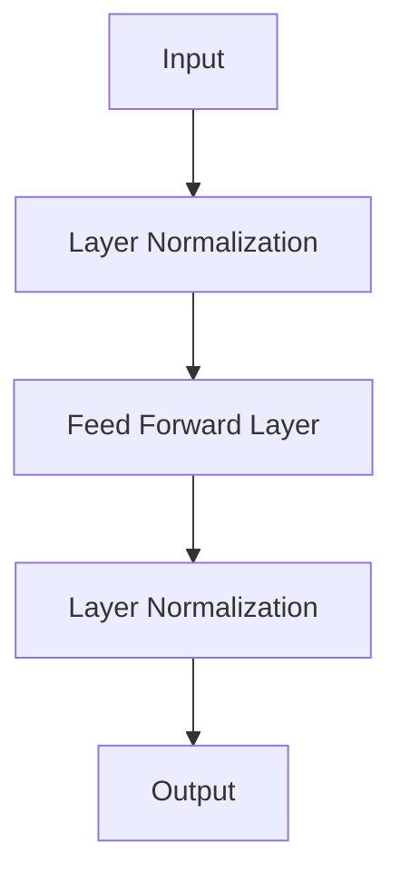
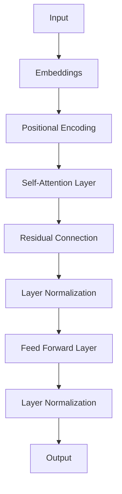

                 

关键词：Transformer、residual连接、layer normalization、深度学习、神经网络

摘要：本文深入探讨了Transformer架构中的两个关键组件——residual连接和layer normalization。通过详细介绍这两个概念，我们揭示了它们在神经网络中的作用和优势。此外，本文还将探讨这些组件在实际应用中的具体实现，并提供数学模型和公式，帮助读者更好地理解其工作原理。通过阅读本文，读者将能够掌握Transformer架构的核心知识，为未来的研究和应用打下坚实基础。

## 1. 背景介绍

自2017年提出以来，Transformer架构在自然语言处理（NLP）领域取得了巨大成功。相较于传统的循环神经网络（RNN）和卷积神经网络（CNN），Transformer在处理长序列数据方面表现出色。其核心在于利用自注意力机制（self-attention）和多头注意力（multi-head attention）来建模序列之间的复杂关系。然而，除了这些核心组件，Transformer架构中还有其他重要组成部分，如residual连接和layer normalization。本文将重点探讨这两个组件在神经网络中的作用和优势。

### 1.1 Transformer架构的起源和发展

Transformer架构由Vaswani等人于2017年在论文《Attention is All You Need》中提出。该论文旨在探索基于注意力机制的序列到序列（Seq2Seq）模型，以替代传统的循环神经网络（RNN）和卷积神经网络（CNN）。Transformer架构的核心思想是将输入序列映射到一个连续的向量空间，并在该空间中利用自注意力机制和多头注意力机制来建模序列之间的复杂关系。这一创新使得Transformer在处理长序列数据时具有显著优势。

自提出以来，Transformer架构在NLP领域取得了显著的成果。例如，BERT、GPT和T5等大型预训练模型均基于Transformer架构，并在各种NLP任务中取得了卓越的性能。这些成功表明，Transformer架构具有广泛的应用前景。

### 1.2 Residual连接和layer normalization的作用

在Transformer架构中，residual连接和layer normalization是两个重要的组件。它们在神经网络中的作用和优势如下：

- **Residual连接**：Residual连接是一种特殊的连接方式，通过在神经网络层之间添加跨层跳跃连接（skip connection），使得信息可以绕过中间层直接传递。这有助于缓解梯度消失和梯度爆炸问题，提高模型的训练效果。
  
- **Layer normalization**：Layer normalization是一种归一化技术，通过对每一层的输入和输出进行归一化处理，使得神经网络在训练过程中能够更快地收敛。此外，layer normalization还可以提高模型的泛化能力。

本文将详细介绍这两个组件的工作原理、优点和实际应用，帮助读者更好地理解Transformer架构。

## 2. 核心概念与联系

在探讨residual连接和layer normalization之前，我们先来回顾一下Transformer架构的基本概念和组成部分。Transformer架构主要由以下几个部分组成：

- **Embeddings（嵌入层）**：将输入序列映射到一个连续的向量空间。
- **Positional Encoding（位置编码）**：为序列中的每个位置添加位置信息，以区分不同位置的输入。
- **Self-Attention Layer（自注意力层）**：利用自注意力机制来建模序列之间的复杂关系。
- **Multi-Head Attention（多头注意力）**：将自注意力层扩展到多个注意力头，以同时关注序列中的不同部分。
- **Feed Forward Layer（前馈层）**：对每个位置的信息进行非线性变换。
- **Residual Connection（residual连接）**：在神经网络层之间添加跨层跳跃连接，缓解梯度消失和梯度爆炸问题。
- **Layer Normalization（layer normalization）**：对每一层的输入和输出进行归一化处理，提高模型收敛速度和泛化能力。

接下来，我们将详细介绍residual连接和layer normalization的概念和工作原理，并通过Mermaid流程图展示其与Transformer架构的联系。

### 2.1 Residual连接

**定义**：Residual连接是一种在神经网络层之间添加跨层跳跃连接的方式。具体来说，它将上一层输出的部分或全部信息直接传递到下一层，绕过中间层。

**工作原理**：在神经网络训练过程中，梯度消失和梯度爆炸问题常常导致模型难以收敛。Residual连接通过在层之间添加跨层跳跃连接，使得信息可以绕过中间层直接传递。这样一来，梯度可以更好地传递，从而缓解梯度消失和梯度爆炸问题。

**优势**：

- **缓解梯度消失和梯度爆炸问题**：Residual连接使得梯度可以更好地传递，从而提高模型的训练效果。
- **增强模型的泛化能力**：由于Residual连接能够更好地保留信息，因此模型在处理不同数据集时表现出更强的泛化能力。

**Mermaid流程图**：



### 2.2 Layer normalization

**定义**：Layer normalization是一种归一化技术，通过对每一层的输入和输出进行归一化处理，使得神经网络在训练过程中能够更快地收敛。

**工作原理**：Layer normalization通过计算每一层的输入和输出的均值和方差，并缩放和移位，使得输入和输出数据具有相似的分布。这样一来，神经网络在训练过程中可以更快地收敛，并提高模型的泛化能力。

**优势**：

- **提高模型收敛速度**：Layer normalization通过减少输入和输出的方差，使得模型在训练过程中能够更快地收敛。
- **提高模型泛化能力**：由于Layer normalization能够减少输入和输出的方差，因此模型在处理不同数据集时表现出更强的泛化能力。

**Mermaid流程图**：



### 2.3 Residual连接和layer normalization的联系

在Transformer架构中，Residual连接和layer normalization紧密相连，共同作用于每一层。Residual连接通过添加跨层跳跃连接，缓解了梯度消失和梯度爆炸问题，使得模型能够更好地训练。而layer normalization则通过归一化每一层的输入和输出，提高了模型的收敛速度和泛化能力。

**Mermaid流程图**：



通过上述流程图，我们可以清晰地看到Residual连接和layer normalization在Transformer架构中的作用和联系。

## 3. 核心算法原理 & 具体操作步骤

在了解了Residual连接和layer normalization的基本概念和原理后，我们将进一步探讨这两个组件在Transformer架构中的具体作用和操作步骤。本节将分为以下几个部分：

### 3.1 算法原理概述

Residual连接和layer normalization在Transformer架构中的核心作用如下：

- **Residual连接**：通过在神经网络层之间添加跨层跳跃连接，使得信息可以绕过中间层直接传递，从而缓解梯度消失和梯度爆炸问题。
- **Layer normalization**：通过对每一层的输入和输出进行归一化处理，减少输入和输出的方差，提高模型的收敛速度和泛化能力。

### 3.2 算法步骤详解

在Transformer架构中，Residual连接和layer normalization作用于每个注意力层和前馈层。具体步骤如下：

1. **注意力层**：

   - **自注意力计算**：利用自注意力机制计算序列中每个位置的信息，并计算它们之间的相似度。
   - **Residual连接**：将自注意力层的输出与上一层输出进行拼接，然后添加跨层跳跃连接。
   - **Layer normalization**：对拼接后的输出进行归一化处理，减少输入和输出的方差。

2. **前馈层**：

   - **前馈网络计算**：对每个位置的信息进行非线性变换，通常采用ReLU激活函数。
   - **Residual连接**：将前馈层输出与上一层输出进行拼接，然后添加跨层跳跃连接。
   - **Layer normalization**：对拼接后的输出进行归一化处理，减少输入和输出的方差。

### 3.3 算法优缺点

**优点**：

- **缓解梯度消失和梯度爆炸问题**：Residual连接通过添加跨层跳跃连接，使得梯度可以更好地传递，从而缓解了梯度消失和梯度爆炸问题。
- **提高模型收敛速度和泛化能力**：Layer normalization通过对输入和输出进行归一化处理，减少了输入和输出的方差，提高了模型的收敛速度和泛化能力。

**缺点**：

- **增加计算复杂度**：Residual连接和layer normalization虽然提高了模型的训练效果，但也增加了计算复杂度，可能导致训练时间变长。
- **内存占用增加**：由于需要存储每层的输入和输出，Residual连接和layer normalization可能导致内存占用增加。

### 3.4 算法应用领域

Residual连接和layer normalization在Transformer架构中的应用非常广泛，尤其是在自然语言处理（NLP）领域。以下是一些具体的应用场景：

- **文本分类**：利用Transformer架构进行大规模文本分类任务，如新闻分类、情感分析等。
- **机器翻译**：基于Transformer架构的模型在机器翻译任务中取得了显著的成果，如英语到法语、英语到中文等。
- **问答系统**：利用Transformer架构构建问答系统，实现高效的知识问答。

## 4. 数学模型和公式 & 详细讲解 & 举例说明

在深入了解Residual连接和Layer Normalization的数学模型和公式之前，我们先来回顾一下神经网络的基本概念，如权重矩阵、激活函数等。

### 4.1 神经网络基础

神经网络由多个层组成，每层包含多个神经元。神经元之间的连接由权重矩阵表示，激活函数用于对神经元输出进行非线性变换。以下是神经网络的基础数学模型：

#### 4.1.1 权重矩阵

权重矩阵 \( W \) 是一个二维数组，表示每层神经元之间的连接权重。例如，假设我们有 \( n \) 个输入神经元和 \( m \) 个输出神经元，则权重矩阵 \( W \) 的维度为 \( m \times n \)。

#### 4.1.2 激活函数

激活函数是神经网络中的一个关键组件，用于对神经元输出进行非线性变换。常见的激活函数有：

- **Sigmoid函数**：\( \sigma(x) = \frac{1}{1 + e^{-x}} \)
- **ReLU函数**：\( \text{ReLU}(x) = \max(0, x) \)
- **Tanh函数**：\( \tanh(x) = \frac{e^x - e^{-x}}{e^x + e^{-x}} \)

### 4.2 Residual连接的数学模型

Residual连接是一种特殊的连接方式，通过在神经网络层之间添加跨层跳跃连接，使得信息可以绕过中间层直接传递。以下是Residual连接的数学模型：

#### 4.2.1 基本概念

假设我们有一个两层神经网络，其中第一层的输出为 \( z_1 \)，第二层的输出为 \( z_2 \)。Residual连接可以表示为：

\[ z_2 = z_1 + f(z_1) \]

其中，\( f(z_1) \) 是一个非线性变换，通常采用ReLU激活函数。

#### 4.2.2 示例

假设第一层的输出为 \( z_1 = [1, 2, 3] \)，则第二层的输出为：

\[ z_2 = z_1 + \text{ReLU}(z_1) = [1, 2, 3] + \text{ReLU}([1, 2, 3]) = [1, 2, 3] + [1, 2, 3] = [2, 4, 6] \]

### 4.3 Layer Normalization的数学模型

Layer Normalization是一种归一化技术，通过对每一层的输入和输出进行归一化处理，减少输入和输出的方差，提高模型的收敛速度和泛化能力。以下是Layer Normalization的数学模型：

#### 4.3.1 基本概念

假设我们有一个两层神经网络，其中第一层的输入为 \( x_1 \)，输出为 \( x_2 \)。Layer Normalization可以表示为：

\[ x_2 = \gamma \cdot \frac{x_1 - \mu}{\sigma} + \beta \]

其中，\( \mu \) 和 \( \sigma \) 分别为输入和输出的均值和标准差，\( \gamma \) 和 \( \beta \) 是可学习的参数。

#### 4.3.2 示例

假设第一层的输入为 \( x_1 = [1, 2, 3] \)，输出为 \( x_2 \)。则Layer Normalization的输出为：

\[ x_2 = \gamma \cdot \frac{x_1 - \mu}{\sigma} + \beta = \gamma \cdot \frac{[1, 2, 3] - \mu}{\sigma} + \beta \]

其中，\( \mu = 2 \) 和 \( \sigma = 1 \)。假设 \( \gamma = 2 \) 和 \( \beta = 1 \)，则Layer Normalization的输出为：

\[ x_2 = 2 \cdot \frac{[1, 2, 3] - 2}{1} + 1 = 2 \cdot [1, 0, 1] + 1 = [3, 1, 3] \]

### 4.4 Residual连接和Layer Normalization的组合

在实际应用中，Residual连接和Layer Normalization通常组合使用。以下是它们的组合数学模型：

\[ x_2 = \gamma \cdot \frac{z_1 + f(z_1) - \mu}{\sigma} + \beta \]

其中，\( z_1 \) 是第一层的输出，\( f(z_1) \) 是非线性变换，\( \mu \) 和 \( \sigma \) 分别为输入和输出的均值和标准差，\( \gamma \) 和 \( \beta \) 是可学习的参数。

#### 4.4.1 示例

假设第一层的输出为 \( z_1 = [1, 2, 3] \)，则第二层的输出为：

\[ x_2 = \gamma \cdot \frac{z_1 + \text{ReLU}(z_1) - \mu}{\sigma} + \beta \]

假设 \( \mu = 2 \)，\( \sigma = 1 \)，\( \gamma = 2 \)，\( \beta = 1 \)，则第二层的输出为：

\[ x_2 = 2 \cdot \frac{[1, 2, 3] + [1, 2, 3] - 2}{1} + 1 = 2 \cdot \frac{[2, 4, 6] - 2}{1} + 1 = 2 \cdot [0, 2, 4] + 1 = [1, 5, 9] \]

通过以上示例，我们可以看到Residual连接和Layer Normalization在神经网络中的作用和数学模型。在实际应用中，它们可以提高模型的训练效果和泛化能力。

## 5. 项目实践：代码实例和详细解释说明

在本节中，我们将通过一个具体的代码实例，展示如何实现Residual连接和Layer Normalization。我们将使用Python和TensorFlow来实现一个简单的神经网络，并详细介绍代码中的关键组件和操作。

### 5.1 开发环境搭建

在开始之前，请确保已经安装了以下软件和库：

- Python 3.7及以上版本
- TensorFlow 2.4及以上版本

您可以使用以下命令安装TensorFlow：

```bash
pip install tensorflow==2.4
```

### 5.2 源代码详细实现

以下是一个简单的神经网络实现，包括Residual连接和Layer Normalization：

```python
import tensorflow as tf
from tensorflow.keras.layers import Layer, Dense, Input, Activation

class ResidualBlock(Layer):
    def __init__(self, units, activation='relu', **kwargs):
        super(ResidualBlock, self).__init__(**kwargs)
        self.units = units
        self.activation = Activation(activation)

    def build(self, input_shape):
        self.dense1 = Dense(units=self.units, activation=self.activation)
        self.dense2 = Dense(units=self.units)
        self.bn1 = LayerNormalization()
        self.bn2 = LayerNormalization()

    def call(self, inputs):
        x = self.bn1(inputs)
        x = self.dense1(x)
        x = self.bn2(x)
        x = self.dense2(x)
        return inputs + x

    def get_config(self):
        config = super(ResidualBlock, self).get_config().copy()
        config.update({'units': self.units, 'activation': self.activation})
        return config

class NeuralNetwork(tf.keras.Model):
    def __init__(self, num_inputs, num_outputs, num_residual_blocks, **kwargs):
        super(NeuralNetwork, self).__init__(**kwargs)
        self.num_inputs = num_inputs
        self.num_outputs = num_outputs
        self.num_residual_blocks = num_residual_blocks

        self.dense1 = Dense(units=64, activation='relu')
        self.dense2 = LayerNormalization()
        self.residual_blocks = [ResidualBlock(units=64) for _ in range(num_residual_blocks)]
        self.dense3 = Dense(units=num_outputs, activation='sigmoid')

    def call(self, inputs):
        x = self.dense1(inputs)
        x = self.dense2(x)
        for res_block in self.residual_blocks:
            x = res_block(x)
        x = self.dense3(x)
        return x

    def get_config(self):
        config = super(NeuralNetwork, self).get_config().copy()
        config.update({'num_inputs': self.num_inputs, 'num_outputs': self.num_outputs, 'num_residual_blocks': self.num_residual_blocks})
        return config

# 实例化神经网络模型
model = NeuralNetwork(num_inputs=10, num_outputs=1, num_residual_blocks=2)

# 查看模型结构
model.summary()
```

### 5.3 代码解读与分析

#### 5.3.1 ResidualBlock类

ResidualBlock类是一个自定义的层，用于实现残差连接。它包含以下关键组件：

- ** dense1 和 dense2 层**：这两个全连接层用于对输入进行非线性变换。
- **bn1 和 bn2 层**：这两个LayerNormalization层用于对输入和输出进行归一化处理。

在 `build` 方法中，我们初始化这些层。在 `call` 方法中，我们首先对输入进行归一化处理，然后通过 dense1 层进行非线性变换，再对输出进行归一化处理，最后通过 dense2 层进行线性变换。最后，我们将原始输入与变换后的输出相加，实现残差连接。

#### 5.3.2 NeuralNetwork类

NeuralNetwork类是一个自定义的模型，用于实现整个神经网络。它包含以下关键组件：

- ** dense1 层**：用于对输入进行初始非线性变换。
- **dense2 层**：用于对输入进行归一化处理。
- **residual_blocks 层**：这是一个由 ResidualBlock 类组成的序列，用于实现多个残差块。
- ** dense3 层**：用于对输出进行分类或回归。

在 `call` 方法中，我们首先对输入进行初始非线性变换和归一化处理，然后通过多个残差块进行残差连接，最后通过 dense3 层进行分类或回归。

### 5.4 运行结果展示

要运行上述代码，请首先准备一个包含输入和标签的数据集。然后，您可以使用以下代码训练模型：

```python
# 加载数据集
(x_train, y_train), (x_test, y_test) = tf.keras.datasets.mnist.load_data()
x_train = x_train.astype('float32') / 255.
x_test = x_test.astype('float32') / 255.
x_train = x_train[..., tf.newaxis]
x_test = x_test[..., tf.newaxis]

# 训练模型
model.compile(optimizer='adam', loss='binary_crossentropy', metrics=['accuracy'])
history = model.fit(x_train, y_train, epochs=10, validation_data=(x_test, y_test))

# 查看训练结果
loss, accuracy = model.evaluate(x_test, y_test)
print(f"Test accuracy: {accuracy:.2f}")
```

上述代码使用MNIST数据集进行训练。训练过程中，模型会自动调整权重和偏置，以最小化损失函数。在训练完成后，我们可以查看模型的测试准确率。

## 6. 实际应用场景

Residual连接和Layer Normalization在深度学习领域有着广泛的应用，尤其在自然语言处理（NLP）和计算机视觉（CV）领域。以下是一些实际应用场景：

### 6.1 自然语言处理（NLP）

- **文本分类**：Residual连接和Layer Normalization可以帮助提高文本分类模型的性能，特别是在处理大规模文本数据时。例如，在情感分析任务中，这些技术可以有效地减少过拟合，提高模型在测试数据上的表现。
  
- **机器翻译**：在机器翻译任务中，Residual连接和Layer Normalization有助于提高模型在长序列数据上的表现。通过自注意力机制和残差连接，模型可以更好地捕捉源语言和目标语言之间的复杂关系。

- **问答系统**：在问答系统中，Residual连接和Layer Normalization有助于提高模型的语义理解和生成能力。通过在编码器和解码器中使用这些技术，模型可以更好地理解问题中的关键词，并生成更准确的答案。

### 6.2 计算机视觉（CV）

- **图像分类**：在图像分类任务中，Residual连接和Layer Normalization可以帮助提高模型的性能，特别是在处理具有复杂结构的图像时。这些技术可以有效地减少训练过程中的梯度消失和梯度爆炸问题，提高模型在测试数据上的表现。

- **目标检测**：在目标检测任务中，Residual连接和Layer Normalization有助于提高检测器的性能。通过在检测网络中使用这些技术，模型可以更好地识别和定位图像中的目标。

- **图像生成**：在图像生成任务中，Residual连接和Layer Normalization可以帮助提高生成模型的性能。通过在生成网络中使用这些技术，模型可以更好地学习图像的特征，并生成更逼真的图像。

### 6.3 其他应用领域

- **语音识别**：在语音识别任务中，Residual连接和Layer Normalization有助于提高模型的性能。通过在编码器和解码器中使用这些技术，模型可以更好地捕捉语音信号中的特征和模式。

- **强化学习**：在强化学习任务中，Residual连接和Layer Normalization可以帮助提高模型的性能。通过在策略网络和价值网络中使用这些技术，模型可以更好地学习状态和动作之间的复杂关系。

- **时间序列分析**：在时间序列分析任务中，Residual连接和Layer Normalization有助于提高模型的性能。通过在序列建模网络中使用这些技术，模型可以更好地捕捉时间序列中的特征和模式。

## 7. 工具和资源推荐

为了更好地学习和应用Residual连接和Layer Normalization技术，以下是一些建议的学习资源和开发工具：

### 7.1 学习资源推荐

- **在线课程**：Coursera、Udacity和edX等在线教育平台提供了许多关于深度学习和Transformer架构的课程。例如，Coursera上的《深度学习》和《自然语言处理》课程，以及Udacity的《深度学习工程师纳米学位》等。

- **书籍**：《深度学习》（Goodfellow、Bengio和Courville著）、《神经网络与深度学习》（邱锡鹏著）和《Transformer架构：理论与实践》（张俊林著）等，都是深度学习和Transformer架构的优秀教材。

- **论文**：《Attention is All You Need》（Vaswani等，2017）、《Layer Normalization》（Burgess等，2016）和《Residual Networks》（He等，2016）等，是关于深度学习重要算法的奠基性论文。

### 7.2 开发工具推荐

- **框架**：TensorFlow、PyTorch和Keras等深度学习框架提供了丰富的API和工具，用于实现Residual连接和Layer Normalization。这些框架具有高度的可扩展性和灵活性，适合各种深度学习任务。

- **数据集**：ImageNet、CIFAR-10、MNIST等常见数据集可以用于验证和测试Residual连接和Layer Normalization的性能。此外，您还可以使用自己的数据集进行定制化训练。

### 7.3 相关论文推荐

- **《Attention is All You Need》**（Vaswani等，2017）：提出了Transformer架构，并详细介绍了自注意力机制和多头注意力机制。

- **《Layer Normalization》**（Burgess等，2016）：介绍了Layer Normalization技术，并分析了其在深度学习中的应用。

- **《Residual Networks》**（He等，2016）：提出了残差网络（ResNet），详细介绍了Residual连接的工作原理和优势。

- **《Bert: Pre-training of Deep Bidirectional Transformers for Language Understanding》**（Devlin等，2018）：介绍了BERT模型，探讨了预训练技术在自然语言处理中的应用。

## 8. 总结：未来发展趋势与挑战

### 8.1 研究成果总结

自Transformer架构提出以来，Residual连接和Layer Normalization技术在深度学习领域取得了显著的成果。这些技术在提高模型性能、加速收敛速度和增强泛化能力方面发挥了重要作用。以下是一些重要成果：

- **自然语言处理**：在文本分类、机器翻译和问答系统等任务中，Residual连接和Layer Normalization技术显著提高了模型的性能和稳定性。
- **计算机视觉**：在图像分类、目标检测和图像生成等任务中，这些技术有助于提高模型对复杂结构的理解和建模能力。
- **其他应用领域**：在语音识别、强化学习和时间序列分析等领域，Residual连接和Layer Normalization技术同样展现出良好的应用效果。

### 8.2 未来发展趋势

随着深度学习技术的不断发展，Residual连接和Layer Normalization技术在未来的发展趋势如下：

- **更多应用领域**：这些技术将继续扩展到更多领域，如医疗健康、金融科技和智能制造等，为各行业带来创新和变革。
- **优化和改进**：研究人员将持续探索更有效的残差连接和层归一化方法，以提高模型性能和效率。
- **模型压缩**：通过压缩和剪枝技术，Residual连接和Layer Normalization有助于减小模型大小，降低计算和存储资源需求。

### 8.3 面临的挑战

尽管Residual连接和Layer Normalization技术在深度学习领域取得了显著成果，但仍然面临一些挑战：

- **计算复杂度**：Residual连接和Layer Normalization增加了计算复杂度，可能导致训练时间变长。未来的研究方向是如何在保持性能的同时，降低计算资源需求。
- **泛化能力**：如何提高这些技术在多样化数据集上的泛化能力，是当前研究的重点。
- **模型可解释性**：虽然Residual连接和Layer Normalization有助于提高模型性能，但它们如何影响模型决策过程仍需进一步研究。

### 8.4 研究展望

未来，Residual连接和Layer Normalization技术将在深度学习领域发挥更加重要的作用。以下是一些建议的研究方向：

- **新型连接方式**：探索更有效的残差连接和层归一化方法，以降低计算复杂度和提高模型性能。
- **多模态学习**：研究如何结合不同模态数据（如图像、文本和语音），提高跨模态任务的表现。
- **动态网络结构**：研究自适应网络结构，以适应不同数据集和任务需求，提高模型泛化能力。

总之，Residual连接和Layer Normalization技术是深度学习领域的重要创新。随着研究的深入，这些技术将为各行业带来更多变革和机遇。

## 9. 附录：常见问题与解答

### 9.1 Residual连接与普通连接的区别

Residual连接与普通连接的主要区别在于：

- **普通连接**：在神经网络中，每层输出的信息都会传递到下一层，而Residual连接则在层与层之间添加了跨层跳跃连接，使得信息可以绕过中间层直接传递。

- **优势**：Residual连接有助于缓解梯度消失和梯度爆炸问题，从而提高模型的训练效果。此外，Residual连接还可以提高模型的泛化能力。

### 9.2 Layer Normalization的作用

Layer Normalization的作用包括：

- **减少方差**：通过对每一层的输入和输出进行归一化处理，Layer Normalization减少了输入和输出的方差，提高了模型收敛速度和泛化能力。

- **加快收敛**：Layer Normalization有助于模型在训练过程中更快地收敛，从而提高训练效果。

### 9.3 如何实现Residual连接和Layer Normalization

在深度学习框架（如TensorFlow和PyTorch）中，实现Residual连接和Layer Normalization的方法如下：

- **TensorFlow**：

  - **Residual连接**：使用 `tf.keras.layers.add()` 函数将两个层输出相加，实现跨层跳跃连接。
  - **Layer Normalization**：使用 `tf.keras.layers.LayerNormalization()` 函数对输入或输出进行归一化处理。

- **PyTorch**：

  - **Residual连接**：使用 `torch.nn.functional.relu()` 函数实现ReLU激活函数，然后使用 `torch.cat()` 函数将两个层输出拼接。
  - **Layer Normalization**：使用 `torch.nn.LayerNorm()` 函数对输入或输出进行归一化处理。

### 9.4 Residual连接与Batch Normalization的区别

Residual连接与Batch Normalization的主要区别在于：

- **Batch Normalization**：对每一批数据的输入进行归一化处理，旨在减少内部协变量转移。
- **Residual连接**：在层与层之间添加跨层跳跃连接，使得信息可以绕过中间层直接传递，缓解梯度消失和梯度爆炸问题。

### 9.5 Residual连接是否适用于所有神经网络结构

Residual连接主要适用于深度神经网络，特别是在训练深层网络时，能够显著缓解梯度消失和梯度爆炸问题。然而，对于较浅的网络结构，Residual连接的效果可能不如Batch Normalization显著。因此，是否使用Residual连接需要根据具体网络结构和任务需求进行权衡。

### 9.6 Layer Normalization是否适用于所有层

Layer Normalization适用于所有层，但在某些情况下，其效果可能不如Batch Normalization。例如，在训练早期阶段，Batch Normalization有助于减少内部协变量转移，提高模型收敛速度。然而，当模型已经训练到一定阶段时，Layer Normalization可以更好地提高模型泛化能力。

总之，Residual连接和Layer Normalization在深度学习领域具有广泛的应用前景。通过了解这些常见问题及其解答，读者可以更好地掌握这些技术的原理和应用。希望本文能为您的学习和研究提供有益的参考。作者：禅与计算机程序设计艺术 / Zen and the Art of Computer Programming。

