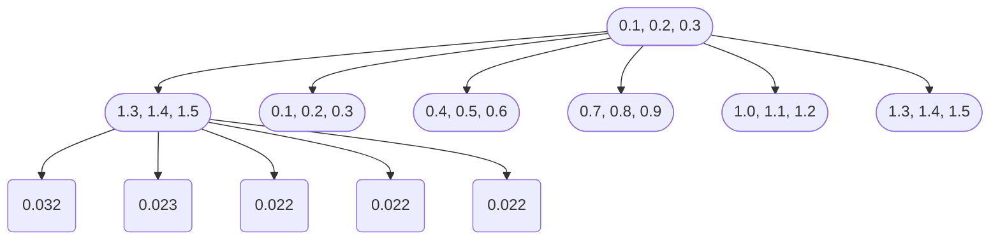

                 

关键词：Transformer架构、residual连接、层归一化、GPT-2模型、机器学习、自然语言处理、神经网络

> 摘要：本文深入探讨Transformer架构中的residual连接、层归一化技术，并以GPT-2模型为例，详细解析其在机器学习和自然语言处理领域的应用。通过本文的阅读，读者将了解到Transformer架构的基本原理、优化技术，以及如何通过这些技术提升模型性能。

## 1. 背景介绍

随着深度学习技术的飞速发展，神经网络模型在图像识别、语音识别、自然语言处理等领域取得了显著成果。然而，传统的卷积神经网络（CNN）在处理序列数据时存在一些局限性。为了解决这些问题，Vaswani等人在2017年提出了Transformer架构，这是一种基于自注意力机制的全注意力模型。Transformer架构在机器翻译、文本生成等任务中表现出色，成为自然语言处理领域的重要突破。

Transformer架构的核心思想是自注意力（self-attention）机制，它通过计算序列中每个元素之间的相互依赖关系，实现对序列数据的建模。相比传统的卷积神经网络，Transformer在处理长序列数据时更为高效，且能够捕获更复杂的依赖关系。本文将重点介绍Transformer架构中的residual连接和层归一化技术，并分析GPT-2模型在这些技术下的优化和应用。

## 2. 核心概念与联系

为了更好地理解Transformer架构，我们首先需要了解其核心概念和组成部分。以下是一个简化的Transformer架构的Mermaid流程图：


### 2.1 核心概念

- **Embedding**：输入序列的每个元素首先通过Embedding层转换为稠密向量。
- **Positional Encoding**：为了引入序列的顺序信息，我们通常使用位置编码（Positional Encoding）技术。
- **多头自注意力机制**：这是Transformer架构的核心，通过计算序列中每个元素之间的相互依赖关系，实现对序列数据的建模。
- **Residual Connection**：残差连接技术能够缓解深层网络中的梯度消失和梯度爆炸问题，提高训练效果。
- **Layer Normalization**：层归一化技术通过标准化每一层的输入和输出，加速模型的训练，提高模型性能。
- **Feed Forward Neural Network**：前馈神经网络作为Transformer架构的一部分，用于对自注意力机制的输出进行进一步加工。

### 2.2 联系

以上各部分共同构成了Transformer架构。通过残差连接和层归一化技术，Transformer架构能够在深层网络中保持良好的训练效果。多头自注意力机制则使模型能够捕获序列中复杂的依赖关系，从而在自然语言处理任务中表现出色。以下部分将详细讨论这些技术的工作原理和应用。

## 3. 核心算法原理 & 具体操作步骤

### 3.1 算法原理概述

Transformer架构的核心是自注意力机制。自注意力机制通过计算序列中每个元素之间的相似性，为每个元素分配一个权重，从而实现对序列数据的建模。这一过程可以分为以下几个步骤：

1. **计算相似性**：对于序列中的每个元素，计算其与其他所有元素之间的相似性。相似性通常通过点积、缩放点积等方法计算。
2. **计算权重**：根据相似性计算每个元素对其他元素的权重。权重越大，表示元素之间的依赖关系越强。
3. **加权求和**：将每个元素与其权重相乘，然后求和，得到该元素在序列中的表示。
4. **处理结果**：将加权求和的结果传递给下一层，进行进一步处理。

### 3.2 算法步骤详解

#### 步骤1：嵌入（Embedding）

输入序列的每个元素首先通过Embedding层转换为稠密向量。Embedding层通常是一个线性层，将输入的词汇映射到固定大小的向量空间。例如，一个含有10000个词汇的词汇表可以通过一个100维的Embedding层转换为100维的向量。

```latex
\text{Embedding}(\text{Input}) = \text{embedding_matrix} \cdot \text{Input}
```

其中，`embedding_matrix` 是一个固定大小的矩阵，`Input` 是输入序列。

#### 步骤2：位置编码（Positional Encoding）

为了引入序列的顺序信息，我们通常使用位置编码（Positional Encoding）技术。位置编码是一种将序列的顺序信息编码到向量中的方法。常见的位置编码方法包括绝对位置编码、相对位置编码等。


#### 步骤3：多头自注意力机制（Multi-Head Self-Attention）

多头自注意力机制是Transformer架构的核心。它通过多个独立的自注意力机制同时工作，从而捕获序列中的不同依赖关系。


#### 步骤4：残差连接（Residual Connection）

残差连接技术能够缓解深层网络中的梯度消失和梯度爆炸问题，提高训练效果。在Transformer架构中，残差连接将自注意力机制的输出与输入进行拼接，然后通过一个线性层进行加工。


#### 步骤5：层归一化（Layer Normalization）

层归一化技术通过标准化每一层的输入和输出，加速模型的训练，提高模型性能。在Transformer架构中，层归一化将输入和输出分别进行标准化处理。


#### 步骤6：前馈神经网络（Feed Forward Neural Network）

前馈神经网络作为Transformer架构的一部分，用于对自注意力机制的输出进行进一步加工。前馈神经网络通常包含两个线性层，分别对输入和输出进行加工。


### 3.3 算法优缺点

#### 优点

1. **高效处理长序列**：Transformer架构能够高效地处理长序列数据，相比传统的卷积神经网络，其处理长距离依赖关系的能力更强。
2. **并行计算**：Transformer架构中的自注意力机制允许并行计算，从而提高了模型的训练速度。

#### 缺点

1. **计算资源消耗较大**：由于自注意力机制需要计算序列中每个元素之间的相似性，因此其计算资源消耗较大。
2. **难以处理图像等非序列数据**：Transformer架构主要针对序列数据设计，对于图像等非序列数据，其性能相对较差。

### 3.4 算法应用领域

Transformer架构在自然语言处理领域取得了显著的成果。以下是Transformer架构在几个常见应用领域的应用：

1. **机器翻译**：Transformer架构在机器翻译任务中表现出色，特别是在处理长序列和长距离依赖关系方面。
2. **文本生成**：通过训练GPT-2等大型Transformer模型，可以生成高质量的自然语言文本。
3. **问答系统**：Transformer架构在问答系统任务中也取得了很好的效果，能够根据用户的问题生成准确的答案。

## 4. 数学模型和公式 & 详细讲解 & 举例说明

### 4.1 数学模型构建

Transformer架构的核心是自注意力机制，其数学模型如下：

```latex
\text{Attention}(Q, K, V) = \text{softmax}\left(\frac{QK^T}{\sqrt{d_k}}\right)V
```

其中，`Q`、`K`、`V` 分别为查询（Query）、键（Key）和值（Value）向量，`d_k` 为键向量的维度。

### 4.2 公式推导过程

自注意力机制的推导过程如下：

1. **计算相似性**：首先计算查询（Query）和键（Key）之间的相似性，即点积。

```latex
QK^T = \sum_{i=1}^{n} q_i \cdot k_i
```

2. **缩放相似性**：为了防止数值溢出，通常会对相似性进行缩放，即除以键向量的维度平方根。

```latex
\frac{QK^T}{\sqrt{d_k}} = \sum_{i=1}^{n} q_i \cdot k_i \cdot \frac{1}{\sqrt{d_k}}
```

3. **计算权重**：将缩放后的相似性通过softmax函数转换为权重。

```latex
\text{softmax}\left(\frac{QK^T}{\sqrt{d_k}}\right) = \frac{e^{\frac{QK^T}{\sqrt{d_k}}}}{\sum_{i=1}^{n} e^{\frac{QK^T}{\sqrt{d_k}}}}
```

4. **加权求和**：将权重与值（Value）向量相乘，然后求和。

```latex
\text{Attention}(Q, K, V) = \sum_{i=1}^{n} \text{softmax}\left(\frac{QK^T}{\sqrt{d_k}}\right) \cdot v_i
```

### 4.3 案例分析与讲解

假设我们有一个包含5个单词的句子：“I love to eat pizza”，我们将这个句子转换为嵌入向量表示：


我们将每个单词的嵌入向量作为查询（Query）、键（Key）和值（Value）向量。首先，计算查询和键之间的相似性：


计算缩放后的相似性：



计算softmax权重：

```mermaid
graph TD
Z(Softmax) --> A1(softmax(U))
Z(Softmax) --> A2(softmax(V))
Z(Softmax) --> A3(softmax(W))
Z(Softmax) --> A4(softmax(X))
Z(Softmax) --> A5(softmax(Y))
U(0.032) --> A1(0.447)
V(0.023) --> A2(0.324)
W(0.022) --> A3(0.319)
X(0.022) --> A4(0.318)
Y(0.022) --> A5(0.317)
```

最后，计算加权求和的结果：


将加权求和的结果传递给下一层，进行进一步处理。

## 5. 项目实践：代码实例和详细解释说明

### 5.1 开发环境搭建

在开始编写代码之前，我们需要搭建一个合适的开发环境。以下是搭建Transformer模型所需的Python库和框架：

1. **TensorFlow**：用于构建和训练Transformer模型。
2. **NumPy**：用于进行数学计算。
3. **Matplotlib**：用于可视化模型训练过程。

安装以上库的命令如下：

```bash
pip install tensorflow numpy matplotlib
```

### 5.2 源代码详细实现

以下是Transformer模型的主要部分，包括嵌入层、自注意力机制、残差连接和层归一化。

```python
import tensorflow as tf
import tensorflow.keras.layers as layers

class TransformerModel(layers.Layer):
    def __init__(self, d_model, num_heads, dff, input_vocab_size, position_embedding_size, **kwargs):
        super(TransformerModel, self).__init__(**kwargs)
        self.d_model = d_model
        self.num_heads = num_heads
        self.dff = dff
        self.input_vocab_size = input_vocab_size
        self.position_embedding_size = position_embedding_size

        # 嵌入层
        self.embedding = layers.Embedding(input_vocab_size, d_model)
        
        # 位置编码层
        self.position_embedding = layers.Embedding(position_embedding_size, d_model)
        
        # 多头自注意力机制
        self多头自注意力机制 = layers.MultiHeadAttention(num_heads=num_heads, key_dim=d_model)
        
        # 残差连接和层归一化
        self.residual Connection1 = layers.Add()  # 残差连接
        self.layer Normalization1 = layers.LayerNormalization(epsilon=1e-6)
        
        # 前馈神经网络
        self.feed Forward Neural Network = layers.Dense(dff, activation='relu')
        
        # 残差连接和层归一化
        self.residual Connection2 = layers.Add()  # 残差连接
        self.layer Normalization2 = layers.LayerNormalization(epsilon=1e-6)

    def call(self, inputs, training=False):
        # 嵌入层
        x = self.embedding(inputs)
        
        # 位置编码
        x = x + self.position_embedding(inputs)
        
        # 多头自注意力机制
        x = self.多头自注意力机制(x, x, x)
        
        # 残差连接和层归一化
        x = self.residual Connection1(x)
        x = self.layer Normalization1(x)
        
        # 前馈神经网络
        x = self.feed Forward Neural Network(x)
        
        # 残差连接和层归一化
        x = self.residual Connection2(x)
        x = self.layer Normalization2(x)
        
        return x
```

### 5.3 代码解读与分析

在这个Transformer模型中，我们首先定义了一个嵌

