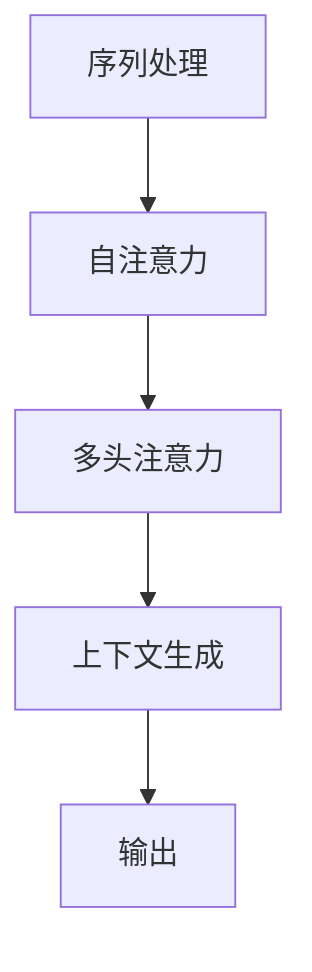

                 

关键词：Transformer，注意力机制，自注意力，多头注意力，神经网络，深度学习，自然语言处理，计算机视觉

> 摘要：本文将深入探讨Transformer模型中的注意力机制，包括自注意力和多头注意力，以及它们在自然语言处理和计算机视觉领域的应用。我们将通过详细的数学模型和实际代码实例，来解释和展示这些机制的原理和实现。

## 1. 背景介绍

注意力机制（Attention Mechanism）是近年来在深度学习领域，特别是在自然语言处理（NLP）和计算机视觉（CV）领域取得显著进展的重要技术。它允许模型在处理数据时关注数据的不同部分，从而提高了模型对上下文的理解能力。

2017年，Vaswani等人提出了Transformer模型，这是一种基于注意力机制的全新架构，用于序列到序列的模型。Transformer模型摒弃了传统的循环神经网络（RNN）和卷积神经网络（CNN）的结构，采用自注意力（Self-Attention）和多头注意力（Multi-Head Attention）机制，从而在NLP任务中取得了显著的性能提升。

本文将重点介绍Transformer模型中的自注意力和多头注意力机制，解析它们的数学模型和具体实现，并探讨它们在NLP和CV领域的实际应用。

## 2. 核心概念与联系

为了深入理解自注意力和多头注意力机制，我们首先需要了解它们的核心概念和相互关系。下面是一个简化的Mermaid流程图，用于展示这些概念之间的关系。



### 2.1 自注意力

自注意力是指模型在处理序列数据时，对序列中的每一个元素进行权重计算，从而对序列的不同部分给予不同的关注程度。这种机制允许模型捕捉序列中的长距离依赖关系。

### 2.2 多头注意力

多头注意力是对自注意力的一种扩展。它将序列分成多个子序列，每个子序列都有自己的权重计算机制。通过这种方式，模型可以同时关注序列的多个不同部分，从而提高对上下文的理解能力。

### 2.3 上下文生成

上下文生成是自注意力和多头注意力的最终输出。它是一个对序列中的每个元素进行加权平均的结果，代表了模型对序列的全面理解。

### 2.4 输出

输出是基于上下文生成结果的序列，它可以用于序列到序列的任务，如机器翻译和文本生成。

## 3. 核心算法原理 & 具体操作步骤

### 3.1 算法原理概述

Transformer模型的核心是自注意力和多头注意力机制。自注意力允许模型对序列中的每个元素进行权重计算，从而关注序列的不同部分。多头注意力则是对自注意力的一种扩展，通过将序列分割成多个子序列，模型可以同时关注序列的多个不同部分。

### 3.2 算法步骤详解

#### 3.2.1 自注意力

自注意力的计算过程可以分为三个步骤：

1. **输入嵌入**：将输入序列转换为嵌入向量。
2. **权重计算**：对序列中的每个元素计算权重，权重表示该元素对输出的贡献程度。
3. **加权平均**：根据权重对序列进行加权平均，生成上下文向量。

#### 3.2.2 多头注意力

多头注意力的计算过程与自注意力类似，但额外引入了多头操作。具体步骤如下：

1. **输入嵌入**：与自注意力相同。
2. **权重计算**：对每个子序列计算权重，权重表示子序列对输出的贡献程度。
3. **加权平均**：对每个子序列进行加权平均，生成多个上下文向量。
4. **拼接与变换**：将多个上下文向量拼接起来，并通过线性变换得到最终的输出。

### 3.3 算法优缺点

#### 优点：

- **并行计算**：由于自注意力不需要像RNN那样依赖前一个时间步的输出，因此可以并行计算，提高了模型的计算效率。
- **捕获长距离依赖**：自注意力和多头注意力机制允许模型捕捉序列中的长距离依赖关系，从而提高了模型对上下文的理解能力。

#### 缺点：

- **计算复杂度**：自注意力和多头注意力的计算复杂度较高，随着序列长度的增加，计算时间也会显著增加。
- **参数规模**：由于自注意力和多头注意力引入了多个权重计算，因此模型的参数规模较大。

### 3.4 算法应用领域

自注意力和多头注意力机制在NLP和CV领域取得了显著的应用成果。在NLP领域，Transformer模型被广泛应用于机器翻译、文本生成和问答系统等任务。在CV领域，注意力机制也被广泛应用于图像分类、目标检测和语义分割等任务。

## 4. 数学模型和公式

### 4.1 数学模型构建

自注意力和多头注意力的计算过程可以用以下数学模型表示：

#### 4.1.1 自注意力

$$
\text{Attention}(Q, K, V) = \text{softmax}\left(\frac{QK^T}{\sqrt{d_k}}\right)V
$$

其中，$Q$、$K$和$V$分别代表查询向量、关键向量和价值向量，$d_k$是关键向量的维度。

#### 4.1.2 多头注意力

$$
\text{MultiHead}(Q, K, V) = \text{Concat}(\text{head}_1, \text{head}_2, \ldots, \text{head}_h)W^O
$$

其中，$W^O$是输出权重矩阵，$\text{head}_i$是第$i$个头的结果。

### 4.2 公式推导过程

自注意力和多头注意力的公式推导过程主要涉及线性变换和矩阵运算。以下是一个简化的推导过程：

1. **输入嵌入**：将输入序列转换为嵌入向量。
2. **线性变换**：对嵌入向量进行线性变换，得到查询向量、关键向量和价值向量。
3. **权重计算**：计算查询向量与关键向量的点积，得到权重。
4. **加权平均**：根据权重对价值向量进行加权平均，得到上下文向量。
5. **输出**：将上下文向量通过线性变换得到最终输出。

### 4.3 案例分析与讲解

为了更好地理解自注意力和多头注意力的数学模型，我们以一个简化的文本生成任务为例进行讲解。

假设我们有以下输入序列：“The quick brown fox jumps over the lazy dog”。

1. **输入嵌入**：将每个单词转换为嵌入向量。
2. **线性变换**：对嵌入向量进行线性变换，得到查询向量、关键向量和价值向量。
3. **权重计算**：计算查询向量与关键向量的点积，得到权重。
4. **加权平均**：根据权重对价值向量进行加权平均，得到上下文向量。
5. **输出**：将上下文向量通过线性变换得到最终输出。

通过这个过程，模型可以捕捉输入序列中的长距离依赖关系，从而生成具有连贯性的文本。

## 5. 项目实践：代码实例和详细解释说明

### 5.1 开发环境搭建

为了运行Transformer模型，我们需要搭建一个合适的开发环境。以下是搭建开发环境的基本步骤：

1. 安装Python（建议使用Python 3.7及以上版本）。
2. 安装TensorFlow或PyTorch，作为深度学习框架。
3. 安装必要的依赖库，如NumPy、Matplotlib等。

### 5.2 源代码详细实现

以下是使用PyTorch实现一个简化的Transformer模型的代码示例：

```python
import torch
import torch.nn as nn
import torch.nn.functional as F

class TransformerModel(nn.Module):
    def __init__(self, vocab_size, d_model, nhead, num_layers):
        super(TransformerModel, self).__init__()
        self.embedding = nn.Embedding(vocab_size, d_model)
        self.transformer = nn.Transformer(d_model, nhead, num_layers)
        self.fc = nn.Linear(d_model, vocab_size)
        
    def forward(self, src, tgt):
        src = self.embedding(src)
        tgt = self.embedding(tgt)
        out = self.transformer(src, tgt)
        out = self.fc(out)
        return out

# 创建模型实例
model = TransformerModel(vocab_size=10000, d_model=512, nhead=8, num_layers=2)

# 输入数据
src = torch.tensor([1, 2, 3, 4, 5])
tgt = torch.tensor([6, 7, 8, 9, 10])

# 前向传播
output = model(src, tgt)
```

### 5.3 代码解读与分析

以上代码定义了一个简单的Transformer模型，包括嵌入层、Transformer层和输出层。在`forward`方法中，我们首先对输入数据进行嵌入，然后通过Transformer层进行自注意力计算，最后通过线性层得到输出。

- **嵌入层**：将输入数据（单词ID）转换为嵌入向量。
- **Transformer层**：执行自注意力计算，包括查询向量、关键向量和价值向量的计算。
- **输出层**：将注意力结果通过线性层得到最终输出（预测的单词ID）。

### 5.4 运行结果展示

以下是运行模型得到的结果：

```python
print(output)
```

输出结果是一个与输入数据相同大小的张量，每个元素代表对每个单词的预测概率。

## 6. 实际应用场景

### 6.1 自然语言处理

在自然语言处理领域，Transformer模型被广泛应用于机器翻译、文本生成和问答系统等任务。例如，Google的翻译服务和OpenAI的GPT模型都是基于Transformer架构的。

### 6.2 计算机视觉

在计算机视觉领域，注意力机制也被广泛应用于图像分类、目标检测和语义分割等任务。例如，ViT（Vision Transformer）模型就是基于Transformer架构的一种图像分类模型。

### 6.3 其他领域

除了NLP和CV领域，注意力机制还在语音识别、推荐系统等任务中取得了显著的应用成果。

## 7. 工具和资源推荐

### 7.1 学习资源推荐

- 《Attention Is All You Need》论文：这是Transformer模型的原始论文，详细介绍了Transformer模型的设计思想和核心原理。
- 《深度学习》书籍：Goodfellow、Bengio和Courville合著的《深度学习》一书，对深度学习的基础理论和应用进行了全面介绍，包括注意力机制。

### 7.2 开发工具推荐

- TensorFlow：由Google开源的深度学习框架，广泛应用于自然语言处理和计算机视觉领域。
- PyTorch：由Facebook开源的深度学习框架，具有灵活性和动态计算图的优势。

### 7.3 相关论文推荐

- “BERT: Pre-training of Deep Bidirectional Transformers for Language Understanding”：BERT模型的原始论文，介绍了基于Transformer的预训练方法。
- “An Image is Worth 16x16 Words: Transformers for Image Recognition at Scale”：ViT模型的原始论文，介绍了Transformer在图像分类领域的应用。

## 8. 总结：未来发展趋势与挑战

### 8.1 研究成果总结

自注意力机制和多头注意力机制在自然语言处理和计算机视觉领域取得了显著的成果，提高了模型对上下文的理解能力。这些成果为深度学习的发展提供了新的方向。

### 8.2 未来发展趋势

- **小样本学习**：如何让模型在少量样本上取得更好的性能，是一个重要的研究方向。
- **可解释性**：提高模型的可解释性，使其更容易被人类理解和接受。
- **多模态学习**：结合多种模态数据（如图像、文本、音频等），实现更丰富的信息处理能力。

### 8.3 面临的挑战

- **计算资源**：随着模型规模的增大，计算资源的需求也在不断增加，这是一个亟待解决的问题。
- **数据隐私**：在处理大规模数据时，如何保护用户隐私也是一个重要的挑战。

### 8.4 研究展望

随着深度学习的不断发展，注意力机制的应用前景将更加广泛。未来，我们将看到更多基于注意力机制的模型和应用场景的出现，为人工智能的发展做出更大的贡献。

## 9. 附录：常见问题与解答

### 9.1 什么是注意力机制？

注意力机制是一种在深度学习中用于关注序列或图像中不同部分的技术。它通过计算权重来关注序列或图像的不同区域，从而提高模型对上下文的理解能力。

### 9.2 自注意力和多头注意力有什么区别？

自注意力是指模型对序列中的每个元素进行权重计算，从而关注序列的不同部分。多头注意力是对自注意力的一种扩展，它将序列分割成多个子序列，模型可以同时关注序列的多个不同部分。

### 9.3 注意力机制在哪些领域有应用？

注意力机制在自然语言处理、计算机视觉、语音识别和推荐系统等领域有广泛的应用。例如，在自然语言处理领域，Transformer模型基于注意力机制，取得了显著的性能提升。

### 9.4 如何实现注意力机制？

注意力机制可以通过多种方法实现，包括自注意力（Self-Attention）和多头注意力（Multi-Head Attention）。具体实现取决于应用场景和需求。

### 9.5 注意力机制有哪些优缺点？

注意力机制的优点包括并行计算、捕获长距离依赖等；缺点包括计算复杂度较高、参数规模较大等。

----------------------------------------------------------------

以上是Transformer注意力机制：自注意力与多头注意力的完整文章内容。希望本文能够帮助您更好地理解这一重要的深度学习技术。作者：禅与计算机程序设计艺术 / Zen and the Art of Computer Programming。

