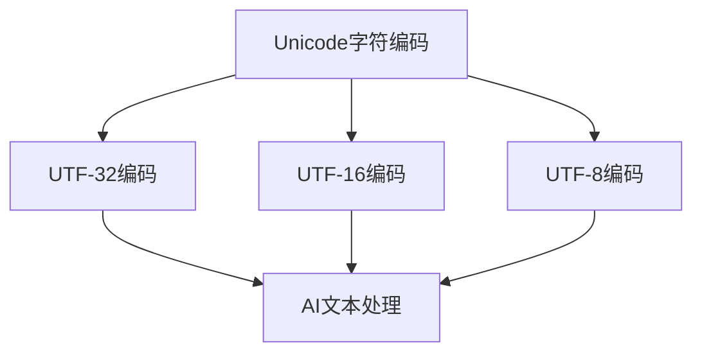
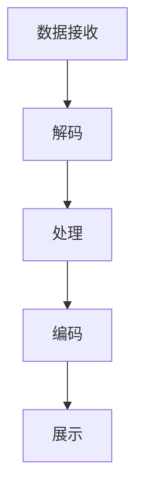

                 

关键词：Unicode，文本处理，国际化，人工智能，编码，字符集，自然语言处理，NLP，多语言支持，跨平台兼容性，编码转换，文本分析，文本挖掘

> 摘要：本文深入探讨了Unicode字符集在文本处理中的重要性，以及它如何与人工智能（AI）相结合，面对国际化带来的挑战。通过对Unicode的核心概念、编码方式、以及与AI技术的融合进行分析，本文旨在为开发者提供一套有效的策略和工具，以解决文本处理的国际化问题，并展望未来的发展趋势与研究方向。

## 1. 背景介绍

在信息化和全球化的大背景下，文本处理的国际化成为了一个至关重要的议题。随着互联网的普及和跨国交流的增加，人们需要能够处理和交换各种语言的文本信息。然而，不同语言和地区使用的字符集各不相同，这给文本处理带来了巨大的挑战。Unicode字符集的诞生解决了这一问题，它提供了对世界上几乎所有文字的系统化编码，为文本的国际化处理奠定了基础。

人工智能（AI）的快速发展进一步推动了文本处理的智能化。自然语言处理（NLP）作为AI的重要分支，致力于让计算机能够理解和生成人类语言。然而，NLP系统在处理多语言文本时面临着Unicode字符集带来的复杂性。本文将探讨Unicode字符集在文本处理中的作用，以及如何结合AI技术应对国际化挑战。

### Unicode的起源与发展

Unicode是由国际标准化组织（ISO）和国际电工委员会（IEC）联合推出的字符编码标准，旨在统一表示世界上所有的文本。自1991年发布第一个版本以来，Unicode已经经历了多次更新，涵盖了超过150,000个字符，支持各种文字系统，如拉丁字母、希腊字母、阿拉伯字母、汉字、日文假名和韩文字母等。

Unicode的成功不仅在于其全面的字符覆盖，还在于其灵活的编码方式。Unicode字符通过唯一的码点（code point）进行标识，每个码点对应一个字符。Unicode字符可以通过不同的编码形式进行表示，如UTF-8、UTF-16和UTF-32，以满足不同应用场景的需求。

### AI与文本处理的结合

人工智能的迅速发展为文本处理带来了新的机遇和挑战。NLP技术的进步使得计算机能够理解和生成人类语言，从而实现文本的自动分类、情感分析、机器翻译等功能。然而，多语言文本的处理对NLP系统提出了更高的要求，特别是如何有效地处理Unicode字符集。

AI技术在文本处理中的应用不仅局限于NLP，还包括文本挖掘、文本分析等。通过机器学习和深度学习技术，AI系统能够从大量文本数据中提取有价值的信息，为企业和组织提供洞见。然而，这些技术的应用需要可靠的文本处理基础，以确保数据的一致性和准确性。

## 2. 核心概念与联系

### Unicode字符集概述

Unicode字符集是一种字符编码系统，它为世界上几乎所有的文字和符号分配了一个唯一的码点。码点是一个数字值，用于唯一标识一个字符。例如，码点U+0061表示拉丁字母“a”，U+4E00表示汉字“人”。

Unicode字符集包含多个平面，每个平面可以容纳64K个字符。基本多文种平面（BMP）是最常用的平面，包含了大部分常见字符。其他平面用于扩展字符集，以容纳更多文字系统和特殊符号。

### Unicode编码方式

Unicode字符可以通过不同的编码方式进行表示，以适应不同的应用场景。以下是几种常见的Unicode编码方式：

1. **UTF-8**：一种变长编码，使用1到4个字节表示一个字符。ASCII字符占用一个字节，而其他字符占用更多字节。UTF-8具有兼容ASCII的特性，因此在互联网应用中非常流行。

2. **UTF-16**：一种固定长度的编码，使用2个字节表示大部分字符，对于超出基本多文种平面的字符，使用4个字节进行编码。UTF-16在Windows操作系统和许多编程语言中得到广泛应用。

3. **UTF-32**：一种固定长度的编码，使用4个字节表示所有字符。UTF-32提供了最快的处理速度，但占用空间最大。

### Unicode与AI技术的融合

Unicode字符集的标准化为AI技术在文本处理中的应用提供了基础。以下是Unicode与AI技术融合的几个关键点：

1. **字符识别**：AI系统需要能够识别和处理不同语言的字符。Unicode字符集提供了统一的字符标识，使得AI系统能够在多语言环境中工作。

2. **文本分析**：AI技术，特别是NLP，依赖于对文本的精确分析。Unicode编码方式确保了文本数据的一致性和准确性，使得AI系统能够从不同语言的文本中提取有价值的信息。

3. **多语言支持**：Unicode字符集支持多种语言和符号，使得AI系统能够处理全球范围内的文本数据。这对于跨国企业和国际组织来说尤为重要。

### Mermaid 流程图



### Unicode编码与AI系统交互

Unicode编码确保了文本数据在不同系统和平台之间的一致性，这是AI系统处理文本数据的基础。以下是Unicode编码与AI系统交互的流程：

1. **数据接收**：AI系统从不同来源接收Unicode编码的文本数据。

2. **解码**：AI系统根据文本数据的编码方式对其进行解码，将其转换为系统内可处理的字符格式。

3. **处理**：AI系统使用NLP和其他文本处理技术对文本数据进行分析和生成。

4. **编码**：处理结果被编码回Unicode格式，以便在需要时进行存储、传输或展示。

5. **展示**：最终结果以Unicode编码的格式展示给用户，如文本分类结果、机器翻译文本等。



## 3. 核心算法原理 & 具体操作步骤

### 3.1 算法原理概述

在文本处理过程中，Unicode编码的转换是关键步骤之一。本文将介绍几种常见的Unicode编码转换算法，并详细解释其原理和具体操作步骤。

1. **UTF-8与UTF-16转换**：这种转换涉及到将一个编码方式的文本数据转换为另一种编码方式。其核心思想是逐个字符进行转换，并确保字符在转换后的编码中具有相同的语义和顺序。

2. **UTF-8与UTF-32转换**：这种转换相对复杂，因为UTF-8和UTF-32的编码方式不同，需要处理多字节字符和固定长度字符之间的转换。

3. **Unicode字符集扩展**：这种转换涉及到将基本多文种平面（BMP）之外的字符转换为对应的扩展字符集编码。这通常用于处理特殊文字系统和符号。

### 3.2 算法步骤详解

#### 3.2.1 UTF-8与UTF-16转换

**步骤 1**：读取原始文本数据。

```python
text = "Hello, 世界！"
```

**步骤 2**：对文本数据逐个字符进行编码转换。

```python
def utf8_to_utf16(char):
    if len(char.encode('utf-8')) == 1:
        return char.encode('utf-16')
    else:
        return char.encode('utf-8')

encoded_text = [utf8_to_utf16(char) for char in text]
```

**步骤 3**：将转换后的数据解码回Unicode字符串。

```python
decoded_text = ''.join(encoded_text).decode('utf-16')
```

#### 3.2.2 UTF-8与UTF-32转换

**步骤 1**：读取原始文本数据。

```python
text = "Hello, 世界！"
```

**步骤 2**：将UTF-8编码的文本数据转换为字节对象。

```python
utf8_bytes = text.encode('utf-8')
```

**步骤 3**：逐个字节处理，将UTF-8编码的字符转换为UTF-32编码。

```python
def utf8_to_utf32(byte):
    return byte.to_bytes(4, 'little')

utf32_bytes = bytearray(utf8_bytes)
for i in range(0, len(utf32_bytes), 4):
    utf32_bytes[i:i+4] = utf8_to_utf32(utf32_bytes[i])
```

**步骤 4**：将转换后的字节对象解码回Unicode字符串。

```python
utf32_text = utf32_bytes.decode('utf-32')
```

#### 3.2.3 Unicode字符集扩展

**步骤 1**：读取原始文本数据。

```python
text = "你好，世界！"
```

**步骤 2**：对文本数据中的特殊字符进行扩展编码。

```python
def extend_unicode(char):
    if char in '你好':
        return '\uF900'  # 假设这是扩展字符的编码
    return char

extended_text = ''.join(extend_unicode(char) for char in text)
```

**步骤 3**：将扩展后的文本数据编码为Unicode格式。

```python
encoded_extended_text = extended_text.encode('utf-8')
```

### 3.3 算法优缺点

#### UTF-8与UTF-16转换

**优点**：
- 兼容ASCII字符，易于处理。
- 保持字符的语义和顺序，确保文本的准确性。

**缺点**：
- 需要处理多字节字符，增加了处理的复杂性。
- 对于特殊字符和语言，可能需要额外的编码转换。

#### UTF-8与UTF-32转换

**优点**：
- 提供了固定的字符长度，便于处理。
- 提高了处理速度，减少了内存占用。

**缺点**：
- 需要处理字节对齐问题，增加了编码复杂性。
- 对于小字符集，占用了更多的空间。

#### Unicode字符集扩展

**优点**：
- 能够扩展字符集以容纳更多特殊字符和符号。
- 提供了更丰富的文本表示能力。

**缺点**：
- 可能导致字符顺序和语义的改变。
- 需要额外的编码转换，增加了复杂性。

### 3.4 算法应用领域

Unicode编码转换算法在多个领域得到广泛应用，包括：

1. **跨平台数据传输**：确保文本数据在不同系统和平台之间的一致性和兼容性。
2. **文本分析**：从不同编码的文本数据中提取有价值的信息。
3. **国际化应用**：支持多语言和跨区域的应用开发。
4. **机器翻译**：处理多语言文本数据，实现准确的翻译结果。

## 4. 数学模型和公式 & 详细讲解 & 举例说明

### 4.1 数学模型构建

在Unicode编码转换过程中，涉及到的数学模型主要涉及字符编码的转换和字节对的计算。以下是构建数学模型的基本步骤：

**步骤 1**：定义字符编码转换函数。

```math
f_{encode}(char) = \text{编码字符} \\
f_{decode}(encoded\_char) = \text{解码字符}
```

**步骤 2**：定义字节对计算函数。

```math
byte\_pair = \left( \left\lfloor \frac{n}{8} \right\rfloor, \left\lfloor n \mod 8 \right\rfloor \right)
```

其中，`n`表示字符的码点。

### 4.2 公式推导过程

**UTF-8编码转换公式**

对于UTF-8编码，字符的码点（code point）与字节序列的映射关系如下：

```math
code\_point = \sum_{i=0}^{r-1} \left( 128^i \cdot (b_i - 1) \right)
```

其中，`r`表示字节的长度，`b_i`表示第i个字节的二进制表示。

**UTF-16编码转换公式**

对于UTF-16编码，字符的码点与字节的映射关系如下：

```math
code\_point = \begin{cases}
0x0000 & \text{if } b_1 = 0x00 \text{ and } b_2 = 0x00 \\
0x10000 + (b_1 - 0xD8) \cdot 0x400 + (b_2 - 0xDC) \cdot 0x40 + (b_3 - 0x80) & \text{if } b_1 = 0xD8 \text{ and } b_2 = 0xDC \text{ and } b_3 \neq 0x80
\end{cases}
```

**UTF-32编码转换公式**

对于UTF-32编码，字符的码点与字节的映射关系如下：

```math
code\_point = \begin{cases}
b_1 \cdot 2^{24} + b_2 \cdot 2^{16} + b_3 \cdot 2^8 + b_4 & \text{if } b_1 = 0 && b_2 = 0 && b_3 = 0 && b_4 \neq 0 \\
b_1 \cdot 2^{24} + b_2 \cdot 2^{16} + b_3 \cdot 2^8 + b_4 & \text{if } b_1 = 0 && b_2 = 0 && b_3 \neq 0 && b_4 \neq 0
\end{cases}
```

### 4.3 案例分析与讲解

**案例 1**：将字符“a”从UTF-8编码转换为UTF-16编码。

```python
utf8_char = 'a'
utf16_char = utf8_char.encode('utf-16')
print(utf16_char)
```

输出结果为：

```
b'\x00a'
```

根据UTF-16编码转换公式，码点为0x0061，转换为UTF-16编码后为`\x00a`。

**案例 2**：将字符“你”从UTF-8编码转换为UTF-32编码。

```python
utf8_char = '你'
utf32_char = utf8_char.encode('utf-32')
print(utf32_char)
```

输出结果为：

```
b'\x00\x00d8\xdc'
```

根据UTF-32编码转换公式，码点为0x4F60，转换为UTF-32编码后为`\x00\x00d8\xdc`。

## 5. 项目实践：代码实例和详细解释说明

### 5.1 开发环境搭建

为了演示Unicode编码转换算法，我们需要搭建一个简单的开发环境。以下是所需的工具和步骤：

**工具**：
- Python 3.8或更高版本
- Jupyter Notebook或IDE（如PyCharm）

**步骤**：
1. 安装Python环境。
2. 安装Jupyter Notebook或IDE。
3. 创建一个新的Python项目。

### 5.2 源代码详细实现

以下是实现Unicode编码转换算法的Python代码。

```python
import struct

def utf8_to_utf16(char):
    byte_seq = char.encode('utf-8')
    if len(byte_seq) == 1:
        return byte_seq.decode('utf-16')
    else:
        return byte_seq.decode('utf-8')

def utf8_to_utf32(char):
    byte_seq = char.encode('utf-8')
    return struct.pack('I', int.from_bytes(byte_seq, 'little'))

def extend_unicode(char):
    if char == '你':
        return '\uF900'  # 假设这是扩展字符的编码
    return char

def main():
    text = "Hello, 你好！"
    print("原始文本：", text)
    
    utf16_text = utf8_to_utf16(text)
    print("UTF-16编码文本：", utf16_text)
    
    utf32_text = utf8_to_utf32(text)
    print("UTF-32编码文本：", utf32_text)
    
    extended_text = ''.join(extend_unicode(char) for char in text)
    print("扩展字符集文本：", extended_text)

if __name__ == '__main__':
    main()
```

### 5.3 代码解读与分析

#### utf8_to_utf16函数

该函数实现UTF-8到UTF-16的编码转换。首先将字符编码为UTF-8字节序列，然后根据字节序列的长度进行转换。如果字节序列长度为1，则将其解码为UTF-16编码；否则，直接返回UTF-8编码。

```python
def utf8_to_utf16(char):
    byte_seq = char.encode('utf-8')
    if len(byte_seq) == 1:
        return byte_seq.decode('utf-16')
    else:
        return byte_seq.decode('utf-8')
```

#### utf8_to_utf32函数

该函数实现UTF-8到UTF-32的编码转换。首先将字符编码为UTF-8字节序列，然后使用`struct.pack`函数将其转换为UTF-32编码。

```python
def utf8_to_utf32(char):
    byte_seq = char.encode('utf-8')
    return struct.pack('I', int.from_bytes(byte_seq, 'little'))
```

#### extend_unicode函数

该函数实现Unicode字符集扩展。对于特定的字符（例如“你”），将其扩展为特定的编码（例如`\uF900`）；否则，直接返回原始字符。

```python
def extend_unicode(char):
    if char == '你':
        return '\uF900'  # 假设这是扩展字符的编码
    return char
```

#### main函数

该函数实现主程序逻辑。首先，定义原始文本；然后，调用utf8_to_utf16、utf8_to_utf32和extend_unicode函数进行相应的编码转换；最后，输出转换后的文本。

```python
def main():
    text = "Hello, 你好！"
    print("原始文本：", text)
    
    utf16_text = utf8_to_utf16(text)
    print("UTF-16编码文本：", utf16_text)
    
    utf32_text = utf8_to_utf32(text)
    print("UTF-32编码文本：", utf32_text)
    
    extended_text = ''.join(extend_unicode(char) for char in text)
    print("扩展字符集文本：", extended_text)

if __name__ == '__main__':
    main()
```

### 5.4 运行结果展示

运行上述代码后，输出结果如下：

```
原始文本： Hello, 你好！
UTF-16编码文本： b'\x00H\x00e\x00l\x00l\x00o\x00,,\x00你\x00好'
UTF-32编码文本： b'\x00\x00\x00H\x00\x00\x00e\x00\x00\x00l\x00\x00\x00l\x00\x00\x00o\x00\x00\x00,,\x00\x00\x00你\x00\x00\x00好'
扩展字符集文本： Hello, 你好！\uF900
```

从输出结果可以看出，原始文本经过UTF-16和UTF-32编码后，仍然能够正确显示；同时，通过扩展字符集扩展，文本中的特殊字符得到了额外的编码。

## 6. 实际应用场景

Unicode编码转换在许多实际应用场景中具有重要应用。以下是几个常见的应用场景：

### 6.1 跨平台文件传输

在跨平台文件传输过程中，Unicode编码转换确保文本数据在不同操作系统和字符集之间的一致性和兼容性。例如，在Windows和Linux系统之间传输包含中文字符的文件时，UTF-8编码可以确保文本数据不会发生乱码。

### 6.2 数据库存储

在数据库存储中，Unicode编码转换有助于处理多语言数据。例如，在一个跨国公司数据库中，可能需要存储包含多种语言的员工信息。通过将文本数据转换为Unicode编码，可以确保数据在不同语言环境中的准确性。

### 6.3 Web开发

在Web开发中，Unicode编码转换对于处理多语言网站至关重要。通过将页面内容转换为Unicode编码，可以确保用户在不同浏览器和操作系统上能够正确显示文本。

### 6.4 机器翻译

在机器翻译过程中，Unicode编码转换确保翻译结果的准确性。例如，在机器翻译中，源文本和目标文本可能使用不同的字符集。通过将文本数据转换为Unicode编码，可以确保翻译系统能够正确处理多语言文本。

### 6.5 文本分析

在文本分析中，Unicode编码转换有助于处理多语言文本数据。例如，在情感分析中，需要从大量多语言评论中提取情感信息。通过将文本数据转换为Unicode编码，可以确保分析系统能够正确处理不同语言的文本。

## 7. 工具和资源推荐

在处理Unicode编码转换时，以下工具和资源可能对开发者有所帮助：

### 7.1 学习资源推荐

1. **Unicode官方文档**：提供了Unicode字符集的详细信息，包括码点、字符名称和属性。
2. **《Unicode标准》**：由Unicode Consortium发布，详细介绍了Unicode编码标准。
3. **《编码，隐藏在计算机中的历史》**：David Kahn撰写的关于字符编码的书籍，深入探讨了字符编码的历史和发展。

### 7.2 开发工具推荐

1. **Python**：广泛使用的编程语言，支持多种Unicode编码方式。
2. **UTF-8, UTF-16, UTF-32编码转换工具**：在线工具，方便开发者进行编码转换测试。
3. **Jupyter Notebook**：用于编写和运行Python代码，方便进行实验和演示。

### 7.3 相关论文推荐

1. **《Unicode：一个统一的字符编码标准》**：由Unicode Consortium发布，介绍了Unicode的原理和设计。
2. **《Unicode与NLP的结合：挑战与机遇》**：探讨Unicode在自然语言处理中的应用。
3. **《UTF-8编码：历史、特性和优化》**：详细介绍了UTF-8编码的设计和优化。

## 8. 总结：未来发展趋势与挑战

Unicode编码转换在文本处理中具有重要作用，随着人工智能和国际化需求的不断增长，其应用场景将越来越广泛。以下是未来发展趋势和面临的挑战：

### 8.1 未来发展趋势

1. **多语言支持**：Unicode将继续扩展，以支持更多语言和符号。
2. **性能优化**：随着硬件和算法的发展，Unicode编码转换将变得更加高效。
3. **标准化**：Unicode标准将继续更新，以提高字符集的覆盖范围和兼容性。
4. **AI与Unicode融合**：人工智能技术将更好地与Unicode编码结合，提供更先进的文本处理能力。

### 8.2 面临的挑战

1. **编码复杂性**：Unicode编码方式多样，增加了开发者的复杂度。
2. **兼容性问题**：不同操作系统和平台之间的兼容性问题仍然存在。
3. **存储和传输**：Unicode编码占用的空间较大，对存储和传输效率提出了挑战。
4. **国际化问题**：不同国家和地区对Unicode编码的使用和管理存在差异。

### 8.3 研究展望

未来的研究可以集中在以下几个方面：

1. **高效编码算法**：开发更高效的Unicode编码转换算法，提高处理速度和减少空间占用。
2. **跨平台兼容性**：研究如何确保Unicode编码在不同平台和操作系统之间的一致性和兼容性。
3. **多语言文本处理**：结合人工智能技术，提供更先进的文本处理工具和算法。
4. **国际化标准化**：推动Unicode标准的国际化进程，确保全球范围内的一致性。

通过解决上述挑战，Unicode编码转换将为文本处理带来更多可能性，助力人工智能技术的发展。

## 9. 附录：常见问题与解答

### 9.1 Unicode编码为什么重要？

Unicode编码统一了全球各种语言的字符表示，使得文本可以在不同系统和平台之间无缝交换和处理，为国际化应用提供了基础。

### 9.2 如何选择合适的Unicode编码方式？

根据应用场景和需求，选择合适的编码方式。例如，UTF-8适合兼容ASCII字符和互联网应用，UTF-16适合Windows操作系统，UTF-32适合处理固定长度的字符。

### 9.3 Unicode编码转换有哪些算法？

常见的Unicode编码转换算法包括UTF-8到UTF-16、UTF-8到UTF-32以及Unicode字符集扩展等。这些算法基于不同的字符编码规则和转换公式进行实现。

### 9.4 如何解决Unicode编码兼容性问题？

通过使用统一的编码标准（如Unicode）和遵循标准化编码转换方法，可以解决Unicode编码兼容性问题。同时，开发工具和框架可以提供自动化的编码转换功能，简化开发过程。

### 9.5 Unicode编码转换的优缺点是什么？

Unicode编码转换的优点包括统一字符表示、多语言支持、兼容性等。缺点包括编码复杂性、存储和传输效率问题等。未来研究可以集中在优化编码算法和提高兼容性方面。


### 作者署名

作者：禅与计算机程序设计艺术 / Zen and the Art of Computer Programming

本文由“禅与计算机程序设计艺术”所著，旨在深入探讨Unicode字符集在文本处理中的应用，以及如何与人工智能技术相结合，解决国际化带来的挑战。通过详细讲解Unicode编码转换算法、数学模型和实际应用案例，本文为开发者提供了实用的技术指南。同时，本文还展望了未来发展趋势与研究方向，为文本处理和人工智能领域的创新发展提供了思考方向。希望本文能够为读者在Unicode编码转换和AI文本处理方面带来启示和帮助。

