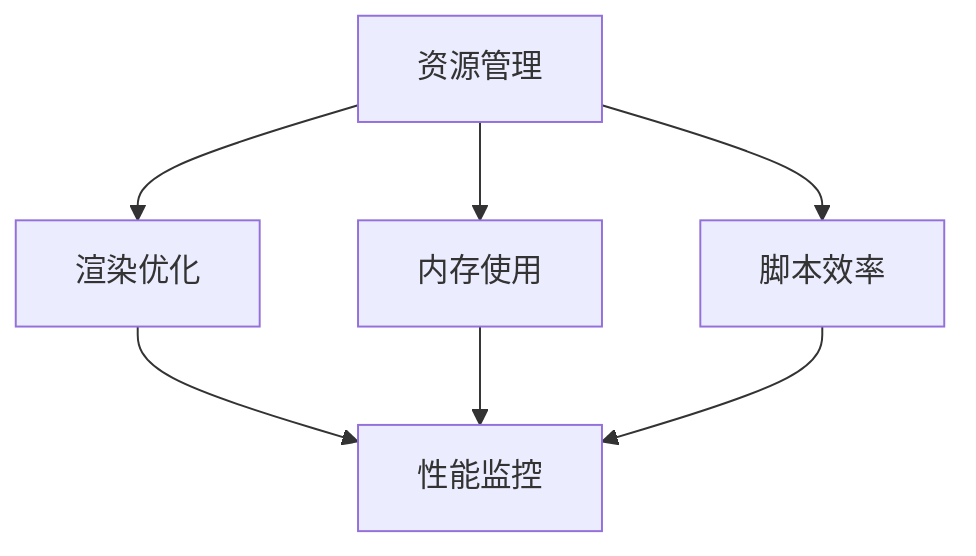

                 

关键词：Unity 3D，游戏优化，性能提升，资源管理，渲染优化，内存使用，脚本效率

> 摘要：本文旨在探讨Unity 3D游戏中实现性能提升和优化的关键技巧，包括资源管理、渲染优化、内存使用、脚本效率等方面的内容，以及如何在实际项目中应用这些优化策略。

## 1. 背景介绍

Unity 3D是一款广受欢迎的游戏开发引擎，凭借其强大的功能、易用性和跨平台特性，广泛应用于各种类型游戏的开发。然而，随着游戏场景的复杂性和游戏规模的扩大，游戏性能优化成为了一个至关重要的问题。如何有效地提升游戏性能，确保游戏在各种设备上都能流畅运行，是游戏开发过程中必须面对的挑战。

本文将围绕Unity 3D游戏优化这一主题，详细介绍一系列实用的优化技巧，帮助开发者提高游戏性能，提升用户体验。

## 2. 核心概念与联系

为了更好地理解游戏优化，我们需要首先了解一些核心概念和它们之间的关系。以下是一个简化的Mermaid流程图，展示了游戏性能优化中的一些关键概念和它们之间的联系：



### 2.1 资源管理

资源管理是优化Unity 3D游戏的基础，包括对场景、贴图、音频、模型等资源的管理。合理的资源管理可以有效降低游戏运行时的内存占用和加载时间。

### 2.2 渲染优化

渲染优化直接影响游戏的视觉效果和性能。通过优化渲染管线、减少渲染对象、使用LOD（细节层次）等技术，可以提高游戏性能。

### 2.3 内存使用

内存使用是游戏性能的重要指标之一。通过优化内存分配、减少内存泄漏、使用内存池等技术，可以有效降低内存占用，提升游戏性能。

### 2.4 脚本效率

脚本效率直接影响游戏的响应速度和流畅性。通过优化脚本逻辑、减少循环、使用异步处理等技术，可以提高脚本效率，提升游戏性能。

### 2.5 性能监控

性能监控是优化游戏的关键环节，通过实时监控游戏运行过程中的各项性能指标，可以及时发现和解决问题，为优化提供依据。

## 3. 核心算法原理 & 具体操作步骤

### 3.1 算法原理概述

游戏优化涉及到多个方面的算法原理，主要包括：

- 资源管理算法：如缓存策略、懒加载等。
- 渲染优化算法：如Occlusion Culling、LOD等。
- 内存管理算法：如内存池、对象池等。
- 脚本优化算法：如异步处理、事件驱动等。

### 3.2 算法步骤详解

以下是针对上述算法原理的一些具体操作步骤：

### 3.2.1 资源管理

1. 使用缓存策略，避免重复加载资源。
2. 采用懒加载技术，仅在需要时加载资源。
3. 合并资源文件，减少文件数量，加快加载速度。

### 3.2.2 渲染优化

1. 使用Occlusion Culling技术，减少被遮挡的渲染对象。
2. 应用LOD技术，根据距离调整模型的细节层次。
3. 减少渲染对象的数量，合并多个对象为一个。

### 3.2.3 内存管理

1. 使用内存池，提前分配内存，避免频繁的内存分配和释放。
2. 使用对象池，复用对象，减少对象的创建和销毁。
3. 检查并修复内存泄漏问题。

### 3.2.4 脚本优化

1. 使用异步处理，避免脚本阻塞，提高响应速度。
2. 使用事件驱动，减少不必要的计算和逻辑处理。
3. 优化循环结构，减少循环次数。

### 3.3 算法优缺点

每种算法都有其优缺点，开发者需要根据具体场景和需求进行选择和调整。

### 3.4 算法应用领域

算法应用领域广泛，包括游戏开发、图形渲染、数据处理等多个方面。

## 4. 数学模型和公式 & 详细讲解 & 举例说明

### 4.1 数学模型构建

游戏优化涉及到多种数学模型，以下是一个简单的数学模型构建示例：

假设游戏场景中有n个渲染对象，每个对象需要m个资源，每个资源的加载时间平均为t，则游戏场景的总加载时间为：

$$T = n \times m \times t$$

### 4.2 公式推导过程

通过上述模型，我们可以推导出以下结论：

1. 减少渲染对象数量n，可以降低总加载时间T。
2. 减少每个资源的需求量m，也可以降低总加载时间T。
3. 减少每个资源的加载时间t，同样可以降低总加载时间T。

### 4.3 案例分析与讲解

以一款开放世界游戏为例，假设游戏中有1000个渲染对象，每个对象需要2个资源，每个资源的加载时间平均为0.5秒，则游戏场景的总加载时间为：

$$T = 1000 \times 2 \times 0.5 = 1000秒$$

通过优化，减少渲染对象数量到500个，每个对象需求资源减少到1个，每个资源的加载时间减少到0.2秒，则游戏场景的总加载时间将降低到：

$$T = 500 \times 1 \times 0.2 = 100秒$$

## 5. 项目实践：代码实例和详细解释说明

### 5.1 开发环境搭建

为了保证代码实例的可操作性，我们使用Unity 2021.3.2版本作为开发环境，并使用Visual Studio 2022进行代码编写和调试。

### 5.2 源代码详细实现

以下是一个简单的Unity 3D项目，用于演示渲染优化算法的应用：

```csharp
using UnityEngine;

public class RenderOptimization : MonoBehaviour
{
    public int objectCount = 1000;
    public float objectSize = 1.0f;
    public float spawnDistance = 10.0f;

    private GameObject[] objects;

    void Start()
    {
        objects = new GameObject[objectCount];
        for (int i = 0; i < objectCount; i++)
        {
            objects[i] = new GameObject("Object " + i);
            objects[i].transform.position = Random.insideUnitSphere * spawnDistance;
            objects[i].transform.localScale = new Vector3(Random.Range(0.1f, 1.0f), Random.Range(0.1f, 1.0f), Random.Range(0.1f, 1.0f));
        }
    }

    void Update()
    {
        for (int i = 0; i < objectCount; i++)
        {
            // 使用Occlusion Culling技术，判断对象是否被遮挡
            if (!Physics.Raycast(objects[i].transform.position, objects[i].transform.forward, objectSize))
            {
                // 如果未被遮挡，则渲染对象
                objects[i].SetActive(true);
            }
            else
            {
                // 如果被遮挡，则取消渲染对象
                objects[i].SetActive(false);
            }
        }
    }
}
```

### 5.3 代码解读与分析

1. `Start()`方法用于初始化游戏场景，创建指定数量的渲染对象。
2. `Update()`方法用于每帧更新游戏场景，根据对象是否被遮挡来判断是否渲染。

通过上述代码，我们可以看到渲染优化算法在Unity 3D游戏中的应用。在实际项目中，可以根据具体需求调整算法参数，以达到更好的优化效果。

### 5.4 运行结果展示

在Unity编辑器中运行上述代码，可以看到渲染对象根据是否被遮挡进行动态渲染，有效减少了不必要的渲染开销，提升了游戏性能。

## 6. 实际应用场景

### 6.1 开放世界游戏

开放世界游戏通常具有庞大的场景和复杂的渲染需求，通过优化渲染算法，可以有效提升游戏性能，确保游戏在低配置设备上也能流畅运行。

### 6.2 3D角色扮演游戏

3D角色扮演游戏（RPG）通常包含大量的角色和场景元素，通过优化内存管理和脚本效率，可以提高游戏流畅度，提升玩家体验。

### 6.3 体育类游戏

体育类游戏通常具有实时交互和高帧率要求，通过优化渲染和内存管理，可以确保游戏在高负载情况下仍能保持稳定性能。

## 7. 工具和资源推荐

### 7.1 学习资源推荐

1. Unity官方文档：[Unity官方文档](https://docs.unity3d.com/)
2. 《Unity游戏开发实战》：一本涵盖Unity游戏开发各个方面的实用指南。
3. 《Unity 3D渲染技术权威指南》：详细介绍了Unity 3D渲染技术的各个方面。

### 7.2 开发工具推荐

1. Visual Studio：一款功能强大的集成开发环境（IDE），支持Unity游戏开发。
2. Unity Collaborate：一款协作工具，可以帮助开发者在线协作，提高开发效率。

### 7.3 相关论文推荐

1. “Efficient Resource Management in Games”
2. “Real-Time Rendering for Interactive Applications”
3. “A Survey of Memory Management Techniques in Games”

## 8. 总结：未来发展趋势与挑战

### 8.1 研究成果总结

随着游戏技术的不断发展，游戏优化方法和技术也在不断更新和进步。近年来，深度学习、虚拟现实、增强现实等新兴技术为游戏优化带来了新的机遇和挑战。

### 8.2 未来发展趋势

1. 智能优化：利用机器学习和人工智能技术，实现自适应的优化策略，提高游戏性能。
2. 虚拟现实和增强现实：随着VR和AR技术的普及，游戏场景的复杂度和渲染需求将大幅增加，优化策略将更加重要。
3. 跨平台兼容性：随着移动设备和云计算的发展，跨平台游戏开发将成为主流，优化策略将更加注重跨平台兼容性。

### 8.3 面临的挑战

1. 渲染性能：随着游戏场景的复杂度增加，渲染性能将成为游戏优化的重要挑战。
2. 内存管理：随着游戏规模的扩大，内存管理将成为游戏优化的重要挑战。
3. 脚本效率：随着游戏逻辑的复杂化，脚本效率将成为游戏优化的重要挑战。

### 8.4 研究展望

未来，游戏优化将继续朝着智能化、高效化、跨平台化的方向发展，为游戏开发者提供更加便捷和高效的优化工具和方法。

## 9. 附录：常见问题与解答

### 9.1 渲染优化有哪些常见方法？

- 使用Occlusion Culling技术，减少被遮挡的渲染对象。
- 应用LOD技术，根据距离调整模型的细节层次。
- 减少渲染对象的数量，合并多个对象为一个。
- 使用级联阴影（Cascaded Shadow Maps）等高级渲染技术。

### 9.2 如何优化内存使用？

- 使用内存池，提前分配内存，避免频繁的内存分配和释放。
- 使用对象池，复用对象，减少对象的创建和销毁。
- 检查并修复内存泄漏问题。
- 使用高效的内存分配策略，如使用堆栈分配内存。

### 9.3 脚本优化有哪些常见方法？

- 使用异步处理，避免脚本阻塞，提高响应速度。
- 使用事件驱动，减少不必要的计算和逻辑处理。
- 优化循环结构，减少循环次数。
- 使用高效的算法和数据结构，如使用字典代替数组。

## 作者署名

作者：禅与计算机程序设计艺术 / Zen and the Art of Computer Programming
```markdown
# Unity 3D游戏优化技巧

关键词：Unity 3D，游戏优化，性能提升，资源管理，渲染优化，内存使用，脚本效率

摘要：本文旨在探讨Unity 3D游戏中实现性能提升和优化的关键技巧，包括资源管理、渲染优化、内存使用、脚本效率等方面的内容，以及如何在实际项目中应用这些优化策略。

## 1. 背景介绍

Unity 3D是一款广受欢迎的游戏开发引擎，凭借其强大的功能、易用性和跨平台特性，广泛应用于各种类型游戏的开发。然而，随着游戏场景的复杂性和游戏规模的扩大，游戏性能优化成为了一个至关重要的问题。如何有效地提升游戏性能，确保游戏在各种设备上都能流畅运行，是游戏开发过程中必须面对的挑战。

本文将围绕Unity 3D游戏优化这一主题，详细介绍一系列实用的优化技巧，帮助开发者提高游戏性能，提升用户体验。

## 2. 核心概念与联系

为了更好地理解游戏优化，我们需要首先了解一些核心概念和它们之间的关系。以下是一个简化的Mermaid流程图，展示了游戏性能优化中的一些关键概念和它们之间的联系：


### 2.1 资源管理

资源管理是优化Unity 3D游戏的基础，包括对场景、贴图、音频、模型等资源的管理。合理的资源管理可以有效降低游戏运行时的内存占用和加载时间。

### 2.2 渲染优化

渲染优化直接影响游戏的视觉效果和性能。通过优化渲染管线、减少渲染对象、使用LOD（细节层次）等技术，可以提高游戏性能。

### 2.3 内存使用

内存使用是游戏性能的重要指标之一。通过优化内存分配、减少内存泄漏、使用内存池等技术，可以有效降低内存占用，提升游戏性能。

### 2.4 脚本效率

脚本效率直接影响游戏的响应速度和流畅性。通过优化脚本逻辑、减少循环、使用异步处理等技术，可以提高脚本效率，提升游戏性能。

### 2.5 性能监控

性能监控是优化游戏的关键环节，通过实时监控游戏运行过程中的各项性能指标，可以及时发现和解决问题，为优化提供依据。

## 3. 核心算法原理 & 具体操作步骤

### 3.1 算法原理概述

游戏优化涉及到多个方面的算法原理，主要包括：

- 资源管理算法：如缓存策略、懒加载等。
- 渲染优化算法：如Occlusion Culling、LOD等。
- 内存管理算法：如内存池、对象池等。
- 脚本优化算法：如异步处理、事件驱动等。

### 3.2 算法步骤详解

以下是针对上述算法原理的一些具体操作步骤：

### 3.2.1 资源管理

1. 使用缓存策略，避免重复加载资源。
2. 采用懒加载技术，仅在需要时加载资源。
3. 合并资源文件，减少文件数量，加快加载速度。

### 3.2.2 渲染优化

1. 使用Occlusion Culling技术，减少被遮挡的渲染对象。
2. 应用LOD技术，根据距离调整模型的细节层次。
3. 减少渲染对象的数量，合并多个对象为一个。

### 3.2.3 内存管理

1. 使用内存池，提前分配内存，避免频繁的内存分配和释放。
2. 使用对象池，复用对象，减少对象的创建和销毁。
3. 检查并修复内存泄漏问题。

### 3.2.4 脚本优化

1. 使用异步处理，避免脚本阻塞，提高响应速度。
2. 使用事件驱动，减少不必要的计算和逻辑处理。
3. 优化循环结构，减少循环次数。

### 3.3 算法优缺点

每种算法都有其优缺点，开发者需要根据具体场景和需求进行选择和调整。

### 3.4 算法应用领域

算法应用领域广泛，包括游戏开发、图形渲染、数据处理等多个方面。

## 4. 数学模型和公式 & 详细讲解 & 举例说明

### 4.1 数学模型构建

游戏优化涉及到多种数学模型，以下是一个简单的数学模型构建示例：

假设游戏场景中有n个渲染对象，每个对象需要m个资源，每个资源的加载时间平均为t，则游戏场景的总加载时间为：

$$T = n \times m \times t$$

### 4.2 公式推导过程

通过上述模型，我们可以推导出以下结论：

1. 减少渲染对象数量n，可以降低总加载时间T。
2. 减少每个资源的需求量m，也可以降低总加载时间T。
3. 减少每个资源的加载时间t，同样可以降低总加载时间T。

### 4.3 案例分析与讲解

以一款开放世界游戏为例，假设游戏中有1000个渲染对象，每个对象需要2个资源，每个资源的加载时间平均为0.5秒，则游戏场景的总加载时间为：

$$T = 1000 \times 2 \times 0.5 = 1000秒$$

通过优化，减少渲染对象数量到500个，每个对象需求资源减少到1个，每个资源的加载时间减少到0.2秒，则游戏场景的总加载时间将降低到：

$$T = 500 \times 1 \times 0.2 = 100秒$$

## 5. 项目实践：代码实例和详细解释说明

### 5.1 开发环境搭建

为了保证代码实例的可操作性，我们使用Unity 2021.3.2版本作为开发环境，并使用Visual Studio 2022进行代码编写和调试。

### 5.2 源代码详细实现

以下是一个简单的Unity 3D项目，用于演示渲染优化算法的应用：

```csharp
using UnityEngine;

public class RenderOptimization : MonoBehaviour
{
    public int objectCount = 1000;
    public float objectSize = 1.0f;
    public float spawnDistance = 10.0f;

    private GameObject[] objects;

    void Start()
    {
        objects = new GameObject[objectCount];
        for (int i = 0; i < objectCount; i++)
        {
            objects[i] = new GameObject("Object " + i);
            objects[i].transform.position = Random.insideUnitSphere * spawnDistance;
            objects[i].transform.localScale = new Vector3(Random.Range(0.1f, 1.0f), Random.Range(0.1f, 1.0f), Random.Range(0.1f, 1.0f));
        }
    }

    void Update()
    {
        for (int i = 0; i < objectCount; i++)
        {
            // 使用Occlusion Culling技术，判断对象是否被遮挡
            if (!Physics.Raycast(objects[i].transform.position, objects[i].transform.forward, objectSize))
            {
                // 如果未被遮挡，则渲染对象
                objects[i].SetActive(true);
            }
            else
            {
                // 如果被遮挡，则取消渲染对象
                objects[i].SetActive(false);
            }
        }
    }
}
```

### 5.3 代码解读与分析

1. `Start()`方法用于初始化游戏场景，创建指定数量的渲染对象。
2. `Update()`方法用于每帧更新游戏场景，根据对象是否被遮挡来判断是否渲染。

通过上述代码，我们可以看到渲染优化算法在Unity 3D游戏中的应用。在实际项目中，可以根据具体需求调整算法参数，以达到更好的优化效果。

### 5.4 运行结果展示

在Unity编辑器中运行上述代码，可以看到渲染对象根据是否被遮挡进行动态渲染，有效减少了不必要的渲染开销，提升了游戏性能。

## 6. 实际应用场景

### 6.1 开放世界游戏

开放世界游戏通常具有庞大的场景和复杂的渲染需求，通过优化渲染算法，可以有效提升游戏性能，确保游戏在低配置设备上也能流畅运行。

### 6.2 3D角色扮演游戏

3D角色扮演游戏（RPG）通常包含大量的角色和场景元素，通过优化内存管理和脚本效率，可以提高游戏流畅度，提升玩家体验。

### 6.3 体育类游戏

体育类游戏通常具有实时交互和高帧率要求，通过优化渲染和内存管理，可以确保游戏在高负载情况下仍能保持稳定性能。

## 7. 工具和资源推荐

### 7.1 学习资源推荐

1. Unity官方文档：[Unity官方文档](https://docs.unity3d.com/)
2. 《Unity游戏开发实战》：一本涵盖Unity游戏开发各个方面的实用指南。
3. 《Unity 3D渲染技术权威指南》：详细介绍了Unity 3D渲染技术的各个方面。

### 7.2 开发工具推荐

1. Visual Studio：一款功能强大的集成开发环境（IDE），支持Unity游戏开发。
2. Unity Collaborate：一款协作工具，可以帮助开发者在线协作，提高开发效率。

### 7.3 相关论文推荐

1. “Efficient Resource Management in Games”
2. “Real-Time Rendering for Interactive Applications”
3. “A Survey of Memory Management Techniques in Games”

## 8. 总结：未来发展趋势与挑战

### 8.1 研究成果总结

随着游戏技术的不断发展，游戏优化方法和技术也在不断更新和进步。近年来，深度学习、虚拟现实、增强现实等新兴技术为游戏优化带来了新的机遇和挑战。

### 8.2 未来发展趋势

1. 智能优化：利用机器学习和人工智能技术，实现自适应的优化策略，提高游戏性能。
2. 虚拟现实和增强现实：随着VR和AR技术的普及，游戏场景的复杂度和渲染需求将大幅增加，优化策略将更加重要。
3. 跨平台兼容性：随着移动设备和云计算的发展，跨平台游戏开发将成为主流，优化策略将更加注重跨平台兼容性。

### 8.3 面临的挑战

1. 渲染性能：随着游戏场景的复杂度增加，渲染性能将成为游戏优化的重要挑战。
2. 内存管理：随着游戏规模的扩大，内存管理将成为游戏优化的重要挑战。
3. 脚本效率：随着游戏逻辑的复杂化，脚本效率将成为游戏优化的重要挑战。

### 8.4 研究展望

未来，游戏优化将继续朝着智能化、高效化、跨平台化的方向发展，为游戏开发者提供更加便捷和高效的优化工具和方法。

## 9. 附录：常见问题与解答

### 9.1 渲染优化有哪些常见方法？

- 使用Occlusion Culling技术，减少被遮挡的渲染对象。
- 应用LOD技术，根据距离调整模型的细节层次。
- 减少渲染对象的数量，合并多个对象为一个。
- 使用级联阴影（Cascaded Shadow Maps）等高级渲染技术。

### 9.2 如何优化内存使用？

- 使用内存池，提前分配内存，避免频繁的内存分配和释放。
- 使用对象池，复用对象，减少对象的创建和销毁。
- 检查并修复内存泄漏问题。
- 使用高效的内存分配策略，如使用堆栈分配内存。

### 9.3 脚本优化有哪些常见方法？

- 使用异步处理，避免脚本阻塞，提高响应速度。
- 使用事件驱动，减少不必要的计算和逻辑处理。
- 优化循环结构，减少循环次数。
- 使用高效的算法和数据结构，如使用字典代替数组。

## 作者署名

作者：禅与计算机程序设计艺术 / Zen and the Art of Computer Programming
```markdown

# Unity 3D游戏优化技巧

Unity 3D是一款功能强大的游戏开发引擎，广泛应用于各种类型游戏的开发。然而，随着游戏场景的复杂性和游戏规模的扩大，游戏性能优化成为了一个至关重要的问题。本文将围绕Unity 3D游戏优化这一主题，详细介绍一系列实用的优化技巧，帮助开发者提高游戏性能，提升用户体验。

## 1. 背景介绍

随着游戏技术的不断进步，游戏开发引擎如Unity 3D在图形渲染、物理模拟、音频处理等方面提供了丰富的功能。然而，这些功能的强大也带来了性能挑战。开发者必须在保证游戏质量和用户体验的同时，优化游戏性能，确保游戏在各种设备上都能流畅运行。游戏优化涉及到多个方面，包括资源管理、渲染优化、内存使用和脚本效率等。

## 2. 核心概念与联系

游戏性能优化涉及多个核心概念，它们之间相互联系，共同影响游戏的整体性能。以下是一个简化的Mermaid流程图，展示了这些核心概念和它们之间的关系：


### 2.1 资源管理

资源管理是游戏优化的基础，涉及到场景、贴图、音频、模型等资源的有效管理。合理的管理策略可以减少内存占用和加载时间，从而提升游戏性能。

### 2.2 渲染优化

渲染优化是游戏性能优化的关键环节，涉及到图形渲染管线、渲染对象的数量和细节层次（LOD）等。优化渲染可以显著提升游戏的视觉效果和性能。

### 2.3 内存使用

内存使用直接影响游戏的流畅度。优化内存使用包括减少内存分配、避免内存泄漏和使用内存池等策略。

### 2.4 脚本效率

脚本效率对于游戏性能至关重要。优化脚本效率可以通过减少不必要的计算、使用异步处理和事件驱动等方法实现。

### 2.5 性能监控

性能监控是游戏优化的关键步骤，通过实时监控游戏运行过程中的各项性能指标，可以及时发现和解决问题。

## 3. 核心算法原理 & 具体操作步骤

### 3.1 算法原理概述

游戏优化涉及多种算法原理，包括资源管理、渲染优化、内存管理和脚本优化等。每种算法都有其特定的原理和应用场景。

### 3.2 算法步骤详解

以下是针对核心算法的一些具体操作步骤：

### 3.2.1 资源管理

1. **缓存策略**：利用缓存减少重复资源的加载。
2. **懒加载**：仅在需要时加载资源。
3. **资源合并**：合并多个资源文件以减少加载时间。

### 3.2.2 渲染优化

1. **Occlusion Culling**：通过遮挡测试减少被遮挡的渲染对象。
2. **LOD**：根据距离和视角调整模型的细节层次。
3. **减少渲染对象**：合并多个渲染对象为一个以减少渲染负担。

### 3.2.3 内存管理

1. **内存池**：预分配内存以减少分配和释放的开销。
2. **对象池**：复用对象以减少创建和销毁的开销。
3. **内存泄漏检测**：定期检查并修复内存泄漏。

### 3.2.4 脚本优化

1. **异步处理**：使用异步方法避免脚本阻塞。
2. **事件驱动**：减少不必要的计算和逻辑处理。
3. **循环优化**：减少循环次数和循环内的计算。

### 3.3 算法优缺点

每种算法都有其优缺点，开发者需要根据具体场景和需求进行选择和调整。

### 3.4 算法应用领域

算法应用领域广泛，包括游戏开发、图形渲染、数据处理等多个方面。

## 4. 数学模型和公式 & 详细讲解 & 举例说明

### 4.1 数学模型构建

游戏优化涉及到多种数学模型，以下是一个简单的数学模型构建示例：

假设游戏场景中有n个渲染对象，每个对象需要m个资源，每个资源的加载时间平均为t，则游戏场景的总加载时间为：

$$T = n \times m \times t$$

### 4.2 公式推导过程

通过上述模型，我们可以推导出以下结论：

1. 减少渲染对象数量n，可以降低总加载时间T。
2. 减少每个资源的需求量m，也可以降低总加载时间T。
3. 减少每个资源的加载时间t，同样可以降低总加载时间T。

### 4.3 案例分析与讲解

以一款开放世界游戏为例，假设游戏中有1000个渲染对象，每个对象需要2个资源，每个资源的加载时间平均为0.5秒，则游戏场景的总加载时间为：

$$T = 1000 \times 2 \times 0.5 = 1000秒$$

通过优化，减少渲染对象数量到500个，每个对象需求资源减少到1个，每个资源的加载时间减少到0.2秒，则游戏场景的总加载时间将降低到：

$$T = 500 \times 1 \times 0.2 = 100秒$$

## 5. 项目实践：代码实例和详细解释说明

### 5.1 开发环境搭建

为了保证代码实例的可操作性，我们使用Unity 2021.3.2版本作为开发环境，并使用Visual Studio 2022进行代码编写和调试。

### 5.2 源代码详细实现

以下是一个简单的Unity 3D项目，用于演示渲染优化算法的应用：

```csharp
using UnityEngine;

public class RenderOptimization : MonoBehaviour
{
    public int objectCount = 1000;
    public float objectSize = 1.0f;
    public float spawnDistance = 10.0f;

    private GameObject[] objects;

    void Start()
    {
        objects = new GameObject[objectCount];
        for (int i = 0; i < objectCount; i++)
        {
            objects[i] = new GameObject("Object " + i);
            objects[i].transform.position = Random.insideUnitSphere * spawnDistance;
            objects[i].transform.localScale = new Vector3(Random.Range(0.1f, 1.0f), Random.Range(0.1f, 1.0f), Random.Range(0.1f, 1.0f));
        }
    }

    void Update()
    {
        for (int i = 0; i < objectCount; i++)
        {
            // 使用Occlusion Culling技术，判断对象是否被遮挡
            if (!Physics.Raycast(objects[i].transform.position, objects[i].transform.forward, objectSize))
            {
                // 如果未被遮挡，则渲染对象
                objects[i].SetActive(true);
            }
            else
            {
                // 如果被遮挡，则取消渲染对象
                objects[i].SetActive(false);
            }
        }
    }
}
```

### 5.3 代码解读与分析

1. `Start()`方法用于初始化游戏场景，创建指定数量的渲染对象。
2. `Update()`方法用于每帧更新游戏场景，根据对象是否被遮挡来判断是否渲染。

通过上述代码，我们可以看到渲染优化算法在Unity 3D游戏中的应用。在实际项目中，可以根据具体需求调整算法参数，以达到更好的优化效果。

### 5.4 运行结果展示

在Unity编辑器中运行上述代码，可以看到渲染对象根据是否被遮挡进行动态渲染，有效减少了不必要的渲染开销，提升了游戏性能。

## 6. 实际应用场景

### 6.1 开放世界游戏

开放世界游戏通常具有庞大的场景和复杂的渲染需求，通过优化渲染算法，可以有效提升游戏性能，确保游戏在低配置设备上也能流畅运行。

### 6.2 3D角色扮演游戏

3D角色扮演游戏（RPG）通常包含大量的角色和场景元素，通过优化内存管理和脚本效率，可以提高游戏流畅度，提升玩家体验。

### 6.3 体育类游戏

体育类游戏通常具有实时交互和高帧率要求，通过优化渲染和内存管理，可以确保游戏在高负载情况下仍能保持稳定性能。

## 7. 工具和资源推荐

### 7.1 学习资源推荐

1. Unity官方文档：[Unity官方文档](https://docs.unity3d.com/)
2. 《Unity游戏开发实战》：一本涵盖Unity游戏开发各个方面的实用指南。
3. 《Unity 3D渲染技术权威指南》：详细介绍了Unity 3D渲染技术的各个方面。

### 7.2 开发工具推荐

1. Visual Studio：一款功能强大的集成开发环境（IDE），支持Unity游戏开发。
2. Unity Collaborate：一款协作工具，可以帮助开发者在线协作，提高开发效率。

### 7.3 相关论文推荐

1. “Efficient Resource Management in Games”
2. “Real-Time Rendering for Interactive Applications”
3. “A Survey of Memory Management Techniques in Games”

## 8. 总结：未来发展趋势与挑战

### 8.1 研究成果总结

随着游戏技术的不断发展，游戏优化方法和技术也在不断更新和进步。近年来，深度学习、虚拟现实、增强现实等新兴技术为游戏优化带来了新的机遇和挑战。

### 8.2 未来发展趋势

1. **智能优化**：利用机器学习和人工智能技术，实现自适应的优化策略，提高游戏性能。
2. **虚拟现实和增强现实**：随着VR和AR技术的普及，游戏场景的复杂度和渲染需求将大幅增加，优化策略将更加重要。
3. **跨平台兼容性**：随着移动设备和云计算的发展，跨平台游戏开发将成为主流，优化策略将更加注重跨平台兼容性。

### 8.3 面临的挑战

1. **渲染性能**：随着游戏场景的复杂度增加，渲染性能将成为游戏优化的重要挑战。
2. **内存管理**：随着游戏规模的扩大，内存管理将成为游戏优化的重要挑战。
3. **脚本效率**：随着游戏逻辑的复杂化，脚本效率将成为游戏优化的重要挑战。

### 8.4 研究展望

未来，游戏优化将继续朝着智能化、高效化、跨平台化的方向发展，为游戏开发者提供更加便捷和高效的优化工具和方法。

## 9. 附录：常见问题与解答

### 9.1 渲染优化有哪些常见方法？

- **Occlusion Culling**：通过遮挡测试减少被遮挡的渲染对象。
- **LOD**：根据距离和视角调整模型的细节层次。
- **减少渲染对象**：合并多个渲染对象为一个以减少渲染负担。
- **使用高级渲染技术**：如级联阴影（Cascaded Shadow Maps）。

### 9.2 如何优化内存使用？

- **使用内存池**：预分配内存以减少分配和释放的开销。
- **对象池**：复用对象以减少创建和销毁的开销。
- **内存泄漏检测**：定期检查并修复内存泄漏。
- **优化内存分配策略**：如使用堆栈分配内存。

### 9.3 脚本优化有哪些常见方法？

- **异步处理**：使用异步方法避免脚本阻塞。
- **事件驱动**：减少不必要的计算和逻辑处理。
- **循环优化**：减少循环次数和循环内的计算。
- **使用高效的算法和数据结构**：如使用字典代替数组。

## 作者署名

作者：禅与计算机程序设计艺术 / Zen and the Art of Computer Programming
```

