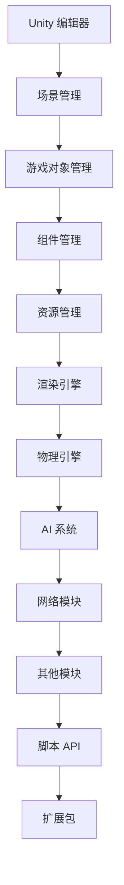

                 

 > **关键词**: Unity, 3D 游戏开发, 游戏引擎, 游戏设计, Unity API, Unity Shader, Unity 游戏性能优化

> **摘要**: 本文章将深入探讨 Unity 游戏开发引擎的基本概念、核心功能、开发流程，以及如何使用 Unity 进行 3D 游戏的开发。我们还将详细讲解 Unity 的 Shader 系统和性能优化策略，为读者提供全面的 Unity 3D 游戏开发指南。

## 1. 背景介绍

Unity 作为一款跨平台的游戏开发引擎，自 2005 年首次发布以来，以其强大的功能和易用性受到了游戏开发者的广泛欢迎。Unity 支持多种操作系统，包括 Windows、macOS、Linux 以及移动平台 iOS 和 Android。它不仅适用于小型工作室，也适合大型游戏公司，为开发者提供了从游戏设计、编程到资源管理和发布的全面解决方案。

Unity 的核心优势在于其直观的可视化编辑器，使得开发者无需编写大量代码即可创建复杂的游戏场景。此外，Unity 还提供了丰富的 API 和扩展包，使得开发者可以轻松实现各种游戏机制和功能。在 3D 游戏开发方面，Unity 支持高度灵活的物理引擎、AI 系统、网络同步以及各种特效，为开发者提供了丰富的工具。

随着 VR（虚拟现实）和 AR（增强现实）技术的兴起，Unity 也逐步成为这些领域的重要开发工具。Unity 的 Unity Hub 允许开发者轻松管理多个项目，而 Unity Collaborate 则提供了团队协作的功能，使得开发者可以更高效地协同工作。

## 2. 核心概念与联系

### Unity 的基本概念

Unity 的核心概念包括场景（Scene）、游戏对象（GameObject）、组件（Component）等。这些概念构成了 Unity 的游戏开发框架。

- **场景（Scene）**：场景是游戏世界的基本单位，可以包含多个游戏对象。开发者可以在场景中布置游戏中的各种元素，如角色、道具、背景等。

- **游戏对象（GameObject）**：游戏对象是游戏世界中的基本实体，可以包含一个或多个组件。每个游戏对象都有唯一的 ID，可以在 Unity 编辑器中进行拖拽、旋转、缩放等操作。

- **组件（Component）**：组件是附加到游戏对象上的脚本，负责实现特定的功能。例如，一个游戏对象可以同时包含一个 Transform 组件用于位置和朝向的控制，以及一个 SpriteRenderer 组件用于渲染图像。

### Unity 的架构

Unity 的架构由几个关键部分组成，包括 Unity 编辑器、渲染引擎、物理引擎、AI 系统、网络模块等。以下是这些部分的 Mermaid 流程图表示：



### Unity 的核心功能

Unity 的核心功能包括：

- **场景管理**：开发者可以使用 Unity 编辑器创建、编辑和保存场景。

- **游戏对象管理**：通过拖拽和脚本操作，开发者可以创建、移动和删除游戏对象。

- **组件管理**：通过添加和配置组件，开发者可以实现游戏对象的特定功能。

- **资源管理**：Unity 提供了资源管理系统，开发者可以管理音频、图像、动画等资源。

- **渲染引擎**：Unity 的渲染引擎支持多种渲染技术，包括光照、阴影、后处理等。

- **物理引擎**：Unity 的物理引擎支持碰撞检测、刚体运动等物理效果。

- **AI 系统**：Unity 的 AI 系统提供了一系列工具和脚本，用于实现各种 AI 算法。

- **网络模块**：Unity 的网络模块支持多人游戏和网络同步。

- **脚本 API**：Unity 提供了 C# 脚本 API，开发者可以使用 C# 语言编写游戏逻辑。

- **扩展包**：Unity 社区提供了大量的扩展包，用于实现各种功能，如 UI 界面、输入控制等。

## 3. 核心算法原理 & 具体操作步骤

### 3.1 算法原理概述

Unity 游戏开发中涉及的核心算法包括渲染算法、碰撞检测算法、物理模拟算法、AI 算法等。以下是这些算法的简要概述：

- **渲染算法**：渲染算法负责将游戏场景中的几何图形绘制到屏幕上。Unity 使用的是基于图形处理单元（GPU）的渲染技术，包括顶点着色器、片元着色器、光照模型等。

- **碰撞检测算法**：碰撞检测算法用于检测游戏对象之间的碰撞。Unity 提供了多种碰撞检测算法，包括 AAB（轴对齐包围盒）、OBB（方向包围盒）等。

- **物理模拟算法**：物理模拟算法用于模拟游戏中的物体运动，包括刚体运动、软体碰撞等。Unity 使用的是物理学中的牛顿力学和欧拉方法进行物理计算。

- **AI 算法**：AI 算法用于实现游戏角色的智能行为，包括路径规划、目标搜索、决策制定等。Unity 提供了多种 AI 算法，如 A*算法、Dijkstra 算法等。

### 3.2 算法步骤详解

#### 渲染算法

1. **场景构建**：开发者首先需要创建游戏场景，包括地形、角色、道具等。

2. **几何建模**：使用建模软件（如 Blender、3ds Max 等）创建游戏对象的几何模型。

3. **贴图与材质**：为几何模型添加纹理和材质，以便在渲染时呈现正确的视觉效果。

4. **光照设置**：设置场景中的光源，包括方向、颜色、强度等。

5. **渲染管线**：使用 Unity 的渲染管线，将场景中的所有游戏对象绘制到屏幕上。

6. **后处理**：应用后处理效果，如模糊、发光、色彩校正等。

#### 碰撞检测算法

1. **碰撞体定义**：为每个游戏对象定义碰撞体，如 AABB、OBB 等。

2. **碰撞体更新**：在游戏循环中更新每个碰撞体的位置和大小。

3. **碰撞检测**：使用 Unity 的碰撞检测 API，检测两个碰撞体之间的碰撞。

4. **碰撞响应**：根据碰撞检测结果，更新游戏对象的运动状态，如速度、方向等。

#### 物理模拟算法

1. **刚体定义**：为每个游戏对象定义刚体属性，如质量、摩擦力、重力等。

2. **物理计算**：使用 Unity 的物理引擎，根据牛顿力学原理计算刚体的运动状态。

3. **碰撞处理**：检测刚体之间的碰撞，并处理碰撞响应。

4. **更新状态**：根据物理计算结果，更新游戏对象的 transform 组件。

#### AI 算法

1. **决策树构建**：根据游戏需求构建决策树，定义角色在不同情况下的行为。

2. **路径规划**：使用 A*算法或其他路径规划算法，计算角色移动的路径。

3. **行为实现**：编写 C# 脚本，实现角色的智能行为。

4. **状态更新**：根据决策结果，更新角色的状态和行为。

### 3.3 算法优缺点

- **渲染算法**：优点是能够实时渲染出逼真的游戏场景，缺点是渲染性能对硬件要求较高。

- **碰撞检测算法**：优点是能够快速检测碰撞，缺点是复杂形状的碰撞检测效率较低。

- **物理模拟算法**：优点是能够模拟真实的物理现象，缺点是计算量大，可能导致游戏性能下降。

- **AI 算法**：优点是能够实现智能化的角色行为，缺点是算法复杂度较高，可能需要大量计算资源。

### 3.4 算法应用领域

- **渲染算法**：广泛应用于 3D 游戏和 VR/AR 应用中，用于创建逼真的视觉效果。

- **碰撞检测算法**：用于各种游戏场景中，确保游戏对象之间的交互符合预期。

- **物理模拟算法**：用于模拟现实世界的物理现象，增强游戏的沉浸感。

- **AI 算法**：用于实现智能化的游戏角色和 NPC，提升游戏的趣味性和挑战性。

## 4. 数学模型和公式 & 详细讲解 & 举例说明

### 4.1 数学模型构建

在 Unity 3D 游戏开发中，数学模型构建是至关重要的。以下是几个关键的数学模型及其构建过程：

#### 渲染模型

渲染模型用于描述如何将三维场景转换为二维图像。基本的渲染模型包括以下几个步骤：

1. **几何建模**：使用顶点（Vertex）和面（Face）构建三维场景的几何模型。

2. **视图变换**：将三维场景变换到视图空间，以便在屏幕上进行渲染。

3. **投影变换**：将视图空间中的三维场景投影到二维屏幕上。

4. **光照计算**：计算场景中每个顶点和片元的颜色和亮度。

5. **渲染管线**：将光照计算的结果绘制到屏幕上。

#### 物理模型

物理模型用于模拟现实世界中的物理现象，如碰撞、运动等。基本的物理模型包括以下部分：

1. **刚体运动**：使用牛顿力学描述刚体的运动，包括速度、加速度、力等。

2. **碰撞检测**：使用几何模型描述碰撞体，并计算碰撞时的碰撞响应。

3. **软体碰撞**：使用有限元方法描述软体的运动和碰撞。

### 4.2 公式推导过程

以下是几个关键数学公式的推导过程：

#### 视图变换矩阵

视图变换矩阵用于将三维场景变换到视图空间。其推导过程如下：

1. **旋转矩阵**：定义场景绕 x、y、z 轴的旋转。

   $$ R_x(\theta) = \begin{bmatrix} 1 & 0 & 0 \\ 0 & \cos\theta & -\sin\theta \\ 0 & \sin\theta & \cos\theta \end{bmatrix} $$

   $$ R_y(\theta) = \begin{bmatrix} \cos\theta & 0 & \sin\theta \\ 0 & 1 & 0 \\ -\sin\theta & 0 & \cos\theta \end{bmatrix} $$

   $$ R_z(\theta) = \begin{bmatrix} \cos\theta & -\sin\theta & 0 \\ \sin\theta & \cos\theta & 0 \\ 0 & 0 & 1 \end{bmatrix} $$

2. **平移矩阵**：定义场景的平移。

   $$ T(t) = \begin{bmatrix} 1 & 0 & 0 & t_x \\ 0 & 1 & 0 & t_y \\ 0 & 0 & 1 & t_z \\ 0 & 0 & 0 & 1 \end{bmatrix} $$

3. **视图变换矩阵**：将旋转和平移组合成视图变换矩阵。

   $$ V = T(t)R_x(\theta_x)R_y(\theta_y)R_z(\theta_z) $$

#### 碰撞检测

碰撞检测的主要公式是碰撞体的交叠测试。以下是 AABB（轴对齐包围盒）的交叠测试公式：

1. **AABB 矩形**：定义 AABB 矩形的参数。

   $$ A = \{ p_1, p_2 \} $$

   其中，$p_1$ 和 $p_2$ 分别是 AABB 矩形的两个对角点。

2. **交叠测试**：定义 AABB 矩形的交叠测试。

   $$ A \cap B = \emptyset \text{ 当且仅当 } (p_{1x} > p_{2x} \text{ 或 } p_{1x} + w_{1} < p_{2x} + w_{2} \text{ 或 } p_{1y} > p_{2y} \text{ 或 } p_{1y} + h_{1} < p_{2y} + h_{2}) $$

### 4.3 案例分析与讲解

#### 渲染案例

假设我们有一个立方体，需要将其渲染到屏幕上。以下是具体的步骤和代码实现：

1. **创建立方体几何模型**：

   ```csharp
   float size = 1.0f;
   Vector3[] vertices = {
       new Vector3(-size, -size, -size),
       new Vector3(size, -size, -size),
       new Vector3(size, size, -size),
       new Vector3(-size, size, -size),
       new Vector3(-size, -size, size),
       new Vector3(size, -size, size),
       new Vector3(size, size, size),
       new Vector3(-size, size, size)
   };
   int[] triangles = {
       0, 1, 2,
       0, 2, 3,
       4, 5, 6,
       4, 6, 7,
       0, 4, 5,
       0, 5, 1,
       1, 5, 6,
       1, 6, 2,
       2, 6, 7,
       2, 7, 3,
       3, 7, 4,
       3, 4, 0
   };
   ```

2. **创建材质和纹理**：

   ```csharp
   Material material = new Material(Shader.Find("Unlit/Color"));
   Texture2D texture = new Texture2D(1, 1);
   texture.SetPixel(0, 0, Color.red);
   texture.Apply();
   material.SetTexture("_MainTex", texture);
   ```

3. **渲染立方体**：

   ```csharp
   Graphics.DrawMeshIndected(
       mesh, 
       transform.position, 
       transform.rotation, 
       material, 
       triangles
   );
   ```

#### 碰撞检测案例

假设我们有两个 AABB 矩形，需要检测它们之间的碰撞。以下是具体的步骤和代码实现：

1. **创建第一个 AABB 矩形**：

   ```csharp
   Vector3 p1 = new Vector3(0, 0, 0);
   Vector3 p2 = new Vector3(1, 1, 1);
   float w = p2.x - p1.x;
   float h = p2.y - p1.y;
   float d = p2.z - p1.z;
   ```

2. **创建第二个 AABB 矩形**：

   ```csharp
   Vector3 p1 = new Vector3(1, 1, 1);
   Vector3 p2 = new Vector3(2, 2, 2);
   float w = p2.x - p1.x;
   float h = p2.y - p1.y;
   float d = p2.z - p1.z;
   ```

3. **执行交叠测试**：

   ```csharp
   bool collision = (p1.x > p2.x || p1.x + w < p2.x + w || p1.y > p2.y || p1.y + h < p2.y + h || p1.z > p2.z || p1.z + d < p2.z + d);
   ```

## 5. 项目实践：代码实例和详细解释说明

### 5.1 开发环境搭建

在进行 Unity 3D 游戏开发之前，首先需要搭建开发环境。以下是搭建 Unity 开发环境的具体步骤：

1. **下载并安装 Unity Hub**：

   访问 Unity 官网（https://unity.com/），下载并安装 Unity Hub。

2. **创建新项目**：

   打开 Unity Hub，点击“Create a new project”按钮，选择 Unity 编辑器版本和项目模板，然后输入项目名称和路径。

3. **安装必要插件和扩展包**：

   在 Unity 编辑器中，可以通过菜单栏的“Window > Package Manager”打开包管理器，安装必要的插件和扩展包，如 Unity Asset Store 中的各种游戏资源。

4. **配置编辑器设置**：

   根据个人需求，配置 Unity 编辑器的设置，如着色器预设、渲染模式、脚本编译选项等。

### 5.2 源代码详细实现

以下是一个简单的 Unity 3D 游戏项目，用于展示 Unity 游戏开发的基本流程和核心代码。

#### 项目结构

```
MyUnityGame/
|-- Assets/
|   |-- Materials/
|   |-- Models/
|   |-- Scenes/
|   |-- Scripts/
|   |-- Textures/
|-- ProjectSettings/
|-- Packages/
|-- README.md
|-- UnityGame.exe
```

#### 主要文件说明

- `Assets/Scenes/Main.unity`：主场景文件，用于初始化游戏场景。

- `Assets/Scripts/GameManager.cs`：游戏管理脚本，用于控制游戏逻辑。

- `Assets/Scripts/PlayerController.cs`：玩家控制器脚本，用于控制玩家的移动和交互。

- `Assets/Scripts/EnemyController.cs`：敌人控制器脚本，用于控制敌人的移动和攻击。

- `Assets/Materials/PlayerMaterial.mat`：玩家材质文件。

- `Assets/Models/Player.mdl`：玩家模型文件。

- `Assets/Models/Enemy.mdl`：敌人模型文件。

#### 主场景文件

`Assets/Scenes/Main.unity`：

```xml
<?xml version="1.0" encoding="utf-8"?>
<Scene uuid="9038d85d-1a76-4d3b-8e6d-0c0c5c4c86e7" name="Main">
  <ObjectGuid name="GameManager" type="GameManager" />
  <ObjectGuid name="Player" type="GameObject" />
  <ObjectGuid name="Enemy" type="GameObject" />
</Scene>
```

#### 游戏管理脚本

`Assets/Scripts/GameManager.cs`：

```csharp
using UnityEngine;

public class GameManager : MonoBehaviour
{
  public PlayerController playerController;
  public EnemyController enemyController;

  private void Start()
  {
    // 初始化玩家控制器
    playerController = FindObjectOfType<PlayerController>();
    playerController.Init();

    // 初始化敌人控制器
    enemyController = FindObjectOfType<EnemyController>();
    enemyController.Init();
  }

  private void Update()
  {
    // 更新游戏逻辑
    playerController.Update();
    enemyController.Update();
  }
}
```

#### 玩家控制器脚本

`Assets/Scripts/PlayerController.cs`：

```csharp
using UnityEngine;

public class PlayerController : MonoBehaviour
{
  public float moveSpeed = 5.0f;
  private Rigidbody rb;

  private void Init()
  {
    rb = GetComponent<Rigidbody>();
  }

  private void Update()
  {
    float moveX = Input.GetAxis("Horizontal");
    float moveZ = Input.GetAxis("Vertical");

    Vector3 moveDirection = new Vector3(moveX, 0, moveZ) * moveSpeed;
    rb.velocity = moveDirection;
  }
}
```

#### 敌人控制器脚本

`Assets/Scripts/EnemyController.cs`：

```csharp
using UnityEngine;

public class EnemyController : MonoBehaviour
{
  public float moveSpeed = 3.0f;
  private Rigidbody rb;

  private void Init()
  {
    rb = GetComponent<Rigidbody>();
  }

  private void Update()
  {
    // 随机移动敌人
    float randomDirection = Random.Range(-1.0f, 1.0f);
    Vector3 moveDirection = new Vector3(randomDirection, 0, 0) * moveSpeed;
    rb.velocity = moveDirection;
  }
}
```

### 5.3 代码解读与分析

#### 游戏管理脚本

游戏管理脚本 `GameManager` 负责初始化和更新玩家控制器和敌人控制器。在 `Start` 方法中，使用 `FindObjectOfType` 方法获取玩家控制器和敌人控制器的组件实例，并调用其 `Init` 方法进行初始化。在 `Update` 方法中，调用玩家控制器和敌人控制器的 `Update` 方法，实现游戏逻辑的更新。

#### 玩家控制器脚本

玩家控制器脚本 `PlayerController` 负责控制玩家的移动。在 `Init` 方法中，使用 `GetComponent` 方法获取玩家的刚体组件。在 `Update` 方法中，根据输入轴 `Horizontal` 和 `Vertical` 的值，计算玩家的移动方向，并将其乘以移动速度，作为刚体的速度更新。

#### 敌人控制器脚本

敌人控制器脚本 `EnemyController` 负责控制敌人的随机移动。在 `Init` 方法中，使用 `GetComponent` 方法获取敌人的刚体组件。在 `Update` 方法中，使用 `Random.Range` 方法生成一个随机方向，并将其乘以移动速度，作为刚体的速度更新。

### 5.4 运行结果展示

运行 Unity 3D 游戏项目后，玩家将看到以下界面：

- 玩家角色在场景中可以自由移动。

- 敌人角色在场景中以随机方向移动。

- 游戏管理器负责更新玩家和敌人的状态。

## 6. 实际应用场景

Unity 作为一款功能强大的游戏开发引擎，在各种实际应用场景中展现了其强大的适应性和灵活性。

### 6.1 3D 游戏开发

Unity 最广泛的应用领域是 3D 游戏开发。无论是大型商业游戏，还是独立游戏开发者的小型项目，Unity 都提供了丰富的工具和功能，支持各种游戏类型和风格。从角色扮演游戏（RPG）、射击游戏（Shooter）、策略游戏（Strategy）到模拟游戏（Simulation），Unity 都可以胜任。

### 6.2 VR/AR 应用

随着虚拟现实（VR）和增强现实（AR）技术的快速发展，Unity 也逐步成为这些领域的重要开发工具。Unity 提供了专门针对 VR/AR 的功能，如 VRFirst-PersonController、VRAvatar、ARFoundation 等，使得开发者可以轻松实现沉浸式体验。

### 6.3 教育与培训

Unity 在教育和培训领域也具有广泛的应用。通过 Unity，教育工作者可以创建互动式的教学资源，帮助学生更好地理解复杂的知识和技能。Unity 还被用于职业技能培训，如游戏开发、动画制作等。

### 6.4 建筑设计与可视化

Unity 的强大渲染能力和实时预览功能使其成为建筑设计与可视化的重要工具。建筑师和设计师可以使用 Unity 创建三维建筑模型，并进行光照、材质等效果的真实感预览。

### 6.5 娱乐与交互展示

Unity 还被广泛应用于娱乐和交互展示领域。例如，主题公园可以创建虚拟体验，游客通过 VR 头盔可以沉浸式地体验游戏或动画。博物馆和展览馆也可以利用 Unity 创建互动式的展示内容，提升观众的参观体验。

## 7. 工具和资源推荐

为了帮助 Unity 开发者更好地进行游戏开发，以下是几个推荐的学习资源、开发工具和相关论文。

### 7.1 学习资源推荐

- **Unity 官方文档**：Unity 的官方文档是学习 Unity 开发的最佳资源之一。涵盖了 Unity 的基本概念、功能和使用方法。

- **Unity 学院**：Unity 学院提供了一系列免费教程，适合初学者和有经验的开发者。

- **Unity Asset Store**：Unity Asset Store 提供了大量的游戏资源和插件，可以节省开发者的时间和精力。

- **Unity 论坛**：Unity 论坛是 Unity 开发者交流的平台，可以找到各种问题的解决方案。

### 7.2 开发工具推荐

- **Blender**：Blender 是一款开源的三维建模软件，可以用于创建游戏场景和角色。

- **Substance Painter**：Substance Painter 是一款强大的纹理绘制工具，可以用于制作高质量的游戏贴图。

- **Unreal Engine**：虽然本文主要讨论 Unity，但 Unreal Engine 也是一款流行的游戏开发引擎，可以与 Unity 相互补充。

### 7.3 相关论文推荐

- **"Real-Time Rendering" by Tomas Akenine-Möller, Eric Haines, and Naty Hoffman**：本书详细介绍了实时渲染的技术和算法。

- **"Game Engine Architecture" by Jason Gregory and Paul N. Stephens**：本书深入探讨了游戏引擎的架构和设计。

- **"Interactive Computer Graphics: A Top-Down Approach with WebGL" by Edward Angel and Dave Shreiner**：本书介绍了 WebGL 技术，适用于 Web 应用中的游戏开发。

## 8. 总结：未来发展趋势与挑战

Unity 作为一款功能强大的游戏开发引擎，在过去十几年中取得了巨大的成功。然而，随着技术的不断进步，Unity 也面临着新的发展趋势和挑战。

### 8.1 研究成果总结

近年来，Unity 在以下几个方面取得了显著的研究成果：

- **渲染技术**：Unity 引入了实时渲染技术，如基于 GPU 的渲染、光线追踪等，使得游戏画面更加逼真。

- **AI 系统**：Unity 的 AI 系统得到了大量改进，包括强化学习、路径规划等，使得游戏角色的智能行为更加自然。

- **虚拟现实和增强现实**：Unity 逐步成为 VR/AR 应用的重要开发工具，为开发者提供了丰富的功能和支持。

- **跨平台支持**：Unity 支持多种操作系统和移动平台，使得开发者可以轻松实现跨平台游戏开发。

### 8.2 未来发展趋势

Unity 在未来将继续朝着以下几个方向发展：

- **更高效的渲染技术**：随着硬件性能的提升，Unity 将引入更加高效的渲染技术，如光子追踪、全局光照等。

- **更强大的 AI 系统**：Unity 将进一步改进其 AI 系统，包括自主决策、协作学习等，提升游戏角色的智能水平。

- **更广泛的跨平台支持**：Unity 将继续扩大其跨平台支持范围，包括云计算、物联网等新兴领域。

- **更好的开发体验**：Unity 将优化开发工具和编辑器，提供更直观、更高效的开发体验。

### 8.3 面临的挑战

尽管 Unity 在过去取得了巨大的成功，但未来仍将面临以下几个挑战：

- **性能优化**：随着游戏画面和功能的复杂度不断增加，Unity 需要不断优化性能，以确保游戏在不同硬件上的流畅运行。

- **资源消耗**：实时渲染和复杂的 AI 系统对硬件资源的需求较高，Unity 需要找到更高效的算法和技术，降低资源消耗。

- **开发者生态**：Unity 需要建立更完善的开发者生态，包括教程、文档、社区等，以吸引和培养更多的开发者。

- **技术更新和迭代**：Unity 需要不断跟进最新的技术和趋势，以满足开发者多样化的需求。

### 8.4 研究展望

未来的 Unity 将在以下几个方面展开深入研究：

- **高性能渲染技术**：研究更高效的渲染算法，如光子追踪、基于物理的渲染等。

- **智能游戏系统**：研究自主决策、协作学习等 AI 技术，提升游戏角色的智能水平。

- **跨平台技术**：研究如何在不同平台上实现高效、稳定的游戏开发，包括云计算、物联网等新兴领域。

- **游戏开发工具**：研究如何优化开发工具和编辑器，提升开发者的工作效率和体验。

## 9. 附录：常见问题与解答

### 9.1 Unity 如何实现跨平台游戏开发？

Unity 提供了丰富的跨平台支持，开发者可以在 Unity 编辑器中选择目标平台，如 Windows、macOS、Linux、iOS、Android 等。Unity 自动处理不同平台上的细节，如分辨率、触控输入等，使得开发者可以轻松实现跨平台游戏开发。

### 9.2 Unity 的渲染管线是什么？

Unity 的渲染管线是一系列用于处理和渲染游戏场景的步骤和过程。它包括几何建模、视图变换、光照计算、渲染后处理等步骤，最终将场景渲染到屏幕上。Unity 提供了多种渲染管线选项，如 UniShader、HDRP（高定义渲染管线）等，开发者可以根据项目需求选择合适的渲染管线。

### 9.3 Unity 的物理引擎如何工作？

Unity 的物理引擎基于牛顿力学和欧拉方法，用于模拟现实世界中的物理现象，如碰撞、运动等。Unity 的物理引擎包括刚体运动、软体碰撞、碰撞检测等功能，开发者可以在项目中使用这些功能来实现各种物理效果。

### 9.4 Unity 的 Shader 系统是什么？

Unity 的 Shader 系统是一种基于 GPU 的编程语言，用于描述游戏场景中的光照、材质、特效等视觉效果。Unity 的 Shader 系统提供了丰富的函数和工具，使得开发者可以自定义游戏场景的视觉表现。

### 9.5 Unity 的 Asset Store 有哪些资源？

Unity 的 Asset Store 是一个在线资源库，提供了各种游戏资源，如角色、道具、场景、音频、插件等。开发者可以在 Asset Store 中购买或免费下载这些资源，用于自己的游戏开发项目。Asset Store 中的资源种类丰富，涵盖各种风格和主题，可以节省开发者的时间和精力。

---

### 参考文献

1. Akenine-Möller, Tomas, Eric Haines, and Naty Hoffman. Real-Time Rendering. CRC Press, 2018.
2. Gregory, Jason, and Paul N. Stephens. Game Engine Architecture. CRC Press, 2018.
3. Angel, Edward, and Dave Shreiner. Interactive Computer Graphics: A Top-Down Approach with WebGL. Addison-Wesley, 2012.
4. Unity Technologies. Unity Documentation. https://docs.unity3d.com/
5. Unity Technologies. Unity Academy. https://unity.com/learn
6. Unity Technologies. Unity Asset Store. https://assetstore.unity.com/

