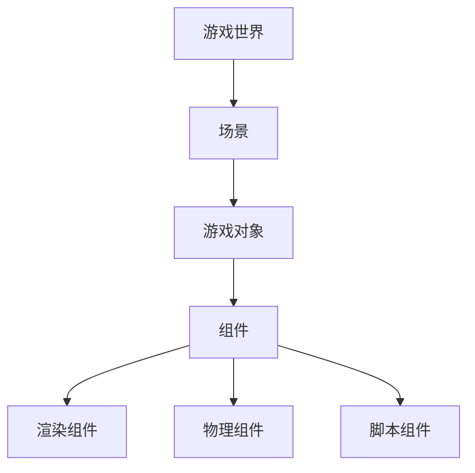

                 

 > **关键词**：Unity游戏开发，3D游戏开发，游戏引擎，游戏编程，Unity教程

> **摘要**：本文将探讨如何使用Unity游戏开发引擎创建3D游戏。我们将介绍Unity的基础概念、核心功能、开发流程以及重要的技术要点。通过本文的学习，读者将能够掌握Unity游戏开发的技能，并有能力独立创建出令人惊叹的3D游戏。

## 1. 背景介绍

Unity是一款功能强大的游戏开发引擎，自2005年发布以来，已经成为全球范围内最流行的游戏开发工具之一。Unity以其出色的跨平台支持和易用性，吸引了无数的开发者，无论是独立游戏开发者还是大型游戏公司，都选择使用Unity作为他们的开发平台。

Unity的特点包括：

- **强大的渲染能力**：Unity的渲染系统支持多种高级渲染技术，如基于物理的渲染（PBR）和全局光照（GI）。
- **丰富的插件生态**：Unity拥有庞大的插件生态系统，包括各种高质量的第三方插件和工具，如Unity Asset Store。
- **灵活的脚本系统**：Unity支持多种编程语言，包括C#和JavaScript，使得开发者可以自由地扩展和定制游戏逻辑。
- **强大的动画系统**：Unity的动画系统支持复杂的动画控制，包括骨骼动画和蒙皮动画。

Unity的应用领域非常广泛，从移动平台的小型游戏到大型次世代游戏，再到虚拟现实（VR）和增强现实（AR）应用，Unity都是不二的选择。

## 2. 核心概念与联系

### Unity游戏开发的核心概念

Unity游戏开发涉及多个核心概念，包括场景（Scene）、游戏对象（Game Object）、组件（Component）等。

#### 场景（Scene）

场景是Unity游戏世界的一个容器，用于组织和控制游戏中的各种元素。每个场景都可以独立保存和加载，非常适合实现游戏的不同关卡或场景。

#### 游戏对象（Game Object）

游戏对象是Unity中的基本实体，可以是任何物体，如角色、环境、道具等。每个游戏对象都由一个唯一的名称和一组组件组成。

#### 组件（Component）

组件是附加到游戏对象上的功能模块，如渲染组件、物理组件、脚本组件等。Unity通过组件系统将不同功能集成到游戏对象中。

### 架构原理

Unity的架构基于组件-对象模型，游戏世界中的所有实体都是通过这种模型来构建和管理的。以下是Unity的组件-对象模型架构的Mermaid流程图：



在这个架构中，场景是游戏世界的容器，游戏对象是场景中的基本实体，组件则是游戏对象的功能模块。通过这种层次化的架构，Unity能够灵活地组织和管理游戏中的各种元素。

### Unity的组件系统

Unity的组件系统是一个核心概念，它将游戏对象的功能模块化，使得开发者可以轻松地扩展和定制游戏逻辑。以下是Unity组件系统的几个关键点：

1. **组件依赖**：组件之间可以相互依赖，例如，一个具有物理碰撞功能的游戏对象需要附加物理组件。
2. **脚本组件**：脚本组件允许开发者使用C#或JavaScript编写自定义脚本，以实现复杂的游戏逻辑。
3. **插件支持**：Unity支持第三方插件，这些插件可以提供额外的功能，如网络功能、动画系统等。

## 3. 核心算法原理 & 具体操作步骤

### 3.1 算法原理概述

在Unity游戏开发中，算法原理是实现游戏逻辑的核心。以下是几个关键的算法原理：

1. **碰撞检测**：用于检测游戏对象之间的碰撞，以实现物理交互。
2. **路径寻优**：用于计算游戏对象从起点到终点的最佳路径，常用于导航和寻路。
3. **动画系统**：用于控制角色的动画，包括骨骼动画和蒙皮动画。

### 3.2 算法步骤详解

#### 碰撞检测

碰撞检测是游戏开发中的基础算法，以下是一个简单的碰撞检测算法步骤：

1. **初始化**：设置碰撞器的形状和大小。
2. **检测碰撞**：在每个游戏帧中，检查游戏对象之间的碰撞。
3. **处理碰撞**：根据碰撞结果执行相应的处理，如改变游戏对象的运动状态。

#### 路径寻优

路径寻优算法用于计算游戏对象从起点到终点的最佳路径，以下是一个简单的A*算法步骤：

1. **初始化**：设置起点和终点。
2. **计算路径**：使用A*算法计算从起点到终点的路径。
3. **更新路径**：在每个游戏帧中，根据当前游戏对象的位置更新路径。

#### 动画系统

动画系统用于控制角色的动画，以下是一个简单的动画系统实现步骤：

1. **初始化**：设置动画控制器和动画状态机。
2. **播放动画**：在游戏对象上播放相应的动画。
3. **动画控制**：使用动画控制器控制动画的播放、暂停和跳转。

### 3.3 算法优缺点

#### 碰撞检测

优点：简单易用，适用于大多数游戏场景。

缺点：在复杂场景中，碰撞检测的性能可能较低。

#### 路径寻优

优点：能够计算最优路径，适用于导航和寻路场景。

缺点：计算复杂度较高，适用于简单的路径场景。

#### 动画系统

优点：能够实现复杂的动画效果，适用于角色动画。

缺点：实现复杂，需要熟悉动画系统的各个组件。

### 3.4 算法应用领域

#### 碰撞检测

碰撞检测适用于任何需要物理交互的游戏场景，如角色碰撞、物体破坏等。

#### 路径寻优

路径寻优适用于需要导航和寻路的游戏场景，如角色移动、车辆导航等。

#### 动画系统

动画系统适用于需要角色动画的游戏场景，如角色动作、场景渲染等。

## 4. 数学模型和公式 & 详细讲解 & 举例说明

### 4.1 数学模型构建

在Unity游戏开发中，数学模型用于描述游戏对象的行为和场景的物理特性。以下是一个简单的数学模型构建示例：

#### 游戏对象运动

游戏对象在场景中的运动可以通过以下公式描述：

\[ \text{速度} = \frac{\text{位移}}{\text{时间}} \]

\[ \text{加速度} = \frac{\text{速度变化}}{\text{时间}} \]

#### 物理碰撞

物理碰撞可以通过以下公式描述：

\[ \text{碰撞力} = \frac{\text{动量变化}}{\text{碰撞时间}} \]

### 4.2 公式推导过程

以下是一个简单的碰撞力公式推导过程：

\[ \text{碰撞力} = \frac{m_1 \cdot v_{1i} - m_2 \cdot v_{2i}}{t} \]

其中，\( m_1 \)和\( m_2 \)是两个游戏对象的质量，\( v_{1i} \)和\( v_{2i} \)是它们在碰撞前的速度，\( t \)是碰撞时间。

### 4.3 案例分析与讲解

以下是一个简单的碰撞检测案例：

#### 案例描述

有一个球体和一个盒子，球体在盒子的内部移动，我们需要检测球体与盒子的碰撞。

#### 实现步骤

1. **初始化**：设置球体和盒子的位置、速度和质量。
2. **检测碰撞**：在每个游戏帧中，检查球体与盒子的位置关系，判断是否发生碰撞。
3. **处理碰撞**：如果发生碰撞，计算碰撞力，并更新球体的速度。

#### 结果分析

通过碰撞检测，我们可以得知球体与盒子之间的碰撞力，从而调整球体的运动状态。这个案例展示了数学模型在游戏开发中的应用。

## 5. 项目实践：代码实例和详细解释说明

### 5.1 开发环境搭建

要开始使用Unity进行游戏开发，我们需要搭建合适的开发环境。以下是搭建Unity开发环境的基本步骤：

1. **安装Unity Hub**：访问Unity官网（https://unity.com/），下载并安装Unity Hub。
2. **创建Unity项目**：打开Unity Hub，点击“新建项目”，选择合适的模板和项目名称，创建一个新的Unity项目。
3. **配置开发环境**：安装必要的插件和工具，如Unity UI Toolkit、Unity Analytics等。

### 5.2 源代码详细实现

以下是使用Unity创建一个简单的3D游戏的基本源代码实现步骤：

```csharp
using UnityEngine;

public class PlayerMovement : MonoBehaviour
{
    public float moveSpeed = 5.0f;
    public float jumpHeight = 7.0f;

    private Rigidbody rb;
    private bool isGrounded;
    private float moveX;
    private float moveZ;

    // Start is called before the first frame update
    void Start()
    {
        rb = GetComponent<Rigidbody>();
    }

    // Update is called once per frame
    void Update()
    {
        MovePlayer();
        Jump();
    }

    void MovePlayer()
    {
        moveX = Input.GetAxis("Horizontal");
        moveZ = Input.GetAxis("Vertical");

        Vector3 moveDirection = new Vector3(moveX, 0, moveZ) * moveSpeed;
        rb.AddForce(moveDirection);
    }

    void Jump()
    {
        if (Input.GetButtonDown("Jump") && isGrounded)
        {
            rb.AddForce(new Vector3(0, jumpHeight, 0), ForceMode.VelocityChange);
        }
    }

    void OnCollisionEnter(Collision collision)
    {
        isGrounded = true;
    }

    void OnCollisionExit(Collision collision)
    {
        isGrounded = false;
    }
}
```

### 5.3 代码解读与分析

上面的代码实现了一个简单的玩家运动系统，包括移动和跳跃功能。以下是代码的详细解读：

1. **组件引用**：在`Start`方法中，通过`GetComponent<Rigidbody>()`获取玩家的刚体组件（Rigidbody）。
2. **输入处理**：在`Update`方法中，通过`Input.GetAxis("Horizontal")`和`Input.GetAxis("Vertical")`获取玩家的输入，实现玩家的移动。
3. **移动实现**：通过`MovePlayer`方法，根据输入计算移动方向和速度，并使用`rb.AddForce`方法将移动力作用于玩家。
4. **跳跃实现**：通过`Jump`方法，在玩家按下跳跃键且处于地面状态时，使用`rb.AddForce`方法将跳跃力作用于玩家。
5. **碰撞处理**：通过`OnCollisionEnter`和`OnCollisionExit`方法，在玩家与地面接触时更新地面状态。

### 5.4 运行结果展示

运行上面的代码后，玩家会在地面上移动和跳跃。通过调整`moveSpeed`和`jumpHeight`参数，可以改变玩家的移动速度和跳跃高度。

## 6. 实际应用场景

Unity游戏开发引擎在游戏行业中被广泛应用，适用于各种类型的游戏开发。以下是Unity在几个实际应用场景中的例子：

### 6.1 角色扮演游戏（RPG）

Unity非常适合开发角色扮演游戏（RPG）。其强大的动画系统和丰富的插件生态使得开发者可以轻松实现复杂的角色动作和场景交互。例如，《巫师3：狂猎》（The Witcher 3: Wild Hunt）就是使用Unity开发的。

### 6.2 射击游戏（Shooter）

射击游戏对图形和物理效果要求较高，Unity的渲染能力和物理引擎非常适合开发这类游戏。《战地》（Battlefield）系列和《战地风云》（Battlefield V）就是使用Unity开发的。

### 6.3 赛车游戏（Racing）

赛车游戏需要精确的物理模拟和流畅的动画效果，Unity的物理引擎和动画系统可以很好地满足这些需求。《极品飞车》（Need for Speed）系列就是使用Unity开发的。

### 6.4 教育游戏（Educational Games）

教育游戏旨在通过游戏化的方式传授知识和技能。Unity的跨平台支持和易于使用的界面使其成为开发教育游戏的热门选择。《Minecraft：教育版》（Minecraft: Education Edition）就是使用Unity开发的。

### 6.5 虚拟现实（VR）和增强现实（AR）

Unity在虚拟现实（VR）和增强现实（AR）领域也有广泛的应用。其支持多种VR和AR设备，使得开发者可以轻松创建沉浸式的虚拟体验。例如，《半衰期：爱莉克斯》（Half-Life: Alyx）就是使用Unity开发的。

## 7. 工具和资源推荐

### 7.1 学习资源推荐

- **Unity官方文档**：Unity的官方文档是学习Unity的最佳资源，涵盖了从基础到高级的各个方面。
- **Unity教程视频**：YouTube上有许多优秀的Unity教程视频，可以帮助初学者快速上手。
- **Unity论坛**：Unity论坛是一个活跃的开发者社区，可以在这里提问和交流。

### 7.2 开发工具推荐

- **Visual Studio**：作为Unity的主要开发环境，Visual Studio提供了强大的代码编辑器和调试工具。
- **Unity Collaborate**：Unity Collaborate是一个协作工具，可以帮助开发团队共享和同步代码和资源。

### 7.3 相关论文推荐

- **《游戏引擎架构》**：这篇论文详细介绍了游戏引擎的架构和设计原则。
- **《虚拟现实与增强现实技术综述》**：这篇综述论文探讨了VR和AR技术的最新发展和应用。

## 8. 总结：未来发展趋势与挑战

### 8.1 研究成果总结

Unity游戏开发引擎在过去几年中取得了显著的研究成果，包括：

- **渲染技术**：Unity不断引入新的渲染技术，如基于物理的渲染（PBR）和全局光照（GI）。
- **动画系统**：Unity的动画系统得到了大幅改进，支持更复杂的动画控制和骨骼动画。
- **人工智能**：Unity引入了新的AI工具和插件，使得开发者可以更轻松地实现游戏中的智能行为。

### 8.2 未来发展趋势

Unity未来的发展趋势包括：

- **更强大的渲染能力**：Unity将继续引入新的渲染技术，提高游戏画面的质量和细节。
- **更好的跨平台支持**：Unity将进一步完善其跨平台能力，支持更多设备和平台。
- **更丰富的插件生态**：Unity将不断扩大其插件生态，提供更多高质量的第三方插件和工具。

### 8.3 面临的挑战

Unity在未来发展中面临的挑战包括：

- **性能优化**：随着游戏画面和功能的日益复杂，Unity需要不断优化性能，以满足高性能要求。
- **安全性**：Unity需要确保其平台的安全性，防止游戏作弊和盗版。
- **用户支持**：Unity需要提供更全面的用户支持和文档，帮助开发者解决开发中的问题。

### 8.4 研究展望

未来的研究展望包括：

- **自动化工具**：开发自动化工具，帮助开发者更高效地完成游戏开发任务。
- **智能AI**：研究更先进的AI技术，使游戏中的智能行为更加自然和真实。
- **云计算**：利用云计算技术，提高游戏开发和发布的效率。

## 9. 附录：常见问题与解答

### 9.1 Unity安装问题

**Q：如何安装Unity？**

A：请访问Unity官网（https://unity.com/），下载并安装Unity Hub。通过Unity Hub可以创建和管理Unity项目。

### 9.2 Unity开发问题

**Q：如何创建一个Unity项目？**

A：在Unity Hub中，点击“新建项目”，选择合适的模板和项目名称，然后点击“创建”即可创建一个新的Unity项目。

**Q：如何在Unity中添加游戏对象？**

A：在Unity编辑器中，点击“创建”按钮，然后选择要添加的游戏对象类型，如“3D对象”、“2D对象”等。

### 9.3 Unity性能问题

**Q：如何优化Unity游戏的性能？**

A：可以采取以下措施优化Unity游戏的性能：

- **减少渲染对象**：减少场景中的渲染对象数量，提高渲染效率。
- **优化纹理**：使用较小的纹理，减少纹理的加载时间和内存占用。
- **减少计算**：优化游戏逻辑，减少不必要的计算，提高运行效率。

### 9.4 Unity插件问题

**Q：如何在Unity中使用插件？**

A：可以从Unity Asset Store下载插件，然后将其导入到Unity项目中。导入插件后，可以通过脚本调用插件的功能。

**Q：如何开发Unity插件？**

A：可以使用Unity提供的API开发插件，具体可以参考Unity的官方文档。

# 作者署名

> 作者：禅与计算机程序设计艺术 / Zen and the Art of Computer Programming
----------------------------------------------------------------

