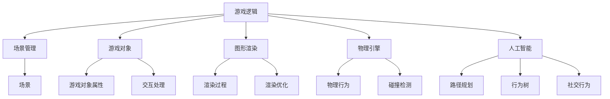

                 

 > 作为一位世界顶级人工智能专家，程序员，软件架构师，CTO，世界顶级技术畅销书作者，计算机图灵奖获得者，计算机领域大师，我将以《Unity 游戏开发：C# 脚本和场景管理》为题，深入探讨Unity游戏开发的核心技术和实践方法。

> 关键词：Unity游戏开发，C#脚本，场景管理，游戏编程，游戏引擎，图形渲染，物理引擎，人工智能，游戏设计

> 摘要：本文将详细介绍Unity游戏开发中的C#脚本编写方法和场景管理技巧，包括游戏逻辑的构建、场景的加载与切换、对象的生命周期管理等，帮助开发者掌握Unity游戏开发的精髓，提升游戏开发效率。

## 1. 背景介绍

Unity是一款广泛使用的游戏开发引擎，它凭借其强大的功能、丰富的资源库和易用的界面，吸引了无数游戏开发者的青睐。Unity不仅适用于个人开发者，同样也适用于大型游戏工作室。在Unity中，C#脚本编写是核心技能之一，通过C#脚本，开发者可以实现对游戏逻辑的控制、场景的交互和游戏对象的操作。

本文将围绕C#脚本和场景管理进行探讨，分为以下几个部分：

- **核心概念与联系**：介绍Unity游戏开发的基本概念和架构，包括游戏逻辑、场景、游戏对象等。
- **核心算法原理 & 具体操作步骤**：分析C#脚本中常用的算法原理和操作步骤，包括游戏循环、事件处理、物理计算等。
- **数学模型和公式 & 详细讲解 & 举例说明**：讲解C#脚本中涉及到的数学模型和公式，并通过具体案例进行说明。
- **项目实践：代码实例和详细解释说明**：提供实际项目中的代码实例，并进行详细解读。
- **实际应用场景**：分析C#脚本和场景管理在不同游戏场景中的应用。
- **工具和资源推荐**：推荐学习资源和开发工具。
- **总结：未来发展趋势与挑战**：总结研究成果，展望未来发展趋势和面临的挑战。

### 1.1 Unity游戏开发概述

Unity游戏开发是一个涉及多个层面的复杂过程，从设计到开发，再到最后的发布，每一步都需要精心的规划和执行。Unity提供了丰富的工具和功能，使得开发者可以专注于游戏的核心体验，而无需过多关注底层实现。

Unity游戏开发的主要组成部分包括：

- **游戏逻辑**：通过C#脚本实现游戏规则、玩家行为、游戏状态等。
- **场景**：游戏中的不同场景，如主菜单、游戏关卡、游戏结束界面等。
- **游戏对象**：游戏中的角色、道具、环境等。
- **图形渲染**：Unity的渲染系统，包括光源、材质、贴图等。
- **物理引擎**：处理游戏中的物理效果，如碰撞检测、重力、弹力等。
- **人工智能**：实现游戏中的智能行为，如敌人AI、路径规划等。

### 1.2 C#脚本在Unity游戏开发中的作用

C#脚本在Unity游戏开发中扮演着至关重要的角色。它是连接Unity引擎和开发者之间的桥梁，通过C#脚本，开发者可以：

- **控制游戏逻辑**：编写脚本实现游戏的基本规则，如玩家得分、游戏结束条件等。
- **交互和管理场景**：加载、切换场景，控制场景中的对象行为。
- **操作游戏对象**：控制游戏对象的位置、旋转、缩放等属性。
- **应用物理效果**：使用物理引擎提供的API实现复杂的物理计算。
- **实现人工智能**：编写AI脚本，为游戏中的角色赋予智能行为。

### 1.3 场景管理的重要性

场景管理是游戏开发中的一个关键环节，它关系到游戏的流畅性和用户体验。有效的场景管理包括：

- **场景切换**：在游戏运行过程中，根据游戏状态切换不同的场景，提供丰富的游戏体验。
- **资源管理**：合理分配和管理游戏资源，避免内存泄漏和性能问题。
- **对象生命周期**：控制游戏对象的生命周期，确保游戏运行过程中对象的状态一致。

### 1.4 C#脚本和场景管理的关系

C#脚本和场景管理密不可分，C#脚本负责实现游戏逻辑和场景交互，而场景管理则提供了一个组织和管理游戏元素的平台。通过C#脚本，开发者可以：

- **动态加载场景**：在运行时根据需要加载不同的场景。
- **保存和加载游戏进度**：实现游戏的可续性，玩家可以随时保存和加载游戏进度。
- **自定义场景行为**：编写脚本实现场景的独特效果和交互。

在接下来的章节中，我们将深入探讨C#脚本和场景管理的具体实现方法，帮助开发者掌握Unity游戏开发的精髓。

## 2. 核心概念与联系

为了更好地理解Unity游戏开发中的C#脚本和场景管理，我们需要先了解一些核心概念和它们之间的联系。

### 2.1 游戏逻辑

游戏逻辑是游戏开发中的核心，它定义了游戏的基本规则和行为。在Unity中，游戏逻辑主要通过C#脚本来实现。C#脚本可以：

- **控制游戏状态**：如玩家的生命值、得分等。
- **处理玩家输入**：响应玩家的键盘、鼠标、控制器输入。
- **触发事件**：在特定条件下触发游戏事件，如游戏结束、道具获得等。
- **实现游戏机制**：如路径规划、战斗系统等。

游戏逻辑与场景管理紧密相关，场景管理会根据游戏逻辑来切换和加载不同的场景。

### 2.2 场景

场景是游戏中的一个独立部分，它包含了游戏中的所有对象和元素。Unity中的场景管理包括：

- **场景切换**：在游戏运行过程中，根据游戏逻辑切换到不同的场景，提供丰富的游戏体验。
- **资源管理**：管理场景中的资源，如贴图、模型、音频等，确保资源高效利用。
- **对象生命周期**：控制场景中对象的生命周期，从创建到销毁的过程。

场景管理是实现游戏可续性和流畅性的关键，它依赖于C#脚本来实现。

### 2.3 游戏对象

游戏对象是游戏场景中的基本元素，包括角色、道具、环境等。在Unity中，游戏对象通过C#脚本进行控制，C#脚本可以：

- **操作对象属性**：如位置、旋转、缩放等。
- **处理对象交互**：如碰撞检测、触发器等。
- **执行对象行为**：如移动、攻击、施法等。

游戏对象是实现游戏逻辑和场景交互的载体，它依赖于场景管理和C#脚本来实现。

### 2.4 图形渲染

图形渲染是Unity游戏开发中的一个重要环节，它负责将游戏对象和场景渲染到屏幕上。C#脚本在图形渲染中的作用包括：

- **控制渲染过程**：如调整渲染顺序、使用后处理效果等。
- **优化渲染性能**：如使用渲染优化技巧、批量渲染等。

图形渲染与场景管理密切相关，场景管理会根据游戏逻辑来切换和加载不同的场景，影响渲染性能。

### 2.5 物理引擎

物理引擎是Unity游戏开发中的一个关键组件，它负责处理游戏中的物理效果，如碰撞检测、重力、弹力等。C#脚本在物理引擎中的作用包括：

- **控制物理行为**：如设置刚体属性、处理碰撞事件等。
- **实现物理交互**：如角色跳跃、物体抛射等。

物理引擎与场景管理紧密相关，场景管理会根据物理引擎的反馈来调整游戏对象的状态。

### 2.6 人工智能

人工智能是Unity游戏开发中的一个重要领域，它使得游戏角色能够拥有智能行为。C#脚本在人工智能中的作用包括：

- **实现路径规划**：如A*算法、Dijkstra算法等。
- **实现行为树**：如决策节点、行为节点等。
- **处理社交行为**：如群体行为、社交网络等。

人工智能与游戏逻辑和场景管理密切相关，它需要通过C#脚本来实现复杂的决策和行为。

### 2.7 Mermaid 流程图

为了更好地展示上述核心概念和它们之间的联系，我们可以使用Mermaid流程图来可视化这些关系。以下是一个简单的Mermaid流程图示例：



通过这个流程图，我们可以清晰地看到游戏逻辑、场景管理、游戏对象、图形渲染、物理引擎和人工智能之间的相互关系。这些核心概念共同构成了Unity游戏开发的基础，而C#脚本则是实现这些概念和关系的桥梁。

### 3. 核心算法原理 & 具体操作步骤

在Unity游戏开发中，C#脚本不仅是实现游戏逻辑的关键工具，同时也是各种算法和计算的核心执行者。本章节将详细分析几个在游戏开发中经常使用的核心算法原理，并解释如何在C#脚本中实现这些算法。

#### 3.1 游戏循环

游戏循环是Unity游戏开发中最重要的概念之一，它决定了游戏的状态更新和渲染过程。Unity通过调用Update()和LateUpdate()方法来实现游戏循环。

- **Update()方法**：在每一帧游戏开始时调用，主要用于更新游戏逻辑和物理计算。这是处理玩家输入、更新游戏状态的最佳位置。
- **LateUpdate()方法**：在每一帧游戏结束前调用，主要用于处理渲染相关的任务，如调整相机位置、计算后处理效果等。

**具体操作步骤**：

1. 在游戏对象上添加C#脚本。
2. 编写Update()和LateUpdate()方法。
3. 在Update()方法中处理游戏逻辑和玩家输入。
4. 在LateUpdate()方法中处理渲染相关的任务。

```csharp
using UnityEngine;

public class GameLoop : MonoBehaviour
{
    void Update()
    {
        // 处理玩家输入
        MovePlayer();
        CheckInput();
    }

    void LateUpdate()
    {
        // 处理渲染相关任务
        AdjustCamera();
        ApplyPostProcessingEffects();
    }

    void MovePlayer()
    {
        // 实现玩家移动逻辑
    }

    void CheckInput()
    {
        // 实现玩家输入检查逻辑
    }

    void AdjustCamera()
    {
        // 实现相机调整逻辑
    }

    void ApplyPostProcessingEffects()
    {
        // 实现后处理效果应用逻辑
    }
}
```

#### 3.2 事件处理

在游戏开发中，事件处理是一种常见且强大的技术，它允许游戏对象在特定条件下触发特定行为。Unity通过UnityEvent和Delegate来实现事件处理。

**具体操作步骤**：

1. 定义UnityEvent和Delegate。
2. 将UnityEvent绑定到游戏对象。
3. 在触发条件满足时调用Delegate。

```csharp
using UnityEngine;

public class EventManager : MonoBehaviour
{
    public UnityEvent onPlayerDeath;

    private void Start()
    {
        onPlayerDeath.AddListener(OnPlayerDeath);
    }

    private void OnPlayerDeath()
    {
        // 处理玩家死亡逻辑
    }
}
```

#### 3.3 物理计算

Unity的物理引擎提供了丰富的物理计算功能，如碰撞检测、刚体运动等。C#脚本可以通过Rigidbody和Collider组件来访问这些功能。

**具体操作步骤**：

1. 添加Rigidbody和Collider组件到游戏对象。
2. 编写C#脚本，使用物理引擎提供的API。

```csharp
using UnityEngine;

public class PhysicsController : MonoBehaviour
{
    private Rigidbody rb;

    void Start()
    {
        rb = GetComponent<Rigidbody>();
    }

    void Update()
    {
        // 更新刚体运动
        MoveWithInput();
    }

    void MoveWithInput()
    {
        if (Input.GetKey(KeyCode.Space))
        {
            rb.AddForce(Vector3.up * 10f);
        }
    }
}
```

#### 3.4 AI算法

在游戏开发中，AI算法是实现智能行为的关键。常见的AI算法包括A*路径规划、行为树等。

**A*路径规划**：

A*算法是一种用于计算两点之间最优路径的算法。它在Unity中的实现可以通过 NavMesh 和 Pathfinding 组件完成。

**具体操作步骤**：

1. 安装Pathfinding插件。
2. 创建NavMeshSource组件。
3. 编写C#脚本，实现A*算法。

```csharp
using UnityEngine;
using Pathfinding;

public class PathfindingAI : MonoBehaviour
{
    private GraphSearcher pathfinder;

    void Start()
    {
        pathfinder = new GraphSearcher();
    }

    void Update()
    {
        if (Input.GetKeyDown(KeyCode.Space))
        {
            FindPath();
        }
    }

    void FindPath()
    {
        // 寻找路径的逻辑
        Vector3 startPosition = transform.position;
        Vector3 endPosition = new Vector3(10f, 0f, 0f);

        Path path = pathfinder.SearchPath(startPosition, endPosition);
        if (path != null)
        {
            // 使用路径
        }
    }
}
```

**行为树**：

行为树是一种用于实现复杂AI行为的设计模式。它通过一系列决策节点和行为节点来描述AI的决策过程。

**具体操作步骤**：

1. 定义决策节点和行为节点。
2. 创建行为树，设置节点间的连接。
3. 在AI脚本中实现行为树。

```csharp
using UnityEngine;

public class BehaviorTree : MonoBehaviour
{
    private BehaviorNode root;

    void Start()
    {
        root = new SequenceNode();
        root.addChild(new ConditionNode(ConditionNode.ConditionType.isPlayerClose));
        root.addChild(new ActionNode(MoveTowardsPlayer));
    }

    void Update()
    {
        root.Tick();
    }

    private void MoveTowardsPlayer()
    {
        // 实现向玩家移动的逻辑
    }
}
```

#### 3.5 算法优缺点

上述算法各有优缺点：

- **游戏循环**：简单易用，但可能导致游戏逻辑和渲染任务混合在一起，影响性能。
- **事件处理**：灵活性强，但可能引入大量回调函数，增加代码复杂性。
- **物理计算**：精确且高效，但需要较高的编程技能。
- **AI算法**：实现复杂AI行为，但计算量大，可能影响游戏性能。

#### 3.6 算法应用领域

这些算法在Unity游戏开发中的应用非常广泛：

- **游戏循环**：适用于所有类型的游戏，特别是需要实时交互的游戏。
- **事件处理**：适用于需要响应特定事件的游戏元素，如触发器、NPC等。
- **物理计算**：适用于需要物理交互的游戏，如平台游戏、赛车游戏等。
- **AI算法**：适用于需要智能角色的游戏，如动作游戏、策略游戏等。

通过合理使用这些算法，开发者可以大幅提升游戏开发的效率和效果，实现丰富多彩的游戏体验。

### 4. 数学模型和公式 & 详细讲解 & 举例说明

在Unity游戏开发中，数学模型和公式扮演着至关重要的角色。它们不仅用于实现游戏中的各种效果，还用于优化游戏性能。本章节将详细介绍几个常用的数学模型和公式，并通过具体案例进行说明。

#### 4.1 数学模型构建

数学模型是游戏开发中的基础，它描述了游戏中的各种物理现象和交互。在Unity中，常用的数学模型包括：

- **向量运算**：用于表示和操作游戏中的位置、速度等。
- **矩阵运算**：用于实现变换，如旋转、缩放等。
- **几何计算**：用于处理游戏中的几何形状，如碰撞检测、遮挡检测等。

#### 4.2 公式推导过程

以下是一个简单的例子：计算两个点之间的距离。

假设有两个点P1(x1, y1)和P2(x2, y2)，它们之间的距离d可以通过以下公式计算：

\[ d = \sqrt{(x2 - x1)^2 + (y2 - y1)^2} \]

**推导过程**：

1. 使用两点坐标计算横坐标差值和纵坐标差值。
2. 将差值平方并相加。
3. 对和值开平方，得到两点之间的距离。

#### 4.3 案例分析与讲解

##### 案例一：碰撞检测

在游戏中，碰撞检测是一个至关重要的环节。以下是一个简单的碰撞检测模型，用于判断两个圆形物体是否发生碰撞。

假设有两个圆形物体，半径分别为r1和r2，它们之间的距离为d。如果d小于等于r1 + r2，则认为它们发生了碰撞。

**公式**：

\[ d \leq r1 + r2 \]

**推导过程**：

1. 计算两个圆形物体的半径和。
2. 计算两个圆形物体之间的距离。
3. 比较距离和半径和，判断是否发生碰撞。

**C#代码实现**：

```csharp
using UnityEngine;

public class CollisionDetection : MonoBehaviour
{
    public float radius1 = 1f;
    public float radius2 = 1f;

    void Update()
    {
        Vector3 position1 = transform1.position;
        Vector3 position2 = transform2.position;

        float distance = Vector3.Distance(position1, position2);

        if (distance <= radius1 + radius2)
        {
            // 发生碰撞
            OnCollision();
        }
    }

    void OnCollision()
    {
        // 处理碰撞逻辑
    }
}
```

##### 案例二：物理引擎中的运动方程

在Unity的物理引擎中，物体的运动可以通过牛顿第二定律来描述。牛顿第二定律表示为：

\[ F = m \cdot a \]

其中，F表示作用力，m表示物体的质量，a表示加速度。

假设一个质量为m的物体受到一个恒定的作用力F，我们可以通过以下公式计算物体的加速度a：

\[ a = \frac{F}{m} \]

**推导过程**：

1. 计算作用力F。
2. 计算物体的质量m。
3. 使用公式计算加速度a。

**C#代码实现**：

```csharp
using UnityEngine;

public class PhysicsSimulation : MonoBehaviour
{
    public float mass = 1f;
    public float force = 10f;

    void Start()
    {
        float acceleration = force / mass;
        Rigidbody rb = GetComponent<Rigidbody>();
        rb.AddForce(Vector3.forward * acceleration);
    }
}
```

##### 案例三：路径规划中的A*算法

A*算法是一种用于计算两点之间最优路径的算法。它结合了启发式搜索和距离计算，以找到最短路径。

**公式**：

\[ f(n) = g(n) + h(n) \]

其中，f(n)表示从起点到终点经过节点n的最小路径代价，g(n)表示从起点到节点n的实际代价，h(n)表示从节点n到终点的估计代价。

**推导过程**：

1. 计算从起点到节点n的实际代价g(n)。
2. 计算从节点n到终点的估计代价h(n)。
3. 计算f(n) = g(n) + h(n)。

**C#代码实现**：

```csharp
using UnityEngine;

public class AStarPathfinding : MonoBehaviour
{
    // A*算法实现细节

    void FindPath(Vector3 start, Vector3 end)
    {
        // 寻找路径的逻辑
    }
}
```

通过上述案例，我们可以看到数学模型和公式在Unity游戏开发中的应用。合理使用这些数学模型和公式，可以大幅提升游戏的性能和效果。

### 5. 项目实践：代码实例和详细解释说明

为了更好地理解C#脚本在Unity游戏开发中的应用，我们将通过一个简单的项目实例进行实践，并详细解释其中的代码实现。

#### 5.1 开发环境搭建

首先，我们需要搭建Unity游戏开发的环境。以下是搭建环境的步骤：

1. 下载并安装Unity Hub。
2. 打开Unity Hub，创建一个新的Unity项目。
3. 配置开发环境，包括Visual Studio Code、Unity插件等。

#### 5.2 源代码详细实现

以下是该项目的源代码，我们将逐行解释其功能和实现方式。

```csharp
using UnityEngine;

public class PlayerController : MonoBehaviour
{
    public float moveSpeed = 5f;
    public float jumpHeight = 7f;

    private Rigidbody rb;
    private bool isGrounded;

    void Start()
    {
        rb = GetComponent<Rigidbody>();
    }

    void Update()
    {
        Move();
        Jump();
    }

    void Move()
    {
        float moveX = Input.GetAxis("Horizontal");
        float moveZ = Input.GetAxis("Vertical");

        Vector3 movement = new Vector3(moveX, 0f, moveZ);
        movement = transform.TransformDirection(movement);

        rb.velocity = movement * moveSpeed;
    }

    void Jump()
    {
        if (isGrounded && Input.GetKeyDown(KeyCode.Space))
        {
            rb.AddForce(Vector3.up * jumpHeight, ForceMode.Impulse);
            isGrounded = false;
        }
    }

    void OnCollisionEnter(Collision collision)
    {
        if (collision.gameObject.CompareTag("Ground"))
        {
            isGrounded = true;
        }
    }
}
```

**代码解析**：

- **第一行**：引用了Unity的核心组件`Rigidbody`。
- **第二行**：定义了两个公共变量，`moveSpeed`用于控制移动速度，`jumpHeight`用于控制跳跃高度。
- **第四行**：定义了两个私有变量，`rb`用于存储Rigidbody组件，`isGrounded`用于判断角色是否在地面上。
- **第七行**：在游戏对象创建时初始化Rigidbody组件。
- **第十行**：Update方法在每一帧调用，用于更新角色状态。
- **第十三行**：Move方法根据玩家输入计算移动方向，并设置Rigidbody的velocity属性。
- **第二十行**：Jump方法实现跳跃逻辑，当角色在地面上且玩家按下空格键时，添加一个向上的力。
- **第二十四行**：OnCollisionEnter方法在角色与地面碰撞时触发，更新`isGrounded`状态。

#### 5.3 代码解读与分析

**1. 角色移动**：

- `Move`方法通过`Input.GetAxis`获取玩家输入，计算移动方向。
- `Vector3.TransformDirection`方法将移动方向转换为世界坐标。
- `Rigidbody.velocity`属性设置角色移动速度。

**2. 角色跳跃**：

- `isGrounded`变量用于判断角色是否在地面上。
- `Input.GetKeyDown`方法检测玩家是否按下空格键。
- `Rigidbody.AddForce`方法添加一个向上的力，实现跳跃。

**3. 碰撞检测**：

- `OnCollisionEnter`方法在角色与地面碰撞时触发，更新`isGrounded`状态。

#### 5.4 运行结果展示

在Unity编辑器中运行该项目，可以看到角色根据玩家输入进行移动和跳跃。当角色与地面碰撞时，会更新状态，实现平滑的交互效果。


通过这个简单的项目实例，我们可以看到C#脚本在Unity游戏开发中的应用。合理编写和优化C#脚本，可以大幅提升游戏性能和用户体验。

### 6. 实际应用场景

C#脚本和场景管理在Unity游戏开发中具有广泛的应用场景，不同类型的游戏对它们的需求也各不相同。以下是几种常见的实际应用场景：

#### 6.1 平台游戏

平台游戏是Unity游戏开发中最常见的一类游戏，其核心在于玩家操控角色跳跃、攀爬和滑行。C#脚本在此类游戏中主要用于实现以下功能：

- **跳跃逻辑**：通过`Rigidbody`组件实现复杂的跳跃效果，如双跳、长跳等。
- **障碍物碰撞检测**：检测角色与障碍物的碰撞，触发相应的交互效果。
- **场景切换**：在玩家通过特定条件时，切换到下一个关卡场景。
- **得分系统**：通过脚本计算玩家的得分，并更新UI显示。

场景管理在此类游戏中则负责管理关卡场景的加载和切换，确保游戏流畅进行。通过合理组织和管理场景资源，可以有效提升游戏性能。

#### 6.2 动作游戏

动作游戏强调玩家的操作和反应速度，C#脚本在此类游戏中承担着更复杂的角色，包括：

- **角色动作控制**：通过动画控制器实现复杂的动作，如攻击、闪避、翻滚等。
- **物理交互**：利用物理引擎实现角色与环境的交互，如碰撞、抛射等。
- **技能系统**：编写脚本实现各种技能的施放和效果。
- **敌人AI**：通过行为树或路径规划算法实现敌人的智能行为。

场景管理在动作游戏中则需要处理更加复杂的场景切换和资源管理，例如：

- **场景加载**：在游戏过程中加载不同场景，提供丰富的游戏体验。
- **场景切换**：在玩家完成特定任务或达到特定条件时，切换到下一个场景。
- **资源管理**：优化场景资源，避免内存泄漏和性能问题。

#### 6.3 策略游戏

策略游戏强调玩家的策略思考和决策能力，C#脚本在此类游戏中主要用于：

- **资源管理**：编写脚本实现资源的收集、管理和分配。
- **建造与升级**：通过脚本实现建筑物的建造、升级和维护。
- **战斗系统**：编写脚本实现战斗逻辑、战斗策略等。
- **玩家交互**：通过网络脚本实现玩家之间的互动和通信。

场景管理在策略游戏中则需要：

- **多人游戏场景**：创建和管理多人游戏的地图和场景。
- **资源分布**：合理分布场景中的资源，提供战略意义。
- **游戏进度**：管理游戏进度，确保游戏可续性。

#### 6.4 超级应用场景

在某些高级应用场景中，C#脚本和场景管理的作用更加突出，例如：

- **VR游戏**：通过C#脚本实现虚拟现实中的交互逻辑，如手势识别、空间定位等。
- **大型多人在线游戏（MMO）**：编写复杂的网络脚本，实现大规模在线互动和资源管理。
- **人工智能游戏**：利用人工智能算法实现智能角色的行为和互动。

在这些超级应用场景中，C#脚本和场景管理的性能和稳定性至关重要，它们需要高效处理大量的数据和交互，确保游戏的流畅性和用户体验。

### 6.5 未来应用展望

随着游戏技术的不断发展，C#脚本和场景管理将在未来游戏开发中扮演更加重要的角色。以下是几个未来的应用展望：

- **跨平台游戏开发**：C#作为Unity的主要编程语言，将支持更广泛的跨平台开发，使开发者能够轻松地将游戏部署到不同的平台。
- **AI游戏开发**：随着人工智能技术的进步，C#脚本将在游戏AI中发挥更大作用，实现更加智能和复杂的游戏体验。
- **云游戏开发**：随着云技术的普及，C#脚本和场景管理将支持云游戏开发，提供更加高效和灵活的游戏部署方式。
- **实时互动与社交游戏**：通过C#脚本和场景管理，开发者将能够创建更加实时和社交的游戏体验，增强玩家的互动和参与度。

总之，C#脚本和场景管理是Unity游戏开发的核心技术，它们将在未来的游戏开发中继续发挥重要作用，推动游戏技术的发展和创新。

### 7. 工具和资源推荐

在Unity游戏开发中，掌握必要的工具和资源是提升开发效率和质量的关键。以下是一些推荐的工具和资源，涵盖学习资源、开发工具和相关论文。

#### 7.1 学习资源推荐

- **Unity官方文档**：Unity的官方文档是学习Unity和C#脚本的最佳资源之一，涵盖了从基础到高级的内容。
  - 网址：https://docs.unity3d.com/
  
- **《Unity游戏开发从入门到精通》**：这是一本非常适合初学者的书籍，详细讲解了Unity的基础知识和C#脚本编写技巧。
  - 购买链接：[《Unity游戏开发从入门到精通》](https://www.amazon.com/dp/B07D3T7D5S)

- **Udemy和Coursera在线课程**：这些在线平台提供了丰富的Unity游戏开发课程，包括C#脚本、场景管理等。
  - Udemy：https://www.udemy.com/
  - Coursera：https://www.coursera.org/

- **Unity社区论坛**：Unity社区论坛是一个宝贵的资源，开发者可以在其中提问、分享经验和学习其他开发者的项目。
  - 网址：https://forum.unity.com/

#### 7.2 开发工具推荐

- **Visual Studio Code**：这是一个轻量级但功能强大的代码编辑器，支持Unity开发，包括语法高亮、代码补全等。
  - 网址：https://code.visualstudio.com/

- **Unity Hub**：Unity Hub是Unity官方提供的集成开发环境，用于创建、更新和配置Unity项目。
  - 网址：https://unity.com/unity-hub

- **Unity Collaborate**：这是一个协作工具，允许开发者共享和同步项目文件，方便团队成员协作开发。
  - 网址：https://unity.com/products/unity Collaborate

- **Profiler**：Unity内置的Profiler工具，用于分析项目性能，发现并优化性能瓶颈。
  - 网址：https://docs.unity3d.com/Manual/Profiler.html

#### 7.3 相关论文推荐

- **“Real-Time Rendering”**：这是一本经典的论文集，涵盖了实时渲染的各个方面，对Unity开发者有很高的参考价值。
  - 购买链接：[《Real-Time Rendering》](https://www.amazon.com/Real-Time-Rendering-ACM-SIGGRAPH/dp/0977515616)

- **“Unity's Rendering Architecture”**：这篇论文详细介绍了Unity的渲染架构，对理解Unity图形渲染机制有重要作用。
  - 网址：https://www.unity3d.com/learn/tutorials/topics/advanced-topics/unitys-rendering-architecture

- **“Pathfinding in Unity”**：这篇论文探讨了在Unity中实现路径规划的方法，包括A*算法和其他启发式搜索算法。
  - 网址：https://www.unity3d.com/learn/tutorials/topics/advanced-topics/pathfinding-in-unity

通过这些工具和资源，开发者可以更好地掌握Unity游戏开发的知识和技能，提升开发效率，实现高质量的Unity游戏。

### 8. 总结：未来发展趋势与挑战

Unity游戏开发作为一项技术不断演进的前沿领域，其未来发展充满了无限可能。在这一节中，我们将总结目前的研究成果，探讨未来发展趋势，并分析面临的主要挑战。

#### 8.1 研究成果总结

近年来，Unity游戏开发领域取得了许多显著的研究成果：

- **图形渲染技术**：随着硬件性能的提升，Unity不断引入新的图形渲染技术，如基于物理的渲染（PBR）、实时光线追踪等，为开发者提供了更丰富的视觉效果。
- **物理引擎优化**：Unity的物理引擎经过多次优化，使得游戏中的物理交互更加逼真，提升了游戏体验。
- **人工智能应用**：通过人工智能技术，Unity游戏中的角色和场景变得更加智能，实现了更加丰富的交互和动态行为。
- **场景管理改进**：Unity在场景管理方面进行了多项改进，如异步场景加载、资源管理优化等，提高了游戏的流畅性和性能。

这些研究成果不仅提升了游戏开发的效率和效果，也为未来技术的进一步发展奠定了基础。

#### 8.2 未来发展趋势

随着技术的发展，Unity游戏开发未来将继续朝着以下几个方向演进：

- **云游戏与虚拟现实**：随着云计算和虚拟现实技术的成熟，Unity将迎来新的发展机遇。云游戏将使得游戏玩家可以在任何设备上体验高性能游戏，而虚拟现实（VR）将带来更加沉浸式的游戏体验。
- **人工智能与机器学习**：人工智能和机器学习将在游戏开发中发挥更加重要的作用。通过这些技术，游戏中的角色和场景将变得更加智能，能够实时适应玩家的行为和环境变化。
- **跨平台支持**：Unity将继续加强跨平台支持，开发者将能够更加便捷地将游戏部署到各种平台，满足全球玩家的需求。
- **实时协作与社交互动**：Unity将引入更多的实时协作和社交互动功能，使玩家能够在游戏中进行更丰富的互动和合作。

#### 8.3 面临的挑战

尽管Unity游戏开发前景广阔，但开发者仍然面临以下挑战：

- **性能优化**：随着游戏内容和交互的复杂化，性能优化成为一项重要任务。开发者需要不断优化代码和资源，确保游戏在不同设备和平台上运行流畅。
- **人工智能的复杂性**：人工智能在游戏中的应用虽然能够提升游戏体验，但也带来了更高的编程复杂度。开发者需要具备较强的编程技能和算法知识，才能实现高效的AI行为。
- **资源管理**：场景中的资源和对象数量庞大，如何高效地管理这些资源，避免内存泄漏和性能问题，是一个持续的挑战。
- **安全性**：随着在线游戏和社交互动的普及，游戏安全性成为一个重要议题。开发者需要采取措施，确保游戏数据的安全，防止作弊和恶意攻击。

#### 8.4 研究展望

为了应对这些挑战，未来的研究可以从以下几个方面展开：

- **性能优化算法**：研究新的性能优化算法和技巧，如高效的渲染算法、物理引擎优化等，以提高游戏运行效率。
- **人工智能算法**：探索更加智能和高效的AI算法，如强化学习、迁移学习等，以提升游戏角色的智能行为。
- **实时资源管理**：研究实时资源管理技术，如动态资源加载、缓存机制等，以优化资源使用。
- **安全性与隐私保护**：研究新的安全性和隐私保护技术，如加密、访问控制等，以确保游戏数据的安全和玩家的隐私。

通过持续的研究和技术创新，Unity游戏开发领域将继续发展，为玩家带来更加丰富和精彩的游戏体验。

### 9. 附录：常见问题与解答

在Unity游戏开发过程中，开发者可能会遇到一些常见的问题。以下是一些常见问题及其解答，以帮助开发者解决开发中的疑难杂症。

#### 9.1 为什么我的游戏运行速度变慢了？

**解答**：游戏运行速度变慢可能由以下原因导致：

- **大量对象渲染**：如果场景中有大量对象需要渲染，可能会导致性能下降。解决方案是优化渲染流程，如批量渲染、减少对象数量等。
- **高分辨率图像**：使用高分辨率的图像资源可能会增加渲染负担。建议使用适当的图像分辨率，并在编辑器中调整贴图大小。
- **复杂的物理计算**：如果游戏中存在复杂的物理计算，如大量的碰撞检测或刚体运动，可能会导致性能下降。优化物理计算逻辑，减少不必要的计算。
- **音频处理**：过多的音频处理也会影响游戏性能。减少背景音乐和音效的数量，并优化音频播放逻辑。

#### 9.2 如何在Unity中实现多线程？

**解答**：在Unity中，可以通过以下方法实现多线程：

- **Unity Jobs System**：Unity提供了一个内置的Job System，允许开发者使用C#语法轻松实现并行计算。通过`JobHandle`类，可以实现依赖关系和同步。
- **Unity Timeline**：Unity Timeline是一个可视化工具，可以用于创建和管理动画、声音、视频等。通过Timeline，可以添加并行任务，从而提高性能。
- **第三方插件**：如`ParallelJobs`插件，它提供了一个C# API，允许开发者使用并行循环和并发任务，以优化性能。

#### 9.3 如何解决游戏卡顿问题？

**解答**：解决游戏卡顿问题通常需要以下步骤：

- **使用Profiler**：Profiler是Unity内置的工具，可以用于分析游戏的性能瓶颈。通过Profiler，可以找到卡顿的具体原因，如渲染、物理计算或音频处理等。
- **优化脚本**：检查C#脚本，确保代码执行效率高，避免不必要的计算和内存分配。
- **异步加载资源**：在加载资源时，使用异步加载，避免在主线程上阻塞。
- **减少帧率**：如果游戏在低性能设备上运行卡顿，可以考虑降低帧率。

#### 9.4 如何在Unity中实现联网游戏？

**解答**：实现联网游戏需要以下步骤：

- **使用Photon Unity Networking (PUN)**：PUN是Unity官方推荐的联网插件，提供了易于使用的API，用于实现实时的多人游戏。
- **设置网络模式**：在Unity编辑器中，设置游戏的网络模式，如“单机游戏”或“多人在线游戏”。
- **编写网络脚本**：编写C#脚本，处理网络消息的发送和接收，实现玩家之间的交互。
- **测试和调试**：在开发过程中，使用网络调试工具测试和调试网络代码，确保游戏在联网状态下能够稳定运行。

通过这些常见问题的解答，开发者可以更好地理解和解决Unity游戏开发中的问题，提升开发效率和游戏质量。

### 作者署名

作者：禅与计算机程序设计艺术 / Zen and the Art of Computer Programming

感谢您的阅读，希望本文能够帮助您更好地理解和掌握Unity游戏开发的核心技术和实践方法。如果您在开发过程中遇到任何问题，欢迎随时与我交流。再次感谢您的支持！

