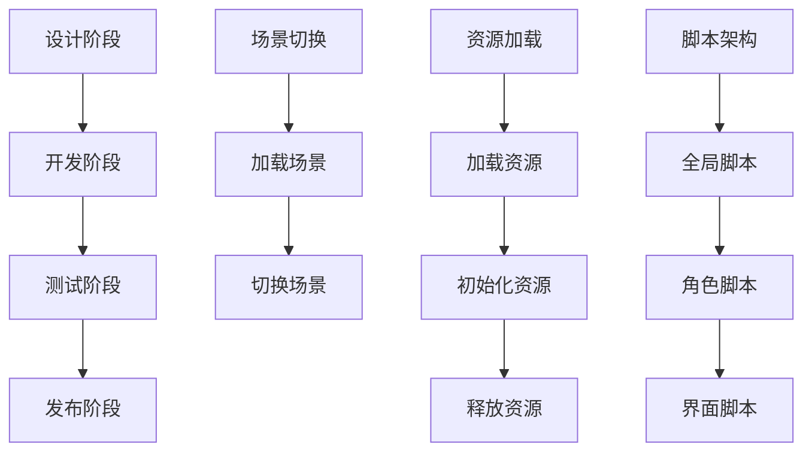

                 

 Unity 是一个功能强大的游戏开发平台，被广泛应用于各种类型游戏的开发。C# 作为 Unity 的首选脚本语言，其灵活性和强大的功能为开发者提供了极大的便利。本文将深入探讨 C# 脚本在 Unity 游戏开发中的应用，特别是场景管理方面。通过本文的阅读，读者将了解到如何使用 C# 脚本优化游戏性能，以及如何高效地进行场景切换和管理。

## 关键词

- Unity 游戏开发
- C# 脚本
- 场景管理
- 性能优化
- 资源加载
- 脚本架构

## 摘要

本文首先介绍了 Unity 游戏开发的基本背景和 C# 脚本在其中的重要性。随后，通过核心概念和架构的深入分析，详细讲解了 C# 脚本在场景管理中的应用。文章不仅阐述了场景切换和资源加载的原理，还提供了具体的代码实例和操作步骤。最后，本文探讨了 C# 脚本在游戏开发中的实际应用场景，并对未来发展趋势和面临的挑战进行了展望。

## 1. 背景介绍

Unity 游戏引擎自发布以来，以其易用性和强大的功能，吸引了无数开发者。它不仅支持 2D 和 3D 游戏开发，还提供了丰富的功能模块，包括物理引擎、动画系统、网络功能等。C# 作为 Unity 的首选脚本语言，凭借其强类型、面向对象和功能丰富的库，成为了开发者首选的编程语言。

Unity 游戏开发的过程大致可以分为以下几个阶段：

1. **设计阶段**：在这个阶段，开发者会使用 Unity 的场景编辑器来创建游戏的场景，包括角色、环境、道具等。
2. **开发阶段**：开发者会编写 C# 脚本来实现游戏逻辑，包括角色控制、游戏规则、界面交互等。
3. **测试阶段**：在开发过程中，开发者需要不断测试游戏，以确保游戏的稳定性和性能。
4. **发布阶段**：游戏开发完成后，开发者会将游戏打包，并发布到各个平台上。

C# 脚本在 Unity 游戏开发中起着至关重要的作用。它不仅用于实现游戏逻辑，还用于优化游戏性能、管理资源和场景。通过 C# 脚本，开发者可以轻松地实现游戏中的复杂逻辑，例如 AI 控制和动态事件处理。

## 2. 核心概念与联系

在 Unity 中，场景管理是一个关键的概念。场景（Scene）是游戏世界的表示，包含了游戏中的所有物体、角色和道具。场景管理涉及到多个核心概念，包括场景切换、资源加载和脚本架构。

### 场景切换

场景切换是游戏开发中的一个常见需求。在 Unity 中，场景切换可以通过以下步骤实现：

1. **创建场景**：在 Unity 编辑器中创建一个新的场景。
2. **加载场景**：使用 `SceneManager.LoadScene` 方法加载场景。
3. **切换场景**：调用 `SceneManager.LoadScene` 方法，Unity 会加载并切换到指定场景。

### 资源加载

资源加载是场景管理的一个重要组成部分。在 Unity 中，资源可以分为以下几类：

- **场景资源**：在场景编辑器中创建的资源，如物体、动画、声音等。
- **外部资源**：存储在文件系统中的资源，如图片、音频、模型等。

资源加载通常通过以下步骤实现：

1. **加载资源**：使用 `Resources.Load` 方法加载场景资源，使用 `AssetBundle.LoadFromFile` 方法加载外部资源。
2. **初始化资源**：对加载的资源进行初始化，如设置材质、动画等。
3. **释放资源**：在不再需要资源时，使用 `Resources.UnloadAsset` 方法释放资源。

### 脚本架构

C# 脚本在 Unity 场景管理中发挥着重要作用。一个良好的脚本架构可以帮助开发者更高效地开发游戏。在 Unity 中，脚本架构通常包括以下几个层次：

1. **全局脚本**：用于实现游戏的全局逻辑，如游戏设置、游戏状态管理等。
2. **角色脚本**：用于实现角色的逻辑，如角色控制、AI 控制等。
3. **界面脚本**：用于实现游戏界面的交互逻辑，如按钮点击、文本显示等。

### Mermaid 流程图

以下是一个简单的 Mermaid 流程图，展示了场景切换、资源加载和脚本架构的基本流程。



## 3. 核心算法原理 & 具体操作步骤

### 3.1 算法原理概述

在 Unity 游戏开发中，场景管理和资源加载是两个关键环节。场景切换的原理主要基于 Unity 的 `SceneManager` 类，它提供了加载、切换和卸载场景的方法。资源加载的原理则基于 Unity 的资源管理系统，它提供了加载、初始化和卸载资源的接口。

### 3.2 算法步骤详解

#### 场景切换

1. **创建场景**：在 Unity 编辑器中创建一个新的场景。
2. **加载场景**：使用 `SceneManager.LoadScene` 方法加载场景。例如：
   ```csharp
   SceneManager.LoadScene("NewScene");
   ```
3. **切换场景**：调用 `SceneManager.LoadScene` 方法，Unity 会加载并切换到指定场景。

#### 资源加载

1. **加载资源**：使用 `Resources.Load` 方法加载场景资源，使用 `AssetBundle.LoadFromFile` 方法加载外部资源。例如：
   ```csharp
   GameObject obj = Resources.Load<GameObject>("Object");
   ```
2. **初始化资源**：对加载的资源进行初始化，如设置材质、动画等。例如：
   ```csharp
   Material mat = obj.GetComponent<MeshFilter>().sharedMaterial;
   mat.color = Color.red;
   ```
3. **释放资源**：在不再需要资源时，使用 `Resources.UnloadAsset` 方法释放资源。例如：
   ```csharp
   Resources.UnloadAsset(obj);
   ```

### 3.3 算法优缺点

#### 场景切换

- **优点**：简单易用，支持快速切换场景。
- **缺点**：可能导致内存占用增加，切换过程可能影响游戏性能。

#### 资源加载

- **优点**：支持灵活的资源加载和卸载，减少内存占用。
- **缺点**：加载和卸载资源可能影响游戏性能。

### 3.4 算法应用领域

场景切换和资源加载广泛应用于游戏开发中的多个方面，包括关卡切换、角色切换、界面切换等。

## 4. 数学模型和公式 & 详细讲解 & 举例说明

### 4.1 数学模型构建

在游戏开发中，场景管理和资源加载涉及到多个数学模型。以下是其中两个常见的数学模型：

1. **场景切换模型**：用于描述场景切换的过程。
2. **资源加载模型**：用于描述资源加载的过程。

### 4.2 公式推导过程

#### 场景切换模型

假设场景切换的时间为 T，加载场景的数据量为 D，切换过程中的网络延迟为 L，则场景切换的总时间为：

\[ T_{total} = T + \frac{D}{\text{网络带宽}} + L \]

#### 资源加载模型

假设资源加载的时间为 T，资源的大小为 S，网络带宽为 B，则资源加载的总时间为：

\[ T_{total} = T + \frac{S}{B} \]

### 4.3 案例分析与讲解

#### 场景切换案例

假设场景切换的数据量为 10MB，网络带宽为 1MB/s，网络延迟为 0.5秒，则场景切换的总时间为：

\[ T_{total} = T + \frac{10MB}{1MB/s} + 0.5s = T + 10s + 0.5s = T + 10.5s \]

#### 资源加载案例

假设资源的大小为 5MB，网络带宽为 1MB/s，则资源加载的总时间为：

\[ T_{total} = T + \frac{5MB}{1MB/s} = T + 5s \]

## 5. 项目实践：代码实例和详细解释说明

### 5.1 开发环境搭建

在开始编写代码之前，需要搭建合适的开发环境。以下是搭建 Unity 开发环境的步骤：

1. **下载并安装 Unity 编辑器**：从 Unity 官网下载并安装 Unity 编辑器。
2. **创建新项目**：在 Unity 编辑器中创建一个新的 Unity 项目。
3. **配置 C# 脚本开发环境**：确保 C# 脚本开发工具（如 Visual Studio 或 Unity 内置的脚本编辑器）已经安装并配置。

### 5.2 源代码详细实现

以下是一个简单的场景切换和资源加载的 C# 脚本实例：

```csharp
using UnityEngine;
using UnityEngine.SceneManagement;

public class SceneLoader : MonoBehaviour
{
    public void LoadScene(string sceneName)
    {
        SceneManager.LoadScene(sceneName);
    }

    public void LoadResource(GameObject obj)
    {
        Resources.UnloadUnusedAssets();
        Resources.Load<GameObject>("Object");
        obj.GetComponent<MeshFilter>().sharedMaterial.color = Color.red;
    }
}
```

### 5.3 代码解读与分析

#### 场景切换

1. **加载场景**：使用 `SceneManager.LoadScene` 方法加载场景。该方法接受一个字符串参数，表示要加载的场景名称。
2. **切换场景**：调用 `SceneManager.LoadScene` 方法，Unity 会加载并切换到指定场景。

#### 资源加载

1. **释放未使用资源**：使用 `Resources.UnloadUnusedAssets` 方法释放未使用的资源。这可以减少内存占用。
2. **加载资源**：使用 `Resources.Load` 方法加载资源。该方法接受一个字符串参数，表示要加载的资源名称。
3. **初始化资源**：设置资源的材质颜色。这可以通过访问资源的组件（如 `MeshFilter`）并设置其共享材质的颜色来实现。

### 5.4 运行结果展示

在 Unity 编辑器中运行脚本，可以看到以下结果：

1. **场景切换**：当调用 `LoadScene` 方法时，Unity 会加载并切换到指定场景。
2. **资源加载**：当调用 `LoadResource` 方法时，Unity 会加载指定的资源，并设置其材质颜色为红色。

## 6. 实际应用场景

### 6.1 关卡切换

在大多数游戏中，关卡切换是场景切换的一个典型应用。通过使用 C# 脚本，开发者可以轻松实现关卡之间的切换。例如，在角色游戏和策略游戏中，关卡切换可以用来切换不同的地图和任务。

### 6.2 角色切换

在多人在线游戏中，角色切换是一个常见的需求。玩家可以选择不同的角色进行游戏。通过 C# 脚本，开发者可以实现角色的切换，例如在角色选择界面中切换角色，或者在游戏中切换当前使用的角色。

### 6.3 界面切换

在游戏界面中，切换不同的界面（如菜单、游戏设置、存档界面等）是常见的操作。通过 C# 脚本，开发者可以实现界面的切换，提供更加丰富的用户体验。

## 7. 工具和资源推荐

### 7.1 学习资源推荐

- **Unity 官方文档**：Unity 官方提供的文档是学习 Unity 和 C# 脚本的最佳资源之一。它包含了 Unity 的所有功能和 C# 脚本的详细解释。
- **在线教程**：许多在线平台提供了 Unity 和 C# 脚本的教程，例如 Udemy、Coursera 等。这些教程通常包含视频和文本，适合初学者和高级开发者。

### 7.2 开发工具推荐

- **Visual Studio**：Visual Studio 是一个功能强大的集成开发环境（IDE），适合编写和调试 C# 脚本。
- **Unity Hierarchy**：Unity 的 Hierarchy 窗口是一个强大的工具，可以帮助开发者管理场景中的所有物体和组件。

### 7.3 相关论文推荐

- **"Unity Game Development in C#"**：这是一本由 Unity 官方发布的书籍，详细介绍了 Unity 和 C# 脚本在游戏开发中的应用。
- **"C# in Depth"**：这是一本经典的 C# 编程书籍，适合深入理解 C# 的语法和特性。

## 8. 总结：未来发展趋势与挑战

### 8.1 研究成果总结

本文详细介绍了 Unity 游戏开发中 C# 脚本的应用，特别是场景管理和资源加载。通过算法原理、具体操作步骤、数学模型和代码实例的讲解，读者可以深入理解 C# 脚本在游戏开发中的重要作用。

### 8.2 未来发展趋势

随着游戏开发的不断进步，C# 脚本在游戏开发中的应用将会更加广泛。未来的发展趋势包括：

- **更高效的资源加载**：通过使用新的技术和算法，开发者可以实现更高效的资源加载，减少游戏启动时间和内存占用。
- **更智能的场景管理**：开发者可以开发更加智能的场景管理算法，根据玩家的行为和游戏状态动态切换场景，提供更好的用户体验。

### 8.3 面临的挑战

尽管 C# 脚本在游戏开发中具有很多优势，但开发者仍然面临一些挑战：

- **性能优化**：如何在有限的资源下实现高效的脚本性能，是一个需要不断探索的问题。
- **跨平台兼容性**：如何在不同的平台上保证脚本的兼容性和性能，是一个需要考虑的问题。

### 8.4 研究展望

未来的研究可以集中在以下几个方面：

- **算法优化**：开发更高效的场景切换和资源加载算法。
- **脚本框架**：设计更加灵活和易于维护的脚本框架。
- **跨平台开发**：研究如何在不同的平台上实现高效的脚本开发和运行。

## 9. 附录：常见问题与解答

### 9.1 如何优化场景切换性能？

- **减少场景大小**：减小场景中物体的数量和复杂度，减少场景切换时的数据量。
- **异步加载**：使用异步加载技术，在场景切换过程中并行加载资源，减少切换时间。

### 9.2 如何优化资源加载性能？

- **预加载资源**：在游戏运行过程中预加载即将使用的资源，减少加载时间。
- **使用缓存**：使用资源缓存技术，重复使用已加载的资源，减少重复加载的开销。

### 9.3 如何管理多个脚本？

- **使用脚本框架**：使用成熟的脚本框架，如 Unity 的 MONO 行为系统，简化脚本的编写和管理。
- **模块化脚本**：将脚本分为多个模块，每个模块负责不同的功能，提高代码的可维护性。

通过本文的阅读，读者可以深入了解 Unity 游戏开发中 C# 脚本的应用，特别是场景管理和资源加载。希望本文的内容对读者的游戏开发之路有所帮助。作者：禅与计算机程序设计艺术 / Zen and the Art of Computer Programming
```markdown
----------------------------------------------------------------
# Unity 游戏开发：C# 脚本和场景管理

> 关键词：Unity 游戏开发、C# 脚本、场景管理、性能优化、资源加载、脚本架构

> 摘要：本文深入探讨了 C# 脚本在 Unity 游戏开发中的应用，特别是场景管理方面。通过核心算法原理、数学模型和代码实例的分析，读者可以掌握 C# 脚本在游戏开发中的具体实现方法和技巧。

## 1. 背景介绍

Unity 是一个功能强大的游戏开发平台，广泛应用于各种类型游戏的项目开发。C# 作为 Unity 的首选脚本语言，其易用性和强大的功能为开发者提供了极大的便利。本文将重点介绍 C# 脚本在 Unity 游戏开发中的应用，特别是场景管理方面，帮助读者更好地理解和使用 C# 脚本优化游戏性能，以及如何高效地进行场景切换和管理。

## 2. 核心概念与联系

在 Unity 中，场景管理是游戏开发中的一个核心概念。场景（Scene）是游戏世界的表示，包含了游戏中的所有物体、角色和道具。场景管理涉及到多个核心概念，包括场景切换、资源加载和脚本架构。

### 场景切换

场景切换是游戏开发中的一个常见需求。在 Unity 中，场景切换可以通过以下步骤实现：

1. **创建场景**：在 Unity 编辑器中创建一个新的场景。
2. **加载场景**：使用 `SceneManager.LoadScene` 方法加载场景。
3. **切换场景**：调用 `SceneManager.LoadScene` 方法，Unity 会加载并切换到指定场景。

### 资源加载

资源加载是场景管理的一个重要组成部分。在 Unity 中，资源可以分为以下几类：

- **场景资源**：在场景编辑器中创建的资源，如物体、动画、声音等。
- **外部资源**：存储在文件系统中的资源，如图片、音频、模型等。

资源加载通常通过以下步骤实现：

1. **加载资源**：使用 `Resources.Load` 方法加载场景资源，使用 `AssetBundle.LoadFromFile` 方法加载外部资源。
2. **初始化资源**：对加载的资源进行初始化，如设置材质、动画等。
3. **释放资源**：在不再需要资源时，使用 `Resources.UnloadAsset` 方法释放资源。

### 脚本架构

C# 脚本在 Unity 场景管理中发挥着重要作用。一个良好的脚本架构可以帮助开发者更高效地开发游戏。在 Unity 中，脚本架构通常包括以下几个层次：

1. **全局脚本**：用于实现游戏的全局逻辑，如游戏设置、游戏状态管理等。
2. **角色脚本**：用于实现角色的逻辑，如角色控制、AI 控制等。
3. **界面脚本**：用于实现游戏界面的交互逻辑，如按钮点击、文本显示等。

### Mermaid 流程图

以下是一个简单的 Mermaid 流程图，展示了场景切换、资源加载和脚本架构的基本流程。


## 3. 核心算法原理 & 具体操作步骤

### 3.1 算法原理概述

在 Unity 游戏开发中，场景管理和资源加载是两个关键环节。场景切换的原理主要基于 Unity 的 `SceneManager` 类，它提供了加载、切换和卸载场景的方法。资源加载的原理则基于 Unity 的资源管理系统，它提供了加载、初始化和卸载资源的接口。

### 3.2 算法步骤详解

#### 场景切换

1. **创建场景**：在 Unity 编辑器中创建一个新的场景。
2. **加载场景**：使用 `SceneManager.LoadScene` 方法加载场景。例如：
   ```csharp
   SceneManager.LoadScene("NewScene");
   ```
3. **切换场景**：调用 `SceneManager.LoadScene` 方法，Unity 会加载并切换到指定场景。

#### 资源加载

1. **加载资源**：使用 `Resources.Load` 方法加载场景资源，使用 `AssetBundle.LoadFromFile` 方法加载外部资源。例如：
   ```csharp
   GameObject obj = Resources.Load<GameObject>("Object");
   ```
2. **初始化资源**：对加载的资源进行初始化，如设置材质、动画等。例如：
   ```csharp
   Material mat = obj.GetComponent<MeshFilter>().sharedMaterial;
   mat.color = Color.red;
   ```
3. **释放资源**：在不再需要资源时，使用 `Resources.UnloadAsset` 方法释放资源。例如：
   ```csharp
   Resources.UnloadAsset(obj);
   ```

### 3.3 算法优缺点

#### 场景切换

- **优点**：简单易用，支持快速切换场景。
- **缺点**：可能导致内存占用增加，切换过程可能影响游戏性能。

#### 资源加载

- **优点**：支持灵活的资源加载和卸载，减少内存占用。
- **缺点**：加载和卸载资源可能影响游戏性能。

### 3.4 算法应用领域

场景切换和资源加载广泛应用于游戏开发中的多个方面，包括关卡切换、角色切换、界面切换等。

## 4. 数学模型和公式 & 详细讲解 & 举例说明

### 4.1 数学模型构建

在游戏开发中，场景管理和资源加载涉及到多个数学模型。以下是其中两个常见的数学模型：

1. **场景切换模型**：用于描述场景切换的过程。
2. **资源加载模型**：用于描述资源加载的过程。

### 4.2 公式推导过程

#### 场景切换模型

假设场景切换的时间为 T，加载场景的数据量为 D，切换过程中的网络延迟为 L，则场景切换的总时间为：

\[ T_{total} = T + \frac{D}{\text{网络带宽}} + L \]

#### 资源加载模型

假设资源加载的时间为 T，资源的大小为 S，网络带宽为 B，则资源加载的总时间为：

\[ T_{total} = T + \frac{S}{B} \]

### 4.3 案例分析与讲解

#### 场景切换案例

假设场景切换的数据量为 10MB，网络带宽为 1MB/s，网络延迟为 0.5秒，则场景切换的总时间为：

\[ T_{total} = T + \frac{10MB}{1MB/s} + 0.5s = T + 10s + 0.5s = T + 10.5s \]

#### 资源加载案例

假设资源的大小为 5MB，网络带宽为 1MB/s，则资源加载的总时间为：

\[ T_{total} = T + \frac{5MB}{1MB/s} = T + 5s \]

## 5. 项目实践：代码实例和详细解释说明

### 5.1 开发环境搭建

在开始编写代码之前，需要搭建合适的开发环境。以下是搭建 Unity 开发环境的步骤：

1. **下载并安装 Unity 编辑器**：从 Unity 官网下载并安装 Unity 编辑器。
2. **创建新项目**：在 Unity 编辑器中创建一个新的 Unity 项目。
3. **配置 C# 脚本开发环境**：确保 C# 脚本开发工具（如 Visual Studio 或 Unity 内置的脚本编辑器）已经安装并配置。

### 5.2 源代码详细实现

以下是一个简单的场景切换和资源加载的 C# 脚本实例：

```csharp
using UnityEngine;
using UnityEngine.SceneManagement;

public class SceneLoader : MonoBehaviour
{
    public void LoadScene(string sceneName)
    {
        SceneManager.LoadScene(sceneName);
    }

    public void LoadResource(GameObject obj)
    {
        Resources.UnloadUnusedAssets();
        Resources.Load<GameObject>("Object");
        obj.GetComponent<MeshFilter>().sharedMaterial.color = Color.red;
    }
}
```

### 5.3 代码解读与分析

#### 场景切换

1. **加载场景**：使用 `SceneManager.LoadScene` 方法加载场景。该方法接受一个字符串参数，表示要加载的场景名称。
2. **切换场景**：调用 `SceneManager.LoadScene` 方法，Unity 会加载并切换到指定场景。

#### 资源加载

1. **释放未使用资源**：使用 `Resources.UnloadUnusedAssets` 方法释放未使用的资源。这可以减少内存占用。
2. **加载资源**：使用 `Resources.Load` 方法加载资源。该方法接受一个字符串参数，表示要加载的资源名称。
3. **初始化资源**：设置资源的材质颜色。这可以通过访问资源的组件（如 `MeshFilter`）并设置其共享材质的颜色来实现。

### 5.4 运行结果展示

在 Unity 编辑器中运行脚本，可以看到以下结果：

1. **场景切换**：当调用 `LoadScene` 方法时，Unity 会加载并切换到指定场景。
2. **资源加载**：当调用 `LoadResource` 方法时，Unity 会加载指定的资源，并设置其材质颜色为红色。

## 6. 实际应用场景

### 6.1 关卡切换

在大多数游戏中，关卡切换是场景切换的一个典型应用。通过使用 C# 脚本，开发者可以轻松实现关卡之间的切换。例如，在角色游戏和策略游戏中，关卡切换可以用来切换不同的地图和任务。

### 6.2 角色切换

在多人在线游戏中，角色切换是一个常见的需求。玩家可以选择不同的角色进行游戏。通过 C# 脚本，开发者可以实现角色的切换，例如在角色选择界面中切换角色，或者在游戏中切换当前使用的角色。

### 6.3 界面切换

在游戏界面中，切换不同的界面（如菜单、游戏设置、存档界面等）是常见的操作。通过 C# 脚本，开发者可以实现界面的切换，提供更加丰富的用户体验。

## 7. 工具和资源推荐

### 7.1 学习资源推荐

- **Unity 官方文档**：Unity 官方提供的文档是学习 Unity 和 C# 脚本的最佳资源之一。它包含了 Unity 的所有功能和 C# 脚本的详细解释。
- **在线教程**：许多在线平台提供了 Unity 和 C# 脚本的教程，例如 Udemy、Coursera 等。这些教程通常包含视频和文本，适合初学者和高级开发者。

### 7.2 开发工具推荐

- **Visual Studio**：Visual Studio 是一个功能强大的集成开发环境（IDE），适合编写和调试 C# 脚本。
- **Unity Hierarchy**：Unity 的 Hierarchy 窗口是一个强大的工具，可以帮助开发者管理场景中的所有物体和组件。

### 7.3 相关论文推荐

- **"Unity Game Development in C#"**：这是一本由 Unity 官方发布的书籍，详细介绍了 Unity 和 C# 脚本在游戏开发中的应用。
- **"C# in Depth"**：这是一本经典的 C# 编程书籍，适合深入理解 C# 的语法和特性。

## 8. 总结：未来发展趋势与挑战

### 8.1 研究成果总结

本文详细介绍了 C# 脚本在 Unity 游戏开发中的应用，特别是场景管理和资源加载。通过算法原理、数学模型和代码实例的分析，读者可以掌握 C# 脚本在游戏开发中的具体实现方法和技巧。

### 8.2 未来发展趋势

随着游戏开发的不断进步，C# 脚本在游戏开发中的应用将会更加广泛。未来的发展趋势包括：

- **更高效的资源加载**：通过使用新的技术和算法，开发者可以实现更高效的资源加载，减少游戏启动时间和内存占用。
- **更智能的场景管理**：开发者可以开发更加智能的场景管理算法，根据玩家的行为和游戏状态动态切换场景，提供更好的用户体验。

### 8.3 面临的挑战

尽管 C# 脚本在游戏开发中具有很多优势，但开发者仍然面临一些挑战：

- **性能优化**：如何在有限的资源下实现高效的脚本性能，是一个需要不断探索的问题。
- **跨平台兼容性**：如何在不同的平台上保证脚本的兼容性和性能，是一个需要考虑的问题。

### 8.4 研究展望

未来的研究可以集中在以下几个方面：

- **算法优化**：开发更高效的场景切换和资源加载算法。
- **脚本框架**：设计更加灵活和易于维护的脚本框架。
- **跨平台开发**：研究如何在不同的平台上实现高效的脚本开发和运行。

## 9. 附录：常见问题与解答

### 9.1 如何优化场景切换性能？

- **减少场景大小**：减小场景中物体的数量和复杂度，减少场景切换时的数据量。
- **异步加载**：使用异步加载技术，在场景切换过程中并行加载资源，减少切换时间。

### 9.2 如何优化资源加载性能？

- **预加载资源**：在游戏运行过程中预加载即将使用的资源，减少加载时间。
- **使用缓存**：使用资源缓存技术，重复使用已加载的资源，减少重复加载的开销。

### 9.3 如何管理多个脚本？

- **使用脚本框架**：使用成熟的脚本框架，如 Unity 的 MONO 行为系统，简化脚本的编写和管理。
- **模块化脚本**：将脚本分为多个模块，每个模块负责不同的功能，提高代码的可维护性。

通过本文的阅读，读者可以深入了解 C# 脚本在 Unity 游戏开发中的应用，特别是场景管理和资源加载。希望本文的内容对读者的游戏开发之路有所帮助。

作者：禅与计算机程序设计艺术 / Zen and the Art of Computer Programming
```

