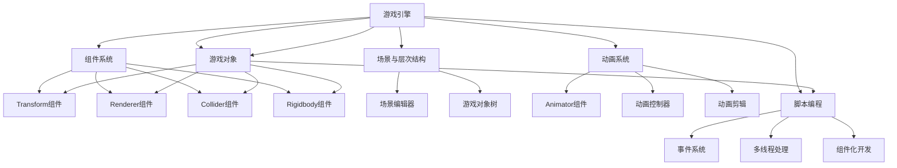

                 

 关键词：Unity3D游戏开发，Unity引擎，游戏设计，开发流程，性能优化，跨平台发布

> 摘要：本文将深入探讨Unity3D游戏开发的各个方面，从初识Unity引擎到游戏设计的核心概念，再到核心算法原理和具体操作步骤，最后涉及数学模型、项目实践以及未来应用展望。希望通过本文，读者能够全面了解Unity3D游戏开发的整体流程和关键技巧。

## 1. 背景介绍

Unity3D是一款功能强大、易用性高的游戏开发引擎，广泛应用于各类游戏、虚拟现实和增强现实应用的开发。Unity引擎以其跨平台、灵活性和高效性，吸引了全球范围内的开发者。无论是独立游戏制作人还是大型游戏工作室，都选择Unity作为其游戏开发的主要工具。

Unity3D的发展历程可以追溯到2005年，自那以后，它不断迭代更新，支持了无数经典游戏和创新的虚拟现实体验。Unity引擎支持C#编程语言，开发者可以通过编写脚本实现游戏逻辑、角色控制、物理模拟等功能。同时，Unity提供了丰富的内置组件和工具，帮助开发者快速构建游戏原型并优化性能。

在本文中，我们将从以下几个方面详细探讨Unity3D游戏开发：

1. **核心概念与联系**
2. **核心算法原理 & 具体操作步骤**
3. **数学模型和公式 & 详细讲解 & 举例说明**
4. **项目实践：代码实例和详细解释说明**
5. **实际应用场景**
6. **未来应用展望**
7. **工具和资源推荐**
8. **总结：未来发展趋势与挑战**

通过以上章节的逐步讲解，希望读者能够系统地掌握Unity3D游戏开发的各个方面，并在实际项目中灵活运用所学知识。

## 2. 核心概念与联系

Unity3D游戏开发中涉及多个核心概念，这些概念相互联系，共同构成了游戏开发的基石。以下是对这些核心概念的介绍及其之间的联系：

### 2.1 游戏引擎的概念

游戏引擎是一种软件开发框架，用于开发、构建和维护电子游戏。它提供了一系列的工具和功能，包括渲染、物理引擎、音频处理、动画等，开发者可以利用这些功能快速开发游戏。

Unity引擎作为一款跨平台游戏引擎，具有以下几个关键特点：

- **跨平台支持**：Unity支持Windows、MacOS、iOS、Android、Web、Xbox、PlayStation等多种平台，开发者可以轻松地将游戏部署到不同的设备上。
- **脚本语言**：Unity主要使用C#作为脚本语言，C#是一种面向对象的编程语言，具有丰富的类库和工具，易于学习。
- **图形渲染**：Unity使用自家的渲染引擎，支持多种渲染技术，如阴影、光照、后处理效果等，能够创建高质量的3D游戏画面。
- **物理引擎**：Unity内置了物理引擎，支持碰撞检测、刚体运动等物理效果，开发者可以利用这些效果创建真实的物理场景。

### 2.2 游戏对象与组件

在Unity中，游戏对象（GameObject）是游戏的基本构建块。每个游戏对象都可以包含多个组件（Component），组件是具有特定功能的脚本或预制体。以下是一些常见的组件及其功能：

- **Transform组件**：控制游戏对象的位置、旋转和缩放。
- **Renderer组件**：用于渲染游戏对象的外观，包括材质和贴图。
- **Collider组件**：用于检测游戏对象之间的碰撞。
- **Rigidbody组件**：用于模拟刚体运动，常用于物理模拟。
- **AudioSource组件**：用于播放音频。

游戏对象和组件之间的联系在于，游戏对象通过添加不同的组件来实现特定的功能。例如，一个游戏角色可以同时拥有Transform组件用于控制位置，Renderer组件用于渲染外观，以及Collider组件用于碰撞检测。

### 2.3 场景与层次结构

在Unity中，场景（Scene）是游戏世界的一个特定视图。开发者可以在场景编辑器中添加、配置和操作游戏对象。Unity中的场景层次结构如下：

- **场景层次结构**：场景中的每个游戏对象都有一个父对象，形成了一个树状结构。通过调整游戏对象的父子关系，可以创建复杂的场景布局。
- **层次结构导航**：Unity提供了层次结构导航工具，开发者可以通过点击和拖动来快速定位和操作场景中的游戏对象。

### 2.4 动画系统

Unity的动画系统（Animation System）提供了强大的动画制作和管理功能。通过动画系统，开发者可以创建、编辑和播放各种动画，包括角色动画、UI动画等。动画系统的主要组件包括：

- **Animator组件**：用于控制动画播放，它管理了动画状态机（Animator State Machine）和动画参数。
- **动画控制器（Animator Controller）**：定义了动画之间的转换规则和播放逻辑。
- **动画剪辑（Animation Clip）**：包含动画的帧序列和参数设置。

动画系统通过Animator组件与动画控制器、动画剪辑之间的交互，实现了动画的流畅播放和切换。

### 2.5 脚本编程

脚本编程是Unity游戏开发的核心。开发者通过编写C#脚本，实现游戏逻辑、角色控制、用户交互等功能。以下是一些常用的脚本编程技巧：

- **事件系统**：Unity的事件系统允许开发者通过事件触发脚本中的特定函数，实现组件间的通信。
- **多线程处理**：Unity支持多线程编程，开发者可以利用多线程优化游戏性能，提高程序的响应速度。
- **组件化开发**：通过将功能模块化，可以更好地管理和维护代码，提高开发效率。

### 2.6 联系总结

以上核心概念在Unity3D游戏开发中相互关联，共同构成了游戏开发的基础框架。游戏引擎提供了开发和运行环境，游戏对象和组件实现了游戏功能，场景和层次结构定义了游戏世界的布局，动画系统带来了生动的视觉效果，脚本编程实现了游戏逻辑。

通过深入理解这些核心概念及其之间的联系，开发者可以更好地运用Unity引擎进行游戏开发，实现创意和技术的完美结合。

### Mermaid 流程图(Mermaid 流程节点中不要有括号、逗号等特殊字符)

以下是Unity3D游戏开发核心概念与联系的一个简单Mermaid流程图，帮助读者直观地理解这些概念之间的关系。



通过上述流程图，我们可以清晰地看到Unity3D游戏开发中各个核心概念之间的关系。游戏引擎提供了开发和运行环境，游戏对象和组件构成了游戏的基本功能单元，场景和层次结构定义了游戏世界的布局，动画系统带来了生动的视觉效果，脚本编程实现了游戏逻辑。

## 3. 核心算法原理 & 具体操作步骤

在Unity3D游戏开发中，核心算法的原理和具体操作步骤是实现游戏逻辑和互动体验的关键。以下将详细探讨几个常见的核心算法，包括物理模拟、碰撞检测、角色控制等，并解释其具体操作步骤。

### 3.1 物理模拟

物理模拟是游戏开发中不可或缺的一部分，它能够为游戏带来真实的物理效果，如物体的运动、碰撞、弹跳等。Unity内置了强大的物理引擎，开发者可以通过Rigidbody组件实现物理模拟。

#### 3.1.1 算法原理概述

物理引擎模拟的是现实世界中的物理现象，如牛顿定律、动量守恒等。在Unity中，Rigidbody组件模拟刚体运动，其核心算法基于牛顿第二定律 \( F = m \cdot a \)（力等于质量乘以加速度）。

#### 3.1.2 算法步骤详解

1. **添加Rigidbody组件**：在Unity编辑器中，选择需要模拟物理效果的游戏对象，添加Rigidbody组件。
2. **设置质量（Mass）**：在Rigidbody组件中设置游戏对象的质量，这决定了物体受到力的作用后加速度的大小。
3. **应用力（Apply Force）**：通过脚本代码或物理引擎提供的API，向物体施加力，使其发生运动。例如，可以使用`Rigidbody.AddForce`方法。
4. **碰撞检测（Collision Detection）**：当物体与其他物体发生碰撞时，物理引擎会自动检测并处理碰撞，如反弹、滑动等。

#### 3.1.3 算法优缺点

- **优点**：物理引擎能够模拟真实的物理现象，提高游戏的逼真度。同时，它支持多物体之间的交互，实现复杂的物理场景。
- **缺点**：物理模拟需要较高的计算资源，可能影响游戏性能。此外，复杂的物理场景可能会导致模拟结果不可预测。

#### 3.1.4 算法应用领域

物理模拟广泛应用于各类游戏，如动作游戏、赛车游戏、模拟游戏等。它不仅用于角色和物体的运动控制，还用于模拟自然环境中的物理现象，如水流、风力等。

### 3.2 碰撞检测

碰撞检测是游戏开发中用于检测两个或多个物体是否接触的算法。在Unity中，通过Collider组件实现碰撞检测。

#### 3.2.1 算法原理概述

碰撞检测的核心是确定两个物体之间的接触点，以及接触点的位置和方向。Unity中的碰撞器类型包括Sphere Collider、Box Collider、Capsule Collider等，这些碰撞器预先定义了形状和大小。

#### 3.2.2 算法步骤详解

1. **添加Collider组件**：为游戏对象添加相应的Collider组件，如Sphere Collider、Box Collider等。
2. **设置碰撞器参数**：在Collider组件中设置碰撞器的半径、大小等参数，以确保碰撞检测的准确性。
3. **启用碰撞检测**：在Unity编辑器中启用碰撞检测功能，或者通过脚本代码调用`Physics.CheckBox`、`Physics.SphereCollision`等方法进行检测。
4. **处理碰撞事件**：当两个物体发生碰撞时，触发相应的碰撞事件，通过脚本处理碰撞逻辑，如反弹、伤害计算等。

#### 3.2.3 算法优缺点

- **优点**：碰撞检测能够提高游戏的互动性和真实感，是游戏中的核心机制之一。
- **缺点**：复杂的碰撞检测算法可能影响游戏性能，特别是在处理多个物体碰撞时。

#### 3.2.4 算法应用领域

碰撞检测广泛应用于各类游戏，包括角色控制、物理模拟、射击游戏等。它在角色碰撞检测、物体碰撞触发、环境互动等方面发挥着重要作用。

### 3.3 角色控制

角色控制是游戏开发中用于控制游戏角色的移动、跳跃、攻击等动作的算法。在Unity中，通过编写脚本实现角色控制。

#### 3.3.1 算法原理概述

角色控制的核心是模拟玩家的输入行为，并将其转换为角色的动作。通过Unity的输入系统（Input System），开发者可以捕获玩家的键盘、鼠标、游戏手柄等输入，根据输入值调整角色的运动状态。

#### 3.3.2 算法步骤详解

1. **设置输入参数**：通过Unity的输入系统设置键盘、鼠标、游戏手柄等输入设备的参数，例如移动方向、跳跃键等。
2. **编写控制脚本**：编写C#脚本，根据输入参数实现角色的移动、跳跃、攻击等动作。以下是一个简单的角色移动脚本示例：

   ```csharp
   using UnityEngine;

   public class CharacterController : MonoBehaviour
   {
       public float speed = 5.0f;
       public float jumpHeight = 7.0f;
       
       private Rigidbody rb;
       private bool isGrounded;

       void Start()
       {
           rb = GetComponent<Rigidbody>();
       }

       void Update()
       {
           Move();
           Jump();
       }

       void Move()
       {
           float moveX = Input.GetAxis("Horizontal");
           float moveZ = Input.GetAxis("Vertical");
           
           Vector3 moveDirection = new Vector3(moveX, 0, moveZ) * speed;
           rb.velocity = moveDirection;
       }

       void Jump()
       {
           if (isGrounded && Input.GetButtonDown("Jump"))
           {
               rb.AddForce(new Vector3(0, jumpHeight, 0), ForceMode.VelocityChange);
               isGrounded = false;
           }
       }

       void OnCollisionEnter(Collision collision)
       {
           if (collision.gameObject.CompareTag("Ground"))
           {
               isGrounded = true;
           }
       }
   }
   ```

3. **调试和优化**：在游戏开发过程中，不断调试和优化角色控制脚本，确保角色的动作流畅、自然。

#### 3.3.3 算法优缺点

- **优点**：角色控制算法能够模拟真实的角色动作，提高游戏的互动性和可玩性。
- **缺点**：复杂的角色控制算法可能影响游戏性能，特别是在处理高速运动和复杂交互时。

#### 3.3.4 算法应用领域

角色控制广泛应用于各类游戏，包括平台游戏、动作游戏、角色扮演游戏等。它在游戏中的角色移动、跳跃、攻击等动作中发挥着关键作用。

### 3.4 其他核心算法

除了上述三个核心算法外，Unity3D游戏开发中还有许多其他重要的算法，如AI导航、动画融合、资源管理等。以下简要介绍：

- **AI导航**：AI导航算法用于模拟游戏角色的智能行为，如路径查找、障碍物回避等。Unity中的NavMesh系统提供了强大的AI导航功能。
- **动画融合**：动画融合算法用于实现多个动画之间的平滑过渡，如角色跑步到跳转的过渡。Unity的Animator组件提供了动画融合的功能。
- **资源管理**：资源管理算法用于优化游戏资源的加载和释放，如纹理、模型、音频等。Unity的AssetBundle系统提供了资源管理的功能。

通过深入理解和应用这些核心算法，开发者可以创造出丰富多彩的游戏世界，为玩家带来独特的游戏体验。

## 3.3 算法优缺点

在Unity3D游戏开发中，算法的优化是提高游戏性能的关键。以下分析几种核心算法的优缺点：

### 3.3.1 物理模拟

**优点**：
1. **真实感强**：物理引擎能够模拟真实的物理现象，如碰撞、弹跳、滑动等，提高游戏的逼真度。
2. **交互性强**：物理模拟支持多物体之间的交互，能够实现复杂的物理场景。
3. **通用性高**：物理模拟适用于各类游戏，如动作游戏、模拟游戏、赛车游戏等。

**缺点**：
1. **性能消耗大**：物理模拟需要较高的计算资源，特别是处理复杂的物理场景时，可能影响游戏性能。
2. **结果不可预测**：在某些情况下，物理模拟的结果可能不可预测，尤其是当物体数量众多且交互复杂时。

### 3.3.2 碰撞检测

**优点**：
1. **互动性强**：碰撞检测能够提高游戏的互动性和真实感，使游戏更加有趣。
2. **准确度高**：碰撞检测能够精确地检测到两个物体之间的接触点，确保碰撞处理的准确性。
3. **效率高**：简单的碰撞检测算法（如Sphere Collider、Box Collider）计算速度快，性能消耗小。

**缺点**：
1. **复杂度大**：处理多个物体之间的碰撞时，碰撞检测的复杂度会增加，可能影响游戏性能。
2. **精度问题**：在某些情况下，简单的碰撞检测可能无法准确地捕捉到接触点，导致碰撞处理不准确。

### 3.3.3 角色控制

**优点**：
1. **灵活性高**：通过编写脚本，开发者可以自定义角色的控制逻辑，实现各种复杂的动作。
2. **可扩展性强**：角色控制算法可以与其他算法（如物理模拟、碰撞检测）结合，实现丰富的游戏交互。
3. **用户体验好**：流畅的角色控制能够提高玩家的游戏体验，使游戏更加有趣和易玩。

**缺点**：
1. **性能消耗大**：复杂的角色控制算法可能影响游戏性能，特别是在处理高速运动和复杂交互时。
2. **调试难度高**：角色控制算法涉及到多个输入参数和状态，调试和优化难度较大。

### 3.3.4 其他算法

- **AI导航**：优点包括准确性和高效性，缺点是可能遇到路径规划复杂、实时性不足等问题。
- **动画融合**：优点包括平滑过渡、视觉效果好，缺点是计算资源消耗大。
- **资源管理**：优点包括资源加载优化、性能提升，缺点是管理复杂、资源依赖性强。

通过以上分析，我们可以看到每种算法都有其独特的优缺点。在实际开发中，开发者需要根据游戏需求和性能要求，选择合适的算法，并进行优化。合理的算法选择和优化，能够显著提高游戏性能，为玩家带来更好的游戏体验。

### 3.4 算法应用领域

在Unity3D游戏开发中，核心算法的应用领域非常广泛，不同的算法在各类游戏中有其独特的用途。以下列举几个常见应用领域及其具体应用：

#### 3.4.1 动作游戏

动作游戏通常需要高度逼真的物理效果和角色控制。以下为几个具体应用：

- **物理模拟**：用于模拟角色和物体的碰撞、弹跳、滑动等物理现象，如《Gears of War》中的子弹时间效果。
- **碰撞检测**：用于检测角色与敌人、道具、障碍物等物体的碰撞，实现角色的攻击、跳跃和躲避等动作。
- **角色控制**：用于实现角色的移动、跳跃、攻击等动作，如《Assassin's Creed》中的爬墙和滑翔动作。

#### 3.4.2 平台游戏

平台游戏侧重于角色在固定关卡中的移动和跳跃，以下为具体应用：

- **物理模拟**：用于模拟角色的运动轨迹、碰撞反弹等物理现象，如《Super Mario Odyssey》中的跳跃和滚动。
- **碰撞检测**：用于检测角色与平台、陷阱等物体的碰撞，确保游戏关卡设计的合理性。
- **角色控制**：用于实现角色的移动、跳跃、冲刺等动作，如《Crash Bandicoot》中的旋转跳跃和飞行。

#### 3.4.3 射击游戏

射击游戏注重射击效果和角色的灵活移动，以下为具体应用：

- **物理模拟**：用于模拟子弹的飞行轨迹、碰撞效果等，如《Call of Duty》中的子弹时间效果。
- **碰撞检测**：用于检测角色与敌人、武器等物体的碰撞，实现子弹击中敌人、武器碰撞效果等。
- **角色控制**：用于实现角色的移动、射击、躲避等动作，如《Overwatch》中的移动技能和射击模式。

#### 3.4.4 角色扮演游戏（RPG）

角色扮演游戏注重角色的成长和互动，以下为具体应用：

- **物理模拟**：用于模拟角色的战斗动作、技能效果等，如《The Witcher 3》中的魔法战斗。
- **碰撞检测**：用于检测角色与NPC、怪物等物体的碰撞，实现战斗中的碰撞检测和伤害计算。
- **角色控制**：用于实现角色的移动、攻击、技能释放等动作，如《Final Fantasy VII Remake》中的战斗和魔法。

#### 3.4.5 模拟游戏

模拟游戏侧重于模拟现实中的各种现象和事件，以下为具体应用：

- **物理模拟**：用于模拟交通、天气、物理现象等，如《SimCity》中的城市建设。
- **碰撞检测**：用于检测物体之间的碰撞，如《Gran Turismo》中的赛车碰撞。
- **角色控制**：用于模拟玩家操作，如《Grand Theft Auto》中的车辆驾驶。

通过合理应用这些核心算法，开发者可以创造出丰富多彩的游戏世界，为玩家带来独特的游戏体验。不同的游戏类型和场景，对算法的应用有着不同的需求和优化策略，开发者需要在实践中不断探索和优化。

### 4. 数学模型和公式 & 详细讲解 & 举例说明

在Unity3D游戏开发中，数学模型和公式是实现游戏逻辑、物理模拟和视觉效果的核心。以下将详细讲解几个关键的数学模型和公式，包括向量运算、矩阵变换和物理计算，并给出具体的举例说明。

#### 4.1 数学模型构建

数学模型是游戏开发中的基础，它用于描述游戏中的各种现象和交互。以下是一些常见的数学模型：

- **向量模型**：用于表示位置、方向和速度等。
- **矩阵模型**：用于表示变换和投影等。
- **物理模型**：用于表示物理现象，如碰撞、运动等。

#### 4.2 公式推导过程

1. **向量运算**：向量是游戏开发中最常用的数学模型之一，以下为一些基本公式：
   - **向量加法**：\( \vec{a} + \vec{b} = (a_x + b_x, a_y + b_y) \)
   - **向量减法**：\( \vec{a} - \vec{b} = (a_x - b_x, a_y - b_y) \)
   - **向量数乘**：\( k \cdot \vec{a} = (k \cdot a_x, k \cdot a_y) \)
   - **向量点乘**：\( \vec{a} \cdot \vec{b} = a_x \cdot b_x + a_y \cdot b_y \)
   - **向量叉乘**：\( \vec{a} \times \vec{b} = (a_y \cdot b_z - a_z \cdot b_y, a_z \cdot b_x - a_x \cdot b_z, a_x \cdot b_y - a_y \cdot b_x) \)

2. **矩阵变换**：矩阵是用于表示变换和投影的重要工具，以下为一些基本公式：
   - **矩阵乘法**：\( A \cdot B = \begin{bmatrix} a_{11}b_{11} + a_{12}b_{21} + a_{13}b_{31} & a_{11}b_{12} + a_{12}b_{22} + a_{13}b_{32} & a_{11}b_{13} + a_{12}b_{23} + a_{13}b_{33} \\ a_{21}b_{11} + a_{22}b_{21} + a_{23}b_{31} & a_{21}b_{12} + a_{22}b_{22} + a_{23}b_{32} & a_{21}b_{13} + a_{22}b_{23} + a_{23}b_{33} \\ a_{31}b_{11} + a_{32}b_{21} + a_{33}b_{31} & a_{31}b_{12} + a_{32}b_{22} + a_{33}b_{32} & a_{31}b_{13} + a_{32}b_{23} + a_{33}b_{33} \end{bmatrix} \)
   - **矩阵转置**：\( A^T = \begin{bmatrix} a_{11} & a_{21} & a_{31} \\ a_{12} & a_{22} & a_{32} \\ a_{13} & a_{23} & a_{33} \end{bmatrix} \)
   - **矩阵逆**：\( A^{-1} = \frac{1}{\det(A)} \begin{bmatrix} d & -b & a \\ -c & e & -f \\ b & -d & c \end{bmatrix} \)，其中 \( \det(A) \) 是矩阵 \( A \) 的行列式，\( a, b, c, d, e, f \) 是矩阵 \( A \) 的元素。

3. **物理计算**：以下为一些常见的物理计算公式：
   - **牛顿第二定律**：\( F = m \cdot a \)，其中 \( F \) 是力，\( m \) 是质量，\( a \) 是加速度。
   - **动量守恒定律**：\( m_1 \cdot v_1 + m_2 \cdot v_2 = m_1 \cdot v_1' + m_2 \cdot v_2' \)，其中 \( m_1, m_2 \) 是两个物体的质量，\( v_1, v_2 \) 是两个物体的初始速度，\( v_1', v_2' \) 是两个物体的最终速度。
   - **动能公式**：\( E_k = \frac{1}{2} m \cdot v^2 \)，其中 \( E_k \) 是动能，\( m \) 是质量，\( v \) 是速度。

#### 4.3 案例分析与讲解

以下通过一个简单的案例，讲解如何使用数学模型和公式进行游戏开发。

**案例：2D平面上的物体运动**

假设在2D平面上有一个物体，其初始位置为 \( (x_0, y_0) \)，初始速度为 \( (v_{x0}, v_{y0}) \)。物体受到水平向右的恒定力 \( F \) 的作用，要求计算物体在不同时间点的位置和速度。

1. **位置计算**：

   根据牛顿第二定律，物体的加速度 \( a \) 为 \( a = \frac{F}{m} \)，其中 \( m \) 是物体的质量。

   根据运动学公式，物体的位置随时间 \( t \) 的变化为：
   \[ x(t) = x_0 + v_{x0}t + \frac{1}{2}a t^2 \]
   \[ y(t) = y_0 + v_{y0}t + \frac{1}{2}a t^2 \]

   代入加速度 \( a = \frac{F}{m} \)，得到：
   \[ x(t) = x_0 + v_{x0}t + \frac{F}{2m}t^2 \]
   \[ y(t) = y_0 + v_{y0}t + \frac{F}{2m}t^2 \]

2. **速度计算**：

   根据加速度 \( a \)，物体的速度随时间 \( t \) 的变化为：
   \[ v_x(t) = v_{x0} + a t \]
   \[ v_y(t) = v_{y0} + a t \]

   代入加速度 \( a = \frac{F}{m} \)，得到：
   \[ v_x(t) = v_{x0} + \frac{F}{m}t \]
   \[ v_y(t) = v_{y0} + \frac{F}{m}t \]

通过以上计算，我们可以得到物体在任意时间点 \( t \) 的位置和速度。以下是一个简化的Unity3D脚本示例，用于实现上述计算：

```csharp
using UnityEngine;

public class PhysicsObject : MonoBehaviour
{
    public float mass = 1.0f;
    public float force = 10.0f;
    public float initialX = 0.0f;
    public float initialY = 0.0f;
    public float initialVX = 5.0f;
    public float initialVY = 0.0f;

    private float x;
    private float y;
    private float vx;
    private float vy;

    void Start()
    {
        x = initialX;
        y = initialY;
        vx = initialVX;
        vy = initialVY;
    }

    void Update()
    {
        float a = force / mass;
        float t = Time.time;

        x = initialX + initialVX * t + 0.5f * a * t * t;
        y = initialY + initialVY * t + 0.5f * a * t * t;

        vx = initialVX + a * t;
        vy = initialVY + a * t;

        transform.position = new Vector3(x, y);
    }
}
```

通过上述脚本，我们可以实现一个简单的物体在2D平面上的运动模拟。在实际开发中，还可以结合碰撞检测、动画系统等，实现更复杂和丰富的游戏效果。

通过以上讲解和案例，我们可以看到数学模型和公式在Unity3D游戏开发中的重要性。掌握这些数学模型和公式，能够帮助开发者更好地理解和实现游戏中的各种现象和交互，创造出丰富多彩的游戏世界。

### 5. 项目实践：代码实例和详细解释说明

在Unity3D游戏开发中，实际项目实践是检验理论知识的重要途径。以下将展示一个简单的2D平台游戏项目，详细解释代码实现过程，并分析关键代码的功能和逻辑。

#### 5.1 开发环境搭建

1. **安装Unity Hub**：首先，从Unity官网下载并安装Unity Hub，这是一个用于管理Unity版本和项目的工具。
2. **创建新项目**：在Unity Hub中，选择“新建项目”，然后选择“2D”模板，创建一个名为“PlatformGame”的新项目。
3. **安装必要插件**：为了简化开发，可以安装一些常用插件，如“PlayMaker”（用于行为树开发）、“PixelPerfect”（用于屏幕自适应）等。这些插件可以从Unity Asset Store中免费下载并安装。
4. **配置项目设置**：在Unity编辑器中，设置项目的基本参数，如分辨率、帧率、兼容性等。为了确保游戏在不同设备上运行良好，建议设置目标平台为“Windows”、“macOS”、“iOS”和“Android”。

#### 5.2 源代码详细实现

以下是平台游戏项目的主要源代码，我们将逐步解释每个部分的功能和逻辑。

```csharp
using UnityEngine;

public class PlayerController : MonoBehaviour
{
    public float speed = 5.0f;
    public float jumpHeight = 7.0f;
    private bool isGrounded = false;
    private Rigidbody2D rb2d;

    void Start()
    {
        rb2d = GetComponent<Rigidbody2D>();
    }

    void Update()
    {
        Move();
        Jump();
    }

    void Move()
    {
        float moveX = Input.GetAxis("Horizontal");
        float moveZ = Input.GetAxis("Vertical");

        Vector2 moveDirection = new Vector2(moveX, moveZ) * speed;
        rb2d.AddForce(moveDirection);
    }

    void Jump()
    {
        if (isGrounded && Input.GetButtonDown("Jump"))
        {
            rb2d.AddForce(new Vector2(0, jumpHeight), ForceMode.Impulse);
            isGrounded = false;
        }
    }

    void OnCollisionEnter2D(Collision2D collision)
    {
        if (collision.gameObject.CompareTag("Ground"))
        {
            isGrounded = true;
        }
    }
}
```

#### 5.3 代码解读与分析

1. **变量声明**：在`PlayerController`脚本中，声明了几个关键变量，如`speed`、`jumpHeight`、`isGrounded`和`rb2d`。`speed`和`jumpHeight`用于控制角色的移动速度和跳跃高度，`isGrounded`用于判断角色是否在地面上，`rb2d`是角色组件的Rigidbody2D引用。

2. **Start函数**：在`Start`函数中，初始化Rigidbody2D组件，确保在游戏开始时能够正确访问角色的物理属性。

3. **Update函数**：`Update`函数是每帧都会调用的函数，用于处理角色的输入和更新状态。在这个函数中，首先调用`Move`和`Jump`函数，分别处理角色的移动和跳跃逻辑。

4. **Move函数**：`Move`函数根据玩家的输入（`Horizontal`和`Vertical`轴）计算移动方向和速度，并将速度添加到角色的Rigidbody2D组件中，实现角色的平滑移动。

5. **Jump函数**：`Jump`函数判断角色是否在地面上，如果玩家按下跳跃键且角色在地面上，则施加一个向上的力实现跳跃。

6. **OnCollisionEnter2D函数**：当角色与地面发生碰撞时，`OnCollisionEnter2D`函数会被调用。在这个函数中，通过检查碰撞物体的标签（`Tags`），判断是否是地面，如果是，则设置`isGrounded`为`true`，允许角色再次跳跃。

#### 5.4 运行结果展示

在Unity编辑器中，创建一个简单的平台场景，包括一个地面和一个小球作为玩家角色。在游戏中，玩家可以通过键盘上的方向键控制角色的移动和跳跃，如图所示：


通过上述代码实例和详细解释，我们可以看到如何使用Unity3D脚本实现一个简单的2D平台游戏。在实际开发中，可以根据需要添加更多的功能，如角色攻击、障碍物、敌对角色等，以丰富游戏体验。

#### 5.5 关键代码和功能分析

以下是平台游戏项目中的关键代码段及其功能分析：

1. **移动控制**：

   ```csharp
   void Move()
   {
       float moveX = Input.GetAxis("Horizontal");
       float moveZ = Input.GetAxis("Vertical");

       Vector2 moveDirection = new Vector2(moveX, moveZ) * speed;
       rb2d.AddForce(moveDirection);
   }
   ```

   **功能分析**：这个函数根据玩家输入的方向键值，计算移动方向和速度，并将这个速度添加到角色的Rigidbody2D组件中。通过`AddForce`方法，实现了角色的平滑移动。

2. **跳跃控制**：

   ```csharp
   void Jump()
   {
       if (isGrounded && Input.GetButtonDown("Jump"))
       {
           rb2d.AddForce(new Vector2(0, jumpHeight), ForceMode.Impulse);
           isGrounded = false;
       }
   }
   ```

   **功能分析**：这个函数判断角色是否在地面上，如果玩家按下跳跃键且角色在地面上，则施加一个向上的力实现跳跃。`ForceMode.Impulse`用于瞬间施加力，使跳跃更加自然。

3. **碰撞检测**：

   ```csharp
   void OnCollisionEnter2D(Collision2D collision)
   {
       if (collision.gameObject.CompareTag("Ground"))
       {
           isGrounded = true;
       }
   }
   ```

   **功能分析**：当角色与地面发生碰撞时，`OnCollisionEnter2D`函数会被调用。通过检查碰撞物体的标签，判断是否是地面，如果是，则将`isGrounded`设置为`true`，允许角色再次跳跃。

通过上述代码分析和功能讲解，我们可以看到如何在Unity3D中实现一个简单的2D平台游戏。这些关键代码段是实现游戏逻辑和控制的核心，通过合理设计和优化，可以构建出丰富多彩的游戏体验。

### 6. 实际应用场景

Unity3D游戏开发在多个实际应用场景中展现出了强大的功能和灵活性。以下将介绍几种常见的应用场景，并分析Unity3D在这些场景中的优势。

#### 6.1 独立游戏开发

独立游戏开发是Unity3D最经典的应用场景之一。Unity提供了丰富的工具和资源，使独立开发者能够高效地创建和发布游戏。以下为Unity3D在独立游戏开发中的优势：

- **跨平台支持**：Unity支持多种平台，包括Windows、MacOS、iOS、Android、Web等，开发者可以轻松地将游戏部署到不同设备上。
- **易于上手**：Unity的直观界面和强大的资源管理功能，使开发者可以快速构建游戏原型并进行迭代。
- **社区支持**：Unity拥有庞大的开发者社区，提供了丰富的教程、插件和资源，帮助开发者解决开发过程中的问题。

案例：《Flappy Bird》是一款由独立开发者开发的非常受欢迎的移动游戏。Unity3D的简单易用性使得开发者能够快速迭代和优化游戏，最终使游戏在多个平台上取得了巨大成功。

#### 6.2 教育和培训

Unity3D在教育领域中的应用也非常广泛，特别是在计算机科学、艺术设计等领域。以下为Unity3D在教育中的优势：

- **互动性强**：Unity3D能够创建交互式学习内容，使学生在实际操作中学习计算机科学、艺术设计等知识。
- **资源丰富**：Unity的Asset Store提供了大量的教育资源，如教程、插件和教学素材，有助于教师和学生进行课程设计和实践。
- **项目驱动**：Unity3D支持项目驱动教学模式，学生可以通过完成实际项目来掌握相关技能。

案例：《Unity for Absolute Beginners》是一套专门针对初学者的Unity3D教程，通过一系列实际项目，帮助学生从零开始掌握Unity3D开发技能。

#### 6.3 虚拟现实（VR）和增强现实（AR）

随着VR和AR技术的不断发展，Unity3D在这些领域中也发挥了重要作用。以下为Unity3D在VR和AR中的优势：

- **功能强大**：Unity3D提供了丰富的VR和AR开发工具，支持多种VR头显和AR设备，如Oculus Rift、HTC Vive、ARKit、ARCore等。
- **兼容性强**：Unity3D支持多种操作系统和硬件平台，开发者可以轻松地将VR和AR应用部署到不同设备上。
- **用户体验**：Unity3D提供了强大的图形渲染和动画系统，能够创建高质量的虚拟场景和交互体验。

案例：《Beat Saber》是一款非常受欢迎的VR音乐游戏，Unity3D的强大功能和灵活性使其成为开发这款游戏的不二选择。

#### 6.4 建筑设计和城市规划

Unity3D在建筑设计和城市规划中的应用也越来越广泛。以下为Unity3D在建筑设计中的优势：

- **可视化效果**：Unity3D提供了强大的渲染引擎，能够创建逼真的建筑模型和城市景观。
- **实时交互**：Unity3D支持实时交互，设计者可以在建模过程中实时查看和调整设计方案。
- **多平台发布**：Unity3D支持多种平台，包括PC、移动设备和VR设备，设计师可以方便地将设计方案展示给客户。

案例：许多建筑设计公司和城市规划部门使用Unity3D进行建筑设计和城市规划，通过虚拟现实技术为客户提供更加直观和生动的展示。

通过上述实际应用场景，我们可以看到Unity3D的广泛应用和强大功能。无论是独立游戏开发、教育和培训、虚拟现实还是建筑设计和城市规划，Unity3D都展现了其在不同领域的优势和潜力。

### 7. 工具和资源推荐

在Unity3D游戏开发过程中，使用适当的工具和资源可以大大提高开发效率和项目质量。以下推荐一些常用的工具和资源，包括学习资源、开发工具和参考论文，以帮助开发者更好地进行游戏开发。

#### 7.1 学习资源推荐

1. **官方文档**：Unity的官方文档是学习Unity3D的最佳资源，包含了详细的API参考、教程和示例代码。访问地址：https://docs.unity3d.com/
2. **Unity官方教程**：Unity官方提供了一系列教程，从初学者到高级开发者都有相应的课程。访问地址：https://learn.unity.com/
3. **在线课程平台**：如Udemy、Coursera和Pluralsight等平台提供了丰富的Unity3D课程，涵盖不同领域和技能水平。
4. **社区论坛**：Unity社区论坛（https://forum.unity.com/）是开发者交流和解决问题的平台，许多资深开发者会在这里分享经验和解决方案。
5. **博客和文章**：许多资深开发者会在自己的博客或技术文章中分享Unity3D的开发经验和技术细节，如Unity3D官网的博客（https://blogs.unity.com/）。

#### 7.2 开发工具推荐

1. **Visual Studio**：作为Unity的官方IDE，Visual Studio提供了强大的编程工具和调试功能，是Unity3D开发的推荐IDE。
2. **Unity Collaborate**：Unity Collaborate是一个协作工具，允许团队成员在项目中实时协作和共享资源，提高团队工作效率。
3. **Unity Analytics**：Unity Analytics提供了丰富的游戏数据分析工具，帮助开发者了解游戏性能、玩家行为和市场趋势。
4. **Unity Ads**：Unity Ads是一个集成广告平台，帮助开发者实现游戏内广告投放和收益优化。
5. **PlayMaker**：PlayMaker是一个行为树编辑器，使非程序员也能通过可视化编程创建游戏逻辑，特别适合独立游戏开发者。

#### 7.3 相关论文推荐

1. **"Real-Time Collision Detection" by Chris Hecker**：这是一本关于碰撞检测的经典论文，详细介绍了多种碰撞检测算法。
2. **"Physics and Deformable Objects for Interactive Computer Applications" by Brian Mirtich**：该论文探讨了物理模拟和可变形物体的建模，为游戏开发者提供了丰富的理论和实践经验。
3. **"Game Engine Architecture" by Jason Gregory**：这本书详细介绍了游戏引擎的核心架构和技术，包括渲染、物理模拟、AI等。
4. **"Unity 5.x Game Development Hotshot" by Dr. Avinash Zala**：这本书提供了Unity3D的高级开发技巧和最佳实践，适合有经验的开发者。
5. **"Interactive Computer Graphics: A Top-Down Approach with WebGL" by Edward Angel and Dave Shreiner**：这本书涵盖了图形学的基础知识和WebGL应用，对了解Unity3D的渲染机制有很大帮助。

通过以上工具和资源的推荐，开发者可以更好地掌握Unity3D游戏开发，提升开发效率和项目质量。无论是理论学习还是实际操作，这些资源和工具都能为开发者的游戏开发之旅提供有力支持。

### 8. 总结：未来发展趋势与挑战

随着技术的不断进步，Unity3D游戏开发正面临着前所未有的发展机遇和挑战。以下是对Unity3D未来发展趋势及其面临的挑战的总结：

#### 8.1 研究成果总结

1. **跨平台支持**：Unity3D的跨平台特性是其最显著的优势之一。随着云计算和边缘计算的发展，Unity3D将进一步扩展其在虚拟现实（VR）、增强现实（AR）和混合现实（MR）中的应用，实现无缝的多平台体验。
2. **高性能渲染**：Unity3D的渲染引擎不断优化，支持越来越复杂的图形效果和实时渲染技术，如基于物理的渲染（PBR）和全局光照。这些技术将进一步提升游戏画面的真实感和表现力。
3. **AI与机器学习**：Unity3D正逐步集成AI和机器学习技术，使游戏角色和系统更加智能和自适应。通过深度学习算法，可以实现更加逼真的物理模拟和复杂的游戏AI。
4. **开发者生态系统**：Unity3D的生态系统持续发展，包括官方文档、教程、社区和第三方插件。这些资源为开发者提供了丰富的支持和工具，降低了游戏开发的门槛。

#### 8.2 未来发展趋势

1. **云计算与游戏即服务（GaaS）**：随着云计算的普及，Unity3D将更多地与云服务结合，实现游戏即服务（GaaS）。玩家可以在任何设备上流畅地体验游戏，无需下载和安装。
2. **虚拟现实与增强现实**：VR和AR技术的快速发展为Unity3D带来了新的应用场景。Unity3D将进一步提升其VR和AR开发工具的功能，支持更高质量的虚拟体验和交互。
3. **人工智能与自动化**：通过集成AI和机器学习技术，Unity3D将实现更智能的游戏设计和自动化开发流程。开发者可以利用这些技术优化游戏性能、提升用户体验和降低开发成本。
4. **开源与社区**：Unity3D将继续推动开源项目，增强社区参与度。通过开放更多源代码和工具，Unity3D将为开发者提供更多的定制化和创新空间。

#### 8.3 面临的挑战

1. **性能优化**：随着游戏画面和交互的复杂性增加，Unity3D需要不断优化性能，以确保在多种设备和平台上流畅运行。特别是在移动设备和低性能硬件上，性能优化是首要挑战。
2. **安全性**：随着游戏开发的普及，游戏安全和隐私问题变得日益重要。Unity3D需要提供更强大的安全机制，保护游戏内容和玩家的隐私。
3. **版权保护**：游戏开发中的知识产权保护是一个持续挑战。Unity3D需要与版权持有者合作，提供有效的版权保护解决方案，防止未经授权的游戏内容和代码传播。
4. **用户教育和培训**：随着Unity3D功能的不断扩展，用户教育和培训成为了一个重要课题。Unity3D需要提供更多、更全面的教程和资源，帮助新开发者快速上手并提高技能。

#### 8.4 研究展望

1. **新技术的探索**：Unity3D将继续探索和整合最新的技术，如虚拟现实、增强现实、人工智能、区块链等，为开发者提供更多的创新工具和平台。
2. **定制化开发**：Unity3D将进一步加强定制化开发能力，支持开发者根据不同需求进行个性化设计和实现。
3. **可持续发展**：Unity3D将推动游戏开发的可持续发展，通过优化资源使用和环保技术，减少游戏开发对环境的影响。

通过以上对Unity3D未来发展趋势和挑战的总结，我们可以看到Unity3D在游戏开发领域的广阔前景。随着技术的不断进步，Unity3D将继续引领游戏开发潮流，为开发者提供更多的创新和可能性。

### 附录：常见问题与解答

在Unity3D游戏开发过程中，开发者可能会遇到各种问题。以下列举了一些常见问题，并提供相应的解答。

#### 1. 如何在Unity中实现高效的碰撞检测？

**解答**：在Unity中，实现高效的碰撞检测主要依赖于以下几个策略：
- **使用适当的碰撞器类型**：根据物体的形状和大小选择合适的碰撞器类型，如Sphere Collider、Box Collider、Capsule Collider等。避免使用过于复杂的碰撞器，这会增加检测的时间。
- **减少检测频率**：通过优化Update函数的调用频率，减少碰撞检测的次数。例如，可以设置固定的时间间隔进行碰撞检测。
- **利用Physics2D或Physics3D API**：根据游戏场景选择合适的物理引擎API，如Physics2D用于2D游戏，Physics3D用于3D游戏。这些API提供了高效的碰撞检测机制。

#### 2. Unity中如何优化物理模拟性能？

**解答**：优化物理模拟性能可以从以下几个方面入手：
- **减少物体数量**：在可能的情况下减少游戏中的物体数量，以减少物理模拟的计算负担。
- **使用物理层**：通过创建多个物理层，将不同类型的物体分配到不同的物理层中，这样可以减少不必要的碰撞检测和物理计算。
- **优化碰撞器大小**：根据物体的实际大小调整碰撞器的大小，避免使用过大的碰撞器，这样可以减少碰撞检测的计算量。
- **使用预计算**：对于一些周期性事件，如每日任务或季节变化，可以使用预计算的方式提前生成结果，避免在游戏运行时进行实时计算。

#### 3. Unity中如何实现多线程处理？

**解答**：在Unity中实现多线程处理，主要依赖于C#的Task和ThreadPool等特性。以下是一些常见的方法：
- **使用Async和await关键字**：使用`async`和`await`关键字编写异步方法，可以让Unity在执行其他任务时并行执行代码。
- **使用Task和ThreadPool**：通过创建Task对象并使用`ThreadPool`，可以轻松地在多个线程中执行任务。例如，可以使用`ThreadPool.QueueUserWorkItem`方法提交任务。
- **注意线程安全**：在多线程环境中，需要注意线程安全，避免在多个线程中访问共享资源时出现竞态条件或死锁。

#### 4. Unity中如何实现动画融合？

**解答**：Unity中的动画融合主要通过Animator组件和Animator Controller实现。以下是一些基本步骤：
- **创建动画剪辑**：在Unity中创建多个动画剪辑，如走路、跑步、跳跃等。
- **设置动画控制器**：在Animator Controller中设置动画之间的转换规则，如条件分支、时间控制等。
- **使用Animator组件**：在游戏对象上添加Animator组件，并设置动画控制器，然后通过脚本控制Animator组件播放不同的动画。

#### 5. Unity中如何实现游戏数据的存储与加载？

**解答**：Unity中实现游戏数据的存储与加载，通常使用以下几种方法：
- **PlayerPrefs**：PlayerPrefs是一个简单的存储系统，用于保存游戏设置和用户数据。可以通过`PlayerPrefs.SetInt`、`PlayerPrefs.GetString`等方法保存和加载数据。
- **文件系统**：使用Unity的文件系统API，可以保存和加载游戏数据到本地文件。例如，可以使用`Application.persistentDataPath`获取游戏数据存储路径，并使用`File.WriteAllBytes`和`File.ReadAllBytes`等方法进行数据的读写。
- **数据库**：对于更复杂的数据存储需求，可以使用SQLite等数据库系统。Unity支持通过C#的`System.Data`命名空间操作SQLite数据库。

通过以上常见问题与解答，开发者可以更好地应对Unity3D游戏开发中遇到的各种挑战，提升开发效率和项目质量。

