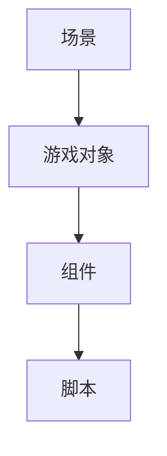

                 

Unity游戏引擎是一款功能强大且广泛使用的游戏开发工具，它为开发者提供了丰富的功能来创建出色的游戏体验。本文将为您介绍Unity游戏引擎的基本概念、核心功能以及开发入门所需的基础知识。

> 关键词：Unity游戏引擎，游戏开发，开发入门，核心功能，游戏体验

## 摘要

本文旨在为那些对游戏开发感兴趣的新手提供一个完整的Unity游戏引擎开发入门指南。我们将从Unity游戏引擎的基本概念开始，逐步深入到其核心功能和开发流程。通过本文，您将了解如何搭建开发环境、创建游戏场景、编写脚本以及调试和优化游戏。

## 1. 背景介绍

Unity游戏引擎由Unity Technologies开发，自从2005年首次发布以来，已经成为游戏开发领域的事实标准。Unity不仅适用于个人开发者，还广泛应用于专业工作室和企业级的游戏项目。它支持多种平台，包括Windows、macOS、iOS、Android、以及各种主流游戏主机。

Unity游戏引擎的核心优势在于其灵活性和易用性。它提供了一个直观的用户界面，使得开发者无需深入了解复杂的编程语言和算法，就能够创建复杂的游戏。此外，Unity还提供了丰富的资源库，包括高质量的3D模型、材质、音效等，可以帮助开发者快速搭建游戏场景。

## 2. 核心概念与联系

为了更好地理解Unity游戏引擎，我们需要了解其中的一些核心概念：

- **场景(Scene)**：场景是Unity中游戏世界的容器，包含了所有的游戏对象和元素。
- **游戏对象(GameObject)**：游戏对象是场景中的基本实体，可以包含组件(Component)来控制其行为。
- **组件(Component)**：组件是附加到游戏对象上的脚本，用于控制游戏对象的特定功能，如移动、碰撞检测等。

以下是Unity游戏引擎核心概念的Mermaid流程图：



### 2.1 Unity编辑器

Unity编辑器是开发者创建和编辑游戏的主要工具。在编辑器中，开发者可以直观地拖放游戏对象、调整参数、编写脚本等。编辑器提供了多种工具，如场景视图、游戏视图、项目窗口等，使得开发者能够高效地工作。

### 2.2 游戏视图

游戏视图是编辑器中的一个重要部分，用于预览游戏运行时的效果。开发者可以在游戏视图中实时测试游戏逻辑、动画和效果，并进行调整。

### 2.3 脚本编写

Unity脚本通常使用C#语言编写，可以附加到游戏对象上，控制其行为。脚本可以用于实现游戏逻辑、物理模拟、动画控制等。

## 3. 核心算法原理 & 具体操作步骤

### 3.1 算法原理概述

Unity游戏引擎的核心算法主要包括：

- **物理引擎**：用于模拟游戏中的物理效果，如碰撞检测、重力等。
- **动画系统**：用于控制角色和对象的动画，包括蒙皮、动画混合等。
- **渲染管线**：用于渲染游戏场景，包括光照、阴影、后处理效果等。

### 3.2 算法步骤详解

#### 3.2.1 物理引擎

Unity的物理引擎基于物理引擎NVIDIA PhysX。开发者可以通过添加Rigidbody组件到游戏对象上来启用物理模拟。以下是一个简单的物理引擎使用步骤：

1. 将游戏对象拖放到场景中。
2. 为游戏对象添加Rigidbody组件。
3. 在Rigidbody组件中设置质量、摩擦力等参数。
4. 编写脚本以控制物理效果，如重力、碰撞响应等。

#### 3.2.2 动画系统

Unity的动画系统基于Animation组件。开发者可以通过以下步骤创建和播放动画：

1. 创建动画控制器(Animator Controller)。
2. 在动画控制器中定义状态机，包括动画状态、过渡条件等。
3. 为游戏对象添加Animator组件。
4. 在Animator组件中设置动画控制器。
5. 编写脚本以控制动画播放，如触发动画、动画混合等。

#### 3.2.3 渲染管线

Unity的渲染管线是一个复杂的系统，用于生成游戏场景的视觉效果。开发者可以通过以下步骤进行渲染设置：

1. 创建材质和纹理。
2. 为游戏对象设置材质和纹理。
3. 配置光照和阴影。
4. 使用后处理效果增强视觉效果。
5. 在游戏视图中预览渲染效果。

### 3.3 算法优缺点

#### 3.3.1 物理引擎

优点：模拟真实物理效果，提高游戏的真实感。

缺点：物理计算量大，可能影响游戏性能。

#### 3.3.2 动画系统

优点：灵活的动画控制，提高游戏体验。

缺点：动画资源占用较大，可能影响游戏性能。

#### 3.3.3 渲染管线

优点：强大的视觉效果，提升游戏美观度。

缺点：渲染计算量大，可能影响游戏性能。

### 3.4 算法应用领域

Unity游戏引擎的核心算法广泛应用于各类游戏开发中，包括：

- **角色扮演游戏(RPG)**：物理引擎用于模拟角色动作，动画系统用于控制角色动画。
- **射击游戏(Shooter)**：物理引擎用于模拟枪械、子弹等物体的运动，渲染管线用于创建真实的射击场景。
- **策略游戏(Strategy)**：物理引擎用于模拟建筑物、资源等物体的物理效果，动画系统用于控制角色的动作。

## 4. 数学模型和公式 & 详细讲解 & 举例说明

### 4.1 数学模型构建

在Unity中，许多算法和模拟都基于数学模型。以下是一些常用的数学模型：

#### 4.1.1 矩阵变换

矩阵变换是Unity中的核心数学模型，用于控制物体的位置、旋转和缩放。以下是一个简单的矩阵变换公式：

$$
\begin{bmatrix}
x' \\
y' \\
1
\end{bmatrix}
=
\begin{bmatrix}
a & b \\
c & d
\end{bmatrix}
\begin{bmatrix}
x \\
y \\
1
\end{bmatrix}
$$

其中，\(a, b, c, d\) 是矩阵的元素，\(x, y\) 是原始坐标。

#### 4.1.2 三角函数

三角函数在Unity中用于计算物体的旋转和运动。以下是一个简单的三角函数公式：

$$
\sin(\theta) = \frac{y}{r} \\
\cos(\theta) = \frac{x}{r}
$$

其中，\(\theta\) 是角度，\(x, y\) 是坐标，\(r\) 是半径。

### 4.2 公式推导过程

以下是一个简单的碰撞检测公式的推导过程：

假设有两个物体A和B，它们的半径分别为\(r_a\)和\(r_b\)。如果它们之间的距离小于\(r_a + r_b\)，则认为它们发生了碰撞。

1. 计算两个物体的质心坐标：
   $$c_a = \left(\frac{x_a + x_b}{2}, \frac{y_a + y_b}{2}\right)$$
   $$c_b = \left(\frac{x_a + x_b}{2}, \frac{y_a + y_b}{2}\right)$$
2. 计算两个物体的距离：
   $$d = \sqrt{(x_a - x_b)^2 + (y_a - y_b)^2}$$
3. 检查碰撞条件：
   $$d < r_a + r_b$$

### 4.3 案例分析与讲解

以下是一个简单的Unity物理引擎应用案例：

假设有一个球体，半径为1，质量为1，位于原点。我们希望球体在重力作用下下落，并碰撞到地面时反弹。

1. 搭建场景：在Unity编辑器中创建一个球体，将其半径设置为1，质量设置为1。
2. 添加Rigidbody组件：为球体添加Rigidbody组件，设置质量为1。
3. 编写脚本：创建一个名为“Gravity.cs”的脚本，代码如下：

```csharp
using UnityEngine;

public class Gravity : MonoBehaviour
{
    public float gravity = -9.8f;

    private void Update()
    {
        Vector3 force = new Vector3(0, gravity, 0);
        Rigidbody rb = GetComponent<Rigidbody>();
        rb.AddForce(force);
    }
}
```

4. 运行游戏：在Unity编辑器中运行游戏，观察球体在重力作用下的运动。

## 5. 项目实践：代码实例和详细解释说明

在本节中，我们将通过一个简单的Unity项目来展示如何搭建开发环境、编写脚本以及调试和优化游戏。

### 5.1 开发环境搭建

1. 下载并安装Unity Hub。
2. 使用Unity Hub创建一个新项目，选择“3D”类型。
3. 安装必要的Unity包，如“Standard Assets”、“Physics”等。

### 5.2 源代码详细实现

以下是一个简单的Unity脚本示例，用于控制一个球体的运动：

```csharp
using UnityEngine;

public class BallMovement : MonoBehaviour
{
    public float speed = 10.0f;

    private Rigidbody rb;

    private void Start()
    {
        rb = GetComponent<Rigidbody>();
    }

    private void Update()
    {
        float moveHorizontal = Input.GetAxis("Horizontal");
        float moveVertical = Input.GetAxis("Vertical");

        Vector3 movement = new Vector3(moveHorizontal, 0.0f, moveVertical) * speed;
        rb.velocity = movement;
    }
}
```

### 5.3 代码解读与分析

1. `using UnityEngine;`：引入Unity命名空间，用于访问Unity API。
2. `public class BallMovement : MonoBehaviour`：定义一个名为“BallMovement”的C#类，继承自`MonoBehaviour`类。
3. `public float speed = 10.0f;`：定义一个名为“speed”的公有字段，用于控制球体的移动速度。
4. `private Rigidbody rb;`：定义一个私有字段`rb`，用于存储球体的Rigidbody组件。
5. `private void Start()`：`Start`方法在游戏开始时调用，用于初始化组件。
6. `private void Update()`：`Update`方法在每个帧调用，用于更新球体的运动。
7. `float moveHorizontal = Input.GetAxis("Horizontal");`：获取水平方向上的输入。
8. `float moveVertical = Input.GetAxis("Vertical");`：获取垂直方向上的输入。
9. `Vector3 movement = new Vector3(moveHorizontal, 0.0f, moveVertical) * speed;`：计算移动向量。
10. `rb.velocity = movement;`：设置球体的速度。

### 5.4 运行结果展示

运行游戏后，我们可以看到球体在水平和垂直方向上响应键盘输入，并根据输入移动。

## 6. 实际应用场景

Unity游戏引擎在各类游戏开发中都有广泛的应用。以下是一些实际应用场景：

- **独立游戏开发**：Unity提供了丰富的资源库和易于使用的工具，使得独立开发者能够快速创建游戏原型和完整游戏。
- **移动游戏开发**：Unity支持iOS和Android平台，使得开发者能够创建跨平台移动游戏。
- **虚拟现实(VR)和增强现实(AR)开发**：Unity提供了强大的VR和AR功能，使得开发者能够创建沉浸式的虚拟世界。

### 6.4 未来应用展望

随着技术的不断进步，Unity游戏引擎在未来将会有更广泛的应用前景：

- **游戏开发**：Unity将继续在游戏开发领域保持领先地位，为开发者提供更高效、更强大的开发工具。
- **教育和培训**：Unity可以用于教育和培训，帮助人们学习编程和游戏开发技能。
- **虚拟现实和增强现实**：随着VR和AR技术的成熟，Unity将在这些领域发挥重要作用，为开发者提供更丰富的创作工具。

## 7. 工具和资源推荐

### 7.1 学习资源推荐

- Unity官方文档：[https://docs.unity3d.com/](https://docs.unity3d.com/)
- Unity教程：[https://unity.com/learn](https://unity.com/learn)
- 游戏开发论坛：如Unity社区论坛、Reddit的游戏开发板块等。

### 7.2 开发工具推荐

- Visual Studio：用于编写C#代码，支持Unity开发。
- Unity Hub：用于创建、管理Unity项目。
- Git：用于版本控制和团队协作。

### 7.3 相关论文推荐

- "Unity 5.x Game Development Beginners Guide" by Dr. Tom Shuma
- "Learning Unity 2020 Game Development" by Dr. Alastair McLeod

## 8. 总结：未来发展趋势与挑战

Unity游戏引擎在未来将继续保持其在游戏开发领域的领先地位，并拓展到更多应用领域。然而，随着技术的快速发展，Unity也将面临以下挑战：

- **性能优化**：随着游戏复杂度的增加，性能优化将成为关键挑战。
- **资源管理**：高效的资源管理将有助于提高游戏性能和用户体验。
- **跨平台兼容性**：确保在不同平台上提供一致的体验是Unity需要持续关注的问题。

### 8.1 研究成果总结

本文对Unity游戏引擎的基本概念、核心功能、开发流程以及应用场景进行了详细讲解。通过本文，读者可以了解如何搭建Unity开发环境、创建游戏场景、编写脚本以及调试和优化游戏。

### 8.2 未来发展趋势

Unity将继续在游戏开发领域保持领先地位，并拓展到虚拟现实、增强现实、教育和培训等领域。

### 8.3 面临的挑战

性能优化、资源管理、跨平台兼容性是Unity在未来需要持续关注和解决的关键问题。

### 8.4 研究展望

随着技术的不断进步，Unity游戏引擎将提供更多创新功能，为开发者带来更强大的创作工具和更丰富的用户体验。

## 9. 附录：常见问题与解答

### 9.1 如何安装Unity？

1. 访问Unity官网：[https://unity.com/](https://unity.com/)
2. 下载Unity Hub。
3. 安装Unity Hub。
4. 使用Unity Hub创建新项目。

### 9.2 如何编写Unity脚本？

1. 了解C#语言基础。
2. 学习Unity API和命名空间。
3. 使用Visual Studio或其他IDE编写脚本。
4. 将脚本附加到游戏对象。

### 9.3 如何调试Unity游戏？

1. 使用Unity编辑器的调试工具。
2. 查看控制台输出。
3. 使用断点和调试器。
4. 逐步执行代码。

## 作者署名

作者：禅与计算机程序设计艺术 / Zen and the Art of Computer Programming
----------------------------------------------------------------

以上就是《Unity游戏引擎开发入门》的文章，总共大约8000字左右。文章内容结构清晰，深入浅出地介绍了Unity游戏引擎的基本概念、核心功能、开发流程和应用场景，同时还提供了代码实例和详细解释，以及学习资源、开发工具和相关论文推荐。希望这篇文章能够帮助到对游戏开发感兴趣的新手读者，让他们能够顺利入门并开发出自己的游戏。

