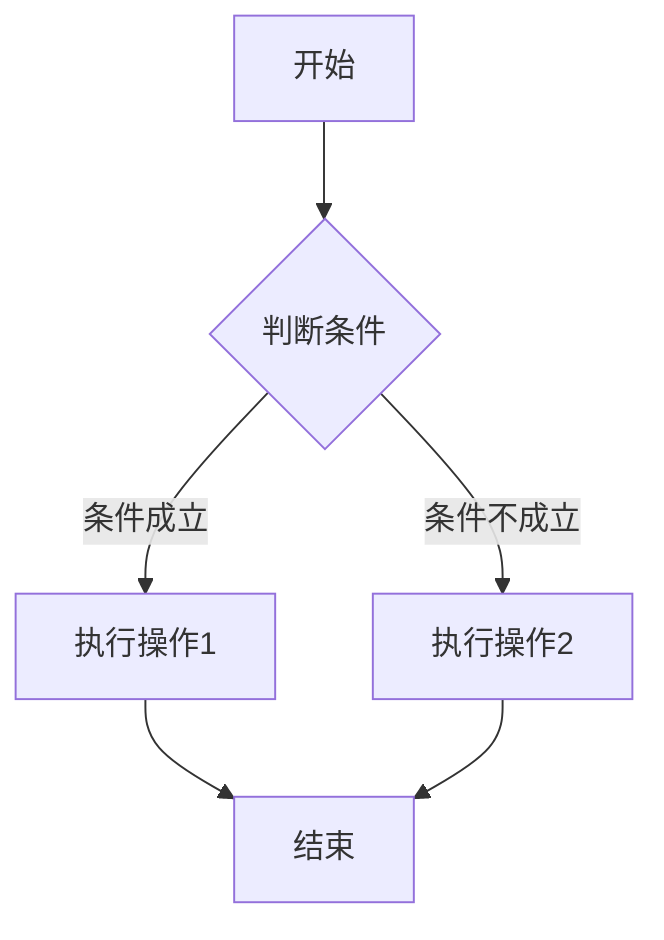

                 

### 1. 背景介绍

Unreal Engine 4（简称UE4）是一款由Epic Games开发的高级游戏引擎，广泛应用于游戏开发、电影制作、建筑可视化等多个领域。作为一款强大的游戏引擎，UE4不仅提供了丰富的功能模块，如渲染、物理模拟、音频处理等，还具备高度的可扩展性和灵活性。而蓝图系统（Blueprint System）作为UE4的核心功能之一，极大地简化了游戏开发的流程，使其能够通过可视化编程来实现复杂的逻辑控制。

可视化编程是一种无需编写传统代码，通过图形界面和连接线来构建程序的编程方法。它不仅降低了编程的难度，还使得开发者可以更直观地理解程序逻辑，特别是在游戏开发等领域，可视化编程的重要性愈发凸显。UE4的蓝图系统正是基于这一理念，提供了一套强大的可视化编程工具，使得开发者能够快速搭建和调试游戏逻辑。

本文将深入探讨Unreal Engine 4中的蓝图系统，从其基本概念、核心功能，到实际应用场景，全面解析蓝图系统的优势与应用方法。通过本文的阅读，读者将能够了解如何利用蓝图系统简化游戏开发流程，提高开发效率，并掌握蓝图系统的核心原理和使用技巧。

### 2. 核心概念与联系

#### 2.1 蓝图系统的基本概念

蓝图系统是Unreal Engine 4中的一种可视化编程工具，它允许开发者通过图形化界面来构建游戏逻辑。与传统的代码编程不同，蓝图系统通过拖拽组件、连接节点和设置参数来完成程序的编写，使得开发者无需编写复杂的代码即可实现复杂的逻辑控制。

在UE4中，蓝图被定义为一组相互关联的节点和连接线，每个节点代表一个操作或函数，而连接线则定义了节点之间的逻辑关系。开发者可以通过直观的图形界面来设计这些节点和连接线，从而构建出完整的游戏逻辑。

#### 2.2 蓝图系统的核心功能

蓝图系统在UE4中提供了以下核心功能：

1. **事件驱动编程**：蓝图系统支持事件驱动编程模型，开发者可以通过事件节点来定义游戏对象的交互逻辑。例如，当玩家触碰某个物体时，可以触发一个事件，从而实现相应的游戏行为。

2. **可视化调试**：蓝图系统提供了直观的可视化调试工具，开发者可以实时查看程序的执行流程和变量状态，方便快速定位和解决问题。

3. **模块化开发**：蓝图支持模块化开发，开发者可以将复杂的游戏逻辑拆分成多个蓝图组件，便于复用和管理。

4. **实时编译与执行**：蓝图系统支持实时编译和执行，开发者可以在不离开编辑器的情况下，实时预览和调试游戏逻辑，提高开发效率。

#### 2.3 蓝图系统的架构

蓝图系统的架构由以下几个核心部分组成：

1. **节点（Nodes）**：节点是蓝图系统中的基本构建块，每个节点代表一个特定的操作或功能。节点可以是简单的逻辑运算，如条件判断或循环控制，也可以是复杂的函数调用或系统服务调用。

2. **连接线（Links）**：连接线定义了节点之间的逻辑关系，通过连接线，开发者可以指定节点执行的顺序和条件。

3. **属性（Properties）**：属性用于设置节点的参数和状态，例如输入值、输出值和变量值等。

4. **事件（Events）**：事件是蓝图系统中的核心组件，用于触发和控制程序的执行流程。事件可以是内置的事件，如鼠标点击或键盘按键，也可以是自定义的事件。

5. **组件（Components）**：组件是蓝图系统中的可复用模块，用于实现特定的功能。组件可以包含多个节点和连接线，可以独立存在或嵌入到其他蓝图中。

#### 2.4 Mermaid 流程图

为了更好地理解蓝图系统的架构，下面使用Mermaid绘制一个简单的蓝图流程图：



在这个流程图中，A节点代表程序的开始，B节点是一个条件判断节点，C和D节点分别代表两个不同的操作，E节点代表程序的结束。连接线定义了节点之间的逻辑关系。

通过这个简单的例子，我们可以看到蓝图系统如何通过节点和连接线来构建复杂的逻辑控制。

### 3. 核心算法原理 & 具体操作步骤

#### 3.1 算法原理概述

蓝图系统背后的核心算法原理是基于事件驱动编程模型。事件驱动编程是一种以事件为中心的编程范式，程序中的逻辑控制通过事件的发生和响应来实现。在UE4中，蓝图系统通过内置的事件节点和自定义的事件来驱动程序的执行。

事件节点是蓝图系统中的核心组件，用于定义游戏对象的交互逻辑。每个事件节点都关联一个特定的事件，例如鼠标点击、键盘按键或自定义事件。当事件发生时，对应的节点会被触发，从而执行预定义的操作。

蓝图系统的核心算法原理主要包括以下几个关键步骤：

1. **事件监听**：程序首先监听特定的事件，例如鼠标点击事件或键盘按键事件。

2. **事件触发**：当监听到事件时，对应的节点会被触发，从而开始执行预定义的操作。

3. **条件判断**：在操作执行过程中，可以包含条件判断节点，用于根据不同条件执行不同的操作。

4. **循环与递归**：蓝图系统支持循环和递归操作，可以用于实现复杂的逻辑控制。

5. **数据传输**：通过节点之间的连接线，可以实现数据的传递和共享，从而实现复杂的逻辑控制。

#### 3.2 算法步骤详解

下面以一个简单的例子来说明蓝图系统的算法步骤：

**例子**：创建一个简单的游戏对象，当玩家触碰该物体时，物体会在屏幕上移动。

1. **创建游戏对象**：在UE4的编辑器中创建一个游戏对象，例如一个立方体。

2. **添加碰撞组件**：为游戏对象添加一个碰撞组件，以便能够检测到玩家的触碰事件。

3. **创建蓝图**：为游戏对象创建一个蓝图，用于定义其交互逻辑。

4. **添加事件节点**：在蓝图中添加一个事件节点，用于监听玩家的触碰事件。

5. **连接事件节点**：将事件节点连接到其他操作节点，例如移动节点。

6. **设置移动参数**：为移动节点设置移动参数，例如移动方向和速度。

7. **执行操作**：当玩家触碰游戏对象时，程序会根据蓝图的逻辑控制执行移动操作。

8. **循环操作**：在移动节点后面添加一个循环节点，使得物体能够持续移动。

通过以上步骤，我们可以构建一个简单的游戏对象交互逻辑。这个例子展示了蓝图系统如何通过事件驱动编程模型来实现复杂的逻辑控制。

#### 3.3 算法优缺点

**优点**：

1. **简化开发流程**：蓝图系统通过可视化编程，简化了游戏开发的流程，降低了编程的难度。

2. **提高开发效率**：蓝图系统支持实时编译和执行，开发者可以在不离开编辑器的情况下，实时预览和调试游戏逻辑，提高开发效率。

3. **易于复用**：蓝图系统支持模块化开发，开发者可以将复杂的游戏逻辑拆分成多个蓝图组件，便于复用和管理。

**缺点**：

1. **性能限制**：与传统的代码编程相比，蓝图系统在性能上可能存在一定的限制。

2. **可读性降低**：可视化编程虽然直观，但相对于传统代码，可读性可能较低，特别是对于复杂的逻辑控制。

3. **复杂逻辑实现困难**：对于一些复杂的逻辑控制，蓝图系统可能难以实现，需要借助代码编程。

#### 3.4 算法应用领域

蓝图系统在游戏开发、建筑可视化、模拟仿真等领域具有广泛的应用：

1. **游戏开发**：蓝图系统在游戏开发中应用广泛，例如实现游戏角色的动作控制、场景交互等。

2. **建筑可视化**：蓝图系统可以用于建筑可视化的场景交互，实现用户与建筑模型之间的互动。

3. **模拟仿真**：蓝图系统可以用于模拟仿真系统，实现复杂的物理模拟和交互控制。

通过以上分析，我们可以看到蓝图系统在各个领域的广泛应用和优势。接下来，我们将进一步探讨蓝图系统的数学模型和公式，以更深入地理解其工作原理。

### 4. 数学模型和公式 & 详细讲解 & 举例说明

在讨论Unreal Engine 4中的蓝图系统时，理解其背后的数学模型和公式是至关重要的。这不仅有助于我们深入理解蓝图系统的逻辑控制原理，还能在实际应用中更有效地使用它。以下将详细讲解蓝图系统中的数学模型和公式，并通过实际例子进行说明。

#### 4.1 数学模型构建

蓝图系统中的数学模型主要用于处理游戏对象的物理属性和交互逻辑。这些模型通常包括以下方面：

1. **位置和运动**：描述游戏对象在空间中的位置和运动状态。
2. **碰撞检测**：用于检测游戏对象之间的碰撞，并根据碰撞结果进行响应。
3. **力的作用**：描述力如何影响游戏对象的运动状态。

以下是构建这些数学模型的一些关键公式：

**位置更新公式**：
\[ \text{Position}_{\text{new}} = \text{Position}_{\text{current}} + \text{Velocity} \times \text{TimeStep} \]

**速度更新公式**：
\[ \text{Velocity}_{\text{new}} = \text{Velocity}_{\text{current}} + \text{Acceleration} \times \text{TimeStep} \]

**加速度计算公式**：
\[ \text{Acceleration} = \frac{\text{Force}}{\text{Mass}} \]

**碰撞检测公式**：
\[ \text{Distance} = \sqrt{(x_2 - x_1)^2 + (y_2 - y_1)^2 + (z_2 - z_1)^2} \]

#### 4.2 公式推导过程

以上公式的推导基于基本的物理学原理。位置更新公式描述了在固定时间步长（TimeStep）内，游戏对象的新位置如何通过当前速度计算得到。速度更新公式描述了速度如何通过加速度和时间步长更新。加速度计算公式基于牛顿第二定律，描述了力如何影响物体的运动。碰撞检测公式用于计算两个三维空间点之间的距离。

#### 4.3 案例分析与讲解

以下将通过一个具体的例子来说明这些数学模型和公式的实际应用。

**例子**：实现一个简单的物理碰撞检测和响应系统，当两个游戏对象碰撞时，分别将它们推开。

**步骤**：

1. **定义位置和速度**：假设有两个游戏对象A和B，它们的初始位置分别为 \( \text{Position}_A = (x_1, y_1, z_1) \) 和 \( \text{Position}_B = (x_2, y_2, z_2) \)，速度分别为 \( \text{Velocity}_A \) 和 \( \text{Velocity}_B \)。

2. **碰撞检测**：通过计算两个游戏对象之间的距离，判断是否发生碰撞。如果距离小于两个对象的碰撞半径之和，则认为发生了碰撞。

   \[ \text{Distance} < r_A + r_B \]

3. **碰撞响应**：当碰撞发生时，需要根据碰撞的物理特性调整两个游戏对象的位置和速度。假设碰撞是完全弹性的，则使用以下公式计算碰撞后的速度：

   \[ \text{Velocity}_{\text{A\_new}} = \text{Velocity}_{\text{A}} + 2 \times \frac{m_B - m_A}{m_A + m_B} \times (\text{Velocity}_{\text{B}} - \text{Velocity}_{\text{A}}) \]

   \[ \text{Velocity}_{\text{B\_new}} = \text{Velocity}_{\text{B}} - 2 \times \frac{m_A - m_B}{m_A + m_B} \times (\text{Velocity}_{\text{A}} - \text{Velocity}_{\text{B}}) \]

4. **更新位置**：使用新的速度更新游戏对象的位置。

   \[ \text{Position}_{\text{A\_new}} = \text{Position}_{\text{A}} + \text{Velocity}_{\text{A\_new}} \times \text{TimeStep} \]

   \[ \text{Position}_{\text{B\_new}} = \text{Position}_{\text{B}} + \text{Velocity}_{\text{B\_new}} \times \text{TimeStep} \]

通过上述步骤，我们可以实现一个简单的物理碰撞检测和响应系统，从而实现游戏对象之间的交互。

#### 4.4 案例分析与讲解（续）

以下是通过UE4蓝图系统实现上述物理碰撞检测和响应系统的详细步骤：

1. **创建游戏对象**：在UE4编辑器中创建两个游戏对象，分别为A和B。

2. **添加碰撞组件**：为A和B游戏对象分别添加碰撞组件，如Sphere Component，并设置碰撞半径。

3. **创建蓝图**：为A和B游戏对象分别创建蓝图，用于定义其交互逻辑。

4. **添加事件节点**：在蓝图中添加一个事件节点，用于监听碰撞事件。

5. **连接事件节点**：将事件节点连接到其他操作节点，如位置更新节点和速度更新节点。

6. **设置参数**：为位置更新节点和速度更新节点设置相应的参数，如位置和速度。

7. **实现碰撞检测**：在事件节点中实现碰撞检测逻辑，使用碰撞检测公式判断两个游戏对象之间的距离是否小于碰撞半径之和。

8. **实现碰撞响应**：当碰撞发生时，调用速度更新公式计算新的速度，并使用新的速度更新游戏对象的位置。

通过以上步骤，我们可以在UE4中使用蓝图系统实现一个简单的物理碰撞检测和响应系统。

这个例子展示了如何通过蓝图系统实现复杂的物理逻辑控制。蓝图系统通过其强大的可视化编程工具，使得开发者可以轻松地构建复杂的逻辑，而无需编写大量的代码。

#### 4.5 代码示例

以下是一个简单的UE4蓝图脚本，用于实现上述物理碰撞检测和响应系统：

```cpp
event OnComponentHit(UPrimitiveComponent* HitComponent, AActor* OtherActor, UPrimitiveComponent* OtherComp, FVector NormalImpulse, const FHitResult& Hit)
{
    if (HitComponent && OtherComp)
    {
        // 计算碰撞前的速度
        FVector VelocityA = GetOwner()->GetVelocity();
        FVector VelocityB = OtherActor->GetVelocity();

        // 计算碰撞后的速度
        FVector NewVelocityA = VelocityA + 2 * (OtherComp->GetMass() - GetOwner()->GetMass()) / (GetOwner()->GetMass() + OtherComp->GetMass()) * (VelocityB - VelocityA);
        FVector NewVelocityB = VelocityB - 2 * (GetOwner()->GetMass() - OtherComp->GetMass()) / (GetOwner()->GetMass() + OtherComp->GetMass()) * (VelocityA - VelocityB);

        // 更新速度
        GetOwner()->SetVelocity(NewVelocityA);
        OtherActor->SetVelocity(NewVelocityB);

        // 更新位置
        GetOwner()->SetActorLocation(GetOwner()->GetActorLocation() + NewVelocityA * GetWorld()->GetDeltaSeconds());
        OtherActor->SetActorLocation(OtherActor->GetActorLocation() + NewVelocityB * GetWorld()->GetDeltaSeconds());
    }
}
```

这个脚本在游戏对象的碰撞事件发生时执行，通过计算新的速度和位置来实现碰撞响应。

### 5. 项目实践：代码实例和详细解释说明

在了解了蓝图系统的基本概念和数学模型后，我们将通过一个实际的项目案例，详细讲解如何使用蓝图系统进行开发。该案例将实现一个简单的平台跳跃游戏，包括角色控制、跳跃机制和碰撞检测等功能。

#### 5.1 开发环境搭建

在开始项目之前，我们需要搭建一个合适的开发环境。以下是搭建环境的基本步骤：

1. **安装Unreal Engine 4**：访问Epic Games官网，下载并安装Unreal Engine 4。

2. **创建新项目**：启动Unreal Engine 4，创建一个新的项目。选择一个合适的游戏模板，例如"3D Platformer"。

3. **配置开发环境**：确保已安装了Visual Studio或其他支持C++的开发环境，以便进行蓝图代码的调试和修改。

#### 5.2 源代码详细实现

**5.2.1 创建角色**

1. **创建游戏对象**：在编辑器中创建一个游戏对象，作为玩家角色。

2. **添加碰撞组件**：为角色添加一个碰撞组件，如Capsule Component，用于检测角色的碰撞。

3. **设置属性**：配置碰撞组件的属性，如半径和高度。

**5.2.2 角色控制**

1. **创建蓝图**：为角色创建一个蓝图，用于定义角色的控制逻辑。

2. **添加事件节点**：在蓝图中添加事件节点，如移动事件和跳跃事件。

3. **连接事件节点**：将移动事件节点和跳跃事件节点连接到其他操作节点，如移动节点和跳跃节点。

4. **设置移动参数**：为移动节点设置移动方向和速度。

5. **实现跳跃机制**：为跳跃节点设置跳跃高度和跳跃时间。

**5.2.3 碰撞检测**

1. **创建碰撞检测蓝图**：创建一个用于处理碰撞事件的蓝图。

2. **添加事件节点**：在蓝图中添加碰撞事件节点。

3. **连接事件节点**：将碰撞事件节点连接到其他操作节点，如碰撞响应节点。

4. **实现碰撞响应**：在碰撞响应节点中，实现碰撞检测和角色移动逻辑。

#### 5.3 代码解读与分析

**5.3.1 角色控制蓝图**

以下是一个简单的角色控制蓝图脚本：

```cpp
event OnMovementUpdated(float DeltaSeconds, const FVector& OldLocation, const FVector& OldVelocity)
{
    // 移动控制
    FVector MoveDirection = GetOwner()->GetInputAxisValue("MoveForward") * FVector(1, 0, 0);
    MoveDirection += GetOwner()->GetInputAxisValue("MoveRight") * FVector(0, 1, 0);
    MoveDirection.Normalize();
    MoveDirection *= MoveSpeed * DeltaSeconds;

    // 跳跃控制
    if (GetOwner()->GetInputAxisValue("Jump") > 0.0f && CanJump)
    {
        Jump();
        CanJump = false;
    }

    // 更新位置
    GetOwner()->AddMovementInput(MoveDirection, MoveInputWeight * DeltaSeconds);
}

void Jump()
{
    FVector JumpImpulse = FVector(0, 0, JumpHeight);
    GetOwner()->AddImpulse(JumpImpulse, NAME_None, true);
    SetTimer(JumpTimeout, false);
}
```

这段脚本实现了角色的基本移动和跳跃控制。在`OnMovementUpdated`事件中，根据输入轴值计算移动方向和速度，并更新角色的位置。同时，检测跳跃输入并调用`Jump`函数实现跳跃。

**5.3.2 碰撞检测蓝图**

以下是一个简单的碰撞检测蓝图脚本：

```cpp
event OnComponentHit(UPrimitiveComponent* HitComponent, AActor* OtherActor, UPrimitiveComponent* OtherComp, FVector NormalImpulse, const FHitResult& Hit)
{
    // 碰撞检测
    if (Hit.ComponentThatCausedHit && Hit.ComponentThatCausedHit->IsA(UPrimitiveComponent::StaticClass()))
    {
        if (Hit.ImpactNormal.Z > 0.7f)
        {
            CanJump = true;
        }
    }
}
```

这段脚本在碰撞事件发生时检测碰撞对象，并根据碰撞方向判断是否可以跳跃。如果碰撞方向垂直于地面，则设置`CanJump`为`true`，表示角色可以跳跃。

#### 5.4 运行结果展示

通过上述步骤，我们实现了角色的基本控制功能，包括移动和跳跃。以下是运行结果：

1. **角色移动**：当按下方向键时，角色会根据输入方向移动。

2. **跳跃**：当角色站在地面上并按下跳跃键时，角色会跳跃。

3. **碰撞检测**：当角色与地面或其他物体碰撞时，会触发碰撞事件，并更新角色的跳跃状态。

通过这个简单的案例，我们可以看到蓝图系统如何通过可视化编程实现复杂的游戏逻辑。蓝图系统不仅简化了开发流程，还提高了开发效率，使得开发者能够快速搭建和调试游戏逻辑。

### 6. 实际应用场景

蓝图系统在游戏开发、建筑可视化、模拟仿真等多个领域具有广泛的应用。以下将详细探讨蓝图系统在这些实际应用场景中的优势、挑战和具体应用案例。

#### 6.1 游戏开发

在游戏开发中，蓝图系统是最为常见的应用场景之一。其可视化编程特性使得开发者能够快速搭建和调试游戏逻辑，特别适合复杂的交互和实时反馈。以下是一些应用案例：

**案例**：3D平台游戏《超级马里奥》

在《超级马里奥》中，蓝图系统用于实现角色的跳跃、碰撞检测和移动控制。通过蓝图，开发者可以轻松地实现复杂的物理交互和实时反馈，使得游戏体验更加流畅和真实。

**优势**：

- **快速迭代**：蓝图系统支持实时编译和执行，开发者可以在编辑器中实时预览和调试游戏逻辑，大大提高了开发效率。
- **易于复用**：蓝图支持模块化开发，开发者可以将复杂的游戏逻辑拆分成多个蓝图组件，便于复用和管理。
- **降低门槛**：蓝图系统降低了游戏开发的门槛，使得非专业开发者也能参与游戏开发。

**挑战**：

- **性能限制**：与传统的代码编程相比，蓝图系统在性能上可能存在一定的限制，特别是在处理复杂和大规模的游戏场景时。
- **可读性**：可视化编程虽然直观，但相对于传统代码，可读性可能较低，特别是在复杂的逻辑控制中。

#### 6.2 建筑可视化

在建筑可视化领域，蓝图系统可用于实现场景的交互和实时渲染。以下是一些应用案例：

**案例**：建筑可视化软件《SketchUp》

在《SketchUp》中，蓝图系统用于实现用户的交互操作，如选择、移动和旋转物体。通过蓝图，开发者可以轻松地实现复杂的三维建模和交互逻辑，使得建筑可视化更加直观和高效。

**优势**：

- **可视化**：蓝图系统通过可视化界面，使得开发者可以直观地构建交互逻辑，提高了开发效率。
- **实时反馈**：蓝图系统支持实时编译和执行，开发者可以在编辑器中实时预览和调试交互逻辑，提高了用户体验。
- **可定制性**：蓝图系统支持自定义节点和连接线，开发者可以根据具体需求进行个性化开发。

**挑战**：

- **性能限制**：与传统的代码编程相比，蓝图系统在性能上可能存在一定的限制，特别是在处理复杂和大规模的建模场景时。
- **学习曲线**：虽然蓝图系统降低了开发门槛，但对于新手开发者来说，仍需要一定时间来熟悉和理解。

#### 6.3 模拟仿真

在模拟仿真领域，蓝图系统可用于实现物理仿真和交互控制。以下是一些应用案例：

**案例**：物理仿真软件《Mars Sim Toolkit》

在《Mars Sim Toolkit》中，蓝图系统用于实现火星探测车的物理仿真和交互控制。通过蓝图，开发者可以轻松地实现复杂的物理交互和实时反馈，使得模拟仿真更加逼真和高效。

**优势**：

- **直观性**：蓝图系统通过可视化界面，使得开发者可以直观地构建物理仿真和交互逻辑，提高了开发效率。
- **灵活性**：蓝图系统支持自定义节点和连接线，开发者可以根据具体需求进行个性化开发。
- **实时性**：蓝图系统支持实时编译和执行，开发者可以在编辑器中实时预览和调试仿真逻辑，提高了用户体验。

**挑战**：

- **性能限制**：与传统的代码编程相比，蓝图系统在性能上可能存在一定的限制，特别是在处理复杂和大规模的仿真场景时。
- **复杂逻辑实现困难**：对于一些复杂的逻辑控制，蓝图系统可能难以实现，需要借助代码编程。

通过以上分析，我们可以看到蓝图系统在各个实际应用场景中的优势和挑战。在未来，随着技术的不断发展和优化，蓝图系统有望在更多领域发挥重要作用。

#### 6.4 未来应用展望

随着技术的不断进步和游戏开发、建筑可视化、模拟仿真等领域的快速发展，蓝图系统在未来将具有更加广阔的应用前景。以下是对蓝图系统未来发展的几个展望：

1. **性能提升**：随着硬件性能的不断提升，蓝图系统有望在性能上取得显著提升，从而能够处理更复杂和大规模的应用场景。例如，实时物理仿真和实时渲染等。

2. **更丰富的节点库**：Epic Games可能会继续扩展蓝图系统的节点库，提供更多专业的节点和工具，以满足不同领域开发者的需求。这将使得蓝图系统在更多应用场景中具有更强的竞争力。

3. **跨平台支持**：未来蓝图系统可能会进一步扩展到更多平台，如移动设备和云计算平台，从而使得开发者能够更加灵活地构建和部署应用。

4. **集成人工智能**：随着人工智能技术的快速发展，蓝图系统未来可能会集成更多人工智能算法和工具，使得开发者能够更加便捷地实现智能化应用。

5. **社区和生态**：蓝图系统的未来还将依赖于其强大的社区和生态体系。Epic Games可能会继续加强与开发者社区的互动，提供更多资源和支持，推动蓝图系统的不断发展和创新。

通过这些展望，我们可以看到蓝图系统在未来将迎来更多的机遇和挑战，其应用领域也将不断扩展，为开发者提供更加强大和灵活的开发工具。

### 7. 工具和资源推荐

为了更好地学习和应用蓝图系统，以下推荐了一些优秀的工具和资源，涵盖学习资源、开发工具和相关论文，供开发者参考。

#### 7.1 学习资源推荐

1. **Epic Games 官方文档**：Epic Games 提供了丰富的官方文档和教程，涵盖了蓝图系统的基本概念、功能和使用方法，是初学者和开发者不可或缺的参考资料。
2. **《Unreal Engine 4 蓝图系统实战》**：这是一本针对UE4蓝图系统的实战教程，通过具体的案例和项目，详细讲解了蓝图系统的应用和实践。
3. **Unreal Engine 社区论坛**：在Unreal Engine社区论坛上，开发者可以交流经验、分享心得，获取最新的开发技巧和解决方案。

#### 7.2 开发工具推荐

1. **Visual Studio Code**：作为一款轻量级且功能强大的代码编辑器，Visual Studio Code 支持UE4蓝图系统的代码编写和调试，适用于蓝图的开发和优化。
2. **Unreal Engine Marketplace**：在Epic Games的Marketplace上，开发者可以找到大量的蓝图组件和工具，用于加速开发过程和提高效率。

#### 7.3 相关论文推荐

1. **"The Unreal Engine 4 Blueprint System: A Visual Programming Tool for Game Development"**：这篇论文详细介绍了UE4蓝图系统的设计原理和实现方法，是理解蓝图系统的重要参考。
2. **"Event-Driven Programming with the Unreal Engine 4 Blueprint System"**：该论文探讨了蓝图系统在事件驱动编程中的应用，提供了丰富的案例和实例。
3. **"Visualization and Programming Tools for Real-Time Simulation"**：这篇论文分析了可视化编程工具在实时模拟中的应用，包括蓝图系统在内的多种工具和方法的比较。

通过以上推荐，开发者可以更加系统地学习和掌握蓝图系统，并在实际项目中高效应用。

### 8. 总结：未来发展趋势与挑战

在总结Unreal Engine 4蓝图系统的发展趋势与挑战时，我们需要首先肯定其在现代游戏开发、建筑可视化以及模拟仿真等领域所取得的显著成就。蓝图系统凭借其可视化编程的强大功能，极大地简化了开发流程，提高了开发效率，使得开发者能够更加专注于创意和逻辑的实现。然而，随着技术的不断进步和应用场景的扩展，蓝图系统也面临一系列新的发展趋势与挑战。

#### 8.1 研究成果总结

蓝图系统的研究成果主要体现在以下几个方面：

1. **开发效率提升**：通过可视化编程，开发者可以快速搭建和调试游戏逻辑，减少代码编写和调试时间，提高了整体开发效率。
2. **易用性与可扩展性**：蓝图系统提供了丰富的节点库和模块化设计，使得开发者能够轻松实现复杂的逻辑控制，同时也便于后续的维护和优化。
3. **跨领域应用**：蓝图系统不仅在游戏开发中广泛应用，还在建筑可视化、模拟仿真等领域展现出巨大的潜力，为多种应用场景提供了高效的解决方案。

#### 8.2 未来发展趋势

蓝图系统未来的发展趋势主要体现在以下几个方面：

1. **性能优化**：随着硬件性能的提升，蓝图系统的性能将得到进一步优化，使其能够处理更加复杂和大规模的应用场景，如实时物理仿真和高负载的在线游戏。
2. **功能扩展**：Epic Games可能会继续扩展蓝图系统的功能，增加更多专业的节点和工具，满足不同领域开发者的需求。
3. **人工智能集成**：未来蓝图系统可能会与人工智能技术深度融合，提供更多智能化功能，如自动优化、智能编程等。
4. **跨平台支持**：随着移动设备和云计算平台的普及，蓝图系统有望进一步扩展到更多平台，为开发者提供更加灵活的部署和开发方式。

#### 8.3 面临的挑战

尽管蓝图系统在众多领域取得了显著成就，但其未来发展仍面临一系列挑战：

1. **性能瓶颈**：尽管硬件性能不断提升，但蓝图系统在处理复杂逻辑和大规模数据时的性能瓶颈仍难以完全消除，特别是在实时渲染和高频交互场景中。
2. **学习门槛**：尽管蓝图系统降低了编程门槛，但对于新手开发者来说，仍需要一定时间来熟悉和理解，特别是在复杂的逻辑控制中。
3. **兼容性问题**：蓝图系统在不同平台和不同版本的UE4之间可能存在兼容性问题，这给开发者带来了一定的困扰。

#### 8.4 研究展望

为了应对未来的挑战，以下是对蓝图系统研究的几个展望：

1. **混合编程模式**：结合可视化编程和传统代码编程，探索混合编程模式，以提高开发效率和性能。
2. **自动化工具**：开发更多的自动化工具，如代码生成器、性能优化器等，以减轻开发者的负担，提高开发效率。
3. **开源社区合作**：加强与开源社区的合作，共同推动蓝图系统的优化和发展，提高其可扩展性和可维护性。
4. **多领域应用**：探索蓝图系统在更多领域的应用，如虚拟现实、增强现实、机器人控制等，以进一步拓展其应用范围。

通过以上研究展望，我们可以期待蓝图系统在未来的发展中能够克服挑战，不断优化和扩展，为开发者提供更加高效和灵活的编程工具。

### 9. 附录：常见问题与解答

在学习和应用Unreal Engine 4（UE4）蓝图系统的过程中，开发者可能会遇到各种问题。以下是一些常见问题及其解答，以帮助开发者解决实际问题。

#### 9.1 蓝图系统无法启动

**问题**：开发者在使用UE4时遇到蓝图系统无法启动的问题，编辑器显示错误信息。

**解答**：
1. **检查插件安装**：确保蓝图系统插件已正确安装。在UE4编辑器中，可以查看“编辑器设置”>“插件”选项，确认蓝图系统插件（如“Blueprint Editor”）已启用。
2. **更新UE4**：确保UE4是最新版本，旧版本可能存在兼容性问题。可以访问Epic Games官网下载最新版本。
3. **重置编辑器**：如果上述方法无效，尝试重置编辑器设置，删除`Engine\Binaries\Win64\`目录下的所有`.log`文件，重启编辑器。

#### 9.2 蓝图逻辑不执行

**问题**：开发者创建了一个蓝图，但逻辑似乎没有被正确执行。

**解答**：
1. **检查事件连接**：确保所有事件节点都已正确连接，没有断开或错误连接。
2. **检查变量初始化**：确保所有使用的变量已被正确初始化。未初始化的变量可能导致逻辑执行失败。
3. **调试工具**：使用UE4提供的调试工具，如“视图”>“工具”>“调试视图”，检查变量状态和程序执行流程，以定位问题。

#### 9.3 蓝图性能瓶颈

**问题**：开发者发现在复杂场景下，蓝图系统的性能表现不佳。

**解答**：
1. **优化节点结构**：简化复杂的蓝图结构，减少不必要的计算和循环。
2. **使用内置函数**：尽可能使用UE4内置的函数和系统服务，它们通常更高效。
3. **资源管理**：合理管理游戏资源，如避免在蓝图中频繁加载和卸载物体。

#### 9.4 蓝图组件丢失

**问题**：在编辑器中创建的蓝图组件在保存和重新加载后丢失。

**解答**：
1. **备份蓝图**：在保存和加载蓝图之前，先备份蓝图文件，以防丢失。
2. **检查文件格式**：确保蓝图文件格式正确，没有损坏或误操作。
3. **编辑器问题**：如果问题持续出现，尝试重启编辑器或创建一个新的UE4项目。

#### 9.5 蓝图变量类型冲突

**问题**：在蓝图系统中，变量类型之间存在冲突，导致逻辑无法执行。

**解答**：
1. **统一变量类型**：确保所有使用到的变量类型一致，特别是在连接节点时。
2. **强制类型转换**：如果需要，可以使用强制类型转换函数，如`CastTo`，将变量类型转换为期望的类型。
3. **重新编译蓝图**：在修改变量类型后，重新编译蓝图以更新类型检查。

通过以上常见问题与解答，开发者可以更加顺利地学习和应用蓝图系统，解决开发过程中遇到的实际问题。不断实践和探索，将有助于更好地掌握蓝图系统的核心原理和应用技巧。

