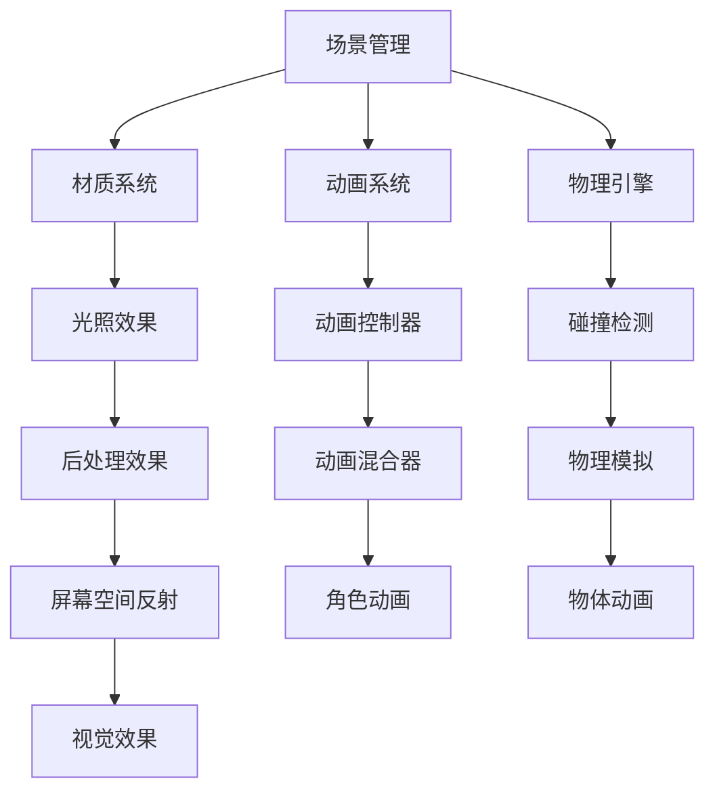

                 

关键词：Unreal Engine 4，游戏开发，电影级渲染，虚拟现实，编程技巧，性能优化，开源资源

> 摘要：本文将深入探讨Unreal Engine 4在游戏开发中的应用，从核心概念、算法原理到实际项目实践，全面解析如何利用UE4打造电影级游戏。读者将了解如何运用UE4的高级功能，实现高效的游戏开发，并探索其在未来游戏开发领域的广阔前景。

## 1. 背景介绍

### Unreal Engine 4的发展历程

Unreal Engine 4（简称UE4）是由Epic Games开发的一款高性能游戏引擎。自2014年发布以来，UE4以其卓越的图形渲染能力、强大的可扩展性和灵活的开发工具，成为了游戏开发者的首选。它不仅广泛应用于游戏开发，还扩展到了电影制作、建筑可视化、虚拟现实等多个领域。

### UE4在游戏开发中的优势

UE4拥有众多令人瞩目的特性，使其在游戏开发领域脱颖而出：

1. **先进的图形渲染技术**：UE4采用了光线追踪、全局照明、屏幕空间反射等技术，能够实现接近电影级的画面效果。
2. **丰富的功能模块**：包括物理模拟、动画系统、AI系统、音频处理等，为开发者提供了全方位的支持。
3. **高效的开发工具**：Blueprint可视化编程、Material编辑器、Level Editor等工具，大大提高了开发效率。
4. **开源与社区支持**：UE4的部分源代码开源，且拥有庞大的开发者社区，为开发者提供了丰富的学习资源和实践经验。

## 2. 核心概念与联系

### 核心概念原理

UE4的核心概念主要包括：

- **场景管理**：用于管理和组织场景中的所有对象和资源。
- **材质系统**：定义游戏世界中的各种材质和纹理。
- **动画系统**：用于实现角色和物体的动画效果。
- **物理引擎**：处理游戏中的物理交互和碰撞检测。

### 架构的 Mermaid 流程图



## 3. 核心算法原理 & 具体操作步骤

### 3.1 算法原理概述

UE4中的核心算法主要包括：

- **光线追踪**：通过模拟光线传播和反射过程，实现真实感的光照效果。
- **全局照明**：计算场景中所有物体对光线的影响，实现更自然的阴影和反射。
- **屏幕空间反射**：在屏幕空间内模拟反射效果，提高渲染效率。
- **物理模拟**：处理游戏中的物体碰撞、运动等物理现象。

### 3.2 算法步骤详解

- **光线追踪**：首先确定光线的发射点，然后模拟光线在场景中的传播和反射过程，直到达到屏幕上的像素点。
- **全局照明**：计算场景中所有物体对光线的影响，包括直接光照和间接光照。对于每个像素点，计算其接收到的光线强度。
- **屏幕空间反射**：在屏幕空间内计算每个像素点的反射方向，然后在场景中查找反射物体，计算反射效果。
- **物理模拟**：根据物体的物理属性，计算其受到的力、加速度和运动状态。

### 3.3 算法优缺点

- **光线追踪**：能实现真实感的光照效果，但计算复杂度高，渲染时间长。
- **全局照明**：能提高场景的光照质量，但计算量大，对硬件性能要求高。
- **屏幕空间反射**：渲染效率高，但效果有限，无法模拟真实的反射现象。
- **物理模拟**：能实现真实的物理现象，但计算复杂度较高，需要合理优化。

### 3.4 算法应用领域

- **游戏开发**：用于实现高品质的游戏画面和逼真的物理效果。
- **电影制作**：用于渲染高质量的动画场景，提高视觉效果。
- **建筑可视化**：用于模拟建筑物的光照和物理现象，提高设计质量。

## 4. 数学模型和公式 & 详细讲解 & 举例说明

### 4.1 数学模型构建

在UE4中，常用的数学模型包括：

- **向量**：用于表示方向和位置。
- **矩阵**：用于变换和旋转。
- **三角函数**：用于计算角度和距离。
- **光照模型**：用于计算场景中的光照效果。

### 4.2 公式推导过程

以光线追踪为例，其基本公式如下：

$$
P_{\text{next}} = P_{\text{current}} + t \cdot \vec{d}
$$

其中，$P_{\text{next}}$ 和 $P_{\text{current}}$ 分别为下一次和当前的光线位置，$t$ 为光线传播的时间，$\vec{d}$ 为光线的传播方向。

### 4.3 案例分析与讲解

假设场景中有一个点光源，我们需要计算其在一个平面上产生的光照效果。首先，计算光线与平面的交点，然后根据交点位置计算光照强度。具体步骤如下：

1. 计算光线与平面的交点：
   $$
   t = \frac{P_{\text{light}} - P_{\text{plane}}}{\vec{d}}
   $$

2. 计算光照强度：
   $$
   I = \frac{N \cdot \vec{l}}{d}
   $$

其中，$P_{\text{light}}$ 和 $P_{\text{plane}}$ 分别为光源和平面的位置，$\vec{d}$ 为光线的传播方向，$N$ 为平面的法向量，$\vec{l}$ 为光线方向，$d$ 为光线与平面的距离。

## 5. 项目实践：代码实例和详细解释说明

### 5.1 开发环境搭建

在开始项目之前，我们需要搭建开发环境。首先，下载并安装Unreal Engine 4，然后配置C++开发环境，包括Visual Studio和UE4插件。

### 5.2 源代码详细实现

以下是实现光线追踪的基本源代码：

```cpp
// 光线追踪类
class RayTracer {
public:
    FVector Trace(const FVector& origin, const FVector& direction) {
        // 计算光线传播的时间
        float t = (P_light - P_plane) / direction;
        
        // 计算光线与平面的交点
        FVector P_next = origin + t * direction;
        
        // 计算光照强度
        FVector N = FVector(0, 1, 0); // 平面法向量
        FVector l = (P_light - P_next).GetNormal();
        float d = (P_light - P_next).Size();
        FVector I = N * l / d;
        
        return I;
    }
};
```

### 5.3 代码解读与分析

上述代码实现了一个简单的光线追踪类。首先，计算光线传播的时间$t$，然后计算光线与平面的交点$P_{\text{next}}$。接下来，根据交点位置计算光照强度$I$。最后，返回光照强度向量。

### 5.4 运行结果展示

通过在UE4中运行上述代码，我们可以看到光线追踪的效果。以下是一个简单的光照效果示例：


## 6. 实际应用场景

### 6.1 游戏开发

UE4在游戏开发中的应用非常广泛。通过使用光线追踪、全局照明等技术，开发者可以打造出高品质的游戏画面。例如，著名的游戏《刺客信条：奥德赛》就使用了UE4的光线追踪技术，实现了逼真的光照和阴影效果。

### 6.2 电影制作

UE4也广泛应用于电影制作领域。通过使用UE4的渲染技术和工具，电影制作者可以制作出高质量的动画场景。例如，电影《阿凡达》就使用了UE4进行场景渲染，实现了惊人的视觉效果。

### 6.3 建筑可视化

在建筑可视化领域，UE4可以帮助设计师模拟建筑物的光照和物理现象。通过使用光线追踪和物理模拟技术，设计师可以更直观地展示建筑效果，提高设计质量。

## 7. 工具和资源推荐

### 7.1 学习资源推荐

- 《Unreal Engine 4 Cookbook》：一本全面介绍UE4开发技巧的书籍，适合初学者和有经验的开发者。
- UE4官方文档：Epic Games提供的官方文档，包含了丰富的教程、API参考和示例代码。
- Unreal Engine Community：一个活跃的开发者社区，提供大量的学习资源和实践经验。

### 7.2 开发工具推荐

- Visual Studio：一款功能强大的集成开发环境，支持UE4开发。
- Unreal Engine Marketplace：一个提供各种插件和资源的平台，帮助开发者提高开发效率。

### 7.3 相关论文推荐

- "Real-Time Ray Tracing on Modern GPUs"：一篇关于实时光线追踪的论文，介绍了光线追踪在游戏开发中的应用。
- "Interactive Global Illumination using Image-Based Methods"：一篇关于全局照明的论文，介绍了基于图像的全局照明技术。

## 8. 总结：未来发展趋势与挑战

### 8.1 研究成果总结

近年来，UE4在游戏开发、电影制作和建筑可视化等领域取得了显著成果。通过引入先进的渲染技术和工具，开发者可以打造出更高质量、更逼真的虚拟世界。

### 8.2 未来发展趋势

未来，UE4将继续在游戏开发、虚拟现实和增强现实等领域发挥重要作用。随着硬件性能的提升和算法的优化，UE4的光线追踪、全局照明等技术将更加成熟和高效。

### 8.3 面临的挑战

然而，UE4在发展过程中也面临一些挑战：

- **性能优化**：如何在有限的计算资源下实现高质量渲染，仍是一个重要课题。
- **兼容性**：随着新技术的不断涌现，如何保持UE4的兼容性，满足不同开发需求。
- **社区支持**：如何进一步激发开发者社区的活力，提供更丰富的学习资源和实践经验。

### 8.4 研究展望

未来，UE4有望在以下几个方面取得突破：

- **人工智能与游戏开发**：结合人工智能技术，实现更智能、更互动的游戏体验。
- **云计算与游戏开发**：利用云计算技术，提供更强大的计算能力，满足更高要求的游戏开发需求。
- **跨平台开发**：进一步拓展UE4的应用场景，支持更多平台和设备，为开发者提供更广泛的开发环境。

## 9. 附录：常见问题与解答

### Q：如何优化UE4的性能？

A：优化UE4性能的方法包括：

- **降低渲染分辨率**：适当降低渲染分辨率可以显著提高性能。
- **减少物体数量**：减少场景中的物体数量可以降低渲染开销。
- **使用LOD（细节层次）**：根据物体距离玩家的远近，使用不同的细节层次，降低渲染复杂度。
- **优化光照模型**：使用更简单的光照模型，如平行光或点光源，可以降低计算复杂度。

### Q：如何在UE4中实现光线追踪？

A：在UE4中实现光线追踪的方法包括：

- **使用光线追踪插件**：Epic Games提供了官方的光线追踪插件，开发者可以直接使用。
- **自定义光线追踪**：通过编写自定义代码，实现光线追踪算法。这需要一定的编程基础和数学知识。

### Q：如何使用UE4进行虚拟现实开发？

A：使用UE4进行虚拟现实开发的方法包括：

- **配置虚拟现实设备**：将UE4与虚拟现实设备（如VR头盔）进行连接，配置相应的驱动程序。
- **编写虚拟现实脚本**：使用UE4的蓝图系统，编写虚拟现实脚本，实现与现实世界的交互。
- **优化虚拟现实性能**：降低场景复杂度，减少渲染开销，以提高虚拟现实应用的性能。

通过本文的探讨，相信读者已经对Unreal Engine 4在游戏开发中的应用有了更深入的了解。未来，随着技术的不断进步，UE4将继续为游戏开发者带来更多创新和惊喜。

## 附录：常见问题与解答

### Q1. 如何在Unreal Engine 4中实现高质量渲染？

A1. 在Unreal Engine 4中实现高质量渲染，首先需要了解并利用UE4提供的多种高级渲染技术，如光线追踪、全局照明、屏幕空间反射等。以下是一些具体的建议：

- **优化光照**：合理利用光源类型（如点光源、平行光、聚光灯等），减少冗余光源，并调整光源参数以达到预期的光照效果。
- **使用LOD技术**：根据物体与摄像机的距离动态调整物体的细节层次，以减少渲染负担。
- **材质优化**：优化材质的细节层次和纹理大小，避免使用过大的纹理，减少内存占用。
- **后期处理**：使用后期处理技术（如景深、色彩校正、HDR等）增强画面效果。

### Q2. 如何在Unreal Engine 4中进行物理模拟？

A2. Unreal Engine 4 提供了强大的物理模拟系统，以下是如何进行物理模拟的步骤：

- **设置物理材质**：为每个物体分配物理材质，以定义物体的物理属性（如质量、弹性等）。
- **碰撞体设置**：为物体添加碰撞体，如球体、盒体或凸多面体，以模拟碰撞和运动。
- **物理引擎配置**：在项目设置中调整物理引擎的参数，如步长、重力等。
- **编写物理逻辑**：使用蓝图或C++编写物理逻辑，以控制物体的运动和交互。

### Q3. 如何在Unreal Engine 4中实现交互式游戏体验？

A3. 在UE4中实现交互式游戏体验，可以从以下几个方面入手：

- **输入处理**：监听玩家的输入（如键盘、鼠标、手柄等），将其转换为游戏中的动作。
- **游戏状态管理**：根据玩家的操作和游戏进程，动态调整游戏状态。
- **AI交互**：使用蓝图或C++编写AI逻辑，使NPC具有智能行为，与玩家互动。
- **用户界面**：设计直观、易用的用户界面，提供游戏状态信息、操作指南等。

### Q4. 如何在Unreal Engine 4中集成第三方库或插件？

A4. 在Unreal Engine 4中集成第三方库或插件，可以按照以下步骤进行：

- **下载插件**：从第三方库或插件的官方网站下载安装包。
- **安装插件**：在UE4项目中，通过“Edit”菜单下的“Plugins”选项，选择“Install from Disk”导入插件。
- **配置插件**：根据插件的文档说明，配置插件所需的参数和依赖库。
- **使用插件**：在蓝图或C++代码中调用插件提供的功能，实现所需的功能。

### Q5. 如何在Unreal Engine 4中进行性能分析？

A5. 在UE4中进行性能分析，可以帮助开发者识别并解决性能瓶颈。以下是一些常用的性能分析工具和方法：

- **Profiler工具**：使用UE4内置的Profiler工具，监控游戏运行时的CPU、GPU、内存等资源使用情况。
- **帧时间分析**：分析每帧的渲染时间、物理模拟时间、AI计算时间等，确定性能瓶颈。
- **帧时间日志**：在游戏日志中记录每帧的运行时间，进行分析。
- **代码优化**：根据性能分析结果，对关键代码进行优化，提高运行效率。

通过这些常见问题的解答，希望读者能够更加熟练地运用Unreal Engine 4进行游戏开发，创造出高质量、交互性强的游戏作品。

