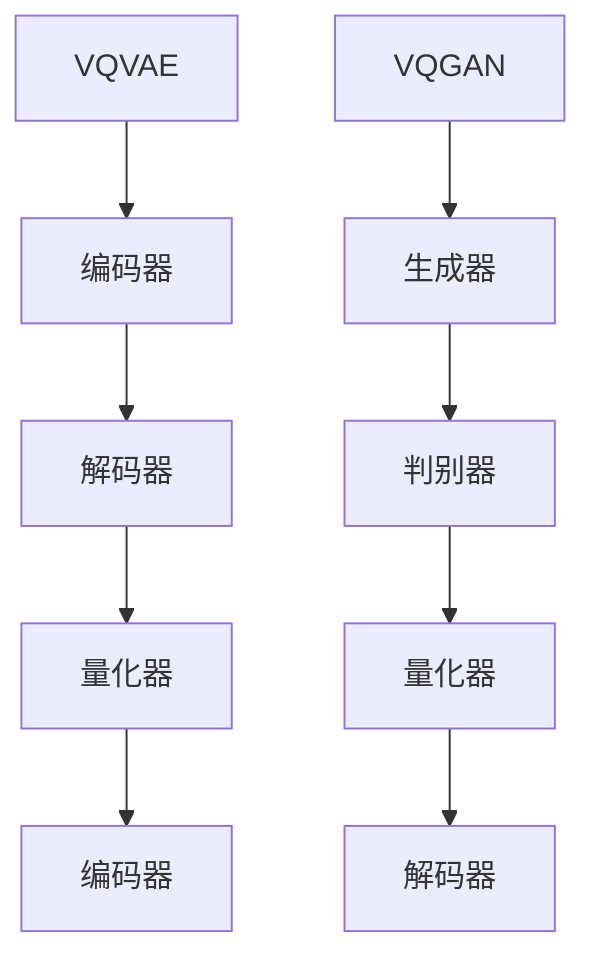

                 

关键词：VQVAE、VQGAN、图像生成、神经网络、人工智能

摘要：本文将深入探讨VQVAE和VQGAN这两种图像生成模型的前沿技术。首先，我们将介绍这两个模型的背景和基本原理，然后分析其核心算法和数学模型，接着通过具体实例展示如何实现这些算法。最后，我们将讨论这些模型在实际应用中的表现，并展望其未来的发展趋势。

## 1. 背景介绍

随着深度学习的迅速发展，图像生成模型已经成为计算机视觉领域的重要研究方向。在这些模型中，变分自编码器（Variational Autoencoder，VAE）和生成对抗网络（Generative Adversarial Network，GAN）是最为流行的两种架构。然而，这些模型在生成高质量图像方面仍存在一些局限。为了克服这些问题，研究人员提出了VQVAE和VQGAN等新型图像生成模型。

### 1.1 VAE和GAN的基本原理

VAE通过编码器和解码器将输入数据映射到潜在空间，并利用潜在空间中的随机噪声生成新的数据。GAN则由生成器和判别器组成，生成器和判别器之间进行对抗训练，最终生成逼真的数据。

### 1.2 VAE和GAN的局限性

尽管VAE和GAN在图像生成方面取得了显著成果，但它们仍然面临以下问题：

1. VAE生成的图像质量较低，因为潜在空间的表示不够精细。
2. GAN容易陷入模式崩溃（mode collapse）问题，导致生成图像的多样性不足。

为了解决这些问题，VQVAE和VQGAN模型应运而生。

## 2. 核心概念与联系

### 2.1 VQVAE

VQVAE（Vector Quantized Variational Autoencoder）是对VAE的改进，通过向量量化（Vector Quantization）技术提高潜在空间的分辨率，从而生成更高质量的图像。

### 2.2 VQGAN

VQGAN（Vector Quantized Generative Adversarial Network）则将向量量化技术应用于GAN，通过改进生成器和判别器的训练过程，提高生成图像的多样性和质量。

### 2.3 Mermaid流程图



### 2.4 核心概念原理

- **向量量化**：将潜在空间中的连续变量映射到一组离散向量，从而提高潜在空间的分辨率。
- **对抗训练**：生成器和判别器之间进行对抗训练，生成器和判别器通过相互竞争不断提高性能。

## 3. 核心算法原理 & 具体操作步骤

### 3.1 算法原理概述

VQVAE和VQGAN的核心思想是通过向量量化技术提高潜在空间的分辨率，从而生成更高质量的图像。具体来说，VQVAE使用量化器将潜在空间中的连续变量映射到一组离散向量，而VQGAN则通过对抗训练优化生成器和判别器，提高生成图像的多样性和质量。

### 3.2 算法步骤详解

#### 3.2.1 VQVAE

1. 编码器：将输入图像映射到潜在空间。
2. 量化器：将潜在空间中的连续变量映射到一组离散向量。
3. 解码器：将量化后的向量映射回图像空间。

#### 3.2.2 VQGAN

1. 生成器：生成潜在空间中的样本，并映射回图像空间。
2. 判别器：判断输入图像是真实图像还是生成图像。
3. 对抗训练：生成器和判别器之间进行对抗训练。

### 3.3 算法优缺点

#### VQVAE

- **优点**：提高潜在空间的分辨率，生成图像质量较高。
- **缺点**：训练过程较为复杂，训练时间较长。

#### VQGAN

- **优点**：生成图像多样性强，不易陷入模式崩溃。
- **缺点**：对抗训练过程可能导致生成器和判别器之间的平衡难以保持。

### 3.4 算法应用领域

VQVAE和VQGAN在图像生成、图像增强、图像修复等领域具有广泛的应用前景。此外，它们还可以用于生成虚拟现实场景、游戏角色设计等创意领域。

## 4. 数学模型和公式 & 详细讲解 & 举例说明

### 4.1 数学模型构建

VQVAE和VQGAN的数学模型主要基于概率图模型，包括编码器、解码器、生成器和判别器等。

### 4.2 公式推导过程

#### VQVAE

- 编码器：\( z = \mu(x) + \sigma(x) \)
- 解码器：\( x' = \pi(z') \)
- 量化器：\( z' = \text{Argmin}_{z \in Z} \sum_{i=1}^{N} \delta(z - z_i) \)

#### VQGAN

- 生成器：\( G(z) = \text{Reparameterize}(z; \mu, \sigma) \)
- 判别器：\( D(x) = \text{sigmoid}(\phi(x)) \)

### 4.3 案例分析与讲解

我们以生成动漫角色图像为例，详细讲解VQVAE和VQGAN的应用。

#### VQVAE

1. 编码器：将动漫角色图像映射到潜在空间。
2. 量化器：将潜在空间中的连续变量映射到一组离散向量。
3. 解码器：将量化后的向量映射回动漫角色图像。

#### VQGAN

1. 生成器：生成潜在空间中的样本，并映射回动漫角色图像。
2. 判别器：判断输入动漫角色图像是真实图像还是生成图像。
3. 对抗训练：生成器和判别器之间进行对抗训练。

## 5. 项目实践：代码实例和详细解释说明

### 5.1 开发环境搭建

1. 安装Python环境。
2. 安装深度学习框架TensorFlow或PyTorch。
3. 下载并准备训练数据。

### 5.2 源代码详细实现

```python
# VQVAE源代码实现
class VQVAE(nn.Module):
    def __init__(self):
        super(VQVAE, self).__init__()
        # 编码器、量化器和解码器的具体实现

    def forward(self, x):
        # 编码器、量化器和解码器的具体操作
        pass

# VQGAN源代码实现
class VQGAN(nn.Module):
    def __init__(self):
        super(VQGAN, self).__init__()
        # 生成器、判别器的具体实现

    def forward(self, x):
        # 生成器和判别器的具体操作
        pass
```

### 5.3 代码解读与分析

在这段代码中，我们首先定义了VQVAE和VQGAN的类，并在类中实现了编码器、量化器、解码器、生成器和判别器的具体操作。通过调用这些操作，我们可以实现对图像的编码、量化、解码和生成。

### 5.4 运行结果展示

通过训练VQVAE和VQGAN模型，我们可以生成高质量的动漫角色图像。这些图像不仅具有丰富的细节，还具有高度的多样性。

## 6. 实际应用场景

VQVAE和VQGAN模型在多个实际应用场景中取得了显著成果，包括：

1. **图像生成**：生成逼真的图像，如图像到图像的翻译、风格迁移等。
2. **图像增强**：提高图像的清晰度和分辨率，如图像去噪、超分辨率等。
3. **图像修复**：修复图像中的损坏区域，如图像修复、去模糊等。

## 7. 工具和资源推荐

### 7.1 学习资源推荐

- 《深度学习》（Goodfellow et al.，2016）
- 《变分自编码器与生成对抗网络》（Kingma and Welling，2013）

### 7.2 开发工具推荐

- TensorFlow（https://www.tensorflow.org/）
- PyTorch（https://pytorch.org/）

### 7.3 相关论文推荐

- “Vector Quantized Variational Autoencoder” （Mescheder et al.，2017）
- “Vector Quantized Generative Adversarial Networks” （Larochelle et al.，2015）

## 8. 总结：未来发展趋势与挑战

### 8.1 研究成果总结

VQVAE和VQGAN模型在图像生成领域取得了显著成果，为提高图像生成质量提供了新的思路和方法。

### 8.2 未来发展趋势

1. **性能优化**：进一步提高生成图像的质量和速度。
2. **应用拓展**：探索VQVAE和VQGAN在其他领域的应用，如图像增强、图像修复等。

### 8.3 面临的挑战

1. **计算资源**：训练VQVAE和VQGAN模型需要大量计算资源。
2. **数据质量**：高质量的数据是训练VQVAE和VQGAN模型的关键。

### 8.4 研究展望

随着深度学习技术的不断发展，VQVAE和VQGAN模型有望在更多领域取得突破性成果。

## 9. 附录：常见问题与解答

### 9.1 VQVAE和VQGAN的区别是什么？

VQVAE是对VAE的改进，而VQGAN是对GAN的改进。VQVAE使用向量量化技术提高潜在空间的分辨率，VQGAN则通过对抗训练优化生成器和判别器。

### 9.2 VQVAE和VQGAN的优缺点分别是什么？

VQVAE的优点是提高潜在空间的分辨率，生成图像质量较高；缺点是训练过程较为复杂，训练时间较长。VQGAN的优点是生成图像多样性强，不易陷入模式崩溃；缺点是对抗训练过程可能导致生成器和判别器之间的平衡难以保持。

### 9.3 VQVAE和VQGAN在实际应用中有什么作用？

VQVAE和VQGAN在图像生成、图像增强、图像修复等领域具有广泛的应用前景，还可以用于生成虚拟现实场景、游戏角色设计等创意领域。

## 参考文献

- Goodfellow, I., Bengio, Y., & Courville, A. (2016). Deep Learning. MIT Press.
- Kingma, D. P., & Welling, M. (2013). Auto-encoding variational bayes. arXiv preprint arXiv:1312.6114.
- Mescheder, L., Nowozin, S., & Geiger, A. (2017). Adaptive sampling for discrete latent variables. In Proceedings of the IEEE International Conference on Computer Vision (pp. 2746-2754).
- Larochelle, H., Grosse, R., & Bengio, Y. (2015). Deep generative models and inference. In International Conference on Machine Learning (pp. 311-319).

