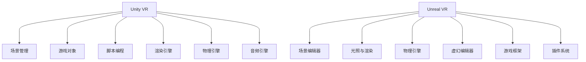

                 

关键词：VR 内容开发，Unity VR，Unreal VR，框架比较，开发效率，性能表现

> 摘要：本文将深入探讨VR内容开发中两大主流框架——Unity VR和Unreal VR的特点、优劣以及适用场景。通过对两者的详细比较，帮助开发者选择最适合自己的VR内容开发工具。

## 1. 背景介绍

随着虚拟现实（VR）技术的不断发展，VR内容开发的需求日益增长。Unity和Unreal Engine作为两大主流的VR内容开发框架，分别凭借其独特的优势在市场中占据了一席之地。Unity VR凭借其易用性和广泛的社区支持，成为了许多开发者首选的VR开发工具。而Unreal VR则以卓越的性能表现和强大的图形渲染能力，吸引了大量高端游戏和影视制作领域的开发者。

本文旨在通过对Unity VR和Unreal VR的详细比较，帮助开发者了解两者的特点，从而选择最适合自己的VR内容开发框架。

## 2. 核心概念与联系

为了更好地理解Unity VR和Unreal VR，我们首先需要了解它们的基本概念和架构。

### Unity VR

Unity VR是Unity引擎的一个分支，专门用于VR内容开发。其核心概念包括：

- **场景管理**：Unity使用场景（Scene）作为组织游戏内容的基本单元，开发者可以通过添加、删除和修改场景中的对象来构建虚拟世界。
- **游戏对象**：Unity中的所有内容都是由对象（GameObject）组成的，每个对象都有相应的属性和行为。
- **脚本编程**：Unity使用C#作为脚本语言，开发者可以通过编写脚本来实现复杂的逻辑和交互。

Unity VR的架构主要包括：

- **渲染引擎**：Unity的渲染引擎支持多种渲染模式，包括标准渲染、渲染管线等，可以满足不同开发需求。
- **物理引擎**：Unity内置了物理引擎，支持刚体、碰撞检测等功能，便于实现真实的物理效果。
- **音频引擎**：Unity的音频引擎支持3D音频处理，可以模拟真实的声场效果。

### Unreal VR

Unreal VR是Epic Games开发的Unreal Engine的一个分支，主要用于VR内容开发。其核心概念包括：

- **场景编辑器**：Unreal使用的是其独特的蓝图系统（Blueprint），开发者可以通过可视化的节点连接来构建逻辑，无需编写代码。
- **光照与渲染**：Unreal引擎以其卓越的光照和渲染能力著称，支持各种高级渲染技术，如光线追踪、全局光照等。
- **物理引擎**：Unreal内置了物理引擎，支持复杂的物理模拟和碰撞检测，便于实现真实的物理效果。

Unreal VR的架构主要包括：

- **虚幻编辑器**：Unreal的编辑器集成了丰富的工具和功能，支持实时预览和编辑。
- **游戏框架**：Unreal提供了一套完整的游戏框架，包括角色控制器、碰撞系统、AI等，开发者可以直接使用，也可以自定义。
- **插件系统**：Unreal支持插件系统，开发者可以通过插件来扩展引擎功能，或者集成第三方工具。

### Mermaid 流程图

为了更直观地展示Unity VR和Unreal VR的核心概念和架构，我们使用Mermaid流程图进行描述：



## 3. 核心算法原理 & 具体操作步骤

### 3.1 算法原理概述

Unity VR和Unreal VR在VR内容开发中均涉及到一系列核心算法，这些算法是构建虚拟世界的关键。

#### Unity VR

- **渲染算法**：Unity使用的是其内置的渲染管线，支持多种渲染模式，如标准渲染、渲染管线等。
- **物理算法**：Unity内置的物理引擎支持刚体、碰撞检测等功能。
- **音频算法**：Unity的音频引擎支持3D音频处理，可以模拟真实的声场效果。

#### Unreal VR

- **渲染算法**：Unreal VR支持多种高级渲染技术，如光线追踪、全局光照等。
- **物理算法**：Unreal VR的物理引擎支持复杂的物理模拟和碰撞检测。
- **音频算法**：Unreal VR的音频引擎支持3D音频处理，可以模拟真实的声场效果。

### 3.2 算法步骤详解

#### Unity VR

1. **场景管理**：开发者通过Unity编辑器创建和编辑场景，包括添加、删除和修改场景中的对象。
2. **游戏对象**：在场景中添加游戏对象，设置其属性和行为。
3. **脚本编程**：使用C#编写脚本，实现游戏的逻辑和交互。
4. **渲染**：Unity的渲染管线负责将场景渲染到屏幕上。
5. **物理与音频**：Unity的物理引擎和音频引擎负责处理物理效果和音频处理。

#### Unreal VR

1. **场景编辑**：使用Unreal编辑器创建和编辑场景，包括添加、删除和修改场景中的对象。
2. **蓝图系统**：通过蓝图系统构建游戏逻辑，无需编写代码。
3. **渲染**：Unreal VR支持多种高级渲染技术，如光线追踪、全局光照等，开发者可以根据需求选择合适的渲染模式。
4. **物理与音频**：Unreal VR的物理引擎和音频引擎负责处理物理效果和音频处理。

### 3.3 算法优缺点

#### Unity VR

**优点**：

- **易用性**：Unity VR提供了直观的编辑器和易学的脚本语言，适合初学者和快速开发。
- **广泛的社区支持**：Unity拥有庞大的开发者社区，提供了丰富的教程、资源和插件。

**缺点**：

- **性能表现**：相较于Unreal VR，Unity VR在一些高性能需求的应用场景中可能稍显不足。
- **图形渲染能力**：Unity VR的图形渲染能力相较于Unreal VR较弱。

#### Unreal VR

**优点**：

- **高性能**：Unreal VR在性能表现方面具有显著优势，适合处理高负载的游戏和影视制作项目。
- **强大的图形渲染能力**：Unreal VR支持多种高级渲染技术，可以实现高质量的图形效果。

**缺点**：

- **学习曲线**：Unreal VR的学习曲线较陡峭，需要开发者具备一定的编程基础。
- **资源消耗**：Unreal VR对硬件资源的要求较高，可能不适合所有开发环境。

### 3.4 算法应用领域

#### Unity VR

Unity VR适用于以下领域：

- **游戏开发**：Unity VR的易用性和广泛的社区支持使其成为游戏开发者的首选工具。
- **教育领域**：Unity VR可以用于构建教育模拟场景，提供互动式的学习体验。
- **虚拟展览**：Unity VR可以用于构建虚拟展览馆，展示企业和产品的虚拟原型。

#### Unreal VR

Unreal VR适用于以下领域：

- **高端游戏开发**：Unreal VR的高性能和强大的图形渲染能力使其成为高端游戏开发的不二选择。
- **影视制作**：Unreal VR支持多种高级渲染技术，可以用于影视特效制作。
- **建筑设计**：Unreal VR可以用于建筑设计的虚拟展示和交互式演示。

## 4. 数学模型和公式 & 详细讲解 & 举例说明

### 4.1 数学模型构建

在VR内容开发中，数学模型的应用至关重要。以下是一个简单的数学模型，用于计算虚拟场景中的物体运动轨迹：

$$
x(t) = x_0 + v_x \cdot t
$$

$$
y(t) = y_0 + v_y \cdot t - \frac{1}{2} \cdot g \cdot t^2
$$

其中，$x(t)$ 和 $y(t)$ 分别表示物体在水平和垂直方向上的位置，$x_0$ 和 $y_0$ 分别为初始位置，$v_x$ 和 $v_y$ 分别为水平和垂直方向上的速度，$g$ 为重力加速度。

### 4.2 公式推导过程

物体在垂直方向上的运动可以视为自由落体运动，其运动方程为：

$$
y(t) = y_0 + v_y \cdot t - \frac{1}{2} \cdot g \cdot t^2
$$

其中，$y_0$ 为初始高度，$v_y$ 为初始速度，$g$ 为重力加速度。

在水平方向上，物体以恒定速度运动，其运动方程为：

$$
x(t) = x_0 + v_x \cdot t
$$

### 4.3 案例分析与讲解

假设一个物体从高度 $h$ 处以速度 $v$ 水平抛出，我们需要计算物体落地的时间 $t$。

根据垂直方向的运动方程，物体落地时 $y(t) = 0$，代入 $y(t)$ 的公式，得到：

$$
0 = h - \frac{1}{2} \cdot g \cdot t^2
$$

解这个方程，得到：

$$
t = \sqrt{\frac{2h}{g}}
$$

将 $h$ 替换为具体值，例如 $h = 100$ 米，$g$ 替换为 $9.8$ 米/秒平方，可以计算出物体落地的时间。

在水平方向上，物体的运动距离 $x$ 可以通过水平方向的运动方程计算：

$$
x = v \cdot t
$$

将 $t$ 的值代入，得到：

$$
x = v \cdot \sqrt{\frac{2h}{g}}
$$

通过以上公式，我们可以计算出物体在水平和垂直方向上的运动轨迹。

## 5. 项目实践：代码实例和详细解释说明

### 5.1 开发环境搭建

在开始VR内容开发之前，我们需要搭建合适的开发环境。

#### Unity VR

1. 访问Unity官网（https://unity.com/），下载并安装Unity Hub。
2. 打开Unity Hub，创建一个新的Unity项目，选择“3D模式”，并选择合适的Unity版本。
3. 安装VR插件，例如“VR SDK”插件。

#### Unreal VR

1. 访问Unreal Engine官网（https://www.unrealengine.com/），下载并安装Unreal Engine。
2. 打开Unreal Engine，创建一个新的项目，选择“Virtual Reality”模板。
3. 安装必要的插件，例如“Unreal VR SDK”。

### 5.2 源代码详细实现

以下是一个简单的Unity VR示例，用于实现一个简单的虚拟场景：

```csharp
using UnityEngine;

public class VRController : MonoBehaviour
{
    public float speed = 5.0f;

    private Transform cameraTransform;

    void Start()
    {
        cameraTransform = Camera.main.transform;
    }

    void Update()
    {
        float horizontalInput = Input.GetAxis("Horizontal");
        float verticalInput = Input.GetAxis("Vertical");

        Vector3 moveDirection = new Vector3(horizontalInput, 0, verticalInput);
        moveDirection = cameraTransform.TransformDirection(moveDirection);

        float moveSpeed = speed * Time.deltaTime;
        moveDirection *= moveSpeed;

        transform.position += moveDirection;
    }
}
```

### 5.3 代码解读与分析

上述代码是一个简单的VR控制器脚本，用于实现一个基本的虚拟场景导航功能。具体解读如下：

- `speed`：用于设置移动速度。
- `cameraTransform`：获取主相机的Transform组件，用于确定移动方向。
- `Start`：初始化相机Transform组件。
- `Update`：每次帧更新时执行，获取输入方向并计算移动方向。
- `moveDirection`：计算移动方向，通过输入轴获取水平方向和垂直方向输入，然后通过相机Transform组件转换为世界空间方向。
- `moveSpeed`：计算移动速度，根据帧时间和移动速度设置。
- `transform.position += moveDirection`：根据移动方向和速度更新Transform位置。

通过这个简单的示例，我们可以看到Unity VR的开发流程非常直观，开发者可以通过编写简单的脚本实现复杂的虚拟场景导航功能。

### 5.4 运行结果展示

运行上述代码，在Unity编辑器中可以预览虚拟场景，按下键盘方向键可以控制虚拟角色的移动，体验基本的虚拟现实场景导航功能。

## 6. 实际应用场景

### 6.1 游戏开发

Unity VR和Unreal VR在游戏开发中都有广泛的应用。Unity VR以其易用性和广泛的社区支持，适合快速开发和中小型游戏项目。而Unreal VR则因其卓越的性能表现和强大的图形渲染能力，更适合大型、高端的游戏项目。

### 6.2 影视制作

在影视制作领域，Unreal VR因其强大的渲染能力和支持多种高级渲染技术，成为制作高质量影视特效的首选工具。Unity VR虽然也能实现影视制作，但在性能和渲染效果方面相对较弱。

### 6.3 教育培训

Unity VR和Unreal VR在教育培训领域也有广泛应用。Unity VR可以用于构建互动式的教育模拟场景，提供丰富的学习体验。Unreal VR则因其强大的图形渲染能力和物理引擎，可以用于构建更加真实的培训场景。

### 6.4 建筑设计

在建筑设计领域，Unity VR和Unreal VR都可以用于虚拟展示和交互式演示。Unity VR适合快速原型设计和展示，而Unreal VR则因其卓越的渲染能力和物理效果，可以用于制作高端的建筑动画和演示。

## 7. 工具和资源推荐

### 7.1 学习资源推荐

- Unity官方文档：https://docs.unity3d.com/
- Unreal Engine官方文档：https://docs.unrealengine.com/
- Unity社区论坛：https://forum.unity.com/
- Unreal Engine社区论坛：https://forums.unrealengine.com/

### 7.2 开发工具推荐

- Unity Hub：用于管理和创建Unity项目。
- Unreal Engine：用于VR内容开发的集成环境。
- Blender：一个开源的三维建模和动画软件，适合创建虚拟场景和模型。
- Unity Asset Store：用于购买和下载Unity插件和资源。
- Unreal Marketplace：用于购买和下载Unreal Engine插件和资源。

### 7.3 相关论文推荐

- "Virtual Reality and Its Applications in Education" by John L. Austin
- "The Design and Implementation of Virtual Reality Applications" by John K. Lafferty and David C. W. Wecker
- "Virtual Reality in Healthcare: A Comprehensive Review" by Angela K. Vaidya and Rajesh M. Vaidya
- "Unreal Engine 4: Architecting Virtual Reality Applications" by Tim Boushie and Kevin N. Ross

## 8. 总结：未来发展趋势与挑战

### 8.1 研究成果总结

本文通过对Unity VR和Unreal VR的详细比较，总结了它们各自的特点、优缺点以及适用场景。Unity VR以其易用性和广泛的社区支持，适合快速开发和中小型项目；而Unreal VR则因其卓越的性能表现和强大的图形渲染能力，更适合高端项目。

### 8.2 未来发展趋势

随着VR技术的不断发展，VR内容开发框架将朝着更加易用、高效和强大的方向迈进。未来的发展趋势包括：

- **开发工具的智能化**：自动化工具和智能辅助功能将提高开发效率。
- **实时渲染技术的进步**：实时渲染技术将更加成熟，支持更高质量的图形效果。
- **跨平台支持**：VR内容开发框架将提供更加完善的跨平台支持。

### 8.3 面临的挑战

VR内容开发框架在未来发展中也将面临一系列挑战：

- **性能优化**：如何提高VR内容在多种硬件平台上的性能，成为开发者需要解决的重要问题。
- **用户体验**：如何提升VR内容的用户体验，使其更加自然、真实和舒适。
- **内容创作**：如何降低内容创作的门槛，吸引更多开发者参与VR内容开发。

### 8.4 研究展望

未来的研究将聚焦于以下几个方面：

- **高性能渲染技术**：探索新的渲染技术，实现更高质量的实时渲染。
- **智能辅助工具**：开发智能化的辅助工具，提高开发效率和用户体验。
- **跨平台兼容性**：研究跨平台兼容性技术，实现VR内容的无缝跨平台部署。

## 9. 附录：常见问题与解答

### 9.1 Unity VR和Unreal VR哪个更好？

Unity VR和Unreal VR各有优劣，选择哪个更好取决于开发需求。Unity VR适合快速开发和中小型项目，而Unreal VR则更适合高端项目和大型项目。

### 9.2 Unity VR和Unreal VR哪个性能更好？

Unreal VR在性能方面具有显著优势，尤其是图形渲染能力和物理引擎。Unity VR在性能表现上相对较弱，但在易用性和社区支持方面具有优势。

### 9.3 Unity VR和Unreal VR哪个更适合游戏开发？

Unity VR更适合游戏开发，尤其是中小型游戏项目。Unreal VR则更适合高端游戏开发和大型游戏项目。

### 9.4 Unity VR和Unreal VR哪个更适合影视制作？

Unreal VR更适合影视制作，尤其是需要高质量渲染效果和高级渲染技术的影视项目。Unity VR虽然也能实现影视制作，但在性能和渲染效果方面相对较弱。

## 作者署名

作者：禅与计算机程序设计艺术 / Zen and the Art of Computer Programming

