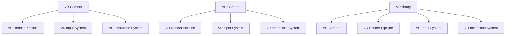

                 

关键词：虚拟现实、内容开发、Unity VR、Unreal VR、VR框架、开发流程、工具推荐、性能优化、应用场景、未来展望

## 摘要

本文将深入探讨虚拟现实（VR）内容开发的两大主流框架：Unity VR 和 Unreal VR。通过分析这两个框架的核心特点、开发流程、工具资源，以及实际应用场景，旨在为开发者提供全面的技术指导和未来发展的洞见。文章结构分为背景介绍、核心概念与联系、核心算法原理、数学模型与公式、项目实践、实际应用场景、工具和资源推荐、总结以及附录等部分。

## 1. 背景介绍

虚拟现实技术作为近年来快速发展的领域，已经在娱乐、教育、医疗等多个行业展现出巨大的潜力。VR 内容开发框架作为实现VR应用的基础，其性能、易用性以及灵活性成为开发者关注的焦点。Unity和Unreal作为当前最流行的两大VR开发框架，各自拥有独特的优势和广泛的应用场景。

Unity是由Unity Technologies开发的跨平台游戏引擎，广泛应用于游戏开发、建筑可视化、实时3D动画等领域。其强大的图形渲染能力、丰富的插件生态系统和易于上手的编辑器界面，使得Unity成为VR内容开发的理想选择。

Unreal Engine是由Epic Games开发的跨平台游戏引擎，以其卓越的图形渲染质量和高度优化的光照模型而著称。Unreal在影视制作、建筑可视化、虚拟现实等领域有着广泛的应用，其先进的渲染技术和物理模拟能力使其成为高端VR内容开发的强大工具。

## 2. 核心概念与联系

### 2.1 Unity VR架构

Unity VR开发框架基于Unity引擎，通过一系列插件和工具实现VR功能。核心组件包括：

- **VR Camera**: 负责虚拟现实场景中的摄像机控制，包括视角切换、镜头移动等。
- **VR Render Pipeline**: 提供了一套用于渲染虚拟场景的流程，包括光照、阴影、后处理等。
- **VR Input System**: 管理用户输入，如手柄、手势等。
- **VR Interaction System**: 提供用户与虚拟环境的交互机制，如点击、拖拽等。

### 2.2 Unreal VR架构

Unreal VR开发框架以Unreal Engine为基础，提供了丰富的VR开发工具和资源。核心组件包括：

- **VR渲染管线**: Unreal的渲染管线支持多种VR模式，如VRChat、SteamVR等。
- **物理模拟**: Unreal的物理引擎能够模拟真实世界的物理效果，如碰撞检测、力反馈等。
- **AI系统**: Unreal的AI系统支持复杂的虚拟环境中的智能行为。
- **虚拟现实模组**: 包括手柄、定位系统、触觉反馈等硬件支持。

### 2.3 Mermaid流程图

以下是一个简化的Mermaid流程图，展示了Unity VR和Unreal VR的核心组件及其联系：



## 3. 核心算法原理 & 具体操作步骤

### 3.1 算法原理概述

VR内容开发涉及多种核心算法，包括场景渲染、物理模拟、用户交互等。以下将简要介绍这些算法的基本原理。

#### 场景渲染算法

场景渲染算法是VR内容开发的核心，负责将三维场景转换为二维图像呈现给用户。主要算法包括：

- **光栅化**: 将三维模型转换为二维像素图像。
- **阴影处理**: 模拟光线在场景中的传播和反射，增强场景的真实感。
- **后处理**: 应用各种视觉效果，如模糊、色彩校正等，提升图像质量。

#### 物理模拟算法

物理模拟算法负责模拟虚拟环境中的物理现象，如碰撞检测、力反馈等。主要算法包括：

- **碰撞检测**: 判断物体之间的接触和碰撞。
- **刚体动力学**: 模拟刚体在受力作用下的运动。
- **流体模拟**: 模拟流体（如水、风）的运动。

#### 用户交互算法

用户交互算法负责处理用户输入和场景响应，包括：

- **手势识别**: 识别用户的手势动作。
- **路径规划**: 确定用户在虚拟环境中的移动路径。
- **碰撞响应**: 当用户与虚拟物体发生碰撞时的响应处理。

### 3.2 算法步骤详解

#### 场景渲染算法

1. **加载场景**: 从模型文件中加载三维场景。
2. **设置摄像机**: 配置摄像机参数，如视野、分辨率等。
3. **光照计算**: 计算场景中的光照效果，包括环境光、方向光等。
4. **渲染过程**: 将场景数据传递给图形渲染管线，进行光栅化、阴影处理等。
5. **后处理**: 对渲染后的图像进行各种效果处理，如模糊、色彩校正等。

#### 物理模拟算法

1. **初始化**: 设置物理引擎参数，如重力、摩擦等。
2. **碰撞检测**: 判断物体之间的接触和碰撞。
3. **运动模拟**: 根据物理定律计算物体的运动轨迹。
4. **力反馈**: 将模拟结果反馈给用户，如触觉反馈、声音效果等。

#### 用户交互算法

1. **输入采集**: 采集用户输入，如手柄数据、手势数据等。
2. **手势识别**: 对输入数据进行处理，识别用户的手势动作。
3. **路径规划**: 根据用户动作规划移动路径。
4. **碰撞检测**: 判断用户与虚拟物体之间的碰撞。
5. **响应处理**: 根据碰撞结果执行相应的场景响应。

### 3.3 算法优缺点

#### 场景渲染算法

- **优点**：能够高效地渲染高质量的三维场景，提供丰富的视觉效果。
- **缺点**：计算复杂度高，对硬件性能要求较高。

#### 物理模拟算法

- **优点**：能够模拟真实世界的物理现象，增强场景的真实感。
- **缺点**：计算复杂度高，可能影响渲染帧率。

#### 用户交互算法

- **优点**：能够提供丰富的用户交互体验，提高用户体验。
- **缺点**：对输入处理和实时响应的要求较高，可能增加开发难度。

### 3.4 算法应用领域

- **场景渲染算法**：广泛应用于游戏开发、虚拟现实、建筑可视化等领域。
- **物理模拟算法**：应用于模拟真实世界物理现象的应用，如科学仿真、工程模拟等。
- **用户交互算法**：应用于需要用户与虚拟环境互动的场景，如教育、医疗等。

## 4. 数学模型和公式 & 详细讲解 & 举例说明

### 4.1 数学模型构建

在VR内容开发中，数学模型用于描述虚拟场景的几何形状、物理现象和用户交互。以下是一个简化的数学模型：

#### 场景渲染

1. **三维模型表示**：使用顶点数组表示三维模型，每个顶点由三维坐标、颜色、法向量等属性组成。
2. **光线追踪**：使用光线追踪算法模拟光线在场景中的传播，计算光照效果。

#### 物理模拟

1. **刚体动力学**：使用牛顿第二定律描述物体的运动，公式为 \( F = m \cdot a \)（力等于质量乘以加速度）。
2. **流体模拟**：使用Navier-Stokes方程描述流体的运动。

#### 用户交互

1. **手势识别**：使用机器学习算法对用户手势进行识别，公式为 \( h(x) = \sigma(\omega_0 + \sum_{i=1}^{n} \omega_i \cdot x_i) \)（激活函数为Sigmoid函数）。

### 4.2 公式推导过程

以下以刚体动力学为例，简要介绍公式推导过程：

1. **牛顿第二定律**：物体受到的合力等于其质量与加速度的乘积。
2. **加速度计算**：加速度是速度的变化率，即 \( a = \frac{dv}{dt} \)。
3. **速度计算**：速度是位移的变化率，即 \( v = \frac{dx}{dt} \)。

将速度公式代入加速度公式，得到 \( a = \frac{d^2x}{dt^2} \)。

将加速度代入牛顿第二定律，得到 \( F = m \cdot \frac{d^2x}{dt^2} \)。

### 4.3 案例分析与讲解

以下是一个简单的例子，用于展示数学模型在实际应用中的使用：

#### 场景渲染

1. **加载模型**：从文件中读取顶点数组，包括顶点坐标、颜色、法向量等。
2. **设置摄像机**：配置摄像机的位置和参数，如视野、分辨率等。
3. **光照计算**：计算场景中的光照效果，包括环境光、方向光等。
4. **渲染过程**：将场景数据传递给渲染管线，进行光栅化、阴影处理等。

#### 物理模拟

1. **初始化**：设置物理引擎参数，如重力、摩擦等。
2. **碰撞检测**：判断物体之间的接触和碰撞。
3. **运动模拟**：根据牛顿第二定律计算物体的运动轨迹。
4. **力反馈**：将模拟结果反馈给用户，如触觉反馈、声音效果等。

#### 用户交互

1. **输入采集**：采集用户输入，如手柄数据、手势数据等。
2. **手势识别**：对输入数据进行处理，识别用户的手势动作。
3. **路径规划**：根据用户动作规划移动路径。
4. **碰撞检测**：判断用户与虚拟物体之间的碰撞。
5. **响应处理**：根据碰撞结果执行相应的场景响应。

## 5. 项目实践：代码实例和详细解释说明

### 5.1 开发环境搭建

在开始VR内容开发之前，需要搭建合适的开发环境。以下是一个简单的开发环境搭建步骤：

1. **安装Unity或Unreal Engine**：从官方网站下载并安装Unity或Unreal Engine。
2. **配置VR插件**：下载并安装VR插件，如Unity VR插件或Unreal VR插件。
3. **创建新项目**：在Unity或Unreal中创建一个新的VR项目。
4. **配置VR设备**：根据实际使用的VR设备，配置相应的驱动和插件。

### 5.2 源代码详细实现

以下是一个简单的Unity VR项目示例，用于实现一个简单的VR场景：

```csharp
using UnityEngine;

public class VRExample : MonoBehaviour
{
    public Camera vrCamera;
    public Light directionalLight;

    void Start()
    {
        // 设置摄像机参数
        vrCamera.fieldOfView = 90;
        vrCamera.aspect = 16f / 9f;

        // 设置光照参数
        directionalLight.intensity = 1.5f;
        directionalLight.color = Color.white;
    }

    void Update()
    {
        // 更新摄像机位置
        transform.position = vrCamera.transform.position;

        // 更新摄像机方向
        transform.forward = vrCamera.transform.forward;
    }
}
```

### 5.3 代码解读与分析

以上代码实现了一个简单的VR场景，主要包括以下部分：

1. **摄像机设置**：配置摄像机参数，如视野、分辨率等。
2. **光照设置**：设置光照参数，如强度、颜色等。
3. **更新摄像机位置和方向**：在Update函数中，根据摄像机位置和方向更新虚拟场景。

### 5.4 运行结果展示

当运行以上代码时，会生成一个简单的VR场景，包括一个摄像机和一个光源。用户可以通过VR设备查看场景，并实时调整摄像机位置和方向，体验虚拟现实效果。

## 6. 实际应用场景

VR内容开发框架在实际应用中具有广泛的应用场景，以下列举一些常见的应用：

1. **娱乐**：VR游戏、VR电影等，提供沉浸式体验。
2. **教育**：虚拟课堂、虚拟实验室等，提供互动式学习。
3. **医疗**：虚拟手术模拟、心理治疗等，提供个性化治疗。
4. **房地产**：虚拟看房、虚拟装修等，提供虚拟展示。
5. **旅游**：虚拟旅游、虚拟博物馆等，提供虚拟游览。

## 7. 工具和资源推荐

为了提高VR内容开发的效率，以下推荐一些有用的工具和资源：

1. **学习资源**：
   - Unity官方文档：[https://docs.unity3d.com/](https://docs.unity3d.com/)
   - Unreal Engine官方文档：[https://docs.unrealengine.com/](https://docs.unrealengine.com/)

2. **开发工具**：
   - Unity HoloLens插件：[https://github.com/Unity-Technologies/Unity-HoloLens-Plugin](https://github.com/Unity-Technologies/Unity-HoloLens-Plugin)
   - Unreal Engine VR插件：[https://www.unrealengine.com/vr](https://www.unrealengine.com/vr)

3. **相关论文**：
   - "Virtual Reality Rendering Techniques" by John Houghton
   - "Unreal Engine 4 VR Development Cookbook" by Andrew Willmott

## 8. 总结：未来发展趋势与挑战

VR内容开发框架在未来将继续快速发展，面临以下趋势和挑战：

1. **性能优化**：提高渲染速度和物理模拟效率，以满足更高画质的VR应用需求。
2. **跨平台支持**：增强跨平台兼容性，支持更多设备，如移动VR、AR等。
3. **用户体验**：优化用户交互体验，提高虚拟现实应用的易用性和沉浸感。
4. **安全性**：保障用户数据安全和隐私，防止虚拟现实应用的滥用。

## 9. 附录：常见问题与解答

### 9.1 Unity VR与Unreal VR的区别？

Unity VR和Unreal VR在性能、易用性、插件生态系统等方面有所不同。Unity VR更适合初学者和中小型项目，而Unreal VR更适合高端游戏和影视制作。

### 9.2 如何优化VR场景性能？

优化VR场景性能可以从以下几个方面入手：减少场景复杂度、优化光照计算、使用LOD（细节层次渲染）技术等。

### 9.3 如何实现手势识别？

实现手势识别可以使用机器学习算法，如SVM（支持向量机）、CNN（卷积神经网络）等，对用户手势进行建模和识别。

---

### 作者署名

作者：禅与计算机程序设计艺术 / Zen and the Art of Computer Programming

