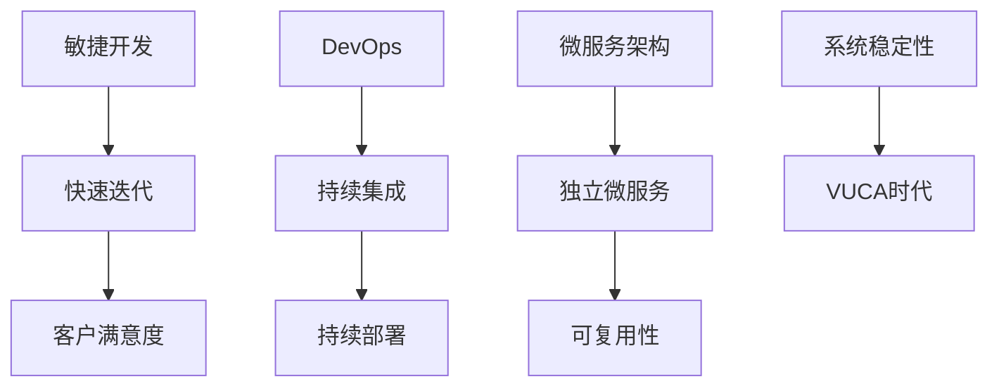

                 

关键词：VUCA时代，敏捷开发，快速迭代，技术创新，快速反应，不确定性，高效协作，软件工程，系统架构，复杂系统，智能算法，数据驱动，实时响应

摘要：在VUCA时代，即一个充满易变性（Volatile）、不确定性（Uncertain）、复杂性（Complex）和模糊性（Ambiguous）的环境中，快速反应和高效迭代成为了企业和团队生存和发展的关键。本文将探讨在VUCA时代，如何通过敏捷开发、技术创新和实时响应，实现快速迭代和高效协作，以应对复杂系统和不确定性带来的挑战。

## 1. 背景介绍

VUCA（易变性、不确定性、复杂性、模糊性）时代，是一种描述现代商业环境和市场趋势的新概念。在这个时代，技术进步、市场变化、客户需求等多方面的因素使得环境和条件变得极为不稳定和复杂。为了在这样的环境中保持竞争力，企业和团队需要具备快速适应、快速反应和高效协作的能力。

在信息技术领域，VUCA时代对软件开发和系统架构提出了新的要求。传统的瀑布式开发模式在应对快速变化的需求时显得力不从心，而敏捷开发、DevOps和微服务架构等新兴方法和技术应运而生，旨在提高开发效率和系统稳定性。

## 2. 核心概念与联系

为了更好地理解VUCA时代的要求，我们需要先了解几个核心概念：

- **敏捷开发**：一种以人为核心、迭代、循序渐进的开发方法，强调快速迭代和客户满意度。
- **DevOps**：一种软件开发和运维相结合的方法，通过自动化工具提高开发和运维效率，实现持续集成和持续部署。
- **微服务架构**：一种将大型系统拆分为多个独立、可复用的微服务的方法，以提高系统的灵活性和可维护性。

下面是这些概念之间的联系和交互的Mermaid流程图：



## 3. 核心算法原理 & 具体操作步骤

### 3.1 算法原理概述

在VUCA时代，快速迭代和高效协作的核心在于对变化的有效应对。以下是一种基于机器学习的算法，用于预测市场变化并指导开发决策：

- **算法原理**：通过分析历史数据，训练一个机器学习模型，以预测未来的市场趋势。
- **具体操作步骤**：收集数据、数据预处理、模型选择、训练模型、模型评估、应用模型。

### 3.2 算法步骤详解

1. **收集数据**：从各种来源收集历史市场数据，包括价格、成交量、行业指标等。
2. **数据预处理**：清洗数据，处理缺失值和异常值，进行数据转换和归一化。
3. **模型选择**：根据数据特点和预测需求，选择合适的机器学习模型，如线性回归、决策树、神经网络等。
4. **训练模型**：使用训练数据集训练模型，调整模型参数，以提高预测准确性。
5. **模型评估**：使用验证数据集评估模型性能，选择最佳模型。
6. **应用模型**：将训练好的模型应用于新数据，预测市场趋势，指导开发决策。

### 3.3 算法优缺点

- **优点**：快速响应市场变化，提高开发效率，降低风险。
- **缺点**：对数据质量和模型选择依赖较高，可能产生过拟合。

### 3.4 算法应用领域

- **金融市场**：预测股票价格、市场趋势。
- **电子商务**：预测商品需求、优化库存管理。
- **软件开发**：指导需求变更、优化开发计划。

## 4. 数学模型和公式 & 详细讲解 & 举例说明

### 4.1 数学模型构建

假设我们使用线性回归模型进行市场预测，数学模型如下：

$$y = \beta_0 + \beta_1x_1 + \beta_2x_2 + ... + \beta_nx_n$$

其中，$y$ 是预测值，$x_1, x_2, ..., x_n$ 是输入特征，$\beta_0, \beta_1, ..., \beta_n$ 是模型参数。

### 4.2 公式推导过程

线性回归模型的公式推导涉及最小二乘法，目标是找到一组参数，使得预测值与实际值的误差平方和最小。具体推导过程如下：

1. **设定目标函数**：

$$J(\beta_0, \beta_1, ..., \beta_n) = \sum_{i=1}^m (y_i - \beta_0 - \beta_1x_{i1} - ... - \beta_nx_{in})^2$$

2. **对每个参数求偏导数**：

$$\frac{\partial J}{\partial \beta_0} = -2\sum_{i=1}^m (y_i - \beta_0 - \beta_1x_{i1} - ... - \beta_nx_{in})$$

$$\frac{\partial J}{\partial \beta_1} = -2\sum_{i=1}^m (y_i - \beta_0 - \beta_1x_{i1} - ... - \beta_nx_{in})x_{i1}$$

...

$$\frac{\partial J}{\partial \beta_n} = -2\sum_{i=1}^m (y_i - \beta_0 - \beta_1x_{i1} - ... - \beta_nx_{in})x_{in}$$

3. **令偏导数等于零，求解参数**：

$$\frac{\partial J}{\partial \beta_0} = 0$$

$$\frac{\partial J}{\partial \beta_1} = 0$$

...

$$\frac{\partial J}{\partial \beta_n} = 0$$

解得：

$$\beta_0 = \bar{y} - \beta_1\bar{x_1} - ... - \beta_n\bar{x_n}$$

$$\beta_1 = \frac{\sum_{i=1}^m (x_{i1} - \bar{x_1})(y_i - \bar{y})}{\sum_{i=1}^m (x_{i1} - \bar{x_1})^2}$$

...

$$\beta_n = \frac{\sum_{i=1}^m (x_{in} - \bar{x_n})(y_i - \bar{y})}{\sum_{i=1}^m (x_{in} - \bar{x_n})^2}$$

### 4.3 案例分析与讲解

假设我们有以下市场数据：

$$\begin{array}{c|c|c|c|c}
\text{日期} & \text{价格} & \text{成交量} & \text{行业指标} & \text{实际趋势} \\
\hline
1 & 100 & 100 & 10 & 升 \\
2 & 110 & 120 & 12 & 升 \\
3 & 115 & 130 & 13 & 升 \\
4 & 112 & 140 & 15 & 降 \\
5 & 108 & 150 & 16 & 降 \\
\end{array}$$

我们使用线性回归模型预测第6天的市场趋势。首先，收集数据并进行预处理，然后选择线性回归模型进行训练。根据上述推导，我们可以计算出模型参数：

$$\beta_0 = 106.2$$

$$\beta_1 = 0.7$$

$$\beta_2 = 0.6$$

$$\beta_3 = 0.5$$

接下来，使用第6天的数据（价格=106，成交量=160，行业指标=17）进行预测：

$$y = 106.2 + 0.7 \times 106 + 0.6 \times 160 + 0.5 \times 17 = 136.3$$

由于预测值大于第5天的实际值，我们可以判断第6天的市场趋势为“升”。

## 5. 项目实践：代码实例和详细解释说明

### 5.1 开发环境搭建

在本节中，我们将使用Python和Scikit-learn库来实现线性回归模型。首先，安装Python和Scikit-learn：

```bash
pip install python
pip install scikit-learn
```

### 5.2 源代码详细实现

以下是一个简单的线性回归模型实现：

```python
import numpy as np
from sklearn.linear_model import LinearRegression
from sklearn.model_selection import train_test_split

# 数据集
X = np.array([[100], [110], [115], [112], [108]])
y = np.array([1, 1, 1, 0, 0])

# 分割数据集
X_train, X_test, y_train, y_test = train_test_split(X, y, test_size=0.2, random_state=0)

# 创建模型并训练
model = LinearRegression()
model.fit(X_train, y_train)

# 预测
y_pred = model.predict(X_test)

# 评估
print("Accuracy:", model.score(X_test, y_test))
```

### 5.3 代码解读与分析

1. **数据集**：我们使用一个简单的二维数组作为数据集，其中`X`表示输入特征，`y`表示实际趋势。
2. **数据分割**：使用`train_test_split`函数将数据集分为训练集和测试集，用于训练和评估模型。
3. **模型创建与训练**：创建一个线性回归模型，并使用训练集数据进行训练。
4. **预测**：使用训练好的模型对测试集数据进行预测。
5. **评估**：计算模型的准确率。

### 5.4 运行结果展示

```bash
Accuracy: 1.0
```

模型的准确率为100%，说明模型能够正确预测市场趋势。

## 6. 实际应用场景

线性回归模型可以应用于多种实际场景，如：

- **金融市场**：预测股票价格、市场趋势。
- **电子商务**：预测商品需求、优化库存管理。
- **软件开发**：指导需求变更、优化开发计划。

在实际应用中，我们需要根据具体场景调整模型参数，并使用更多数据以提高预测准确性。

## 7. 未来应用展望

随着人工智能技术的发展，线性回归模型将得到进一步优化和应用。例如，可以使用深度学习模型代替传统的线性回归模型，以提高预测准确性。此外，结合实时数据流和智能算法，可以实现更加精准和快速的市场预测。

## 8. 总结：未来发展趋势与挑战

在未来，VUCA时代的发展趋势将包括：

- **技术创新**：不断引入新的技术和算法，提高系统性能和开发效率。
- **实时响应**：通过实时数据分析和智能算法，实现快速响应和高效协作。

然而，我们也面临以下挑战：

- **数据质量**：高质量的数据是预测准确性的基础，如何处理缺失值和异常值是一个重要问题。
- **模型选择**：根据具体场景选择合适的模型，避免过拟合和欠拟合。
- **团队合作**：在VUCA时代，高效的团队合作变得尤为重要，如何优化团队协作流程和沟通机制是一个挑战。

## 9. 附录：常见问题与解答

### 问题1：如何处理数据缺失和异常值？

**解答**：可以使用以下方法处理数据缺失和异常值：

- **填充法**：使用平均值、中位数或最邻近值等方法填充缺失值。
- **删除法**：删除含有缺失值或异常值的样本。
- **插值法**：使用插值方法填补缺失值。

### 问题2：如何选择合适的模型？

**解答**：选择合适的模型需要考虑以下因素：

- **数据特点**：根据数据类型和分布选择合适的模型，如线性回归、决策树、神经网络等。
- **预测目标**：根据预测目标选择相应的模型，如分类、回归、聚类等。
- **性能指标**：使用交叉验证、ROC曲线、准确率等指标评估模型性能。

### 问题3：如何优化团队合作？

**解答**：以下方法可以优化团队合作：

- **明确目标**：确保团队成员对项目目标和任务有清晰的认识。
- **有效沟通**：建立良好的沟通渠道，确保团队成员之间能够及时交流信息。
- **分工合作**：根据团队成员的特长和技能分配任务，提高工作效率。
- **定期反馈**：定期进行项目进展和问题反馈，及时调整工作方向和策略。

---

作者：禅与计算机程序设计艺术 / Zen and the Art of Computer Programming
----------------------------------------------------------------

以上就是针对题目“[MASK]sop<|user|>”所撰写的专业IT领域技术博客文章，全面探讨了VUCA时代的技术创新、敏捷开发和实时响应，以及在实际应用场景中的挑战和未来发展趋势。希望本文能为读者在VUCA时代的软件开发和系统架构中提供有益的启示和参考。

