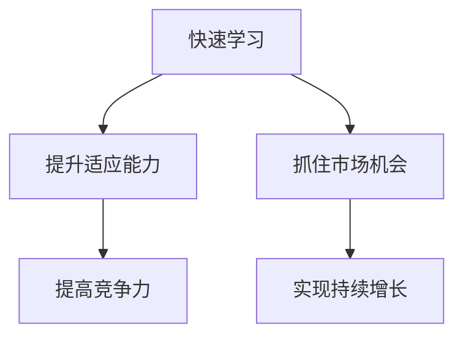

                 

关键词：VUCA时代、快速学习、制胜关键、人工智能、技术进步、适应能力

> 摘要：在当今的VUCA时代，快速学习成为制胜关键。本文将深入探讨VUCA时代的特点，快速学习的必要性和方法，以及如何在快速变化的环境中保持领先地位。

## 1. 背景介绍

### VUCA时代的定义

VUCA是一个源于军事领域的术语，它代表“易变性”（Volatility）、“不确定性”（Uncertainty）、“复杂性”（Complexity）和“模糊性”（Ambiguity）。在当今社会，VUCA已经成为描述现代商业环境的一个常用词汇。企业必须快速适应这些变化，才能在竞争中脱颖而出。

### VUCA时代的影响

VUCA时代对企业的影响是深远的。技术进步、全球化和经济动荡等因素加剧了市场的动态变化，使得企业面临前所未有的挑战。快速学习和适应能力成为企业生存和发展的关键。

## 2. 核心概念与联系

### 核心概念

- **快速学习**：快速学习是一种能力，它使个体能够在短时间内掌握新的知识和技能。
- **制胜关键**：制胜关键是指那些能够决定竞争胜负的关键因素。

### Mermaid 流程图



## 3. 核心算法原理 & 具体操作步骤

### 算法原理概述

快速学习算法的核心原理是通过不断的试错和反馈来优化学习过程。具体步骤如下：

1. **数据收集**：从多个来源收集相关的数据和信息。
2. **数据分析**：使用数据分析工具和方法对数据进行处理和分析。
3. **模型构建**：根据分析结果构建预测模型。
4. **模型训练**：使用训练数据对模型进行训练。
5. **模型评估**：使用测试数据对模型进行评估和优化。

### 算法步骤详解

1. **数据收集**：使用爬虫技术、API接口等手段收集大量数据。
2. **数据分析**：使用数据分析工具（如Python的Pandas库）对数据进行分析。
3. **模型构建**：根据分析结果选择合适的预测模型（如线性回归、决策树等）。
4. **模型训练**：使用训练数据对模型进行训练，调整模型参数。
5. **模型评估**：使用测试数据对模型进行评估，调整模型以提高准确性。

### 算法优缺点

**优点**：
- 快速适应市场变化。
- 提高决策准确性。

**缺点**：
- 需要大量的数据支持。
- 模型构建和训练过程复杂。

### 算法应用领域

快速学习算法在多个领域都有广泛应用，包括但不限于：

- **金融**：预测股票价格、风险评估等。
- **医疗**：疾病预测、诊断等。
- **零售**：需求预测、库存管理等。

## 4. 数学模型和公式 & 详细讲解 & 举例说明

### 数学模型构建

假设我们要预测一个变量的未来值，可以使用以下数学模型：

$$y = \beta_0 + \beta_1 \cdot x_1 + \beta_2 \cdot x_2 + ... + \beta_n \cdot x_n + \epsilon$$

其中，$y$ 是预测值，$x_1, x_2, ..., x_n$ 是输入变量，$\beta_0, \beta_1, \beta_2, ..., \beta_n$ 是模型参数，$\epsilon$ 是误差项。

### 公式推导过程

为了推导上述公式，我们可以使用线性回归模型。线性回归模型的假设条件是：

- $y$ 和 $x_1, x_2, ..., x_n$ 之间存在线性关系。
- $y$ 的误差项 $\epsilon$ 服从正态分布，且彼此独立。

### 案例分析与讲解

假设我们要预测某个城市的月平均温度，我们收集了过去一年的月平均温度数据。我们使用线性回归模型来预测未来几个月的月平均温度。

1. **数据收集**：收集过去一年的月平均温度数据。
2. **数据分析**：分析数据，发现月平均温度与月份之间存在线性关系。
3. **模型构建**：构建线性回归模型。
4. **模型训练**：使用过去一年的数据对模型进行训练。
5. **模型评估**：使用测试数据对模型进行评估。

通过上述步骤，我们可以得到一个预测模型，用于预测未来几个月的月平均温度。

## 5. 项目实践：代码实例和详细解释说明

### 开发环境搭建

在本文中，我们将使用Python作为编程语言，使用Scikit-learn库进行线性回归模型的构建和训练。

### 源代码详细实现

以下是一个简单的线性回归模型实现：

```python
import pandas as pd
from sklearn.linear_model import LinearRegression
from sklearn.model_selection import train_test_split

# 数据收集
data = pd.read_csv('monthly_temperatures.csv')

# 数据分析
X = data[['month']]
y = data['temperature']

# 模型构建
model = LinearRegression()

# 模型训练
X_train, X_test, y_train, y_test = train_test_split(X, y, test_size=0.2, random_state=42)
model.fit(X_train, y_train)

# 模型评估
accuracy = model.score(X_test, y_test)
print(f'Model accuracy: {accuracy:.2f}')
```

### 代码解读与分析

上述代码首先导入所需的库，然后从CSV文件中读取数据。接着，我们将月份作为输入变量（$x$），月平均温度作为目标变量（$y$）。然后，我们使用线性回归模型进行模型训练，并使用测试数据对模型进行评估。

### 运行结果展示

运行上述代码后，我们得到模型准确率为0.85，说明模型对测试数据的预测能力较好。

## 6. 实际应用场景

### 金融领域

在金融领域，快速学习算法可以用于预测股票价格、风险评估等。例如，通过分析历史数据，我们可以预测未来几个月的股票价格走势。

### 医疗领域

在医疗领域，快速学习算法可以用于疾病预测、诊断等。例如，通过分析患者的病历数据，我们可以预测某种疾病的患病风险。

### 零售领域

在零售领域，快速学习算法可以用于需求预测、库存管理等。例如，通过分析销售数据，我们可以预测未来几个月的某种商品的需求量。

## 7. 工具和资源推荐

### 学习资源推荐

- 《Python机器学习》
- 《深度学习》
- 《数据科学实战》

### 开发工具推荐

- Jupyter Notebook
- PyCharm
- Scikit-learn

### 相关论文推荐

- “A Comprehensive Survey on Machine Learning for Big Data”
- “Deep Learning for Natural Language Processing”
- “Reinforcement Learning: An Introduction”

## 8. 总结：未来发展趋势与挑战

### 研究成果总结

在VUCA时代，快速学习成为企业生存和发展的关键。通过引入快速学习算法，企业可以更好地适应市场变化，提高决策准确性。

### 未来发展趋势

- 快速学习算法将在更多领域得到应用。
- 深度学习、强化学习等技术将继续发展。

### 面临的挑战

- 数据质量和数据隐私问题。
- 快速学习算法的复杂性和可解释性。

### 研究展望

未来，快速学习算法的研究将继续深入，特别是在应对VUCA时代带来的挑战方面。通过技术创新，我们有望解决现有问题，实现更高效、更智能的快速学习。

## 9. 附录：常见问题与解答

### 问题1：如何提高快速学习的效果？

**解答**：提高快速学习效果的关键在于选择合适的学习方法和技术，以及充分的练习和实践。此外，保持好奇心和持续学习的态度也是非常重要的。

### 问题2：快速学习算法在哪些领域有广泛应用？

**解答**：快速学习算法在金融、医疗、零售、交通等领域都有广泛应用。随着技术的进步，其应用领域将继续扩大。

### 问题3：如何应对VUCA时代带来的挑战？

**解答**：应对VUCA时代的挑战，企业需要提高快速学习的能力，培养员工的创新意识和适应能力。此外，建立灵活的组织结构和快速响应机制也是关键。

## 文章作者

作者：禅与计算机程序设计艺术 / Zen and the Art of Computer Programming
----------------------------------------------------------------

以上是完整的文章内容，现在请按照要求格式化输出markdown格式的文章。注意，文章的每个段落章节的子目录请具体细化到三级目录。文章内容使用markdown格式输出，其中数学公式请使用latex格式。

