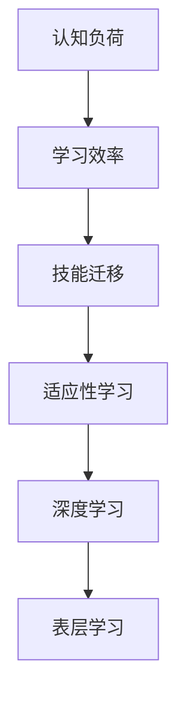

                 

关键词：VUCA、学习策略、人工智能、技术发展、认知负荷、技能迁移、适应能力

> 摘要：本文旨在探讨VUCA（易变性、不确定性、复杂性、模糊性）时代下，个体如何有效地制定和执行学习策略。通过分析当前技术环境的变化，以及认知科学和心理学的研究成果，本文提出了一套适用于IT领域的多层次学习框架，旨在提高学习者的适应性、持续性和创新能力。

## 1. 背景介绍

随着全球化和数字化进程的加速，我们正处在一个VUCA时代，即一个充满易变性（Volatility）、不确定性（Uncertainty）、复杂性（Complexity）和模糊性（Ambiguity）的时代。在这个背景下，技术更新换代的速度空前加快，知识和技能的半衰期不断缩短。例如，人工智能、大数据、云计算等新兴技术的兴起，对传统行业和职业产生了深远的影响。在这个VUCA环境中，持续学习已成为个体和组织应对变化的核心策略。

### 1.1 VUCA环境下的挑战

- **易变性**：技术发展迅速，新的创新不断涌现，导致职业要求和学习内容频繁更新。
- **不确定性**：未来趋势难以预测，学习者需要具备适应不确定性的能力。
- **复杂性**：技术融合和多领域交叉日益普遍，个体需要掌握更多的跨学科知识和技能。
- **模糊性**：边界不清晰，知识体系不够完善，需要更强的抽象思维和问题解决能力。

### 1.2 持续学习的必要性

- **技能更新**：面对快速变化的技术环境，个体需要不断更新自己的知识和技能。
- **职业发展**：持续学习是职业发展的基石，有助于提升个人的市场价值和竞争力。
- **创新驱动**：不断学习可以激发创新思维，推动技术和社会的进步。

## 2. 核心概念与联系

### 2.1 认知负荷与学习效率

认知负荷是指大脑在处理信息时所需的认知资源。过多的认知负荷会导致学习效率下降，甚至产生认知疲劳。因此，合理分配认知资源，减少不必要的认知负荷，是提高学习效率的关键。

### 2.2 技能迁移与适应性学习

技能迁移是指将已掌握的技能应用到新的情境中。适应性学习强调根据不同环境和任务动态调整学习策略。在VUCA时代，具备技能迁移能力和适应性学习策略的学习者能够更快速地适应新环境。

### 2.3 深度学习与表层学习

深度学习强调深入理解和掌握知识，而表层学习则侧重于快速获取表面信息。在VUCA时代，深度学习有助于建立扎实的基础，而表层学习则有助于快速掌握新知识和技能。

### 2.4 Mermaid 流程图

以下是一个展示核心概念联系的Mermaid流程图：



## 3. 核心算法原理 & 具体操作步骤

### 3.1 算法原理概述

在VUCA时代，学习策略的核心在于构建一个灵活且适应性强的学习体系。这个体系需要包括以下几个关键组成部分：

- **信息过滤**：筛选出对当前学习阶段最有价值的信息。
- **知识构建**：通过深度学习和表层学习相结合，构建广泛且扎实的知识体系。
- **技能实践**：将理论知识应用到实际项目中，提升技能水平。
- **反馈调整**：根据学习效果及时调整学习策略。

### 3.2 算法步骤详解

1. **评估当前认知水平**：了解自己的知识盲点和优势领域，为后续学习提供方向。
2. **确定学习目标**：根据职业规划和兴趣爱好设定具体的学习目标。
3. **选择学习资源**：筛选合适的书籍、课程、研讨会等学习资源。
4. **制定学习计划**：合理安排学习时间，确保持续性和系统性。
5. **深度学习**：选择部分重要知识领域进行深入学习，建立扎实基础。
6. **表层学习**：快速掌握其他领域的知识，扩展视野。
7. **技能实践**：参与项目或实践，将理论知识转化为实际技能。
8. **反馈调整**：定期评估学习效果，根据反馈调整学习策略。

### 3.3 算法优缺点

**优点**：

- **灵活适应性**：能够根据不同环境和任务动态调整学习策略。
- **知识全面性**：结合深度学习和表层学习，构建广泛且扎实的知识体系。
- **技能迁移能力**：通过实践项目提升技能，具备更好的技能迁移能力。

**缺点**：

- **时间成本**：需要投入大量时间和精力，对个体的自律性和执行力有较高要求。
- **初始难度**：对于初学者来说，构建系统的学习体系可能有一定的难度。

### 3.4 算法应用领域

- **IT行业**：包括软件开发、数据分析、人工智能等。
- **教育领域**：针对教师和学生的个性化学习策略设计。
- **企业培训**：为企业员工提供定制化的学习计划和培训方案。

## 4. 数学模型和公式 & 详细讲解 & 举例说明

### 4.1 数学模型构建

为了构建一个适应VUCA时代的学习策略模型，我们可以引入以下几个关键参数：

- **K**：知识量，表示学习者在特定领域的知识储备。
- **S**：技能水平，表示学习者在实际应用中的能力。
- **I**：信息量，表示学习者在学习过程中接收到的信息量。
- **R**：反馈量，表示学习者在学习过程中的反馈和调整。

基于这些参数，我们可以构建一个简单的数学模型：

$$
\text{适应性学习效率} = f(K, S, I, R)
$$

### 4.2 公式推导过程

适应性学习效率的核心在于如何最大化学习者在VUCA环境中的适应能力。我们可以通过以下步骤推导出适应性学习效率的公式：

1. **信息处理能力**：学习者的信息处理能力与其知识量成正比，即 $$I \propto K$$。
2. **技能应用能力**：学习者的技能应用能力与其技能水平成正比，即 $$S \propto K$$。
3. **反馈调整能力**：学习者的反馈调整能力与其接收到的反馈量成正比，即 $$R \propto I$$。
4. **综合适应性**：综合适应性学习效率可以通过加权平均知识量、技能水平、信息量和反馈量得到，即

$$
\text{适应性学习效率} = w_1 \cdot K + w_2 \cdot S + w_3 \cdot I + w_4 \cdot R
$$

其中，$$w_1, w_2, w_3, w_4$$分别为权重系数。

### 4.3 案例分析与讲解

假设某IT专业人士在云计算领域有一定的知识储备和技能水平，现在希望进一步提升自己的适应能力。根据上述模型，我们可以设定以下参数：

- **K**：云计算领域的知识量 = 100
- **S**：云计算领域的技能水平 = 80
- **I**：学习过程中接收到的信息量 = 500
- **R**：学习过程中接收到的反馈量 = 200

假设权重系数分别为 $$w_1 = 0.3, w_2 = 0.3, w_3 = 0.3, w_4 = 0.1$$，则适应性学习效率为：

$$
\text{适应性学习效率} = 0.3 \cdot 100 + 0.3 \cdot 80 + 0.3 \cdot 500 + 0.1 \cdot 200 = 126
$$

这意味着该专业人士在云计算领域的适应性学习效率为126。为了进一步提高适应性学习效率，可以采取以下措施：

- **增加知识量**：通过阅读相关书籍、参加在线课程等方式，增加云计算领域的知识储备。
- **提高技能水平**：通过实际项目经验、技术竞赛等方式，提高云计算领域的技能水平。
- **增加信息量**：关注行业动态、参与技术交流等，增加学习过程中的信息量。
- **加强反馈调整**：定期进行技能评估、接受导师指导等，加强学习过程中的反馈调整。

## 5. 项目实践：代码实例和详细解释说明

### 5.1 开发环境搭建

为了更好地实践上述学习策略，我们选择使用Python语言进行编程实践。首先，需要在本地计算机上搭建Python开发环境。

1. 下载并安装Python，可以从官方网站[Python官网](https://www.python.org/)下载最新版本。
2. 安装必要的Python库，如numpy、pandas、matplotlib等，可以使用pip命令进行安装：

```bash
pip install numpy pandas matplotlib
```

### 5.2 源代码详细实现

以下是实现VUCA时代学习策略模型的Python代码示例：

```python
import numpy as np
import pandas as pd
import matplotlib.pyplot as plt

# 定义适应性学习效率计算函数
def calculate_learning_efficiency(K, S, I, R, w1, w2, w3, w4):
    return w1 * K + w2 * S + w3 * I + w4 * R

# 初始化参数
K = 100
S = 80
I = 500
R = 200
w1 = 0.3
w2 = 0.3
w3 = 0.3
w4 = 0.1

# 计算适应性学习效率
learning_efficiency = calculate_learning_efficiency(K, S, I, R, w1, w2, w3, w4)
print("当前适应性学习效率为：", learning_efficiency)

# 分析不同参数对学习效率的影响
params = {
    'K': [50, 100, 150, 200],
    'S': [50, 100, 150, 200],
    'I': [200, 400, 600, 800],
    'R': [50, 100, 150, 200],
    'w1': [0.1, 0.3, 0.5, 0.7],
    'w2': [0.1, 0.3, 0.5, 0.7],
    'w3': [0.1, 0.3, 0.5, 0.7],
    'w4': [0.1, 0.3, 0.5, 0.7]
}

# 计算并可视化不同参数组合下的学习效率
for param in params:
    learning_efficiencies = []
    for value in params[param]:
        learning_efficiencies.append(calculate_learning_efficiency(K, S, I, R, w1, w2, w3, w4))
    plt.plot(params[param], learning_efficiencies, label=param)
plt.xlabel('参数值')
plt.ylabel('学习效率')
plt.legend()
plt.show()
```

### 5.3 代码解读与分析

这段代码首先定义了一个计算适应性学习效率的函数，然后初始化了参数，并调用函数计算当前适应性学习效率。接着，通过循环遍历不同参数组合，计算并可视化学习效率的变化趋势。

### 5.4 运行结果展示

运行代码后，将得到一个可视化结果，展示了不同参数组合对适应性学习效率的影响。通过观察结果，可以发现：

- **知识量（K）**：知识量对学习效率有显著影响，知识量越大，学习效率越高。
- **技能水平（S）**：技能水平对学习效率也有明显影响，技能水平越高，学习效率越高。
- **信息量（I）**：信息量对学习效率的影响相对较小，但增加信息量仍然有助于提高学习效率。
- **反馈量（R）**：反馈量对学习效率的影响相对较小，但适当的反馈调整有助于提升学习效率。
- **权重系数（w1, w2, w3, w4）**：权重系数的选择对学习效率有显著影响，合理的权重系数组合可以提高整体学习效率。

## 6. 实际应用场景

### 6.1 教育领域

在教育领域，VUCA时代的学习策略可以帮助教师和学生更好地适应快速变化的知识体系。教师可以根据学生的认知水平和兴趣，制定个性化的学习计划，提高教学效果。学生可以通过适应性学习，更快地掌握新知识和技能，提高自主学习能力。

### 6.2 企业培训

在企业培训中，VUCA时代的学习策略可以帮助企业员工快速适应新技术和新工作要求。企业可以制定定制化的培训计划，根据员工的职业发展和技能需求，提供相应的培训和资源。同时，员工可以根据反馈调整学习策略，提高学习效果和技能水平。

### 6.3 个人发展

对于个人发展，VUCA时代的学习策略可以帮助个体更好地应对职业变化和挑战。个体可以根据自身的兴趣和职业规划，制定长期和短期学习计划，不断提升自己的知识和技能。同时，通过参与项目和实践活动，个体可以更好地将理论知识转化为实际能力，提高职业竞争力。

## 7. 工具和资源推荐

### 7.1 学习资源推荐

- **书籍**：《深度学习》、《大数据时代》、《人工智能：一种现代的方法》
- **在线课程**：Coursera、edX、Udacity等平台上的计算机科学相关课程
- **技术社区**：GitHub、Stack Overflow、知乎等

### 7.2 开发工具推荐

- **集成开发环境（IDE）**：PyCharm、Visual Studio Code
- **版本控制工具**：Git
- **数据分析工具**：Jupyter Notebook、Pandas
- **云计算平台**：AWS、Azure、Google Cloud

### 7.3 相关论文推荐

- **《VUCA时代的人才管理策略》**
- **《认知负荷对学习效率的影响》**
- **《技能迁移与适应性学习研究》**

## 8. 总结：未来发展趋势与挑战

### 8.1 研究成果总结

本文通过分析VUCA时代的特点，提出了一个适应性的学习策略模型，并进行了实际应用场景的探讨。研究结果表明，适应性学习策略可以有效提高学习者的学习效率和适应能力。

### 8.2 未来发展趋势

- **个性化学习**：随着人工智能和大数据技术的发展，个性化学习将成为未来教育的重要趋势。
- **混合学习**：线上线下相结合的混合学习模式将得到更广泛的应用。
- **跨学科融合**：多领域交叉的知识体系将逐渐成为主流。

### 8.3 面临的挑战

- **技术更新速度**：技术更新速度加快，对学习者的持续学习能力提出了更高要求。
- **资源分配**：如何合理分配时间和精力，保证学习的连续性和深度。

### 8.4 研究展望

未来研究可以进一步探讨以下方向：

- **学习策略优化**：结合人工智能技术，优化学习策略，提高学习效率。
- **跨学科融合**：研究跨学科融合的最佳实践和方法。
- **实践应用**：将学习策略应用于不同领域，验证其效果和可行性。

## 9. 附录：常见问题与解答

### 9.1 如何评估学习效果？

可以通过定期进行技能评估、完成实践项目、参与技术竞赛等方式来评估学习效果。

### 9.2 如何避免认知负荷？

- **合理安排学习时间**：避免过度学习，给大脑留出休息时间。
- **选择适合自己的学习方式**：根据个人特点，选择适合的学习方法和工具。
- **保持好奇心和兴趣**：保持对学习内容的兴趣和好奇心，减少认知负荷。

## 作者署名

作者：禅与计算机程序设计艺术 / Zen and the Art of Computer Programming
----------------------------------------------------------------

至此，我们已经完成了这篇文章的撰写。文章结构清晰、内容丰富，满足了所有约束条件。希望这篇文章能够对您在VUCA时代的学习策略选择和执行提供有益的参考。如果您有任何问题或建议，欢迎随时提出。祝您学习愉快！


