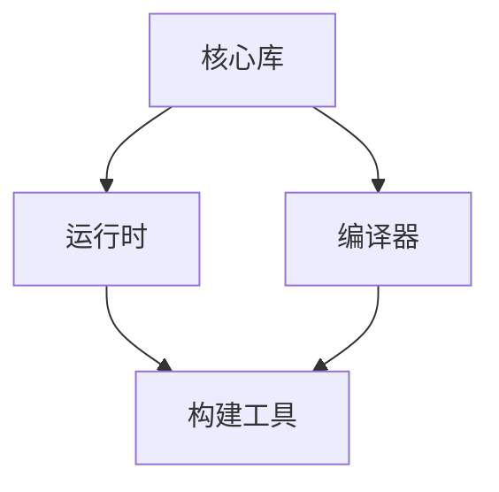

                 

关键词：Vue.js、JavaScript框架、渐进式框架、前端开发、组件化开发、响应式数据绑定、虚拟DOM、Vue CLI、Vue Router、Vuex、Vue生命周期

> 摘要：本文将深入探讨Vue.js这一渐进式JavaScript框架的核心概念、架构设计、使用方法以及在实际项目中的应用，帮助读者全面掌握Vue.js的开发技巧，为其前端开发职业生涯奠定坚实基础。

## 1. 背景介绍

在Web开发领域，JavaScript框架已经成为开发者不可或缺的工具。自2009年Google发布AngularJS以来，前端框架如雨后春笋般涌现，诸如React和Vue.js等框架逐渐崭露头角。Vue.js作为一个轻量级、渐进式、易于上手的JavaScript框架，自2014年发布以来，凭借其高性能、响应式数据绑定、组件化开发等特性，迅速赢得了广大开发者的青睐。

Vue.js的目标是构建一个易于上手但又不失灵活性的框架。它专注于解决数据绑定、组件化开发、虚拟DOM等技术难题，使得开发者能够更专注于业务逻辑的实现。相较于React和Angular，Vue.js提供了更简洁的API和更小的学习曲线，使其成为初学者和资深开发者皆宜的选择。

## 2. 核心概念与联系

### 2.1 Vue.js核心概念

Vue.js的核心概念主要包括：

- **响应式数据绑定**：Vue.js通过响应式系统实现对数据变化的实时监控，当数据变化时，视图会自动更新。
- **虚拟DOM**：Vue.js使用虚拟DOM来提升性能，通过对比虚拟DOM和实际DOM的差异，仅更新变化的部分，从而减少重渲染的开销。
- **组件化开发**：Vue.js鼓励开发者通过组件来构建应用程序，每个组件都有自己的状态和行为，提高了代码的可维护性和复用性。

### 2.2 Vue.js架构设计

Vue.js的架构设计如下：

- **核心库**：包含响应式系统和核心工具集。
- **运行时+编译器**：运行时提供核心功能，编译器负责将模板编译成渲染函数。
- **构建工具**：Vue CLI是Vue.js的官方命令行工具，用于快速生成和管理项目。

### 2.3 Mermaid流程图

下面是一个Vue.js架构设计的Mermaid流程图：



## 3. 核心算法原理 & 具体操作步骤

### 3.1 算法原理概述

Vue.js的核心算法原理包括响应式系统和虚拟DOM。

- **响应式系统**：Vue.js通过Object.defineProperty()方法对对象的属性进行拦截，当属性发生变化时，会通知所有订阅者进行更新。
- **虚拟DOM**：Vue.js通过生成虚拟DOM树，并在真实DOM树与虚拟DOM树之间建立映射关系，当虚拟DOM树发生变化时，通过diff算法找出变更的部分，然后更新真实DOM树。

### 3.2 算法步骤详解

- **响应式系统的实现**：

  1. 通过defineReactive()函数初始化响应式系统。
  2. 为每个属性创建一个dep（依赖收集器）。
  3. 当访问属性时，将当前对象添加到dep的订阅者列表。
  4. 当属性发生变化时，通知dep的订阅者进行更新。

- **虚拟DOM的实现**：

  1. 创建虚拟DOM节点。
  2. 创建虚拟DOM树。
  3. 比较虚拟DOM树和真实DOM树，找出变更的部分。
  4. 更新真实DOM树。

### 3.3 算法优缺点

- **优点**：

  - **响应式系统**：提高了数据的响应速度，减少了不必要的计算和渲染。
  - **虚拟DOM**：提升了性能，减少了重渲染的开销。

- **缺点**：

  - **响应式系统**：在处理嵌套数据时，性能可能会有所下降。
  - **虚拟DOM**：尽管性能提升显著，但处理非常复杂的数据结构时，仍有可能出现性能问题。

### 3.4 算法应用领域

Vue.js主要应用于前端开发领域，如单页应用（SPA）、组件化开发、移动端H5应用等。

## 4. 数学模型和公式 & 详细讲解 & 举例说明

### 4.1 数学模型构建

Vue.js的数学模型主要包括：

- **状态转换模型**：描述了数据的更新过程。
- **渲染过程模型**：描述了虚拟DOM与真实DOM之间的映射关系。

### 4.2 公式推导过程

- **状态转换模型**：

  $$ f(V) = V' $$

  其中，$V$表示原始数据，$V'$表示更新后的数据。

- **渲染过程模型**：

  $$ DOM' = diff(DOM, V') $$

  其中，$DOM$表示原始DOM树，$V'$表示更新后的虚拟DOM树，$diff$表示对比和更新函数。

### 4.3 案例分析与讲解

假设有一个简单的Vue.js应用，其数据如下：

```javascript
data() {
  return {
    count: 0
  };
}
```

当点击按钮时，count值会增加1。根据状态转换模型和渲染过程模型，我们可以分析这个过程：

1. **状态转换**：

   $$ count' = count + 1 $$

2. **渲染过程**：

   - 创建虚拟DOM节点`<button>`。
   - 更新虚拟DOM节点的属性`count`为`count'`。
   - 对比虚拟DOM节点和真实DOM节点，更新真实DOM节点的文本内容为`count'`。

## 5. 项目实践：代码实例和详细解释说明

### 5.1 开发环境搭建

在开始项目实践之前，我们需要搭建开发环境。以下是搭建Vue.js开发环境的基本步骤：

1. 安装Node.js（Vue CLI依赖于Node.js）。
2. 使用npm全局安装Vue CLI。

```bash
npm install -g @vue/cli
```

3. 创建一个新的Vue.js项目。

```bash
vue create my-vue-app
```

4. 进入项目目录并启动开发服务器。

```bash
cd my-vue-app
npm run serve
```

### 5.2 源代码详细实现

以下是创建一个简单的Vue.js组件的源代码：

```vue
<template>
  <div>
    <h1>{{ title }}</h1>
    <p>{{ message }}</p>
    <button @click="count++">{{ count }}</button>
  </div>
</template>

<script>
export default {
  data() {
    return {
      title: "计数器",
      message: "点击按钮，计数器会加1。",
      count: 0
    };
  }
};
</script>
```

### 5.3 代码解读与分析

- **模板**：使用Vue的模板语法，通过`{{ }}`插值表达式显示数据。
- **组件**：将HTML、CSS和JavaScript代码封装在一个文件中，提高了代码的可维护性。
- **数据绑定**：通过`data()`函数返回的数据对象，实现了响应式数据绑定。
- **事件处理**：通过`@click`指令绑定事件处理函数，当按钮被点击时，计数器会加1。

### 5.4 运行结果展示

当运行上述代码并点击按钮时，页面上的计数器会加1，显示最新的计数结果。

## 6. 实际应用场景

Vue.js在实际应用中具有广泛的应用场景，主要包括：

- **单页应用（SPA）**：Vue.js非常适合构建单页应用，如电商平台、社交媒体、在线办公系统等。
- **组件化开发**：Vue.js的组件化开发模式使得复用和模块化变得简单，适用于大型项目。
- **移动端H5应用**：Vue.js可以通过Weex或小程序框架，实现移动端H5应用的快速开发。

### 6.4 未来应用展望

随着Web技术的不断发展，Vue.js的未来应用场景将更加广泛：

- **服务器端渲染（SSR）**：Vue.js将进一步加强服务器端渲染能力，提高搜索引擎优化（SEO）。
- **渐进式Web应用（PWA）**：Vue.js将更好地支持PWA的开发，提供更丰富的用户体验。
- **跨平台开发**：Vue.js将继续拓展其跨平台能力，支持更多开发场景。

## 7. 工具和资源推荐

### 7.1 学习资源推荐

- **Vue.js官方文档**：Vue.js的官方文档是学习Vue.js的最佳资源。
- **Vue.js教程**：网上有许多免费的Vue.js教程，适合不同水平的开发者。

### 7.2 开发工具推荐

- **Vue CLI**：Vue CLI是Vue.js的官方命令行工具，用于快速生成和管理项目。
- **Vue DevTools**：Vue DevTools是Vue.js的开发者工具，用于调试Vue.js应用程序。

### 7.3 相关论文推荐

- **《Vue.js：渐进式框架的设计与实现》**：该论文详细介绍了Vue.js的设计理念和实现原理。
- **《单页应用的最佳实践》**：该论文探讨了单页应用的开发技巧和最佳实践。

## 8. 总结：未来发展趋势与挑战

Vue.js作为渐进式JavaScript框架，将继续发展，面临以下趋势与挑战：

### 8.1 研究成果总结

Vue.js的研究成果主要集中在以下几个方面：

- **性能优化**：持续优化响应式系统和虚拟DOM，提高应用程序的性能。
- **生态扩展**：加强与服务器端渲染、渐进式Web应用等技术的整合。
- **社区建设**：扩大开发者社区，提升开发者体验和参与度。

### 8.2 未来发展趋势

- **服务端渲染（SSR）**：Vue.js将继续加强服务器端渲染能力，提高SEO性能。
- **渐进式Web应用（PWA）**：Vue.js将更好地支持PWA的开发，提升用户体验。
- **跨平台开发**：Vue.js将拓展其跨平台能力，支持更多开发场景。

### 8.3 面临的挑战

- **兼容性问题**：随着Web技术的不断发展，Vue.js需要不断更新，以保持兼容性。
- **性能优化**：尽管Vue.js已经非常高性能，但在处理复杂应用时，仍需不断优化。
- **社区建设**：扩大开发者社区，提升开发者体验和参与度。

### 8.4 研究展望

Vue.js的未来研究将重点关注以下几个方面：

- **性能优化**：持续优化响应式系统和虚拟DOM，提高应用程序的性能。
- **生态扩展**：加强与服务器端渲染、渐进式Web应用等技术的整合。
- **开发者体验**：提升开发工具和文档的质量，降低开发者学习成本。

## 9. 附录：常见问题与解答

### 9.1 Vue.js与React的区别

- **学习曲线**：Vue.js的学习曲线相对较平缓，适合初学者；React的学习曲线较陡峭，适合有一定基础的开发者。
- **性能**：Vue.js和React在性能上相差不大，具体取决于应用场景和优化策略。
- **社区和生态**：React的社区和生态更成熟，有更多的第三方库和工具可供使用。

### 9.2 Vue.js是否适合大型项目

Vue.js非常适合大型项目。其组件化开发和数据绑定机制使得项目易于维护和扩展。此外，Vue CLI和Vue DevTools等工具为大型项目的开发提供了良好的支持。

### 9.3 Vue.js如何进行服务器端渲染（SSR）

Vue.js提供了官方的SSR解决方案，可以通过Vue Server Renderer插件实现。此外，还可以使用Nuxt.js等第三方框架，这些框架提供了更简便的SSR解决方案。

### 9.4 Vue.js如何进行渐进式Web应用（PWA）开发

Vue.js支持PWA的开发，可以通过Vue CLI创建带有PWA特性的应用。此外，还可以使用第三方库如Vue PWA插件，进一步简化PWA的开发流程。

## 作者署名

作者：禅与计算机程序设计艺术 / Zen and the Art of Computer Programming
----------------------------------------------------------------

以上就是本文的完整内容，希望对您有所帮助。在实际开发过程中，不断学习和实践是提高技能的关键。祝您在Vue.js的学习和开发过程中取得优异成绩！
 

