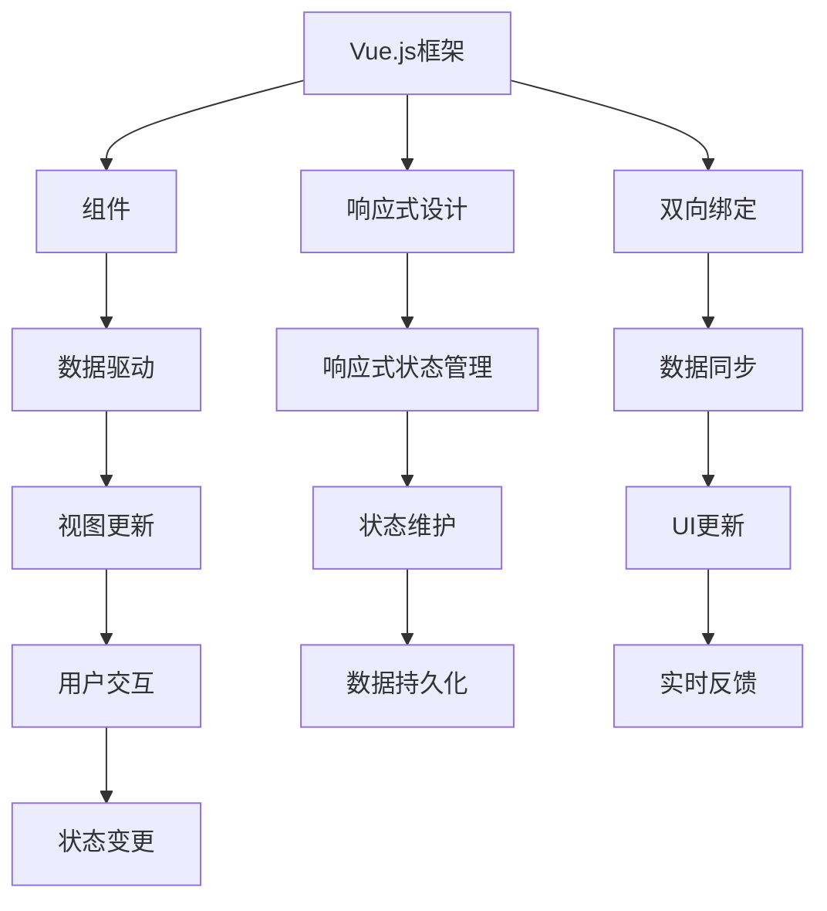

                 

关键词：Vue.js, 渐进式框架，JavaScript，前端开发，组件化，双向绑定，响应式设计，性能优化，技术选型，最佳实践。

## 摘要

本文旨在深入探讨 Vue.js 框架的核心特点，包括其渐进式的开发模式、组件化设计、双向绑定机制和响应式架构。通过对 Vue.js 的全面剖析，我们将分析其在现代前端开发中的优势、应用场景以及未来发展趋势。文章还将提供实用的工具和资源推荐，帮助开发者更好地掌握 Vue.js 技术，实现高效的前端开发。

## 1. 背景介绍

### 1.1 Vue.js 的诞生

Vue.js 是由尤雨溪（Evan You）于 2014 年创立的一个渐进式 JavaScript 框架。它的设计理念源于尤雨溪在 GoogleChrome 团队的工作经历，以及对前端开发中常见痛点的深刻理解。Vue.js 的目标是提供一种简洁、易用且高性能的解决方案，帮助开发者更高效地构建现代 Web 应用。

### 1.2 前端开发的演进

随着互联网的迅猛发展，前端开发领域经历了巨大的变革。从最早的 HTML、CSS 和 JavaScript，到后来的框架如 jQuery，再到现代框架如 React、Vue 和 Angular，前端技术逐渐向模块化、组件化和响应式设计方向发展。Vue.js 正是在这一背景下诞生，并迅速获得了广泛的关注和认可。

## 2. 核心概念与联系

Vue.js 的核心概念包括组件（Components）、双向绑定（Two-way Data Binding）和响应式设计（Reactive Design）。以下是一个简化的 Mermaid 流程图，展示了这些概念之间的关系：



### 2.1 组件（Components）

组件是 Vue.js 的核心构建块。它们允许开发者将 UI 切分成独立的、可复用的部分，提高代码的可维护性和可扩展性。组件可以包含自己的数据、方法、生命周期钩子和模板。

### 2.2 响应式设计（Reactive Design）

响应式设计是 Vue.js 的另一个重要特点。它通过观察和跟踪数据的变化，自动更新关联的视图。这种设计模式使得开发者无需手动操作 DOM，从而提高了开发效率和代码的简洁性。

### 2.3 双向绑定（Two-way Data Binding）

双向绑定是 Vue.js 的核心机制之一。它使得数据层和视图层之间的数据同步变得更加简单和直观。当数据发生变化时，视图会自动更新；反之亦然。

## 3. 核心算法原理 & 具体操作步骤

### 3.1 算法原理概述

Vue.js 使用了数据劫持结合依赖收集和渲染watcher的原理。通过Object.defineProperty，Vue能够侦测对象内部属性的变化。当组件的data对象更新时，Vue会自动触发相关watcher的更新，从而重新渲染视图。

### 3.2 算法步骤详解

1. **数据初始化**：Vue 初始化时，通过 Object.defineProperty 将 data 对象的所有属性转换为getter/setter。
2. **依赖收集**：当组件渲染时，Vue 会遍历模板，找到所有与 data 属性相关的节点，并将其注册为依赖。
3. **数据变化侦测**：当 data 属性发生变化时，setter 会被触发，从而通知依赖的watcher进行更新。
4. **视图更新**：watcher 根据新的数据值重新计算组件的渲染结果，并更新 DOM。

### 3.3 算法优缺点

**优点**：
- **数据驱动**：简化了开发者对 DOM 操作的需求，提高了开发效率。
- **双向绑定**：自动同步数据和视图，减少了手动编写的代码量。

**缺点**：
- **性能优化**：在大规模应用中，由于大量的依赖关系，可能导致性能下降。
- **对象嵌套限制**：Vue.js 不能很好地处理深层嵌套的对象。

### 3.4 算法应用领域

Vue.js 适用于中小型应用以及需要快速迭代的项目。它特别适合于单页面应用（SPA）和组件化开发，是目前前端开发中最受欢迎的框架之一。

## 4. 数学模型和公式 & 详细讲解 & 举例说明

### 4.1 数学模型构建

Vue.js 的响应式设计基于一个简单的数学模型，即观察者模式。假设有一个被观察的变量 `X` 和一个观察者函数 `f`，当 `X` 的值发生变化时，`f` 函数会被自动调用。

### 4.2 公式推导过程

观察者模式可以用以下公式表示：

\[ f(X) \]

其中，`X` 是被观察的变量，`f` 是观察者函数。

### 4.3 案例分析与讲解

假设我们有一个简单的 Vue 组件，其 data 中有一个属性 `count`，我们需要在视图上显示 `count` 的值，并且当 `count` 变化时更新视图。

```javascript
new Vue({
  el: '#app',
  data: {
    count: 1
  }
});
```

此时，Vue 会将 `count` 属性转换为 getter/setter，并在模板中找到与 `count` 相关的节点。当 `count` 的值发生变化时，setter 会触发，从而重新渲染视图。

```html
<div id="app">
  <p>{{ count }}</p>
  <button @click="increment">Increment</button>
</div>

<script>
methods: {
  increment() {
    this.count++;
  }
}
</script>
```

在这个例子中，当用户点击按钮时，`count` 的值会递增，Vue 会自动更新视图，显示新的 `count` 值。

## 5. 项目实践：代码实例和详细解释说明

### 5.1 开发环境搭建

为了开始使用 Vue.js，您需要首先安装 Node.js 环境，然后使用 Vue CLI 创建一个新的 Vue 项目。

```shell
npm install -g @vue/cli
vue create my-vue-app
cd my-vue-app
npm run serve
```

### 5.2 源代码详细实现

以下是一个简单的 Vue 组件示例，用于展示 Vue 的基本用法。

```html
<template>
  <div>
    <h1>{{ title }}</h1>
    <p>{{ message }}</p>
    <button @click="updateMessage">Update Message</button>
  </div>
</template>

<script>
export default {
  data() {
    return {
      title: 'Vue.js Example',
      message: 'Hello Vue!'
    };
  },
  methods: {
    updateMessage() {
      this.message = 'Message Updated';
    }
  }
};
</script>
```

### 5.3 代码解读与分析

在这个例子中，我们创建了一个名为 `App` 的 Vue 组件。它包含一个标题和一个段落文本，并且有一个按钮可以更新段落文本。

- **模板**：使用 `{{ }}` 双花括号语法来插入数据。
- **方法**：使用 `methods` 对象定义组件的方法。
- **事件绑定**：使用 `@click` 指令将方法绑定到按钮的点击事件。

当用户点击按钮时，`updateMessage` 方法会被调用，导致组件的 `message` 数据更新，从而触发视图重新渲染。

### 5.4 运行结果展示

运行上述代码后，您将在浏览器中看到一个简单的页面，其中包含一个标题、一个段落和一个按钮。点击按钮时，段落文本会更新。

## 6. 实际应用场景

### 6.1 企业级应用

Vue.js 在企业级应用中有着广泛的应用。例如，在电子商务、在线教育、金融科技等领域，Vue.js 被用于构建高性能的单页面应用（SPA），提供流畅的用户体验。

### 6.2 小型项目

对于小型项目，Vue.js 的渐进式特性使得开发者可以仅使用 Vue 的核心库，而不必引入复杂的工具链。这种灵活性使得 Vue.js 成为小型项目的理想选择。

### 6.3 个人项目

Vue.js 也非常适合个人开发者进行个人项目的开发。其简洁的语法和强大的社区支持，使得开发者可以快速上手并实现功能丰富的应用。

## 7. 工具和资源推荐

### 7.1 学习资源推荐

- Vue.js 官方文档（[https://vuejs.org/](https://vuejs.org/)）：Vue.js 的官方文档是学习 Vue.js 的最佳资源。
- 《Vue.js实战》一书：由李立杰著，详细介绍了 Vue.js 的基本概念和应用实践。

### 7.2 开发工具推荐

- Vue CLI：Vue CLI 是 Vue.js 的官方脚手架工具，用于快速创建 Vue 项目。
- Vite：Vite 是一个快速、现代的构建工具，专为 Vue.js 项目设计。

### 7.3 相关论文推荐

- “Vue.js: A Progressive JavaScript Framework for Building UI” by Evan You：尤雨溪关于 Vue.js 的原创论文，介绍了 Vue.js 的核心设计理念。

## 8. 总结：未来发展趋势与挑战

### 8.1 研究成果总结

Vue.js 自发布以来，已迅速成为前端开发领域的主流框架之一。其渐进式的设计理念、简洁的语法和高效的数据绑定机制，使得 Vue.js 在各类项目中都表现出色。

### 8.2 未来发展趋势

随着 Web 技术的不断进步，Vue.js 也将在以下几个方面持续发展：

- **性能优化**：通过技术创新，进一步提升 Vue.js 的运行性能。
- **生态系统扩展**：完善 Vue.js 的生态系统，包括 UI 库、服务端渲染和集成工具等。
- **国际化与多语言支持**：增强 Vue.js 的国际化特性，支持更多语言。

### 8.3 面临的挑战

- **性能优化**：在大规模应用中，Vue.js 需要进一步提升性能，以应对更复杂的业务需求。
- **学习曲线**：虽然 Vue.js 相对容易上手，但面对复杂的应用场景，开发者仍需深入学习和理解其内部机制。

### 8.4 研究展望

Vue.js 在未来将继续保持其在前端开发领域的重要地位。通过不断的技术创新和社区合作，Vue.js 将为开发者带来更多便利和可能性。

## 9. 附录：常见问题与解答

### 9.1 Vue.js 与 React 的区别？

Vue.js 和 React 都是现代前端开发中流行的框架，但它们在架构和设计理念上有所不同。React 更倾向于组件化和函数式编程，而 Vue.js 则更注重简洁性和易用性。React 使用 JSX 语法，Vue.js 使用模板语法。两者都有各自的优缺点，选择哪个框架取决于项目的具体需求和开发者的个人喜好。

### 9.2 Vue.js 是否支持服务端渲染（SSR）？

是的，Vue.js 支持服务端渲染。通过使用 Vue SSR，可以将 Vue.js 应用的渲染过程移至服务器端，从而提高首屏加载速度和搜索引擎优化（SEO）性能。Vue SSR 还支持基于 Node.js 的服务器端框架，如 Express。

### 9.3 Vue.js 是否支持移动端开发？

Vue.js 本身并不直接支持移动端开发，但通过与其他框架和库的集成，如 Weex、Uni-app 等，Vue.js 可以用于移动端应用的开发。这些框架和库提供了跨平台的移动应用开发能力，使得 Vue.js 成为移动开发领域的有力竞争者。

---

作者：禅与计算机程序设计艺术 / Zen and the Art of Computer Programming

本文对 Vue.js 框架的特点进行了深入探讨，从其渐进式开发模式、组件化设计、双向绑定机制和响应式架构等方面全面剖析了 Vue.js 在现代前端开发中的优势和应用场景。通过实际项目实践和代码实例，读者可以更好地理解 Vue.js 的实际应用。随着 Web 技术的不断进步，Vue.js 将继续在未来的前端开发中扮演重要角色。|

