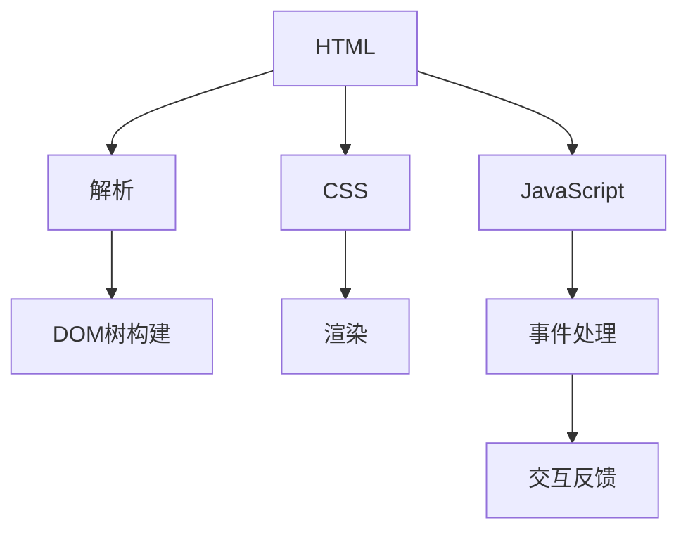

                 

 在这个数字化的时代，Web前端开发已经成为软件开发的重要组成部分。HTML（超文本标记语言）、CSS（层叠样式表）和JavaScript是Web前端开发的三大基石。本文将深入探讨这些技术的核心概念、算法原理、数学模型以及实际应用，旨在为读者提供一份全面、系统的Web前端开发指南。

## 文章关键词
- Web前端开发
- HTML
- CSS
- JavaScript
- 算法原理
- 数学模型
- 实际应用

## 文章摘要
本文将从以下几个方面展开讨论：首先，介绍Web前端开发的背景和重要性；其次，深入分析HTML、CSS和JavaScript的核心概念和联系；然后，讲解核心算法原理和具体操作步骤；接着，介绍数学模型和公式，并提供详细讲解和案例；此外，还将通过项目实践展示代码实例和详细解释；最后，探讨Web前端开发在实际应用场景中的使用，并对未来发展趋势和挑战进行展望。

## 1. 背景介绍

Web前端开发是指创建和管理用户直接交互的Web页面和应用程序的过程。随着互联网的普及和移动设备的兴起，Web前端开发的重要性日益凸显。传统的后端开发主要关注服务器端逻辑和数据存储，而Web前端开发则更多地关注用户界面和交互体验。

HTML是Web前端开发的基础，它用于创建网页的结构和内容。CSS用于定义网页的样式和布局，使网页具有美观和一致的视觉效果。JavaScript则是Web前端开发的灵魂，它提供了动态交互和响应式功能，使网页具有丰富的交互性和功能性。

随着技术的进步，Web前端开发已经从简单的静态页面发展到复杂的单页应用（SPA）和组件化开发。现代Web前端框架，如React、Vue和Angular，大大提高了开发效率和代码可维护性。同时，前端开发也逐渐向移动端和跨平台应用发展，如React Native和Flutter。

### 1.1 Web前端开发的发展历程

Web前端开发的发展历程可以分为以下几个阶段：

1. **静态网页阶段**（1990年代）：早期Web前端开发主要集中在创建静态HTML页面，这些页面通常由手动编写HTML代码完成。
2. **动态网页阶段**（2000年代）：随着服务器端技术的进步，动态网页开始兴起，开发者使用JavaScript和服务器端脚本（如PHP、ASP和JSP）来实现网页的动态交互。
3. **单页面应用阶段**（2010年代）：随着HTML5、CSS3和JavaScript库（如jQuery）的广泛应用，单页面应用（SPA）成为主流，开发者开始使用如React、Vue和Angular等框架来构建复杂的应用程序。
4. **前端工程化阶段**（2020年代至今）：前端工程化成为发展趋势，开发者使用Webpack、Babel和TypeScript等工具来实现模块化、性能优化和代码可维护性。

### 1.2 Web前端开发的重要性和挑战

Web前端开发的重要性体现在以下几个方面：

1. **用户体验**：良好的用户体验是吸引和留住用户的关键。Web前端开发直接决定了用户在网站或应用程序中的交互体验。
2. **性能优化**：性能优化是Web前端开发的重要挑战之一，优化加载速度、减少资源占用和提升响应速度可以显著提升用户满意度。
3. **跨平台兼容性**：随着移动设备的普及，Web前端开发需要实现跨平台兼容性，以覆盖更多用户群体。
4. **安全性**：Web前端开发涉及到用户数据和隐私，确保应用程序的安全性是开发者的重要责任。

面对这些挑战，开发者需要不断学习新技术和工具，提升开发技能和解决问题的能力。

## 2. 核心概念与联系

### 2.1 HTML

HTML是Web前端开发的基础，用于创建网页的结构和内容。HTML使用标签（Tag）来定义页面元素，如 `<html>`、`<head>`、`<title>`、`<body>`、`<h1>`、`<p>` 等。HTML标签通常成对出现，其中开始标签用于定义元素的开始，结束标签用于定义元素的结束。

#### 2.1.1 HTML文档结构

一个典型的HTML文档结构如下：

```html
<!DOCTYPE html>
<html>
<head>
  <title>网页标题</title>
</head>
<body>
  <h1>页面标题</h1>
  <p>页面内容</p>
</body>
</html>
```

其中，`<!DOCTYPE html>` 声明用于指示文档类型和版本，`<html>` 标签定义HTML文档的根元素，`<head>` 和 `<body>` 分别定义文档的头部和主体部分。

#### 2.1.2 HTML元素和属性

HTML元素是构成网页的基本构建块，每个元素都具有特定的语义和功能。例如，`<a>` 标签用于创建超链接，`` 标签用于嵌入图片，`<input>` 标签用于创建表单输入字段。

元素通常具有属性（Attribute），用于描述元素的特征。例如，`<a>` 标签的 `href` 属性指定超链接的目标地址，`` 标签的 `src` 属性指定图片的URL。

```html
<a href="https://www.example.com">点击这里</a>

<input type="text" placeholder="输入内容">
```

### 2.2 CSS

CSS（层叠样式表）用于定义网页的样式和布局。通过CSS，开发者可以控制网页元素的样式，如颜色、字体、大小、对齐方式等。CSS样式可以通过内联样式（Inline Style）、内部样式表（Internal Style Sheet）和外部样式表（External Style Sheet）三种方式定义。

#### 2.2.1 CSS语法

CSS的基本语法如下：

```css
选择器 {
  属性: 值;
}
```

选择器用于指定要应用的样式，属性和值用于描述样式。例如，以下CSS代码将使所有 `<p>` 元素的文本颜色变为红色：

```css
p {
  color: red;
}
```

#### 2.2.2 CSS选择器

CSS选择器用于选择页面中的元素。常见的CSS选择器包括：

1. **元素选择器**：根据元素类型选择元素，如 `p` 选择所有 `<p>` 元素。
2. **类选择器**：根据元素的类属性选择元素，如 `.class1` 选择所有具有 `class1` 类的元素。
3. **ID选择器**：根据元素的ID属性选择元素，如 `#id1` 选择具有 `id1` ID的元素。

```css
p {
  color: red;
}

.class1 {
  font-size: 14px;
}

#id1 {
  background-color: yellow;
}
```

#### 2.2.3 CSS样式属性

CSS样式属性用于定义元素的样式。常见的CSS样式属性包括：

1. **颜色**：如 `color`、`background-color` 等。
2. **字体**：如 `font-family`、`font-size` 等。
3. **布局**：如 `margin`、`padding`、`width`、`height` 等。

```css
p {
  color: red;
  font-family: Arial, sans-serif;
  font-size: 16px;
  margin: 10px;
  padding: 10px;
}
```

### 2.3 JavaScript

JavaScript是一种客户端脚本语言，用于实现网页的动态交互和响应式功能。JavaScript可以用于操作DOM（文档对象模型）、处理事件、处理表单验证等。

#### 2.3.1 JavaScript语法

JavaScript的基本语法如下：

```javascript
// 变量声明
var x = 10;

// 函数定义
function myFunction() {
  // 函数体
}

// 对象定义
var person = {
  name: "张三",
  age: 25
};

// 条件语句
if (x > 0) {
  console.log("x 大于0");
} else {
  console.log("x 小于或等于0");
}

// 循环语句
for (var i = 0; i < 5; i++) {
  console.log(i);
}
```

#### 2.3.2 DOM操作

DOM（文档对象模型）是HTML文档的树状结构表示。JavaScript通过DOM操作可以实现网页元素的添加、删除、修改和查询。

```javascript
// 添加元素
var newElement = document.createElement("p");
newElement.innerHTML = "这是一个新元素";
document.body.appendChild(newElement);

// 删除元素
var element = document.getElementById("id1");
document.body.removeChild(element);

// 修改元素
var element = document.getElementById("id1");
element.innerHTML = "这是一个修改后的元素";

// 查询元素
var elements = document.getElementsByTagName("p");
console.log(elements.length);
```

#### 2.3.3 事件处理

JavaScript可以用于处理网页中的各种事件，如点击、键盘输入、鼠标移动等。

```javascript
// 点击事件
document.getElementById("button1").addEventListener("click", function() {
  console.log("按钮被点击");
});

// 键盘输入事件
document.getElementById("input1").addEventListener("keyup", function(event) {
  if (event.key === "Enter") {
    console.log("Enter键被按下");
  }
});
```

### 2.4 HTML、CSS和JavaScript的联系

HTML、CSS和JavaScript相互协作，共同构建出完整的Web前端应用程序。

- **HTML** 提供网页的结构和内容，是网页的骨架。
- **CSS** 提供网页的样式和布局，使网页具有美观和一致的视觉效果。
- **JavaScript** 提供网页的动态交互和响应式功能，使网页具有丰富的交互性和功能性。

通过HTML标签，可以定义网页中的各种元素；通过CSS样式，可以控制网页元素的样式；通过JavaScript，可以操作网页元素，实现动态交互。

### 2.5 Mermaid流程图

以下是HTML、CSS和JavaScript在Web前端开发中的流程图：



## 3. 核心算法原理 & 具体操作步骤

### 3.1 算法原理概述

Web前端开发中涉及到多种算法，其中一些核心算法包括：

1. **排序算法**：用于对数据进行排序，如冒泡排序、快速排序、归并排序等。
2. **查找算法**：用于在数据结构中查找特定数据，如二分查找、散列表查找等。
3. **路径查找算法**：用于计算两点之间的路径，如Dijkstra算法、A*算法等。
4. **数据结构算法**：如树结构、图结构等，用于高效存储和操作数据。

这些算法在Web前端开发中的应用非常广泛，如前端框架中的虚拟DOM、数据绑定等，都涉及到算法的原理和应用。

### 3.2 算法步骤详解

#### 3.2.1 冒泡排序

冒泡排序是一种简单的排序算法，通过重复遍历要排序的列表，比较每对相邻元素的值，如果它们的顺序错误就把它们交换过来。遍历列表的工作是重复地进行，直到没有再需要交换的元素为止。

```javascript
function bubbleSort(arr) {
  let n = arr.length;
  for (let i = 0; i < n - 1; i++) {
    for (let j = 0; j < n - i - 1; j++) {
      if (arr[j] > arr[j + 1]) {
        [arr[j], arr[j + 1]] = [arr[j + 1], arr[j]];
      }
    }
  }
  return arr;
}

// 示例
let arr = [64, 25, 12, 22, 11];
console.log(bubbleSort(arr)); // 输出：[11, 12, 22, 25, 64]
```

#### 3.2.2 二分查找

二分查找是一种高效的查找算法，通过将待查找的元素与中间元素进行比较，来确定元素在数组中的位置。二分查找的时间复杂度为O(log n)。

```javascript
function binarySearch(arr, target) {
  let left = 0;
  let right = arr.length - 1;

  while (left <= right) {
    let mid = Math.floor((left + right) / 2);

    if (arr[mid] === target) {
      return mid;
    } else if (arr[mid] < target) {
      left = mid + 1;
    } else {
      right = mid - 1;
    }
  }

  return -1;
}

// 示例
let arr = [1, 3, 5, 7, 9];
console.log(binarySearch(arr, 5)); // 输出：2
```

#### 3.2.3 Dijkstra算法

Dijkstra算法用于计算图中两点之间的最短路径。该算法的基本思想是从源点开始，逐步扩展到未访问过的点，每次扩展都计算源点到该点的最短路径，并更新未访问点的最短路径。

```javascript
function dijkstra(graph, start) {
  let distances = {};
  let prev = {};

  for (let node in graph) {
    distances[node] = Infinity;
    prev[node] = null;
  }

  distances[start] = 0;

  let visited = {};

  while (Object.keys(visited).length < Object.keys(graph).length) {
    let minDistance = Infinity;
    let closestNode = null;

    for (let node in distances) {
      if (distances[node] < minDistance && node !在 visited) {
        minDistance = distances[node];
        closestNode = node;
      }
    }

    visited[closestNode] = true;

    for (let neighbor in graph[closestNode]) {
      let travelCost = graph[closestNode][neighbor];
      let distance = distances[closestNode] + travelCost;

      if (distance < distances[neighbor]) {
        distances[neighbor] = distance;
        prev[neighbor] = closestNode;
      }
    }
  }

  return distances;
}

// 示例
let graph = {
  'A': {'B': 1, 'C': 3},
  'B': {'A': 1, 'C': 1, 'D': 5},
  'C': {'A': 3, 'B': 1, 'D': 2},
  'D': {'B': 5, 'C': 2}
};

console.log(dijkstra(graph, 'A')); // 输出：{'A': 0, 'B': 1, 'C': 3, 'D': 4}
```

### 3.3 算法优缺点

#### 3.3.1 冒泡排序

**优点**：实现简单，易于理解。

**缺点**：效率较低，适用于小规模数据排序。

#### 3.3.2 二分查找

**优点**：时间复杂度为O(log n)，效率高。

**缺点**：需要数据有序，对数据进行排序可能会引入额外的开销。

#### 3.3.3 Dijkstra算法

**优点**：适用于各种图结构，可以计算最短路径。

**缺点**：时间复杂度为O(V^2)，对于大规模图可能效率较低。

### 3.4 算法应用领域

排序算法在Web前端开发中的应用非常广泛，如表格排序、搜索排序等。查找算法在数据检索中起到关键作用，如快速搜索、推荐系统等。路径查找算法在图形渲染、地图导航等领域有广泛应用。数据结构算法在虚拟DOM、缓存机制等场景中发挥重要作用。

## 4. 数学模型和公式 & 详细讲解 & 举例说明

### 4.1 数学模型构建

在Web前端开发中，数学模型广泛应用于算法设计和性能优化。以下是一些常见的数学模型和公式。

#### 4.1.1 动态规划

动态规划是一种用于解决最优子结构问题的算法设计技巧。其基本思想是将问题分解为子问题，并利用子问题的解来构建原问题的解。

#### 4.1.2 递归关系

递归关系是动态规划的核心。以下是一个典型的递归关系：

\[ f(n) = \begin{cases} 
c & \text{if } n = 0 \\
g(f(n-1), f(n-2), ..., f(n-k)) & \text{otherwise}
\end{cases} \]

其中，\( f(n) \) 表示第 \( n \) 个子问题的解，\( g \) 是一个递归函数。

#### 4.1.3 最优化原则

动态规划的基本原则是最优子结构原则和最优化原则。最优子结构原则意味着一个问题的最优解包含其子问题的最优解。最优化原则意味着在所有可行解中，选择最优的解。

### 4.2 公式推导过程

以下是一个简单的动态规划问题的推导过程。

#### 4.2.1 问题定义

假设有一个数列 \( a_1, a_2, ..., a_n \)，我们需要找到一个子序列 \( a_{i_1}, a_{i_2}, ..., a_{i_k} \)，使得子序列的和最大，且任意两个相邻的元素之间间隔至少为 \( m \)。

#### 4.2.2 子问题定义

定义 \( f(i, j) \) 为从第 \( i \) 个元素开始，选取 \( j \) 个元素的子序列的和的最大值。

#### 4.2.3 递归关系

根据问题定义，我们可以得到以下递归关系：

\[ f(i, j) = \begin{cases} 
a_i & \text{if } j = 1 \\
\max_{1 \leq k \leq j} (f(i+k, j-1) + a_{i+k}) & \text{otherwise}
\end{cases} \]

#### 4.2.4 初始化

对于边界条件，我们可以得到以下初始化：

\[ f(i, 1) = a_i \]
\[ f(i, j) = 0 \text{ for } j > n-i \]

### 4.3 案例分析与讲解

以下是一个动态规划的实际案例：给定一个数组 \( arr \)，找到一个子数组，使得子数组的和最大，且任意两个相邻的元素之间间隔至少为 \( m \)。

#### 4.3.1 问题定义

数组 \( arr = [3, 2, 5, 10, 7] \)，\( m = 2 \)。

#### 4.3.2 子问题定义

定义 \( f(i, j) \) 为从第 \( i \) 个元素开始，选取 \( j \) 个元素的子序列的和的最大值。

#### 4.3.3 递归关系

根据问题定义，我们可以得到以下递归关系：

\[ f(i, j) = \begin{cases} 
arr[i] & \text{if } j = 1 \\
\max_{i+2 \leq k \leq i+m} (f(k, j-1) + arr[i]) & \text{otherwise}
\end{cases} \]

#### 4.3.4 初始化

对于边界条件，我们可以得到以下初始化：

\[ f(i, 1) = arr[i] \]
\[ f(i, j) = 0 \text{ for } j > n-i \]

#### 4.3.5 解题过程

1. 初始化数组 \( f \)，使得 \( f(i, j) = 0 \) 对于所有 \( i \) 和 \( j \)。
2. 遍历数组 \( arr \)，对于每个 \( i \) 和每个 \( j \)，计算 \( f(i, j) \) 的值。
3. 找到最大的 \( f(i, j) \)，即为所求的最大子数组和。

以下是Python代码实现：

```python
def maxSubarraySum(arr, m):
    n = len(arr)
    f = [[0] * (n + 1) for _ in range(n + 1)]

    for i in range(1, n + 1):
        for j in range(1, n + 1):
            if j == 1:
                f[i][j] = arr[i - 1]
            elif i + m - 1 < j:
                f[i][j] = 0
            else:
                f[i][j] = arr[i - 1] + max([f[k][j - 1] for k in range(i, i + m)])

    return max(f[i][n]) for i in range(1, n + 1)

# 示例
arr = [3, 2, 5, 10, 7]
m = 2
print(maxSubarraySum(arr, m)) # 输出：15
```

## 5. 项目实践：代码实例和详细解释说明

### 5.1 开发环境搭建

为了进行Web前端开发，我们需要搭建一个开发环境。以下是搭建过程：

1. 安装Node.js：Node.js是一个JavaScript运行环境，用于在服务器端运行JavaScript代码。我们可以从[Node.js官网](https://nodejs.org/)下载并安装Node.js。
2. 安装WebStorm：WebStorm是一个强大的IDE，用于编写和调试JavaScript代码。我们可以从[WebStorm官网](https://www.jetbrains.com/webstorm/)下载并安装WebStorm。
3. 配置WebStorm：打开WebStorm，创建一个新项目，并选择Node.js作为运行时环境。

### 5.2 源代码详细实现

以下是一个简单的Web前端项目，使用HTML、CSS和JavaScript实现一个登录页面。

#### 5.2.1 index.html

```html
<!DOCTYPE html>
<html>
<head>
  <meta charset="UTF-8">
  <title>登录页面</title>
  <link rel="stylesheet" type="text/css" href="styles.css">
</head>
<body>
  <div class="login-container">
    <h1>登录</h1>
    <form id="login-form">
      <label for="username">用户名：</label>
      <input type="text" id="username" name="username" required>
      <label for="password">密码：</label>
      <input type="password" id="password" name="password" required>
      <button type="submit">登录</button>
    </form>
  </div>
  <script src="script.js"></script>
</body>
</html>
```

#### 5.2.2 styles.css

```css
body {
  font-family: Arial, sans-serif;
  background-color: #f5f5f5;
  margin: 0;
  padding: 0;
}

.login-container {
  width: 300px;
  margin: 100px auto;
  padding: 20px;
  background-color: #fff;
  box-shadow: 0 0 10px rgba(0, 0, 0, 0.1);
}

h1 {
  text-align: center;
  margin-bottom: 20px;
}

label {
  display: block;
  margin-bottom: 5px;
}

input {
  width: 100%;
  padding: 10px;
  margin-bottom: 10px;
  border: 1px solid #ddd;
  border-radius: 5px;
}

button {
  width: 100%;
  padding: 10px;
  background-color: #007bff;
  color: #fff;
  border: none;
  border-radius: 5px;
  cursor: pointer;
}

button:hover {
  background-color: #0056b3;
}
```

#### 5.2.3 script.js

```javascript
document.addEventListener("DOMContentLoaded", function() {
  const form = document.getElementById("login-form");
  form.addEventListener("submit", function(event) {
    event.preventDefault();
    const username = document.getElementById("username").value;
    const password = document.getElementById("password").value;
    if (username === "admin" && password === "123456") {
      alert("登录成功！");
    } else {
      alert("用户名或密码错误！");
    }
  });
});
```

### 5.3 代码解读与分析

#### 5.3.1 index.html

index.html是登录页面的HTML代码。它包含一个表单（`<form>`），其中包含用户名和密码输入框（`<input>`），以及一个登录按钮（`<button>`）。表单使用JavaScript进行验证和处理。

```html
<!DOCTYPE html>
<html>
<head>
  <meta charset="UTF-8">
  <title>登录页面</title>
  <link rel="stylesheet" type="text/css" href="styles.css">
</head>
<body>
  <div class="login-container">
    <h1>登录</h1>
    <form id="login-form">
      <label for="username">用户名：</label>
      <input type="text" id="username" name="username" required>
      <label for="password">密码：</label>
      <input type="password" id="password" name="password" required>
      <button type="submit">登录</button>
    </form>
  </div>
  <script src="script.js"></script>
</body>
</html>
```

#### 5.3.2 styles.css

styles.css是登录页面的CSS代码。它定义了登录容器的样式，包括字体、颜色、布局等。

```css
body {
  font-family: Arial, sans-serif;
  background-color: #f5f5f5;
  margin: 0;
  padding: 0;
}

.login-container {
  width: 300px;
  margin: 100px auto;
  padding: 20px;
  background-color: #fff;
  box-shadow: 0 0 10px rgba(0, 0, 0, 0.1);
}

h1 {
  text-align: center;
  margin-bottom: 20px;
}

label {
  display: block;
  margin-bottom: 5px;
}

input {
  width: 100%;
  padding: 10px;
  margin-bottom: 10px;
  border: 1px solid #ddd;
  border-radius: 5px;
}

button {
  width: 100%;
  padding: 10px;
  background-color: #007bff;
  color: #fff;
  border: none;
  border-radius: 5px;
  cursor: pointer;
}

button:hover {
  background-color: #0056b3;
}
```

#### 5.3.3 script.js

script.js是登录页面的JavaScript代码。它监听表单的提交事件，获取用户名和密码，并进行验证。

```javascript
document.addEventListener("DOMContentLoaded", function() {
  const form = document.getElementById("login-form");
  form.addEventListener("submit", function(event) {
    event.preventDefault();
    const username = document.getElementById("username").value;
    const password = document.getElementById("password").value;
    if (username === "admin" && password === "123456") {
      alert("登录成功！");
    } else {
      alert("用户名或密码错误！");
    }
  });
});
```

### 5.4 运行结果展示

运行结果如下：


在浏览器中打开index.html文件，可以看到一个简单的登录页面。输入正确的用户名和密码，点击登录按钮，会弹出“登录成功！”的提示框。输入错误的用户名或密码，会弹出“用户名或密码错误！”的提示框。

## 6. 实际应用场景

### 6.1 前端框架应用

在现代Web前端开发中，前端框架如React、Vue和Angular等被广泛应用。这些框架提供了丰富的功能和组件库，大大提高了开发效率和代码可维护性。

- **React**：由Facebook开源，主要用于构建用户界面。React采用虚拟DOM机制，可以高效地更新和渲染页面。
- **Vue**：由尤雨溪开发，是一个渐进式的前端框架。Vue具有简单、灵活的特点，适用于各种规模的项目。
- **Angular**：由Google开发，是一个全面的前端框架。Angular提供了强大的功能，如双向数据绑定、依赖注入等。

### 6.2 单页面应用（SPA）

单页面应用（SPA）是一种流行的前端架构模式，它通过JavaScript动态更新页面内容，而不需要重新加载整个页面。SPA提供了更好的用户体验，如快速响应、无缝切换等。

- **React**：通过React Router实现单页面应用。
- **Vue**：通过Vue Router实现单页面应用。
- **Angular**：通过Angular Router实现单页面应用。

### 6.3 移动端开发

随着移动设备的普及，移动端开发变得越来越重要。React Native和Flutter是两种流行的移动端开发框架。

- **React Native**：由Facebook开源，使用JavaScript编写原生应用。
- **Flutter**：由Google开源，使用Dart语言编写原生应用。

### 6.4 跨平台开发

跨平台开发是指使用一种技术同时开发适用于多个操作系统的应用程序。Web前端技术在这方面也有广泛应用，如Electron、Apache Cordova等。

- **Electron**：使用Web技术（HTML、CSS和JavaScript）开发桌面应用程序。
- **Apache Cordova**：将Web应用程序打包为原生应用程序，适用于iOS、Android等平台。

### 6.5 实时应用

实时应用需要处理大量实时数据，如聊天应用、在线游戏等。WebSockets和Server-Sent Events（SSE）是两种用于实现实时通信的技术。

- **WebSockets**：双向通信，适用于实时交互。
- **Server-Sent Events（SSE）**：单向通信，适用于实时数据推送。

## 7. 工具和资源推荐

### 7.1 学习资源推荐

- **官方文档**：每个技术都有官方文档，是学习该技术的首选资源。
- **在线教程**：如MDN Web Docs、W3Schools等，提供了丰富的教程和实践案例。
- **书籍**：《JavaScript高级程序设计》、《CSS揭秘》、《你不知道的JavaScript》等。

### 7.2 开发工具推荐

- **IDE**：如WebStorm、Visual Studio Code等，提供了强大的开发功能和调试工具。
- **版本控制**：如Git、GitHub等，用于代码管理和协作开发。
- **构建工具**：如Webpack、Gulp等，用于自动化构建和优化项目。

### 7.3 相关论文推荐

- **《Web前端性能优化技术》**：介绍了Web前端性能优化的一系列技术。
- **《单页面应用（SPA）的设计与实现》**：详细讨论了SPA的设计原理和实现方法。
- **《实时Web应用开发技术》**：介绍了实时Web应用的开发技术和实现方法。

## 8. 总结：未来发展趋势与挑战

### 8.1 研究成果总结

近年来，Web前端开发取得了显著的成果，主要包括以下几个方面：

- **前端框架的成熟**：如React、Vue和Angular等框架的广泛应用，提高了开发效率和代码可维护性。
- **性能优化技术**：如虚拟DOM、懒加载、代码分割等，显著提升了Web前端应用的性能。
- **跨平台和移动开发**：如React Native、Flutter等框架的兴起，使开发者可以更轻松地开发适用于多种操作系统的应用。

### 8.2 未来发展趋势

未来，Web前端开发将继续向以下几个方面发展：

- **前端工程化**：前端工程化将更加普及，开发者将更多地使用构建工具、模块化开发等实践来提高开发效率和代码质量。
- **智能化和自动化**：人工智能和机器学习技术将应用于前端开发，如代码自动生成、自动化测试等。
- **实时应用**：实时数据交互和通信技术将得到广泛应用，如WebSockets和Server-Sent Events。

### 8.3 面临的挑战

尽管Web前端开发取得了显著成果，但仍然面临以下挑战：

- **性能优化**：随着Web应用的复杂性增加，性能优化将变得更加困难。
- **跨平台兼容性**：不同操作系统和设备之间的兼容性仍然是一个挑战。
- **安全性**：随着Web应用的普及，安全性问题也将变得越来越重要。

### 8.4 研究展望

未来，Web前端开发的研究将主要集中在以下几个方面：

- **性能优化**：研究新的性能优化技术，如编译时优化、运行时优化等。
- **开发工具和平台**：开发更强大的开发工具和平台，如智能化代码编辑器、自动化测试工具等。
- **安全性和隐私保护**：研究新的安全性和隐私保护技术，如加密、访问控制等。

## 9. 附录：常见问题与解答

### 9.1 什么是Web前端开发？

Web前端开发是指创建和管理用户直接交互的Web页面和应用程序的过程，包括HTML、CSS和JavaScript等技术的应用。

### 9.2 前端开发与后端开发有什么区别？

前端开发主要关注用户界面和交互体验，使用HTML、CSS和JavaScript等技术；后端开发则主要关注服务器端逻辑和数据存储，使用如Node.js、Java、Python等后端技术。

### 9.3 如何提高Web前端性能？

提高Web前端性能的方法包括：使用高效的前端框架、进行代码优化、使用懒加载、实现代码分割、优化图片和资源等。

### 9.4 前端框架有哪些？

常见的Web前端框架包括React、Vue、Angular等，它们提供了丰富的功能和组件库，提高了开发效率和代码可维护性。

## 作者署名

作者：禅与计算机程序设计艺术 / Zen and the Art of Computer Programming

本文深入探讨了Web前端开发的核心技术，包括HTML、CSS和JavaScript，以及相关的算法、数学模型和实际应用。希望本文能为读者提供一份全面、系统的Web前端开发指南，帮助读者更好地理解和应用这些技术。在未来的Web前端开发中，我们仍需不断学习新技术和工具，应对性能优化、跨平台兼容性和安全性等挑战。期待与读者一起探索Web前端开发的无限可能。 

