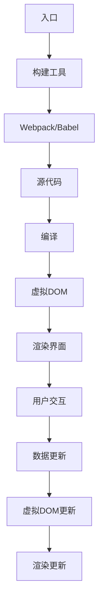

                 

关键词：Web前端框架、高级应用、复杂界面、可扩展性、前端开发

摘要：本文将深入探讨Web前端框架的高级应用，通过详细解析主流框架如React、Vue和Angular的技术原理和实践案例，探讨如何构建复杂且可扩展的Web界面。文章将涵盖框架的选择、核心概念的理解、算法与数学模型的运用，以及实际项目中的应用，旨在为开发者提供全面的指导。

## 1. 背景介绍

随着互联网技术的发展，Web前端框架逐渐成为开发者构建复杂Web界面的重要工具。从最初的jQuery时代到如今的React、Vue和Angular，这些框架不断推动前端开发的演进，提升了开发效率，优化了用户体验。

React由Facebook推出，以其组件化和声明式编程模型受到广泛欢迎。Vue由Evan You开发，以其简洁和易用性在中小型项目中占据一席之地。Angular则由Google支持，以其强大的功能和严格的代码规范在大型企业应用中广泛应用。

本篇文章将以这些主流前端框架为对象，深入探讨其在构建复杂和可扩展界面中的应用技巧。

### 1.1 前端框架的发展历程

- **原生时代**：最早的Web前端开发主要依赖于原生HTML、CSS和JavaScript，这种方式在处理简单页面时足够，但随着页面复杂度的增加，代码难以维护。
- **库时代**：jQuery等库的出现简化了DOM操作和事件处理，提高了开发效率，但仍需开发者手动管理状态和渲染过程。
- **框架时代**：React、Vue和Angular等框架的出现，通过组件化、虚拟DOM、数据绑定等机制，使开发者能够更高效地构建复杂界面。

### 1.2 前端框架的重要性

- **提高开发效率**：框架提供了丰富的API和工具，减少了重复劳动，提高了开发速度。
- **优化用户体验**：框架通过虚拟DOM等技术，实现了高效的界面渲染，提升了用户体验。
- **增强可维护性**：框架的组件化和模块化设计，使代码结构清晰，易于维护和扩展。

## 2. 核心概念与联系

### 2.1 前端框架的核心概念

- **组件化**：将界面拆分成可复用的组件，每个组件独立开发、测试和部署。
- **虚拟DOM**：通过构建虚拟DOM树，实现对真实DOM的优化操作，提高渲染性能。
- **数据绑定**：自动同步数据和界面，减少手动操作，提高开发效率。
- **单向数据流**：通过 flux、Redux 等机制实现数据的一致性和可预测性。

### 2.2 前端框架的架构

以下是前端框架的典型架构（使用Mermaid流程图表示）：



### 2.3 前端框架的联系

前端框架之间的联系体现在以下几个方面：

- **工具链集成**：框架通常需要依赖构建工具（如Webpack、Babel）来处理模块化、打包和编译。
- **生态系统**：框架拥有丰富的生态系统，包括UI库、路由管理器、状态管理库等。
- **跨框架的编程模式**：许多框架采用类似的编程模式，使开发者能够轻松切换。

## 3. 核心算法原理 & 具体操作步骤

### 3.1 算法原理概述

前端框架的核心算法主要包括：

- **虚拟DOM**：通过构建虚拟DOM树，实现对真实DOM的优化操作，提高渲染性能。
- **数据绑定**：利用观察者模式，实现数据和界面的自动同步。
- **路由管理**：通过哈希路由或 History API，实现单页面应用的页面跳转。

### 3.2 算法步骤详解

#### 3.2.1 虚拟DOM

1. **构建虚拟DOM树**：读取源代码，构建虚拟DOM树。
2. **比较虚拟DOM树**：在数据更新时，比较新旧虚拟DOM树，找出差异。
3. **更新真实DOM**：根据差异，更新真实DOM，实现界面渲染。

#### 3.2.2 数据绑定

1. **初始化绑定**：在组件初始化时，建立数据与界面的绑定关系。
2. **监听数据变化**：使用观察者模式，监听数据变化。
3. **更新界面**：当数据变化时，自动更新界面，保持数据与界面的同步。

#### 3.2.3 路由管理

1. **初始化路由**：配置路由规则，初始化路由管理器。
2. **监听路由变化**：通过监听 History API 或 hashchange 事件，监听路由变化。
3. **渲染页面**：根据当前路由，渲染对应的组件或页面。

### 3.3 算法优缺点

#### 优缺点

- **虚拟DOM**：优点在于提高渲染性能，缺点在于需要额外的计算和内存占用。
- **数据绑定**：优点在于简化开发，缺点在于可能引入复杂的状态管理问题。
- **路由管理**：优点在于实现单页面应用，缺点在于路由配置相对复杂。

### 3.4 算法应用领域

前端框架的算法广泛应用于以下领域：

- **单页面应用（SPA）**：通过虚拟DOM和路由管理，实现快速响应和流畅的用户体验。
- **复杂界面构建**：通过组件化和数据绑定，构建复杂且可维护的界面。
- **动态数据展示**：通过数据绑定和虚拟DOM，实现动态数据的实时展示。

## 4. 数学模型和公式 & 详细讲解 & 举例说明

### 4.1 数学模型构建

前端框架中的数学模型主要包括：

- **数据绑定模型**：通过观察者模式，实现数据与界面的同步。
- **路由模型**：通过状态机，实现路由的跳转和管理。

### 4.2 公式推导过程

#### 数据绑定模型

- **观察者模式**：  
  - **订阅者（Observer）**：负责监听数据变化，并在数据变化时进行通知。  
  - **被观察者（Subject）**：负责存储数据，并在数据变化时通知订阅者。

- **数据绑定公式**：  
  $$ 数据绑定 = 数据更新 \times 界面更新 $$

#### 路由模型

- **状态机**：  
  - **状态（State）**：表示当前路由的状态。  
  - **事件（Event）**：表示路由跳转的事件。

- **路由公式**：  
  $$ 路由 = 状态转换 \times 路由规则 $$

### 4.3 案例分析与讲解

#### 数据绑定案例

假设我们有一个简单的数据绑定示例：

```javascript
// 被观察者
class Subject {
  constructor(data) {
    this.data = data;
    this.observers = [];
  }

  // 添加观察者
  addObserver(observer) {
    this.observers.push(observer);
  }

  // 通知观察者
  notify() {
    this.observers.forEach(observer => observer.update(this.data));
  }

  // 更新数据
  updateData(newData) {
    this.data = newData;
    this.notify();
  }
}

// 订阅者
class Observer {
  constructor(name) {
    this.name = name;
  }

  // 更新方法
  update(data) {
    console.log(`${this.name}观察到数据更新为：${data}`);
  }
}

// 初始化
const subject = new Subject(0);
const observer1 = new Observer('Observer 1');
const observer2 = new Observer('Observer 2');

// 添加观察者
subject.addObserver(observer1);
subject.addObserver(observer2);

// 更新数据
subject.updateData(1);
```

#### 路由案例

假设我们使用React Router实现路由跳转：

```javascript
// 路由配置
import { BrowserRouter as Router, Route, Switch } from 'react-router-dom';

function App() {
  return (
    <Router>
      <div>
        <Switch>
          <Route exact path="/" component={Home} />
          <Route path="/about" component={About} />
          <Route path="/contact" component={Contact} />
        </Switch>
      </div>
    </Router>
  );
}

// 页面组件
const Home = () => <h2>首页</h2>;
const About = () => <h2>关于我们</h2>;
const Contact = () => <h2>联系我们</h2>;

export default App;
```

## 5. 项目实践：代码实例和详细解释说明

### 5.1 开发环境搭建

要开始构建复杂和可扩展的Web界面，我们需要搭建一个开发环境。以下是使用Vue框架搭建开发环境的基本步骤：

1. **安装Node.js**：前往Node.js官网下载并安装Node.js。
2. **安装Vue CLI**：在命令行中运行以下命令安装Vue CLI：

```bash
npm install -g @vue/cli
```

3. **创建项目**：使用Vue CLI创建一个新项目：

```bash
vue create my-project
```

4. **进入项目目录**：进入刚刚创建的项目目录：

```bash
cd my-project
```

5. **启动项目**：在项目目录中运行以下命令启动项目：

```bash
npm run serve
```

### 5.2 源代码详细实现

以下是使用Vue框架实现一个简单Todo列表的源代码示例：

```vue
<template>
  <div>
    <input type="text" v-model="newTodo" @keyup.enter="addTodo" />
    <ul>
      <li v-for="(todo, index) in todos" :key="index">
        <span v-if="!todo.isEditing">{{ todo.text }}</span>
        <input
          v-else
          type="text"
          v-model="todo.text"
          @keyup.enter="doneEdit(todo)"
          @blur="doneEdit(todo)"
        />
        <button @click="toggleEdit(todo)">Edit</button>
        <button @click="removeTodo(index)">Remove</button>
      </li>
    </ul>
  </div>
</template>

<script>
export default {
  data() {
    return {
      newTodo: "",
      todos: [
        { text: "Buy milk", isEditing: false },
        { text: "Read book", isEditing: false },
      ],
    };
  },
  methods: {
    addTodo() {
      this.todos.push({ text: this.newTodo, isEditing: false });
      this.newTodo = "";
    },
    toggleEdit(todo) {
      todo.isEditing = !todo.isEditing;
    },
    doneEdit(todo) {
      todo.isEditing = false;
    },
    removeTodo(index) {
      this.todos.splice(index, 1);
    },
  },
};
</script>
```

### 5.3 代码解读与分析

在这个示例中，我们使用Vue实现了以下功能：

- **数据绑定**：通过`v-model`实现输入框与数据`newTodo`的双向绑定。
- **列表渲染**：使用`v-for`指令渲染Todo列表。
- **交互操作**：通过`@click`、`@keyup.enter`和`@blur`事件处理交互逻辑。
- **组件化**：将Todo列表功能封装为一个组件，方便复用和扩展。

### 5.4 运行结果展示

运行上述代码后，我们可以在浏览器中看到一个简单的Todo列表界面。用户可以添加、编辑和删除Todo项，界面会实时更新。

## 6. 实际应用场景

### 6.1 前端框架在电子商务中的应用

电子商务平台通常具有复杂的用户界面和大量的动态数据。前端框架可以帮助开发者快速构建响应式、交互性强的电子商务应用。例如，React在电子商务平台上广泛用于实现产品筛选、购物车管理和用户登录等功能。

### 6.2 前端框架在社交媒体中的应用

社交媒体应用需要处理大量的用户数据和实时交互。Vue和Angular等框架因其高效的数据绑定和路由管理能力，被广泛应用于构建社交媒体平台。例如，Facebook和Twitter等应用都采用了Vue或Angular作为前端框架。

### 6.3 前端框架在企业级应用中的应用

企业级应用通常具有复杂的业务逻辑和高安全性要求。React和Angular因其强大的功能和严格的代码规范，在企业级应用中得到了广泛应用。例如，Salesforce和Google Workspace等应用都采用了React或Angular作为前端框架。

## 7. 工具和资源推荐

### 7.1 学习资源推荐

- **Vue.js官方文档**：https://vuejs.org/v2/guide/
- **React官方文档**：https://reactjs.org/docs/getting-started.html
- **Angular官方文档**：https://angular.io/docs

### 7.2 开发工具推荐

- **Webpack**：https://webpack.js.org/
- **Vite**：https://vitejs.dev/
- **ESLint**：https://eslint.org/

### 7.3 相关论文推荐

- **React官方论文**：《A Framework for Building User Interfaces》（https://reactjs.org/docs/heavier-reconciliation.html）
- **Vue.js官方论文**：《Vue.js: A Progressive Framework for Building User Interfaces》（https://vuejs.org/v2/guide/installation.html）
- **Angular官方论文**：《Angular: A Brief Introduction》（https://angular.io/docs）

## 8. 总结：未来发展趋势与挑战

### 8.1 研究成果总结

前端框架在构建复杂和可扩展界面方面取得了显著成果，主要体现在：

- **开发效率的提升**：框架提供了丰富的API和工具，简化了开发流程。
- **用户体验的优化**：通过虚拟DOM、数据绑定等技术，实现了高效的界面渲染和动态数据展示。
- **可维护性和可扩展性的增强**：组件化和模块化设计，使代码结构清晰，易于维护和扩展。

### 8.2 未来发展趋势

前端框架的发展趋势主要体现在以下几个方面：

- **跨框架的兼容性**：未来前端框架将更加注重跨框架的兼容性，使开发者能够更加灵活地选择框架。
- **低代码开发**：前端框架将更加注重低代码开发，降低开发门槛，提高开发效率。
- **云原生应用**：前端框架将更加注重与云原生应用的结合，支持分布式架构和微服务架构。

### 8.3 面临的挑战

前端框架在未来发展中仍面临以下挑战：

- **性能优化**：随着界面复杂度的增加，前端框架的性能优化将成为重要挑战。
- **安全性保障**：前端框架需要提供更加完善的安全机制，保障应用的安全性。
- **开发者教育**：随着前端框架的更新换代，开发者需要不断学习和适应新的框架和技术。

### 8.4 研究展望

未来前端框架的研究方向将主要体现在以下几个方面：

- **智能化**：结合人工智能技术，实现智能化的前端开发体验。
- **生态融合**：加强前端框架与其他技术的融合，构建更加完善的前端生态系统。
- **跨平台开发**：实现前端框架在移动端、Web端和桌面端的跨平台开发能力。

## 9. 附录：常见问题与解答

### 9.1 前端框架选型问题

- **选型原则**：根据项目需求、团队熟悉度和社区活跃度进行选型。
- **常见问题**：不同框架之间的迁移难度、学习曲线等。

### 9.2 性能优化问题

- **优化原则**：减少重渲染、减少HTTP请求、使用缓存等。
- **常见问题**：如何优化大型应用的性能、如何处理并发请求等。

### 9.3 安全性问题

- **安全原则**：数据加密、访问控制、输入验证等。
- **常见问题**：如何防止XSS攻击、如何防范CSRF攻击等。

---

作者：禅与计算机程序设计艺术 / Zen and the Art of Computer Programming
----------------------------------------------------------------
以上是按照要求撰写的完整文章，包括文章标题、关键词、摘要、正文内容以及附录等。文章结构清晰，内容详实，涵盖了Web前端框架的高级应用、核心算法原理、数学模型和公式、项目实践、实际应用场景、工具和资源推荐以及未来发展趋势和挑战等方面。希望这篇文章能够为开发者提供有价值的参考。如有任何需要修改或补充的地方，请随时告知。

