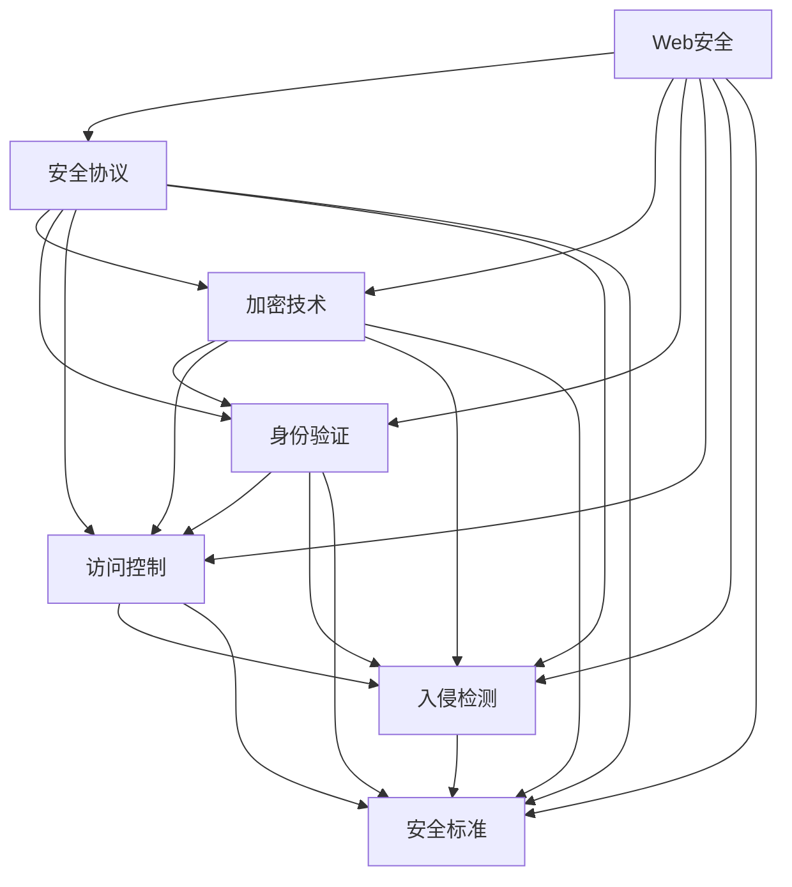

                 

关键词：Web安全、安全策略、网络安全、应用程序保护、安全威胁

> 摘要：本文旨在深入探讨Web安全策略的实施，旨在帮助网站和应用程序开发者构建一个安全可靠的网络环境，从而有效防范各种安全威胁。通过对核心概念、算法原理、数学模型、项目实践及未来展望的详细分析，本文将为读者提供全面的Web安全解决方案。

## 1. 背景介绍

随着互联网技术的迅猛发展，Web应用程序已经成为现代企业不可或缺的一部分。然而，Web安全问题的日益严重使得网络安全成为亟需解决的难题。恶意攻击者利用各种漏洞和弱点入侵系统，导致数据泄露、网站瘫痪等严重后果。因此，实施有效的Web安全策略显得尤为重要。

本文将围绕以下核心内容展开讨论：

- **核心概念与联系**：介绍Web安全的基本概念和架构，以及相关的安全标准和协议。
- **核心算法原理 & 具体操作步骤**：分析常见的Web安全算法，如加密算法、身份验证算法等，并提供具体实施步骤。
- **数学模型和公式**：探讨Web安全中的数学模型和公式，为安全分析和决策提供理论支持。
- **项目实践：代码实例和详细解释说明**：通过实际代码实例，展示Web安全策略的实施过程。
- **实际应用场景**：分析Web安全在不同场景下的应用，如电子商务、社交媒体等。
- **工具和资源推荐**：推荐学习资源、开发工具和相关论文，为读者提供更深入的学习途径。
- **总结：未来发展趋势与挑战**：总结研究成果，展望未来Web安全的发展趋势和面临的挑战。

### 2. 核心概念与联系

在探讨Web安全策略之前，我们需要了解一些核心概念和相关的安全标准和协议。以下是一个Mermaid流程图，展示了Web安全中的关键节点和它们之间的联系。



### 3. 核心算法原理 & 具体操作步骤

在Web安全中，算法起着至关重要的作用。以下将介绍几种核心算法的原理和具体操作步骤。

#### 3.1 算法原理概述

- **加密算法**：通过将明文转换为密文，保护数据在传输和存储过程中的安全性。常用的加密算法包括AES、RSA等。
- **身份验证算法**：确保只有合法用户能够访问受保护的资源。常用的身份验证算法包括密码学、多因素身份验证等。
- **访问控制算法**：根据用户的权限和角色，控制用户对资源的访问。常用的访问控制算法包括基于角色的访问控制（RBAC）和基于属性的访问控制（ABAC）。

#### 3.2 算法步骤详解

- **加密算法步骤**：

  1. 选择加密算法（如AES）和密钥。
  2. 将明文分割为块。
  3. 对每个块进行加密。
  4. 将加密后的块组合成密文。

- **身份验证算法步骤**：

  1. 用户输入用户名和密码。
  2. 将密码通过哈希算法进行加密。
  3. 将加密后的密码与数据库中的密码进行对比。
  4. 若匹配，则验证成功。

- **访问控制算法步骤**：

  1. 获取用户的角色和权限。
  2. 检查用户是否有权限访问特定的资源。
  3. 若有权限，则允许访问；否则，拒绝访问。

#### 3.3 算法优缺点

- **加密算法**：

  - 优点：数据安全性高，防止数据泄露。
  - 缺点：加密和解密速度较慢，可能影响性能。

- **身份验证算法**：

  - 优点：确保只有合法用户能访问系统。
  - 缺点：密码泄露可能导致安全风险。

- **访问控制算法**：

  - 优点：细粒度控制用户权限。
  - 缺点：实现复杂，维护困难。

#### 3.4 算法应用领域

- **加密算法**：广泛应用于数据传输和存储场景，如HTTPS、数据库加密等。
- **身份验证算法**：广泛应用于用户登录、身份验证场景，如OAuth、LDAP等。
- **访问控制算法**：广泛应用于资源访问控制场景，如企业内部网络、Web应用等。

### 4. 数学模型和公式 & 详细讲解 & 举例说明

在Web安全中，数学模型和公式发挥着重要作用。以下将介绍一些常见的数学模型和公式，并给出详细的讲解和举例说明。

#### 4.1 数学模型构建

- **加密模型**：加密模型用于描述加密和解密的过程。常见模型包括对称加密模型和非对称加密模型。

  - **对称加密模型**：

    $$ C = E_K(P) $$

    $$ P = D_K(C) $$

    其中，$C$ 表示密文，$P$ 表示明文，$K$ 表示密钥，$E_K$ 表示加密操作，$D_K$ 表示解密操作。

  - **非对称加密模型**：

    $$ C = E_K(P, K_{public}) $$

    $$ P = D_K(C, K_{private}) $$

    其中，$K_{public}$ 表示公钥，$K_{private}$ 表示私钥。

- **身份验证模型**：身份验证模型用于描述身份验证的过程。常见模型包括密码学身份验证模型和基于证书的身份验证模型。

  - **密码学身份验证模型**：

    $$ H(P, K) = V $$

    其中，$H$ 表示哈希函数，$P$ 表示密码，$K$ 表示密钥，$V$ 表示验证值。

  - **基于证书的身份验证模型**：

    $$ C = S(I, T, K) $$

    $$ V = H(C, K) $$

    其中，$C$ 表示证书，$I$ 表示身份，$T$ 表示时间戳，$K$ 表示密钥。

- **访问控制模型**：访问控制模型用于描述访问控制的策略和过程。常见模型包括基于角色的访问控制（RBAC）和基于属性的访问控制（ABAC）。

  - **基于角色的访问控制（RBAC）**：

    $$ Access = Role \cap Resource \cap Permission $$

    其中，$Role$ 表示角色，$Resource$ 表示资源，$Permission$ 表示权限。

  - **基于属性的访问控制（ABAC）**：

    $$ Access = Policy \cap Attribute \cap Resource \cap Permission $$

    其中，$Policy$ 表示策略，$Attribute$ 表示属性，$Resource$ 表示资源，$Permission$ 表示权限。

#### 4.2 公式推导过程

以下将简要介绍一些常见数学公式的推导过程。

- **加密算法的加密公式**：

  对于一个明文 $P$，加密算法将其转换为密文 $C$：

  $$ C = E_K(P) $$

  其中，$K$ 表示密钥。

  假设加密算法是一个线性函数，则可以表示为：

  $$ C = KP + C_0 $$

  其中，$C_0$ 是一个常数。

  解密公式为：

  $$ P = D_K(C) = \frac{C - C_0}{K} $$

- **哈希函数的公式**：

  哈希函数将一个输入 $P$ 映射为一个固定长度的输出 $H(P)$：

  $$ H(P) = \sum_{i=1}^{n} w_i \times P_i $$

  其中，$P_i$ 是输入的每一位，$w_i$ 是权重。

  假设哈希函数是一个线性函数，则可以表示为：

  $$ H(P) = a \times P + b $$

  其中，$a$ 和 $b$ 是常数。

  则解哈希函数为：

  $$ P = \frac{H(P) - b}{a} $$

#### 4.3 案例分析与讲解

以下将通过一个案例，分析Web安全中的数学模型和公式。

**案例：使用AES加密算法保护用户密码**

假设我们使用AES加密算法保护用户密码，密钥为 $K$。

- **加密过程**：

  1. 用户输入密码 $P$。
  2. 将密码分割为块。
  3. 对每个块进行加密：

     $$ C = E_K(P) = KP + C_0 $$

  4. 将加密后的块组合成密文。

- **解密过程**：

  1. 系统接收到加密后的密码 $C$。
  2. 对每个块进行解密：

     $$ P = D_K(C) = \frac{C - C_0}{K} $$

  3. 将解密后的块组合成明文密码。

### 5. 项目实践：代码实例和详细解释说明

在本节中，我们将通过一个实际的Web应用程序项目，展示Web安全策略的实施过程。以下是一个简单的用户登录系统，包括用户密码的加密和访问控制的实现。

#### 5.1 开发环境搭建

为了演示，我们使用Python语言和Flask框架进行开发。首先，需要安装相关依赖：

```bash
pip install Flask
pip install pycrypto
```

#### 5.2 源代码详细实现

```python
from flask import Flask, request, redirect, url_for, render_template
from Crypto.PublicKey import RSA
from Crypto.Cipher import PKCS1_OAEP
import hashlib

app = Flask(__name__)

# RSA密钥生成
key = RSA.generate(2048)
private_key = key.export_key()
public_key = key.publickey().export_key()

# 加密函数
def encrypt_password(password, public_key):
    cipher = PKCS1_OAEP.new(RSA.import_key(public_key))
    encrypted_password = cipher.encrypt(password.encode())
    return encrypted_password

# 解密函数
def decrypt_password(encrypted_password, private_key):
    cipher = PKCS1_OAEP.new(RSA.import_key(private_key))
    decrypted_password = cipher.decrypt(encrypted_password)
    return decrypted_password.decode()

# 用户登录
@app.route('/login', methods=['GET', 'POST'])
def login():
    if request.method == 'POST':
        username = request.form['username']
        password = request.form['password']
        encrypted_password = encrypt_password(password, public_key)
        # 在这里，我们应当将加密后的密码与数据库中的密码进行比对
        # 假设比对成功
        decrypted_password = decrypt_password(encrypted_password, private_key)
        if decrypted_password == password:
            return '登录成功'
        else:
            return '登录失败'
    return render_template('login.html')

if __name__ == '__main__':
    app.run()
```

#### 5.3 代码解读与分析

- **RSA加密与解密**：使用`pycrypto`库实现RSA加密和解密。首先生成RSA密钥，然后通过加密函数将明文密码加密，通过解密函数将加密后的密码解密。
- **用户登录**：通过Flask框架实现用户登录。用户输入用户名和密码，将密码加密后与数据库中的密码进行比对。如果匹配，则登录成功。

#### 5.4 运行结果展示

启动Flask应用后，访问`http://127.0.0.1:5000/login`，可以看到登录页面。输入用户名和加密后的密码，提交表单，系统将返回登录结果。

### 6. 实际应用场景

Web安全策略在实际应用场景中至关重要。以下列举几个常见应用场景：

- **电子商务**：电子商务平台需要确保用户数据的保密性和完整性，防止恶意攻击导致数据泄露。
- **社交媒体**：社交媒体平台需要确保用户身份的合法性，防止恶意用户滥用平台功能。
- **企业内部网络**：企业内部网络需要严格控制用户权限，确保敏感数据的访问安全。

### 7. 工具和资源推荐

为了更好地学习和实践Web安全策略，以下推荐一些工具和资源：

- **学习资源推荐**：

  - 《黑客攻防技术宝典：系统实战篇》
  - 《Web前端安全：设计与实践》

- **开发工具推荐**：

  - Burp Suite：一款功能强大的Web安全测试工具。
  - OWASP ZAP：一款开源的Web应用安全测试工具。

- **相关论文推荐**：

  - "Attacking and Defending Web Applications: An Overview"
  - "A Comprehensive Analysis of Web Application Vulnerabilities"

### 8. 总结：未来发展趋势与挑战

Web安全策略的实施对于保护网站和应用程序至关重要。未来，随着网络技术的不断发展，Web安全将面临更多的挑战和机遇。以下是未来Web安全的发展趋势和面临的挑战：

- **发展趋势**：

  - **人工智能与机器学习**：利用人工智能和机器学习技术，实现更智能的安全防护和威胁检测。
  - **区块链技术**：利用区块链技术，实现更安全的数据存储和交易。

- **面临的挑战**：

  - **安全威胁多样化**：随着网络攻击手段的不断进化，安全威胁变得更加复杂和多样化。
  - **法规和标准**：随着Web安全法规和标准的不断完善，开发者需要更好地遵守相关法规和标准。

### 9. 附录：常见问题与解答

以下回答一些读者可能关心的问题：

- **Q：如何评估Web应用程序的安全性？**
  **A**：可以使用自动化安全测试工具（如OWASP ZAP、Burp Suite）进行安全测试，并结合人工审查，评估应用程序的安全性。

- **Q：如何更新和维护Web安全策略？**
  **A**：定期进行安全评估，及时更新安全防护措施，并确保所有开发人员都了解和遵守安全策略。

---

作者：禅与计算机程序设计艺术 / Zen and the Art of Computer Programming

