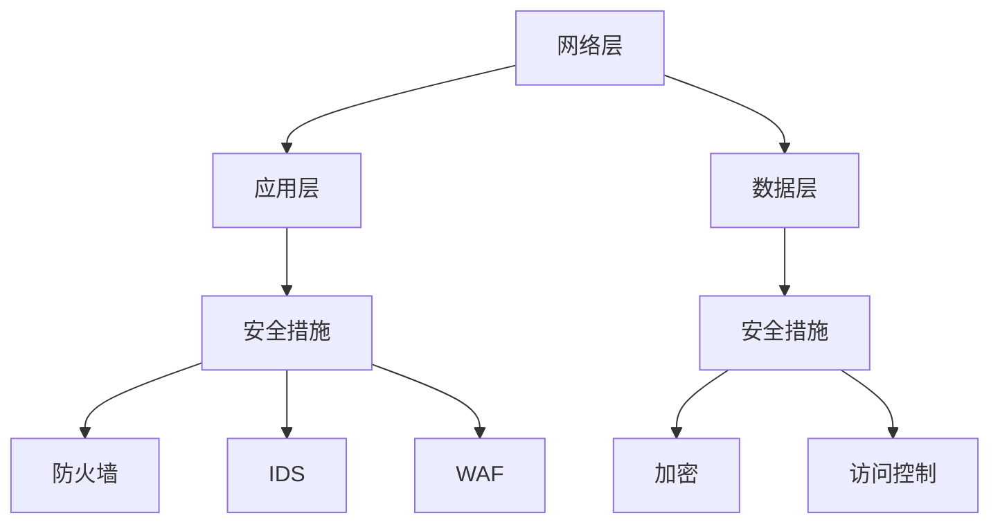

                 

关键词：Web安全、安全策略、应用程序保护、网络安全、攻击防护

> 摘要：本文将深入探讨Web安全策略的重要性，以及如何通过有效的策略来保护网站和应用程序免受各种网络攻击。我们将分析常见的网络攻击类型，介绍核心概念与架构，并详细讲解核心算法原理和具体操作步骤。此外，文章还将包括数学模型和公式的推导，代码实例的详细解释，实际应用场景，以及未来的应用展望。

## 1. 背景介绍

随着互联网的普及和电子商务的蓬勃发展，网站和应用程序成为企业和个人展示和服务的重要平台。然而，网络攻击也随着技术的发展日益猖獗，对网站和应用程序的安全性提出了严峻挑战。Web安全策略的制定与实施成为确保网络资产安全的关键。

网络攻击形式多样，包括但不限于SQL注入、跨站脚本攻击（XSS）、跨站请求伪造（CSRF）、文件包含漏洞等。这些攻击不仅会导致数据泄露、系统瘫痪，还可能给企业带来巨大的经济损失和声誉损害。因此，研究和实施有效的Web安全策略至关重要。

## 2. 核心概念与联系

### 2.1 Web安全基本概念

Web安全涉及多个方面，包括但不限于：

- **网络安全**：防止未经授权的访问和攻击，如DDoS攻击、端口扫描等。
- **数据安全**：确保数据在传输和存储过程中的完整性和保密性。
- **应用程序安全**：针对Web应用程序本身的安全漏洞进行修复和防护。

### 2.2 Web安全架构

Web安全架构主要包括以下几个层次：

1. **网络层**：防火墙、入侵检测系统（IDS）、入侵防御系统（IPS）等。
2. **应用层**：Web应用防火墙（WAF）、安全编码实践、输入验证等。
3. **数据层**：加密、数据脱敏、访问控制等。

### 2.3 Mermaid流程图



## 3. 核心算法原理 & 具体操作步骤

### 3.1 算法原理概述

Web安全策略的核心算法包括输入验证、加密算法、安全协议等。这些算法的共同目标是通过多种手段防止和检测网络攻击。

- **输入验证**：确保用户输入数据的有效性和安全性，防止SQL注入、XSS等攻击。
- **加密算法**：用于保护数据在传输和存储过程中的安全，如AES、RSA等。
- **安全协议**：如SSL/TLS，用于保护数据在互联网上的安全传输。

### 3.2 算法步骤详解

#### 3.2.1 输入验证

1. **验证输入类型**：确保输入数据的类型与预期一致。
2. **过滤特殊字符**：对输入数据进行特殊字符过滤，防止SQL注入、XSS等攻击。
3. **数据编码与解码**：正确处理输入数据，避免因为编码问题导致的漏洞。

#### 3.2.2 加密算法

1. **选择合适的加密算法**：根据应用场景选择合适的加密算法。
2. **加密数据**：使用加密算法对数据进行加密。
3. **密钥管理**：确保密钥的安全存储和传输。

#### 3.2.3 安全协议

1. **安装SSL/TLS证书**：确保网站使用HTTPS协议。
2. **配置安全协议参数**：调整SSL/TLS协议的参数，如密码强度、加密算法等。
3. **定期更新证书**：确保SSL/TLS证书的有效性和安全性。

### 3.3 算法优缺点

- **输入验证**：有效防止多种网络攻击，但可能影响用户体验。
- **加密算法**：确保数据安全，但加密和解密过程可能增加计算开销。
- **安全协议**：提供安全的传输层保护，但配置和管理较为复杂。

### 3.4 算法应用领域

Web安全策略在各种应用领域都有广泛应用，包括电子商务、在线银行、社交媒体等。不同领域可能对Web安全策略的具体实施有不同要求。

## 4. 数学模型和公式 & 详细讲解 & 举例说明

### 4.1 数学模型构建

在Web安全中，数学模型广泛应用于加密算法和密码学中。以下是一个简单的加密模型：

- **加密函数**：\( E(k, m) = c \)
- **解密函数**：\( D(k, c) = m \)

其中，\( k \) 为密钥，\( m \) 为明文，\( c \) 为密文。

### 4.2 公式推导过程

加密过程：

- 选择加密算法，如AES。
- 生成密钥 \( k \)。
- 将明文 \( m \) 输入加密算法，得到密文 \( c \)。

解密过程：

- 选择加密算法，如AES。
- 生成密钥 \( k \)。
- 将密文 \( c \) 输入解密算法，得到明文 \( m \)。

### 4.3 案例分析与讲解

假设我们使用AES加密算法对明文 "Hello, World!" 进行加密和解密。首先，我们需要选择密钥长度和加密模式。

- **密钥长度**：假设使用256位密钥。
- **加密模式**：使用CBC模式。

加密过程：

1. 初始化向量（IV）。
2. 对明文进行分块处理。
3. 对每个明文块进行加密，生成密文块。

解密过程：

1. 使用密钥和IV初始化解密算法。
2. 对每个密文块进行解密，生成明文块。
3. 将所有明文块合并，得到原始明文。

通过加密和解密，我们可以确保数据在传输和存储过程中的安全。

## 5. 项目实践：代码实例和详细解释说明

### 5.1 开发环境搭建

为了演示Web安全策略的实际应用，我们将在本地搭建一个简单的Web应用程序。所需环境如下：

- **编程语言**：Python
- **Web框架**：Flask
- **安全库**：PyCryptoDome

### 5.2 源代码详细实现

以下是一个简单的Flask应用程序，包含输入验证、加密和解密功能：

```python
from flask import Flask, request, jsonify
from Crypto.PublicKey import RSA
from Crypto.Cipher import AES, PKCS1_OAEP
import base64

app = Flask(__name__)

# RSA密钥生成
key = RSA.generate(2048)
private_key = key.export_key()
public_key = key.publickey().export_key()

# AES加密函数
def encrypt_aes(message, key):
    cipher_aes = AES.new(key, AES.MODE_EAX)
    ciphertext, tag = cipher_aes.encrypt_and_digest(message.encode('utf-8'))
    return base64.b64encode(cipher_aes.nonce + tag + ciphertext).decode('utf-8')

# AES解密函数
def decrypt_aes(encrypted_message, key):
    nonce_tag_ciphertext = base64.b64decode(encrypted_message)
    nonce = nonce_tag_ciphertext[:16]
    tag = nonce_tag_ciphertext[16:32]
    ciphertext = nonce_tag_ciphertext[32:]
    cipher_aes = AES.new(key, AES.MODE_EAX, nonce=nonce)
    message = cipher_aes.decrypt_and_verify(ciphertext, tag)
    return message.decode('utf-8')

@app.route('/encrypt', methods=['POST'])
def encrypt():
    message = request.form['message']
    encrypted_message = encrypt_aes(message, public_key)
    return jsonify({'encrypted_message': encrypted_message})

@app.route('/decrypt', methods=['POST'])
def decrypt():
    encrypted_message = request.form['encrypted_message']
    decrypted_message = decrypt_aes(encrypted_message, private_key)
    return jsonify({'decrypted_message': decrypted_message})

if __name__ == '__main__':
    app.run(debug=True)
```

### 5.3 代码解读与分析

上述代码首先生成了一个RSA密钥对，用于加密和解密AES密钥。然后，我们定义了两个函数 `encrypt_aes` 和 `decrypt_aes` 用于AES加密和解密。

在 `/encrypt` 路径下，应用程序接收明文消息，使用AES加密后返回加密消息。在 `/decrypt` 路径下，应用程序接收加密消息，使用AES解密后返回明文消息。

### 5.4 运行结果展示

运行应用程序后，我们可以通过以下命令进行测试：

```bash
# 测试加密
curl -X POST -F "message=Hello, World!" http://localhost:5000/encrypt

# 测试解密
curl -X POST -F "encrypted_message=...encrypted_message..." http://localhost:5000/decrypt
```

## 6. 实际应用场景

Web安全策略在多种实际应用场景中具有重要作用，如：

- **电子商务**：确保用户支付信息的安全性。
- **在线银行**：保护用户账户信息和交易数据。
- **社交媒体**：防止用户数据泄露和恶意攻击。
- **政务系统**：确保政府数据的安全和隐私。

## 7. 工具和资源推荐

### 7.1 学习资源推荐

- 《黑客攻防技术宝典：Web实战篇》
- 《Web应用安全：攻防技巧与实战》
- 《安全编码标准：改善代码的安全架构》

### 7.2 开发工具推荐

- **安全开发框架**：如OWASP ZAP、Burp Suite
- **加密库**：如PyCryptoDome、CryptoJS
- **Web应用防火墙**：如ModSecurity、Cloudflare

### 7.3 相关论文推荐

- 《Web安全：威胁、攻击与防御》
- 《加密算法与密码学》
- 《网络安全：设计与实现》

## 8. 总结：未来发展趋势与挑战

随着技术的不断发展，Web安全策略也将面临新的挑战和机遇。未来的发展趋势包括：

- **人工智能与机器学习在安全防护中的应用**：利用AI技术进行攻击检测和预测。
- **区块链技术在数据安全中的应用**：利用区块链的不可篡改性保护数据。
- **量子加密技术的应用**：利用量子加密提高数据安全性。

然而，Web安全策略也面临以下挑战：

- **攻击手段的不断升级**：新的攻击手段不断出现，安全策略需要不断更新。
- **资源限制**：在预算有限的情况下，如何最大化利用资源进行安全防护。
- **用户隐私保护**：在确保安全的同时，如何平衡用户隐私和数据共享。

未来的研究将主要集中在如何更好地应对这些挑战，实现更全面、更高效的安全防护。

## 9. 附录：常见问题与解答

### 9.1 什么是SQL注入？

SQL注入是一种网络攻击技术，攻击者通过在Web应用程序的输入字段中插入恶意的SQL代码，从而控制数据库或窃取敏感数据。

### 9.2 如何防止SQL注入？

- 使用预处理语句或参数化查询。
- 对用户输入进行严格的过滤和验证。
- 使用Web应用防火墙。

### 9.3 什么是跨站脚本攻击（XSS）？

跨站脚本攻击（XSS）是一种攻击者通过在Web应用程序中注入恶意脚本，从而窃取用户数据或执行恶意操作的攻击。

### 9.4 如何防止XSS攻击？

- 对用户输入进行编码和验证。
- 使用内容安全策略（CSP）。
- 使用Web应用防火墙。

### 9.5 什么是跨站请求伪造（CSRF）？

跨站请求伪造（CSRF）是一种攻击者利用用户已登录的Web应用程序，通过伪造请求执行恶意操作的攻击。

### 9.6 如何防止CSRF攻击？

- 使用CSRF令牌。
- 验证请求来源。
- 使用Web应用防火墙。

通过上述问题的解答，我们希望读者对Web安全策略有更深入的理解。只有在了解并有效应对各种网络攻击的情况下，才能确保网站和应用程序的安全。作者：禅与计算机程序设计艺术 / Zen and the Art of Computer Programming。

