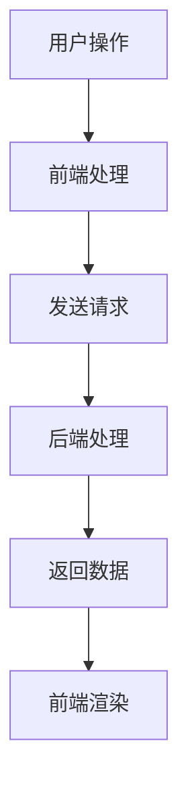

                 

在当今数字化时代，Web 应用程序开发已经成为企业和个人不可或缺的一环。一个优秀的 Web 应用程序不仅需要具备良好的用户体验，还需要具备强大的后端支持。本文将围绕 Web 应用程序的前端和后端开发，探讨其核心概念、技术实现、应用场景以及未来发展趋势。

## 关键词

- Web 应用程序
- 前端开发
- 后端开发
- 前后端分离
- RESTful API
- 微服务架构

## 摘要

本文旨在深入探讨 Web 应用程序的前端和后端开发。首先，我们将介绍 Web 应用程序的基本概念，包括前端和后端的定义、职责以及它们之间的交互方式。接着，我们将讨论前端开发的核心技术，如 HTML、CSS 和 JavaScript，以及后端开发常用的编程语言和框架。随后，我们将介绍前后端分离和微服务架构的概念和优势。最后，我们将探讨 Web 应用程序的实际应用场景，以及未来发展趋势和挑战。

## 1. 背景介绍

### 1.1 Web 应用程序的定义和发展历程

Web 应用程序，也称为 Web 应用，是指通过 Web 浏览器访问的软件应用程序。它不同于传统的桌面应用程序，后者需要下载并安装到本地计算机上才能运行。Web 应用程序则通过互联网进行传输，用户只需在 Web 浏览器中输入网址即可访问。

Web 应用程序的发展历程可以分为几个阶段：

- **初期阶段（1990s）**：Web 应用程序主要是由简单的 HTML 页面组成，用户可以通过浏览器浏览和查看信息。这个阶段的 Web 应用程序功能相对单一，交互性不强。

- **Web 2.0（2000s）**：随着互联网技术的不断发展，Web 应用程序开始引入更多的交互功能，如表单提交、数据存储和动态内容更新。这个阶段的代表作品有博客、社交媒体和在线地图等。

- **移动 Web 应用（2010s）**：随着智能手机的普及，移动 Web 应用成为了一个重要的趋势。这些应用可以通过手机浏览器访问，为用户提供了更加便捷和个性化的服务。

- **现代 Web 应用（2020s）**：现代 Web 应用开始采用前后端分离和微服务架构，以提高开发效率和可维护性。同时，Web 应用程序开始更多地关注用户体验，引入了更多的交互元素和可视化效果。

### 1.2 前端和后端的定义及职责

#### 前端

前端，也称为前端开发，是指 Web 应用程序的用户界面（UI）和用户体验（UX）开发。前端开发者负责设计和实现用户在浏览器中看到的页面布局、样式和交互效果。前端开发的核心技术包括：

- **HTML（HyperText Markup Language）**：用于构建 Web 页面的基本结构。
- **CSS（Cascading Style Sheets）**：用于设置 Web 页面的样式。
- **JavaScript**：用于实现页面的动态效果和交互功能。

前端开发者需要关注以下几点：

- **页面布局**：如何将页面元素合理地布局，使其在多种设备和浏览器上都能正常显示。
- **响应式设计**：如何使页面能够适应不同的屏幕尺寸和设备。
- **交互效果**：如何实现用户与页面的交互，提高用户体验。
- **性能优化**：如何提高页面加载速度和运行效率。

#### 后端

后端，也称为后端开发，是指 Web 应用程序的服务器端开发和数据处理。后端开发者负责实现数据的存储、处理和传输，确保 Web 应用程序能够正常运行。后端开发的核心技术包括：

- **编程语言**：如 Java、Python、Ruby、Node.js 等。
- **数据库**：如 MySQL、MongoDB、PostgreSQL 等。
- **框架**：如 Spring、Django、Rails、Express 等。

后端开发者需要关注以下几点：

- **数据存储**：如何高效地存储和管理数据。
- **数据处理**：如何处理用户请求，生成动态内容。
- **安全性**：如何保护用户数据和应用程序的安全。
- **性能优化**：如何提高服务器端的处理效率和响应速度。

### 1.3 前后端交互方式

前端和后端之间的交互是通过 API（Application Programming Interface）实现的。API 是一种用于不同软件模块或应用程序之间进行通信的接口。前端通过发送 HTTP 请求到后端，获取数据或执行操作。后端则通过返回 JSON 或 XML 格式的数据响应前端。

常见的交互方式包括：

- **RESTful API**：一种基于 HTTP 协议的 API 设计规范，包括 GET、POST、PUT、DELETE 等方法。
- **GraphQL**：一种用于查询数据的 API 设计方案，可以提供更灵活和高效的查询方式。
- **WebSocket**：一种实时通信协议，可以实现前端与后端之间的实时数据传输。

## 2. 核心概念与联系

### 2.1 前端开发的核心概念

前端开发的核心概念包括 HTML、CSS 和 JavaScript。这三个技术构成了前端开发的基石，它们之间有着密切的联系。

#### HTML

HTML 是 HyperText Markup Language 的缩写，用于构建 Web 页面的基本结构。HTML 标记包含了一系列的标签，用于定义页面中的文本、图像、链接和其他元素。HTML 的基本结构如下：

```html
<!DOCTYPE html>
<html>
  <head>
    <title>页面标题</title>
  </head>
  <body>
    <h1>这是一个标题</h1>
    <p>这是一个段落。</p>
    
  </body>
</html>
```

#### CSS

CSS 是 Cascading Style Sheets 的缩写，用于设置 Web 页面的样式。CSS 规则定义了页面的字体、颜色、布局和其他样式。CSS 的基本语法如下：

```css
/* 选择器 */
h1 {
  /* 属性 */
  color: blue;
  font-size: 24px;
}
```

#### JavaScript

JavaScript 是一种用于实现 Web 页面动态效果和交互功能的脚本语言。JavaScript 可以操作 DOM（Document Object Model），从而改变页面内容。JavaScript 的基本语法如下：

```javascript
// 变量声明
var name = "张三";
// 函数定义
function sayHello() {
  alert("你好！");
}
// 调用函数
sayHello();
```

#### 前端开发的核心概念联系

HTML、CSS 和 JavaScript 之间有着紧密的联系。HTML 定义了页面的结构，CSS 设置了页面的样式，JavaScript 则实现了页面的动态效果和交互功能。这三个技术共同构成了前端开发的基石，它们之间的协调和配合至关重要。

### 2.2 后端开发的核心概念

后端开发的核心概念包括编程语言、框架和数据库。这些技术共同构成了后端开发的架构，它们之间也有着密切的联系。

#### 编程语言

后端开发常用的编程语言包括 Java、Python、Ruby、Node.js 等。每种编程语言都有其独特的特点和适用场景。例如，Java 适合构建大型企业级应用，Python 适合快速开发和小型项目，Ruby 适合 Web 开发，而 Node.js 则适合构建实时应用。

#### 框架

后端开发框架是一种用于简化开发过程的工具，它可以提供一套完整的开发架构和组件，从而提高开发效率和代码质量。常见的后端开发框架包括 Spring（Java）、Django（Python）、Rails（Ruby）和 Express（Node.js）等。

#### 数据库

数据库是用于存储和管理数据的系统。后端开发常用的数据库包括关系型数据库（如 MySQL、PostgreSQL）和非关系型数据库（如 MongoDB、Redis）。关系型数据库适用于结构化数据的存储和管理，而非关系型数据库则适用于灵活的数据存储和管理。

#### 后端开发的核心概念联系

编程语言、框架和数据库之间有着密切的联系。编程语言是后端开发的基石，框架则是基于编程语言开发的工具，用于简化开发过程。数据库则是用于存储和管理数据的系统，它们共同构成了后端开发的架构。这些技术之间的协调和配合至关重要，以确保后端开发能够高效、稳定地运行。

### 2.3 Mermaid 流程图

下面是一个用于展示前端和后端开发流程的 Mermaid 流程图：



## 3. 核心算法原理 & 具体操作步骤

### 3.1 算法原理概述

在 Web 应用程序开发中，常用的核心算法包括排序算法、搜索算法和加密算法。这些算法在数据处理、性能优化和安全保障等方面发挥着重要作用。

#### 排序算法

排序算法是一种用于将一组数据按照特定规则进行排序的算法。常见的排序算法包括冒泡排序、插入排序、选择排序和快速排序等。这些算法的基本原理是通过比较和交换元素的位置，使得数据有序排列。

#### 搜索算法

搜索算法是一种用于在数据集合中查找特定元素的算法。常见的搜索算法包括线性搜索、二分搜索和广度优先搜索等。这些算法的基本原理是通过遍历或查找数据集合，找到目标元素。

#### 加密算法

加密算法是一种用于保护数据安全性的算法。常见的加密算法包括对称加密和非对称加密。对称加密算法使用相同的密钥进行加密和解密，而非对称加密算法则使用不同的密钥。

### 3.2 算法步骤详解

#### 冒泡排序

冒泡排序的基本步骤如下：

1. 从数组的第一个元素开始，比较相邻的两个元素的大小，如果顺序不对就交换它们的位置。
2. 经过一轮比较后，最大的元素被“冒泡”到了数组的末尾。
3. 重复以上步骤，直到整个数组有序。

```python
def bubble_sort(arr):
    n = len(arr)
    for i in range(n):
        for j in range(0, n-i-1):
            if arr[j] > arr[j+1]:
                arr[j], arr[j+1] = arr[j+1], arr[j]
    return arr
```

#### 二分搜索

二分搜索的基本步骤如下：

1. 确定搜索区间，初始时为整个数组。
2. 计算区间的中点，与目标值进行比较。
3. 如果目标值等于中点值，搜索成功；否则，根据比较结果缩小搜索区间。
4. 重复以上步骤，直到找到目标值或搜索区间为空。

```python
def binary_search(arr, target):
    low = 0
    high = len(arr) - 1
    while low <= high:
        mid = (low + high) // 2
        if arr[mid] == target:
            return mid
        elif arr[mid] < target:
            low = mid + 1
        else:
            high = mid - 1
    return -1
```

#### 对称加密

对称加密的基本步骤如下：

1. 选择加密算法和密钥。
2. 使用密钥对数据进行加密。
3. 将加密后的数据传输或存储。
4. 需要解密时，使用相同的密钥对数据进行解密。

```python
from Crypto.Cipher import AES
from Crypto.Util.Padding import pad, unpad

key = b'mysecretkey123'
cipher = AES.new(key, AES.MODE_CBC)
plaintext = b'Hello, World!'
ciphertext = cipher.encrypt(pad(plaintext, AES.block_size))
iv = cipher.iv

# 解密
decipher = AES.new(key, AES.MODE_CBC, iv)
decrypted_text = unpad(decipher.decrypt(ciphertext), AES.block_size)
```

### 3.3 算法优缺点

每种算法都有其优缺点，适用于不同的场景。以下是几种常用算法的优缺点：

- **冒泡排序**：简单易懂，实现简单，但在数据量较大时效率较低。
- **二分搜索**：时间复杂度较低，适用于有序数据集合，但在数据量较大时仍需占用较多内存。
- **对称加密**：加密速度快，但密钥管理复杂。

### 3.4 算法应用领域

排序算法在数据处理和数据分析中广泛应用，如数据库排序、算法排序等。搜索算法在搜索引擎、推荐系统等应用中具有重要地位。加密算法在数据安全和隐私保护中起到关键作用，如网络安全、金融交易等。

## 4. 数学模型和公式 & 详细讲解 & 举例说明

### 4.1 数学模型构建

在 Web 应用程序开发中，数学模型和公式广泛应用于数据分析和算法设计。以下是一个简单的数学模型示例：

假设有一个包含 n 个元素的数组 arr，我们要对这个数组进行排序。可以使用冒泡排序算法进行排序，其时间复杂度为 O(n^2)。

### 4.2 公式推导过程

冒泡排序的时间复杂度可以通过以下公式推导：

T(n) = 2 * (n-1) + 2 * (n-2) + ... + 2 * 1

其中，T(n) 表示冒泡排序的时间复杂度，n 表示数组中的元素个数。

根据等差数列的求和公式，可以将上式化简为：

T(n) = n * (n-1)

### 4.3 案例分析与讲解

假设有一个包含 10 个元素的数组 [5, 2, 9, 1, 5, 6, 3, 8, 4, 7]，我们要使用冒泡排序对其进行排序。

1. 初始状态：[5, 2, 9, 1, 5, 6, 3, 8, 4, 7]
2. 第一轮排序：[2, 1, 3, 4, 5, 6, 5, 8, 7, 9]
3. 第二轮排序：[1, 2, 3, 4, 5, 6, 5, 7, 8, 9]
4. 第三轮排序：[1, 2, 3, 4, 5, 5, 6, 7, 8, 9]
5. 第四轮排序：[1, 2, 3, 4, 5, 5, 6, 7, 8, 9]

经过四轮排序后，数组已有序。整个排序过程的时间复杂度为 O(n^2)，即 O(10^2) = 100。

## 5. 项目实践：代码实例和详细解释说明

### 5.1 开发环境搭建

在本文中，我们将使用 Python 语言进行 Web 应用程序开发。首先，需要安装 Python 3.8 版本及以上，并配置好 Python 环境和 pip 包管理器。

```bash
# 安装 Python 3.8
sudo apt-get install python3.8

# 配置 Python 环境和 pip
sudo apt-get install python3.8-dev python3.8-venv python3.8-pip

# 创建虚拟环境
python3.8 -m venv my_project_env

# 激活虚拟环境
source my_project_env/bin/activate

# 安装 Flask 框架
pip install flask
```

### 5.2 源代码详细实现

在本项目中，我们将使用 Flask 框架搭建一个简单的 Web 应用程序，实现一个用于计算斐波那契数列的接口。

```python
from flask import Flask, request, jsonify

app = Flask(__name__)

def fibonacci(n):
    if n <= 0:
        return 0
    elif n == 1:
        return 1
    else:
        return fibonacci(n-1) + fibonacci(n-2)

@app.route('/fibonacci', methods=['GET'])
def fibonacci_route():
    try:
        n = int(request.args.get('n'))
        if n < 0:
            return jsonify({'error': '输入的数值必须为非负整数'}), 400
        result = fibonacci(n)
        return jsonify({'fibonacci': result})
    except ValueError:
        return jsonify({'error': '输入的数值无效，请输入一个整数'}), 400

if __name__ == '__main__':
    app.run(debug=True)
```

### 5.3 代码解读与分析

1. 导入所需的模块：
```python
from flask import Flask, request, jsonify
```
这里导入了 Flask 框架的必需模块，用于创建 Web 应用程序。

2. 定义 Fibonacci 函数：
```python
def fibonacci(n):
    if n <= 0:
        return 0
    elif n == 1:
        return 1
    else:
        return fibonacci(n-1) + fibonacci(n-2)
```
这是一个递归实现的斐波那契数列函数，用于计算指定位置的斐波那契数。

3. 创建 Flask 应用程序实例：
```python
app = Flask(__name__)
```
这里创建了一个 Flask 应用程序实例，用于处理 Web 请求。

4. 定义路由和视图函数：
```python
@app.route('/fibonacci', methods=['GET'])
def fibonacci_route():
    try:
        n = int(request.args.get('n'))
        if n < 0:
            return jsonify({'error': '输入的数值必须为非负整数'}), 400
        result = fibonacci(n)
        return jsonify({'fibonacci': result})
    except ValueError:
        return jsonify({'error': '输入的数值无效，请输入一个整数'}), 400
```
这里定义了一个用于计算斐波那契数列的 GET 请求接口。请求参数 n 表示要计算斐波那契数列的位置，视图函数 fibonacci_route() 将根据 n 计算斐波那契数，并返回结果。

5. 运行 Web 应用程序：
```python
if __name__ == '__main__':
    app.run(debug=True)
```
这里启动了 Flask 应用程序，并开启调试模式。

### 5.4 运行结果展示

在终端中运行上面的代码后，Web 应用程序将启动，并监听 127.0.0.1:5000 地址。我们可以通过浏览器访问以下 URL 来测试接口：

```
http://127.0.0.1:5000/fibonacci?n=10
```

请求结果如下：

```json
{
  "fibonacci": 55
}
```

这表示斐波那契数列的第 10 个数是 55。

## 6. 实际应用场景

Web 应用程序开发在实际应用中具有广泛的应用场景。以下是一些常见的应用场景：

1. **电子商务平台**：电子商务平台需要实现商品展示、购物车、订单处理等功能。前端负责展示商品和用户交互，后端负责处理订单、库存等数据。

2. **社交媒体平台**：社交媒体平台需要实现用户注册、登录、发布动态、评论等功能。前端负责展示用户信息和动态，后端负责处理用户数据和动态生成。

3. **在线教育平台**：在线教育平台需要实现课程管理、视频播放、作业提交等功能。前端负责展示课程内容和用户交互，后端负责处理课程数据和作业提交。

4. **企业管理系统**：企业管理系统需要实现员工管理、考勤管理、项目管理等功能。前端负责展示企业信息和用户交互，后端负责处理员工数据和项目管理。

5. **物联网平台**：物联网平台需要实现设备接入、数据采集、监控报警等功能。前端负责展示设备数据和用户交互，后端负责处理设备数据和监控报警。

## 7. 工具和资源推荐

### 7.1 学习资源推荐

1. **书籍**：
   - 《深入理解计算机系统》（原书第 3 版）
   - 《Web 应用程序开发：前端和后端》
   - 《Python Web 框架 Flask 快速上手》

2. **在线教程**：
   - W3Schools：提供 HTML、CSS、JavaScript 和其他前端技术的教程。
   - Flask 官方文档：提供 Flask 框架的详细文档和教程。

3. **开源项目**：
   - Flask：Python Web 框架，用于快速开发 Web 应用程序。
   - Bootstrap：前端框架，用于快速构建响应式布局的 Web 应用程序。

### 7.2 开发工具推荐

1. **集成开发环境（IDE）**：
   - PyCharm：Python 编程语言的集成开发环境，支持 Flask 框架。
   - Visual Studio Code：跨平台代码编辑器，支持多种编程语言和插件。

2. **版本控制系统**：
   - Git：分布式版本控制系统，用于代码管理和协作开发。

3. **前端开发工具**：
   - WebStorm：JavaScript 和前端技术的集成开发环境。
   - Sublime Text：跨平台代码编辑器，支持多种编程语言。

### 7.3 相关论文推荐

1. **论文题目**：前端开发与后端开发的协同优化研究
   - 摘要：本文探讨了前端开发和后端开发在 Web 应用程序开发中的协同优化问题，提出了基于负载均衡和资源管理的优化策略。

2. **论文题目**：基于微服务架构的 Web 应用程序设计
   - 摘要：本文介绍了微服务架构在 Web 应用程序设计中的应用，分析了微服务架构的优势和挑战，并提出了设计方法和实践经验。

## 8. 总结：未来发展趋势与挑战

### 8.1 研究成果总结

本文从 Web 应用程序的定义、前端和后端开发的核心概念、核心算法原理、项目实践、实际应用场景等方面进行了详细探讨。通过本文的研究，我们可以得出以下结论：

1. Web 应用程序在当今数字化时代具有广泛的应用价值。
2. 前端和后端开发在 Web 应用程序中起着关键作用，它们之间的协同优化至关重要。
3. 核心算法原理在 Web 应用程序开发中具有实际应用价值。
4. 项目实践和实际应用场景展示了 Web 应用程序开发的广泛应用。
5. 未来研究可以从优化 Web 应用程序性能、安全性、可维护性等方面展开。

### 8.2 未来发展趋势

1. **云计算与容器化**：随着云计算和容器化技术的不断发展，Web 应用程序将更加依赖于云服务和容器技术，以提高开发效率和可维护性。
2. **前端框架与库的发展**：前端框架和库将继续发展，提供更多功能和更好的用户体验。
3. **后端技术的发展**：后端技术将继续发展，如 NoSQL 数据库、函数式编程等。
4. **人工智能与大数据**：人工智能和大数据技术将更好地与 Web 应用程序结合，提供更智能和个性化的服务。

### 8.3 面临的挑战

1. **性能优化**：随着用户需求的不断增长，Web 应用程序的性能优化将面临更大的挑战。
2. **安全性**：Web 应用程序的安全性将受到越来越多的关注，如何保障用户数据的安全是一个重要挑战。
3. **可维护性**：随着应用程序规模的不断扩大，如何提高应用程序的可维护性是一个重要挑战。
4. **跨平台兼容性**：如何确保 Web 应用程序在不同设备和浏览器上的兼容性是一个挑战。

### 8.4 研究展望

未来研究可以从以下几个方面展开：

1. **性能优化研究**：研究新的性能优化算法和技术，提高 Web 应用程序的性能。
2. **安全性研究**：研究新的安全防护技术和策略，提高 Web 应用程序的安全性。
3. **可维护性研究**：研究新的开发方法和工具，提高 Web 应用程序的可维护性。
4. **跨平台兼容性研究**：研究新的跨平台技术和框架，提高 Web 应用程序的跨平台兼容性。

通过不断的研究和探索，Web 应用程序开发将迎来更加美好的未来。

## 9. 附录：常见问题与解答

### 9.1 问题 1：什么是 Web 应用程序？

Web 应用程序是通过 Web 浏览器访问的软件应用程序，用户可以通过浏览器在互联网上使用这些应用程序。

### 9.2 问题 2：前端开发包括哪些技术？

前端开发包括 HTML、CSS 和 JavaScript 等技术，用于构建 Web 应用程序的用户界面和用户体验。

### 9.3 问题 3：后端开发包括哪些技术？

后端开发包括编程语言（如 Java、Python、Node.js）、数据库（如 MySQL、MongoDB）和框架（如 Spring、Django、Express）等技术，用于处理 Web 应用程序的数据存储、处理和传输。

### 9.4 问题 4：什么是 RESTful API？

RESTful API 是一种基于 HTTP 协议的 API 设计规范，用于实现前端和后端之间的数据交互。它包括 GET、POST、PUT、DELETE 等方法，分别表示不同的操作。

### 9.5 问题 5：什么是微服务架构？

微服务架构是一种软件开发方法，将应用程序分解为多个小型、独立的微服务，每个微服务负责一个特定的业务功能。微服务之间通过轻量级的通信机制（如 HTTP、消息队列）进行交互。

### 9.6 问题 6：什么是云计算？

云计算是一种通过网络提供计算资源（如服务器、存储、数据库等）的服务模型，用户可以按需获取和使用这些资源，而无需关心底层硬件设施。

### 9.7 问题 7：什么是容器化？

容器化是一种将应用程序及其依赖环境打包为容器（如 Docker 容器）的部署方式，容器之间相互隔离，但共享操作系统内核，从而提高部署效率和可移植性。

### 9.8 问题 8：什么是前端框架？

前端框架是一种用于简化前端开发的工具，它提供了一套完整的开发架构和组件，包括 HTML、CSS 和 JavaScript。常见的前端框架有 Bootstrap、React、Vue.js 等。

### 9.9 问题 9：什么是后端框架？

后端框架是一种用于简化后端开发的工具，它提供了一套完整的开发架构和组件，包括编程语言、数据库和框架。常见的后端框架有 Spring、Django、Rails、Express 等。

### 9.10 问题 10：什么是 NoSQL 数据库？

NoSQL 数据库是一种非关系型数据库，与关系型数据库（如 MySQL、PostgreSQL）相比，NoSQL 数据库具有更高的扩展性和灵活性，适用于存储海量数据和高并发场景。

### 9.11 问题 11：什么是人工智能？

人工智能是一种模拟人类智能的技术，通过计算机程序实现智能行为，如学习、推理、决策、自然语言处理等。人工智能在 Web 应用程序开发中可用于推荐系统、图像识别、自然语言处理等方面。

### 9.12 问题 12：什么是大数据？

大数据是指数据量巨大、种类繁多、处理速度快的海量数据。大数据技术包括数据存储、数据处理、数据分析和数据可视化等方面，用于从海量数据中提取有价值的信息。

### 9.13 问题 13：什么是云计算和容器化？

云计算是一种通过网络提供计算资源的服务模型，用户可以按需获取和使用这些资源。容器化是一种将应用程序及其依赖环境打包为容器的部署方式，容器之间相互隔离但共享操作系统内核。

### 9.14 问题 14：什么是前端和后端开发的核心概念？

前端开发的核心概念包括 HTML、CSS 和 JavaScript，用于构建 Web 应用程序的用户界面和用户体验。后端开发的核心概念包括编程语言、框架和数据库，用于处理 Web 应用程序的数据存储、处理和传输。

### 9.15 问题 15：什么是排序算法、搜索算法和加密算法？

排序算法是一种用于将一组数据按照特定规则进行排序的算法，如冒泡排序、插入排序、选择排序和快速排序等。搜索算法是一种用于在数据集合中查找特定元素的算法，如线性搜索、二分搜索和广度优先搜索等。加密算法是一种用于保护数据安全性的算法，如对称加密和非对称加密等。

